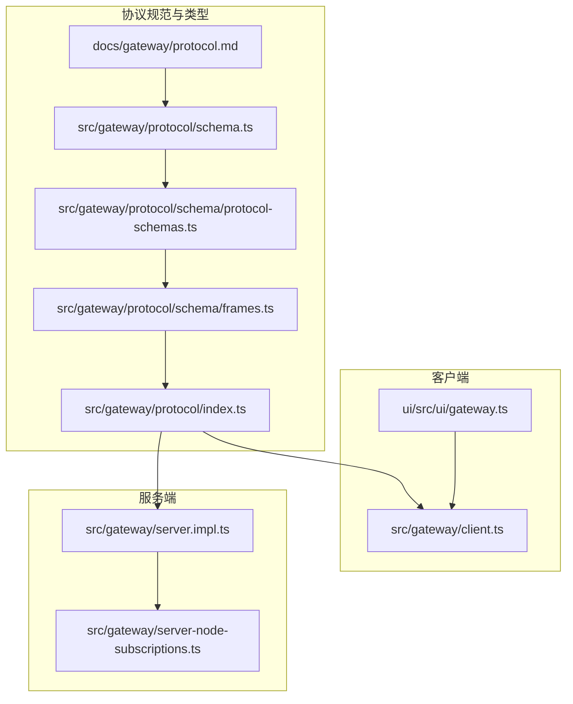
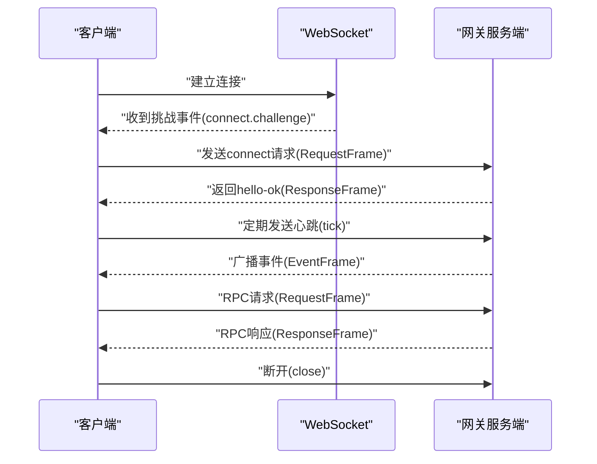
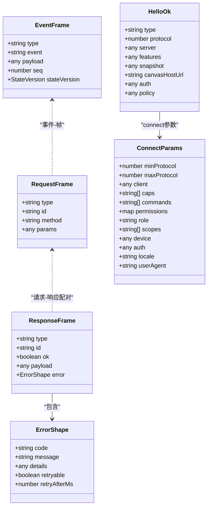
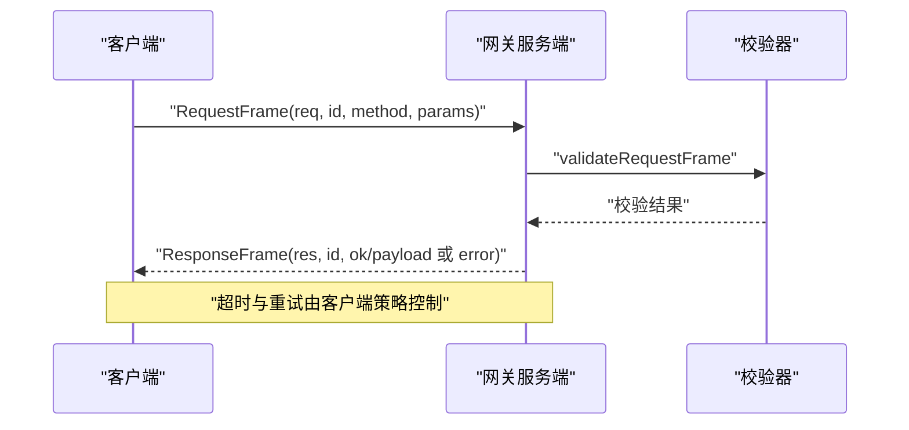
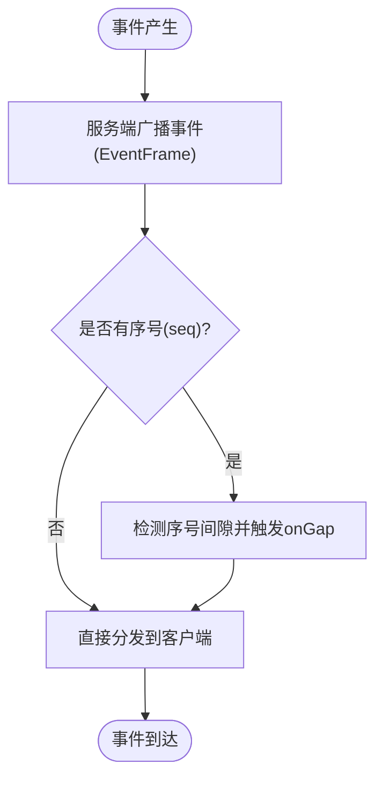
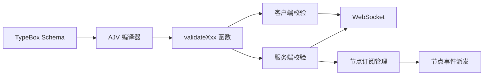

# 网关协议设计

<cite>
**本文引用的文件**
- [docs/gateway/protocol.md](file://docs/gateway/protocol.md)
- [src/gateway/protocol/schema.ts](file://src/gateway/protocol/schema.ts)
- [src/gateway/protocol/schema/protocol-schemas.ts](file://src/gateway/protocol/schema/protocol-schemas.ts)
- [src/gateway/protocol/schema/frames.ts](file://src/gateway/protocol/schema/frames.ts)
- [src/gateway/protocol/index.ts](file://src/gateway/protocol/index.ts)
- [src/gateway/client.ts](file://src/gateway/client.ts)
- [src/gateway/server.impl.ts](file://src/gateway/server.impl.ts)
- [src/gateway/server-node-subscriptions.ts](file://src/gateway/server-node-subscriptions.ts)
- [ui/src/ui/gateway.ts](file://ui/src/ui/gateway.ts)
- [src/gateway/test-helpers.server.ts](file://src/gateway/test-helpers.server.ts)
</cite>

## 目录

1. [引言](#引言)
2. [项目结构](#项目结构)
3. [核心组件](#核心组件)
4. [架构总览](#架构总览)
5. [详细组件分析](#详细组件分析)
6. [依赖关系分析](#依赖关系分析)
7. [性能考量](#性能考量)
8. [故障排查指南](#故障排查指南)
9. [结论](#结论)
10. [附录](#附录)

## 引言

本文件面向OpenClaw网关协议（WebSocket）的实现与使用，系统化阐述消息格式、帧结构、序列化与校验机制；解释协议版本管理与向后兼容策略；详解RPC请求-响应模型、错误处理与超时管理；说明事件推送机制（会话事件、节点事件、系统事件）及传输格式；并提供消息流图与示例路径，帮助开发者正确实现客户端与网关交互。同时给出协议扩展点与自定义方法的实现指南。

## 项目结构

OpenClaw的网关协议由“协议规范文档 + 类型定义 + 校验器 + 客户端 + 服务端”构成，核心文件分布如下：

- 协议规范：docs/gateway/protocol.md
- 协议类型与校验：src/gateway/protocol/\*
- 客户端实现：src/gateway/client.ts、ui/src/ui/gateway.ts
- 服务端实现：src/gateway/server.impl.ts 及配套运行时模块
- 节点订阅路由：src/gateway/server-node-subscriptions.ts

图表来源

- [docs/gateway/protocol.md](file://docs/gateway/protocol.md#L1-L222)
- [src/gateway/protocol/schema.ts](file://src/gateway/protocol/schema.ts#L1-L17)
- [src/gateway/protocol/schema/protocol-schemas.ts](file://src/gateway/protocol/schema/protocol-schemas.ts#L1-L267)
- [src/gateway/protocol/schema/frames.ts](file://src/gateway/protocol/schema/frames.ts#L1-L165)
- [src/gateway/protocol/index.ts](file://src/gateway/protocol/index.ts#L1-L603)
- [src/gateway/client.ts](file://src/gateway/client.ts#L1-L442)
- [src/gateway/server.impl.ts](file://src/gateway/server.impl.ts#L1-L667)
- [src/gateway/server-node-subscriptions.ts](file://src/gateway/server-node-subscriptions.ts#L1-L133)
- [ui/src/ui/gateway.ts](file://ui/src/ui/gateway.ts#L43-L313)

章节来源

- [docs/gateway/protocol.md](file://docs/gateway/protocol.md#L1-L222)
- [src/gateway/protocol/schema.ts](file://src/gateway/protocol/schema.ts#L1-L17)
- [src/gateway/protocol/schema/protocol-schemas.ts](file://src/gateway/protocol/schema/protocol-schemas.ts#L1-L267)
- [src/gateway/protocol/schema/frames.ts](file://src/gateway/protocol/schema/frames.ts#L1-L165)
- [src/gateway/protocol/index.ts](file://src/gateway/protocol/index.ts#L1-L603)
- [src/gateway/client.ts](file://src/gateway/client.ts#L1-L442)
- [src/gateway/server.impl.ts](file://src/gateway/server.impl.ts#L1-L667)
- [src/gateway/server-node-subscriptions.ts](file://src/gateway/server-node-subscriptions.ts#L1-L133)
- [ui/src/ui/gateway.ts](file://ui/src/ui/gateway.ts#L43-L313)

## 核心组件

- 帧与消息模型：RequestFrame、ResponseFrame、EventFrame，以及HelloOk、ConnectParams等
- 协议版本：PROTOCOL_VERSION常量与最小/最大协议范围协商
- 校验器：基于TypeBox Schema与AJV编译生成的验证函数
- 客户端：连接握手、重连退避、心跳检测、请求-响应管理、事件回调
- 服务端：WebSocket接入、广播/订阅、节点事件路由、维护定时任务
- 事件订阅：按会话维度对节点事件进行订阅与派发

章节来源

- [src/gateway/protocol/schema/frames.ts](file://src/gateway/protocol/schema/frames.ts#L126-L165)
- [src/gateway/protocol/schema/protocol-schemas.ts](file://src/gateway/protocol/schema/protocol-schemas.ts#L266-L266)
- [src/gateway/protocol/index.ts](file://src/gateway/protocol/index.ts#L227-L408)
- [src/gateway/client.ts](file://src/gateway/client.ts#L79-L442)
- [src/gateway/server.impl.ts](file://src/gateway/server.impl.ts#L476-L533)
- [src/gateway/server-node-subscriptions.ts](file://src/gateway/server-node-subscriptions.ts#L33-L133)

## 架构总览

下图展示客户端与服务端在WebSocket上的交互流程，包括握手、心跳、事件广播与RPC调用。

图表来源

- [docs/gateway/protocol.md](file://docs/gateway/protocol.md#L22-L90)
- [src/gateway/protocol/schema/frames.ts](file://src/gateway/protocol/schema/frames.ts#L126-L165)
- [src/gateway/client.ts](file://src/gateway/client.ts#L101-L286)
- [src/gateway/server.impl.ts](file://src/gateway/server.impl.ts#L476-L533)

## 详细组件分析

### 消息格式与帧结构

- 请求帧：type="req"，包含id、method、params
- 响应帧：type="res"，包含id、ok、payload或error
- 事件帧：type="event"，包含event、payload、可选seq与stateVersion
- 握手帧：connect请求与hello-ok响应
- 错误形状：包含code、message、details、retryable、retryAfterMs

图表来源

- [src/gateway/protocol/schema/frames.ts](file://src/gateway/protocol/schema/frames.ts#L126-L165)
- [src/gateway/protocol/schema/protocol-schemas.ts](file://src/gateway/protocol/schema/protocol-schemas.ts#L144-L264)

章节来源

- [src/gateway/protocol/schema/frames.ts](file://src/gateway/protocol/schema/frames.ts#L126-L165)
- [src/gateway/protocol/schema/protocol-schemas.ts](file://src/gateway/protocol/schema/protocol-schemas.ts#L144-L264)

### 协议版本管理与向后兼容

- 版本常量：PROTOCOL_VERSION=3
- 协商方式：客户端在connect.params中声明minProtocol/maxProtocol，服务端拒绝不匹配
- 兼容策略：仅当双方版本在彼此范围内时握手成功；否则拒绝连接
- 模型生成：通过TypeBox Schema与脚本生成TypeScript/Swift类型，确保跨语言一致性

章节来源

- [src/gateway/protocol/schema/protocol-schemas.ts](file://src/gateway/protocol/schema/protocol-schemas.ts#L266-L266)
- [docs/gateway/protocol.md](file://docs/gateway/protocol.md#L178-L186)

### 序列化与校验机制

- 类型定义：使用@sinclair/typebox定义Schema
- 校验器：AJV编译Schema为validateXxx函数，用于入站帧与参数的强类型校验
- 格式化错误：formatValidationErrors统一输出人类可读的校验错误信息

章节来源

- [src/gateway/protocol/index.ts](file://src/gateway/protocol/index.ts#L227-L408)

### RPC方法调用机制

- 请求-响应模式：客户端request()生成唯一id，服务端处理后回传同id的响应
- 错误处理：响应帧中的error字段携带错误码与消息；客户端reject对应Promise
- 超时管理：测试辅助工具提供超时控制，客户端内置心跳检测与连接退避
- 幂等键：重要副作用方法需提供幂等键（见协议规范）

图表来源

- [src/gateway/client.ts](file://src/gateway/client.ts#L415-L440)
- [src/gateway/protocol/index.ts](file://src/gateway/protocol/index.ts#L234-L236)

章节来源

- [src/gateway/client.ts](file://src/gateway/client.ts#L415-L440)
- [src/gateway/protocol/index.ts](file://src/gateway/protocol/index.ts#L234-L236)

### 事件推送机制

- 事件类型：系统事件（如心跳tick、关闭shutdown）、会话事件、节点事件
- 事件帧：包含event、payload、可选seq与stateVersion
- 心跳检测：服务端周期广播tick；客户端检测lastTick并在超时后主动断开
- 节点事件路由：服务端按会话维度订阅节点事件，支持向特定会话或全部订阅者广播

图表来源

- [src/gateway/client.ts](file://src/gateway/client.ts#L288-L336)
- [src/gateway/server-node-subscriptions.ts](file://src/gateway/server-node-subscriptions.ts#L100-L133)

章节来源

- [src/gateway/client.ts](file://src/gateway/client.ts#L288-L336)
- [src/gateway/server-node-subscriptions.ts](file://src/gateway/server-node-subscriptions.ts#L33-L133)

### 客户端实现要点

- 连接与握手：自动等待connect.challenge，签名设备身份后发送connect
- 重连与退避：失败后指数退避，上限30秒
- 心跳监控：根据hello-ok中的policy.tickIntervalMs设置心跳间隔
- 设备认证：支持设备指纹签名与设备令牌持久化
- 事件回调：onEvent接收事件帧；onHelloOk接收hello-ok

章节来源

- [src/gateway/client.ts](file://src/gateway/client.ts#L101-L286)
- [src/gateway/client.ts](file://src/gateway/client.ts#L369-L386)

### 服务端实现要点

- 启动与配置：解析运行时配置、加载插件、启动发现与维护任务
- WebSocket接入：attachGatewayWsHandlers挂载WS处理器与广播器
- 事件广播：支持按会话、按节点、全局广播，并具备丢弃过慢消息能力
- 方法注册：聚合基础方法与插件方法，统一暴露给客户端

章节来源

- [src/gateway/server.impl.ts](file://src/gateway/server.impl.ts#L157-L667)
- [src/gateway/server.impl.ts](file://src/gateway/server.impl.ts#L476-L533)

### 浏览器端客户端

- 与Node版客户端一致的消息模型与握手流程
- 提供onHello、onEvent、onClose、onGap等回调
- 支持connect队列与重连逻辑

章节来源

- [ui/src/ui/gateway.ts](file://ui/src/ui/gateway.ts#L43-L313)

### 协议示例与消息流

- 握手示例：connect.challenge事件与connect请求、hello-ok响应
- 节点示例：角色为node时的caps/commands/permissions声明
- 版本示例：minProtocol/maxProtocol=3
- 认证示例：设备签名与设备令牌

章节来源

- [docs/gateway/protocol.md](file://docs/gateway/protocol.md#L22-L125)

## 依赖关系分析

- 协议层依赖TypeBox Schema与AJV进行强类型校验
- 客户端依赖WebSocket库与设备身份/证书工具
- 服务端依赖插件系统、通道管理、节点注册与订阅管理
- 事件订阅管理器负责节点-会话映射与事件派发

图表来源

- [src/gateway/protocol/index.ts](file://src/gateway/protocol/index.ts#L227-L408)
- [src/gateway/client.ts](file://src/gateway/client.ts#L1-L442)
- [src/gateway/server.impl.ts](file://src/gateway/server.impl.ts#L1-L667)
- [src/gateway/server-node-subscriptions.ts](file://src/gateway/server-node-subscriptions.ts#L1-L133)

章节来源

- [src/gateway/protocol/index.ts](file://src/gateway/protocol/index.ts#L227-L408)
- [src/gateway/client.ts](file://src/gateway/client.ts#L1-L442)
- [src/gateway/server.impl.ts](file://src/gateway/server.impl.ts#L1-L667)
- [src/gateway/server-node-subscriptions.ts](file://src/gateway/server-node-subscriptions.ts#L1-L133)

## 性能考量

- 大负载：客户端允许较大消息体（如屏幕快照），避免频繁小包
- 心跳：根据policy.tickIntervalMs动态调整，避免空闲浪费
- 广播：对可能过慢的接收方可启用丢弃策略，保证整体吞吐
- 订阅：按会话粒度派发，减少不必要的广播

## 故障排查指南

- 连接失败：检查token/password、设备签名、TLS指纹；查看connect失败回调
- 协议不匹配：确认minProtocol/maxProtocol范围覆盖PROTOCOL_VERSION
- 超时问题：关注心跳(lastTick)与tickIntervalMs；必要时增大超时阈值
- 事件丢失：利用seq与onGap回调定位丢包区间
- 测试场景：使用测试辅助工具的超时与一次性消息捕获

章节来源

- [src/gateway/client.ts](file://src/gateway/client.ts#L101-L165)
- [src/gateway/client.ts](file://src/gateway/client.ts#L369-L386)
- [src/gateway/test-helpers.server.ts](file://src/gateway/test-helpers.server.ts#L257-L291)

## 结论

OpenClaw网关协议以WebSocket为基础，采用强类型Schema与AJV校验保障消息一致性；通过握手协商版本、心跳保活与事件订阅实现稳定可靠的控制面与节点传输。客户端与服务端均提供完善的错误处理与可观测性接口，便于扩展与排障。遵循本文档的实现与扩展指南，可安全地在新平台或新功能中复用该协议。

## 附录

### 协议扩展点与自定义方法实现指南

- 新增RPC方法
  - 在协议Schema中添加参数Schema与返回Schema
  - 在ProtocolSchemas中注册方法名与Schema
  - 在服务端方法列表中注册处理函数
  - 在客户端暴露request(method, params)调用入口
- 新增事件
  - 定义事件Schema与payload结构
  - 在服务端广播时使用统一事件命名空间
  - 在客户端onEvent中处理新增事件
- 版本升级
  - 提升PROTOCOL_VERSION并保持向后兼容
  - 在connect.params中声明新的min/max范围
  - 逐步淘汰旧Schema与兼容分支

章节来源

- [src/gateway/protocol/schema/protocol-schemas.ts](file://src/gateway/protocol/schema/protocol-schemas.ts#L144-L264)
- [src/gateway/protocol/schema/frames.ts](file://src/gateway/protocol/schema/frames.ts#L126-L165)
- [src/gateway/server.impl.ts](file://src/gateway/server.impl.ts#L231-L246)
- [src/gateway/protocol/index.ts](file://src/gateway/protocol/index.ts#L498-L502)
