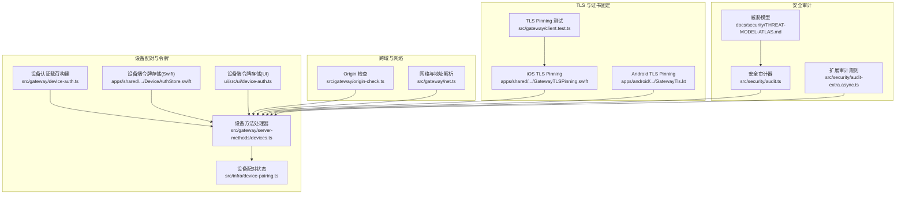
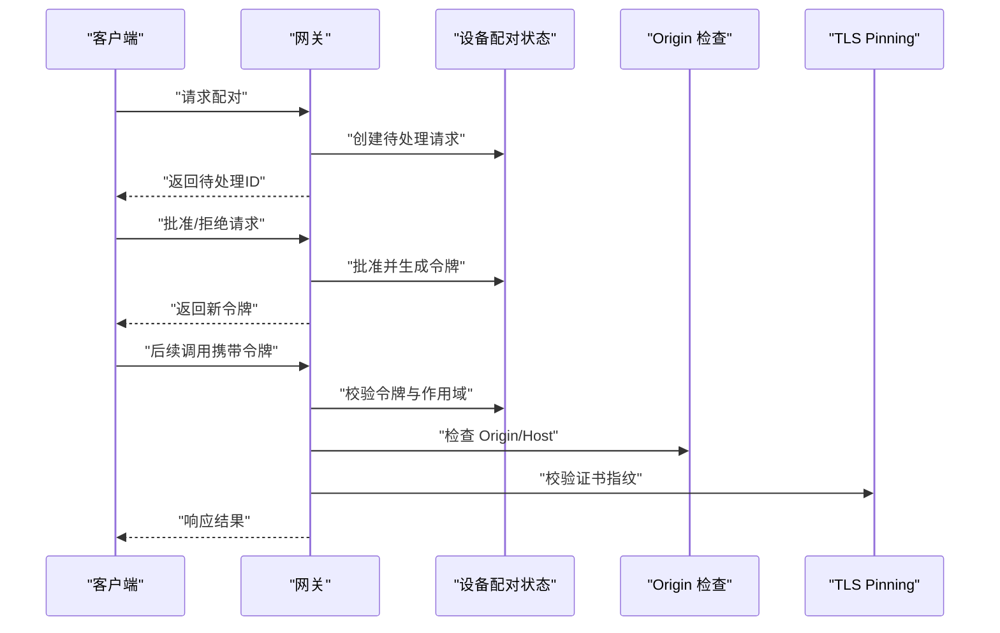
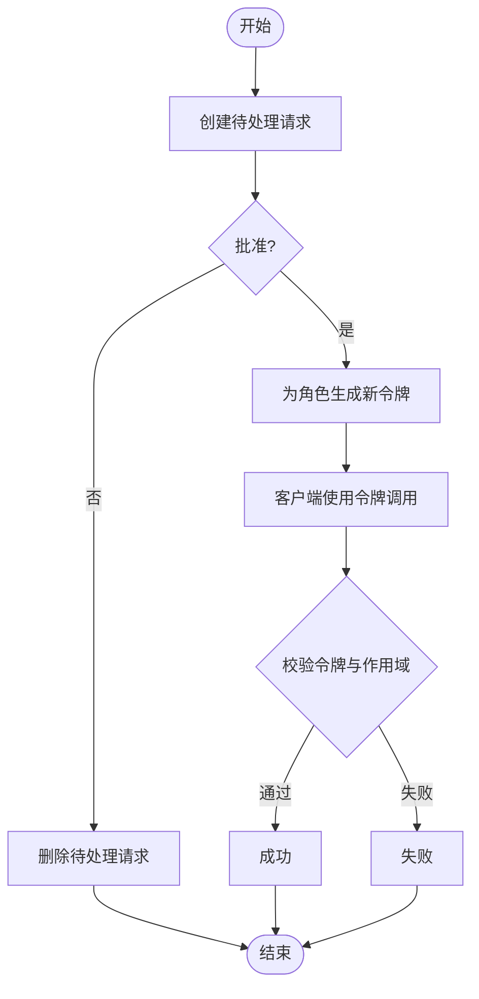
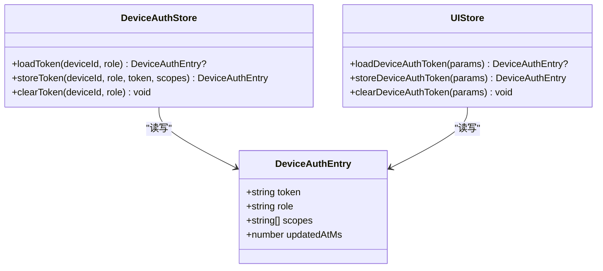
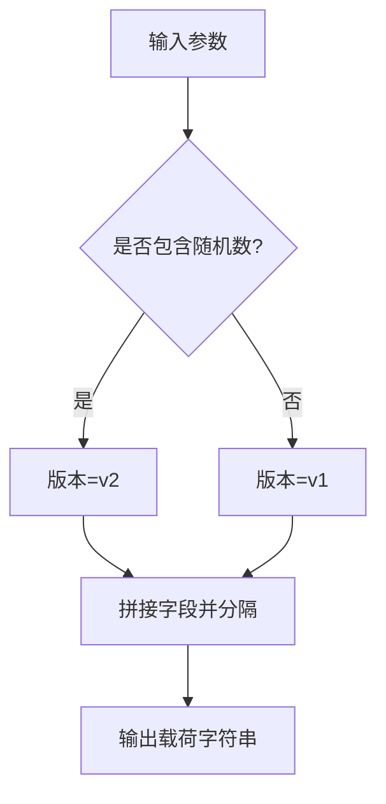
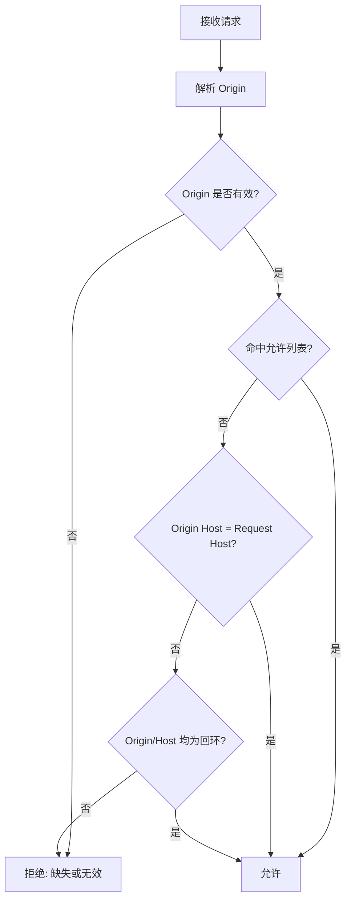
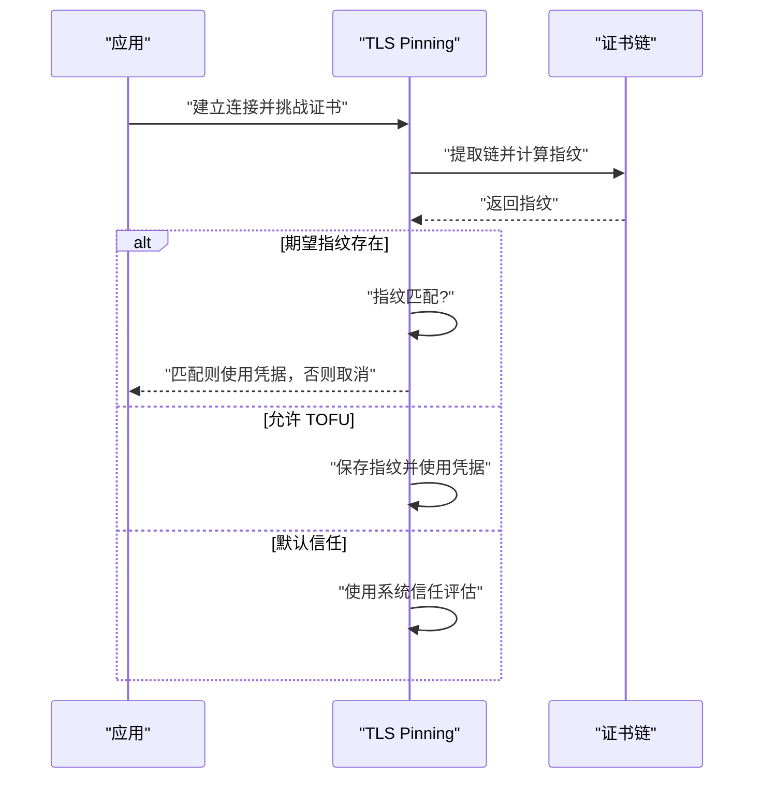
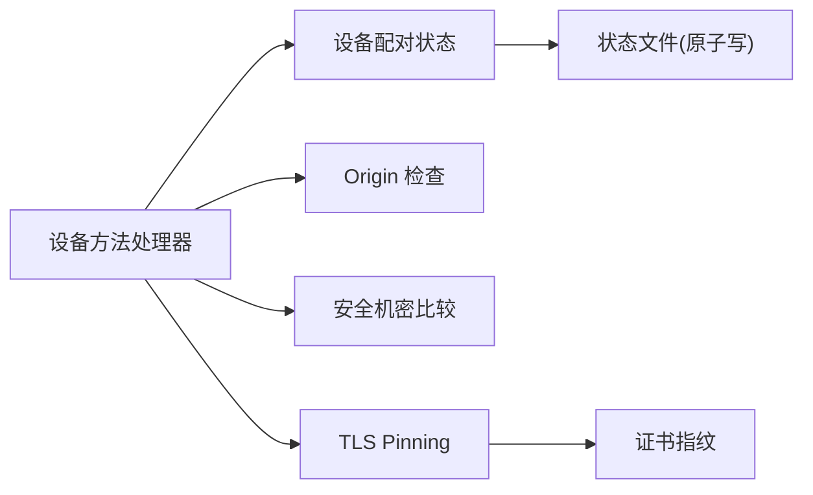

# 网关安全机制

<cite>
**本文引用的文件**
- [src/infra/device-pairing.ts](file://src/infra/device-pairing.ts)
- [src/gateway/server-methods/devices.ts](file://src/gateway/server-methods/devices.ts)
- [src/gateway/device-auth.ts](file://src/gateway/device-auth.ts)
- [apps/shared/OpenClawKit/Sources/OpenClawKit/DeviceAuthStore.swift](file://apps/shared/OpenClawKit/Sources/OpenClawKit/DeviceAuthStore.swift)
- [ui/src/ui/device-auth.ts](file://ui/src/ui/device-auth.ts)
- [src/gateway/origin-check.ts](file://src/gateway/origin-check.ts)
- [src/gateway/net.ts](file://src/gateway/net.ts)
- [src/security/secret-equal.ts](file://src/security/secret-equal.ts)
- [apps/shared/OpenClawKit/Sources/OpenClawKit/GatewayTLSPinning.swift](file://apps/shared/OpenClawKit/Sources/OpenClawKit/GatewayTLSPinning.swift)
- [apps/android/app/src/main/java/ai/openclaw/android/gateway/GatewayTls.kt](file://apps/android/app/src/main/java/ai/openclaw/android/gateway/GatewayTls.kt)
- [src/gateway/client.test.ts](file://src/gateway/client.test.ts)
- [docs/gateway/pairing.md](file://docs/gateway/pairing.md)
- [docs/gateway/authentication.md](file://docs/gateway/authentication.md)
- [docs/security/README.md](file://docs/security/README.md)
- [docs/security/THREAT-MODEL-ATLAS.md](file://docs/security/THREAT-MODEL-ATLAS.md)
- [src/security/audit.ts](file://src/security/audit.ts)
- [src/security/audit.test.ts](file://src/security/audit.test.ts)
- [src/security/audit-extra.async.ts](file://src/security/audit-extra.async.ts)
- [src/commands/status.command.ts](file://src/commands/status.command.ts)
</cite>

## 目录

1. [引言](#引言)
2. [项目结构](#项目结构)
3. [核心组件](#核心组件)
4. [架构总览](#架构总览)
5. [详细组件分析](#详细组件分析)
6. [依赖关系分析](#依赖关系分析)
7. [性能考量](#性能考量)
8. [故障排查指南](#故障排查指南)
9. [结论](#结论)
10. [附录](#附录)

## 引言

本文件系统化梳理 OpenClaw 网关的安全机制，覆盖设备配对与认证、身份验证体系、本地信任模型、Origin 检查、证书固定与加密通信、审计与合规等主题。文档面向开发者与运维人员，既提供代码级实现细节，也给出可操作的安全配置建议与最佳实践。

## 项目结构

围绕“安全”的关键目录与文件：

- 设备配对与令牌管理：src/infra/device-pairing.ts、src/gateway/server-methods/devices.ts
- 设备端令牌存储与构建：apps/shared/OpenClawKit/Sources/OpenClawKit/DeviceAuthStore.swift、ui/src/ui/device-auth.ts、src/gateway/device-auth.ts
- 跨域与 Origin 校验：src/gateway/origin-check.ts、src/gateway/net.ts
- 机密比较与安全常量：src/security/secret-equal.ts
- 证书固定与 TLS Pinning：apps/shared/OpenClawKit/Sources/OpenClawKit/GatewayTLSPinning.swift、apps/android/app/src/main/java/ai/openclaw/android/gateway/GatewayTls.kt、src/gateway/client.test.ts
- 安全审计与威胁建模：src/security/audit.ts、src/security/audit.test.ts、src/security/audit-extra.async.ts、docs/security/THREAT-MODEL-ATLAS.md、docs/security/README.md
- 文档参考：docs/gateway/pairing.md、docs/gateway/authentication.md

图表来源

- [src/infra/device-pairing.ts](file://src/infra/device-pairing.ts#L1-L560)
- [src/gateway/server-methods/devices.ts](file://src/gateway/server-methods/devices.ts#L32-L190)
- [src/gateway/device-auth.ts](file://src/gateway/device-auth.ts#L1-L32)
- [apps/shared/OpenClawKit/Sources/OpenClawKit/DeviceAuthStore.swift](file://apps/shared/OpenClawKit/Sources/OpenClawKit/DeviceAuthStore.swift#L1-L30)
- [ui/src/ui/device-auth.ts](file://ui/src/ui/device-auth.ts#L64-L119)
- [src/gateway/origin-check.ts](file://src/gateway/origin-check.ts#L1-L72)
- [src/gateway/net.ts](file://src/gateway/net.ts#L1-L275)
- [apps/shared/OpenClawKit/Sources/OpenClawKit/GatewayTLSPinning.swift](file://apps/shared/OpenClawKit/Sources/OpenClawKit/GatewayTLSPinning.swift#L1-L119)
- [apps/android/app/src/main/java/ai/openclaw/android/gateway/GatewayTls.kt](file://apps/android/app/src/main/java/ai/openclaw/android/gateway/GatewayTls.kt#L1-L75)
- [src/gateway/client.test.ts](file://src/gateway/client.test.ts#L82-L103)
- [src/security/audit.ts](file://src/security/audit.ts#L88-L978)
- [src/security/audit-extra.async.ts](file://src/security/audit-extra.async.ts#L436-L545)
- [docs/security/THREAT-MODEL-ATLAS.md](file://docs/security/THREAT-MODEL-ATLAS.md#L154-L180)

章节来源

- [src/infra/device-pairing.ts](file://src/infra/device-pairing.ts#L1-L560)
- [src/gateway/server-methods/devices.ts](file://src/gateway/server-methods/devices.ts#L32-L190)
- [src/gateway/device-auth.ts](file://src/gateway/device-auth.ts#L1-L32)
- [apps/shared/OpenClawKit/Sources/OpenClawKit/DeviceAuthStore.swift](file://apps/shared/OpenClawKit/Sources/OpenClawKit/DeviceAuthStore.swift#L1-L30)
- [ui/src/ui/device-auth.ts](file://ui/src/ui/device-auth.ts#L64-L119)
- [src/gateway/origin-check.ts](file://src/gateway/origin-check.ts#L1-L72)
- [src/gateway/net.ts](file://src/gateway/net.ts#L1-L275)
- [apps/shared/OpenClawKit/Sources/OpenClawKit/GatewayTLSPinning.swift](file://apps/shared/OpenClawKit/Sources/OpenClawKit/GatewayTLSPinning.swift#L1-L119)
- [apps/android/app/src/main/java/ai/openclaw/android/gateway/GatewayTls.kt](file://apps/android/app/src/main/java/ai/openclaw/android/gateway/GatewayTls.kt#L1-L75)
- [src/gateway/client.test.ts](file://src/gateway/client.test.ts#L82-L103)
- [src/security/audit.ts](file://src/security/audit.ts#L88-L978)
- [src/security/audit-extra.async.ts](file://src/security/audit-extra.async.ts#L436-L545)
- [docs/security/THREAT-MODEL-ATLAS.md](file://docs/security/THREAT-MODEL-ATLAS.md#L154-L180)

## 核心组件

- 设备配对与令牌生命周期：请求、批准、轮换、吊销、校验
- 设备端令牌存储与加载：多平台本地持久化
- 双向认证载荷构建：版本化、签名参数、随机数
- Origin 检查：允许列表、主机头匹配、回环地址放宽
- TLS Pinning：证书指纹比对、首次信任（TOFU）策略、平台适配
- 安全审计：配置风险、权限问题、日志策略、通道暴露面

章节来源

- [src/infra/device-pairing.ts](file://src/infra/device-pairing.ts#L256-L363)
- [src/gateway/server-methods/devices.ts](file://src/gateway/server-methods/devices.ts#L32-L190)
- [apps/shared/OpenClawKit/Sources/OpenClawKit/DeviceAuthStore.swift](file://apps/shared/OpenClawKit/Sources/OpenClawKit/DeviceAuthStore.swift#L1-L30)
- [ui/src/ui/device-auth.ts](file://ui/src/ui/device-auth.ts#L64-L119)
- [src/gateway/device-auth.ts](file://src/gateway/device-auth.ts#L1-L32)
- [src/gateway/origin-check.ts](file://src/gateway/origin-check.ts#L43-L71)
- [apps/shared/OpenClawKit/Sources/OpenClawKit/GatewayTLSPinning.swift](file://apps/shared/OpenClawKit/Sources/OpenClawKit/GatewayTLSPinning.swift#L5-L119)
- [apps/android/app/src/main/java/ai/openclaw/android/gateway/GatewayTls.kt](file://apps/android/app/src/main/java/ai/openclaw/android/gateway/GatewayTls.kt#L14-L75)
- [src/security/audit.ts](file://src/security/audit.ts#L88-L978)

## 架构总览

下图展示从客户端到网关的关键安全交互路径：设备配对、令牌签发与校验、Origin 检查、TLS Pinning。

图表来源

- [src/gateway/server-methods/devices.ts](file://src/gateway/server-methods/devices.ts#L32-L190)
- [src/infra/device-pairing.ts](file://src/infra/device-pairing.ts#L256-L363)
- [src/gateway/origin-check.ts](file://src/gateway/origin-check.ts#L43-L71)
- [apps/shared/OpenClawKit/Sources/OpenClawKit/GatewayTLSPinning.swift](file://apps/shared/OpenClawKit/Sources/OpenClawKit/GatewayTLSPinning.swift#L5-L119)

## 详细组件分析

### 设备配对与令牌管理

- 配对流程
  - 请求：创建待处理请求并记录设备公钥、角色、作用域等元信息
  - 批准：合并角色与作用域，为指定角色生成新令牌；令牌轮换策略确保重连后生效
  - 拒绝：清理待处理请求
  - 元数据更新：支持动态合并角色与作用域
- 令牌校验
  - 校验设备已配对、角色存在、令牌未吊销、机密比较安全相等、请求作用域被授权
  - 使用原子锁保证并发一致性
- 令牌生命周期
  - 生成：按需生成新令牌
  - 轮换：支持按角色轮换并同步更新作用域
  - 吊销：标记撤销时间戳，后续校验失败

图表来源

- [src/infra/device-pairing.ts](file://src/infra/device-pairing.ts#L256-L363)
- [src/infra/device-pairing.ts](file://src/infra/device-pairing.ts#L411-L449)
- [src/infra/device-pairing.ts](file://src/infra/device-pairing.ts#L451-L491)
- [src/infra/device-pairing.ts](file://src/infra/device-pairing.ts#L493-L531)
- [src/infra/device-pairing.ts](file://src/infra/device-pairing.ts#L533-L559)

章节来源

- [src/infra/device-pairing.ts](file://src/infra/device-pairing.ts#L256-L363)
- [src/infra/device-pairing.ts](file://src/infra/device-pairing.ts#L411-L449)
- [src/infra/device-pairing.ts](file://src/infra/device-pairing.ts#L451-L491)
- [src/infra/device-pairing.ts](file://src/infra/device-pairing.ts#L493-L531)
- [src/infra/device-pairing.ts](file://src/infra/device-pairing.ts#L533-L559)
- [src/gateway/server-methods/devices.ts](file://src/gateway/server-methods/devices.ts#L32-L190)

### 设备端令牌存储与加载

- 多平台本地存储
  - iOS：DeviceAuthStore.swift 将令牌按角色持久化，支持读取/写入/清理
  - Web/UI：ui/src/ui/device-auth.ts 提供读取、存储、清理接口
- 存储结构
  - 版本号、设备ID、令牌条目（含角色、作用域、更新时间）
- 加载与使用
  - 以设备ID与角色为键检索令牌，校验有效性后用于后续请求

图表来源

- [apps/shared/OpenClawKit/Sources/OpenClawKit/DeviceAuthStore.swift](file://apps/shared/OpenClawKit/Sources/OpenClawKit/DeviceAuthStore.swift#L1-L30)
- [ui/src/ui/device-auth.ts](file://ui/src/ui/device-auth.ts#L64-L119)

章节来源

- [apps/shared/OpenClawKit/Sources/OpenClawKit/DeviceAuthStore.swift](file://apps/shared/OpenClawKit/Sources/OpenClawKit/DeviceAuthStore.swift#L1-L30)
- [ui/src/ui/device-auth.ts](file://ui/src/ui/device-auth.ts#L64-L119)

### 双向认证载荷构建

- 载荷字段
  - 版本、设备ID、客户端ID、客户端模式、角色、作用域集合、签名时间、令牌、可选随机数
- 版本策略
  - v1：无随机数
  - v2：包含随机数，增强抗重放能力
- 用途
  - 设备端基于载荷生成签名，网关侧进行解析与校验

图表来源

- [src/gateway/device-auth.ts](file://src/gateway/device-auth.ts#L13-L31)

章节来源

- [src/gateway/device-auth.ts](file://src/gateway/device-auth.ts#L1-L32)

### 身份验证体系（API密钥、设备令牌、会话安全）

- API 密钥管理
  - 文档说明了在网关主机上设置与使用模型提供商 API 密钥的最佳实践
  - 建议通过环境变量或守护进程配置文件存放敏感凭据
- 设备令牌验证
  - 严格校验：设备配对、角色存在、令牌未吊销、机密安全比较、作用域授权
  - 并发安全：原子锁保护状态文件读写
- 会话安全
  - 令牌轮换与吊销机制降低泄露影响
  - 作用域最小化与按需授权

章节来源

- [docs/gateway/authentication.md](file://docs/gateway/authentication.md#L1-L146)
- [src/infra/device-pairing.ts](file://src/infra/device-pairing.ts#L411-L449)
- [src/security/secret-equal.ts](file://src/security/secret-equal.ts#L3-L16)

### 本地信任模型（白名单、权限控制、访问限制）

- 设备白名单
  - 仅已配对设备可获得令牌；未配对设备无法通过令牌校验
- 权限控制
  - 角色与作用域分离，令牌仅授予被授权的作用域
  - 支持动态合并角色与作用域
- 访问限制
  - 待处理请求 TTL 与自动清理
  - 令牌撤销与轮换策略

章节来源

- [src/infra/device-pairing.ts](file://src/infra/device-pairing.ts#L69-L117)
- [src/infra/device-pairing.ts](file://src/infra/device-pairing.ts#L297-L347)
- [src/infra/device-pairing.ts](file://src/infra/device-pairing.ts#L533-L559)

### Origin 检查机制（跨域与 CSRF 防护）

- 核心逻辑
  - 解析 Origin，标准化 host/hostname
  - 允许列表命中优先
  - 与请求 Host 匹配
  - 回环地址放宽（Origin 与请求 Host 均为回环）
- 防护效果
  - 阻止跨域脚本发起请求
  - 降低 CSRF 风险

图表来源

- [src/gateway/origin-check.ts](file://src/gateway/origin-check.ts#L24-L71)
- [src/gateway/net.ts](file://src/gateway/net.ts#L263-L275)

章节来源

- [src/gateway/origin-check.ts](file://src/gateway/origin-check.ts#L1-L72)
- [src/gateway/net.ts](file://src/gateway/net.ts#L263-L275)

### TLS Pinning 与加密通信

- iOS 实现
  - 支持期望指纹精确匹配；若未设置且允许 TOFU，则首次信任并保存指纹
  - 证书链提取与 SHA-256 指纹计算
- Android 实现
  - 自定义 X509TrustManager，支持指纹比对与 TOFU 存储回调
- 测试保障
  - 单元测试覆盖指纹不匹配时拒绝握手场景

图表来源

- [apps/shared/OpenClawKit/Sources/OpenClawKit/GatewayTLSPinning.swift](file://apps/shared/OpenClawKit/Sources/OpenClawKit/GatewayTLSPinning.swift#L5-L119)
- [apps/android/app/src/main/java/ai/openclaw/android/gateway/GatewayTls.kt](file://apps/android/app/src/main/java/ai/openclaw/android/gateway/GatewayTls.kt#L27-L67)
- [src/gateway/client.test.ts](file://src/gateway/client.test.ts#L82-L103)

章节来源

- [apps/shared/OpenClawKit/Sources/OpenClawKit/GatewayTLSPinning.swift](file://apps/shared/OpenClawKit/Sources/OpenClawKit/GatewayTLSPinning.swift#L1-L119)
- [apps/android/app/src/main/java/ai/openclaw/android/gateway/GatewayTls.kt](file://apps/android/app/src/main/java/ai/openclaw/android/gateway/GatewayTls.kt#L1-L75)
- [src/gateway/client.test.ts](file://src/gateway/client.test.ts#L82-L103)

### 安全配置指南与最佳实践

- 配置与凭据
  - 在网关主机上设置模型提供商 API 密钥，优先使用守护进程可读的配置文件
  - 避免在命令行历史中暴露密钥
- 日志与审计
  - 启用敏感信息脱敏；避免将日志文件暴露给其他用户
  - 审计器检测文件权限问题与通道配置风险
- 网络与绑定
  - 绑定策略选择：回环、局域网、Tailnet、自动、自定义
  - 控制 UI 仅在受保护网络或启用鉴权时开放
- 通道与访问控制
  - DM/群组策略：默认“配对”，可切换为白名单或禁用
  - 严格限制“开放”策略，避免任意发送者进入

章节来源

- [docs/gateway/authentication.md](file://docs/gateway/authentication.md#L18-L96)
- [src/security/audit.ts](file://src/security/audit.ts#L962-L978)
- [src/security/audit-extra.async.ts](file://src/security/audit-extra.async.ts#L436-L545)
- [docs/gateway/configuration-reference.md](file://docs/gateway/configuration-reference.md#L18-L40)

### 威胁与缓解

- 威胁模型要点
  - 设备配对码拦截：30 秒宽限期与渠道发送的现有缓解
  - 渠道集成探测：建议响应时间随机化
- 缓解建议
  - 缩短配对宽限期、增加确认步骤
  - 对外暴露通道默认采用更严格的策略

章节来源

- [docs/security/THREAT-MODEL-ATLAS.md](file://docs/security/THREAT-MODEL-ATLAS.md#L154-L180)

## 依赖关系分析

- 组件耦合
  - 设备方法处理器依赖设备配对状态与 Origin 检查
  - 设备端存储与网关令牌校验配合完成双向认证
  - TLS Pinning 与网络层共同保障传输安全
- 外部依赖
  - 平台证书库（iOS/macOS/Android）用于信任评估
  - 文件系统权限与守护进程环境用于凭据安全

图表来源

- [src/gateway/server-methods/devices.ts](file://src/gateway/server-methods/devices.ts#L32-L190)
- [src/infra/device-pairing.ts](file://src/infra/device-pairing.ts#L90-L106)
- [src/security/secret-equal.ts](file://src/security/secret-equal.ts#L3-L16)
- [apps/shared/OpenClawKit/Sources/OpenClawKit/GatewayTLSPinning.swift](file://apps/shared/OpenClawKit/Sources/OpenClawKit/GatewayTLSPinning.swift#L90-L96)

章节来源

- [src/gateway/server-methods/devices.ts](file://src/gateway/server-methods/devices.ts#L32-L190)
- [src/infra/device-pairing.ts](file://src/infra/device-pairing.ts#L90-L106)
- [src/security/secret-equal.ts](file://src/security/secret-equal.ts#L3-L16)
- [apps/shared/OpenClawKit/Sources/OpenClawKit/GatewayTLSPinning.swift](file://apps/shared/OpenClawKit/Sources/OpenClawKit/GatewayTLSPinning.swift#L90-L96)

## 性能考量

- 并发与一致性
  - 配对状态使用原子锁串行化读写，避免竞态
- 锁定与 I/O
  - 状态文件采用临时文件写入与原子重命名，减少部分写入风险
- 校验复杂度
  - 令牌校验为 O(1) 查表与 O(n) 作用域集合判定，n 通常较小

章节来源

- [src/infra/device-pairing.ts](file://src/infra/device-pairing.ts#L119-L132)
- [src/infra/device-pairing.ts](file://src/infra/device-pairing.ts#L90-L106)
- [src/infra/device-pairing.ts](file://src/infra/device-pairing.ts#L224-L233)

## 故障排查指南

- 常见问题定位
  - 设备未配对：令牌校验返回“设备未配对”
  - 角色缺失：令牌校验返回“角色缺失”
  - 令牌不匹配：安全机密比较失败
  - 作用域不足：请求作用域超出授权范围
  - Origin 不允许：浏览器 Origin 检查失败
  - TLS 指纹不匹配：客户端拒绝握手
- 审计与诊断
  - 使用安全审计命令查看严重性汇总与修复建议
  - 检查文件权限、日志级别、通道策略

章节来源

- [src/infra/device-pairing.ts](file://src/infra/device-pairing.ts#L411-L449)
- [src/gateway/origin-check.ts](file://src/gateway/origin-check.ts#L43-L71)
- [src/gateway/client.test.ts](file://src/gateway/client.test.ts#L82-L103)
- [src/commands/status.command.ts](file://src/commands/status.command.ts#L419-L454)
- [src/security/audit.ts](file://src/security/audit.ts#L88-L127)

## 结论

OpenClaw 网关通过“设备配对 + 令牌校验 + Origin 检查 + TLS Pinning + 安全审计”的组合，构建了端到端的安全框架。建议在生产环境中遵循最小权限、严格凭据管理、最小暴露面与持续审计的原则，以进一步降低风险。

## 附录

- 相关文档
  - 设备配对流程与 API 表面：docs/gateway/pairing.md
  - 模型认证与凭据管理：docs/gateway/authentication.md
  - 安全与威胁建模：docs/security/README.md、docs/security/THREAT-MODEL-ATLAS.md

章节来源

- [docs/gateway/pairing.md](file://docs/gateway/pairing.md#L1-L100)
- [docs/gateway/authentication.md](file://docs/gateway/authentication.md#L1-L146)
- [docs/security/README.md](file://docs/security/README.md#L1-L18)
- [docs/security/THREAT-MODEL-ATLAS.md](file://docs/security/THREAT-MODEL-ATLAS.md#L154-L180)
