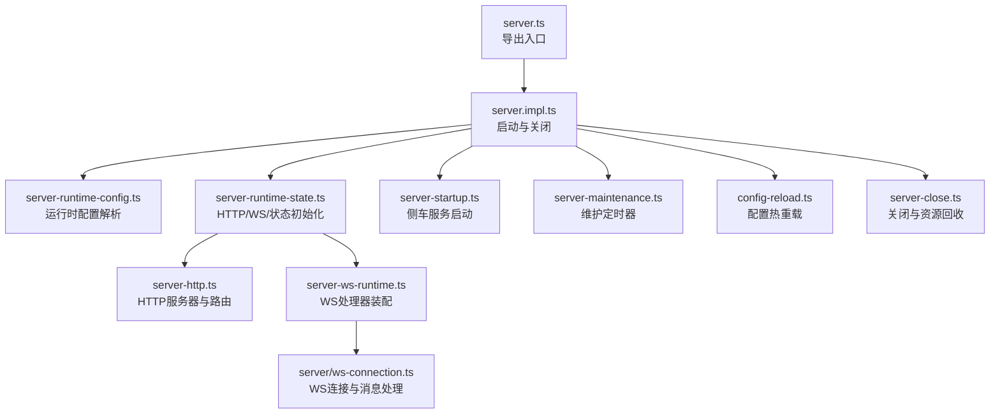
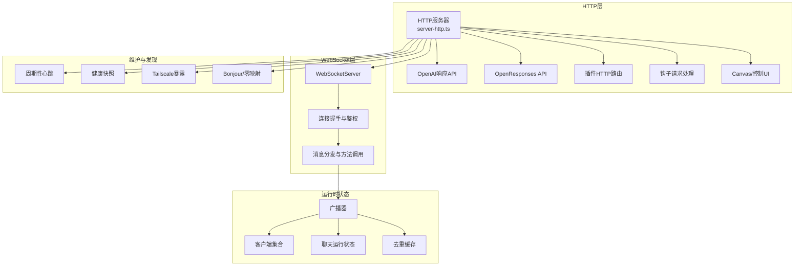
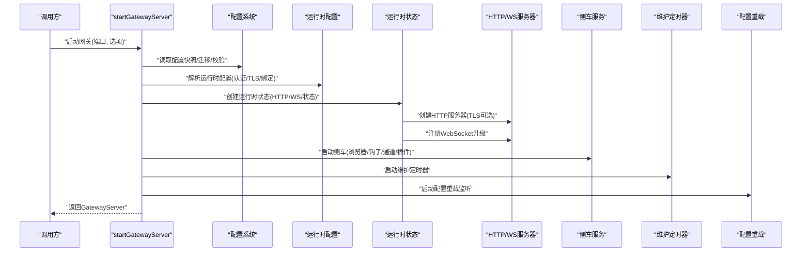
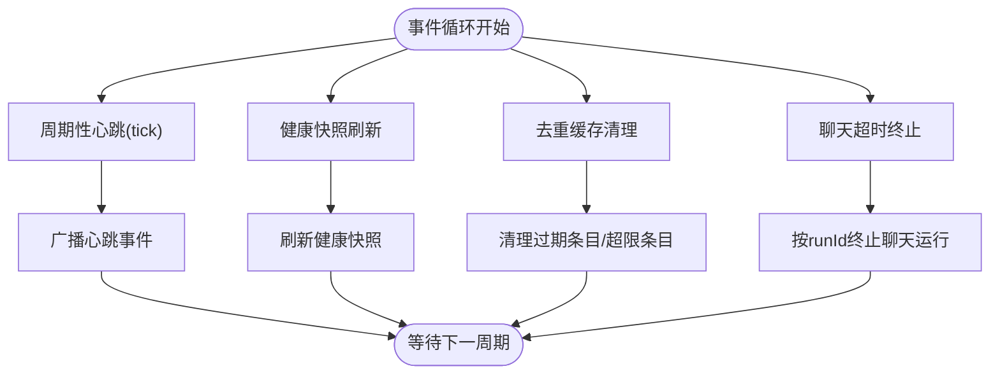
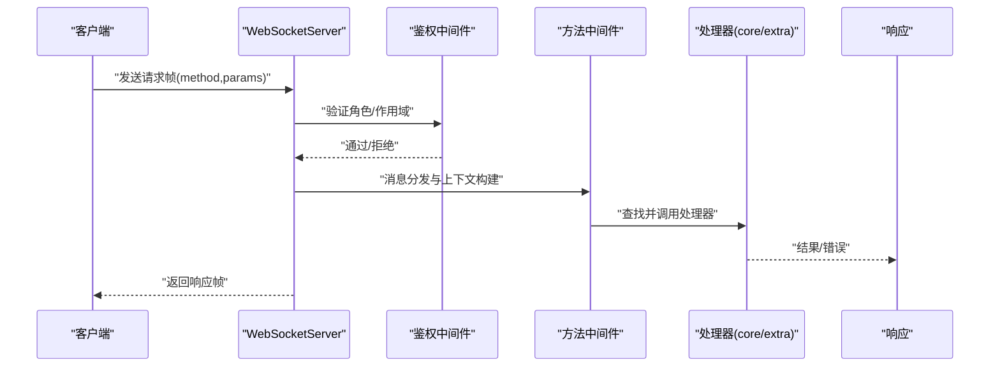
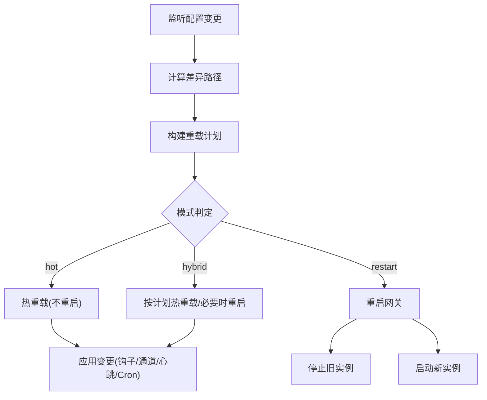
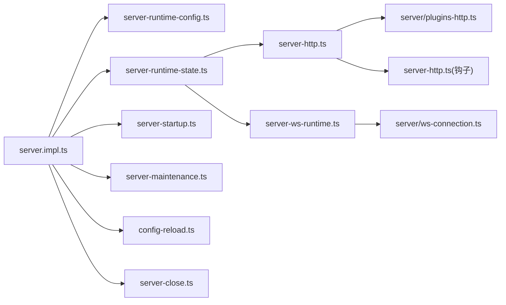

# 网关服务器实现

<cite>
**本文档引用的文件**
- [src/gateway/server.impl.ts](file://src/gateway/server.impl.ts)
- [src/gateway/server.ts](file://src/gateway/server.ts)
- [src/gateway/server-startup.ts](file://src/gateway/server-startup.ts)
- [src/gateway/server-runtime-config.ts](file://src/gateway/server-runtime-config.ts)
- [src/gateway/server-runtime-state.ts](file://src/gateway/server-runtime-state.ts)
- [src/gateway/server-ws-runtime.ts](file://src/gateway/server-ws-runtime.ts)
- [src/gateway/server/ws-connection.ts](file://src/gateway/server/ws-connection.ts)
- [src/gateway/server-methods.ts](file://src/gateway/server-methods.ts)
- [src/gateway/server-http.ts](file://src/gateway/server-http.ts)
- [src/gateway/server-maintenance.ts](file://src/gateway/server-maintenance.ts)
- [src/gateway/server-close.ts](file://src/gateway/server-close.ts)
- [src/gateway/server-constants.ts](file://src/gateway/server-constants.ts)
- [src/gateway/server/plugins-http.ts](file://src/gateway/server/plugins-http.ts)
- [src/gateway/config-reload.ts](file://src/gateway/config-reload.ts)
</cite>

## 目录

1. [引言](#引言)
2. [项目结构](#项目结构)
3. [核心组件](#核心组件)
4. [架构总览](#架构总览)
5. [详细组件分析](#详细组件分析)
6. [依赖关系分析](#依赖关系分析)
7. [性能考虑](#性能考虑)
8. [故障排除指南](#故障排除指南)
9. [结论](#结论)

## 引言

本文件面向OpenClaw网关服务器的实现，系统性梳理其启动流程、初始化顺序、依赖注入、配置加载；深入解析服务器架构（事件循环、异步处理、内存管理）；阐述RPC处理器、中间件链与错误处理；说明服务器状态管理（运行时配置、动态更新、热重载）；并提供配置选项、监控与调试工具、故障排除方法。目标是帮助开发者快速理解并高效运维该网关。

## 项目结构

OpenClaw网关位于src/gateway目录下，采用“按职责分层”的模块化组织方式：

- 启动与生命周期：server.ts导出入口，server.impl.ts实现启动与关闭流程
- 运行时配置与状态：server-runtime-config.ts解析运行时配置；server-runtime-state.ts构建HTTP/WebSocket服务与全局状态
- 事件循环与维护：server-maintenance.ts定时任务；server-close.ts统一关闭流程
- RPC与方法处理：server-methods.ts聚合核心方法处理器；server.ws-connection.ts处理WS消息
- 插件与HTTP：server/plugins-http.ts处理插件HTTP路由；server-http.ts整合各类HTTP端点
- 配置热重载：config-reload.ts提供变更检测与热重载策略

图表来源

- [src/gateway/server.ts](file://src/gateway/server.ts#L1-L4)
- [src/gateway/server.impl.ts](file://src/gateway/server.impl.ts#L157-L667)
- [src/gateway/server-runtime-config.ts](file://src/gateway/server-runtime-config.ts#L32-L121)
- [src/gateway/server-runtime-state.ts](file://src/gateway/server-runtime-state.ts#L29-L211)
- [src/gateway/server-http.ts](file://src/gateway/server-http.ts#L363-L515)
- [src/gateway/server-ws-runtime.ts](file://src/gateway/server-ws-runtime.ts#L8-L50)
- [src/gateway/server/ws-connection.ts](file://src/gateway/server/ws-connection.ts#L19-L267)
- [src/gateway/server-startup.ts](file://src/gateway/server-startup.ts#L27-L166)
- [src/gateway/server-maintenance.ts](file://src/gateway/server-maintenance.ts#L14-L124)
- [src/gateway/config-reload.ts](file://src/gateway/config-reload.ts#L249-L382)
- [src/gateway/server-close.ts](file://src/gateway/server-close.ts#L9-L129)

章节来源

- [src/gateway/server.ts](file://src/gateway/server.ts#L1-L4)
- [src/gateway/server.impl.ts](file://src/gateway/server.impl.ts#L1-L667)

## 核心组件

- 启动器与生命周期
  - 入口导出：GatewayServer接口与startGatewayServer函数
  - 初始化顺序：配置读取与迁移、插件自动启用、运行时配置解析、HTTP/WS服务创建、侧车服务启动、维护定时器、发现与暴露、热重载监听、关闭钩子注册
- 运行时配置
  - 解析bind模式、控制UI、OpenAI/响应API开关、认证、Tailscale、钩子与画布主机等
- 运行时状态
  - 构建HTTP服务器（支持TLS）、WebSocket升级、客户端集合、广播器、聊天运行状态、去重缓存、工具事件接收者
- 方法与中间件
  - 聚合核心方法处理器，基于角色与作用域进行授权，支持插件扩展与额外处理器
- 维护与关闭
  - 周期性心跳、健康快照刷新、去重清理、聊天超时终止；优雅关闭所有资源

章节来源

- [src/gateway/server.ts](file://src/gateway/server.ts#L1-L4)
- [src/gateway/server.impl.ts](file://src/gateway/server.impl.ts#L157-L667)
- [src/gateway/server-runtime-config.ts](file://src/gateway/server-runtime-config.ts#L32-L121)
- [src/gateway/server-runtime-state.ts](file://src/gateway/server-runtime-state.ts#L29-L211)
- [src/gateway/server-methods.ts](file://src/gateway/server-methods.ts#L165-L220)
- [src/gateway/server-maintenance.ts](file://src/gateway/server-maintenance.ts#L14-L124)
- [src/gateway/server-close.ts](file://src/gateway/server-close.ts#L9-L129)

## 架构总览

网关采用“单进程多服务器”架构：一个HTTP服务器（可选HTTPS）承载多种HTTP端点；多个WebSocket服务器实例在HTTP升级后建立连接；通过广播器与订阅管理器实现事件分发；插件体系提供扩展能力；维护定时器保障健康与会话清理。

图表来源

- [src/gateway/server-http.ts](file://src/gateway/server-http.ts#L363-L515)
- [src/gateway/server-ws-runtime.ts](file://src/gateway/server-ws-runtime.ts#L8-L50)
- [src/gateway/server/ws-connection.ts](file://src/gateway/server/ws-connection.ts#L19-L267)
- [src/gateway/server-runtime-state.ts](file://src/gateway/server-runtime-state.ts#L29-L211)
- [src/gateway/server-maintenance.ts](file://src/gateway/server-maintenance.ts#L14-L124)

## 详细组件分析

### 启动流程与初始化顺序

- 环境与日志：记录接受的环境变量，确保CLI可用
- 配置读取与迁移：读取配置快照，处理遗留项迁移与写回；校验配置有效性
- 插件自动启用：根据环境变量应用插件自动启用策略并持久化
- 运行时配置解析：合并用户覆盖与配置，断言认证与Tailscale约束
- 运行时状态创建：构建HTTP服务器（支持TLS）、WebSocket升级、客户端集合、广播器、聊天运行状态、去重缓存、工具事件接收者
- 侧车服务：浏览器控制、Gmail监视器、内部钩子、通道启动、插件服务、内存后端、重启哨兵唤醒
- 维护定时器：心跳、健康快照、去重清理、聊天超时终止
- 发现与暴露：Bonjour/零映射、Tailscale暴露
- 插件与方法：装载插件、合并通道方法、装配WS处理器、注册执行审批处理器
- 热重载：配置变更监听与策略评估
- 关闭钩子：gateway_start与gateway_stop

图表来源

- [src/gateway/server.impl.ts](file://src/gateway/server.impl.ts#L157-L667)
- [src/gateway/server-runtime-config.ts](file://src/gateway/server-runtime-config.ts#L32-L121)
- [src/gateway/server-runtime-state.ts](file://src/gateway/server-runtime-state.ts#L29-L211)
- [src/gateway/server-startup.ts](file://src/gateway/server-startup.ts#L27-L166)
- [src/gateway/server-maintenance.ts](file://src/gateway/server-maintenance.ts#L14-L124)
- [src/gateway/config-reload.ts](file://src/gateway/config-reload.ts#L249-L382)

章节来源

- [src/gateway/server.impl.ts](file://src/gateway/server.impl.ts#L157-L667)

### 服务器架构与事件循环

- 事件循环
  - HTTP层：基于Node内置HTTP/HTTPS服务器，按路径与方法分派到不同处理器
  - WebSocket层：基于ws库，通过HTTP服务器的upgrade事件升级，建立长连接
  - 广播：统一的广播器将事件推送给所有或指定客户端，支持丢弃过慢发送队列
- 异步处理
  - 握手超时、心跳、健康刷新、聊天超时终止均以定时器驱动
  - 插件HTTP路由与钩子映射采用Promise链式处理
- 内存管理
  - 去重缓存与聊天运行状态有TTL与上限限制，定期清理
  - 客户端集合在关闭时清空并逐个关闭连接

图表来源

- [src/gateway/server-maintenance.ts](file://src/gateway/server-maintenance.ts#L58-L120)

章节来源

- [src/gateway/server-maintenance.ts](file://src/gateway/server-maintenance.ts#L14-L124)
- [src/gateway/server-constants.ts](file://src/gateway/server-constants.ts#L1-L35)

### RPC处理器、中间件链与错误处理

- 方法授权
  - 基于客户端角色与作用域进行授权判断，对节点角色、管理员前缀、特定方法集进行严格校验
- 处理器选择
  - 优先使用extraHandlers，否则回退到核心处理器；未知方法返回INVALID_REQUEST错误
- 中间件链
  - HTTP层：钩子请求、工具调用、插件HTTP路由、OpenAI/响应API、Canvas/控制UI、通道HTTP端点
  - WebSocket层：握手鉴权、消息分发、方法调用、事件广播
- 错误处理
  - 统一错误形状与错误码；鉴权失败返回401/403；方法未知返回400；插件路由异常返回500

图表来源

- [src/gateway/server-methods.ts](file://src/gateway/server-methods.ts#L93-L220)
- [src/gateway/server.ws-connection.ts](file://src/gateway/server/ws-connection.ts#L230-L265)
- [src/gateway/server-http.ts](file://src/gateway/server-http.ts#L412-L463)

章节来源

- [src/gateway/server-methods.ts](file://src/gateway/server-methods.ts#L165-L220)
- [src/gateway/server.ws-connection.ts](file://src/gateway/server/ws-connection.ts#L19-L267)
- [src/gateway/server-http.ts](file://src/gateway/server-http.ts#L363-L515)

### 服务器状态管理与热重载

- 运行时配置
  - 支持bind模式、控制UI、OpenAI/响应API开关、认证、Tailscale、钩子与画布主机等
- 动态更新
  - chokidar监听配置文件变化，计算差异路径，生成重载计划
  - 支持hot、restart、hybrid三种模式；部分路径可无操作
- 热重载策略
  - hooks、Gmail监视器、浏览器控制、Cron、心跳、通道等可热重载
  - 重启原因汇总用于日志与诊断

图表来源

- [src/gateway/config-reload.ts](file://src/gateway/config-reload.ts#L174-L243)
- [src/gateway/config-reload.ts](file://src/gateway/config-reload.ts#L249-L382)

章节来源

- [src/gateway/config-reload.ts](file://src/gateway/config-reload.ts#L1-L382)

### 服务器方法实现

- 方法聚合
  - 核心处理器涵盖connect、logs、voicewake、health、channels、chat、cron、devices、exec-approvals、web、models、config、wizard、talk、tts、skills、sessions、system、update、node、send、usage、agent、agents、browser等
- 授权矩阵
  - 基于角色(operator/node)与作用域(operator.admin/read/write/approvals/pairing)进行细粒度授权
- 扩展机制
  - 插件可通过gatewayHandlers与httpHandlers扩展方法与HTTP路由

章节来源

- [src/gateway/server-methods.ts](file://src/gateway/server-methods.ts#L165-L220)

### 服务器配置选项

- 端口绑定
  - bind模式：loopback/lan/tailnet/auto；自定义绑定主机；支持多主机绑定
- TLS设置
  - 可从配置加载TLS选项并在HTTP服务器中启用
- 性能参数
  - 最大帧大小、最大发送缓冲、聊天历史上限、握手超时、心跳间隔、健康刷新间隔、去重TTL与上限
- 认证与访问控制
  - 支持token/password认证；受信任代理列表；Canvas访问授权
- 插件与通道
  - 插件HTTP路由；通道方法合并；钩子映射与策略

章节来源

- [src/gateway/server-runtime-config.ts](file://src/gateway/server-runtime-config.ts#L32-L121)
- [src/gateway/server-runtime-state.ts](file://src/gateway/server-runtime-state.ts#L126-L178)
- [src/gateway/server-constants.ts](file://src/gateway/server-constants.ts#L1-L35)
- [src/gateway/server-http.ts](file://src/gateway/server-http.ts#L363-L515)
- [src/gateway/server/plugins-http.ts](file://src/gateway/server/plugins-http.ts#L12-L62)

### 监控、调试与故障排除

- 监控
  - 周期性心跳与健康快照；presence/health版本号；广播健康更新
- 调试
  - 握手超时可测试覆盖；原始流日志环境变量；Canvas/钩子/插件子系统日志
- 故障排除
  - 关闭流程统一广播shutdown；清理定时器、通道、插件服务、Gmail监视器；关闭HTTP与WebSocket服务器
  - 配置无效时跳过热重载；钩子鉴权失败限流与节流

章节来源

- [src/gateway/server-maintenance.ts](file://src/gateway/server-maintenance.ts#L47-L75)
- [src/gateway/server-close.ts](file://src/gateway/server-close.ts#L33-L129)
- [src/gateway/server-http.ts](file://src/gateway/server-http.ts#L150-L177)

## 依赖关系分析

- 模块耦合
  - server.impl.ts作为中枢，依赖配置、插件、运行时配置、运行时状态、侧车、维护、热重载与关闭等模块
  - server.ws-connection.ts依赖鉴权、健康状态、消息处理器
  - server-http.ts依赖钩子、插件HTTP路由、OpenAI/响应API、Canvas/控制UI
- 外部依赖
  - ws库用于WebSocket；chokidar用于配置监听；Node内置HTTP/HTTPS

图表来源

- [src/gateway/server.impl.ts](file://src/gateway/server.impl.ts#L1-L667)
- [src/gateway/server-runtime-config.ts](file://src/gateway/server-runtime-config.ts#L1-L121)
- [src/gateway/server-runtime-state.ts](file://src/gateway/server-runtime-state.ts#L1-L211)
- [src/gateway/server-startup.ts](file://src/gateway/server-startup.ts#L1-L166)
- [src/gateway/server-maintenance.ts](file://src/gateway/server-maintenance.ts#L1-L124)
- [src/gateway/config-reload.ts](file://src/gateway/config-reload.ts#L1-L382)
- [src/gateway/server-close.ts](file://src/gateway/server-close.ts#L1-L129)
- [src/gateway/server-http.ts](file://src/gateway/server-http.ts#L1-L556)
- [src/gateway/server/plugins-http.ts](file://src/gateway/server/plugins-http.ts#L1-L62)
- [src/gateway/server-ws-runtime.ts](file://src/gateway/server-ws-runtime.ts#L1-L50)
- [src/gateway/server/ws-connection.ts](file://src/gateway/server/ws-connection.ts#L1-L267)

## 性能考虑

- 流量控制
  - 最大帧大小与发送缓冲限制，避免内存膨胀
  - 广播支持dropIfSlow，防止慢消费者拖垮整体
- 缓存与清理
  - 去重缓存TTL与上限，定期清理过期条目
  - 聊天运行状态与超时终止，避免僵尸会话占用资源
- 定时器优化
  - 健康快照预热与探针刷新，降低首次查询延迟
  - 心跳与健康刷新间隔可调，平衡实时性与CPU开销

[本节为通用指导，无需列出章节来源]

## 故障排除指南

- 启动失败
  - 配置无效：检查doctor输出并修复；确认legacy迁移是否成功
  - Tailscale约束：funnel需password认证且bind=loopback
  - 未绑定认证：非loopback地址需配置token/password
- 连接问题
  - 握手超时：检查客户端网络与代理；调整测试握手超时环境变量
  - 401/403：核对角色与作用域；确认令牌或密码正确
- 热重载异常
  - 模式off：禁用热重载；切换为restart/hybrid
  - 无效配置：热重载被跳过；修复后再次尝试
- 关闭问题
  - 优雅关闭：确保所有定时器、通道、插件服务、Gmail监视器、HTTP/WS服务器被正确清理

章节来源

- [src/gateway/server-runtime-config.ts](file://src/gateway/server-runtime-config.ts#L89-L101)
- [src/gateway/server.ws-connection.ts](file://src/gateway/server/ws-connection.ts#L218-L228)
- [src/gateway/config-reload.ts](file://src/gateway/config-reload.ts#L312-L348)
- [src/gateway/server-close.ts](file://src/gateway/server-close.ts#L33-L129)

## 结论

OpenClaw网关服务器通过清晰的启动流程、完善的运行时配置与状态管理、健壮的RPC与中间件链、以及灵活的热重载机制，实现了高可用、可观测、易扩展的网关服务。结合本文档提供的架构图、流程图与配置参考，开发者可以快速定位问题、优化性能，并安全地进行动态更新与运维。
