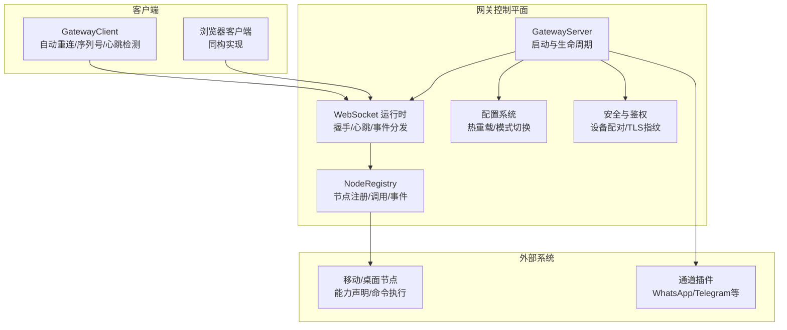
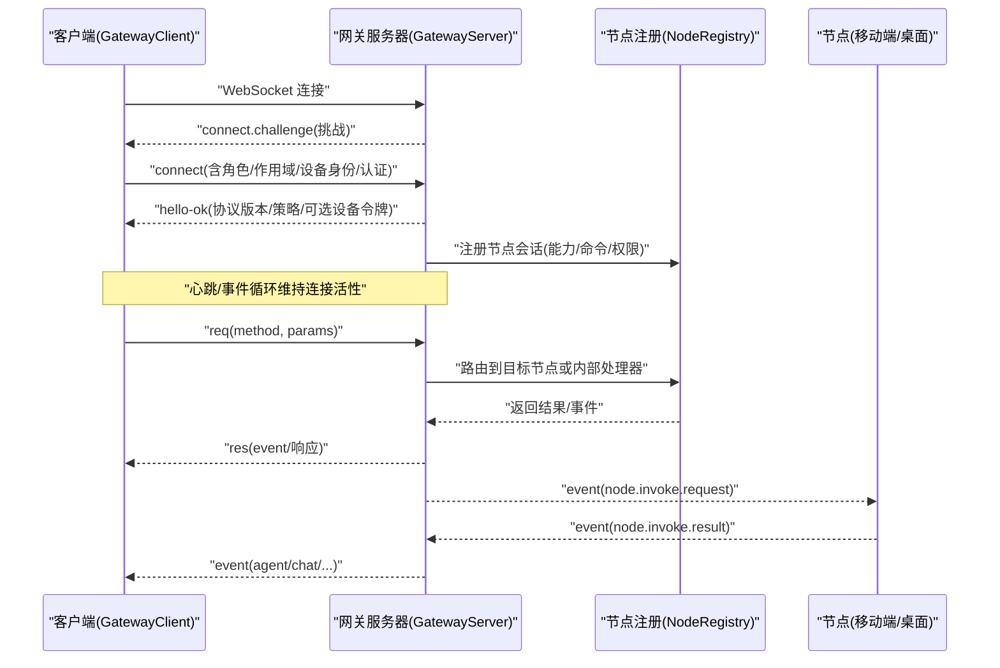
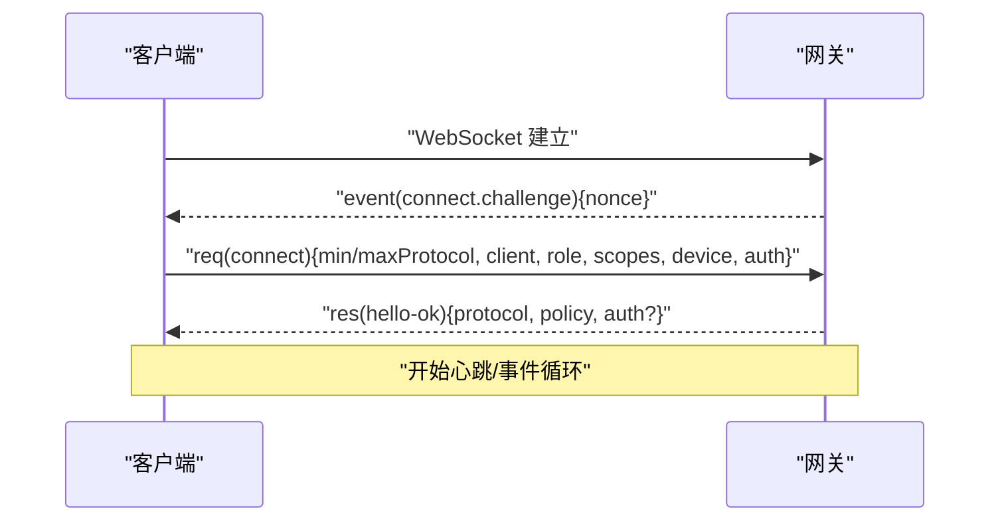
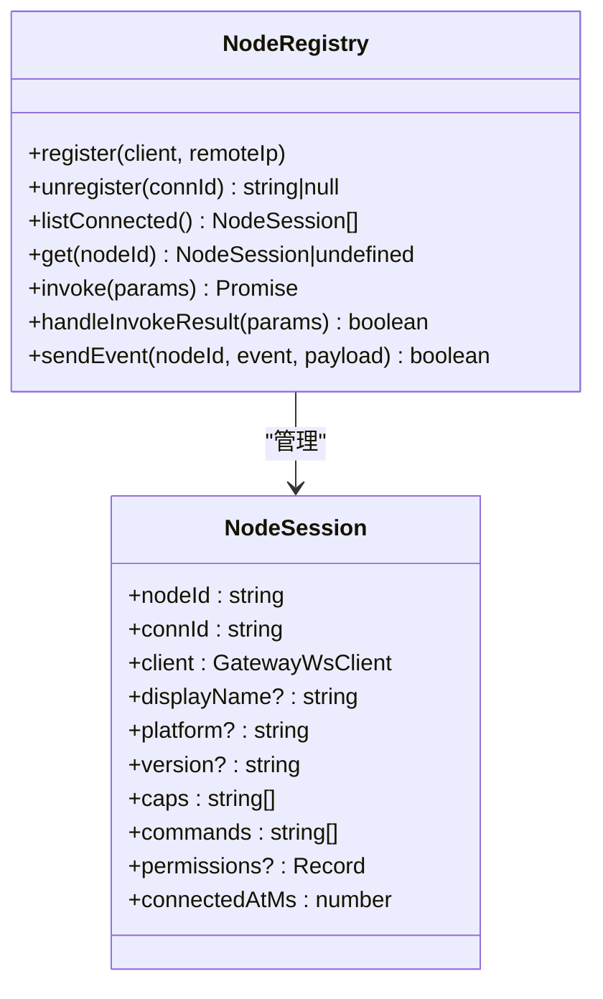
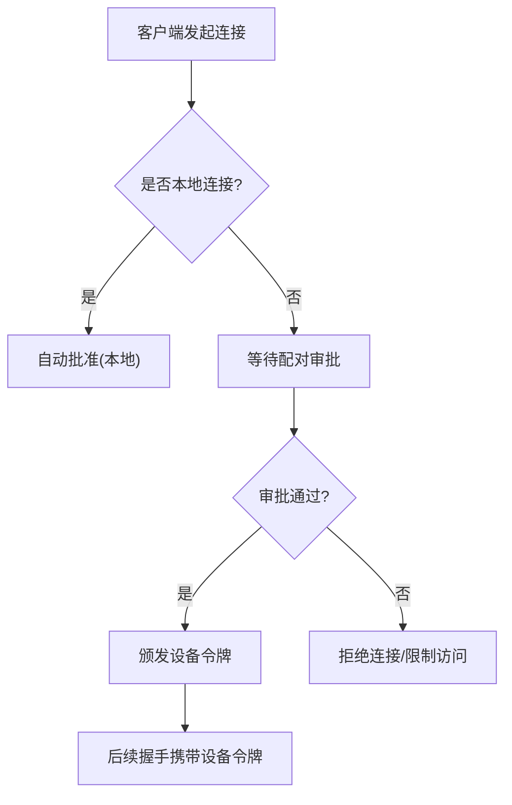
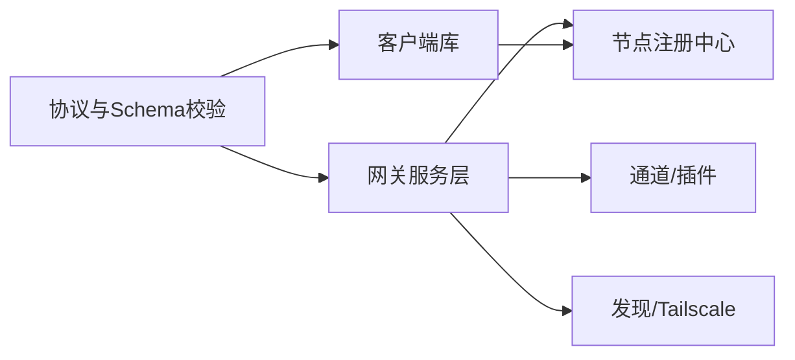

# 网关架构

<cite>
**本文引用的文件**
- [docs/gateway/index.md](file://docs/gateway/index.md)
- [docs/gateway/protocol.md](file://docs/gateway/protocol.md)
- [docs/gateway/configuration.md](file://docs/gateway/configuration.md)
- [docs/gateway/heartbeat.md](file://docs/gateway/heartbeat.md)
- [docs/gateway/security/index.md](file://docs/gateway/security/index.md)
- [src/gateway/client.ts](file://src/gateway/client.ts)
- [src/gateway/server.impl.ts](file://src/gateway/server.impl.ts)
- [src/gateway/protocol/index.ts](file://src/gateway/protocol/index.ts)
- [src/gateway/protocol/schema.ts](file://src/gateway/protocol/schema.ts)
- [src/gateway/node-registry.ts](file://src/gateway/node-registry.ts)
- [src/gateway/server-mobile-nodes.ts](file://src/gateway/server-mobile-nodes.ts)
- [src/gateway/server.health.e2e.test.ts](file://src/gateway/server.health.e2e.test.ts)
- [src/infra/device-pairing.ts](file://src/infra/device-pairing.ts)
- [apps/shared/OpenClawKit/Sources/OpenClawProtocol/GatewayModels.swift](file://apps/shared/OpenClawKit/Sources/OpenClawProtocol/GatewayModels.swift)
- [apps/macos/Sources/OpenClaw/DevicePairingApprovalPrompter.swift](file://apps/macos/Sources/OpenClaw/DevicePairingApprovalPrompter.swift)
- [apps/shared/OpenClawKit/Sources/OpenClawKit/GatewayTLSPinning.swift](file://apps/shared/OpenClawKit/Sources/OpenClawKit/GatewayTLSPinning.swift)
- [apps/android/app/src/main/java/ai/openclaw/android/gateway/GatewayTls.kt](file://apps/android/app/src/main/java/ai/openclaw/android/gateway/GatewayTls.kt)
- [src/commands/status.command.ts](file://src/commands/status.command.ts)
</cite>

## 目录

1. [简介](#简介)
2. [项目结构](#项目结构)
3. [核心组件](#核心组件)
4. [架构总览](#架构总览)
5. [详细组件分析](#详细组件分析)
6. [依赖关系分析](#依赖关系分析)
7. [性能考量](#性能考量)
8. [故障排除指南](#故障排除指南)
9. [结论](#结论)
10. [附录](#附录)

## 简介

本文件面向OpenClaw网关架构，聚焦于基于WebSocket的控制平面与节点传输通道，系统性阐述以下主题：

- 网关守护进程的职责与运行模型
- 客户端连接管理与握手流程
- 节点注册、能力声明与调用机制
- 网关协议（帧格式、版本协商、请求/响应、事件推送）
- 安全机制（身份认证、设备配对、本地信任模型、TLS指纹校验）
- 组件交互与数据流
- 配置项、性能与运维要点
- 故障排除与常见问题定位

## 项目结构

OpenClaw将“网关”作为核心控制平面与节点传输枢纽，围绕WebSocket协议构建统一的控制与数据通道，并通过协议层、服务层、节点注册与配对等模块协同工作。

图表来源

- [src/gateway/server.impl.ts](file://src/gateway/server.impl.ts#L157-L200)
- [src/gateway/client.ts](file://src/gateway/client.ts#L79-L166)
- [src/gateway/node-registry.ts](file://src/gateway/node-registry.ts#L38-L105)

章节来源

- [docs/gateway/index.md](file://docs/gateway/index.md#L62-L117)
- [src/gateway/server.impl.ts](file://src/gateway/server.impl.ts#L157-L200)

## 核心组件

- 网关服务器：负责监听端口、处理WebSocket连接、维护健康状态、加载配置、启动通道与插件、分发事件与方法调用。
- 客户端库：封装WS连接、握手、重连、心跳、事件与响应解析、TLS指纹校验。
- 节点注册中心：维护已连接节点会话、挂起调用、超时处理、事件广播。
- 协议与Schema：定义帧格式、角色/作用域、设备身份、错误码与校验器。
- 安全与配对：设备配对、令牌轮换/吊销、本地信任判定、TLS指纹策略。

章节来源

- [src/gateway/server.impl.ts](file://src/gateway/server.impl.ts#L102-L156)
- [src/gateway/client.ts](file://src/gateway/client.ts#L79-L166)
- [src/gateway/node-registry.ts](file://src/gateway/node-registry.ts#L38-L105)
- [src/gateway/protocol/index.ts](file://src/gateway/protocol/index.ts#L227-L408)

## 架构总览

下图展示从客户端到网关再到节点的典型交互路径，以及健康检查与存在性快照的获取方式。

图表来源

- [docs/gateway/protocol.md](file://docs/gateway/protocol.md#L22-L90)
- [src/gateway/client.ts](file://src/gateway/client.ts#L178-L286)
- [src/gateway/node-registry.ts](file://src/gateway/node-registry.ts#L107-L181)

章节来源

- [docs/gateway/protocol.md](file://docs/gateway/protocol.md#L195-L222)
- [src/gateway/server.health.e2e.test.ts](file://src/gateway/server.health.e2e.test.ts#L53-L80)

## 详细组件分析

### 网关守护进程与运行模型

- 单一常驻进程，同时承载WebSocket控制面与HTTP API（兼容OpenAI/Responses/工具调用）。
- 默认绑定回环地址，支持LAN/Tailnet/自定义绑定；默认端口18789。
- 认证默认开启，需配置共享令牌或密码；非回环绑定需认证。
- 支持热重载（按模式混合/热/重启/关闭），并监控配置文件变更。

章节来源

- [docs/gateway/index.md](file://docs/gateway/index.md#L62-L117)
- [docs/gateway/configuration.md](file://docs/gateway/configuration.md#L330-L369)

### 客户端连接管理与握手

- 首帧必须是connect请求；若服务端要求挑战，则先收到connect.challenge再发送connect。
- 客户端携带最小/最大协议版本、客户端元信息、角色/作用域、能力/命令/权限、设备身份签名、认证凭据。
- 成功后服务端返回hello-ok，包含协议版本与策略（如心跳间隔），并可能下发设备令牌。
- 客户端维护心跳检测与断线重连退避，支持TLS指纹校验。

图表来源

- [docs/gateway/protocol.md](file://docs/gateway/protocol.md#L22-L90)
- [src/gateway/client.ts](file://src/gateway/client.ts#L178-L286)

章节来源

- [src/gateway/client.ts](file://src/gateway/client.ts#L79-L166)
- [src/gateway/client.ts](file://src/gateway/client.ts#L178-L286)

### 节点连接机制与能力声明

- 节点在connect阶段声明caps（能力类别）、commands（允许命令清单）、permissions（细粒度开关）。
- 网关侧注册节点会话，记录平台/版本/远程IP/路径环境等信息。
- 节点调用采用“请求-应答”事件模型：网关向节点发送node.invoke.request，节点完成后返回node.invoke.result。
- 节点断开时，挂起调用被清理并返回错误。

图表来源

- [src/gateway/node-registry.ts](file://src/gateway/node-registry.ts#L38-L105)
- [src/gateway/node-registry.ts](file://src/gateway/node-registry.ts#L107-L181)

章节来源

- [src/gateway/node-registry.ts](file://src/gateway/node-registry.ts#L38-L105)
- [src/gateway/node-registry.ts](file://src/gateway/node-registry.ts#L107-L181)

### 网关协议实现细节

- 帧类型：req（请求）、res（响应）、event（事件）。
- 请求/响应遵循TypeBox Schema校验，错误码集中定义。
- 角色与作用域：operator（控制面）、node（节点）；operator.read/write/admin/approvals/pairing等。
- 设备身份与配对：connect阶段携带设备标识、公钥、签名与时间戳；非本地连接需对挑战nonce签名。
- 版本协商：min/maxProtocol严格匹配，不匹配则拒绝。
- 事件推送：包括心跳tick、系统存在性system-presence、健康health、节点事件、代理事件等。

章节来源

- [docs/gateway/protocol.md](file://docs/gateway/protocol.md#L127-L222)
- [src/gateway/protocol/index.ts](file://src/gateway/protocol/index.ts#L227-L408)
- [src/gateway/protocol/schema.ts](file://src/gateway/protocol/schema.ts#L1-L17)

### 安全机制：身份认证、设备配对与本地信任

- 认证：默认启用，支持token/password两种模式；远程CLI调用使用独立的远端令牌。
- 设备配对：首次连接生成待审批请求，批准后为该设备+角色颁发设备令牌；支持轮换/吊销。
- 本地信任：回环与网关主机尾网地址视为本地，自动批准；其他尾网节点仍需审批。
- TLS指纹：客户端可配置wss://并校验证书指纹，防止中间人攻击。
- 控制UI安全：需要安全上下文（HTTPS或localhost）生成设备身份；可降级为token-only认证或禁用设备认证（严重降级）。

图表来源

- [docs/gateway/security/index.md](file://docs/gateway/security/index.md#L430-L448)
- [src/infra/device-pairing.ts](file://src/infra/device-pairing.ts#L297-L332)

章节来源

- [docs/gateway/security/index.md](file://docs/gateway/security/index.md#L406-L448)
- [src/infra/device-pairing.ts](file://src/infra/device-pairing.ts#L297-L332)
- [apps/shared/OpenClawKit/Sources/OpenClawProtocol/GatewayModels.swift](file://apps/shared/OpenClawKit/Sources/OpenClawProtocol/GatewayModels.swift#L2495-L2548)
- [apps/macos/Sources/OpenClaw/DevicePairingApprovalPrompter.swift](file://apps/macos/Sources/OpenClaw/DevicePairingApprovalPrompter.swift#L298-L334)

### TLS指纹与跨平台实现

- 客户端在wss://场景下可配置期望指纹，连接建立后进行证书指纹比对，不一致则拒绝。
- Swift与Android平台分别实现自定义TrustManager/TrustManager以支持指纹校验与“首次信任”策略。

章节来源

- [src/gateway/client.ts](file://src/gateway/client.ts#L106-L137)
- [apps/shared/OpenClawKit/Sources/OpenClawKit/GatewayTLSPinning.swift](file://apps/shared/OpenClawKit/Sources/OpenClawKit/GatewayTLSPinning.swift#L71-L119)
- [apps/android/app/src/main/java/ai/openclaw/android/gateway/GatewayTls.kt](file://apps/android/app/src/main/java/ai/openclaw/android/gateway/GatewayTls.kt#L41-L75)

### 健康检查与存在性快照

- 网关提供health、system-presence、channels.status等方法，客户端可并发查询并验证服务可用性。
- 存在性快照用于UI呈现多角色/多会话聚合视图。

章节来源

- [src/gateway/server.health.e2e.test.ts](file://src/gateway/server.health.e2e.test.ts#L53-L80)
- [docs/gateway/protocol.md](file://docs/gateway/protocol.md#L162-L167)

## 依赖关系分析

- 协议层：通过TypeBox Schema与AJV校验器统一请求/响应/事件的结构与语义。
- 服务层：整合通道、插件、心跳、诊断、更新、发现、Tailscale等子系统。
- 客户端：依赖协议层Schema与设备身份/认证存储，实现稳健的连接与事件处理。
- 节点侧：通过事件驱动的invoke模型与网关交互，避免直接通道耦合。

图表来源

- [src/gateway/protocol/index.ts](file://src/gateway/protocol/index.ts#L227-L408)
- [src/gateway/server.impl.ts](file://src/gateway/server.impl.ts#L1-L100)
- [src/gateway/node-registry.ts](file://src/gateway/node-registry.ts#L38-L105)

章节来源

- [src/gateway/protocol/index.ts](file://src/gateway/protocol/index.ts#L227-L408)
- [src/gateway/server.impl.ts](file://src/gateway/server.impl.ts#L1-L100)

## 性能考量

- 心跳与保活：服务端策略包含心跳间隔；客户端维护心跳计时器，静默超时将主动断开以释放资源。
- 大消息支持：客户端WebSocket选项允许较大载荷（如屏幕截图）。
- 并发与限流：节点调用采用超时与挂起队列管理，避免阻塞；通道与插件层面按需并发。
- 配置热重载：按模式应用变更，避免不必要的重启；关键变更触发重启以确保一致性。

章节来源

- [src/gateway/client.ts](file://src/gateway/client.ts#L89-L92)
- [src/gateway/client.ts](file://src/gateway/client.ts#L369-L386)
- [docs/gateway/configuration.md](file://docs/gateway/configuration.md#L330-L369)

## 故障排除指南

- 连接失败
  - 检查是否正确发送connect首帧；确认min/maxProtocol匹配。
  - 若服务端返回connect.challenge，需在客户端完成签名后再发送connect。
  - 非回环绑定且未配置认证会被拒绝；确认token/password或使用受信网络暴露。
- 设备配对
  - 首次连接会生成待审批请求；在UI或CLI中批准后方可获得设备令牌。
  - 若本地连接未自动批准，检查是否为回环或网关主机尾网地址。
- TLS指纹
  - 使用wss://时，若指纹不匹配将被拒绝；确认期望指纹与服务端证书一致。
- 心跳与存活
  - 客户端心跳超时会主动断开；检查网络稳定性与防火墙设置。
- 健康检查
  - 通过health/system-presence/channels.status等方法验证服务状态；结合日志与状态命令排查。

章节来源

- [docs/gateway/index.md](file://docs/gateway/index.md#L228-L238)
- [docs/gateway/protocol.md](file://docs/gateway/protocol.md#L178-L216)
- [src/gateway/server.health.e2e.test.ts](file://src/gateway/server.health.e2e.test.ts#L53-L80)
- [src/commands/status.command.ts](file://src/commands/status.command.ts#L266-L306)

## 结论

OpenClaw网关以WebSocket为核心，构建了统一的控制平面与节点传输通道。通过严格的协议、设备配对与本地信任模型、TLS指纹校验与健壮的心跳保活机制，实现了高安全性与高可用性的运行保障。配合灵活的配置热重载与多样的通道/插件生态，网关能够满足从个人到生产环境的多样化需求。

## 附录

- 配置参考与示例：见“配置”文档，涵盖通道接入、模型选择、会话与沙箱、心跳与钩子、多代理路由等。
- 协议快速参考：见“协议”文档，包含帧格式、角色/作用域、版本协商、认证与设备身份、事件推送等。
- 安全基线与审计：见“安全”文档，涵盖威胁模型、访问控制、工具策略、日志与凭证管理、应急响应等。

章节来源

- [docs/gateway/configuration.md](file://docs/gateway/configuration.md#L1-L483)
- [docs/gateway/protocol.md](file://docs/gateway/protocol.md#L1-L222)
- [docs/gateway/security/index.md](file://docs/gateway/security/index.md#L1-L829)
