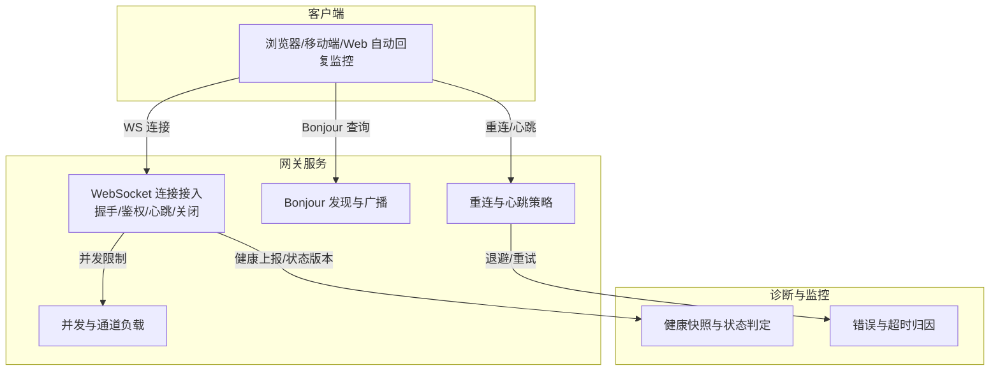
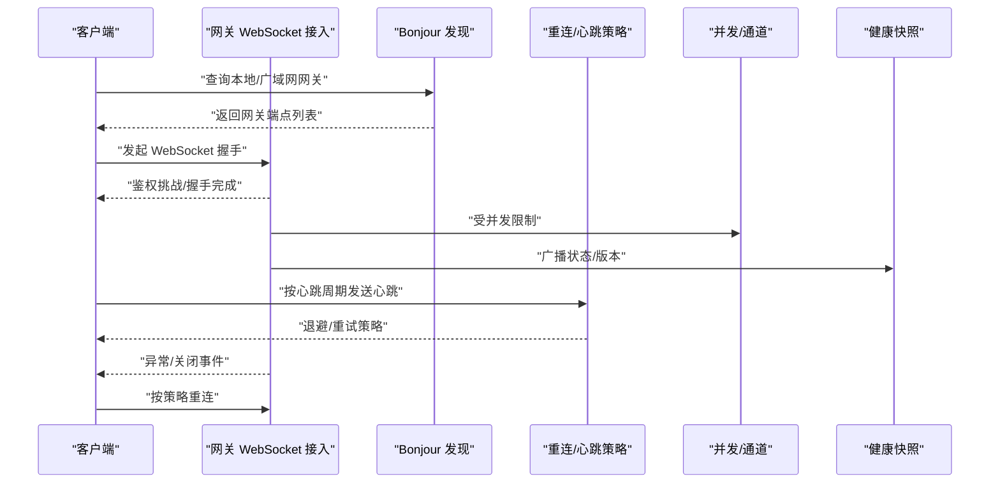
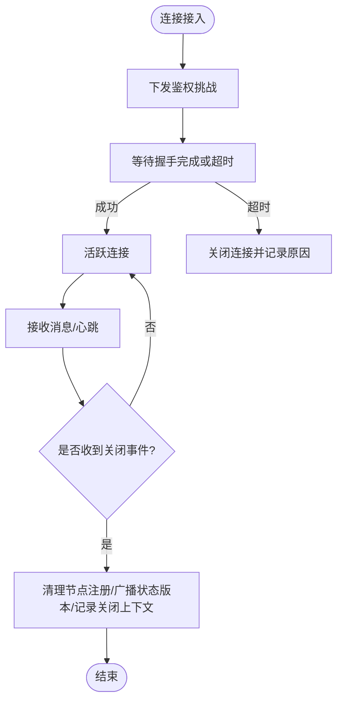
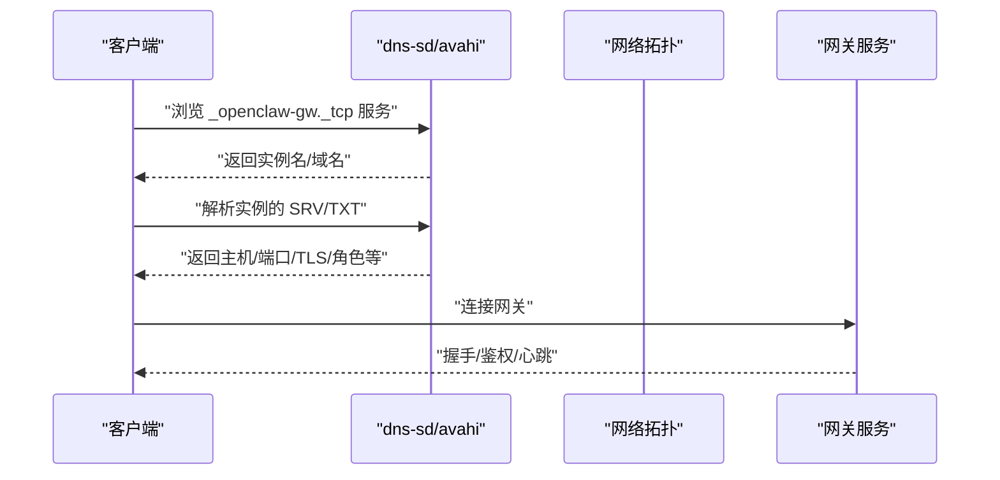
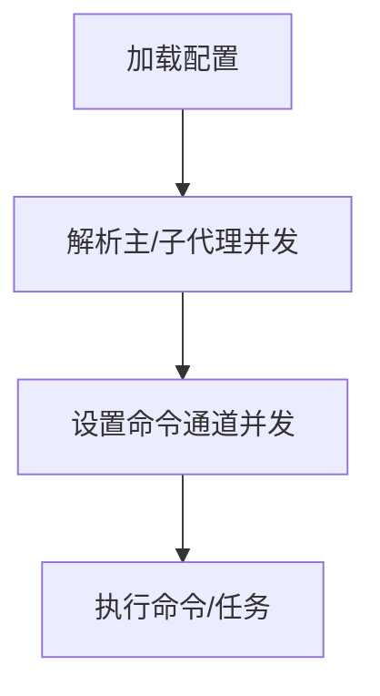
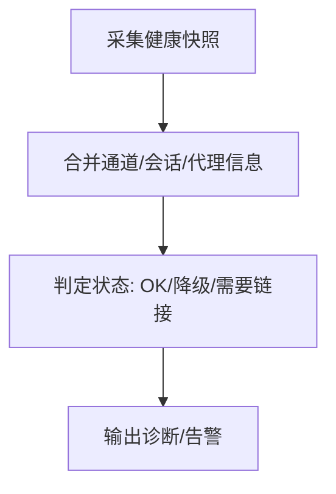
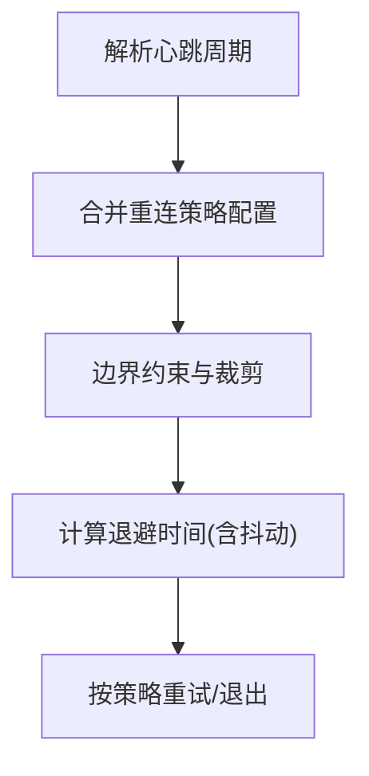
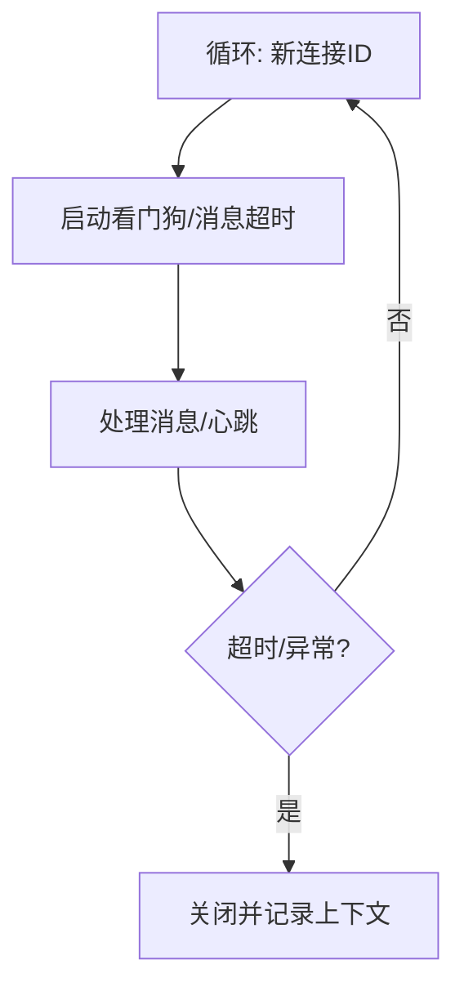
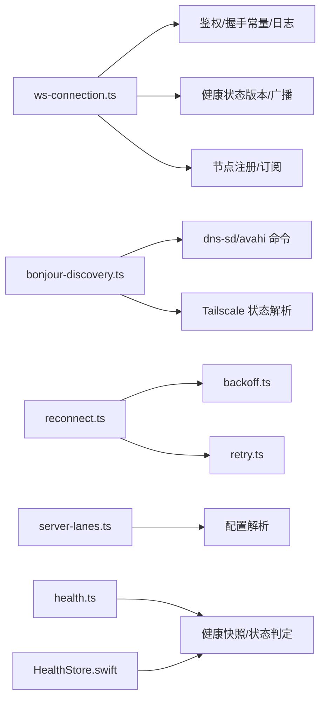

# 连接管理

<cite>
**本文引用的文件**
- [src/gateway/server/ws-connection.ts](file://src/gateway/server/ws-connection.ts)
- [src/web/reconnect.ts](file://src/web/reconnect.ts)
- [src/auto-reply/heartbeat.ts](file://src/auto-reply/heartbeat.ts)
- [src/infra/bonjour-discovery.ts](file://src/infra/bonjour-discovery.ts)
- [src/infra/bonjour.ts](file://src/infra/bonjour.ts)
- [src/infra/backoff.ts](file://src/infra/backoff.ts)
- [src/infra/retry.ts](file://src/infra/retry.ts)
- [src/gateway/server-lanes.ts](file://src/gateway/server-lanes.ts)
- [apps/android/app/src/main/java/ai/openclaw/android/gateway/GatewayDiscovery.kt](file://apps/android/app/src/main/java/ai/openclaw/android/gateway/GatewayDiscovery.kt)
- [apps/macos/Sources/OpenClaw/HealthStore.swift](file://apps/macos/Sources/OpenClaw/HealthStore.swift)
- [src/commands/health.ts](file://src/commands/health.ts)
- [src/agents/failover-error.ts](file://src/agents/failover-error.ts)
- [src/web/auto-reply/monitor.ts](file://src/web/auto-reply/monitor.ts)
</cite>

## 目录

1. [简介](#简介)
2. [项目结构](#项目结构)
3. [核心组件](#核心组件)
4. [架构总览](#架构总览)
5. [详细组件分析](#详细组件分析)
6. [依赖关系分析](#依赖关系分析)
7. [性能考量](#性能考量)
8. [故障排查指南](#故障排查指南)
9. [结论](#结论)
10. [附录](#附录)

## 简介

本技术文档聚焦于 OpenClaw 网关的连接管理，系统化阐述客户端连接生命周期（建立、心跳、断线重连、优雅关闭）、节点连接机制（设备发现、Bonjour 广播、网络拓扑管理）、连接池与并发控制（资源分配、负载均衡）、连接状态监控（健康检查、性能指标、故障诊断），以及连接配置与调优参数（超时、缓冲、重试策略）。文档同时提供问题排查与性能优化建议，帮助开发者与运维人员快速定位与解决连接相关问题。

## 项目结构

围绕连接管理的关键模块分布如下：

- 网关 WebSocket 连接接入与握手校验：[src/gateway/server/ws-connection.ts](file://src/gateway/server/ws-connection.ts)
- 客户端重连策略与心跳解析：[src/web/reconnect.ts](file://src/web/reconnect.ts)、[src/auto-reply/heartbeat.ts](file://src/auto-reply/heartbeat.ts)
- 设备发现与 Bonjour 广播：[src/infra/bonjour-discovery.ts](file://src/infra/bonjour-discovery.ts)、[src/infra/bonjour.ts](file://src/infra/bonjour.ts)
- 退避与重试策略：[src/infra/backoff.ts](file://src/infra/backoff.ts)、[src/infra/retry.ts](file://src/infra/retry.ts)
- 并发与通道负载：[src/gateway/server-lanes.ts](file://src/gateway/server-lanes.ts)
- 健康状态与诊断：[apps/macos/Sources/OpenClaw/HealthStore.swift](file://apps/macos/Sources/OpenClaw/HealthStore.swift)、[src/commands/health.ts](file://src/commands/health.ts)
- 多平台集成示例：Android 侧 Bonjour 解析与端点构建：[apps/android/app/src/main/java/ai/openclaw/android/gateway/GatewayDiscovery.kt](file://apps/android/app/src/main/java/ai/openclaw/android/gateway/GatewayDiscovery.kt)
- 长连接监控与看门狗：[src/web/auto-reply/monitor.ts](file://src/web/auto-reply/monitor.ts)

**图表来源**

- [src/gateway/server/ws-connection.ts](file://src/gateway/server/ws-connection.ts#L1-L267)
- [src/infra/bonjour-discovery.ts](file://src/infra/bonjour-discovery.ts#L558-L604)
- [src/web/reconnect.ts](file://src/web/reconnect.ts#L1-L53)
- [src/gateway/server-lanes.ts](file://src/gateway/server-lanes.ts#L1-L10)
- [apps/macos/Sources/OpenClaw/HealthStore.swift](file://apps/macos/Sources/OpenClaw/HealthStore.swift#L197-L213)
- [src/commands/health.ts](file://src/commands/health.ts#L385-L709)
- [src/infra/backoff.ts](file://src/infra/backoff.ts#L1-L28)
- [src/infra/retry.ts](file://src/infra/retry.ts#L45-L91)

**章节来源**

- [src/gateway/server/ws-connection.ts](file://src/gateway/server/ws-connection.ts#L1-L267)
- [src/infra/bonjour-discovery.ts](file://src/infra/bonjour-discovery.ts#L558-L604)
- [src/web/reconnect.ts](file://src/web/reconnect.ts#L1-L53)
- [src/gateway/server-lanes.ts](file://src/gateway/server-lanes.ts#L1-L10)
- [apps/macos/Sources/OpenClaw/HealthStore.swift](file://apps/macos/Sources/OpenClaw/HealthStore.swift#L197-L213)
- [src/commands/health.ts](file://src/commands/health.ts#L385-L709)
- [src/infra/backoff.ts](file://src/infra/backoff.ts#L1-L28)
- [src/infra/retry.ts](file://src/infra/retry.ts#L45-L91)
- [apps/android/app/src/main/java/ai/openclaw/android/gateway/GatewayDiscovery.kt](file://apps/android/app/src/main/java/ai/openclaw/android/gateway/GatewayDiscovery.kt#L140-L178)
- [src/web/auto-reply/monitor.ts](file://src/web/auto-reply/monitor.ts#L128-L159)

## 核心组件

- WebSocket 连接接入与握手校验：负责连接建立、鉴权挑战、握手超时、错误与关闭事件处理、节点注销与状态广播。
- Bonjour 设备发现与广播：跨平台（macOS/Linux）查询本地/广域网网关实例，解析 TXT 记录，构建端点信息。
- 重连与心跳策略：统一心跳周期解析、默认重连策略、退避算法与最大尝试次数控制。
- 并发与通道负载：基于命令通道的并发限制，避免过载。
- 健康检查与状态监控：聚合通道健康探测、状态版本与降级判断。
- 错误与超时归因：识别超时、鉴权失败、配额限制等场景，辅助重试与降级。

**章节来源**

- [src/gateway/server/ws-connection.ts](file://src/gateway/server/ws-connection.ts#L19-L267)
- [src/infra/bonjour-discovery.ts](file://src/infra/bonjour-discovery.ts#L1-L604)
- [src/web/reconnect.ts](file://src/web/reconnect.ts#L1-L53)
- [src/gateway/server-lanes.ts](file://src/gateway/server-lanes.ts#L1-L10)
- [apps/macos/Sources/OpenClaw/HealthStore.swift](file://apps/macos/Sources/OpenClaw/HealthStore.swift#L153-L213)
- [src/commands/health.ts](file://src/commands/health.ts#L385-L709)
- [src/infra/backoff.ts](file://src/infra/backoff.ts#L1-L28)
- [src/infra/retry.ts](file://src/infra/retry.ts#L45-L91)

## 架构总览

下图展示从客户端到网关、再到健康监控的整体交互路径，涵盖连接建立、心跳、断线重连与健康状态传播。

**图表来源**

- [src/infra/bonjour-discovery.ts](file://src/infra/bonjour-discovery.ts#L558-L604)
- [src/gateway/server/ws-connection.ts](file://src/gateway/server/ws-connection.ts#L61-L267)
- [src/web/reconnect.ts](file://src/web/reconnect.ts#L20-L48)
- [src/gateway/server-lanes.ts](file://src/gateway/server-lanes.ts#L6-L10)
- [apps/macos/Sources/OpenClaw/HealthStore.swift](file://apps/macos/Sources/OpenClaw/HealthStore.swift#L197-L213)

## 详细组件分析

### 组件一：WebSocket 连接生命周期

- 连接建立：监听“connection”事件，生成连接 ID，下发鉴权挑战，记录远端地址与请求头。
- 心跳检测：通过握手超时与帧元数据记录实现，支持心跳失败时的关闭与日志。
- 断线重连：由客户端侧策略驱动，网关侧在关闭事件中清理节点注册、广播状态版本。
- 优雅关闭：记录持续时间、最后帧类型/方法/ID、关闭原因与元信息，确保资源释放与状态一致性。

**图表来源**

- [src/gateway/server/ws-connection.ts](file://src/gateway/server/ws-connection.ts#L61-L267)

**章节来源**

- [src/gateway/server/ws-connection.ts](file://src/gateway/server/ws-connection.ts#L19-L267)

### 组件二：Bonjour 节点连接机制

- 设备发现：支持 macOS（dns-sd）与 Linux（avahi-browse），解析 SRV/TXT 记录，提取网关主机、端口、TLS 信息、角色与传输方式。
- 广播广告：启动 ciao 响应器，发布网关服务，记录 FQDN/主机/端口/状态摘要。
- 多域与广域：支持本地域与广域 DNS 域，Linux 下可回退至 Tailscale IP 扫描以发现广域网实例。
- Android 示例：解析 TXT 字段，构建稳定 ID 与端点信息，汇总本地与单播结果。

**图表来源**

- [src/infra/bonjour-discovery.ts](file://src/infra/bonjour-discovery.ts#L277-L453)
- [src/infra/bonjour.ts](file://src/infra/bonjour.ts#L84-L92)
- [apps/android/app/src/main/java/ai/openclaw/android/gateway/GatewayDiscovery.kt](file://apps/android/app/src/main/java/ai/openclaw/android/gateway/GatewayDiscovery.kt#L140-L178)

**章节来源**

- [src/infra/bonjour-discovery.ts](file://src/infra/bonjour-discovery.ts#L1-L604)
- [src/infra/bonjour.ts](file://src/infra/bonjour.ts#L51-L92)
- [apps/android/app/src/main/java/ai/openclaw/android/gateway/GatewayDiscovery.kt](file://apps/android/app/src/main/java/ai/openclaw/android/gateway/GatewayDiscovery.kt#L140-L178)

### 组件三：连接池与并发控制

- 命令通道并发：根据配置解析主通道与子代理通道的最大并发数，设置命令队列并发，避免过载。
- 负载均衡：通过通道划分与并发限制，将任务分发到不同 lanes，提升吞吐与稳定性。

**图表来源**

- [src/gateway/server-lanes.ts](file://src/gateway/server-lanes.ts#L1-L10)

**章节来源**

- [src/gateway/server-lanes.ts](file://src/gateway/server-lanes.ts#L1-L10)

### 组件四：连接状态监控与健康检查

- 健康快照：聚合通道探测、会话与代理状态，输出健康摘要与通道行格式化。
- 状态判定：基于链接状态与探测结果，区分 OK、降级、需要链接等状态；支持降级原因描述。
- 诊断解码：容忍日志噪声，从数据中提取 JSON 健康快照。

**图表来源**

- [src/commands/health.ts](file://src/commands/health.ts#L385-L709)
- [apps/macos/Sources/OpenClaw/HealthStore.swift](file://apps/macos/Sources/OpenClaw/HealthStore.swift#L197-L213)
- [apps/macos/Sources/OpenClaw/HealthStore.swift](file://apps/macos/Sources/OpenClaw/HealthStore.swift#L288-L301)

**章节来源**

- [src/commands/health.ts](file://src/commands/health.ts#L385-L709)
- [apps/macos/Sources/OpenClaw/HealthStore.swift](file://apps/macos/Sources/OpenClaw/HealthStore.swift#L153-L213)
- [apps/macos/Sources/OpenClaw/HealthStore.swift](file://apps/macos/Sources/OpenClaw/HealthStore.swift#L288-L301)

### 组件五：重连策略与心跳配置

- 心跳周期：支持配置覆盖，默认值解析，确保心跳周期合理。
- 重连策略：默认初始延迟、最大延迟、退避因子、抖动与最大尝试次数；参数边界约束，保证数值安全。
- 退避算法：指数退避结合抖动，避免雪崩效应。
- 重试策略：通用重试配置与指数退避，支持最小/最大延迟与抖动。

**图表来源**

- [src/web/reconnect.ts](file://src/web/reconnect.ts#L20-L48)
- [src/infra/backoff.ts](file://src/infra/backoff.ts#L10-L14)
- [src/infra/retry.ts](file://src/infra/retry.ts#L45-L91)

**章节来源**

- [src/web/reconnect.ts](file://src/web/reconnect.ts#L1-L53)
- [src/infra/backoff.ts](file://src/infra/backoff.ts#L1-L28)
- [src/infra/retry.ts](file://src/infra/retry.ts#L45-L91)

### 组件六：长连接监控与看门狗

- 自动回复监控：循环建立新连接 ID，维护心跳与看门狗定时器，检测长时间无消息的异常。
- 抖动与停止：避免测试环境噪音，设置最大监听者数量；支持 SIGINT 停止。

**图表来源**

- [src/web/auto-reply/monitor.ts](file://src/web/auto-reply/monitor.ts#L128-L159)

**章节来源**

- [src/web/auto-reply/monitor.ts](file://src/web/auto-reply/monitor.ts#L128-L159)

## 依赖关系分析

- WebSocket 连接接入依赖：日志子系统、鉴权、握手超时常量、健康状态版本、节点注册与订阅。
- Bonjour 发现依赖：平台命令（dns-sd/avahi）、Tailscale 状态解析、DNS 解析工具。
- 重连与心跳依赖：配置解析、退避算法、重试工具。
- 并发控制依赖：配置解析与命令队列。
- 健康监控依赖：通道绑定、会话缓存、代理顺序与账户映射。

**图表来源**

- [src/gateway/server/ws-connection.ts](file://src/gateway/server/ws-connection.ts#L1-L267)
- [src/infra/bonjour-discovery.ts](file://src/infra/bonjour-discovery.ts#L1-L604)
- [src/web/reconnect.ts](file://src/web/reconnect.ts#L1-L53)
- [src/infra/backoff.ts](file://src/infra/backoff.ts#L1-L28)
- [src/infra/retry.ts](file://src/infra/retry.ts#L45-L91)
- [src/gateway/server-lanes.ts](file://src/gateway/server-lanes.ts#L1-L10)
- [src/commands/health.ts](file://src/commands/health.ts#L385-L709)
- [apps/macos/Sources/OpenClaw/HealthStore.swift](file://apps/macos/Sources/OpenClaw/HealthStore.swift#L197-L213)

**章节来源**

- [src/gateway/server/ws-connection.ts](file://src/gateway/server/ws-connection.ts#L1-L267)
- [src/infra/bonjour-discovery.ts](file://src/infra/bonjour-discovery.ts#L1-L604)
- [src/web/reconnect.ts](file://src/web/reconnect.ts#L1-L53)
- [src/infra/backoff.ts](file://src/infra/backoff.ts#L1-L28)
- [src/infra/retry.ts](file://src/infra/retry.ts#L45-L91)
- [src/gateway/server-lanes.ts](file://src/gateway/server-lanes.ts#L1-L10)
- [src/commands/health.ts](file://src/commands/health.ts#L385-L709)
- [apps/macos/Sources/OpenClaw/HealthStore.swift](file://apps/macos/Sources/OpenClaw/HealthStore.swift#L197-L213)

## 性能考量

- 心跳周期：合理的心跳间隔可降低带宽与 CPU 开销，避免过于频繁导致抖动。
- 退避策略：适度的抖动与最大延迟可缓解瞬时拥塞，避免级联失败。
- 并发限制：通过通道并发限制防止过载，提升整体稳定性与响应时间。
- 健康快照：定期聚合通道状态，有助于提前发现潜在问题，减少故障影响面。
- 日志与监控：启用健康状态版本广播与诊断解码，便于定位异常与评估恢复效果。

[本节为通用指导，无需特定文件引用]

## 故障排查指南

- 握手超时：检查握手超时阈值、网络延迟与客户端兼容性；查看关闭事件中的握手状态与持续时间。
- 心跳失败：确认心跳周期配置、客户端心跳发送与服务器日志；关注长时间无消息的看门狗触发。
- 重连失败：核对重连策略参数（初始/最大延迟、退避因子、抖动、最大尝试次数）；观察退避曲线与中断信号。
- 超时/鉴权/配额：识别超时、401/403、429、402 等错误类型，结合重试与降级策略处理。
- Bonjour 解析：确认平台命令可用性（dns-sd/avahi）、TXT 记录完整性与域名解析；Linux 可回退至 Tailscale IP 扫描。
- 健康状态：使用健康快照与状态判定逻辑，定位链路未链接、探测失败或降级原因。

**章节来源**

- [src/gateway/server/ws-connection.ts](file://src/gateway/server/ws-connection.ts#L143-L228)
- [src/web/reconnect.ts](file://src/web/reconnect.ts#L28-L48)
- [src/infra/backoff.ts](file://src/infra/backoff.ts#L10-L14)
- [src/infra/retry.ts](file://src/infra/retry.ts#L45-L91)
- [src/agents/failover-error.ts](file://src/agents/failover-error.ts#L115-L165)
- [src/infra/bonjour-discovery.ts](file://src/infra/bonjour-discovery.ts#L558-L604)
- [apps/macos/Sources/OpenClaw/HealthStore.swift](file://apps/macos/Sources/OpenClaw/HealthStore.swift#L153-L213)
- [src/commands/health.ts](file://src/commands/health.ts#L385-L709)

## 结论

OpenClaw 的连接管理通过 WebSocket 接入、Bonjour 设备发现、统一的重连与心跳策略、并发控制与健康监控，形成了完整的端到端连接生命周期闭环。合理的配置与调优能够显著提升稳定性与性能；完善的诊断与故障排查流程则保障了线上问题的快速定位与修复。

[本节为总结，无需特定文件引用]

## 附录

### 连接配置与调优参数

- 心跳周期
  - 默认值：秒级心跳周期解析函数提供默认值。
  - 覆盖优先级：允许外部覆盖参数优先于配置文件。
- 重连策略
  - 初始延迟、最大延迟、退避因子、抖动、最大尝试次数。
  - 参数裁剪：确保数值范围与正定性，避免极端值。
- 并发控制
  - 主通道与子代理通道并发数由配置解析并应用到命令队列。
- 健康检查
  - 通道探测、状态版本与降级判定，支持诊断解码与告警输出。

**章节来源**

- [src/web/reconnect.ts](file://src/web/reconnect.ts#L20-L48)
- [src/gateway/server-lanes.ts](file://src/gateway/server-lanes.ts#L6-L10)
- [apps/macos/Sources/OpenClaw/HealthStore.swift](file://apps/macos/Sources/OpenClaw/HealthStore.swift#L197-L213)
- [src/commands/health.ts](file://src/commands/health.ts#L385-L709)
