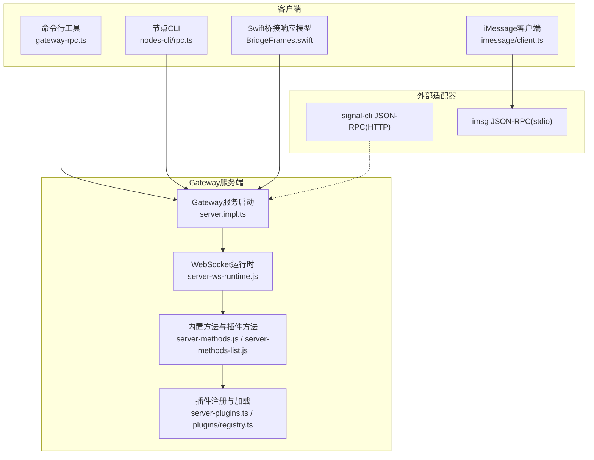
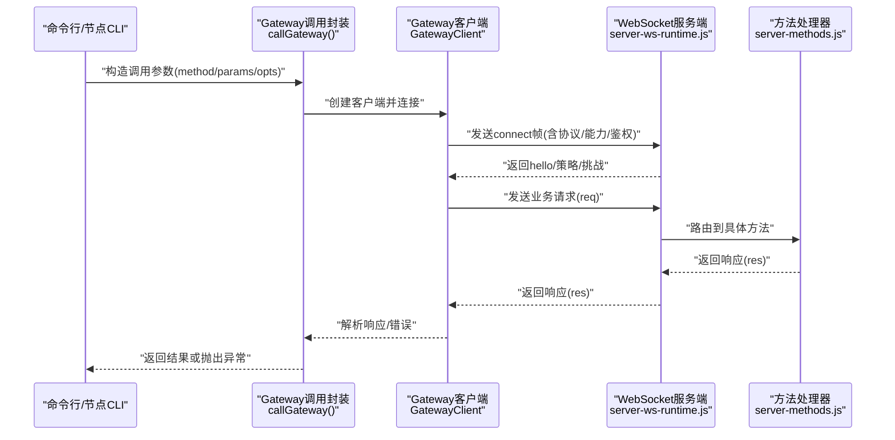
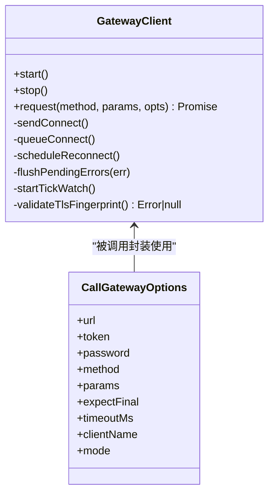
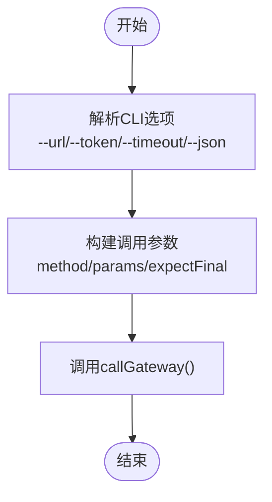
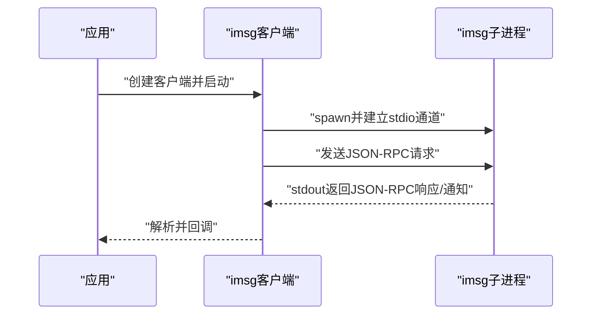
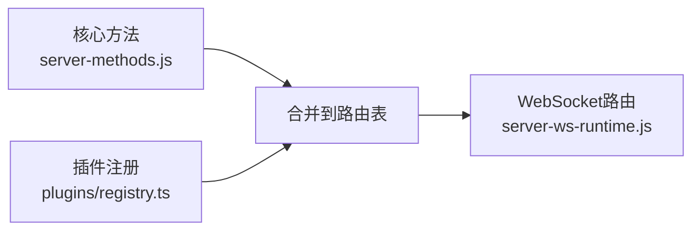
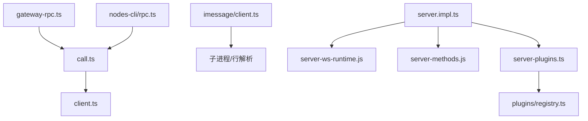

# RPC接口系统

<cite>
**本文引用的文件**
- [src/gateway/call.ts](file://src/gateway/call.ts)
- [src/gateway/client.ts](file://src/gateway/client.ts)
- [src/cli/gateway-rpc.ts](file://src/cli/gateway-rpc.ts)
- [src/cli/nodes-cli/rpc.ts](file://src/cli/nodes-cli/rpc.ts)
- [src/imessage/client.ts](file://src/imessage/client.ts)
- [apps/shared/OpenClawKit/Sources/OpenClawKit/BridgeFrames.swift](file://apps/shared/OpenClawKit/Sources/OpenClawKit/BridgeFrames.swift)
- [docs/reference/rpc.md](file://docs/reference/rpc.md)
- [src/gateway/server.impl.ts](file://src/gateway/server.impl.ts)
- [src/plugins/registry.ts](file://src/plugins/registry.ts)
- [src/gateway/server-methods-list.js](file://src/gateway/server-methods-list.js)
- [src/gateway/server-methods.js](file://src/gateway/server-methods.js)
- [src/gateway/server-ws-runtime.js](file://src/gateway/server-ws-runtime.js)
- [src/gateway/server-channels.js](file://src/gateway/server-channels.js)
- [src/gateway/server-plugins.ts](file://src/gateway/server-plugins.ts)
- [src/gateway/server.agent.gateway-server-agent-a.e2e.test.ts](file://src/gateway/server.agent.gateway-server-agent-a.e2e.test.ts)
- [src/gateway/server.channels.e2e.test.ts](file://src/gateway/server.channels.e2e.test.ts)
- [src/gateway/test-helpers.server.ts](file://src/gateway/test-helpers.server.ts)
- [src/channels/command-gating.test.ts](file://src/channels/command-gating.test.ts)
- [src/gateway/server/__tests__/test-utils.ts](file://src/gateway/server/__tests__/test-utils.ts)
- [src/gateway/server-plugins.test.ts](file://src/gateway/server-plugins.test.ts)
- [src/gateway/server.impl.ts](file://src/gateway/server.impl.ts)
</cite>

## 目录

1. [简介](#简介)
2. [项目结构](#项目结构)
3. [核心组件](#核心组件)
4. [架构总览](#架构总览)
5. [组件详解](#组件详解)
6. [依赖关系分析](#依赖关系分析)
7. [性能考量](#性能考量)
8. [故障排查指南](#故障排查指南)
9. [结论](#结论)
10. [附录](#附录)

## 简介

本文件面向OpenClaw RPC接口系统，系统性阐述RPC方法的定义、注册与调用机制（含同步与异步）、参数校验、返回值与错误传播、权限与认证、版本管理与兼容策略，并提供客户端SDK使用要点、调用示例与最佳实践，以及性能监控、限流与故障转移建议。内容基于仓库中Gateway WebSocket RPC、CLI调用适配器、iMessage JSON-RPC适配器等实现进行归纳总结。

## 项目结构

OpenClaw的RPC体系由三部分组成：

- Gateway服务端：WebSocket协议承载RPC请求/响应与事件通知，内置方法清单与插件扩展点。
- 客户端SDK：CLI与应用侧通过统一的Gateway调用封装发起RPC请求。
- 外部CLI适配器：对信号（signal-cli）与旧版iMessage（imsg）采用HTTP/stdio子进程模式对接，遵循JSON-RPC约定。

图表来源

- [src/cli/gateway-rpc.ts](file://src/cli/gateway-rpc.ts#L1-L48)
- [src/cli/nodes-cli/rpc.ts](file://src/cli/nodes-cli/rpc.ts#L1-L114)
- [src/imessage/client.ts](file://src/imessage/client.ts#L52-L244)
- [apps/shared/OpenClawKit/Sources/OpenClawKit/BridgeFrames.swift](file://apps/shared/OpenClawKit/Sources/OpenClawKit/BridgeFrames.swift#L241-L261)
- [src/gateway/server.impl.ts](file://src/gateway/server.impl.ts#L157-L200)
- [src/gateway/server-ws-runtime.js](file://src/gateway/server-ws-runtime.js)
- [src/gateway/server-methods.js](file://src/gateway/server-methods.js)
- [src/gateway/server-methods-list.js](file://src/gateway/server-methods-list.js)
- [src/gateway/server-plugins.ts](file://src/gateway/server-plugins.ts)
- [src/plugins/registry.ts](file://src/plugins/registry.ts#L265-L294)

章节来源

- [src/gateway/server.impl.ts](file://src/gateway/server.impl.ts#L157-L200)
- [docs/reference/rpc.md](file://docs/reference/rpc.md#L1-L44)

## 核心组件

- Gateway客户端封装：负责连接建立、鉴权、请求发送与响应接收、超时与重连、TLS指纹校验、心跳检测与断线重连。
- Gateway调用入口：CLI侧统一封装，解析配置、构建连接信息、注入令牌或密码、执行请求并处理结果。
- 方法注册与路由：内置方法与插件方法合并到服务端路由表；插件可注册新方法，避免冲突。
- 外部CLI适配器：signal-cli采用HTTP+SSE；imsg采用stdio子进程+行分隔JSON-RPC。
- Swift桥接响应模型：用于浏览器/移动端桥接层的RPC响应结构体。

章节来源

- [src/gateway/client.ts](file://src/gateway/client.ts#L79-L442)
- [src/gateway/call.ts](file://src/gateway/call.ts#L156-L313)
- [src/gateway/server-methods-list.js](file://src/gateway/server-methods-list.js)
- [src/gateway/server-methods.js](file://src/gateway/server-methods.js)
- [src/plugins/registry.ts](file://src/plugins/registry.ts#L265-L294)
- [src/imessage/client.ts](file://src/imessage/client.ts#L52-L244)
- [apps/shared/OpenClawKit/Sources/OpenClawKit/BridgeFrames.swift](file://apps/shared/OpenClawKit/Sources/OpenClawKit/BridgeFrames.swift#L241-L261)

## 架构总览

下图展示从CLI到Gateway服务端的完整调用链路，包括握手、鉴权、请求/响应与事件通知。

图表来源

- [src/gateway/call.ts](file://src/gateway/call.ts#L156-L313)
- [src/gateway/client.ts](file://src/gateway/client.ts#L178-L286)
- [src/gateway/server-ws-runtime.js](file://src/gateway/server-ws-runtime.js)
- [src/gateway/server-methods.js](file://src/gateway/server-methods.js)

## 组件详解

### Gateway客户端与调用封装

- 连接与鉴权
  - 支持wss且可校验远端证书指纹，防止中间人攻击。
  - 自动尝试设备级令牌与共享令牌回退。
  - 周期性心跳检测，超时自动断开并指数回退重连。
- 请求/响应与事件
  - 每个请求分配唯一ID，等待对应响应；若expectFinal为true且状态为accepted则继续等待最终响应。
  - 支持事件帧订阅，按序号检测丢包并回调。
- 超时与错误
  - 全局超时控制；连接关闭时根据码位给出提示信息。
  - 断线时批量拒绝未决请求，触发指数回退重连。

图表来源

- [src/gateway/client.ts](file://src/gateway/client.ts#L79-L442)
- [src/gateway/call.ts](file://src/gateway/call.ts#L22-L45)

章节来源

- [src/gateway/client.ts](file://src/gateway/client.ts#L101-L165)
- [src/gateway/client.ts](file://src/gateway/client.ts#L178-L286)
- [src/gateway/client.ts](file://src/gateway/client.ts#L315-L336)
- [src/gateway/client.ts](file://src/gateway/client.ts#L338-L367)
- [src/gateway/client.ts](file://src/gateway/client.ts#L369-L413)
- [src/gateway/client.ts](file://src/gateway/client.ts#L415-L441)
- [src/gateway/call.ts](file://src/gateway/call.ts#L156-L313)

### CLI调用封装与节点CLI

- CLI封装
  - 提供通用选项：URL、令牌、超时、是否等待最终响应、JSON输出。
  - 将CLI上下文注入到连接元数据中，便于服务端策略与审计。
- 节点CLI
  - 针对节点查询与解析，支持从“node.list”或“node.pair.list”解析节点列表。
  - 提供节点ID解析逻辑，支持显示名、IP、前缀匹配等。

图表来源

- [src/cli/gateway-rpc.ts](file://src/cli/gateway-rpc.ts#L14-L47)
- [src/cli/nodes-cli/rpc.ts](file://src/cli/nodes-cli/rpc.ts#L8-L32)

章节来源

- [src/cli/gateway-rpc.ts](file://src/cli/gateway-rpc.ts#L1-L48)
- [src/cli/nodes-cli/rpc.ts](file://src/cli/nodes-cli/rpc.ts#L1-L114)

### 外部CLI适配器（signal-cli与imsg）

- signal-cli
  - 以HTTP守护进程形式提供JSON-RPC接口，支持SSE事件流与健康探测端点。
  - Gateway生命周期内可托管其启停。
- imsg（遗留）
  - 通过子进程stdio传输JSON-RPC消息，逐行解析。
  - 支持订阅通知、发送消息、列出聊天等核心方法。

图表来源

- [src/imessage/client.ts](file://src/imessage/client.ts#L62-L92)
- [src/imessage/client.ts](file://src/imessage/client.ts#L185-L225)
- [docs/reference/rpc.md](file://docs/reference/rpc.md#L13-L37)

章节来源

- [src/imessage/client.ts](file://src/imessage/client.ts#L52-L244)
- [docs/reference/rpc.md](file://docs/reference/rpc.md#L1-L44)

### 方法注册与路由

- 内置方法与插件方法合并到服务端路由表，插件注册时进行重复检查，避免覆盖核心方法。
- 插件可通过注册函数声明新方法，服务端在启动时加载并注入。

图表来源

- [src/plugins/registry.ts](file://src/plugins/registry.ts#L265-L294)
- [src/gateway/server-plugins.ts](file://src/gateway/server-plugins.ts#L27-L27)
- [src/gateway/server-methods.js](file://src/gateway/server-methods.js)
- [src/gateway/server-ws-runtime.js](file://src/gateway/server-ws-runtime.js)

章节来源

- [src/plugins/registry.ts](file://src/plugins/registry.ts#L265-L294)
- [src/gateway/server-plugins.ts](file://src/gateway/server-plugins.ts#L27-L27)

### 权限控制、认证与访问限制

- 认证
  - 支持令牌与密码两种方式；设备级令牌可缓存并回退至共享令牌。
  - TLS指纹校验仅在wss场景启用，确保远端身份可信。
- 权限与作用域
  - 客户端连接时声明角色与作用域；服务端在握手阶段下发策略与心跳周期。
  - 心跳超时将触发断开，防止静默挂起。
- 访问限制
  - 服务端对连接关闭码位提供提示；CLI侧在授权失败时给出明确指引（如签名桥接客户端）。

章节来源

- [src/gateway/client.ts](file://src/gateway/client.ts#L178-L286)
- [src/gateway/client.ts](file://src/gateway/client.ts#L101-L165)
- [src/gateway/call.ts](file://src/gateway/call.ts#L156-L313)
- [src/cli/nodes-cli/rpc.ts](file://src/cli/nodes-cli/rpc.ts#L34-L48)

### 参数验证、返回值处理与错误传播

- 参数验证
  - 请求帧结构在发送前进行校验，非法帧直接抛错。
- 返回值与错误
  - 响应帧ok为真时返回payload；否则提取错误消息并抛出。
  - 对于expectFinal=true且状态为accepted的场景，继续等待最终响应。
- 错误传播
  - 连接关闭、超时、解析错误均转换为可读错误信息并附带连接详情。

章节来源

- [src/gateway/client.ts](file://src/gateway/client.ts#L415-L441)
- [src/gateway/client.ts](file://src/gateway/client.ts#L315-L336)
- [src/gateway/call.ts](file://src/gateway/call.ts#L235-L308)

### 版本管理、向后兼容与废弃策略

- 协议版本
  - 客户端与服务端通过最小/最大协议版本协商，确保兼容范围可控。
- 向后兼容
  - 通过min/maxProtocol限定范围，逐步升级策略清晰。
- 废弃策略
  - 通过方法注册冲突检测与路由表合并，避免覆盖核心方法；插件方法命名空间化可降低冲突风险。

章节来源

- [src/gateway/client.ts](file://src/gateway/client.ts#L226-L229)
- [src/gateway/call.ts](file://src/gateway/call.ts#L274-L275)
- [src/plugins/registry.ts](file://src/plugins/registry.ts#L273-L284)

### 客户端SDK、调用示例与最佳实践

- SDK使用要点
  - CLI侧统一通过callGateway封装发起请求，支持超时、期望最终响应、JSON输出等选项。
  - 节点CLI提供节点解析与列表辅助，提升交互体验。
- 示例路径
  - CLI调用封装：[src/cli/gateway-rpc.ts](file://src/cli/gateway-rpc.ts#L22-L47)
  - 节点CLI调用：[src/cli/nodes-cli/rpc.ts](file://src/cli/nodes-cli/rpc.ts#L15-L32)
  - iMessage客户端：[src/imessage/client.ts](file://src/imessage/client.ts#L238-L244)
  - Swift桥接响应模型：[apps/shared/OpenClawKit/Sources/OpenClawKit/BridgeFrames.swift](file://apps/shared/OpenClawKit/Sources/OpenClawKit/BridgeFrames.swift#L241-L261)
- 最佳实践
  - 明确超时设置，避免阻塞；对长耗时操作启用expectFinal并正确处理中间状态。
  - 在wss场景启用TLS指纹校验，确保远端可信。
  - 使用设备令牌优先，必要时回退共享令牌，减少鉴权失败重试成本。

章节来源

- [src/cli/gateway-rpc.ts](file://src/cli/gateway-rpc.ts#L1-L48)
- [src/cli/nodes-cli/rpc.ts](file://src/cli/nodes-cli/rpc.ts#L1-L114)
- [src/imessage/client.ts](file://src/imessage/client.ts#L238-L244)
- [apps/shared/OpenClawKit/Sources/OpenClawKit/BridgeFrames.swift](file://apps/shared/OpenClawKit/Sources/OpenClawKit/BridgeFrames.swift#L241-L261)

### 性能监控、限流与故障转移

- 性能监控
  - 服务端维护心跳周期与心跳超时阈值，用于检测静默停滞；客户端周期性心跳检测，超时断开。
- 限流
  - 通过服务端策略下发心跳间隔等参数，客户端据此调整心跳频率；结合连接数与并发策略控制资源占用。
- 故障转移
  - 客户端指数回退重连，避免雪崩；连接关闭时批量拒绝未决请求，降低连锁失败概率。

章节来源

- [src/gateway/client.ts](file://src/gateway/client.ts#L262-L268)
- [src/gateway/client.ts](file://src/gateway/client.ts#L369-L386)
- [src/gateway/client.ts](file://src/gateway/client.ts#L349-L367)

## 依赖关系分析

- 客户端依赖
  - CLI封装依赖Gateway调用入口与消息通道常量。
  - iMessage客户端依赖子进程与行解析器。
- 服务端依赖
  - 服务端实现依赖方法列表、方法处理器、插件系统与WebSocket运行时。
  - 插件注册依赖核心方法集合，避免重复注册。

图表来源

- [src/gateway/call.ts](file://src/gateway/call.ts#L1-L313)
- [src/gateway/client.ts](file://src/gateway/client.ts#L1-L442)
- [src/cli/gateway-rpc.ts](file://src/cli/gateway-rpc.ts#L1-L48)
- [src/cli/nodes-cli/rpc.ts](file://src/cli/nodes-cli/rpc.ts#L1-L114)
- [src/imessage/client.ts](file://src/imessage/client.ts#L52-L244)
- [src/gateway/server.impl.ts](file://src/gateway/server.impl.ts#L157-L200)
- [src/gateway/server-ws-runtime.js](file://src/gateway/server-ws-runtime.js)
- [src/gateway/server-methods.js](file://src/gateway/server-methods.js)
- [src/gateway/server-plugins.ts](file://src/gateway/server-plugins.ts)
- [src/plugins/registry.ts](file://src/plugins/registry.ts#L265-L294)

章节来源

- [src/gateway/server.impl.ts](file://src/gateway/server.impl.ts#L157-L200)
- [src/gateway/server-plugins.ts](file://src/gateway/server-plugins.ts#L27-L27)
- [src/plugins/registry.ts](file://src/plugins/registry.ts#L265-L294)

## 性能考量

- 连接与重连
  - 客户端指数回退重连，避免瞬时高并发重试导致服务端压力过大。
- 超时与心跳
  - 合理设置超时与心跳间隔，平衡响应速度与资源占用。
- 大负载
  - WebSocket允许较大载荷，适合屏幕快照等大响应场景；注意网络与内存峰值。

章节来源

- [src/gateway/client.ts](file://src/gateway/client.ts#L349-L367)
- [src/gateway/client.ts](file://src/gateway/client.ts#L369-L386)
- [src/gateway/client.ts](file://src/gateway/client.ts#L110-L113)

## 故障排查指南

- 授权问题
  - 若出现“未授权客户端”或“桥接客户端未授权”，参考节点CLI的提示信息，确认签名或开发模式开关。
- 连接与超时
  - 关注连接关闭码位与原因；超时错误会附带目标地址与来源信息。
- 解析与协议
  - 请求帧校验失败会直接报错；检查请求结构与字段类型。
- 事件与心跳
  - 心跳超时将断开连接；检查网络稳定性与服务端策略。

章节来源

- [src/cli/nodes-cli/rpc.ts](file://src/cli/nodes-cli/rpc.ts#L34-L48)
- [src/gateway/call.ts](file://src/gateway/call.ts#L235-L308)
- [src/gateway/client.ts](file://src/gateway/client.ts#L425-L429)
- [src/gateway/client.ts](file://src/gateway/client.ts#L382-L384)

## 结论

OpenClaw RPC系统以Gateway WebSocket为核心，配合CLI与外部适配器形成统一的跨平台RPC生态。通过严格的鉴权、版本协商、事件与心跳机制，系统在可用性与安全性之间取得平衡。插件化方法注册与路由合并，保证了扩展性与向后兼容。建议在生产环境中启用TLS指纹校验、合理设置超时与心跳、并结合日志与监控完善可观测性。

## 附录

- 外部CLI适配器规范参见：[docs/reference/rpc.md](file://docs/reference/rpc.md#L1-L44)
- 方法清单与测试参考：
  - [src/gateway/server-methods-list.js](file://src/gateway/server-methods-list.js)
  - [src/gateway/server.agent.gateway-server-agent-a.e2e.test.ts](file://src/gateway/server.agent.gateway-server-agent-a.e2e.test.ts#L40-L40)
  - [src/gateway/server.channels.e2e.test.ts](file://src/gateway/server.channels.e2e.test.ts#L21-L21)
  - [src/gateway/server/**tests**/test-utils.ts](file://src/gateway/server/__tests__/test-utils.ts#L10-L10)
  - [src/gateway/server-plugins.test.ts](file://src/gateway/server-plugins.test.ts#L18-L18)
- 权限与访问组测试参考：
  - [src/channels/command-gating.test.ts](file://src/channels/command-gating.test.ts#L1-L46)
