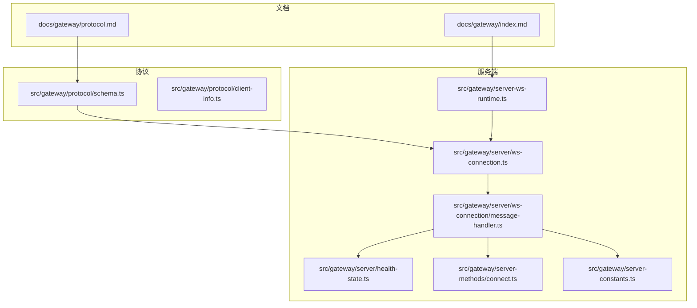
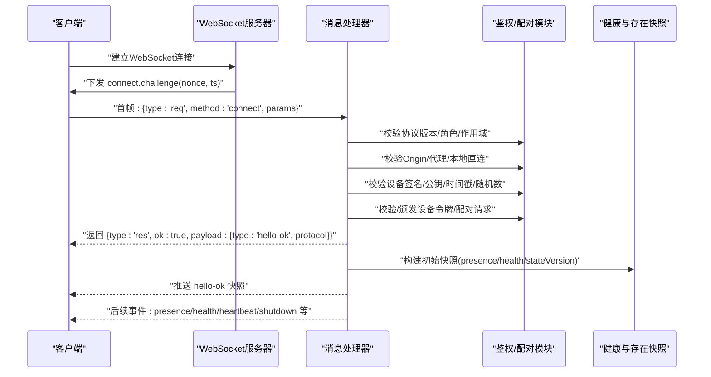
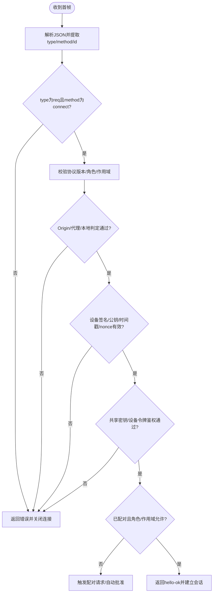
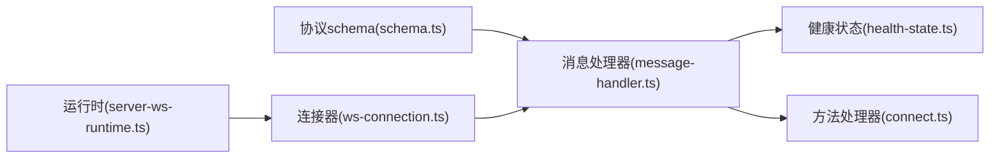

# WebSocket网关协议

<cite>
**本文引用的文件**
- [docs/gateway/protocol.md](file://docs/gateway/protocol.md)
- [docs/gateway/index.md](file://docs/gateway/index.md)
- [src/gateway/protocol/schema.ts](file://src/gateway/protocol/schema.ts)
- [src/gateway/server-ws-runtime.ts](file://src/gateway/server-ws-runtime.ts)
- [src/gateway/server/ws-connection.ts](file://src/gateway/server/ws-connection.ts)
- [src/gateway/server/ws-connection/message-handler.ts](file://src/gateway/server/ws-connection/message-handler.ts)
- [src/gateway/protocol/client-info.ts](file://src/gateway/protocol/client-info.ts)
- [src/gateway/server-methods/connect.ts](file://src/gateway/server-methods/connect.ts)
- [src/gateway/server/health-state.ts](file://src/gateway/server/health-state.ts)
- [src/gateway/server-constants.ts](file://src/gateway/server-constants.ts)
</cite>

## 目录

1. [引言](#引言)
2. [项目结构](#项目结构)
3. [核心组件](#核心组件)
4. [架构总览](#架构总览)
5. [详细组件分析](#详细组件分析)
6. [依赖关系分析](#依赖关系分析)
7. [性能考量](#性能考量)
8. [故障排查指南](#故障排查指南)
9. [结论](#结论)
10. [附录](#附录)

## 引言

本文件系统化阐述 OpenClaw 网关的 WebSocket 协议：从连接建立、握手与认证、消息帧格式、事件类型到实时交互模式；并覆盖心跳机制、错误处理与重连策略、协议版本管理与向后兼容、安全与性能优化、调试方法等。目标读者包括协议实现者、客户端集成工程师与运维人员。

## 项目结构

OpenClaw 将“协议规范”与“服务端实现”解耦：

- 文档层：在 docs/gateway 中提供协议与运行手册，明确握手、帧格式、事件与版本策略。
- 协议层：在 src/gateway/protocol 下导出协议相关类型与校验（schema.ts 汇总导出）。
- 服务端层：在 src/gateway/server 下实现 WebSocket 连接生命周期、握手、鉴权、广播与健康快照等。

图表来源

- [docs/gateway/protocol.md](file://docs/gateway/protocol.md#L1-L222)
- [docs/gateway/index.md](file://docs/gateway/index.md#L1-L255)
- [src/gateway/protocol/schema.ts](file://src/gateway/protocol/schema.ts#L1-L17)
- [src/gateway/server-ws-runtime.ts](file://src/gateway/server-ws-runtime.ts#L1-L50)
- [src/gateway/server/ws-connection.ts](file://src/gateway/server/ws-connection.ts#L1-L267)
- [src/gateway/server/ws-connection/message-handler.ts](file://src/gateway/server/ws-connection/message-handler.ts#L1-L800)
- [src/gateway/server/health-state.ts](file://src/gateway/server/health-state.ts#L1-L79)
- [src/gateway/server-methods/connect.ts](file://src/gateway/server-methods/connect.ts#L1-L13)
- [src/gateway/server-constants.ts](file://src/gateway/server-constants.ts)

章节来源

- [docs/gateway/protocol.md](file://docs/gateway/protocol.md#L1-L222)
- [docs/gateway/index.md](file://docs/gateway/index.md#L1-L255)
- [src/gateway/protocol/schema.ts](file://src/gateway/protocol/schema.ts#L1-L17)
- [src/gateway/server-ws-runtime.ts](file://src/gateway/server-ws-runtime.ts#L1-L50)
- [src/gateway/server/ws-connection.ts](file://src/gateway/server/ws-connection.ts#L1-L267)
- [src/gateway/server/ws-connection/message-handler.ts](file://src/gateway/server/ws-connection/message-handler.ts#L1-L800)
- [src/gateway/server/health-state.ts](file://src/gateway/server/health-state.ts#L1-L79)
- [src/gateway/server-methods/connect.ts](file://src/gateway/server-methods/connect.ts#L1-L13)
- [src/gateway/server-constants.ts](file://src/gateway/server-constants.ts)

## 核心组件

- 协议与帧模型：通过 schema.ts 汇总导出协议相关类型与校验，确保客户端与服务端对消息结构一致。
- 连接与握手：服务端在建立 WebSocket 连接后立即下发 connect.challenge，要求客户端在首帧发送 connect 请求完成握手。
- 鉴权与配对：支持设备签名、令牌/密码等多种鉴权方式，并在需要时触发设备配对流程。
- 广播与快照：服务端维护 presence/health 快照与版本号，通过事件向客户端推送状态变更。
- 方法与事件：请求/响应/事件三类帧，方法调用由服务端方法处理器统一调度。

章节来源

- [src/gateway/protocol/schema.ts](file://src/gateway/protocol/schema.ts#L1-L17)
- [src/gateway/server/ws-connection.ts](file://src/gateway/server/ws-connection.ts#L112-L141)
- [src/gateway/server/ws-connection/message-handler.ts](file://src/gateway/server/ws-connection/message-handler.ts#L234-L337)
- [src/gateway/server/health-state.ts](file://src/gateway/server/health-state.ts#L15-L40)

## 架构总览

下图展示从客户端发起连接到握手完成、鉴权与配对、以及后续事件广播的整体流程。

图表来源

- [src/gateway/server/ws-connection.ts](file://src/gateway/server/ws-connection.ts#L120-L125)
- [src/gateway/server/ws-connection/message-handler.ts](file://src/gateway/server/ws-connection/message-handler.ts#L234-L337)
- [src/gateway/server/health-state.ts](file://src/gateway/server/health-state.ts#L15-L40)

章节来源

- [src/gateway/server/ws-connection.ts](file://src/gateway/server/ws-connection.ts#L61-L141)
- [src/gateway/server/ws-connection/message-handler.ts](file://src/gateway/server/ws-connection/message-handler.ts#L311-L782)
- [src/gateway/server/health-state.ts](file://src/gateway/server/health-state.ts#L15-L40)

## 详细组件分析

### 连接建立与握手流程

- 握手阶段：服务端在连接建立后立即下发 connect.challenge，包含随机 nonce 与时间戳；客户端必须在首帧发送 connect 请求。
- 首帧校验：服务端严格校验首帧是否为 {type:"req", method:"connect", ...}，否则直接关闭连接。
- 协议版本协商：客户端需声明 minProtocol/maxProtocol，服务端与当前 PROTOCOL_VERSION 对比，不匹配则拒绝。
- 角色与作用域：仅允许 operator/node 两种角色；作用域默认空数组即无权限。
- Origin/代理/本地判定：根据 Host、X-Forwarded-\*、trustedProxies 判定本地直连与可信代理，避免绕过认证。
- 设备身份与签名：非本地连接要求提供并验证设备签名、公钥、时间戳与 nonce；本地可使用旧版免签或受控豁免。
- 鉴权：支持 token/password 或设备令牌；若配置了共享密钥，也可用于控制 UI 的免设备鉴权场景。
- 配对：未配对设备会触发配对请求，静默本地连接可能自动批准；升级角色/作用域也会触发配对。

图表来源

- [src/gateway/server/ws-connection.ts](file://src/gateway/server/ws-connection.ts#L120-L125)
- [src/gateway/server/ws-connection/message-handler.ts](file://src/gateway/server/ws-connection/message-handler.ts#L267-L337)
- [src/gateway/server/ws-connection/message-handler.ts](file://src/gateway/server/ws-connection/message-handler.ts#L396-L782)

章节来源

- [src/gateway/server/ws-connection.ts](file://src/gateway/server/ws-connection.ts#L120-L141)
- [src/gateway/server/ws-connection/message-handler.ts](file://src/gateway/server/ws-connection/message-handler.ts#L267-L337)
- [src/gateway/server/ws-connection/message-handler.ts](file://src/gateway/server/ws-connection/message-handler.ts#L396-L782)

### 消息帧格式与事件类型

- 帧类型
  - 请求帧：{type:"req", id, method, params}
  - 响应帧：{type:"res", id, ok, payload|error}
  - 事件帧：{type:"event", event, payload, seq?, stateVersion?}
- 常见事件
  - connect.challenge：握手挑战
  - hello-ok：握手成功后的快照
  - presence/health/heartbeat/shutdown：系统状态与心跳
  - device.pair.requested/device.pair.resolved：设备配对请求与结果
  - exec.approval.requested/exec.approval.resolve：执行审批事件
- 方法
  - connect：仅允许作为首帧；服务端会直接返回错误
  - 其他方法由服务端方法处理器统一调度

章节来源

- [docs/gateway/protocol.md](file://docs/gateway/protocol.md#L127-L134)
- [docs/gateway/protocol.md](file://docs/gateway/protocol.md#L196-L222)
- [src/gateway/server-methods/connect.ts](file://src/gateway/server-methods/connect.ts#L4-L12)
- [src/gateway/server/ws-connection.ts](file://src/gateway/server/ws-connection.ts#L120-L125)

### 版本管理与向后兼容

- 协议版本常量：PROTOCOL_VERSION 定义于协议索引，客户端需在 connect.params 中声明 min/maxProtocol 范围。
- 不兼容处理：当客户端范围与服务端版本不相交时，返回错误并以协议不匹配关闭连接。
- 向后兼容：服务端保留对旧版签名与免签路径的兼容逻辑，但仅限特定场景（如本地直连）。

章节来源

- [docs/gateway/protocol.md](file://docs/gateway/protocol.md#L178-L186)
- [src/gateway/server/ws-connection/message-handler.ts](file://src/gateway/server/ws-connection/message-handler.ts#L311-L337)
- [src/gateway/server/ws-connection/message-handler.ts](file://src/gateway/server/ws-connection/message-handler.ts#L590-L621)

### 心跳机制与事件驱动

- 心跳：协议文档中提及 tick/heartbeat 事件，服务端通过健康状态与 presence 版本号驱动事件广播。
- 事件驱动：presence/health 变更时，服务端递增版本号并通过事件通知客户端；客户端据此进行增量更新。

章节来源

- [docs/gateway/protocol.md](file://docs/gateway/protocol.md#L196-L200)
- [src/gateway/server/health-state.ts](file://src/gateway/server/health-state.ts#L46-L78)

### 错误处理与重连策略

- 握手超时：若在握手时限内未收到有效首帧，服务端关闭连接并记录原因。
- 非法首帧：返回错误响应后关闭；非法握手直接关闭。
- 协议不匹配：返回错误并以协议不匹配关闭。
- 认证失败：返回授权错误并关闭；提示用户配置正确的 token/password。
- 设备鉴权失败：返回设备签名/公钥/时间戳/nonce 相关错误并关闭。
- 重连建议：客户端应在断开后指数退避重连；首次连接前先检查服务端健康状态与通道就绪情况。

章节来源

- [src/gateway/server/ws-connection.ts](file://src/gateway/server/ws-connection.ts#L218-L228)
- [src/gateway/server/ws-connection/message-handler.ts](file://src/gateway/server/ws-connection/message-handler.ts#L273-L304)
- [src/gateway/server/ws-connection/message-handler.ts](file://src/gateway/server/ws-connection/message-handler.ts#L313-L337)
- [src/gateway/server/ws-connection/message-handler.ts](file://src/gateway/server/ws-connection/message-handler.ts#L428-L461)
- [src/gateway/server/ws-connection/message-handler.ts](file://src/gateway/server/ws-connection/message-handler.ts#L507-L578)

### 安全考虑

- TLS 与证书指纹：支持 TLS；客户端可选固定证书指纹。
- 设备身份：节点需携带稳定设备标识与签名，非本地连接必须完成签名验证。
- Origin 限制：控制 UI 仅允许来自受信 Host/Origin 的访问。
- 代理与本地判定：必须正确配置 trustedProxies，避免代理头被滥用导致本地判定错误。
- 鉴权：优先使用 token/password 或设备令牌；控制 UI 在安全上下文（HTTPS/localhost）才可放宽设备鉴权。

章节来源

- [docs/gateway/protocol.md](file://docs/gateway/protocol.md#L211-L216)
- [src/gateway/server/ws-connection/message-handler.ts](file://src/gateway/server/ws-connection/message-handler.ts#L366-L394)
- [src/gateway/server/ws-connection/message-handler.ts](file://src/gateway/server/ws-connection/message-handler.ts#L217-L230)

### 性能优化与调试

- 广播降载：presence/health 广播支持 dropIfSlow，避免慢消费者拖垮整体。
- 快照与版本：通过 stateVersion 实现增量同步，减少重复传输。
- 日志与追踪：连接/关闭/握手超时/认证失败均有详细日志，便于定位问题。
- 健康探测：提供健康快照与版本号，客户端可在断线恢复后快速对齐状态。

章节来源

- [src/gateway/server/ws-connection.ts](file://src/gateway/server/ws-connection.ts#L184-L196)
- [src/gateway/server/health-state.ts](file://src/gateway/server/health-state.ts#L15-L40)
- [src/gateway/server-constants.ts](file://src/gateway/server-constants.ts)

## 依赖关系分析

- 协议与实现解耦：协议类型与校验集中在 protocol 层，服务端通过消息处理器统一接入。
- 运行时装配：server-ws-runtime 将 WebSocket 服务器与消息处理器、广播、上下文等整合。
- 健康与存在：health-state 提供快照与版本号，被消息处理器用于事件广播。

图表来源

- [src/gateway/protocol/schema.ts](file://src/gateway/protocol/schema.ts#L1-L17)
- [src/gateway/server-ws-runtime.ts](file://src/gateway/server-ws-runtime.ts#L32-L48)
- [src/gateway/server/ws-connection.ts](file://src/gateway/server/ws-connection.ts#L61-L69)
- [src/gateway/server/ws-connection/message-handler.ts](file://src/gateway/server/ws-connection/message-handler.ts#L1-L800)
- [src/gateway/server/health-state.ts](file://src/gateway/server/health-state.ts#L1-L79)
- [src/gateway/server-methods/connect.ts](file://src/gateway/server-methods/connect.ts#L1-L13)

章节来源

- [src/gateway/protocol/schema.ts](file://src/gateway/protocol/schema.ts#L1-L17)
- [src/gateway/server-ws-runtime.ts](file://src/gateway/server-ws-runtime.ts#L1-L50)
- [src/gateway/server/ws-connection.ts](file://src/gateway/server/ws-connection.ts#L1-L267)
- [src/gateway/server/ws-connection/message-handler.ts](file://src/gateway/server/ws-connection/message-handler.ts#L1-L800)
- [src/gateway/server/health-state.ts](file://src/gateway/server/health-state.ts#L1-L79)
- [src/gateway/server-methods/connect.ts](file://src/gateway/server-methods/connect.ts#L1-L13)

## 性能考量

- 控制帧大小与缓冲：服务端限制最大负载与缓冲字节数，避免内存压力。
- 广播节流：对慢消费者启用丢弃策略，保障整体吞吐。
- 增量同步：通过 stateVersion 与快照，减少重复数据传输。
- 健康异步刷新：健康快照异步刷新，避免阻塞主流程。

章节来源

- [src/gateway/server-constants.ts](file://src/gateway/server-constants.ts)
- [src/gateway/server/health-state.ts](file://src/gateway/server/health-state.ts#L63-L78)

## 故障排查指南

- 常见失败征兆
  - “拒绝绑定且未配置认证”：非回环绑定但未设置 token/password。
  - “端口冲突”：已有实例占用端口。
  - “配置为远程模式”：当前配置不允许本地启动。
  - “握手超时”：客户端未在时限内发送首帧。
  - “认证失败”：token/password 不匹配或未配置。
  - “设备签名无效/过期/nonce不匹配”：设备公钥、签名或时间戳不合法。
- 排障步骤
  - 使用命令检查网关健康与通道就绪。
  - 查看连接日志，确认握手阶段的错误原因。
  - 核对协议版本范围、角色/作用域、Origin/代理配置与设备签名。
  - 如需重连，遵循指数退避策略并在恢复后拉取最新快照。

章节来源

- [docs/gateway/index.md](file://docs/gateway/index.md#L228-L237)
- [src/gateway/server/ws-connection.ts](file://src/gateway/server/ws-connection.ts#L218-L228)
- [src/gateway/server/ws-connection/message-handler.ts](file://src/gateway/server/ws-connection/message-handler.ts#L428-L461)
- [src/gateway/server/ws-connection/message-handler.ts](file://src/gateway/server/ws-connection/message-handler.ts#L507-L578)

## 结论

OpenClaw 网关 WebSocket 协议以严格的握手与鉴权、清晰的帧模型与事件驱动为核心，结合健康与存在快照、版本号增量同步与广播降载策略，在安全性与性能之间取得平衡。遵循本文档的握手流程、版本协商、错误处理与重连策略，可实现稳定可靠的客户端集成。

## 附录

### 协议要点速查（操作视角）

- 首帧必须为 connect 请求
- 握手成功后收到 hello-ok 快照（包含 presence、health、stateVersion、uptimeMs、策略）
- 常见事件：connect.challenge、agent、chat、presence、tick、health、heartbeat、shutdown
- 方法调用：req(method, params) → res(ok/payload|error)
- 两阶段执行：立即受理 ack(status:"accepted") 与最终完成(status:"ok"|error)，中间可流式推送 agent 事件

章节来源

- [docs/gateway/index.md](file://docs/gateway/index.md#L195-L207)
