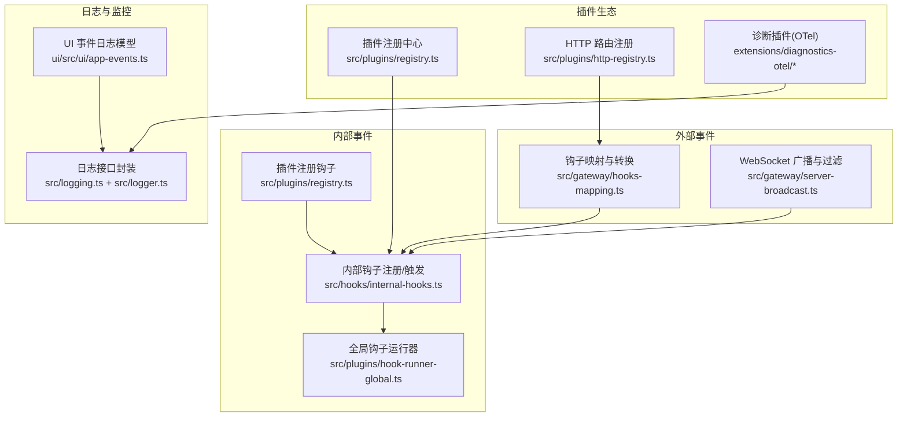
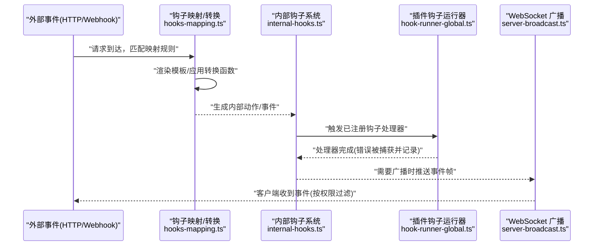
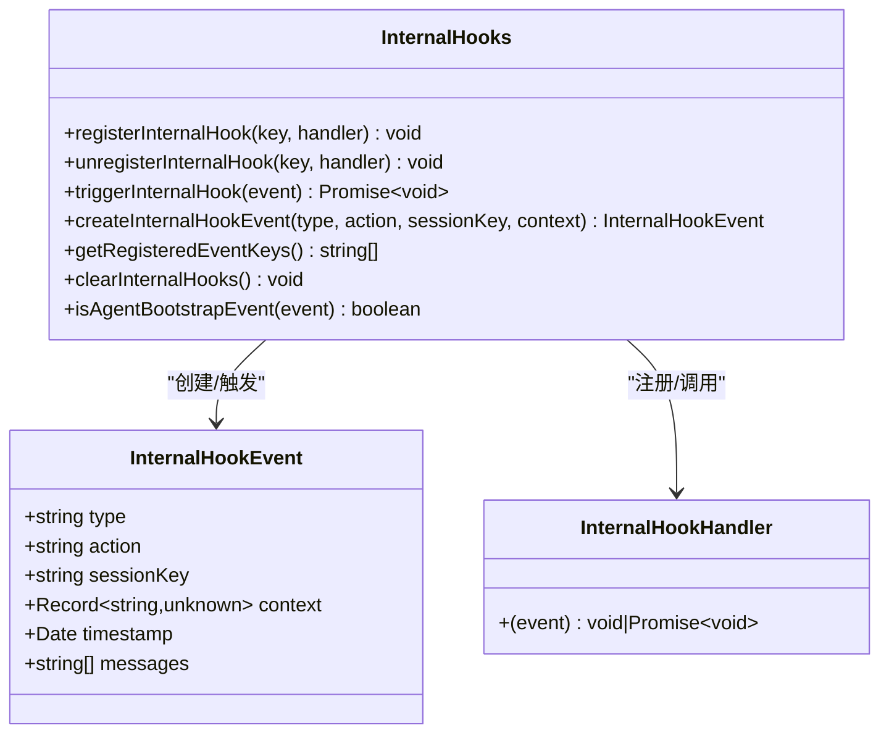
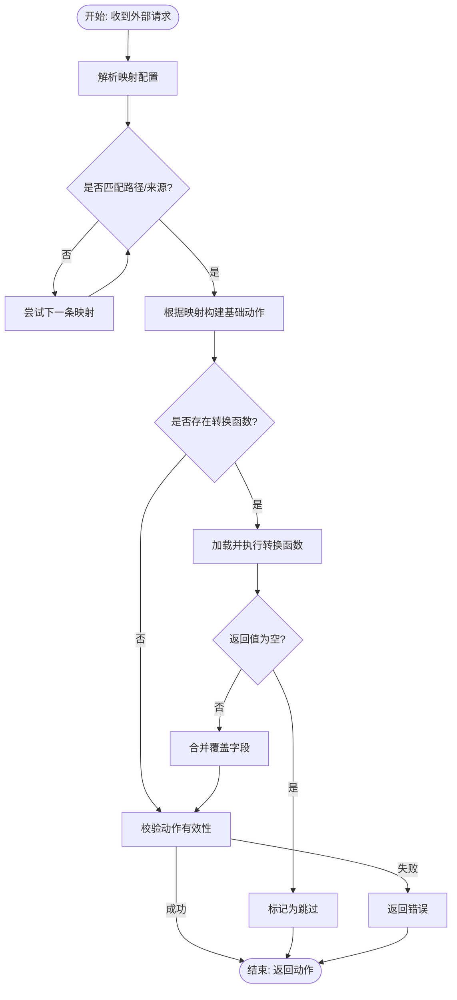
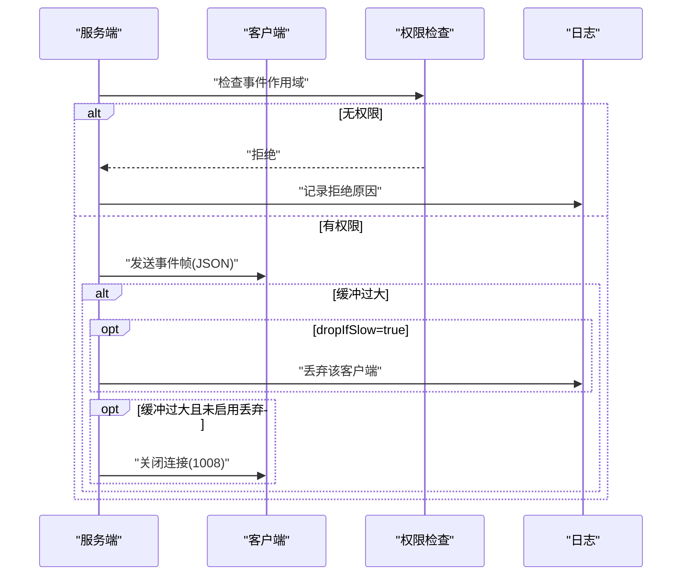
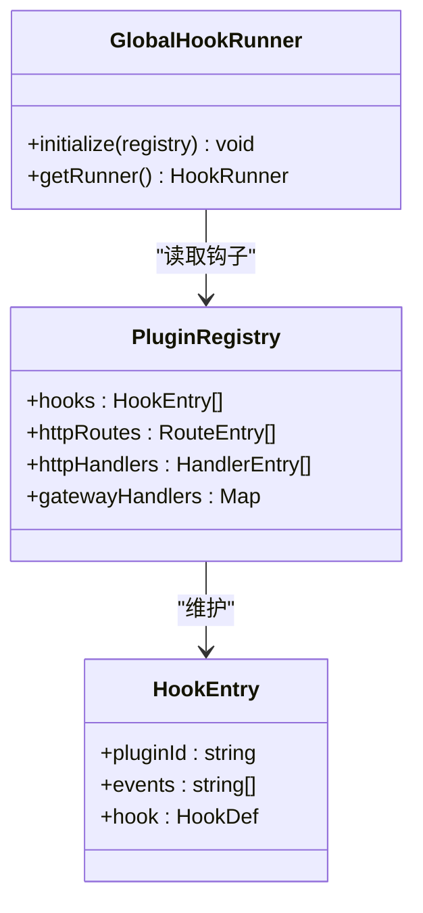
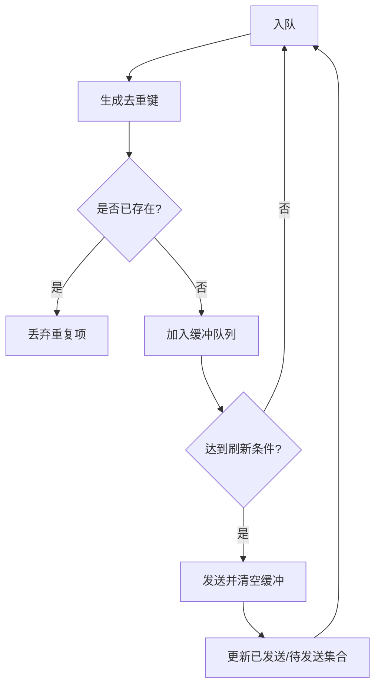
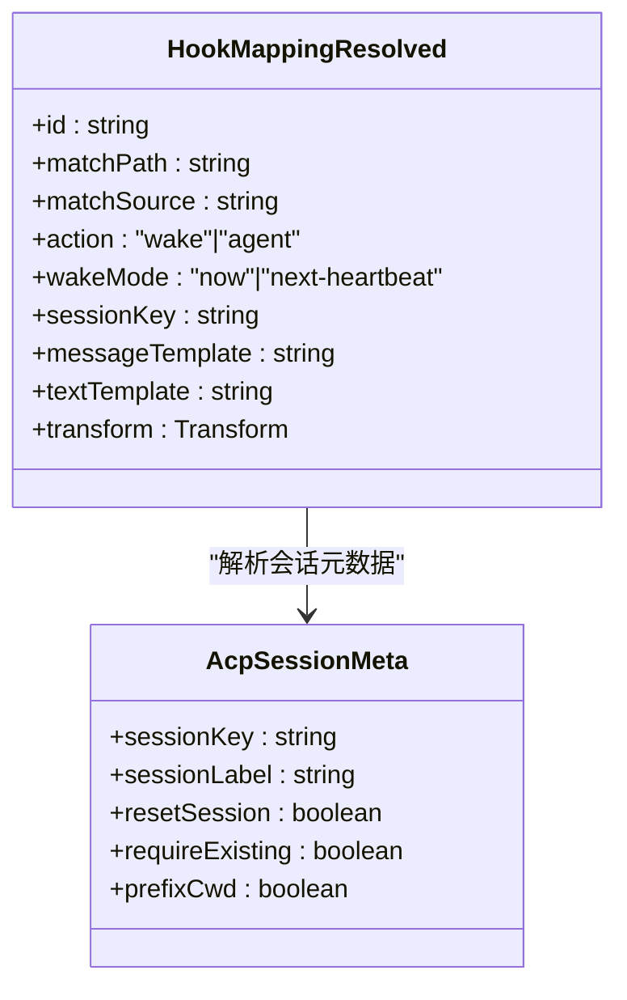
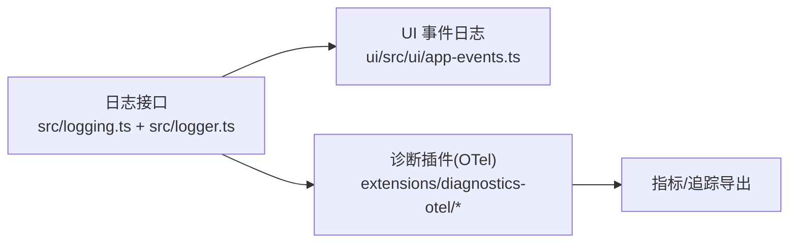
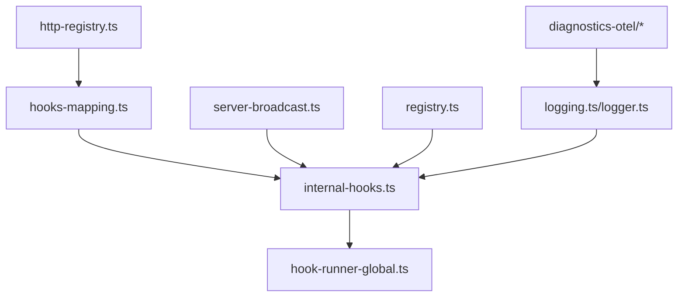

# 事件路由系统

<cite>
**本文引用的文件**
- [src/hooks/internal-hooks.ts](file://src/hooks/internal-hooks.ts)
- [src/hooks/internal-hooks.test.ts](file://src/hooks/internal-hooks.test.ts)
- [src/gateway/server-broadcast.ts](file://src/gateway/server-broadcast.ts)
- [src/gateway/hooks-mapping.ts](file://src/gateway/hooks-mapping.ts)
- [src/gateway/hooks-mapping.test.ts](file://src/gateway/hooks-mapping.test.ts)
- [src/acp/event-mapper.ts](file://src/acp/event-mapper.ts)
- [src/acp/session-mapper.ts](file://src/acp/session-mapper.ts)
- [src/plugins/registry.ts](file://src/plugins/registry.ts)
- [src/plugins/hook-runner-global.ts](file://src/plugins/hook-runner-global.ts)
- [src/plugins/http-registry.ts](file://src/plugins/http-registry.ts)
- [src/logging.ts](file://src/logging.ts)
- [src/logger.ts](file://src/logger.ts)
- [extensions/diagnostics-otel/index.ts](file://extensions/diagnostics-otel/index.ts)
- [extensions/diagnostics-otel/src/service.ts](file://extensions/diagnostics-otel/src/service.ts)
- [extensions/diagnostics-otel/src/service.test.ts](file://extensions/diagnostics-otel/src/service.test.ts)
- [extensions/nostr/src/nostr-bus.integration.test.ts](file://extensions/nostr/src/nostr-bus.integration.test.ts)
- [ui/src/ui/app-events.ts](file://ui/src/ui/app-events.ts)
</cite>

## 目录

1. [简介](#简介)
2. [项目结构](#项目结构)
3. [核心组件](#核心组件)
4. [架构总览](#架构总览)
5. [详细组件分析](#详细组件分析)
6. [依赖关系分析](#依赖关系分析)
7. [性能考量](#性能考量)
8. [故障排查指南](#故障排查指南)
9. [结论](#结论)
10. [附录](#附录)

## 简介

本技术文档围绕 OpenClaw 的事件路由系统展开，系统覆盖内部事件（内部钩子）与外部事件（HTTP/Webhook 钩子）两类事件源，提供事件分类、优先级与路由规则、事件处理器注册、事件分发机制、事件链式调用、事件映射表、事件过滤器与事件转换器、事件缓冲与队列、事件去重策略、事件监控与日志记录以及性能分析工具，并阐述系统的扩展性设计与插件集成机制。

## 项目结构

事件路由系统主要分布在以下模块：

- 内部事件系统：基于“类型:动作”键值的钩子注册与触发，支持通用类型与特定动作两种匹配维度。
- 外部事件系统：通过网关 HTTP/Webhook 接口接收外部事件，使用映射配置与可选转换函数生成内部动作。
- 广播与过滤：WebSocket 广播时按客户端权限进行事件作用域过滤，避免越权泄露。
- 插件系统：插件可注册钩子、HTTP 路由与网关方法，统一纳入全局钩子运行器。
- 日志与监控：统一日志接口、子系统日志、控制台样式化输出；诊断插件导出指标到 OpenTelemetry。

**图表来源**

- [src/hooks/internal-hooks.ts](file://src/hooks/internal-hooks.ts#L1-L182)
- [src/plugins/registry.ts](file://src/plugins/registry.ts#L216-L294)
- [src/plugins/hook-runner-global.ts](file://src/plugins/hook-runner-global.ts#L1-L52)
- [src/gateway/hooks-mapping.ts](file://src/gateway/hooks-mapping.ts#L1-L445)
- [src/gateway/server-broadcast.ts](file://src/gateway/server-broadcast.ts#L1-L121)
- [src/plugins/http-registry.ts](file://src/plugins/http-registry.ts#L1-L52)
- [src/logging.ts](file://src/logging.ts#L1-L68)
- [src/logger.ts](file://src/logger.ts#L1-L62)
- [extensions/diagnostics-otel/index.ts](file://extensions/diagnostics-otel/index.ts#L1-L15)
- [extensions/diagnostics-otel/src/service.ts](file://extensions/diagnostics-otel/src/service.ts#L1-L30)
- [ui/src/ui/app-events.ts](file://ui/src/ui/app-events.ts#L1-L5)

**章节来源**

- [src/hooks/internal-hooks.ts](file://src/hooks/internal-hooks.ts#L1-L182)
- [src/gateway/server-broadcast.ts](file://src/gateway/server-broadcast.ts#L1-L121)
- [src/gateway/hooks-mapping.ts](file://src/gateway/hooks-mapping.ts#L1-L445)
- [src/plugins/registry.ts](file://src/plugins/registry.ts#L216-L294)
- [src/plugins/hook-runner-global.ts](file://src/plugins/hook-runner-global.ts#L1-L52)
- [src/plugins/http-registry.ts](file://src/plugins/http-registry.ts#L1-L52)
- [src/logging.ts](file://src/logging.ts#L1-L68)
- [src/logger.ts](file://src/logger.ts#L1-L62)
- [extensions/diagnostics-otel/index.ts](file://extensions/diagnostics-otel/index.ts#L1-L15)
- [extensions/diagnostics-otel/src/service.ts](file://extensions/diagnostics-otel/src/service.ts#L1-L30)
- [ui/src/ui/app-events.ts](file://ui/src/ui/app-events.ts#L1-L5)

## 核心组件

- 内部钩子系统：提供事件类型与动作的两级匹配，支持通用类型与具体动作同时触发，错误捕获与日志记录，便于链式调用与去重。
- 钩子映射与转换：从外部请求解析为内部动作，支持模板渲染、路径匹配、来源匹配与可选转换函数，转换函数可返回空以跳过处理。
- WebSocket 广播与权限过滤：对事件按客户端角色与作用域进行过滤，支持慢消费者丢弃或断开，保障广播稳定性。
- 插件注册与运行：插件可注册钩子、HTTP 路由与网关方法，全局钩子运行器集中管理执行上下文与日志。
- 日志与监控：统一日志接口、子系统日志、控制台样式化输出；诊断插件将事件指标与追踪导出至 OpenTelemetry。

**章节来源**

- [src/hooks/internal-hooks.ts](file://src/hooks/internal-hooks.ts#L11-L182)
- [src/gateway/hooks-mapping.ts](file://src/gateway/hooks-mapping.ts#L66-L176)
- [src/gateway/server-broadcast.ts](file://src/gateway/server-broadcast.ts#L9-L121)
- [src/plugins/registry.ts](file://src/plugins/registry.ts#L216-L294)
- [src/plugins/hook-runner-global.ts](file://src/plugins/hook-runner-global.ts#L1-L52)
- [src/logging.ts](file://src/logging.ts#L1-L68)
- [src/logger.ts](file://src/logger.ts#L1-L62)

## 架构总览

事件从外部进入后，经由钩子映射与转换生成内部动作，再通过内部钩子系统分发给已注册的处理器；同时，系统通过 WebSocket 广播将事件安全地推送给有权限的客户端。插件生态贯穿其中，既可注册钩子参与事件处理，也可注册 HTTP 路由与网关方法扩展能力。日志与监控贯穿全链路，确保可观测性与性能分析。

**图表来源**

- [src/gateway/hooks-mapping.ts](file://src/gateway/hooks-mapping.ts#L140-L176)
- [src/hooks/internal-hooks.ts](file://src/hooks/internal-hooks.ts#L123-L143)
- [src/plugins/hook-runner-global.ts](file://src/plugins/hook-runner-global.ts#L21-L36)
- [src/gateway/server-broadcast.ts](file://src/gateway/server-broadcast.ts#L37-L93)

**章节来源**

- [src/gateway/hooks-mapping.ts](file://src/gateway/hooks-mapping.ts#L140-L176)
- [src/hooks/internal-hooks.ts](file://src/hooks/internal-hooks.ts#L123-L143)
- [src/plugins/hook-runner-global.ts](file://src/plugins/hook-runner-global.ts#L21-L36)
- [src/gateway/server-broadcast.ts](file://src/gateway/server-broadcast.ts#L37-L93)

## 详细组件分析

### 内部钩子系统（内部事件）

- 事件模型：包含类型、动作、会话键、上下文、时间戳与消息数组，支持链式调用中向处理器收集消息。
- 注册与注销：按“类型”或“类型:动作”两种键注册处理器，注销后自动清理空数组。
- 触发机制：先触发通用类型处理器，再触发具体动作处理器；处理器异常被捕获并记录，不影响其他处理器执行。
- 工具函数：创建事件、判断代理引导事件、获取已注册键列表、清空所有钩子等。

**图表来源**

- [src/hooks/internal-hooks.ts](file://src/hooks/internal-hooks.ts#L28-L182)

**章节来源**

- [src/hooks/internal-hooks.ts](file://src/hooks/internal-hooks.ts#L11-L182)
- [src/hooks/internal-hooks.test.ts](file://src/hooks/internal-hooks.test.ts#L1-L248)

### 钩子映射与转换（外部事件）

- 映射配置：支持预设与自定义映射，每条映射包含匹配条件（路径、来源）、动作类型（唤醒/代理）与模板参数。
- 转换函数：可选的 JS 模块导出函数，用于动态覆盖映射结果；返回空表示跳过该事件。
- 模板渲染：支持从请求头、查询参数、负载路径中提取变量进行渲染。
- 动作合并：将映射默认动作与转换函数覆盖结果合并，保证字段完整性与优先级。

**图表来源**

- [src/gateway/hooks-mapping.ts](file://src/gateway/hooks-mapping.ts#L105-L176)
- [src/gateway/hooks-mapping.test.ts](file://src/gateway/hooks-mapping.test.ts#L91-L128)

**章节来源**

- [src/gateway/hooks-mapping.ts](file://src/gateway/hooks-mapping.ts#L66-L176)
- [src/gateway/hooks-mapping.test.ts](file://src/gateway/hooks-mapping.test.ts#L91-L128)

### WebSocket 广播与事件过滤

- 事件作用域：部分事件需要特定操作员角色与授权范围才能接收，系统在广播前进行检查。
- 慢消费者保护：当客户端缓冲区超过阈值时，可选择丢弃或直接断开连接，防止拥塞扩散。
- 序列号与状态版本：广播帧包含事件序列号与状态版本，便于客户端同步与去重。

**图表来源**

- [src/gateway/server-broadcast.ts](file://src/gateway/server-broadcast.ts#L9-L121)

**章节来源**

- [src/gateway/server-broadcast.ts](file://src/gateway/server-broadcast.ts#L9-L121)

### 插件注册与钩子运行器

- 插件注册：插件可注册钩子、HTTP 路由与网关方法；钩子注册时可选择是否接入内部钩子系统。
- 全局钩子运行器：在插件加载完成后初始化，集中管理钩子执行、日志与错误捕获。
- HTTP 路由注册：支持注册特定路径的路由与回退路径，避免重复注册。

**图表来源**

- [src/plugins/registry.ts](file://src/plugins/registry.ts#L216-L294)
- [src/plugins/hook-runner-global.ts](file://src/plugins/hook-runner-global.ts#L1-L52)
- [src/plugins/http-registry.ts](file://src/plugins/http-registry.ts#L1-L52)

**章节来源**

- [src/plugins/registry.ts](file://src/plugins/registry.ts#L216-L294)
- [src/plugins/hook-runner-global.ts](file://src/plugins/hook-runner-global.ts#L1-L52)
- [src/plugins/http-registry.ts](file://src/plugins/http-registry.ts#L1-L52)

### 事件缓冲、队列与去重策略

- 自动回复队列：指令解析支持多种队列模式（如“steer”“interrupt”“collect”“steer+backlog”），并支持去重策略（保留旧、新或摘要）。
- 去重键：基于负载关键信息生成唯一键，结合已发送、待发送、已见等集合进行去重。
- 缓冲与刷新：批量缓冲后统一发送，减少网络压力与抖动。

**图表来源**

- [src/auto-reply/reply/block-reply-pipeline.ts](file://src/auto-reply/reply/block-reply-pipeline.ts#L163-L193)

**章节来源**

- [src/auto-reply/reply/block-reply-pipeline.ts](file://src/auto-reply/reply/block-reply-pipeline.ts#L163-L193)

### 事件映射表与转换器

- 映射表：支持预设与自定义映射，包含匹配条件、动作类型、模板与可选转换模块。
- 转换器：通过模板表达式从上下文提取数据，支持字符串、数字、布尔与对象渲染。
- ACP 会话映射：将外部元数据解析为会话键，支持标签解析与键存在性校验。

**图表来源**

- [src/gateway/hooks-mapping.ts](file://src/gateway/hooks-mapping.ts#L6-L31)
- [src/acp/session-mapper.ts](file://src/acp/session-mapper.ts#L5-L25)

**章节来源**

- [src/gateway/hooks-mapping.ts](file://src/gateway/hooks-mapping.ts#L66-L176)
- [src/acp/session-mapper.ts](file://src/acp/session-mapper.ts#L13-L99)

### 事件监控、日志记录与性能分析

- 日志接口：统一的日志封装，支持子系统日志、控制台样式化输出与文件日志级别控制。
- UI 事件日志：前端 UI 使用事件日志模型记录事件与载荷，便于调试与审计。
- 诊断插件（OTel）：将诊断事件导出到 OpenTelemetry，支持计数器、直方图与追踪，提供消息流指标与跨度。

**图表来源**

- [src/logging.ts](file://src/logging.ts#L1-L68)
- [src/logger.ts](file://src/logger.ts#L1-L62)
- [ui/src/ui/app-events.ts](file://ui/src/ui/app-events.ts#L1-L5)
- [extensions/diagnostics-otel/index.ts](file://extensions/diagnostics-otel/index.ts#L1-L15)
- [extensions/diagnostics-otel/src/service.ts](file://extensions/diagnostics-otel/src/service.ts#L1-L30)

**章节来源**

- [src/logging.ts](file://src/logging.ts#L1-L68)
- [src/logger.ts](file://src/logger.ts#L1-L62)
- [ui/src/ui/app-events.ts](file://ui/src/ui/app-events.ts#L1-L5)
- [extensions/diagnostics-otel/index.ts](file://extensions/diagnostics-otel/index.ts#L1-L15)
- [extensions/diagnostics-otel/src/service.ts](file://extensions/diagnostics-otel/src/service.ts#L1-L30)

## 依赖关系分析

- 内部钩子系统与插件注册紧密耦合：插件注册时可将自身事件映射到内部钩子键，形成统一的事件处理入口。
- 外部事件通过映射系统桥接至内部钩子，再由全局钩子运行器调度各处理器。
- WebSocket 广播依赖权限守卫与慢消费者保护，避免越权与拥塞。
- 日志与监控贯穿全链路，诊断插件独立于核心逻辑，通过插件 API 注册服务。

**图表来源**

- [src/hooks/internal-hooks.ts](file://src/hooks/internal-hooks.ts#L1-L182)
- [src/plugins/hook-runner-global.ts](file://src/plugins/hook-runner-global.ts#L1-L52)
- [src/gateway/hooks-mapping.ts](file://src/gateway/hooks-mapping.ts#L1-L445)
- [src/gateway/server-broadcast.ts](file://src/gateway/server-broadcast.ts#L1-L121)
- [src/plugins/registry.ts](file://src/plugins/registry.ts#L216-L294)
- [src/plugins/http-registry.ts](file://src/plugins/http-registry.ts#L1-L52)
- [src/logging.ts](file://src/logging.ts#L1-L68)
- [src/logger.ts](file://src/logger.ts#L1-L62)
- [extensions/diagnostics-otel/src/service.ts](file://extensions/diagnostics-otel/src/service.ts#L1-L30)

**章节来源**

- [src/hooks/internal-hooks.ts](file://src/hooks/internal-hooks.ts#L1-L182)
- [src/gateway/hooks-mapping.ts](file://src/gateway/hooks-mapping.ts#L1-L445)
- [src/gateway/server-broadcast.ts](file://src/gateway/server-broadcast.ts#L1-L121)
- [src/plugins/registry.ts](file://src/plugins/registry.ts#L216-L294)
- [src/plugins/hook-runner-global.ts](file://src/plugins/hook-runner-global.ts#L1-L52)
- [src/plugins/http-registry.ts](file://src/plugins/http-registry.ts#L1-L52)
- [src/logging.ts](file://src/logging.ts#L1-L68)
- [src/logger.ts](file://src/logger.ts#L1-L62)
- [extensions/diagnostics-otel/src/service.ts](file://extensions/diagnostics-otel/src/service.ts#L1-L30)

## 性能考量

- 广播优化：慢消费者丢弃或断开，避免阻塞主循环；事件序列号与状态版本有助于客户端快速同步。
- 钩子执行：异步处理器按顺序执行，异常被捕获不中断整体流程；建议处理器内部做超时与限流。
- 队列与缓冲：自动回复队列支持多种模式与去重策略，合理设置去重键与容量可降低重复与内存占用。
- 日志与监控：OTel 导出采用批处理与周期导出，避免频繁 I/O；日志级别与子系统过滤减少冗余输出。

## 故障排查指南

- 内部钩子无响应：确认事件键是否正确（类型或类型:动作），检查处理器是否注册、是否被注销、是否抛错被吞掉。
- 外部事件未触发：核对映射路径与来源匹配、模板渲染结果、转换函数返回值（返回空表示跳过）。
- WebSocket 未收到事件：检查客户端角色与作用域、慢消费者保护策略、缓冲区阈值。
- 插件钩子无效：确认插件是否已加载、钩子注册是否生效、全局钩子运行器是否初始化。
- 日志缺失：检查日志级别、子系统过滤、控制台样式化开关与文件落盘配置。

**章节来源**

- [src/hooks/internal-hooks.test.ts](file://src/hooks/internal-hooks.test.ts#L120-L141)
- [src/gateway/hooks-mapping.test.ts](file://src/gateway/hooks-mapping.test.ts#L100-L128)
- [src/gateway/server-broadcast.ts](file://src/gateway/server-broadcast.ts#L75-L92)
- [src/plugins/hook-runner-global.ts](file://src/plugins/hook-runner-global.ts#L21-L36)
- [src/logging.ts](file://src/logging.ts#L1-L68)

## 结论

OpenClaw 事件路由系统通过“内部钩子 + 外部映射”的双通道设计，实现了从外部事件到内部处理的清晰路径；配合权限过滤、慢消费者保护与统一日志监控，确保了系统的稳定性与可观测性。插件生态进一步增强了扩展性，使事件处理与路由具备高度灵活性与可维护性。

## 附录

- 事件分类与优先级：内部钩子按“类型”与“类型:动作”两级匹配，动作优先级由映射配置决定；WebSocket 广播按权限与缓冲状态决定是否投递。
- 事件链式调用：处理器可通过事件对象的消息数组收集后续处理信息，形成链式传递。
- 扩展与集成：插件可注册钩子、HTTP 路由与网关方法，统一由全局钩子运行器调度；诊断插件通过 OTel 提供性能与可观测性增强。
