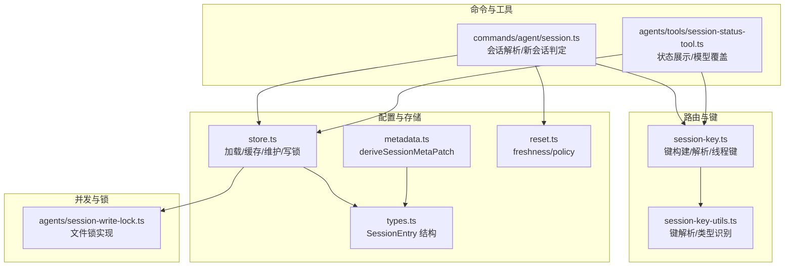
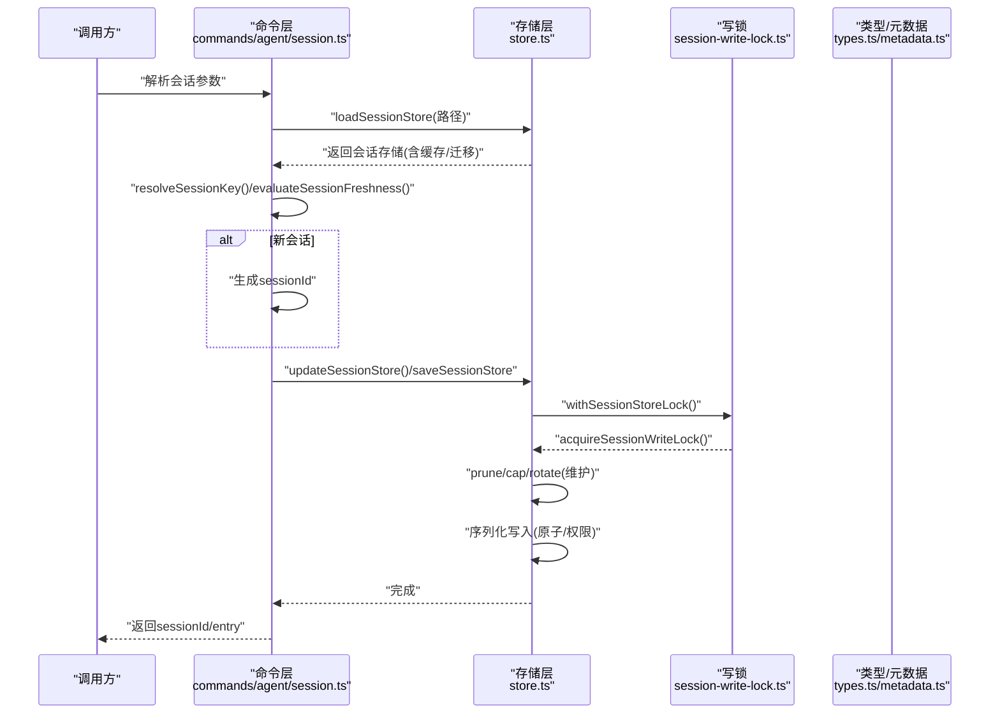
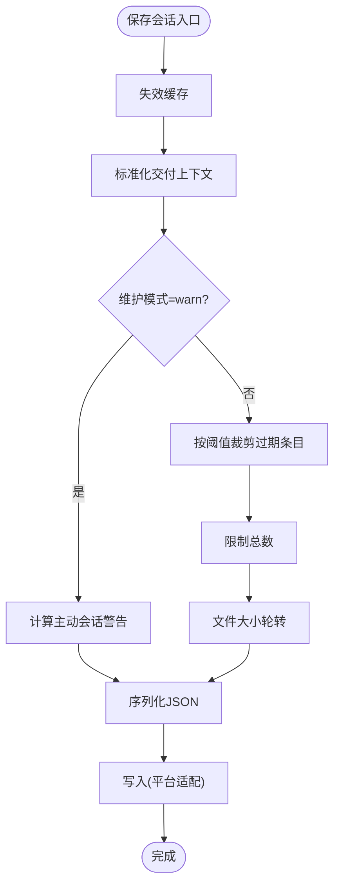
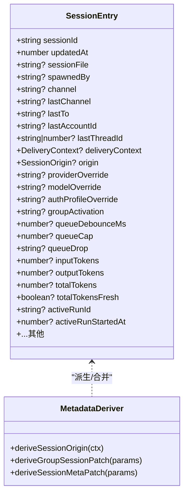
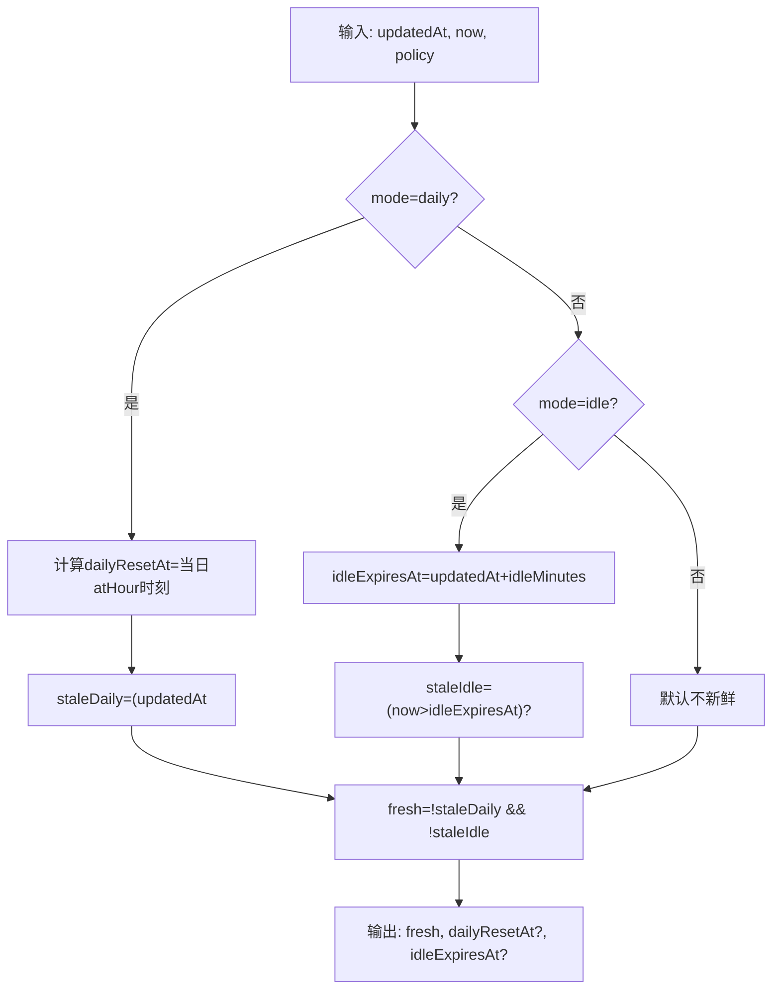
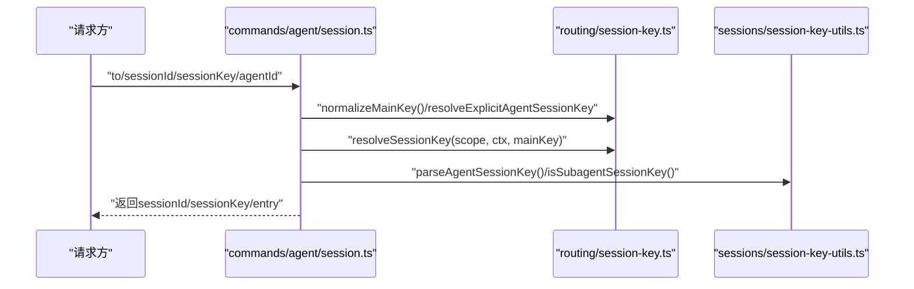
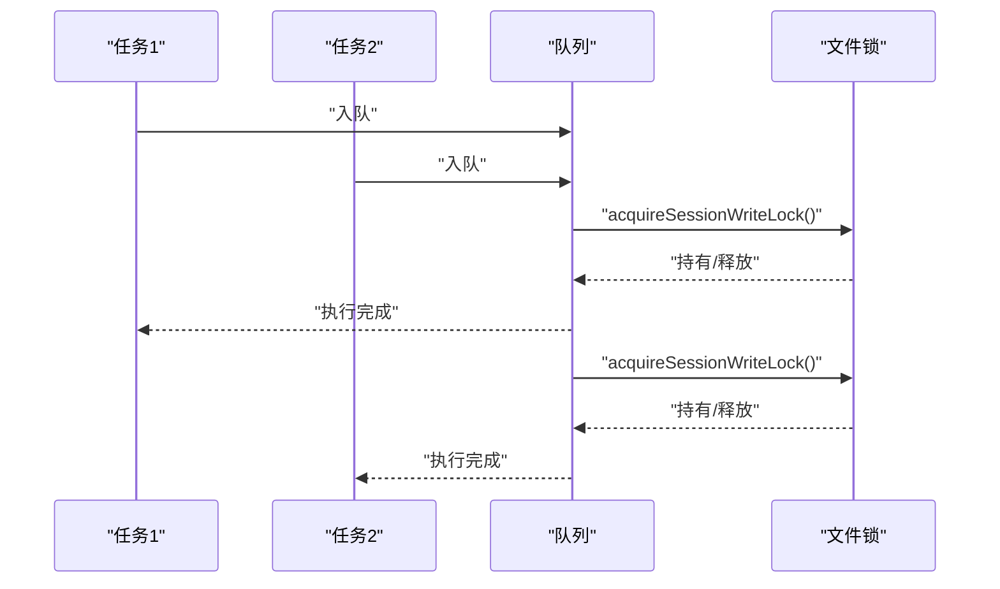
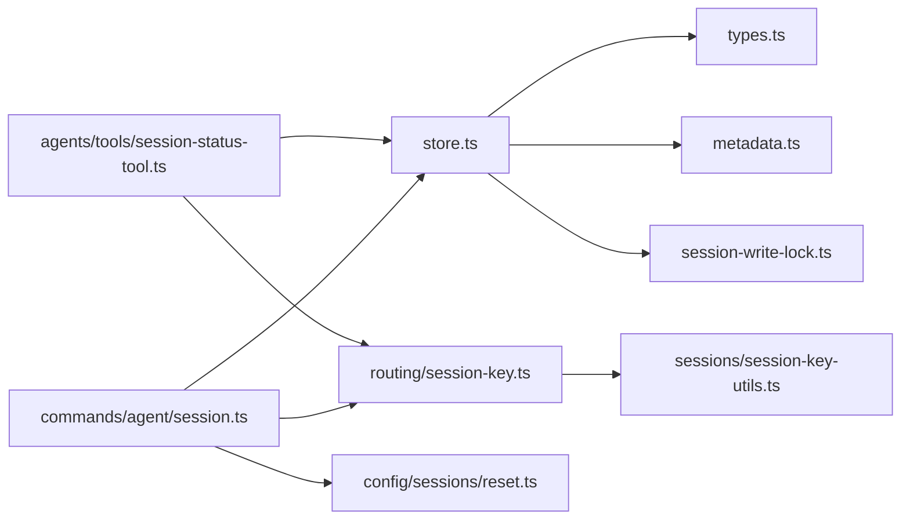

# 会话管理系统

<cite>
**本文档引用的文件**
- [src/config/sessions/store.ts](file://src/config/sessions/store.ts)
- [src/config/sessions/types.ts](file://src/config/sessions/types.ts)
- [src/config/sessions/metadata.ts](file://src/config/sessions/metadata.ts)
- [src/config/sessions/reset.ts](file://src/config/sessions/reset.ts)
- [src/config/sessions/store.lock.test.ts](file://src/config/sessions/store.lock.test.ts)
- [src/agents/session-write-lock.ts](file://src/agents/session-write-lock.ts)
- [src/commands/agent/session.ts](file://src/commands/agent/session.ts)
- [src/sessions/session-key-utils.ts](file://src/sessions/session-key-utils.ts)
- [src/routing/session-key.ts](file://src/routing/session-key.ts)
- [src/agents/tools/session-status-tool.ts](file://src/agents/tools/session-status-tool.ts)
</cite>

## 目录

1. [简介](#简介)
2. [项目结构](#项目结构)
3. [核心组件](#核心组件)
4. [架构总览](#架构总览)
5. [详细组件分析](#详细组件分析)
6. [依赖关系分析](#依赖关系分析)
7. [性能考量](#性能考量)
8. [故障排查指南](#故障排查指南)
9. [结论](#结论)
10. [附录](#附录)

## 简介

本文件面向OpenClaw会话管理系统，系统性阐述会话的创建、维护与销毁流程，覆盖会话状态管理、生命周期控制、会话密钥生成与路由、会话标识符管理、上下文存储与消息历史、状态同步策略、并发控制与一致性保障、配置项与超时清理策略，以及持久化、备份与迁移方案。目标是帮助开发者与运维人员快速理解并正确使用会话子系统。

## 项目结构

会话管理相关代码主要集中在以下模块：

- 配置与存储：会话存储加载、缓存、维护（裁剪、清理、轮转）、写锁与并发控制
- 类型定义：会话条目结构、字段语义与合并策略
- 元数据派生：从消息上下文推导会话来源、群组与通道信息
- 重置策略：按类型/通道/空闲时间等维度决定会话新鲜度与是否重置
- 路由与键工具：会话键解析、规范化、线程键派生、代理会话键构建
- 命令层：请求侧会话解析与新会话判定
- 工具：会话状态查询与模型覆盖应用

图表来源

- [src/config/sessions/store.ts](file://src/config/sessions/store.ts#L147-L213)
- [src/config/sessions/types.ts](file://src/config/sessions/types.ts#L25-L121)
- [src/config/sessions/metadata.ts](file://src/config/sessions/metadata.ts#L153-L172)
- [src/config/sessions/reset.ts](file://src/config/sessions/reset.ts#L84-L176)
- [src/routing/session-key.ts](file://src/routing/session-key.ts#L130-L186)
- [src/sessions/session-key-utils.ts](file://src/sessions/session-key-utils.ts#L1-L84)
- [src/commands/agent/session.ts](file://src/commands/agent/session.ts#L84-L141)
- [src/agents/tools/session-status-tool.ts](file://src/agents/tools/session-status-tool.ts#L251-L474)
- [src/agents/session-write-lock.ts](file://src/agents/session-write-lock.ts#L112-L202)

章节来源

- [src/config/sessions/store.ts](file://src/config/sessions/store.ts#L147-L213)
- [src/config/sessions/types.ts](file://src/config/sessions/types.ts#L25-L121)
- [src/config/sessions/metadata.ts](file://src/config/sessions/metadata.ts#L153-L172)
- [src/config/sessions/reset.ts](file://src/config/sessions/reset.ts#L84-L176)
- [src/routing/session-key.ts](file://src/routing/session-key.ts#L130-L186)
- [src/sessions/session-key-utils.ts](file://src/sessions/session-key-utils.ts#L1-L84)
- [src/commands/agent/session.ts](file://src/commands/agent/session.ts#L84-L141)
- [src/agents/tools/session-status-tool.ts](file://src/agents/tools/session-status-tool.ts#L251-L474)
- [src/agents/session-write-lock.ts](file://src/agents/session-write-lock.ts#L112-L202)

## 核心组件

- 会话存储与维护
  - 加载/缓存：支持TTL缓存、mtime校验、深拷贝返回；支持最佳努力迁移旧字段
  - 维护：按阈值裁剪过期条目、限制总数、文件大小轮转
  - 写入：统一通过写锁串行化，避免竞态；跨平台原子落盘
- 会话类型与元数据
  - SessionEntry：包含会话标识、更新时间、通道/账号/线程上下文、队列/权限/令牌用量等
  - 元数据派生：从消息上下文推导来源、群组/频道、显示名等
- 会话重置策略
  - 支持按类型/通道/每日/空闲等多种策略，评估会话新鲜度
- 会话键与路由
  - 键构建：代理主会话、直接对话、群组/频道、线程键
  - 解析：识别代理键、子代理键、AC/PC键、线程父键
- 并发与一致性
  - Promise链式队列锁：单文件粒度排队执行
  - 文件级写锁：基于锁文件，带超时与“陈旧”检测
- 命令与工具
  - 请求侧解析：根据作用域/显式键/消息上下文解析会话键，必要时复用sessionId
  - 状态工具：展示使用量/时间/队列等，并可对会话应用模型覆盖

章节来源

- [src/config/sessions/store.ts](file://src/config/sessions/store.ts#L147-L213)
- [src/config/sessions/store.ts](file://src/config/sessions/store.ts#L281-L294)
- [src/config/sessions/store.ts](file://src/config/sessions/store.ts#L301-L319)
- [src/config/sessions/store.ts](file://src/config/sessions/store.ts#L371-L397)
- [src/config/sessions/store.ts](file://src/config/sessions/store.ts#L413-L465)
- [src/config/sessions/store.ts](file://src/config/sessions/store.ts#L580-L602)
- [src/config/sessions/store.ts](file://src/config/sessions/store.ts#L712-L753)
- [src/config/sessions/types.ts](file://src/config/sessions/types.ts#L25-L121)
- [src/config/sessions/metadata.ts](file://src/config/sessions/metadata.ts#L153-L172)
- [src/config/sessions/reset.ts](file://src/config/sessions/reset.ts#L84-L176)
- [src/routing/session-key.ts](file://src/routing/session-key.ts#L130-L186)
- [src/sessions/session-key-utils.ts](file://src/sessions/session-key-utils.ts#L1-L84)
- [src/commands/agent/session.ts](file://src/commands/agent/session.ts#L84-L141)
- [src/agents/tools/session-status-tool.ts](file://src/agents/tools/session-status-tool.ts#L251-L474)
- [src/agents/session-write-lock.ts](file://src/agents/session-write-lock.ts#L112-L202)

## 架构总览

下图展示了从请求到会话解析、状态维护与持久化的整体流程。

图表来源

- [src/commands/agent/session.ts](file://src/commands/agent/session.ts#L84-L141)
- [src/config/sessions/store.ts](file://src/config/sessions/store.ts#L580-L602)
- [src/config/sessions/store.ts](file://src/config/sessions/store.ts#L712-L753)
- [src/agents/session-write-lock.ts](file://src/agents/session-write-lock.ts#L112-L202)
- [src/config/sessions/types.ts](file://src/config/sessions/types.ts#L25-L121)
- [src/config/sessions/metadata.ts](file://src/config/sessions/metadata.ts#L153-L172)

## 详细组件分析

### 会话存储与维护

- 缓存与迁移
  - 支持TTL缓存与mtime校验，避免重复磁盘IO；深拷贝返回防止外部污染缓存
  - 最佳努力迁移旧字段（如provider→channel、lastProvider→lastChannel、room→groupChannel）
- 维护策略
  - 按updatedAt裁剪过期条目，默认保留30天
  - 总数上限裁剪，默认最多500条，按最近更新排序
  - 文件大小轮转，默认10MB，保留最近3个.bak.\*备份
- 写入与一致性
  - 统一通过withSessionStoreLock串行化；内部重新读取以避免竞态
  - 跨平台写入：Windows直写，其他平台先写临时文件再rename，确保原子性；失败回退至直写
  - 写前失效缓存，写后chmod 0600，提升一致性与安全性

图表来源

- [src/config/sessions/store.ts](file://src/config/sessions/store.ts#L476-L578)
- [src/config/sessions/store.ts](file://src/config/sessions/store.ts#L281-L294)
- [src/config/sessions/store.ts](file://src/config/sessions/store.ts#L301-L319)
- [src/config/sessions/store.ts](file://src/config/sessions/store.ts#L371-L397)
- [src/config/sessions/store.ts](file://src/config/sessions/store.ts#L413-L465)

章节来源

- [src/config/sessions/store.ts](file://src/config/sessions/store.ts#L147-L213)
- [src/config/sessions/store.ts](file://src/config/sessions/store.ts#L281-L294)
- [src/config/sessions/store.ts](file://src/config/sessions/store.ts#L301-L319)
- [src/config/sessions/store.ts](file://src/config/sessions/store.ts#L371-L397)
- [src/config/sessions/store.ts](file://src/config/sessions/store.ts#L413-L465)
- [src/config/sessions/store.ts](file://src/config/sessions/store.ts#L580-L602)
- [src/config/sessions/store.ts](file://src/config/sessions/store.ts#L712-L753)

### 会话类型与元数据

- SessionEntry字段
  - 标识与时间：sessionId、updatedAt、spawnedBy、activeRunId/startedAt
  - 上下文：channel/lastChannel、lastTo/lastAccountId/lastThreadId、deliveryContext、origin
  - 行为：queueMode/queueDebounceMs/queueCap/queueDrop、sendPolicy、groupActivation
  - 认证与模型：providerOverride/modelOverride/authProfileOverride、ttsAuto、execHost/Security/Ask/Node
  - 计费与用量：input/output/totalTokens(totalTokensFresh)、responseUsage
  - 技能与系统提示报告：skillsSnapshot、systemPromptReport
  - CLI会话映射：cliSessionIds、claudeCliSessionId
- 元数据派生
  - 从消息上下文deriveSessionOrigin/deriveGroupSessionPatch/deriveSessionMetaPatch
  - 合并SessionEntry.origin，避免覆盖已有信息
- 合并策略
  - mergeSessionEntry：sessionId与updatedAt按规则生成或取最大值，其余字段浅合并

图表来源

- [src/config/sessions/types.ts](file://src/config/sessions/types.ts#L25-L121)
- [src/config/sessions/metadata.ts](file://src/config/sessions/metadata.ts#L45-L87)
- [src/config/sessions/metadata.ts](file://src/config/sessions/metadata.ts#L96-L151)
- [src/config/sessions/metadata.ts](file://src/config/sessions/metadata.ts#L153-L172)

章节来源

- [src/config/sessions/types.ts](file://src/config/sessions/types.ts#L25-L121)
- [src/config/sessions/metadata.ts](file://src/config/sessions/metadata.ts#L45-L87)
- [src/config/sessions/metadata.ts](file://src/config/sessions/metadata.ts#L96-L151)
- [src/config/sessions/metadata.ts](file://src/config/sessions/metadata.ts#L153-L172)

### 会话重置策略与新鲜度

- 策略解析
  - 支持全局reset、按类型（direct/group/channel）与按通道细分
  - 兼容旧字段idleMinutes；默认模式为daily/atHour 0或idle（空闲分钟）
- 新鲜度评估
  - daily：基于updatedAt与atHour比较
  - idle：基于updatedAt + idleMinutes
  - 返回fresh标志，用于判定是否复用现有sessionId

图表来源

- [src/config/sessions/reset.ts](file://src/config/sessions/reset.ts#L84-L120)
- [src/config/sessions/reset.ts](file://src/config/sessions/reset.ts#L139-L159)

章节来源

- [src/config/sessions/reset.ts](file://src/config/sessions/reset.ts#L84-L120)
- [src/config/sessions/reset.ts](file://src/config/sessions/reset.ts#L139-L159)

### 会话键生成与路由

- 键构建
  - 主会话：buildAgentMainSessionKey(agentId, mainKey)
  - 直接对话：buildAgentPeerSessionKey(..., peerKind='direct', 可选多粒度scope)
  - 群组/频道：buildAgentPeerSessionKey(..., peerKind='group'/'channel')
  - 线程键：resolveThreadSessionKeys(base, threadId, useSuffix=true)
- 键解析与识别
  - parseAgentSessionKey：解析agent:agentId:rest
  - isSubagentSessionKey/isAcpSessionKey：识别子代理/AC/PC键
  - resolveThreadParentSessionKey：从thread/topic后缀提取父键
- 请求侧键解析
  - resolveSessionKeyForRequest：结合scope/mainKey/显式键/消息上下文解析
  - 若提供sessionId且未命中显式键，则按sessionId反查

图表来源

- [src/commands/agent/session.ts](file://src/commands/agent/session.ts#L41-L82)
- [src/routing/session-key.ts](file://src/routing/session-key.ts#L130-L186)
- [src/sessions/session-key-utils.ts](file://src/sessions/session-key-utils.ts#L1-L84)

章节来源

- [src/routing/session-key.ts](file://src/routing/session-key.ts#L130-L186)
- [src/sessions/session-key-utils.ts](file://src/sessions/session-key-utils.ts#L1-L84)
- [src/commands/agent/session.ts](file://src/commands/agent/session.ts#L41-L82)

### 并发控制与一致性

- Promise链式队列锁
  - withSessionStoreLock：每个storePath维护队列，串行执行任务，支持超时与staleMs
  - drainSessionStoreLockQueue：微任务驱动队列清空，避免阻塞事件循环
- 文件级写锁
  - acquireSessionWriteLock：基于锁文件，带超时与“陈旧”检测（进程不存在或超过staleMs）
  - 多次获取计数累加，释放时递减至0才真正关闭句柄与删除锁文件
- 测试验证
  - 单测覆盖并发写入不破坏数据、队列长度、超时行为等

图表来源

- [src/config/sessions/store.ts](file://src/config/sessions/store.ts#L604-L753)
- [src/agents/session-write-lock.ts](file://src/agents/session-write-lock.ts#L112-L202)
- [src/config/sessions/store.lock.test.ts](file://src/config/sessions/store.lock.test.ts#L1-L39)

章节来源

- [src/config/sessions/store.ts](file://src/config/sessions/store.ts#L604-L753)
- [src/agents/session-write-lock.ts](file://src/agents/session-write-lock.ts#L112-L202)
- [src/config/sessions/store.lock.test.ts](file://src/config/sessions/store.lock.test.ts#L1-L39)

### 会话状态查询与模型覆盖

- 状态工具
  - 支持按sessionKey/sessionId解析目标会话，跨代理访问受策略控制
  - 展示使用量、时间、队列深度与去重策略等
  - 可对会话应用模型覆盖（provider/model），并持久化更新
- 会话解析
  - resolveSessionKeyFromSessionId：在网关组合存储中按sessionId查找
  - resolveSession：综合重置策略与freshness决定是否复用sessionId

章节来源

- [src/agents/tools/session-status-tool.ts](file://src/agents/tools/session-status-tool.ts#L126-L186)
- [src/agents/tools/session-status-tool.ts](file://src/agents/tools/session-status-tool.ts#L251-L474)
- [src/commands/agent/session.ts](file://src/commands/agent/session.ts#L84-L141)

## 依赖关系分析

- 存储层依赖
  - 会话类型与元数据：types.ts/metadata.ts
  - 写锁：agents/session-write-lock.ts
  - 命令层：commands/agent/session.ts
  - 工具层：agents/tools/session-status-tool.ts
- 路由与键工具
  - 会话键构建/解析：routing/session-key.ts
  - 键类型识别/线程父键：sessions/session-key-utils.ts
- 重置策略
  - freshness/policy：config/sessions/reset.ts

图表来源

- [src/config/sessions/store.ts](file://src/config/sessions/store.ts#L1-L22)
- [src/config/sessions/types.ts](file://src/config/sessions/types.ts#L1-L10)
- [src/config/sessions/metadata.ts](file://src/config/sessions/metadata.ts#L1-L8)
- [src/agents/session-write-lock.ts](file://src/agents/session-write-lock.ts#L1-L4)
- [src/commands/agent/session.ts](file://src/commands/agent/session.ts#L1-L22)
- [src/agents/tools/session-status-tool.ts](file://src/agents/tools/session-status-tool.ts#L1-L26)
- [src/routing/session-key.ts](file://src/routing/session-key.ts#L1-L9)
- [src/sessions/session-key-utils.ts](file://src/sessions/session-key-utils.ts#L1-L5)
- [src/config/sessions/reset.ts](file://src/config/sessions/reset.ts#L1-L10)

章节来源

- [src/config/sessions/store.ts](file://src/config/sessions/store.ts#L1-L22)
- [src/config/sessions/types.ts](file://src/config/sessions/types.ts#L1-L10)
- [src/config/sessions/metadata.ts](file://src/config/sessions/metadata.ts#L1-L8)
- [src/agents/session-write-lock.ts](file://src/agents/session-write-lock.ts#L1-L4)
- [src/commands/agent/session.ts](file://src/commands/agent/session.ts#L1-L22)
- [src/agents/tools/session-status-tool.ts](file://src/agents/tools/session-status-tool.ts#L1-L26)
- [src/routing/session-key.ts](file://src/routing/session-key.ts#L1-L9)
- [src/sessions/session-key-utils.ts](file://src/sessions/session-key-utils.ts#L1-L5)
- [src/config/sessions/reset.ts](file://src/config/sessions/reset.ts#L1-L10)

## 性能考量

- 缓存策略
  - TTL缓存减少频繁磁盘读取；缓存项包含mtime，文件变更时自动失效
- 维护成本
  - 裁剪与轮转在写入前执行，避免存储膨胀；默认阈值平衡空间与可用性
- 写入路径
  - 跨平台原子写入，Windows直写回退，减少rename开销
- 并发吞吐
  - Promise链式队列避免大量并发写导致的锁竞争；合理设置超时与staleMs

## 故障排查指南

- 会话存储无法写入
  - 检查锁文件是否存在且陈旧；确认staleMs设置是否过短
  - 查看写入日志与错误码（如ENOENT），必要时启用skipMaintenance进行一次性迁移
- 会话被误裁剪
  - 调整pruneAfterMs与maxEntries；或在维护模式为warn时通过onWarn回调获知预警
- 并发写入冲突
  - 观察队列长度与超时日志；适当增大timeoutMs或staleMs
- 会话键解析异常
  - 使用parseAgentSessionKey与isSubagentSessionKey辅助诊断；检查线程键后缀与父键提取

章节来源

- [src/config/sessions/store.ts](file://src/config/sessions/store.ts#L476-L578)
- [src/config/sessions/store.ts](file://src/config/sessions/store.ts#L604-L753)
- [src/agents/session-write-lock.ts](file://src/agents/session-write-lock.ts#L112-L202)
- [src/sessions/session-key-utils.ts](file://src/sessions/session-key-utils.ts#L1-L84)

## 结论

OpenClaw会话管理系统通过“类型明确、元数据可派生、维护策略可配置、并发严格串行化”的设计，在保证一致性的同时兼顾了性能与可维护性。建议在生产环境中：

- 合理配置维护阈值与维护模式
- 关注会话键命名规范与线程键派生
- 在高并发场景下优化锁超时与staleMs参数
- 使用状态工具进行运行时观测与模型覆盖

## 附录

- 会话配置要点
  - 维护：mode、pruneAfterMs、maxEntries、rotateBytes
  - 重置：mode、atHour、idleMinutes、按类型/通道覆盖
  - 键：scope、mainKey、显式键优先级
- 生命周期关键点
  - 创建：解析键→评估freshness→必要时生成sessionId
  - 维护：写入前裁剪/轮转/警告
  - 销毁：无显式销毁接口，过期条目会被裁剪；可通过重置策略触发重建
