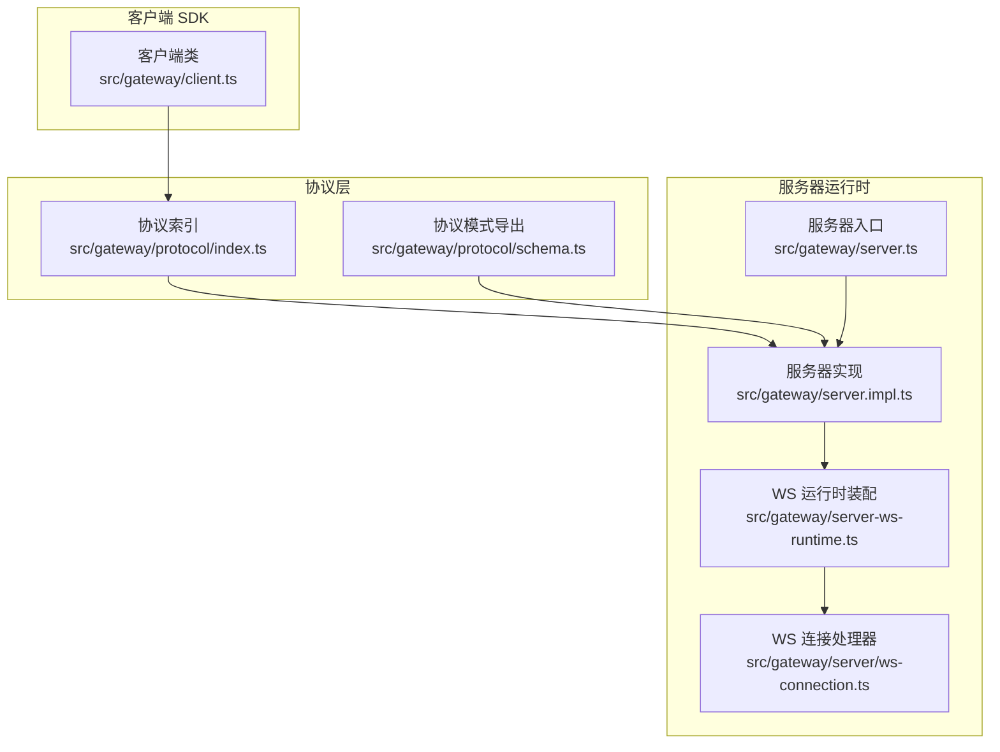
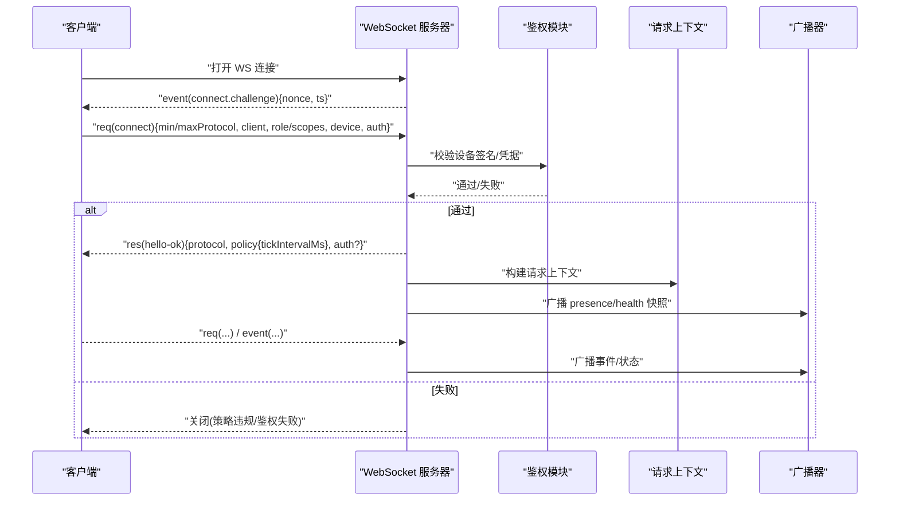
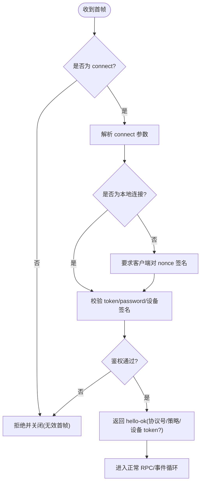
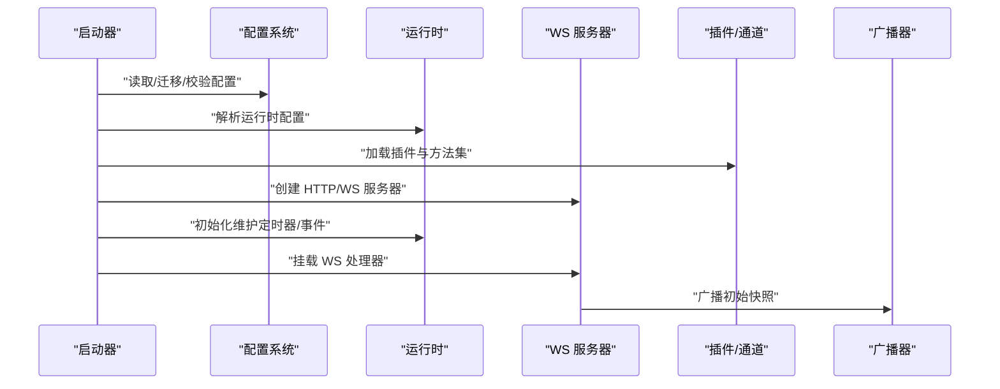
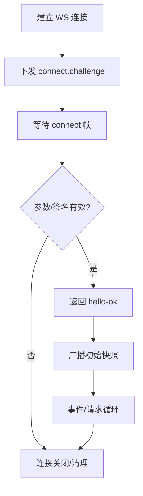
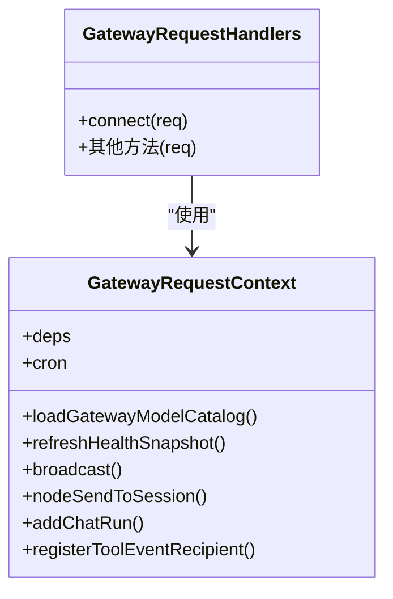
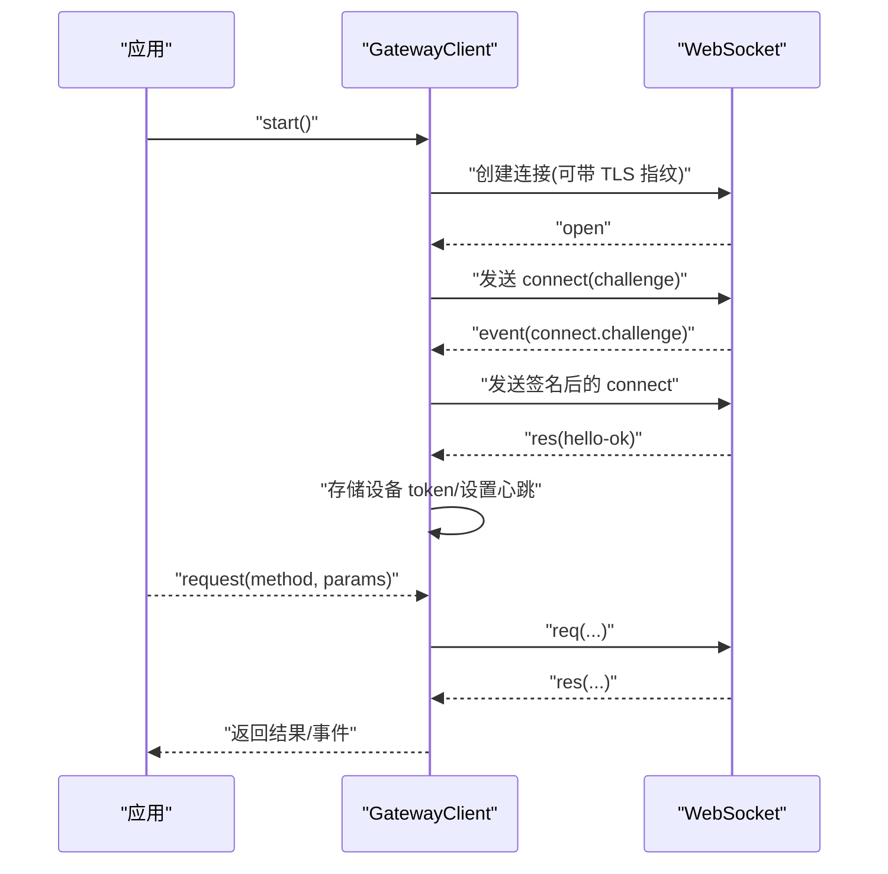
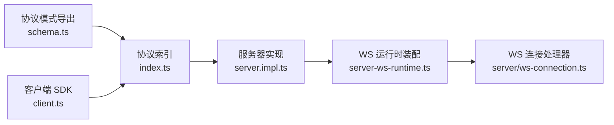

# 网关服务

<cite>
**本文引用的文件**
- [docs/gateway/index.md](file://docs/gateway/index.md)
- [docs/gateway/protocol.md](file://docs/gateway/protocol.md)
- [docs/gateway/configuration.md](file://docs/gateway/configuration.md)
- [src/gateway/protocol/schema.ts](file://src/gateway/protocol/schema.ts)
- [src/gateway/protocol/index.ts](file://src/gateway/protocol/index.ts)
- [src/gateway/client.ts](file://src/gateway/client.ts)
- [src/gateway/server.ts](file://src/gateway/server.ts)
- [src/gateway/server.impl.ts](file://src/gateway/server.impl.ts)
- [src/gateway/server-ws-runtime.ts](file://src/gateway/server-ws-runtime.ts)
- [src/gateway/server/ws-connection.ts](file://src/gateway/server/ws-connection.ts)
- [src/gateway/server-methods/types.ts](file://src/gateway/server-methods/types.ts)
- [src/gateway/server-methods/connect.ts](file://src/gateway/server-methods/connect.ts)
</cite>

## 目录

1. [简介](#简介)
2. [项目结构](#项目结构)
3. [核心组件](#核心组件)
4. [架构总览](#架构总览)
5. [详细组件分析](#详细组件分析)
6. [依赖关系分析](#依赖关系分析)
7. [性能考量](#性能考量)
8. [故障排查指南](#故障排查指南)
9. [结论](#结论)
10. [附录](#附录)

## 简介

本文件为 OpenClaw 网关服务（Gateway）的详细技术文档，聚焦于 WebSocket 网关协议的设计与实现、连接处理、消息帧格式、事件类型与实时交互模式；同时覆盖网关服务器的启动配置、会话管理机制、事件路由系统；并记录网关的 RPC 接口、方法调用规范与错误处理策略。文档还包含协议特定示例、安全考虑、速率限制与版本信息，以及常见用例、客户端实现指南、性能优化技巧、调试工具与监控方法。

## 项目结构

OpenClaw 的网关服务由“协议层”“服务器运行时”“客户端 SDK”三部分协同组成：

- 协议层：定义帧格式、角色与作用域、设备配对与鉴权、版本与校验等。
- 服务器运行时：负责监听端口、握手、鉴权、广播事件、维护健康状态与存在性、加载插件与方法集。
- 客户端 SDK：封装连接、握手、鉴权、心跳、重连、请求/响应与事件订阅。

**图表来源**

- [src/gateway/protocol/index.ts](file://src/gateway/protocol/index.ts#L1-L603)
- [src/gateway/protocol/schema.ts](file://src/gateway/protocol/schema.ts#L1-L17)
- [src/gateway/server.ts](file://src/gateway/server.ts#L1-L4)
- [src/gateway/server.impl.ts](file://src/gateway/server.impl.ts#L1-L667)
- [src/gateway/server-ws-runtime.ts](file://src/gateway/server-ws-runtime.ts#L1-L50)
- [src/gateway/server/ws-connection.ts](file://src/gateway/server/ws-connection.ts#L1-L267)
- [src/gateway/client.ts](file://src/gateway/client.ts#L1-L442)

**章节来源**

- [src/gateway/protocol/schema.ts](file://src/gateway/protocol/schema.ts#L1-L17)
- [src/gateway/protocol/index.ts](file://src/gateway/protocol/index.ts#L1-L603)
- [src/gateway/server.ts](file://src/gateway/server.ts#L1-L4)
- [src/gateway/server.impl.ts](file://src/gateway/server.impl.ts#L1-L667)
- [src/gateway/server-ws-runtime.ts](file://src/gateway/server-ws-runtime.ts#L1-L50)
- [src/gateway/server/ws-connection.ts](file://src/gateway/server/ws-connection.ts#L1-L267)
- [src/gateway/client.ts](file://src/gateway/client.ts#L1-L442)

## 核心组件

- 协议与帧模型
  - 帧类型：请求（req）、响应（res）、事件（event）。
  - 首帧必须是 connect；握手阶段由服务器下发 connect.challenge，客户端签名后回传。
  - 版本协商：min/maxProtocol 必须匹配，否则拒绝。
  - 角色与作用域：operator 控制面，node 能力宿主；节点声明 caps/commands/permissions。
  - 设备身份与配对：节点需携带 device 身份并在本地或非本地场景下签名挑战。
  - 鉴权：支持 token/password；成功后可下发设备级 deviceToken 并持久化。
- 服务器运行时
  - 启动流程：读取配置、迁移与校验、解析运行时配置、加载插件与方法集、创建 HTTP/WS 服务器、注册发现与维护任务、挂载 WS 处理器。
  - 握手与鉴权：校验 connect 参数、验证设备签名、生成 hello-ok（含协议号、策略如 tickIntervalMs）。
  - 事件广播：基于 presence/health 版本进行状态快照广播，支持丢弃过慢接收者。
  - 维护与清理：心跳、去重、聊天运行时清理、节点订阅管理、插件与通道生命周期。
- 客户端 SDK
  - 自动重连与指数退避、TLS 指纹校验、connect.challenge 处理、心跳检测、gap 检测、请求超时与最终结果等待。
  - 支持设备身份与设备 token 存储、回退共享 token 等策略。

**章节来源**

- [docs/gateway/protocol.md](file://docs/gateway/protocol.md#L1-L222)
- [src/gateway/protocol/index.ts](file://src/gateway/protocol/index.ts#L1-L603)
- [src/gateway/server.impl.ts](file://src/gateway/server.impl.ts#L157-L667)
- [src/gateway/server/ws-connection.ts](file://src/gateway/server/ws-connection.ts#L19-L267)
- [src/gateway/client.ts](file://src/gateway/client.ts#L79-L442)

## 架构总览

下图展示从客户端到服务器的典型握手与事件流，以及服务器内部的广播与上下文注入。

**图表来源**

- [src/gateway/server/ws-connection.ts](file://src/gateway/server/ws-connection.ts#L120-L125)
- [src/gateway/server/ws-connection.ts](file://src/gateway/server/ws-connection.ts#L230-L264)
- [src/gateway/protocol/index.ts](file://src/gateway/protocol/index.ts#L233-L236)
- [src/gateway/server-ws-runtime.ts](file://src/gateway/server-ws-runtime.ts#L32-L48)

**章节来源**

- [src/gateway/server/ws-connection.ts](file://src/gateway/server/ws-connection.ts#L19-L267)
- [src/gateway/server-ws-runtime.ts](file://src/gateway/server-ws-runtime.ts#L1-L50)
- [src/gateway/protocol/index.ts](file://src/gateway/protocol/index.ts#L1-L603)

## 详细组件分析

### 协议与帧模型

- 帧类型与字段
  - 请求帧：type="req"、id、method、params。
  - 响应帧：type="res"、id、ok、payload 或 error。
  - 事件帧：type="event"、event、payload、可选 seq、stateVersion。
- 首帧约束与版本
  - 首帧必须是 connect；min/maxProtocol 必须匹配。
  - 协议版本常量来自 schema。
- 角色与作用域
  - operator：控制面（CLI/UI/自动化）。
  - node：能力宿主（相机/屏幕/画布/系统命令等）。
  - operator 作用域：read/write/admin/approvals/pairing 等。
  - node 声明 caps/commands/permissions，服务器侧允许清单生效。
- 设备身份与配对
  - connect.params.device 包含 id/publicKey/signature/signedAt/nonce。
  - 本地连接可自动批准；非本地需对服务器下发的 nonce 进行签名。
- 鉴权与设备 token
  - 支持 token/password；成功后 hello-ok 返回 auth.deviceToken、role、scopes。
  - 可轮换/撤销设备 token。
- TLS 与指纹
  - 支持 WSS；客户端可校验证书指纹以防止中间人攻击。

**图表来源**

- [docs/gateway/protocol.md](file://docs/gateway/protocol.md#L22-L90)
- [src/gateway/protocol/index.ts](file://src/gateway/protocol/index.ts#L233-L236)
- [src/gateway/server/ws-connection.ts](file://src/gateway/server/ws-connection.ts#L120-L125)

**章节来源**

- [docs/gateway/protocol.md](file://docs/gateway/protocol.md#L10-L222)
- [src/gateway/protocol/index.ts](file://src/gateway/protocol/index.ts#L1-L603)

### 服务器启动与运行时

- 启动流程要点
  - 读取配置快照、迁移旧配置、写回变更。
  - 解析运行时配置（绑定地址、端口、认证、TLS、HTTP 开放项、Tailscale）。
  - 加载插件与方法集，合并核心与通道方法。
  - 创建 HTTP/WS 服务器、运行时状态、维护定时器、事件广播器。
  - 注册发现、心跳、插件钩子、浏览器控制台、技能远程缓存。
  - 挂载 WS 连接处理器与额外处理器（插件/审批）。
- 运行时上下文
  - 提供模型目录、健康快照、广播、节点订阅、聊天运行时、去重、向导会话等能力。
- 关闭流程
  - 执行 gateway_stop 钩子、停止诊断心跳、清理定时器与订阅、关闭网络与通道。

**图表来源**

- [src/gateway/server.impl.ts](file://src/gateway/server.impl.ts#L157-L667)
- [src/gateway/server-ws-runtime.ts](file://src/gateway/server-ws-runtime.ts#L32-L48)

**章节来源**

- [src/gateway/server.impl.ts](file://src/gateway/server.impl.ts#L157-L667)
- [src/gateway/server.ts](file://src/gateway/server.ts#L1-L4)

### WS 连接处理与握手

- 握手阶段
  - 服务器发送 connect.challenge（包含 nonce 与时间戳），客户端在后续 connect 中回传签名后的 nonce。
  - 校验通过后进入已连接状态，广播初始快照（presence/health/stateVersion）。
- 连接生命周期
  - 记录最后帧元数据（type/method/id）以便诊断。
  - 断开时更新系统存在性并广播。
  - 节点断开时注销节点并取消订阅。
- 事件与广播
  - 事件帧包含可选 seq 与 stateVersion，用于客户端状态同步。
  - 广播支持 dropIfSlow 与 stateVersion，避免拥塞。

**图表来源**

- [src/gateway/server/ws-connection.ts](file://src/gateway/server/ws-connection.ts#L120-L125)
- [src/gateway/server/ws-connection.ts](file://src/gateway/server/ws-connection.ts#L218-L228)
- [src/gateway/server/ws-connection.ts](file://src/gateway/server/ws-connection.ts#L182-L203)

**章节来源**

- [src/gateway/server/ws-connection.ts](file://src/gateway/server/ws-connection.ts#L19-L267)

### RPC 方法与请求上下文

- 方法注册与路由
  - 服务器聚合核心方法与插件/通道方法，统一暴露给客户端。
  - connect 方法仅作为首帧使用，后续直接拒绝。
- 请求上下文
  - 提供模型目录、健康快照、广播、节点订阅、聊天运行时、去重、向导会话等能力，供各处理器使用。
- 错误处理
  - 使用统一的错误码与错误形状；响应帧中携带 error 字段。

**图表来源**

- [src/gateway/server-methods/types.ts](file://src/gateway/server-methods/types.ts#L27-L98)
- [src/gateway/server-methods/connect.ts](file://src/gateway/server-methods/connect.ts#L4-L12)

**章节来源**

- [src/gateway/server-methods/types.ts](file://src/gateway/server-methods/types.ts#L1-L120)
- [src/gateway/server-methods/connect.ts](file://src/gateway/server-methods/connect.ts#L1-L13)

### 客户端 SDK

- 连接与握手
  - 自动下发 connect，处理 connect.challenge，支持设备签名与设备 token 持久化。
- 重连与心跳
  - 指数退避重连；心跳超时（tickIntervalMs×2）触发关闭。
- 请求与响应
  - 请求帧校验；等待 final 结果（status="accepted" 后继续等待 "ok"/"error"）。
- 错误与诊断
  - 明确的关闭码提示；gap 检测；TLS 指纹校验；connect 失败日志。

**图表来源**

- [src/gateway/client.ts](file://src/gateway/client.ts#L101-L165)
- [src/gateway/client.ts](file://src/gateway/client.ts#L178-L286)
- [src/gateway/client.ts](file://src/gateway/client.ts#L415-L440)

**章节来源**

- [src/gateway/client.ts](file://src/gateway/client.ts#L1-L442)

## 依赖关系分析

- 协议层依赖
  - 协议模式导出自 schema；协议索引集中导出所有校验器与类型。
- 服务器运行时依赖
  - 启动器依赖配置系统、插件系统、通道系统、发现与维护定时器、HTTP/WS 服务器、广播器。
  - WS 连接处理器依赖鉴权、健康/存在性、消息处理器。
- 客户端依赖
  - 依赖协议索引与设备身份/鉴权工具链。

**图表来源**

- [src/gateway/protocol/schema.ts](file://src/gateway/protocol/schema.ts#L1-L17)
- [src/gateway/protocol/index.ts](file://src/gateway/protocol/index.ts#L1-L603)
- [src/gateway/server.impl.ts](file://src/gateway/server.impl.ts#L1-L667)
- [src/gateway/server-ws-runtime.ts](file://src/gateway/server-ws-runtime.ts#L1-L50)
- [src/gateway/server/ws-connection.ts](file://src/gateway/server/ws-connection.ts#L1-L267)
- [src/gateway/client.ts](file://src/gateway/client.ts#L1-L442)

**章节来源**

- [src/gateway/protocol/schema.ts](file://src/gateway/protocol/schema.ts#L1-L17)
- [src/gateway/protocol/index.ts](file://src/gateway/protocol/index.ts#L1-L603)
- [src/gateway/server.impl.ts](file://src/gateway/server.impl.ts#L1-L667)
- [src/gateway/server-ws-runtime.ts](file://src/gateway/server-ws-runtime.ts#L1-L50)
- [src/gateway/server/ws-connection.ts](file://src/gateway/server/ws-connection.ts#L1-L267)
- [src/gateway/client.ts](file://src/gateway/client.ts#L1-L442)

## 性能考量

- 广播与丢包保护
  - 广播支持 dropIfSlow，避免慢消费者拖垮整体。
  - 事件帧包含 stateVersion，便于客户端快速恢复状态。
- 心跳与空闲检测
  - 服务器下发 tickIntervalMs；客户端心跳超时将主动断开，降低僵尸连接。
- 轻量化握手
  - 首帧严格校验，失败即刻关闭，减少资源占用。
- 插件与通道
  - 插件与通道按需启动，避免不必要的开销；维护定时器统一调度。

[本节为通用指导，无需列出具体文件来源]

## 故障排查指南

- 常见失败签名
  - 无认证绑定到非 loopback 地址：Refusing to bind gateway ... without auth。
  - 端口冲突：另一个网关实例已在监听或 EADDRINUSE。
  - 配置被设为 remote 模式：Gateway start blocked: set gateway.mode=local。
  - 连接鉴权不匹配：unauthorized during connect。
- 诊断步骤
  - 使用 openclaw gateway status、channels status --probe、health 检查就绪状态。
  - 使用 openclaw logs --follow 实时查看日志。
  - 在 docs/gateway/troubleshooting 中查找症状对应的命令阶梯与日志签名。
- 客户端侧
  - 检查 connect.challenge 是否正确签名；确认设备 token 是否持久化；TLS 指纹是否匹配。

**章节来源**

- [docs/gateway/index.md](file://docs/gateway/index.md#L228-L237)

## 结论

OpenClaw 网关服务以 WebSocket 为单一控制平面与节点传输通道，通过严格的协议帧模型、角色/作用域与设备身份体系，确保了跨平台客户端的一致接入体验。服务器运行时提供了完善的启动、鉴权、广播与维护机制，并通过插件与通道扩展生态。客户端 SDK 则提供了健壮的连接、鉴权、心跳与重连能力。配合配置热重载与可观测性，可在生产环境中稳定运行。

[本节为总结，无需列出具体文件来源]

## 附录

### 启动与配置参考

- 启动与端口绑定优先级、热重载模式、远程访问与监督方式详见“Gateway 运行手册”。
- 配置热重载：默认 hybrid 模式，安全变更即时生效，关键变更自动重启。
- 环境变量与配置文件：支持 .env 导入、环境变量替换、$include 组织大型配置。

**章节来源**

- [docs/gateway/index.md](file://docs/gateway/index.md#L21-L116)
- [docs/gateway/index.md](file://docs/gateway/index.md#L164-L183)
- [docs/gateway/configuration.md](file://docs/gateway/configuration.md#L330-L368)
- [docs/gateway/configuration.md](file://docs/gateway/configuration.md#L422-L474)

### 协议与版本

- 协议版本：PROTOCOL_VERSION 来源于 schema；客户端需在 min/maxProtocol 中声明。
- 模型与校验：协议模式由 TypeBox 定义并通过脚本生成；支持校验器与错误格式化。

**章节来源**

- [docs/gateway/protocol.md](file://docs/gateway/protocol.md#L178-L186)
- [src/gateway/protocol/index.ts](file://src/gateway/protocol/index.ts#L499-L502)

### 安全与合规

- 鉴权：token/password；设备 token 可轮换/撤销。
- 设备身份：设备签名挑战；本地连接自动批准；非本地必须签名。
- TLS：WSS 支持；客户端可校验证书指纹。
- 速率限制与策略：服务器下发 tickIntervalMs；客户端心跳超时断开；广播支持丢弃过慢接收者。

**章节来源**

- [docs/gateway/protocol.md](file://docs/gateway/protocol.md#L187-L216)
- [src/gateway/client.ts](file://src/gateway/client.ts#L388-L413)

### 常见用例与客户端实现要点

- 控制面客户端（operator）
  - 角色：operator；作用域：read/write/admin/approvals/pairing。
  - 用途：状态查询、配置变更、会话管理、代理调用、工具调用。
- 节点客户端（node）
  - 角色：node；声明 caps/commands/permissions；通过设备身份接入。
  - 用途：相机/屏幕/画布/系统命令等能力调用。
- 客户端实现建议
  - 首帧必须为 connect；处理 connect.challenge；持久化设备 token；启用心跳与重连；对大响应（如屏幕截图）预留足够 maxPayload。

**章节来源**

- [docs/gateway/protocol.md](file://docs/gateway/protocol.md#L135-L160)
- [src/gateway/client.ts](file://src/gateway/client.ts#L101-L165)
- [src/gateway/client.ts](file://src/gateway/client.ts#L178-L286)

### 调试与监控

- 运维命令：status、logs、doctor、install/restart/stop。
- 日志：运行日志、WS 控制日志、健康日志、插件与钩子日志。
- 监控指标：健康快照、presence/health 版本、心跳事件、节点订阅统计。

**章节来源**

- [docs/gateway/index.md](file://docs/gateway/index.md#L88-L116)
- [src/gateway/server.impl.ts](file://src/gateway/server.impl.ts#L87-L99)
