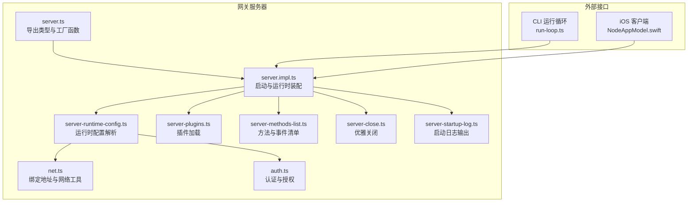
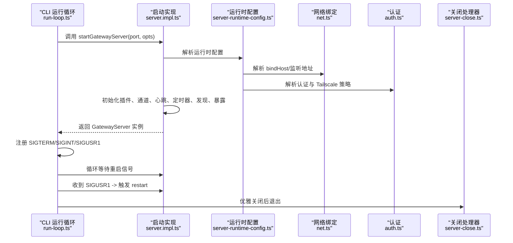
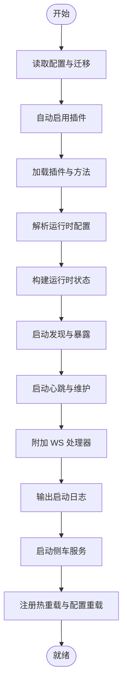
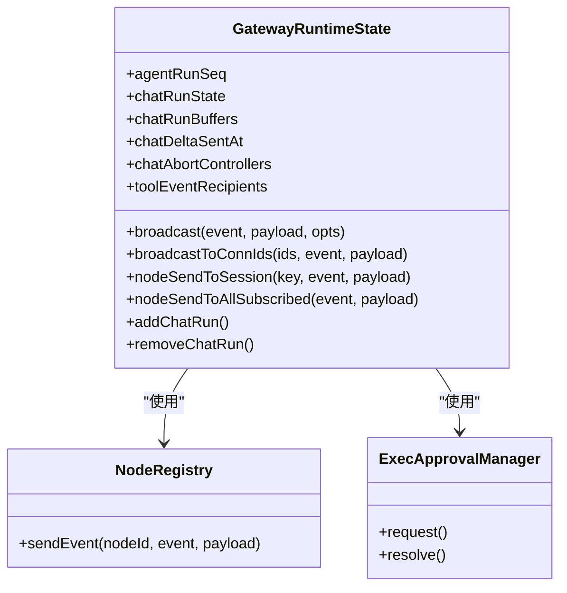
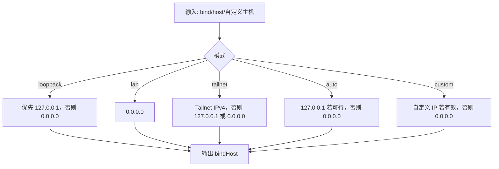
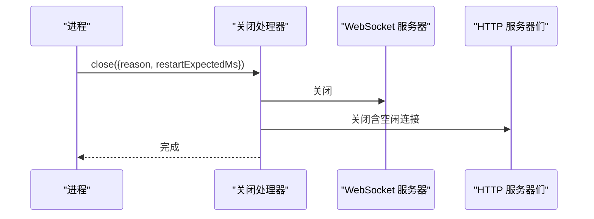
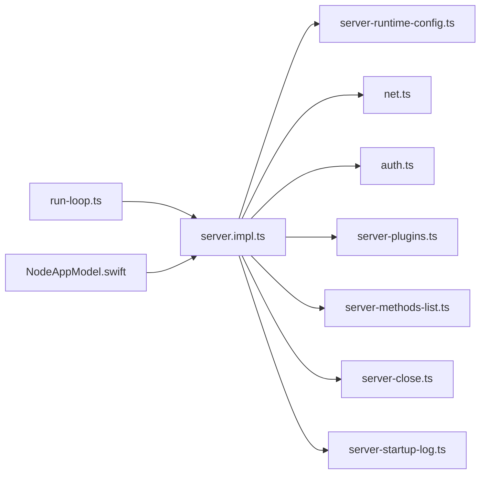

# 网关服务器

<cite>
**本文引用的文件**
- [src/gateway/server.impl.ts](file://src/gateway/server.impl.ts)
- [src/gateway/server.ts](file://src/gateway/server.ts)
- [src/gateway/server-runtime-config.ts](file://src/gateway/server-runtime-config.ts)
- [src/gateway/server-close.ts](file://src/gateway/server-close.ts)
- [src/gateway/server-startup-log.ts](file://src/gateway/server-startup-log.ts)
- [src/gateway/net.ts](file://src/gateway/net.ts)
- [src/gateway/auth.ts](file://src/gateway/auth.ts)
- [src/gateway/server-plugins.ts](file://src/gateway/server-plugins.ts)
- [src/gateway/server-methods-list.ts](file://src/gateway/server-methods-list.ts)
- [src/cli/gateway-cli/run-loop.ts](file://src/cli/gateway-cli/run-loop.ts)
- [apps/ios/Sources/Model/NodeAppModel.swift](file://apps/ios/Sources/Model/NodeAppModel.swift)
</cite>

## 目录

1. [简介](#简介)
2. [项目结构](#项目结构)
3. [核心组件](#核心组件)
4. [架构总览](#架构总览)
5. [详细组件分析](#详细组件分析)
6. [依赖关系分析](#依赖关系分析)
7. [性能考量](#性能考量)
8. [故障排查指南](#故障排查指南)
9. [结论](#结论)
10. [附录](#附录)

## 简介

本文件面向 OpenClaw 网关服务器（Gateway）的技术文档，覆盖启动流程、初始化过程、运行时状态管理、配置项与网络绑定、TLS 配置、生命周期与优雅关闭/重启、监控与健康检查、故障恢复策略、部署与性能调优、以及集群化与高可用设计建议。文档以源码为依据，辅以图示帮助不同背景读者理解系统。

## 项目结构

网关服务器位于 src/gateway 目录下，核心入口导出位于 server.ts，实际实现位于 server.impl.ts；网络与绑定逻辑在 net.ts，认证在 auth.ts，运行时配置解析在 server-runtime-config.ts，关闭流程在 server-close.ts，启动日志在 server-startup-log.ts；CLI 启动循环在 src/cli/gateway-cli/run-loop.ts；iOS 客户端通过 NodeAppModel.swift 应用连接配置并发起连接。

**图表来源**

- [src/gateway/server.ts](file://src/gateway/server.ts#L1-L4)
- [src/gateway/server.impl.ts](file://src/gateway/server.impl.ts#L1-L667)
- [src/gateway/server-runtime-config.ts](file://src/gateway/server-runtime-config.ts#L1-L121)
- [src/gateway/net.ts](file://src/gateway/net.ts#L1-L275)
- [src/gateway/auth.ts](file://src/gateway/auth.ts#L1-L271)
- [src/gateway/server-plugins.ts](file://src/gateway/server-plugins.ts#L1-L50)
- [src/gateway/server-methods-list.ts](file://src/gateway/server-methods-list.ts#L1-L118)
- [src/gateway/server-close.ts](file://src/gateway/server-close.ts#L1-L129)
- [src/gateway/server-startup-log.ts](file://src/gateway/server-startup-log.ts#L1-L41)
- [src/cli/gateway-cli/run-loop.ts](file://src/cli/gateway-cli/run-loop.ts#L89-L127)
- [apps/ios/Sources/Model/NodeAppModel.swift](file://apps/ios/Sources/Model/NodeAppModel.swift#L1469-L1505)

**章节来源**

- [src/gateway/server.ts](file://src/gateway/server.ts#L1-L4)
- [src/gateway/server.impl.ts](file://src/gateway/server.impl.ts#L1-L667)
- [src/gateway/server-runtime-config.ts](file://src/gateway/server-runtime-config.ts#L1-L121)
- [src/gateway/net.ts](file://src/gateway/net.ts#L1-L275)
- [src/gateway/auth.ts](file://src/gateway/auth.ts#L1-L271)
- [src/gateway/server-plugins.ts](file://src/gateway/server-plugins.ts#L1-L50)
- [src/gateway/server-methods-list.ts](file://src/gateway/server-methods-list.ts#L1-L118)
- [src/gateway/server-close.ts](file://src/gateway/server-close.ts#L1-L129)
- [src/gateway/server-startup-log.ts](file://src/gateway/server-startup-log.ts#L1-L41)
- [src/cli/gateway-cli/run-loop.ts](file://src/cli/gateway-cli/run-loop.ts#L89-L127)
- [apps/ios/Sources/Model/NodeAppModel.swift](file://apps/ios/Sources/Model/NodeAppModel.swift#L1469-L1505)

## 核心组件

- 启动与运行时装配：负责读取配置、迁移旧配置、加载插件、解析运行时配置、建立 HTTP/WebSocket 服务、广播/订阅、心跳与维护任务、发现与暴露、侧车服务等。
- 运行时配置解析：根据 bind/host、控制面板、HTTP 端点开关、认证、Tailscale 模式等生成最终运行参数，并进行约束校验。
- 网络与绑定：解析绑定主机地址、支持 loopback/lan/tailnet/auto/custom 等模式，处理 IPv4/IPv6、本地地址判断、代理信任与客户端 IP 解析。
- 认证与授权：支持 token/password 模式，可选允许 Tailscale 透传用户认证；对本地直连请求与代理请求做区分。
- 插件系统：加载核心与通道插件，合并方法集，输出诊断信息。
- 方法与事件清单：统一列出网关支持的方法与事件，便于路由与广播。
- 优雅关闭：停止发现、Tailscale、CanvasHost、通道、插件服务、定时器、广播、WebSocket 与 HTTP 服务器，清理会话与客户端。
- 启动日志：输出模型、监听地址、日志文件、Nix 模式等关键信息。

**章节来源**

- [src/gateway/server.impl.ts](file://src/gateway/server.impl.ts#L157-L667)
- [src/gateway/server-runtime-config.ts](file://src/gateway/server-runtime-config.ts#L32-L121)
- [src/gateway/net.ts](file://src/gateway/net.ts#L153-L275)
- [src/gateway/auth.ts](file://src/gateway/auth.ts#L178-L271)
- [src/gateway/server-plugins.ts](file://src/gateway/server-plugins.ts#L5-L50)
- [src/gateway/server-methods-list.ts](file://src/gateway/server-methods-list.ts#L3-L118)
- [src/gateway/server-close.ts](file://src/gateway/server-close.ts#L9-L129)
- [src/gateway/server-startup-log.ts](file://src/gateway/server-startup-log.ts#L7-L41)

## 架构总览

下图展示从 CLI 启动到服务就绪的关键步骤，以及信号处理与重启机制。

**图表来源**

- [src/cli/gateway-cli/run-loop.ts](file://src/cli/gateway-cli/run-loop.ts#L89-L127)
- [src/gateway/server.impl.ts](file://src/gateway/server.impl.ts#L157-L667)
- [src/gateway/server-runtime-config.ts](file://src/gateway/server-runtime-config.ts#L32-L121)
- [src/gateway/net.ts](file://src/gateway/net.ts#L153-L203)
- [src/gateway/auth.ts](file://src/gateway/auth.ts#L178-L215)
- [src/gateway/server-close.ts](file://src/gateway/server-close.ts#L33-L127)

## 详细组件分析

### 启动流程与初始化

- 读取并迁移配置：若存在旧配置则尝试迁移，Nix 模式下禁止旧配置；校验新配置有效性。
- 自动启用插件：根据环境变量自动启用插件并持久化变更。
- 加载插件与方法：加载核心与通道插件，合并方法集合，输出诊断信息。
- 解析运行时配置：bind/host、控制面板、HTTP 端点开关、认证、Tailscale 暴露模式、钩子配置、CanvasHost 开关。
- 构建运行时状态：创建 HTTP/WS 服务器、客户端集合、广播、聊天运行时状态、节点订阅管理、执行审批管理等。
- 启动发现与暴露：Bonjour/Multicast DNS、Wide Area Discovery、Tailscale 暴露。
- 维护与心跳：启动心跳运行器、定时清理、健康快照刷新。
- 附加 WS 处理器：注册方法与事件处理器，注入上下文。
- 输出启动日志：打印模型、监听地址、日志路径、Nix 模式等。
- 启动侧车：浏览器控制面板、插件服务等。
- 注册热重载与配置重载：支持插件热重载与配置文件变更触发重启或热更新。
- 注册关闭处理器：在关闭前执行清理与广播。

**图表来源**

- [src/gateway/server.impl.ts](file://src/gateway/server.impl.ts#L172-L612)
- [src/gateway/server-startup-log.ts](file://src/gateway/server-startup-log.ts#L7-L41)

**章节来源**

- [src/gateway/server.impl.ts](file://src/gateway/server.impl.ts#L172-L612)
- [src/gateway/server-startup-log.ts](file://src/gateway/server-startup-log.ts#L7-L41)

### 运行时状态管理

- 广播与订阅：提供全局广播、按连接 ID 广播、按会话订阅、节点事件发送。
- 聊天运行时：跟踪运行序列、缓冲区、超时与中止控制器，支持运行中止与清理。
- 节点注册表：维护节点连接与事件派发。
- 执行审批：集中管理执行审批请求与转发。
- 心跳与健康：周期性刷新健康快照、版本号递增、心跳事件广播。
- 维护定时器：清理去重、聊天运行时、节点存在性定时器等。

**图表来源**

- [src/gateway/server.impl.ts](file://src/gateway/server.impl.ts#L357-L533)

**章节来源**

- [src/gateway/server.impl.ts](file://src/gateway/server.impl.ts#L357-L533)

### 配置选项、监听端口与网络绑定

- 绑定模式：loopback、lan、tailnet、auto、custom；支持自定义主机与回退策略。
- 监听地址解析：优先选择 IPv4，必要时包含 IPv6 回退；对 127.0.0.1 可能同时监听 ::1。
- 本地地址判定：支持 localhost、127.x、::1、IPv4 映射等。
- 代理信任与客户端 IP：支持 X-Forwarded-For、X-Real-IP、受信代理列表，解析真实客户端 IP。
- 约束校验：Tailscale serve/funnel 要求 bind=loopback；非 loopback 绑定必须配置共享密钥（token/password）。

**图表来源**

- [src/gateway/net.ts](file://src/gateway/net.ts#L153-L203)

**章节来源**

- [src/gateway/net.ts](file://src/gateway/net.ts#L153-L203)
- [src/gateway/server-runtime-config.ts](file://src/gateway/server-runtime-config.ts#L43-L101)

### TLS 配置

- TLS 运行时加载：从配置加载 TLS 设置，失败时抛出错误。
- TLS 指纹：用于发现与跨端识别。
- TLS 与认证：当启用 TLS 时，启动日志显示 wss；认证策略与非 TLS 场景一致。

**章节来源**

- [src/gateway/server.impl.ts](file://src/gateway/server.impl.ts#L311-L314)
- [src/gateway/server-startup-log.ts](file://src/gateway/server-startup-log.ts#L25-L35)

### 生命周期管理、优雅关闭与重启

- 优雅关闭：停止 Bonjour/Tailscale、CanvasHost、通道、插件服务、心跳与定时器、广播、清理聊天运行时、关闭所有客户端、关闭 WebSocket 与 HTTP 服务器。
- 重启机制：CLI 使用 SIGUSR1 触发 in-process restart；需满足授权条件；SIGTERM/SIGINT 触发优雅关闭并退出。

**图表来源**

- [src/gateway/server-close.ts](file://src/gateway/server-close.ts#L33-L127)

**章节来源**

- [src/gateway/server-close.ts](file://src/gateway/server-close.ts#L33-L127)
- [src/cli/gateway-cli/run-loop.ts](file://src/cli/gateway-cli/run-loop.ts#L89-L127)

### 监控指标、健康检查与故障恢复

- 健康快照与版本：周期性刷新健康状态，版本号递增，供查询与对比。
- 心跳事件：周期性广播心跳事件，便于上游感知。
- 故障恢复策略建议：
  - 配置重载：文件变更触发热重载或重启，避免手动干预。
  - 插件异常：插件钩子失败仅记录警告，不影响主流程。
  - 通道异常：逐通道停止，避免影响其他通道。
  - 客户端断连：统一关闭并清理，防止资源泄漏。

**章节来源**

- [src/gateway/server.impl.ts](file://src/gateway/server.impl.ts#L428-L466)
- [src/gateway/server.impl.ts](file://src/gateway/server.impl.ts#L614-L637)

### 部署配置、性能调优与资源管理

- 绑定策略：生产环境建议使用 loopback + Tailscale serve/funnel 或 lan，结合认证。
- 端口与多地址：监听端口由参数指定；loopback 可同时监听 IPv4/IPv6。
- 性能调优建议：
  - 合理设置并发与队列长度，避免阻塞。
  - 利用去重与聊天运行时缓冲减少重复计算与传输。
  - 控制面板与 CanvasHost 可按需启用，避免额外开销。
- 资源管理：
  - 定时器与心跳运行器在关闭时统一清理。
  - HTTP 服务器支持关闭空闲连接，降低资源占用。

**章节来源**

- [src/gateway/server-runtime-config.ts](file://src/gateway/server-runtime-config.ts#L103-L120)
- [src/gateway/net.ts](file://src/gateway/net.ts#L227-L239)
- [src/gateway/server.impl.ts](file://src/gateway/server.impl.ts#L428-L466)
- [src/gateway/server-close.ts](file://src/gateway/server-close.ts#L112-L126)

### 集群化部署、负载均衡与高可用

- 发现与暴露：支持 Bonjour/Multicast DNS、Wide Area Discovery、Tailscale 暴露（serve/funnel），便于节点发现与远程访问。
- 认证与安全：非 loopback 绑定需配置共享密钥；Tailscale serve/funnel 需要 password 模式。
- 高可用建议：
  - 使用 Tailscale Funnel 将内部网关暴露至公网，配合密码认证。
  - 多实例部署时，确保每个实例独立配置与端口，避免冲突。
  - 结合外部负载均衡器（如反向代理）分发请求，注意 WebSocket 保持会话亲和。

**章节来源**

- [src/gateway/server.impl.ts](file://src/gateway/server.impl.ts#L393-L404)
- [src/gateway/server.impl.ts](file://src/gateway/server.impl.ts#L544-L550)
- [src/gateway/server-runtime-config.ts](file://src/gateway/server-runtime-config.ts#L89-L101)
- [src/gateway/auth.ts](file://src/gateway/auth.ts#L193-L215)

## 依赖关系分析

- 组件耦合：
  - server.impl.ts 是中枢，依赖配置、插件、网络、认证、发现、暴露、心跳、定时器、关闭处理器等模块。
  - server-runtime-config.ts 与 net.ts、auth.ts 协作完成运行时参数解析与约束校验。
  - server-methods-list.ts 提供方法与事件清单，被 WS 路由与广播使用。
- 外部集成：
  - iOS 客户端通过配置对象应用连接参数，启动操作者与节点会话。

**图表来源**

- [src/gateway/server.impl.ts](file://src/gateway/server.impl.ts#L1-L667)
- [src/gateway/server-runtime-config.ts](file://src/gateway/server-runtime-config.ts#L1-L121)
- [src/gateway/net.ts](file://src/gateway/net.ts#L1-L275)
- [src/gateway/auth.ts](file://src/gateway/auth.ts#L1-L271)
- [src/gateway/server-plugins.ts](file://src/gateway/server-plugins.ts#L1-L50)
- [src/gateway/server-methods-list.ts](file://src/gateway/server-methods-list.ts#L1-L118)
- [src/gateway/server-close.ts](file://src/gateway/server-close.ts#L1-L129)
- [src/gateway/server-startup-log.ts](file://src/gateway/server-startup-log.ts#L1-L41)
- [src/cli/gateway-cli/run-loop.ts](file://src/cli/gateway-cli/run-loop.ts#L89-L127)
- [apps/ios/Sources/Model/NodeAppModel.swift](file://apps/ios/Sources/Model/NodeAppModel.swift#L1469-L1505)

**章节来源**

- [src/gateway/server.impl.ts](file://src/gateway/server.impl.ts#L1-L667)
- [src/gateway/server-runtime-config.ts](file://src/gateway/server-runtime-config.ts#L1-L121)
- [src/gateway/net.ts](file://src/gateway/net.ts#L1-L275)
- [src/gateway/auth.ts](file://src/gateway/auth.ts#L1-L271)
- [src/gateway/server-plugins.ts](file://src/gateway/server-plugins.ts#L1-L50)
- [src/gateway/server-methods-list.ts](file://src/gateway/server-methods-list.ts#L1-L118)
- [src/gateway/server-close.ts](file://src/gateway/server-close.ts#L1-L129)
- [src/gateway/server-startup-log.ts](file://src/gateway/server-startup-log.ts#L1-L41)
- [src/cli/gateway-cli/run-loop.ts](file://src/cli/gateway-cli/run-loop.ts#L89-L127)
- [apps/ios/Sources/Model/NodeAppModel.swift](file://apps/ios/Sources/Model/NodeAppModel.swift#L1469-L1505)

## 性能考量

- 绑定策略：loopback 优先，减少外部暴露风险；lan/tailnet/auto/custom 按需选择。
- 并发与队列：合理设置聊天运行时与去重策略，避免重复计算与消息风暴。
- 定时器与心跳：周期性任务应尽量轻量，避免阻塞事件循环。
- 服务器关闭：关闭空闲连接，及时释放资源，缩短重启时间。

[本节为通用指导，无需特定文件来源]

## 故障排查指南

- 配置问题：
  - 旧配置检测：Nix 模式下禁止旧配置；非 Nix 模式下自动迁移失败需使用 doctor 修复。
  - 配置校验：无效配置会抛出错误，提示具体路径与问题。
- 认证问题：
  - 未配置 token/password：根据模式抛出错误；Tailscale serve/funnel 需要 password。
  - 非 loopback 绑定无认证：拒绝启动，需配置共享密钥。
- 网络问题：
  - 绑定失败：canBindToHost 测试失败时回退到其他模式。
  - 代理与客户端 IP：确认受信代理与头字段正确传递。
- 关闭问题：
  - 优雅关闭失败：检查各子系统关闭回调是否抛错；关闭处理器已做忽略处理，但建议定位根因。

**章节来源**

- [src/gateway/server.impl.ts](file://src/gateway/server.impl.ts#L173-L206)
- [src/gateway/server-runtime-config.ts](file://src/gateway/server-runtime-config.ts#L89-L101)
- [src/gateway/net.ts](file://src/gateway/net.ts#L212-L225)
- [src/gateway/auth.ts](file://src/gateway/auth.ts#L203-L215)
- [src/gateway/server-close.ts](file://src/gateway/server-close.ts#L40-L46)

## 结论

OpenClaw 网关服务器通过清晰的启动流程、严格的运行时配置解析与网络/认证约束、完善的运行时状态管理与优雅关闭机制，提供了稳定可靠的通信与控制能力。结合发现与暴露、热重载与配置重载、以及可观测性与诊断事件，可在多种部署场景中实现高可用与易维护。

[本节为总结，无需特定文件来源]

## 附录

- 客户端连接：iOS 客户端通过配置对象应用连接参数，启动操作者与节点会话，确保稳定的网关交互。

**章节来源**

- [apps/ios/Sources/Model/NodeAppModel.swift](file://apps/ios/Sources/Model/NodeAppModel.swift#L1469-L1505)
