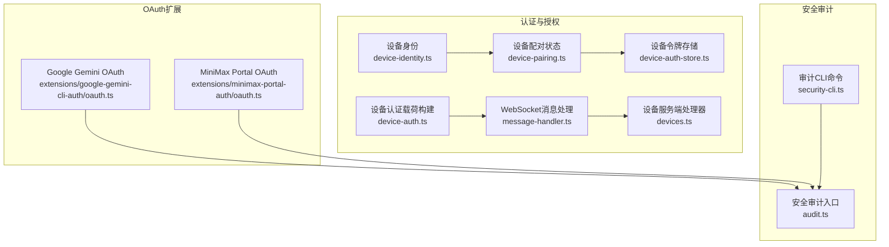
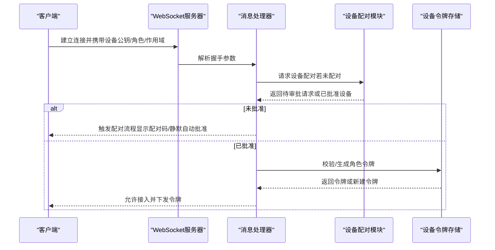
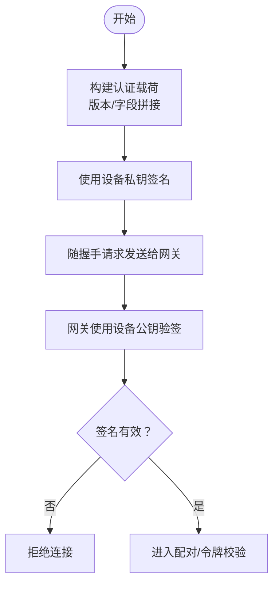
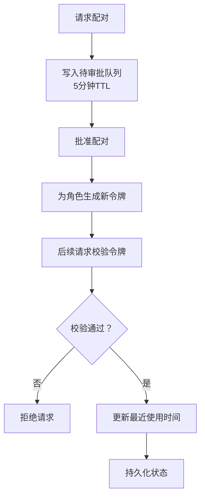
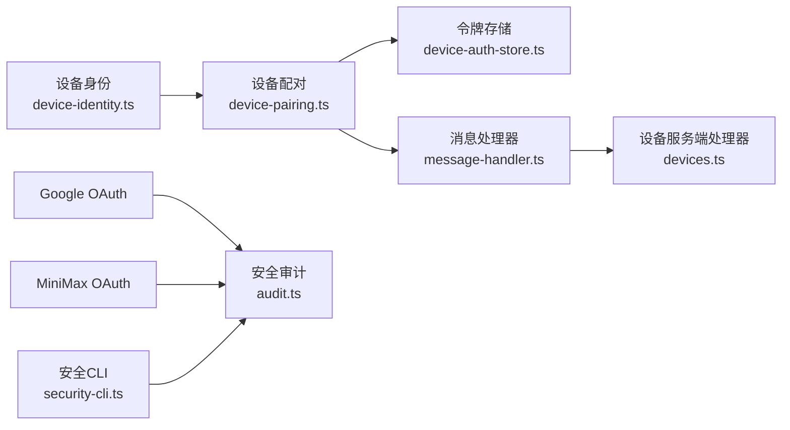

# 认证与授权

<cite>
**本文引用的文件**
- [authentication.md](file://docs/gateway/authentication.md)
- [oauth.md](file://docs/concepts/oauth.md)
- [audit.ts](file://src/security/audit.ts)
- [audit-extra.ts](file://src/security/audit-extra.ts)
- [security-cli.ts](file://src/cli/security-cli.ts)
- [oauth.ts（Google Gemini）](file://extensions/google-gemini-cli-auth/oauth.ts)
- [oauth.ts（MiniMax）](file://extensions/minimax-portal-auth/oauth.ts)
- [device-auth.ts](file://src/gateway/device-auth.ts)
- [device-pairing.ts](file://src/infra/device-pairing.ts)
- [device-auth-store.ts](file://src/infra/device-auth-store.ts)
- [device-identity.ts](file://src/infra/device-identity.ts)
- [devices.ts（设备服务端处理器）](file://src/gateway/server-methods/devices.ts)
- [message-handler.ts（WebSocket消息处理）](file://src/gateway/server/ws-connection/message-handler.ts)
</cite>

## 目录

1. [引言](#引言)
2. [项目结构](#项目结构)
3. [核心组件](#核心组件)
4. [架构总览](#架构总览)
5. [详细组件分析](#详细组件分析)
6. [依赖关系分析](#依赖关系分析)
7. [性能考量](#性能考量)
8. [故障排查指南](#故障排查指南)
9. [结论](#结论)
10. [附录](#附录)

## 引言

本文件面向OpenClaw网关的认证与授权体系，覆盖设备认证流程、令牌管理与会话验证机制，以及多种认证方式（API密钥、OAuth令牌、设备配对码）的实现要点。同时记录权限模型、角色与作用域（role/scopes）管理、访问控制策略、安全审计与异常检测等实践，帮助开发者与运维人员正确配置与维护系统。

## 项目结构

围绕认证与授权的关键目录与文件如下：

- 网关与通道安全审计：src/security
- 设备身份与配对：src/infra 下的 device-identity.ts、device-pairing.ts、device-auth-store.ts；src/gateway 下的 device-auth.ts
- OAuth扩展：extensions/\*/oauth.ts（如Google Gemini、MiniMax）
- CLI安全工具：src/cli/security-cli.ts
- 文档：docs/gateway/authentication.md、docs/concepts/oauth.md

图表来源

- [device-identity.ts](file://src/infra/device-identity.ts#L1-L180)
- [device-pairing.ts](file://src/infra/device-pairing.ts#L1-L560)
- [device-auth-store.ts](file://src/infra/device-auth-store.ts#L1-L143)
- [device-auth.ts](file://src/gateway/device-auth.ts#L1-L32)
- [message-handler.ts](file://src/gateway/server/ws-connection/message-handler.ts#L673-L702)
- [devices.ts](file://src/gateway/server-methods/devices.ts#L1-L77)
- [oauth.ts（Google Gemini）](file://extensions/google-gemini-cli-auth/oauth.ts#L1-L640)
- [oauth.ts（MiniMax）](file://extensions/minimax-portal-auth/oauth.ts#L1-L248)
- [audit.ts](file://src/security/audit.ts#L1-L1032)
- [security-cli.ts](file://src/cli/security-cli.ts#L1-L159)

章节来源

- [audit.ts](file://src/security/audit.ts#L1-L1032)
- [security-cli.ts](file://src/cli/security-cli.ts#L1-L159)

## 核心组件

- 设备身份与签名
  - 使用Ed25519生成公私钥对，导出SPKI/PKCS8格式；基于公钥派生设备ID（SHA-256指纹），用于唯一标识设备。
  - 支持对任意载荷进行签名与验签，确保设备侧身份可信。
- 设备配对与令牌管理
  - 配对请求在5分钟内有效，超时自动清理；批准后为每个角色生成独立令牌，支持轮换与撤销。
  - 令牌具备作用域（scopes）与使用时间追踪，校验时需满足角色存在、未撤销、令牌匹配且作用域包含请求所需。
- 设备认证载荷
  - 构建v1/v2版本的认证载荷字符串，包含设备ID、客户端信息、角色、作用域、签名时间戳与可选随机数（nonce）。
- OAuth扩展
  - 提供PKCE流程的OAuth登录能力，支持回调捕获或手动粘贴重定向URL两种模式；部分提供商支持用户码授权流程。
- 安全审计
  - 对配置、状态目录、网关绑定与鉴权、浏览器控制、日志脱敏、通道安全策略等进行检查与修复建议。

章节来源

- [device-identity.ts](file://src/infra/device-identity.ts#L1-L180)
- [device-pairing.ts](file://src/infra/device-pairing.ts#L1-L560)
- [device-auth-store.ts](file://src/infra/device-auth-store.ts#L1-L143)
- [device-auth.ts](file://src/gateway/device-auth.ts#L1-L32)
- [oauth.ts（Google Gemini）](file://extensions/google-gemini-cli-auth/oauth.ts#L1-L640)
- [oauth.ts（MiniMax）](file://extensions/minimax-portal-auth/oauth.ts#L1-L248)
- [audit.ts](file://src/security/audit.ts#L1-L1032)

## 架构总览

下图展示从客户端发起连接到网关完成设备认证与配对的端到端流程。

图表来源

- [message-handler.ts](file://src/gateway/server/ws-connection/message-handler.ts#L673-L702)
- [devices.ts](file://src/gateway/server-methods/devices.ts#L32-L77)
- [device-pairing.ts](file://src/infra/device-pairing.ts#L256-L347)
- [device-auth-store.ts](file://src/infra/device-auth-store.ts#L71-L119)

## 详细组件分析

### 设备认证流程与载荷构建

- 载荷版本
  - v1：不包含nonce，适用于无一次性挑战的场景。
  - v2：包含nonce，增强抗重放能力。
- 字段构成
  - 版本、设备ID、客户端ID、客户端模式、角色、作用域集合、签名时间戳、令牌（可选）、nonce（v2）。
- 使用场景
  - 客户端在握手阶段构造载荷，配合设备私钥签名，网关侧通过公钥与签名验证身份与完整性。

图表来源

- [device-auth.ts](file://src/gateway/device-auth.ts#L13-L31)
- [device-identity.ts](file://src/infra/device-identity.ts#L122-L179)

章节来源

- [device-auth.ts](file://src/gateway/device-auth.ts#L1-L32)
- [device-identity.ts](file://src/infra/device-identity.ts#L1-L180)

### 设备配对与令牌管理

- 配对生命周期
  - 请求：客户端发起配对请求，网关生成带过期时间的待审批请求。
  - 批准：管理员在网关侧批准，为设备分配角色与作用域，并生成初始令牌。
  - 撤销/轮换：支持按角色撤销或轮换令牌，更新作用域时同步刷新令牌。
- 令牌校验
  - 必须满足：设备已配对、角色存在且非空、令牌未撤销、令牌匹配、请求作用域被允许。
  - 成功后更新最近使用时间，持久化状态。

图表来源

- [device-pairing.ts](file://src/infra/device-pairing.ts#L256-L347)
- [device-pairing.ts](file://src/infra/device-pairing.ts#L411-L449)
- [devices.ts](file://src/gateway/server-methods/devices.ts#L32-L77)

章节来源

- [device-pairing.ts](file://src/infra/device-pairing.ts#L1-L560)
- [devices.ts](file://src/gateway/server-methods/devices.ts#L1-L77)

### 多种认证方式实现

- API密钥
  - 适用于直接提供API密钥的模型服务（如Anthropic API Key）。可通过环境变量或向导导入到守护进程使用的环境文件中。
- OAuth令牌
  - PKCE授权码流程：本地回调或手动粘贴重定向URL；成功后换取访问/刷新令牌并持久化。
  - 用户码流程：MiniMax等提供商支持用户码授权，客户端轮询换取令牌。
- 设备配对码
  - 通过网关侧批准设备配对请求，生成角色级令牌，实现设备身份与权限的绑定。

章节来源

- [authentication.md](file://docs/gateway/authentication.md#L1-L146)
- [oauth.md](file://docs/concepts/oauth.md#L1-L146)
- [oauth.ts（Google Gemini）](file://extensions/google-gemini-cli-auth/oauth.ts#L564-L640)
- [oauth.ts（MiniMax）](file://extensions/minimax-portal-auth/oauth.ts#L187-L248)

### 权限模型、角色与作用域

- 角色（role）
  - 表示设备在特定上下文中的职责，如“读取”、“控制”等；批准配对时可合并多来源的角色。
- 作用域（scopes）
  - 表示允许的操作范围，如“会话读取”、“工具调用”等；请求必须满足令牌所含作用域的子集。
- 合并与校验
  - 合并来自历史与当前请求的角色与作用域；校验时要求令牌未撤销、令牌匹配且作用域包含请求所需。

章节来源

- [device-pairing.ts](file://src/infra/device-pairing.ts#L160-L233)
- [device-pairing.ts](file://src/infra/device-pairing.ts#L411-L449)

### 认证中间件、请求拦截与安全策略

- 中间件与拦截
  - 在WebSocket消息处理器中，当设备未配对或缺少必要凭据时触发配对流程；对于受控UI或代理场景，结合信任代理头与设备身份策略实施访问控制。
- 策略要点
  - 网关绑定非回环地址时必须启用共享密钥或Tailscale鉴权；反向代理需信任相应头部以避免本地客户端欺骗。
  - 控制UI可禁用设备鉴权（危险）或允许不安全HTTP认证（仅在HTTPS或本地场景下谨慎使用）。

章节来源

- [audit.ts](file://src/security/audit.ts#L259-L387)
- [audit.ts](file://src/security/audit.ts#L389-L450)
- [message-handler.ts](file://src/gateway/server/ws-connection/message-handler.ts#L673-L702)

### 认证配置、密钥轮换与撤销机制

- 配置项
  - 网关绑定、鉴权模式（token/password）、信任代理、Tailscale模式、控制UI安全策略等。
- 密钥轮换
  - 支持按角色轮换令牌，更新后旧令牌失效；可动态调整作用域并同步刷新令牌。
- 撤销机制
  - 支持按角色撤销令牌，撤销后立即失效；撤销不影响其他角色令牌。
- 审计与修复
  - CLI提供安全审计命令，输出严重级别与修复建议；可自动收紧权限与修正默认权限。

章节来源

- [device-pairing.ts](file://src/infra/device-pairing.ts#L493-L531)
- [device-pairing.ts](file://src/infra/device-pairing.ts#L533-L559)
- [security-cli.ts](file://src/cli/security-cli.ts#L1-L159)
- [audit.ts](file://src/security/audit.ts#L1-L1032)

### 安全审计、异常检测与防护措施

- 文件系统与配置安全
  - 检查状态目录与配置文件权限，防止世界可读写；对symlink与组可写给出告警或修复建议。
- 网关暴露面与鉴权
  - 绑定非回环且无鉴权将被标记为高危；Tailscale Funnel公开暴露需严格鉴权。
- 浏览器控制与远程调试
  - 远程CDP使用HTTP需加密隧道或尾网隔离；浏览器控制启用时必须配置鉴权。
- 日志与敏感信息
  - 建议开启工具摘要脱敏，避免日志泄露凭证。
- 通道安全策略
  - 对DM策略（开放/禁用/受限）与允许白名单进行一致性检查，避免多用户共享主会话导致上下文泄露。

章节来源

- [audit.ts](file://src/security/audit.ts#L129-L257)
- [audit.ts](file://src/security/audit.ts#L259-L387)
- [audit.ts](file://src/security/audit.ts#L389-L450)
- [audit.ts](file://src/security/audit.ts#L503-L800)
- [audit-extra.ts](file://src/security/audit-extra.ts#L1-L31)

## 依赖关系分析

- 组件耦合
  - 设备身份与配对模块紧密耦合：身份生成与派生ID用于配对请求的设备标识；配对状态决定令牌可用性。
  - 令牌存储与配对模块耦合：令牌的生成、轮换、撤销均通过配对模块的原子操作保证一致性。
  - WebSocket消息处理器依赖配对模块进行设备配对与令牌校验，再由令牌存储模块完成最终落盘。
- 外部依赖
  - OAuth扩展依赖外部提供商的授权与令牌端点；回调监听端口与PKCE参数需正确配置。
- 可能的循环依赖
  - 当前模块间为单向依赖（身份→配对→令牌存储→处理器），未见循环依赖迹象。

图表来源

- [device-identity.ts](file://src/infra/device-identity.ts#L1-L180)
- [device-pairing.ts](file://src/infra/device-pairing.ts#L1-L560)
- [device-auth-store.ts](file://src/infra/device-auth-store.ts#L1-L143)
- [message-handler.ts](file://src/gateway/server/ws-connection/message-handler.ts#L673-L702)
- [devices.ts](file://src/gateway/server-methods/devices.ts#L1-L77)
- [oauth.ts（Google Gemini）](file://extensions/google-gemini-cli-auth/oauth.ts#L1-L640)
- [oauth.ts（MiniMax）](file://extensions/minimax-portal-auth/oauth.ts#L1-L248)
- [audit.ts](file://src/security/audit.ts#L1-L1032)
- [security-cli.ts](file://src/cli/security-cli.ts#L1-L159)

章节来源

- [device-pairing.ts](file://src/infra/device-pairing.ts#L1-L560)
- [devices.ts](file://src/gateway/server-methods/devices.ts#L1-L77)
- [audit.ts](file://src/security/audit.ts#L1-L1032)

## 性能考量

- 并发与锁
  - 配对与令牌操作采用串行锁，避免竞态条件；在高并发场景下建议合理设置配对审批与令牌轮换频率。
- I/O优化
  - 状态文件采用原子写入（临时文件+重命名），减少部分写失败风险；权限变更尽量在写入后执行。
- 回调与轮询
  - OAuth回调监听失败时自动切换手动模式；MiniMax轮询采用指数退避，降低无效请求压力。

## 故障排查指南

- “未找到凭据/令牌过期”
  - 检查模型认证状态与配置；必要时重新登录或更换令牌。
- 网关暴露面问题
  - 若绑定非回环且无鉴权，将被标记为高危；请配置共享密钥或限制暴露范围。
- 浏览器控制未鉴权
  - 启用浏览器控制时必须配置网关鉴权；否则任何本地进程可调用控制接口。
- 日志泄露敏感信息
  - 设置日志脱敏级别，避免凭证外泄。
- 通道DM策略不一致
  - 开放DM需配合允许列表；多用户共享主会话可能导致上下文泄露，建议按通道/账户隔离。

章节来源

- [authentication.md](file://docs/gateway/authentication.md#L126-L146)
- [oauth.md](file://docs/concepts/oauth.md#L1-L146)
- [audit.ts](file://src/security/audit.ts#L259-L387)
- [audit.ts](file://src/security/audit.ts#L389-L450)
- [audit.ts](file://src/security/audit.ts#L503-L800)

## 结论

OpenClaw的认证与授权体系以设备身份为核心，结合设备配对与角色/作用域令牌管理，形成从设备侧身份到网关侧鉴权的完整闭环。OAuth扩展提供了标准化的第三方登录能力，安全审计与CLI工具则保障了配置与运行时安全。通过严格的令牌校验、轮换与撤销机制，以及对暴露面与通道策略的约束，系统在易用性与安全性之间取得平衡。

## 附录

- 常用命令
  - 安全审计：openclaw security audit [--deep] [--fix] [--json]
  - 模型认证状态：openclaw models status
  - 设备配对管理：openclaw devices（由设备服务端处理器提供）
- 关键配置参考
  - 网关绑定、鉴权模式、信任代理、Tailscale模式、控制UI安全策略等

章节来源

- [security-cli.ts](file://src/cli/security-cli.ts#L1-L159)
- [authentication.md](file://docs/gateway/authentication.md#L1-L146)
- [devices.ts](file://src/gateway/server-methods/devices.ts#L1-L77)
