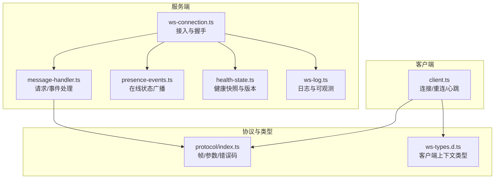
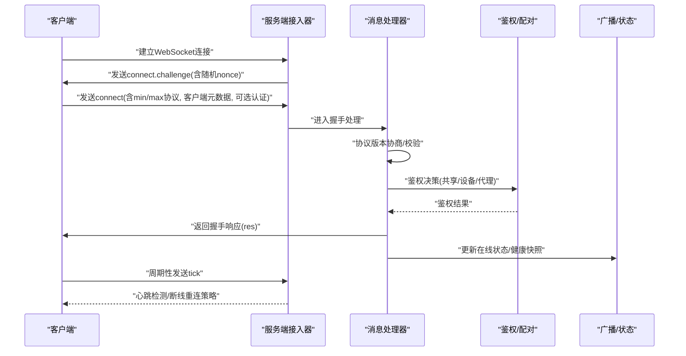
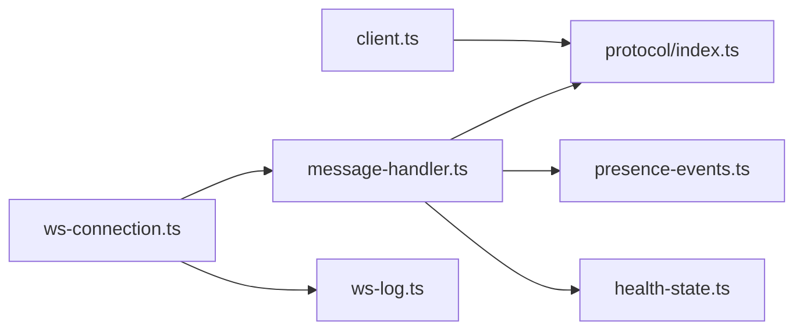

# WebSocket控制平面

<cite>
**本文引用的文件**
- [src/gateway/server/ws-connection.ts](file://src/gateway/server/ws-connection.ts)
- [src/gateway/client.ts](file://src/gateway/client.ts)
- [src/gateway/server/ws-connection/message-handler.ts](file://src/gateway/server/ws-connection/message-handler.ts)
- [src/gateway/protocol/index.ts](file://src/gateway/protocol/index.ts)
- [src/gateway/server/presence-events.ts](file://src/gateway/server/presence-events.ts)
- [src/gateway/server/health-state.ts](file://src/gateway/server/health-state.ts)
- [src/gateway/ws-log.ts](file://src/gateway/ws-log.ts)
- [src/gateway/server/ws-connection/auth-context.ts](file://src/gateway/server/ws-connection/auth-context.ts)
- [dist/plugin-sdk/gateway/server/ws-types.d.ts](file://dist/plugin-sdk/gateway/server/ws-types.d.ts)
</cite>

## 目录

1. [简介](#简介)
2. [项目结构](#项目结构)
3. [核心组件](#核心组件)
4. [架构总览](#架构总览)
5. [详细组件分析](#详细组件分析)
6. [依赖关系分析](#依赖关系分析)
7. [性能考量](#性能考量)
8. [故障排查指南](#故障排查指南)
9. [结论](#结论)
10. [附录：WebSocket API 规范与协议](#附录websocket-api-规范与协议)

## 简介

本文件面向OpenClaw的WebSocket控制平面，系统性阐述连接管理、消息协议、事件模型与广播机制。内容覆盖客户端连接建立、握手协商、心跳检测、断线重连、TLS指纹校验、序列化与错误处理、事件订阅与广播、以及调试与性能优化建议。目标是帮助开发者快速理解并正确集成与排障。

## 项目结构

OpenClaw的WebSocket控制平面由服务端与客户端两部分组成，均基于ws库实现。服务端负责接入、鉴权、协议协商、事件广播；客户端负责连接、握手、请求响应、心跳监控与自动重连。

图示来源

- [src/gateway/server/ws-connection.ts](file://src/gateway/server/ws-connection.ts#L106-L309)
- [src/gateway/server/ws-connection/message-handler.ts](file://src/gateway/server/ws-connection/message-handler.ts#L210-L275)
- [src/gateway/server/presence-events.ts](file://src/gateway/server/presence-events.ts#L4-L22)
- [src/gateway/server/health-state.ts](file://src/gateway/server/health-state.ts#L17-L46)
- [src/gateway/ws-log.ts](file://src/gateway/ws-log.ts#L256-L314)
- [src/gateway/client.ts](file://src/gateway/client.ts#L107-L229)
- [src/gateway/protocol/index.ts](file://src/gateway/protocol/index.ts#L1-L640)
- [dist/plugin-sdk/gateway/server/ws-types.d.ts](file://dist/plugin-sdk/gateway/server/ws-types.d.ts#L1-L13)

章节来源

- [src/gateway/server/ws-connection.ts](file://src/gateway/server/ws-connection.ts#L106-L309)
- [src/gateway/client.ts](file://src/gateway/client.ts#L107-L229)

## 核心组件

- 服务端接入器（ws-connection.ts）
  - 负责WebSocket连接接入、握手挑战、超时与关闭清理、发送/关闭封装。
- 消息处理器（message-handler.ts）
  - 负责解析首包、协议版本协商、鉴权决策、设备签名验证、配对流程、请求路由与响应。
- 客户端（client.ts）
  - 负责安全连接、握手挑战、connect请求、请求/响应队列、心跳监控、断线重连与TLS指纹校验。
- 协议与类型（protocol/index.ts）
  - 定义帧结构、参数Schema、错误码、协议版本与校验函数。
- 广播与状态（presence-events.ts、health-state.ts）
  - 提供在线状态与健康快照的广播与版本号管理。
- 日志（ws-log.ts）
  - 统一日志格式、慢请求统计、敏感信息脱敏与可配置输出风格。

章节来源

- [src/gateway/server/ws-connection.ts](file://src/gateway/server/ws-connection.ts#L106-L309)
- [src/gateway/server/ws-connection/message-handler.ts](file://src/gateway/server/ws-connection/message-handler.ts#L335-L450)
- [src/gateway/client.ts](file://src/gateway/client.ts#L85-L523)
- [src/gateway/protocol/index.ts](file://src/gateway/protocol/index.ts#L1-L640)
- [src/gateway/server/presence-events.ts](file://src/gateway/server/presence-events.ts#L4-L22)
- [src/gateway/server/health-state.ts](file://src/gateway/server/health-state.ts#L17-L85)
- [src/gateway/ws-log.ts](file://src/gateway/ws-log.ts#L256-L314)

## 架构总览

下图展示从客户端发起连接到服务端完成握手、鉴权与会话建立的完整时序。

图示来源

- [src/gateway/server/ws-connection.ts](file://src/gateway/server/ws-connection.ts#L165-L170)
- [src/gateway/server/ws-connection/message-handler.ts](file://src/gateway/server/ws-connection/message-handler.ts#L408-L450)
- [src/gateway/client.ts](file://src/gateway/client.ts#L230-L350)
- [src/gateway/server/presence-events.ts](file://src/gateway/server/presence-events.ts#L4-L22)
- [src/gateway/server/health-state.ts](file://src/gateway/server/health-state.ts#L69-L84)

## 详细组件分析

### 服务端接入与握手（ws-connection.ts）

- 连接接入
  - 记录远端地址、Host/Origin/User-Agent/X-Forwarded-\*等头信息，解析Canvas Host URL。
  - 发送connect.challenge事件，携带随机nonce与时间戳。
- 握手超时
  - 启动定时器，若握手未完成则标记失败并关闭连接。
- 关闭清理
  - 记录关闭原因、持续时间、最后帧元信息；清理客户端集合、移除节点注册、更新在线状态快照。
- 发送/关闭封装
  - 统一JSON序列化发送；异常忽略以避免二次崩溃。

章节来源

- [src/gateway/server/ws-connection.ts](file://src/gateway/server/ws-connection.ts#L106-L309)

### 消息处理器（message-handler.ts）

- 首包校验
  - 必须为connect请求且参数通过Schema校验；否则返回INVALID_REQUEST并关闭。
- 协议版本协商
  - min/max与当前PROTOCOL_VERSION比较，不兼容则返回INVALID_REQUEST并关闭。
- 浏览器来源校验
  - 对Control UI/Webchat或带Origin头的请求执行Origin检查，拒绝后返回INVALID_REQUEST并关闭。
- 鉴权状态与决策
  - 共享凭据（token/password）与设备令牌候选（deviceToken）分别处理；支持速率限制与代理信任策略。
  - 设备签名验证：支持v2/v3负载，校验nonce、公钥与时间偏差。
- 配对流程
  - 未配对或权限升级时触发配对请求，本地回环且无Origin头可静默批准。
- 请求路由与响应
  - 将合法请求交由服务端方法处理，构造res帧返回；支持expectFinal模式的“接受”中间态。

章节来源

- [src/gateway/server/ws-connection/message-handler.ts](file://src/gateway/server/ws-connection/message-handler.ts#L335-L450)
- [src/gateway/server/ws-connection/message-handler.ts](file://src/gateway/server/ws-connection/message-handler.ts#L452-L720)
- [src/gateway/server/ws-connection/message-handler.ts](file://src/gateway/server/ws-connection/message-handler.ts#L720-L800)

### 客户端（client.ts）

- 安全连接
  - 强制wss://或本地回环；支持TLS指纹校验，拒绝明文ws://非本地目标。
- 握手挑战
  - 收到connect.challenge后提取nonce，发送connect请求；超时则关闭并报告。
- 请求/响应队列
  - 维护pending映射，区分expectFinal中间态；响应ok=true时解析payload，否则抛出错误。
- 心跳与断线重连
  - 周期性发送tick；根据服务端policy设置tick间隔；lastTick超过阈值则主动关闭；指数退避重连。
- 设备令牌持久化
  - 成功握手后存储设备令牌；当服务端返回设备令牌时持久化到本地。

章节来源

- [src/gateway/client.ts](file://src/gateway/client.ts#L107-L229)
- [src/gateway/client.ts](file://src/gateway/client.ts#L230-L350)
- [src/gateway/client.ts](file://src/gateway/client.ts#L352-L403)
- [src/gateway/client.ts](file://src/gateway/client.ts#L445-L467)
- [src/gateway/client.ts](file://src/gateway/client.ts#L425-L436)

### 协议与类型（protocol/index.ts）

- 帧与参数
  - 定义RequestFrame、ResponseFrame、EventFrame、ConnectParams等Schema与校验函数。
- 错误码与错误形状
  - 统一错误码与错误形状，便于客户端识别与处理。
- 协议版本
  - PROTOCOL_VERSION用于服务端与客户端协商，确保兼容性。

章节来源

- [src/gateway/protocol/index.ts](file://src/gateway/protocol/index.ts#L1-L640)

### 广播与状态（presence-events.ts、health-state.ts）

- 在线状态广播
  - 每次变更递增presence版本，广播presence事件，携带当前系统在线列表与健康版本。
- 健康快照
  - 缓存健康快照，异步刷新并递增health版本；提供查询接口供广播使用。

章节来源

- [src/gateway/server/presence-events.ts](file://src/gateway/server/presence-events.ts#L4-L22)
- [src/gateway/server/health-state.ts](file://src/gateway/server/health-state.ts#L69-L84)

### 日志（ws-log.ts）

- 输出风格
  - 支持详细/紧凑/自动三种风格；慢请求高亮；连接/请求/事件/响应统一前缀。
- 敏感信息脱敏
  - 默认脱敏模式，避免在日志中泄露敏感数据。
- 性能观测
  - 记录请求耗时、丢弃慢广播、连接ID短ID化等。

章节来源

- [src/gateway/ws-log.ts](file://src/gateway/ws-log.ts#L256-L314)
- [src/gateway/ws-log.ts](file://src/gateway/ws-log.ts#L316-L378)
- [src/gateway/ws-log.ts](file://src/gateway/ws-log.ts#L380-L438)

### 类型与上下文（ws-types.d.ts）

- GatewayWsClient
  - 包含WebSocket实例、ConnectParams、connId、可选presenceKey、客户端IP、Canvas能力等。

章节来源

- [dist/plugin-sdk/gateway/server/ws-types.d.ts](file://dist/plugin-sdk/gateway/server/ws-types.d.ts#L1-L13)

## 依赖关系分析

- 服务端
  - ws-connection.ts依赖ws库与日志模块；message-handler.ts依赖鉴权、配对、健康与广播模块。
- 客户端
  - client.ts依赖协议Schema、设备身份与TLS指纹校验、心跳与重连逻辑。
- 协议层
  - protocol/index.ts提供所有Schema与校验函数，被服务端与客户端共同使用。

图示来源

- [src/gateway/client.ts](file://src/gateway/client.ts#L1-L50)
- [src/gateway/server/ws-connection.ts](file://src/gateway/server/ws-connection.ts#L1-L25)
- [src/gateway/server/ws-connection/message-handler.ts](file://src/gateway/server/ws-connection/message-handler.ts#L1-L70)
- [src/gateway/protocol/index.ts](file://src/gateway/protocol/index.ts#L1-L60)
- [src/gateway/server/presence-events.ts](file://src/gateway/server/presence-events.ts#L1-L5)
- [src/gateway/server/health-state.ts](file://src/gateway/server/health-state.ts#L1-L10)
- [src/gateway/ws-log.ts](file://src/gateway/ws-log.ts#L1-L10)

章节来源

- [src/gateway/server/ws-connection.ts](file://src/gateway/server/ws-connection.ts#L1-L25)
- [src/gateway/server/ws-connection/message-handler.ts](file://src/gateway/server/ws-connection/message-handler.ts#L1-L70)
- [src/gateway/client.ts](file://src/gateway/client.ts#L1-L35)
- [src/gateway/protocol/index.ts](file://src/gateway/protocol/index.ts#L1-L60)

## 性能考量

- 心跳与超时
  - 服务端根据握手返回的policy.tickIntervalMs调整心跳周期；客户端检测lastTick超时后主动关闭，避免僵尸连接。
- 广播降载
  - presence/health广播支持dropIfSlow，防止慢消费者拖垮整体吞吐。
- 日志开销
  - 详细日志仅在verbose模式启用；紧凑/自动模式减少高频日志写入。
- Payload大小
  - 客户端允许较大payload（如屏幕截图），服务端应结合业务场景评估内存占用。

章节来源

- [src/gateway/client.ts](file://src/gateway/client.ts#L332-L338)
- [src/gateway/server/presence-events.ts](file://src/gateway/server/presence-events.ts#L10-L20)
- [src/gateway/ws-log.ts](file://src/gateway/ws-log.ts#L266-L269)

## 故障排查指南

- 握手失败
  - 协议不匹配：检查客户端min/max与服务端PROTOCOL_VERSION是否一致。
  - 非法握手：确认首包为connect且参数Schema有效。
  - Origin不允许：浏览器来源需满足allowedOrigins配置。
- 认证失败
  - 共享凭据（token/password）或设备令牌不匹配：核对凭据与速率限制。
  - 设备签名问题：检查nonce、公钥、时间戳与签名版本。
- TLS与安全
  - 明文ws://非本地被阻断：使用wss://或本地隧道；必要时配置TLS指纹校验。
- 心跳与断连
  - 客户端tick超时：增大tickWatchMinInterval或检查网络延迟。
  - 服务端握手超时：检查客户端connect挑战响应是否及时。
- 日志定位
  - 使用gateway/ws子系统日志，关注慢请求、解析错误与关闭原因。

章节来源

- [src/gateway/server/ws-connection/message-handler.ts](file://src/gateway/server/ws-connection/message-handler.ts#L434-L450)
- [src/gateway/server/ws-connection/message-handler.ts](file://src/gateway/server/ws-connection/message-handler.ts#L470-L491)
- [src/gateway/server/ws-connection/message-handler.ts](file://src/gateway/server/ws-connection/message-handler.ts#L617-L616)
- [src/gateway/client.ts](file://src/gateway/client.ts#L112-L137)
- [src/gateway/client.ts](file://src/gateway/client.ts#L454-L466)
- [src/gateway/ws-log.ts](file://src/gateway/ws-log.ts#L332-L344)

## 结论

OpenClaw的WebSocket控制平面以严格的握手与鉴权、清晰的协议版本协商、完善的事件与广播机制为核心，辅以心跳与断线重连保障稳定性，并通过可配置的日志与性能策略提升可观测性与吞吐。开发者在集成时应重点关注协议版本一致性、设备签名与Origin校验、TLS安全策略与心跳阈值配置。

## 附录：WebSocket API 规范与协议

### 消息类型与帧结构

- 请求帧（req）
  - 字段：type="req"、id（UUID）、method（字符串）、params（对象）。
- 响应帧（res）
  - 字段：type="res"、id（对应请求）、ok（布尔）、payload或error。
- 事件帧（event）
  - 字段：type="event"、event（字符串）、payload（对象）、可选seq（序列号）。

章节来源

- [src/gateway/protocol/index.ts](file://src/gateway/protocol/index.ts#L119-L129)
- [src/gateway/protocol/index.ts](file://src/gateway/protocol/index.ts#L166-L169)
- [src/gateway/protocol/index.ts](file://src/gateway/protocol/index.ts#L122-L123)

### 握手流程与connect参数

- 握手事件
  - 服务端发送connect.challenge（含nonce与ts）；客户端收到后发送connect。
- connect参数
  - minProtocol/maxProtocol、client（id/displayName/version/platform/deviceFamily/mode/instanceId）、caps、commands、permissions、pathEnv、auth（token/deviceToken/password）、role、scopes、device（id/publicKey/signature/signedAt/nonce）。

章节来源

- [src/gateway/server/ws-connection.ts](file://src/gateway/server/ws-connection.ts#L165-L170)
- [src/gateway/client.ts](file://src/gateway/client.ts#L295-L318)
- [src/gateway/protocol/index.ts](file://src/gateway/protocol/index.ts#L75-L76)

### 协议版本管理

- PROTOCOL_VERSION
  - 服务端与客户端均以此为准进行协商；minProtocol/maxProtocol不兼容时拒绝握手。

章节来源

- [src/gateway/server/ws-connection/message-handler.ts](file://src/gateway/server/ws-connection/message-handler.ts#L434-L450)
- [src/gateway/protocol/index.ts](file://src/gateway/protocol/index.ts#L159-L159)

### 错误处理与错误码

- 错误形状
  - 包含code、message与details（可选）。
- 常见错误
  - INVALID_REQUEST：非法握手/请求、协议不匹配、Origin不被允许。
  - NOT_PAIRED：缺少设备身份且策略要求。
  - UNAUTHORIZED：凭据无效或速率限制。

章节来源

- [src/gateway/protocol/index.ts](file://src/gateway/protocol/index.ts#L119-L121)
- [src/gateway/server/ws-connection/message-handler.ts](file://src/gateway/server/ws-connection/message-handler.ts#L421-L432)
- [src/gateway/server/ws-connection/message-handler.ts](file://src/gateway/server/ws-connection/message-handler.ts#L523-L559)

### 事件模型与广播

- 事件
  - connect.challenge、tick等；服务端可广播presence、health等状态事件。
- 广播
  - 支持dropIfSlow与stateVersion（presence/health）以协调客户端状态同步。

章节来源

- [src/gateway/server/ws-connection.ts](file://src/gateway/server/ws-connection.ts#L165-L170)
- [src/gateway/server/presence-events.ts](file://src/gateway/server/presence-events.ts#L10-L20)
- [src/gateway/server/health-state.ts](file://src/gateway/server/health-state.ts#L69-L84)

### 安全与鉴权要点

- TLS与Origin
  - 强制wss://；浏览器来源需满足allowedOrigins；代理场景需正确配置trustedProxies。
- 设备签名
  - 校验nonce、公钥、时间戳与签名版本；支持v2/v3负载。
- 速率限制
  - 共享凭据与设备令牌分别限流，避免暴力破解。

章节来源

- [src/gateway/client.ts](file://src/gateway/client.ts#L112-L137)
- [src/gateway/server/ws-connection/message-handler.ts](file://src/gateway/server/ws-connection/message-handler.ts#L470-L491)
- [src/gateway/server/ws-connection/message-handler.ts](file://src/gateway/server/ws-connection/message-handler.ts#L641-L683)
- [src/gateway/server/ws-connection/auth-context.ts](file://src/gateway/server/ws-connection/auth-context.ts#L108-L122)

### 调试工具与建议

- 日志
  - 启用gateway/ws子系统日志；使用详细/紧凑风格；关注慢请求与解析错误。
- 连接诊断
  - 检查握手超时、心跳超时、Origin与TLS指纹；核对协议版本与设备签名。
- 性能优化
  - 合理设置tickIntervalMs与最小心跳间隔；开启dropIfSlow；避免频繁大对象广播。

章节来源

- [src/gateway/ws-log.ts](file://src/gateway/ws-log.ts#L256-L314)
- [src/gateway/client.ts](file://src/gateway/client.ts#L454-L466)
- [src/gateway/server/presence-events.ts](file://src/gateway/server/presence-events.ts#L10-L20)
