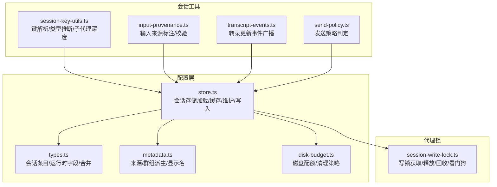
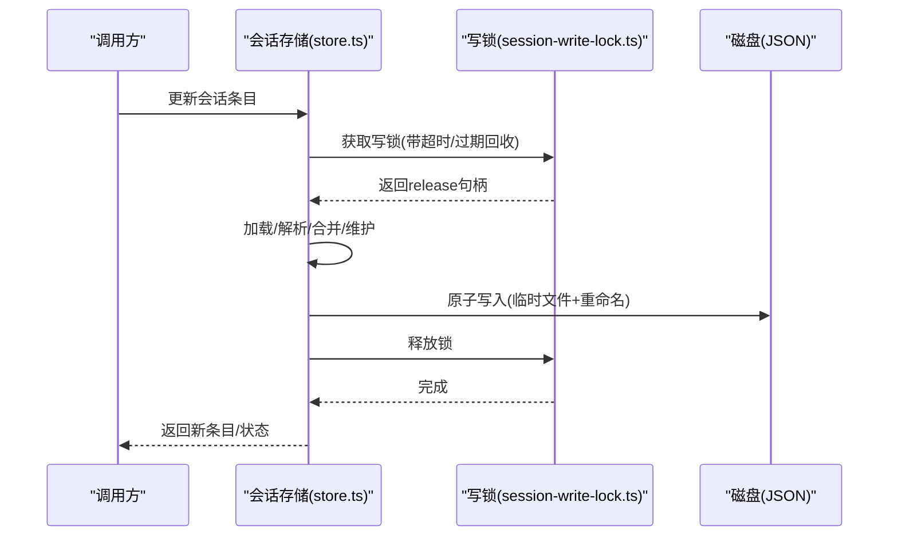
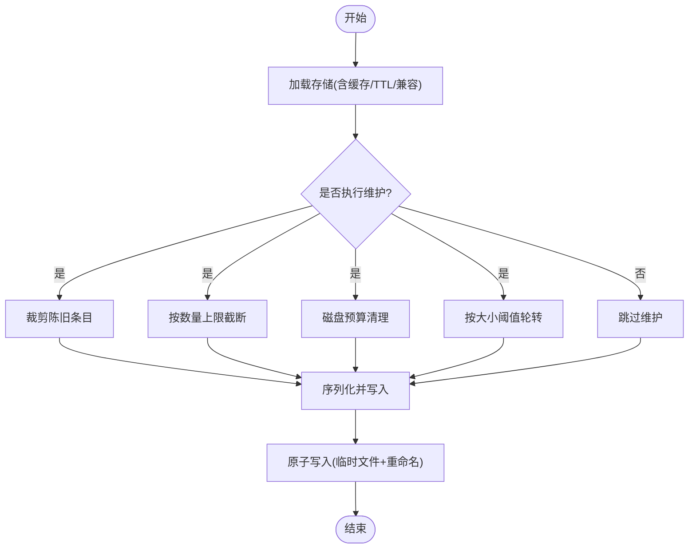
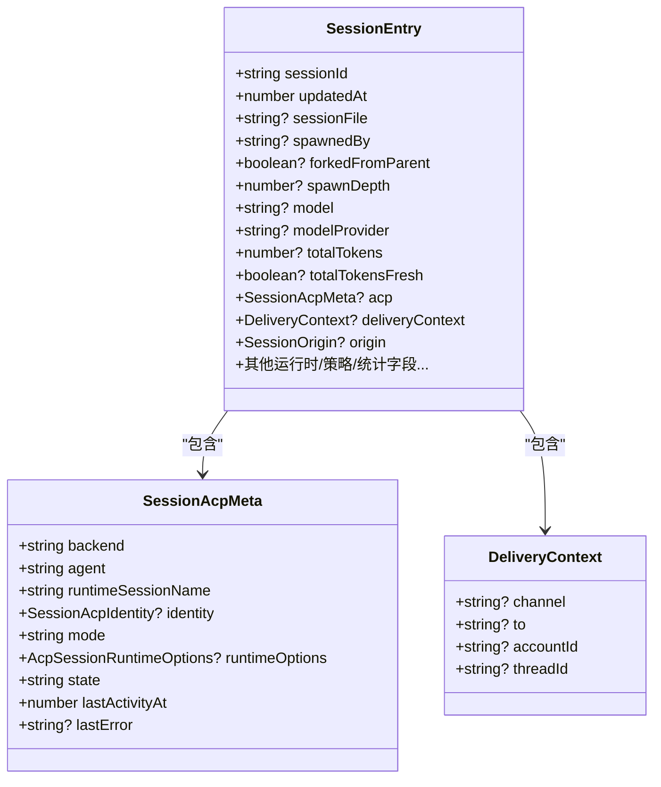
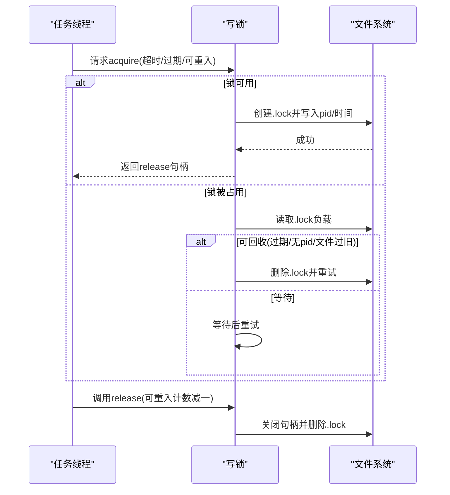
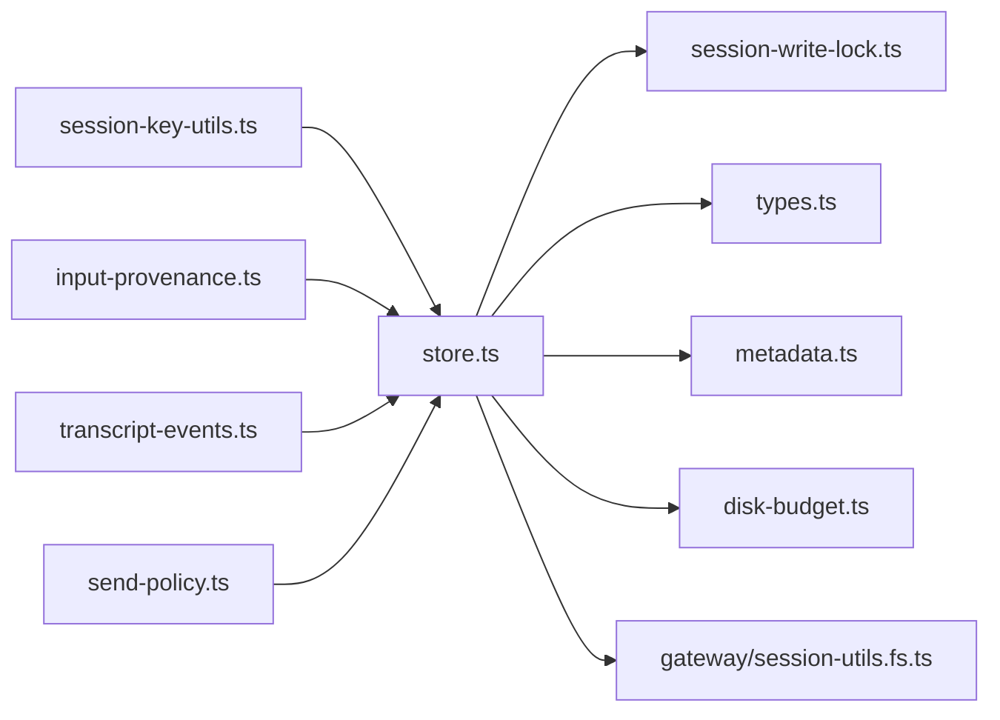

# 会话管理

<cite>
**本文引用的文件**
- [src/config/sessions/store.ts](file://src/config/sessions/store.ts)
- [src/config/sessions/types.ts](file://src/config/sessions/types.ts)
- [src/config/sessions/metadata.ts](file://src/config/sessions/metadata.ts)
- [src/config/sessions/disk-budget.ts](file://src/config/sessions/disk-budget.ts)
- [src/sessions/session-key-utils.ts](file://src/sessions/session-key-utils.ts)
- [src/sessions/input-provenance.ts](file://src/sessions/input-provenance.ts)
- [src/sessions/transcript-events.ts](file://src/sessions/transcript-events.ts)
- [src/sessions/send-policy.ts](file://src/sessions/send-policy.ts)
- [src/agents/session-write-lock.ts](file://src/agents/session-write-lock.ts)
- [src/agents/pi-extensions/session-manager-runtime-registry.ts](file://src/agents/pi-extensions/session-manager-runtime-registry.ts)
</cite>

## 目录

1. [简介](#简介)
2. [项目结构](#项目结构)
3. [核心组件](#核心组件)
4. [架构总览](#架构总览)
5. [详细组件分析](#详细组件分析)
6. [依赖关系分析](#依赖关系分析)
7. [性能考量](#性能考量)
8. [故障排查指南](#故障排查指南)
9. [结论](#结论)
10. [附录](#附录)

## 简介

本文件面向OpenClaw会话管理系统，围绕会话生命周期管理、状态持久化、并发控制、会话标识符生成与解析、数据结构与内存管理、会话快照与增量更新、冲突解决、事件监听与状态变更通知、分布式一致性保障、存储方案与备份恢复策略、性能优化技巧、调试工具与常见问题进行系统化技术说明，并提供最佳实践与扩展开发指导。

## 项目结构

OpenClaw的会话管理由“配置层（sessions）+ 代理锁（agents）+ 会话工具（sessions 工具集）”三部分协同实现：

- 配置层：负责会话存储的加载、缓存、维护（裁剪、清理、轮转）、磁盘配额、写入锁队列与原子落盘。
- 代理锁：提供跨进程/线程的会话写入锁，支持超时、过期回收、看门狗释放、可重入等能力。
- 会话工具：提供会话键解析、输入来源标注、转录事件广播、发送策略判定等辅助能力。

**图表来源**

- [src/config/sessions/store.ts](file://src/config/sessions/store.ts#L1-L1159)
- [src/config/sessions/types.ts](file://src/config/sessions/types.ts#L1-L339)
- [src/config/sessions/metadata.ts](file://src/config/sessions/metadata.ts#L1-L173)
- [src/config/sessions/disk-budget.ts](file://src/config/sessions/disk-budget.ts#L1-L376)
- [src/agents/session-write-lock.ts](file://src/agents/session-write-lock.ts#L1-L505)
- [src/sessions/session-key-utils.ts](file://src/sessions/session-key-utils.ts#L1-L133)
- [src/sessions/input-provenance.ts](file://src/sessions/input-provenance.ts#L1-L80)
- [src/sessions/transcript-events.ts](file://src/sessions/transcript-events.ts#L1-L26)
- [src/sessions/send-policy.ts](file://src/sessions/send-policy.ts#L1-L124)

**章节来源**

- [src/config/sessions/store.ts](file://src/config/sessions/store.ts#L1-L1159)
- [src/agents/session-write-lock.ts](file://src/agents/session-write-lock.ts#L1-L505)
- [src/sessions/session-key-utils.ts](file://src/sessions/session-key-utils.ts#L1-L133)
- [src/sessions/input-provenance.ts](file://src/sessions/input-provenance.ts#L1-L80)
- [src/sessions/transcript-events.ts](file://src/sessions/transcript-events.ts#L1-L26)
- [src/sessions/send-policy.ts](file://src/sessions/send-policy.ts#L1-L124)

## 核心组件

- 会话存储与维护：提供会话JSON存储的加载、缓存、维护（裁剪、清理、轮转）、磁盘配额、写入锁队列与原子落盘。
- 会话数据模型：定义SessionEntry、运行时模型字段、合并策略、新鲜度标记等。
- 会话元数据派生：从消息上下文派生SessionOrigin、群组信息、显示名等。
- 会话磁盘预算：按高水位/上限策略清理归档与会话文件，避免越界。
- 并发写入锁：基于文件锁的跨进程/线程写锁，支持超时、过期回收、看门狗释放、可重入。
- 会话键工具：标准化会话键、推断聊天类型、识别子代理/定时任务/ACp键、提取线程父键。
- 输入来源标注：为用户消息注入provenance，支持跨会话来源识别。
- 转录事件：广播会话转录文件更新事件，供监听者响应。
- 发送策略：根据配置与键前缀匹配决定允许/拒绝发送。

**章节来源**

- [src/config/sessions/store.ts](file://src/config/sessions/store.ts#L1-L1159)
- [src/config/sessions/types.ts](file://src/config/sessions/types.ts#L1-L339)
- [src/config/sessions/metadata.ts](file://src/config/sessions/metadata.ts#L1-L173)
- [src/config/sessions/disk-budget.ts](file://src/config/sessions/disk-budget.ts#L1-L376)
- [src/agents/session-write-lock.ts](file://src/agents/session-write-lock.ts#L1-L505)
- [src/sessions/session-key-utils.ts](file://src/sessions/session-key-utils.ts#L1-L133)
- [src/sessions/input-provenance.ts](file://src/sessions/input-provenance.ts#L1-L80)
- [src/sessions/transcript-events.ts](file://src/sessions/transcript-events.ts#L1-L26)
- [src/sessions/send-policy.ts](file://src/sessions/send-policy.ts#L1-L124)

## 架构总览

OpenClaw会话管理采用“配置层+锁层+工具层”的分层设计，确保：

- 存储层：以JSON文件为中心，提供缓存、维护、轮转、磁盘预算等能力。
- 锁层：通过文件锁实现串行化写入，避免竞态与空文件风险。
- 工具层：对会话键、输入来源、事件、策略进行统一抽象与复用。

**图表来源**

- [src/config/sessions/store.ts](file://src/config/sessions/store.ts#L970-L1031)
- [src/agents/session-write-lock.ts](file://src/agents/session-write-lock.ts#L406-L497)

**章节来源**

- [src/config/sessions/store.ts](file://src/config/sessions/store.ts#L970-L1031)
- [src/agents/session-write-lock.ts](file://src/agents/session-write-lock.ts#L406-L497)

## 详细组件分析

### 会话存储与维护（store.ts）

- 缓存与TTL：基于Map的会话存储缓存，支持环境变量控制TTL；缓存命中返回深拷贝，避免外部修改污染。
- 加载与容错：Windows平台在临时文件+重命名期间可能出现空文件或锁定，内置最多3次同步回退重试。
- 兼容迁移：自动迁移旧字段（如provider→channel、lastProvider→lastChannel、room→groupChannel），并兼容遗留格式。
- 维护策略：按时间阈值裁剪陈旧条目、按数量上限截断、按大小阈值轮转主文件，保留最近3个备份。
- 磁盘预算：按高水位/上限清理归档与会话文件，支持“仅告警不删除”的warn-only模式。
- 写入锁队列：同一storePath串行化处理，队列中任务按超时与过期策略执行，失败时抛出明确错误。
- 原子写入：Windows使用临时文件+重命名，避免并发读到空文件；非Windows亦采用相同策略以统一行为。

**图表来源**

- [src/config/sessions/store.ts](file://src/config/sessions/store.ts#L198-L800)

**章节来源**

- [src/config/sessions/store.ts](file://src/config/sessions/store.ts#L198-L800)

### 会话数据模型（types.ts）

- SessionEntry：集中定义会话条目的所有字段，包括运行时模型、队列/策略、令牌统计、ACp元数据、活动运行状态等。
- 运行时字段规范化：对model/modelProvider进行去空白与清理，避免遗留无效字段。
- 合并策略：mergeSessionEntry以updatedAt与当前时间取最大值，确保时间戳单调递增；当仅更新model未更新provider时，自动清理provider以避免不一致。
- 新鲜度标记：totalTokensFresh用于标记令牌统计是否为最新快照，便于UI与统计正确显示。

**图表来源**

- [src/config/sessions/types.ts](file://src/config/sessions/types.ts#L68-L174)

**章节来源**

- [src/config/sessions/types.ts](file://src/config/sessions/types.ts#L68-L174)

### 会话元数据派生（metadata.ts）

- 源头派生：从消息上下文提取label/provider/surface/chatType/from/to/accountId/threadId，合并至SessionOrigin。
- 群组派生：根据上下文与通道能力推断群组频道、主题、空间，并构建显示名。
- 元数据补丁：将派生结果合并为Partial<SessionEntry>，用于后续更新。

**章节来源**

- [src/config/sessions/metadata.ts](file://src/config/sessions/metadata.ts#L45-L172)

### 会话磁盘预算（disk-budget.ts）

- 预算计算：统计store与会话文件大小，判断是否超过上限；若超过，先清理归档文件，再按最后更新时间淘汰条目。
- 参考路径：仅删除不再被store引用的会话文件，避免误删活跃会话。
- 高水位策略：达到高水位后才真正删除，否则仅记录日志。
- 结果报告：返回清理前后字节、移除文件数、移除条目数、释放字节数等指标。

**章节来源**

- [src/config/sessions/disk-budget.ts](file://src/config/sessions/disk-budget.ts#L188-L375)

### 并发写入锁（session-write-lock.ts）

- 文件锁：在会话文件目录下创建“.lock”文件，写入pid与创建时间；获取失败则等待或回收过期锁。
- 超时与过期：支持timeoutMs、staleMs、maxHoldMs；看门狗定时扫描并强制释放超时锁。
- 可重入：同进程内多次获取计数累加，释放时计数减至0才真正关闭。
- 清理：进程退出/信号触发时同步释放所有持有锁，避免僵尸锁。

**图表来源**

- [src/agents/session-write-lock.ts](file://src/agents/session-write-lock.ts#L406-L497)

**章节来源**

- [src/agents/session-write-lock.ts](file://src/agents/session-write-lock.ts#L406-L497)

### 会话键工具（session-key-utils.ts）

- 规范化：统一大小写与空白，解析agent前缀，提取agentId与rest部分。
- 类型推断：从键中提取group/channel/direct等聊天类型，兼容遗留Discord格式。
- 特性识别：识别定时任务键、子代理键、ACp键；计算子代理深度。
- 线程父键：从thread/topic标记中提取父会话键。

**章节来源**

- [src/sessions/session-key-utils.ts](file://src/sessions/session-key-utils.ts#L12-L132)

### 输入来源标注（input-provenance.ts）

- 数据结构：InputProvenance包含kind与可选sourceSessionKey/sourceChannel/sourceTool。
- 校验与注入：对传入对象进行严格校验；为用户消息注入provenance，避免重复注入。
- 识别：支持识别跨会话输入来源，便于审计与溯源。

**章节来源**

- [src/sessions/input-provenance.ts](file://src/sessions/input-provenance.ts#L11-L79)

### 转录事件（transcript-events.ts）

- 监听器集合：全局Set维护监听器，支持注册/注销。
- 广播：emitSessionTranscriptUpdate在会话转录文件更新时广播给所有监听者。

**章节来源**

- [src/sessions/transcript-events.ts](file://src/sessions/transcript-events.ts#L7-L25)

### 发送策略（send-policy.ts）

- 决策流程：优先使用会话级覆盖策略，其次使用全局配置；支持按channel、chatType、键前缀匹配。
- 匹配规则：支持rawKeyPrefix与stripAgentSessionKeyPrefix两种前缀匹配方式。
- 默认策略：未匹配到规则时采用policy.default，缺省为允许。

**章节来源**

- [src/sessions/send-policy.ts](file://src/sessions/send-policy.ts#L53-L123)

### 会话管理器运行时注册表（session-manager-runtime-registry.ts）

- 弱映射：以SessionManager实例为键，保存会话作用域的运行时值。
- 生命周期：set(null)可删除对应键；get返回null表示不存在。

**章节来源**

- [src/agents/pi-extensions/session-manager-runtime-registry.ts](file://src/agents/pi-extensions/session-manager-runtime-registry.ts#L1-L29)

## 依赖关系分析

- store.ts依赖：
  - agents/session-write-lock.ts：写锁获取/释放。
  - config/sessions/types.ts：SessionEntry与合并逻辑。
  - config/sessions/metadata.ts：元数据派生与补丁。
  - config/sessions/disk-budget.ts：磁盘预算清理。
  - utils/delivery-context.ts：交付上下文规范化。
  - gateway/session-utils.fs.ts：归档与清理会话转录。
- session-key-utils.ts与send-policy.ts共同为store.ts提供键解析与策略决策。
- input-provenance.ts与transcript-events.ts为上层业务提供输入来源与事件通知。

**图表来源**

- [src/config/sessions/store.ts](file://src/config/sessions/store.ts#L1-L30)
- [src/agents/session-write-lock.ts](file://src/agents/session-write-lock.ts#L1-L505)
- [src/config/sessions/types.ts](file://src/config/sessions/types.ts#L1-L339)
- [src/config/sessions/metadata.ts](file://src/config/sessions/metadata.ts#L1-L173)
- [src/config/sessions/disk-budget.ts](file://src/config/sessions/disk-budget.ts#L1-L376)
- [src/sessions/session-key-utils.ts](file://src/sessions/session-key-utils.ts#L1-L133)
- [src/sessions/input-provenance.ts](file://src/sessions/input-provenance.ts#L1-L80)
- [src/sessions/transcript-events.ts](file://src/sessions/transcript-events.ts#L1-L26)
- [src/sessions/send-policy.ts](file://src/sessions/send-policy.ts#L1-L124)

**章节来源**

- [src/config/sessions/store.ts](file://src/config/sessions/store.ts#L1-L30)

## 性能考量

- 缓存与TTL：合理设置OPENCLAW_SESSION_CACHE_TTL_MS，减少频繁磁盘IO；注意缓存失效与mtime校验。
- 写入串行化：通过写锁队列避免争用；长耗时操作应尽量在update回调内完成，缩短持锁时间。
- 维护策略：定期裁剪与磁盘预算清理可显著降低存储膨胀；warn-only模式适合预演与观测。
- 原子写入：Windows平台的临时文件+重命名策略避免并发读到空文件，提升可靠性。
- 磁盘配额：合理设置maxDiskBytes与highWaterBytes，避免频繁清理造成抖动。

[本节为通用建议，无需特定文件引用]

## 故障排查指南

- 写锁超时：检查目标会话文件是否被长时间占用；查看超时与过期参数；必要时启用staleMs与看门狗。
- 空文件/解析失败：Windows平台可能在写入过程中短暂出现空文件；确认使用原子写入流程。
- 缓存不一致：调用invalidateSessionStoreCache或禁用缓存进行验证；检查mtimeMs变化。
- 磁盘配额告警：检查高水位策略与清理日志；确认归档文件是否被正确清理。
- 事件未触发：确认监听器已注册且emitSessionTranscriptUpdate传入了非空文件名。

**章节来源**

- [src/agents/session-write-lock.ts](file://src/agents/session-write-lock.ts#L406-L497)
- [src/config/sessions/store.ts](file://src/config/sessions/store.ts#L215-L247)
- [src/config/sessions/disk-budget.ts](file://src/config/sessions/disk-budget.ts#L227-L244)

## 结论

OpenClaw会话管理系统通过“配置层+锁层+工具层”的清晰分工，实现了可靠的状态持久化、严格的并发控制、灵活的维护策略与可观测的事件通知。结合磁盘预算与原子写入，系统在多平台环境下具备良好的一致性与稳定性。开发者可在上述组件基础上扩展策略、事件与存储后端，同时遵循本文的最佳实践与故障排查建议。

[本节为总结，无需特定文件引用]

## 附录

### 会话标识符生成与解析要点

- 标准化键：统一大小写与空白，解析agent前缀，提取agentId与rest部分。
- 聊天类型推断：从键中识别group/channel/direct等类型，兼容遗留格式。
- 特性识别：定时任务、子代理、ACp键可通过正则与前缀识别。
- 线程父键：从thread/topic标记中提取父会话键，支持层级化会话组织。

**章节来源**

- [src/sessions/session-key-utils.ts](file://src/sessions/session-key-utils.ts#L12-L132)

### 会话数据结构与内存管理

- SessionEntry集中承载会话状态，运行时字段规范化避免冗余。
- 合并策略确保时间戳与字段一致性；totalTokensFresh用于UI显示一致性。
- 内存管理：缓存返回深拷贝；写入前规范化并深拷贝store，避免外部修改影响缓存。

**章节来源**

- [src/config/sessions/types.ts](file://src/config/sessions/types.ts#L181-L256)
- [src/config/sessions/store.ts](file://src/config/sessions/store.ts#L208-L212)

### 会话快照、增量更新与冲突解决

- 快照：通过deriveSessionOrigin/deriveGroupSessionPatch生成元数据快照。
- 增量更新：updateSessionStoreEntry在锁内加载、解析、合并、维护、写入，确保原子性。
- 冲突解决：基于updatedAt与合并策略，避免旧数据覆盖新数据；磁盘预算清理时优先保留活跃会话与引用文件。

**章节来源**

- [src/config/sessions/metadata.ts](file://src/config/sessions/metadata.ts#L153-L172)
- [src/config/sessions/store.ts](file://src/config/sessions/store.ts#L1004-L1031)
- [src/config/sessions/disk-budget.ts](file://src/config/sessions/disk-budget.ts#L250-L340)

### 会话事件监听与状态变更通知

- 监听器注册：onSessionTranscriptUpdate返回注销函数。
- 广播机制：emitSessionTranscriptUpdate遍历监听器并触发回调。
- 应用场景：UI刷新、审计日志、外部系统联动。

**章节来源**

- [src/sessions/transcript-events.ts](file://src/sessions/transcript-events.ts#L9-L25)

### 分布式一致性与备份恢复

- 一致性：文件锁确保单写者；原子写入避免并发读到中间态。
- 备份：轮转时保留最近3个.bak.\*备份；归档清理按策略执行。
- 恢复：备份文件可作为历史快照；磁盘预算清理时避免误删活跃会话文件。

**章节来源**

- [src/config/sessions/store.ts](file://src/config/sessions/store.ts#L575-L627)
- [src/config/sessions/store.ts](file://src/config/sessions/store.ts#L721-L747)

### 性能优化技巧

- 合理设置缓存TTL与维护阈值，平衡IO与内存。
- 将长耗时逻辑放入update回调，缩短持锁时间。
- 使用warn-only模式预演维护策略，观察清理效果。
- 在Windows平台依赖原子写入策略，避免空文件竞态。

**章节来源**

- [src/config/sessions/store.ts](file://src/config/sessions/store.ts#L51-L60)
- [src/config/sessions/store.ts](file://src/config/sessions/store.ts#L774-L800)

### 调试工具与常见问题

- 调试工具：利用clearSessionStoreCacheForTest与getSessionStoreLockQueueSizeForTest辅助测试；通过cleanStaleLockFiles清理过期锁。
- 常见问题：写锁超时、空文件、缓存不一致、磁盘配额告警；按故障排查指南逐项验证。

**章节来源**

- [src/config/sessions/store.ts](file://src/config/sessions/store.ts#L171-L184)
- [src/agents/session-write-lock.ts](file://src/agents/session-write-lock.ts#L349-L404)

### 最佳实践与扩展开发指导

- 扩展策略：在send-policy中新增匹配规则；在metadata中扩展派生逻辑。
- 事件扩展：通过transcript-events注册监听器，接入外部系统。
- 存储扩展：在store.ts中增加自定义维护策略或归档规则。
- 锁策略：根据业务特性调整timeoutMs/staleMs/maxHoldMs，确保稳定性与吞吐平衡。

**章节来源**

- [src/sessions/send-policy.ts](file://src/sessions/send-policy.ts#L53-L123)
- [src/config/sessions/metadata.ts](file://src/config/sessions/metadata.ts#L153-L172)
- [src/config/sessions/store.ts](file://src/config/sessions/store.ts#L629-L769)
- [src/agents/session-write-lock.ts](file://src/agents/session-write-lock.ts#L406-L497)
