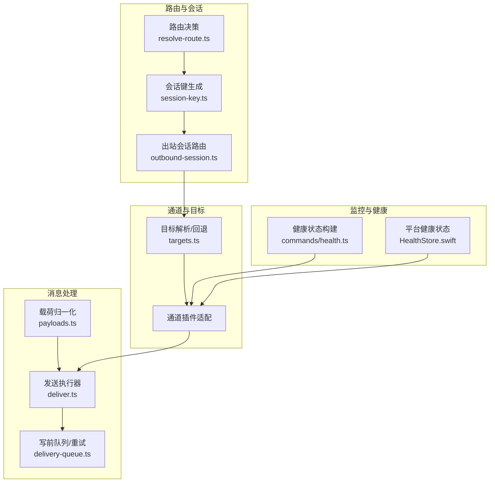
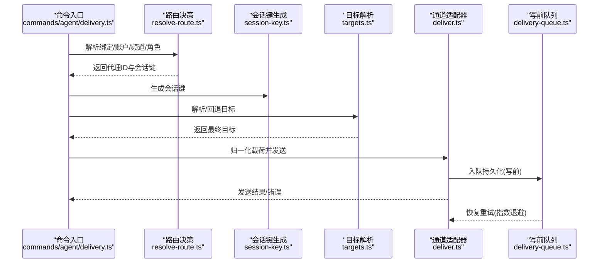
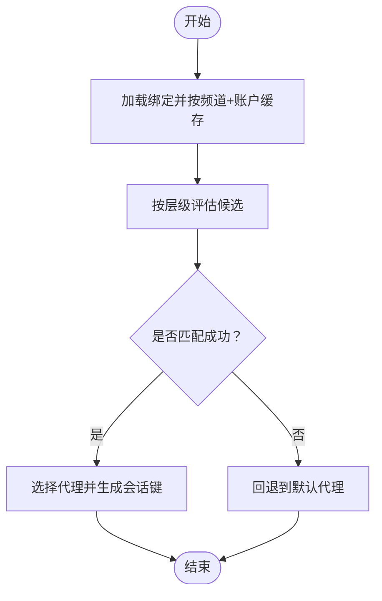
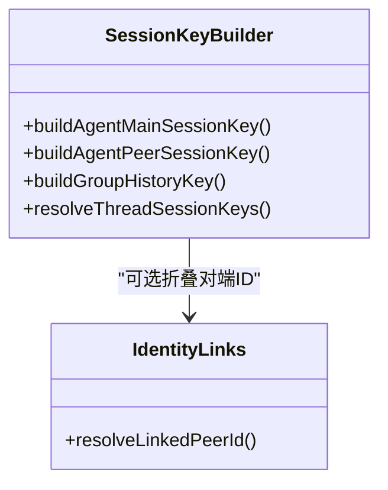
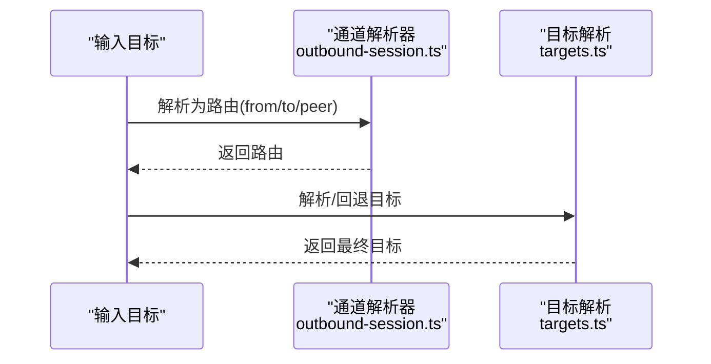
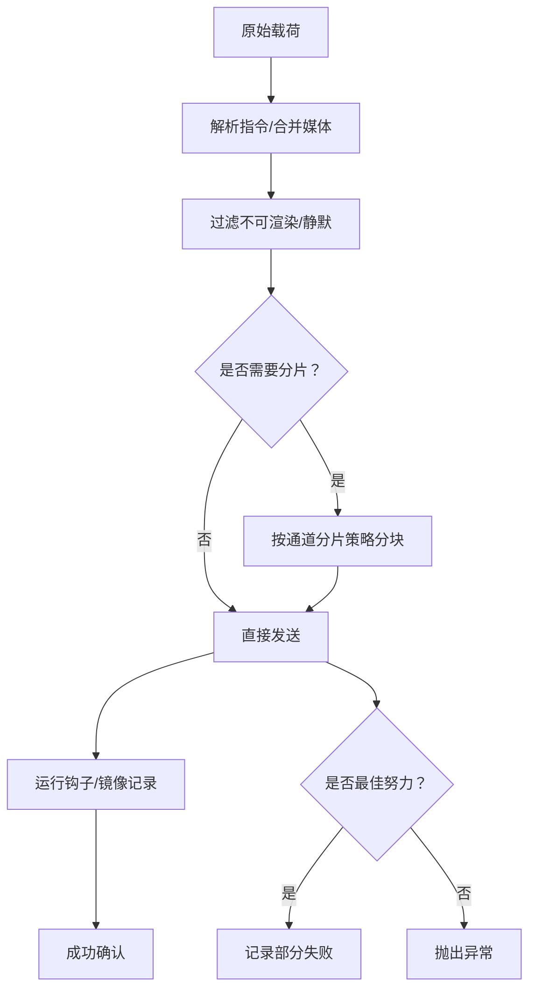
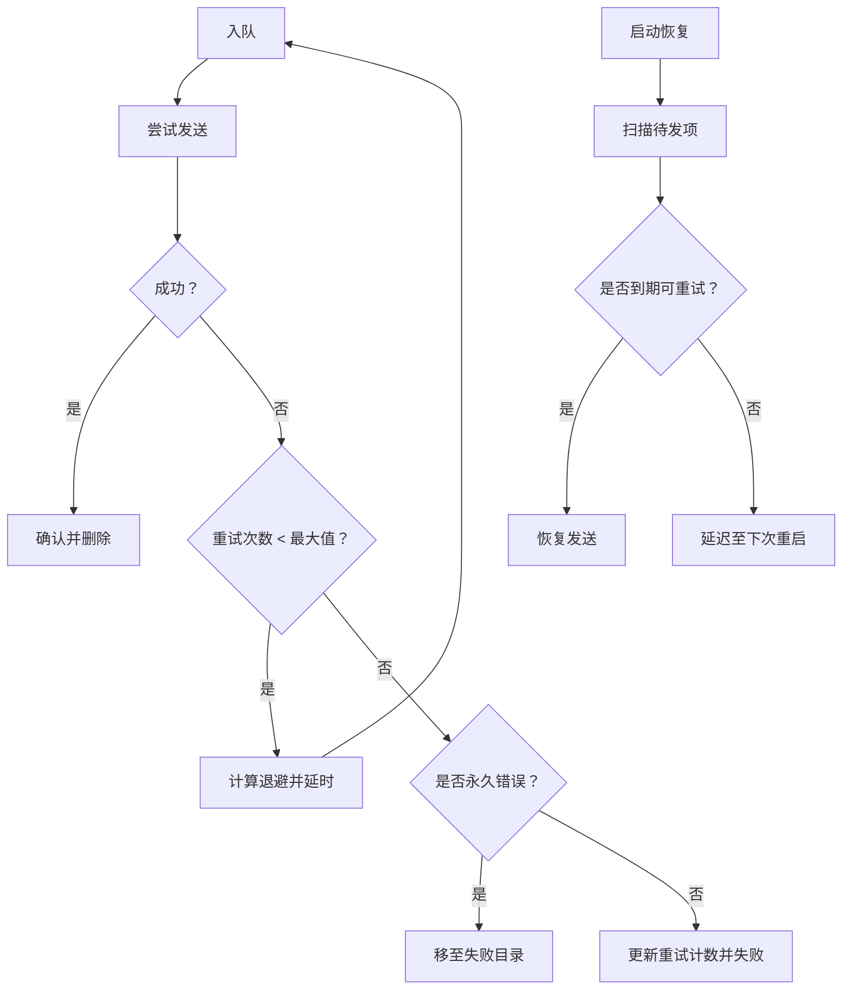
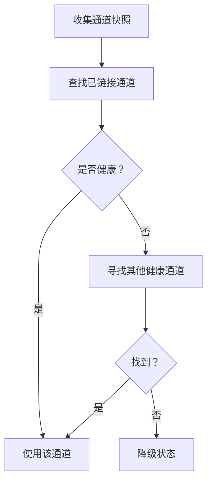
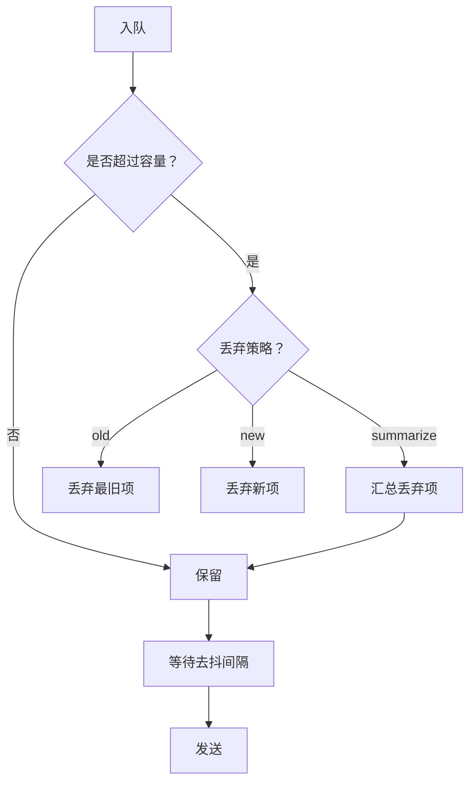
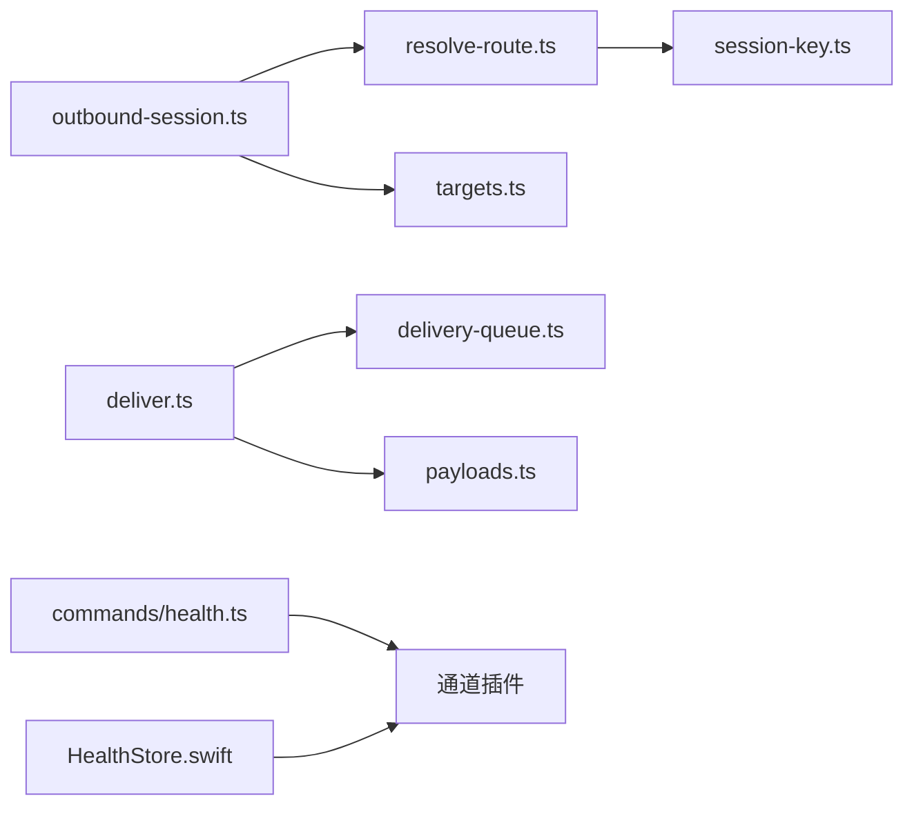

# 消息路由机制

<cite>
**本文档引用的文件**
- [src/routing/resolve-route.ts](file://src/routing/resolve-route.ts)
- [src/routing/session-key.ts](file://src/routing/session-key.ts)
- [src/infra/outbound/outbound-session.ts](file://src/infra/outbound/outbound-session.ts)
- [src/infra/outbound/deliver.ts](file://src/infra/outbound/deliver.ts)
- [src/infra/outbound/delivery-queue.ts](file://src/infra/outbound/delivery-queue.ts)
- [src/infra/outbound/payloads.ts](file://src/infra/outbound/payloads.ts)
- [src/commands/agent/delivery.ts](file://src/commands/agent/delivery.ts)
- [src/infra/outbound/targets.ts](file://src/infra/outbound/targets.ts)
- [src/commands/health.ts](file://src/commands/health.ts)
- [apps/macos/Sources/OpenClaw/HealthStore.swift](file://apps/macos/Sources/OpenClaw/HealthStore.swift)
- [src/utils/queue-helpers.ts](file://src/utils/queue-helpers.ts)
- [src/auto-reply/reply/queue/directive.ts](file://src/auto-reply/reply/queue/directive.ts)
- [src/auto-reply/reply/queue/normalize.ts](file://src/auto-reply/reply/queue/normalize.ts)
- [src/auto-reply/status.ts](file://src/auto-reply/status.ts)
- [extensions/nostr/src/channel.ts](file://extensions/nostr/src/channel.ts)
- [extensions/nostr/src/nostr-bus.integration.test.ts](file://extensions/nostr/src/nostr-bus.integration.test.ts)
- [extensions/matrix/src/matrix/send-queue.test.ts](file://extensions/matrix/src/matrix/send-queue.test.ts)
</cite>

## 目录

1. [简介](#简介)
2. [项目结构](#项目结构)
3. [核心组件](#核心组件)
4. [架构总览](#架构总览)
5. [详细组件分析](#详细组件分析)
6. [依赖关系分析](#依赖关系分析)
7. [性能考量](#性能考量)
8. [故障排查指南](#故障排查指南)
9. [结论](#结论)
10. [附录](#附录)

## 简介

本文件系统性阐述 OpenClaw 的消息路由机制，覆盖从消息接收、解析、路由决策、会话键生成、消息分片与重组、写前队列与重试、通道健康监控、消息队列与背压控制，到路径选择与性能优化等全链路流程。文档同时提供调试工具与监控指标说明，帮助开发者进行配置与性能调优。

## 项目结构

OpenClaw 的消息路由由“路由决策层”“会话键与目标解析层”“发送执行层”“队列与重试层”“通道健康与监控层”构成，模块间职责清晰、耦合度低，支持多通道扩展与插件化适配。

图示来源

- [src/routing/resolve-route.ts](file://src/routing/resolve-route.ts#L291-L443)
- [src/routing/session-key.ts](file://src/routing/session-key.ts#L106-L162)
- [src/infra/outbound/outbound-session.ts](file://src/infra/outbound/outbound-session.ts#L37-L46)
- [src/infra/outbound/payloads.ts](file://src/infra/outbound/payloads.ts#L43-L100)
- [src/infra/outbound/deliver.ts](file://src/infra/outbound/deliver.ts#L230-L288)
- [src/infra/outbound/delivery-queue.ts](file://src/infra/outbound/delivery-queue.ts#L78-L108)
- [src/infra/outbound/targets.ts](file://src/infra/outbound/targets.ts#L96-L237)
- [src/commands/health.ts](file://src/commands/health.ts#L252-L490)
- [apps/macos/Sources/OpenClaw/HealthStore.swift](file://apps/macos/Sources/OpenClaw/HealthStore.swift#L197-L213)

章节来源

- [src/routing/resolve-route.ts](file://src/routing/resolve-route.ts#L1-L444)
- [src/routing/session-key.ts](file://src/routing/session-key.ts#L1-L242)
- [src/infra/outbound/outbound-session.ts](file://src/infra/outbound/outbound-session.ts#L1-L957)
- [src/infra/outbound/deliver.ts](file://src/infra/outbound/deliver.ts#L1-L621)
- [src/infra/outbound/delivery-queue.ts](file://src/infra/outbound/delivery-queue.ts#L1-L394)
- [src/infra/outbound/payloads.ts](file://src/infra/outbound/payloads.ts#L1-L127)
- [src/infra/outbound/targets.ts](file://src/infra/outbound/targets.ts#L1-L549)
- [src/commands/health.ts](file://src/commands/health.ts#L252-L490)
- [apps/macos/Sources/OpenClaw/HealthStore.swift](file://apps/macos/Sources/OpenClaw/HealthStore.swift#L153-L213)

## 核心组件

- 路由决策与绑定匹配：基于配置绑定、账户、频道、群组/团队角色等维度进行多级匹配，确定代理与会话键。
- 会话键生成：根据代理、主键、频道、账号、对端类型与ID、线程ID等生成稳定且可折叠的会话键。
- 出站会话路由：将用户输入的目标字符串解析为标准化的会话路由（from/to/peer/chatType/threadId）。
- 载荷归一化：解析指令、合并媒体URL、过滤不可渲染内容，统一为发送器可用的载荷。
- 发送执行器：按通道适配器发送文本/媒体，支持分片、Markdown/Signal 特殊处理、钩子与镜像记录。
- 写前队列与重试：持久化待发消息，指数退避重试，失败迁移至失败目录，启动恢复。
- 目标解析与回退：在请求通道缺失时回退到上次通道或默认目标，确保消息可达性。
- 健康监控与故障转移：聚合各通道健康快照，按健康度选择链接通道或备选通道。

章节来源

- [src/routing/resolve-route.ts](file://src/routing/resolve-route.ts#L291-L443)
- [src/routing/session-key.ts](file://src/routing/session-key.ts#L106-L162)
- [src/infra/outbound/outbound-session.ts](file://src/infra/outbound/outbound-session.ts#L37-L46)
- [src/infra/outbound/payloads.ts](file://src/infra/outbound/payloads.ts#L43-L100)
- [src/infra/outbound/deliver.ts](file://src/infra/outbound/deliver.ts#L230-L288)
- [src/infra/outbound/delivery-queue.ts](file://src/infra/outbound/delivery-queue.ts#L78-L108)
- [src/infra/outbound/targets.ts](file://src/infra/outbound/targets.ts#L96-L237)
- [src/commands/health.ts](file://src/commands/health.ts#L252-L490)

## 架构总览

下图展示从命令触发到消息发送的关键序列，包括路由决策、会话键生成、目标解析、发送执行与队列持久化。

图示来源

- [src/commands/agent/delivery.ts](file://src/commands/agent/delivery.ts#L85-L145)
- [src/routing/resolve-route.ts](file://src/routing/resolve-route.ts#L291-L443)
- [src/routing/session-key.ts](file://src/routing/session-key.ts#L106-L162)
- [src/infra/outbound/targets.ts](file://src/infra/outbound/targets.ts#L96-L237)
- [src/infra/outbound/deliver.ts](file://src/infra/outbound/deliver.ts#L230-L288)
- [src/infra/outbound/delivery-queue.ts](file://src/infra/outbound/delivery-queue.ts#L78-L108)

## 详细组件分析

### 组件A：路由决策与绑定匹配

- 多级匹配层级：对端匹配 → 父对端继承 → 公会+角色 → 公会 → 团队 → 账户模式 → 频道通配。
- 缓存优化：按频道+账户缓存绑定评估结果，避免重复计算。
- 匹配日志：在调试模式下输出绑定与匹配详情，便于定位路由问题。

图示来源

- [src/routing/resolve-route.ts](file://src/routing/resolve-route.ts#L175-L216)
- [src/routing/resolve-route.ts](file://src/routing/resolve-route.ts#L370-L442)

章节来源

- [src/routing/resolve-route.ts](file://src/routing/resolve-route.ts#L291-L443)

### 组件B：会话键生成与线程折叠

- 支持多种 DM 作用域：主键、按对端、按频道+对端、按账号+频道+对端。
- 对端ID可经身份映射折叠，实现跨ID的会话合并。
- 线程键支持后缀或原通道语义（如 Discord 使用独立线程ID）。

图示来源

- [src/routing/session-key.ts](file://src/routing/session-key.ts#L106-L162)
- [src/routing/session-key.ts](file://src/routing/session-key.ts#L164-L208)
- [src/routing/session-key.ts](file://src/routing/session-key.ts#L222-L241)

章节来源

- [src/routing/session-key.ts](file://src/routing/session-key.ts#L106-L162)
- [src/routing/session-key.ts](file://src/routing/session-key.ts#L164-L208)
- [src/routing/session-key.ts](file://src/routing/session-key.ts#L222-L241)

### 组件C：出站会话路由与目标解析

- 将用户输入的目标字符串解析为标准化路由（from/to/peer/chatType/threadId），并考虑通道能力与默认类型。
- 支持多通道差异化解析（Slack/Discord/Telegram/Signal/iMessage/Matrix/MSTeams/Mattermost/Nostr/Tlon 等）。
- 目标解析支持显式/隐式模式，并在缺失时回退到上次通道或默认目标。

图示来源

- [src/infra/outbound/outbound-session.ts](file://src/infra/outbound/outbound-session.ts#L37-L46)
- [src/infra/outbound/outbound-session.ts](file://src/infra/outbound/outbound-session.ts#L185-L238)
- [src/infra/outbound/targets.ts](file://src/infra/outbound/targets.ts#L96-L237)

章节来源

- [src/infra/outbound/outbound-session.ts](file://src/infra/outbound/outbound-session.ts#L185-L238)
- [src/infra/outbound/targets.ts](file://src/infra/outbound/targets.ts#L96-L237)

### 组件D：载荷归一化与发送执行

- 归一化流程：解析指令、合并媒体URL、抑制不可渲染/静默内容、统一为文本+媒体列表。
- 发送执行：按通道适配器发送文本/媒体；支持 Markdown 分块、Signal 文本样式与媒体限制；支持钩子（message_sending/message_sent）与镜像记录。
- 最佳努力模式：单条载荷失败不阻断整体发送，统计部分失败并决定 ack/fail。

图示来源

- [src/infra/outbound/payloads.ts](file://src/infra/outbound/payloads.ts#L43-L100)
- [src/infra/outbound/deliver.ts](file://src/infra/outbound/deliver.ts#L291-L620)

章节来源

- [src/infra/outbound/payloads.ts](file://src/infra/outbound/payloads.ts#L43-L100)
- [src/infra/outbound/deliver.ts](file://src/infra/outbound/deliver.ts#L291-L620)

### 组件E：写前队列、重试与恢复

- 写前入队：发送前持久化消息，保证崩溃后可恢复。
- 指数退避：最多重试次数，按固定阶梯延迟重试。
- 永久错误识别：命中特定错误模式直接移入失败目录。
- 启动恢复：扫描队列，按时间预算与退避规则恢复发送。

图示来源

- [src/infra/outbound/delivery-queue.ts](file://src/infra/outbound/delivery-queue.ts#L78-L108)
- [src/infra/outbound/delivery-queue.ts](file://src/infra/outbound/delivery-queue.ts#L199-L231)
- [src/infra/outbound/delivery-queue.ts](file://src/infra/outbound/delivery-queue.ts#L278-L376)

章节来源

- [src/infra/outbound/delivery-queue.ts](file://src/infra/outbound/delivery-queue.ts#L78-L108)
- [src/infra/outbound/delivery-queue.ts](file://src/infra/outbound/delivery-queue.ts#L199-L231)
- [src/infra/outbound/delivery-queue.ts](file://src/infra/outbound/delivery-queue.ts#L278-L376)

### 组件F：通道健康监控与故障转移

- 健康快照：聚合各通道账户的探测结果、最后探测时间、配置状态。
- 故障转移：优先选择已链接且健康的通道；若无链接则降级为“需要链接”，否则选择备选健康通道。
- 平台侧健康：macOS 侧根据探针状态与超时判定健康度。

图示来源

- [src/commands/health.ts](file://src/commands/health.ts#L252-L490)
- [apps/macos/Sources/OpenClaw/HealthStore.swift](file://apps/macos/Sources/OpenClaw/HealthStore.swift#L197-L213)

章节来源

- [src/commands/health.ts](file://src/commands/health.ts#L252-L490)
- [apps/macos/Sources/OpenClaw/HealthStore.swift](file://apps/macos/Sources/OpenClaw/HealthStore.swift#L153-L213)

### 组件G：消息队列与背压处理

- 队列设置：模式（steer/followup/collect/steer+backlog/interrupt）、去抖（debounce）、容量（cap）、丢弃策略（old/new/summarize）。
- 丢弃策略：支持丢弃旧项、丢弃新项或汇总丢弃项摘要。
- 去抖等待：在批量入队时按去抖间隔串行发送，避免瞬时洪峰。

图示来源

- [src/auto-reply/reply/queue/directive.ts](file://src/auto-reply/reply/queue/directive.ts#L6-L34)
- [src/auto-reply/reply/queue/normalize.ts](file://src/auto-reply/reply/queue/normalize.ts#L3-L44)
- [src/utils/queue-helpers.ts](file://src/utils/queue-helpers.ts#L84-L133)
- [src/auto-reply/status.ts](file://src/auto-reply/status.ts#L183-L208)

章节来源

- [src/auto-reply/reply/queue/directive.ts](file://src/auto-reply/reply/queue/directive.ts#L6-L34)
- [src/auto-reply/reply/queue/normalize.ts](file://src/auto-reply/reply/queue/normalize.ts#L3-L44)
- [src/utils/queue-helpers.ts](file://src/utils/queue-helpers.ts#L84-L133)
- [src/auto-reply/status.ts](file://src/auto-reply/status.ts#L183-L208)

## 依赖关系分析

- 路由决策依赖会话键生成与聊天类型定义。
- 出站会话路由依赖通道插件能力与目标解析。
- 发送执行依赖通道适配器、钩子运行器与媒体根目录。
- 写前队列与恢复依赖状态目录与持久化文件。
- 健康监控依赖各通道状态构建器与平台健康状态。

图示来源

- [src/routing/resolve-route.ts](file://src/routing/resolve-route.ts#L1-L444)
- [src/routing/session-key.ts](file://src/routing/session-key.ts#L1-L242)
- [src/infra/outbound/outbound-session.ts](file://src/infra/outbound/outbound-session.ts#L1-L957)
- [src/infra/outbound/targets.ts](file://src/infra/outbound/targets.ts#L1-L549)
- [src/infra/outbound/deliver.ts](file://src/infra/outbound/deliver.ts#L1-L621)
- [src/infra/outbound/delivery-queue.ts](file://src/infra/outbound/delivery-queue.ts#L1-L394)
- [src/commands/health.ts](file://src/commands/health.ts#L252-L490)
- [apps/macos/Sources/OpenClaw/HealthStore.swift](file://apps/macos/Sources/OpenClaw/HealthStore.swift#L153-L213)

章节来源

- [src/routing/resolve-route.ts](file://src/routing/resolve-route.ts#L1-L444)
- [src/infra/outbound/outbound-session.ts](file://src/infra/outbound/outbound-session.ts#L1-L957)
- [src/infra/outbound/deliver.ts](file://src/infra/outbound/deliver.ts#L1-L621)
- [src/infra/outbound/delivery-queue.ts](file://src/infra/outbound/delivery-queue.ts#L1-L394)
- [src/commands/health.ts](file://src/commands/health.ts#L252-L490)

## 性能考量

- 路由匹配缓存：避免重复评估绑定，提升高并发场景下的路由性能。
- 分片与去抖：按通道分片减少单次发送体积，去抖降低瞬时压力。
- 指数退避：平滑网络抖动与服务限流影响，提高整体成功率。
- 钩子与镜像：在发送前后注入可观测性与一致性记录，但需注意钩子开销。
- 媒体限制：针对不同通道设置媒体大小限制，避免超限失败与重试风暴。

## 故障排查指南

- 路由不生效
  - 检查绑定匹配层级与缓存是否正确，查看调试日志中的匹配信息。
  - 确认账户ID、频道、公会/团队角色是否满足约束。
- 会话键异常
  - 核对 DM 作用域配置与对端ID折叠策略，确保跨ID会话合并符合预期。
- 发送失败
  - 查看写前队列中对应条目的重试次数与最后错误，判断是否为永久错误。
  - 在最佳努力模式下，检查部分失败统计与钩子输出。
- 健康状态异常
  - 使用健康命令查看各通道账户的探测结果与最后探测时间，定位故障通道。
  - macOS 侧检查探针超时与状态码，必要时切换到备选通道。
- 队列堆积
  - 检查去抖与容量设置，适当增大容量或调整丢弃策略以缓解积压。
  - 关注通道健康度，优先恢复健康通道以提升吞吐。

章节来源

- [src/routing/resolve-route.ts](file://src/routing/resolve-route.ts#L347-L356)
- [src/infra/outbound/delivery-queue.ts](file://src/infra/outbound/delivery-queue.ts#L380-L393)
- [src/commands/health.ts](file://src/commands/health.ts#L252-L490)
- [apps/macos/Sources/OpenClaw/HealthStore.swift](file://apps/macos/Sources/OpenClaw/HealthStore.swift#L197-L213)
- [src/utils/queue-helpers.ts](file://src/utils/queue-helpers.ts#L84-L133)

## 结论

OpenClaw 的消息路由机制通过“路由决策+会话键+目标解析+发送执行+队列重试+健康监控”的完整闭环，实现了跨通道、可扩展、可观测且具备容错能力的消息投递体系。配合队列与背压策略，可在高并发与不稳定网络环境下保持稳定与高效。

## 附录

- 调试工具
  - 路由调试日志：开启详细日志可查看绑定与匹配详情。
  - 健康命令：输出通道与账户健康快照，辅助定位故障。
  - 平台健康状态：macOS 侧根据探针状态与超时判定健康度。
- 监控指标
  - 事件拒绝原因追踪（如无效形状、错误类型、过期、未来、限流、签名无效、密文/明文过大、解密失败、自消息等）。
  - 中继熔断开关状态（打开/关闭）与错误日志。
- 性能调优建议
  - 合理设置队列容量与去抖，平衡吞吐与延迟。
  - 依据通道能力与限流策略调整分片与媒体大小限制。
  - 利用健康监控动态选择通道，避免热点通道过载。

章节来源

- [extensions/nostr/src/channel.ts](file://extensions/nostr/src/channel.ts#L247-L266)
- [extensions/nostr/src/nostr-bus.integration.test.ts](file://extensions/nostr/src/nostr-bus.integration.test.ts#L270-L298)
- [extensions/matrix/src/matrix/send-queue.test.ts](file://extensions/matrix/src/matrix/send-queue.test.ts#L93-L128)
