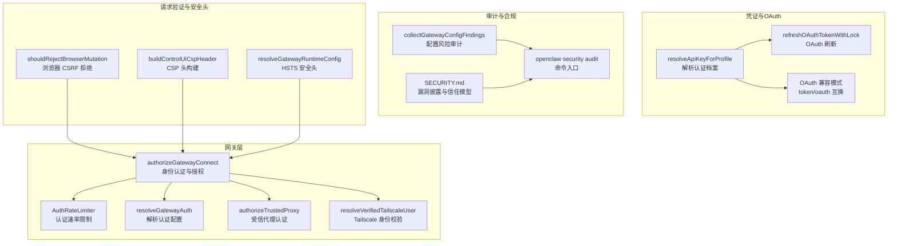
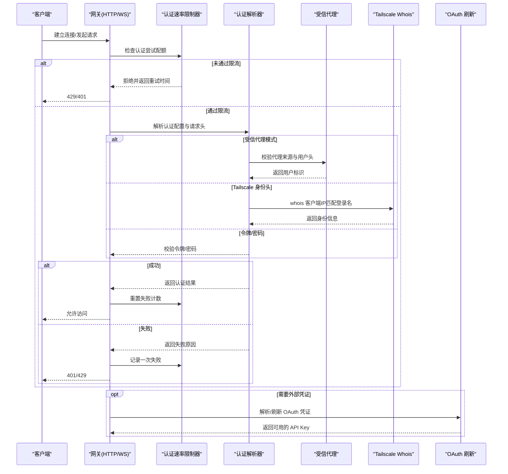
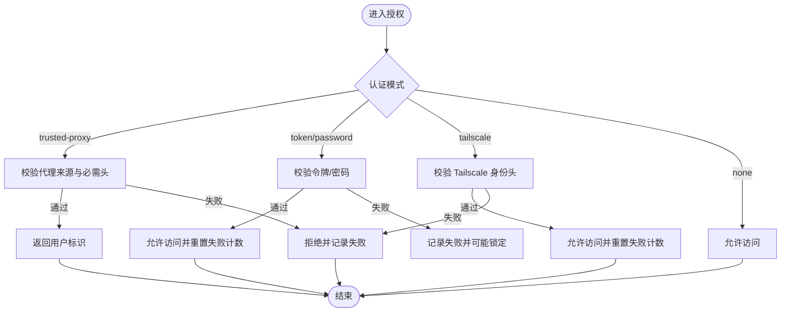
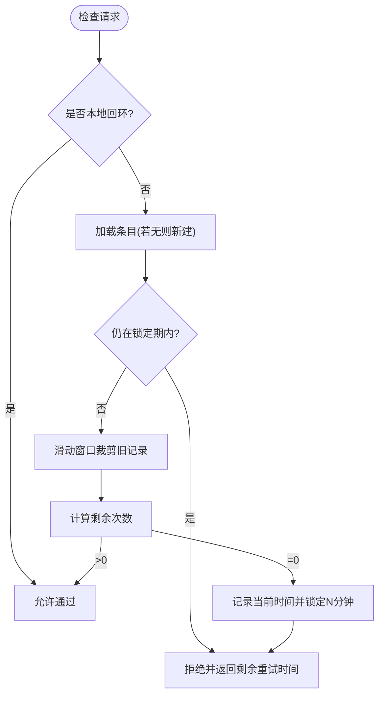
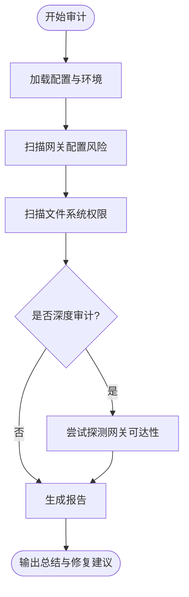
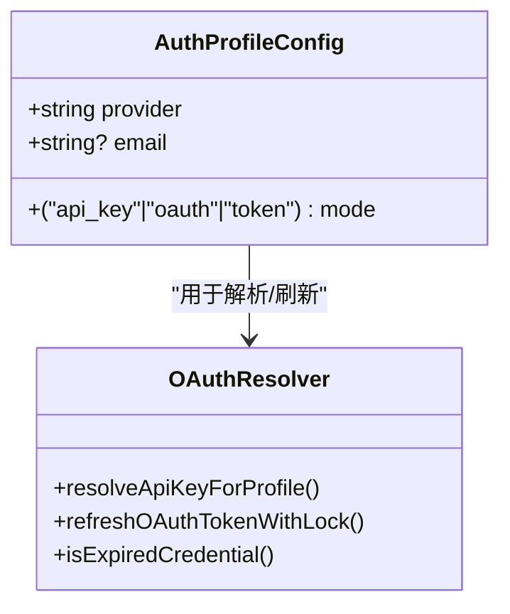
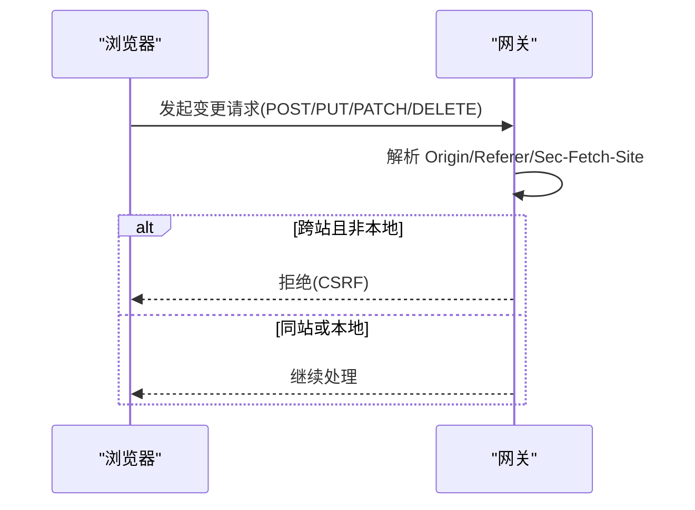
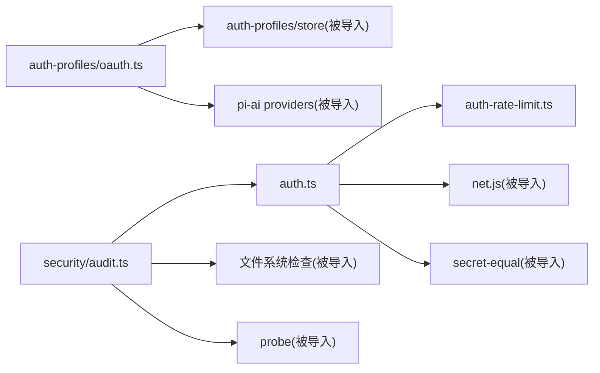

# 网关安全机制

<cite>
**本文引用的文件**
- [src/gateway/auth.ts](file://src/gateway/auth.ts)
- [src/gateway/auth-rate-limit.ts](file://src/gateway/auth-rate-limit.ts)
- [src/security/audit.ts](file://src/security/audit.ts)
- [src/agents/auth-profiles/oauth.ts](file://src/agents/auth-profiles/oauth.ts)
- [src/config/types.auth.ts](file://src/config/types.auth.ts)
- [src/gateway/server-runtime-config.test.ts](file://src/gateway/server-runtime-config.test.ts)
- [src/gateway/control-ui-csp.ts](file://src/gateway/control-ui-csp.ts)
- [src/browser/csrf.ts](file://src/browser/csrf.ts)
- [docs/gateway/security/index.md](file://docs/gateway/security/index.md)
- [SECURITY.md](file://SECURITY.md)
</cite>

## 目录

1. [简介](#简介)
2. [项目结构](#项目结构)
3. [核心组件](#核心组件)
4. [架构总览](#架构总览)
5. [详细组件分析](#详细组件分析)
6. [依赖关系分析](#依赖关系分析)
7. [性能考量](#性能考量)
8. [故障排查指南](#故障排查指南)
9. [结论](#结论)
10. [附录](#附录)

## 简介

本文件系统化阐述 OpenClaw 网关的安全机制，覆盖身份认证、授权控制、访问审计、API 密钥与 OAuth 集成、速率限制与防滥用、请求验证与输入过滤、安全头设置、安全配置模板、威胁模型与合规、漏洞扫描与渗透测试指南，以及安全加固与事件响应流程。目标是帮助开发者在不牺牲可用性的前提下，构建可审计、可防御、可扩展的网关安全体系。

## 项目结构

围绕网关安全的关键模块包括：

- 身份认证与授权：网关连接认证、受信代理认证、Tailscale 身份头认证、共享密钥（令牌/密码）认证
- 速率限制与防滥用：基于滑动窗口的认证尝试限流、失败记录与锁定
- 访问审计：配置与部署风险扫描、文件权限检查、暴露面评估
- 凭证与 OAuth：认证档案存储、OAuth 刷新与兼容模式、过期处理
- 请求验证与安全头：浏览器 CSRF 检测、CSP 构建、HSTS 运行时配置
- 文档与策略：安全文档、信任模型、合规与漏洞披露政策

图示来源

- [src/gateway/auth.ts](file://src/gateway/auth.ts#L364-L487)
- [src/gateway/auth-rate-limit.ts](file://src/gateway/auth-rate-limit.ts#L95-L232)
- [src/security/audit.ts](file://src/security/audit.ts#L262-L551)
- [src/agents/auth-profiles/oauth.ts](file://src/agents/auth-profiles/oauth.ts#L292-L455)
- [src/gateway/control-ui-csp.ts](file://src/gateway/control-ui-csp.ts#L1-L15)
- [src/browser/csrf.ts](file://src/browser/csrf.ts#L26-L55)
- [src/gateway/server-runtime-config.test.ts](file://src/gateway/server-runtime-config.test.ts#L252-L274)

章节来源

- [src/gateway/auth.ts](file://src/gateway/auth.ts#L1-L488)
- [src/gateway/auth-rate-limit.ts](file://src/gateway/auth-rate-limit.ts#L1-L233)
- [src/security/audit.ts](file://src/security/audit.ts#L1-L800)
- [src/agents/auth-profiles/oauth.ts](file://src/agents/auth-profiles/oauth.ts#L1-L456)
- [src/gateway/control-ui-csp.ts](file://src/gateway/control-ui-csp.ts#L1-L15)
- [src/browser/csrf.ts](file://src/browser/csrf.ts#L1-L55)
- [src/gateway/server-runtime-config.test.ts](file://src/gateway/server-runtime-config.test.ts#L252-L274)
- [docs/gateway/security/index.md](file://docs/gateway/security/index.md#L1-L800)
- [SECURITY.md](file://SECURITY.md#L1-L268)

## 核心组件

- 身份认证与授权
  - 支持模式：无认证、共享密钥（令牌/密码）、受信代理、Tailscale 身份头、默认令牌
  - 授权流程：解析认证配置、校验受信代理、Tailscale 身份核验、令牌/密码比对、成功后重置限流
- 认证速率限制
  - 滑动窗口计数、失败累计触发锁定、按作用域（共享密钥/设备令牌/钩子）隔离
  - 默认豁免本地回环地址，周期清理内存占用
- 访问审计
  - 配置风险扫描：绑定暴露、未配置认证、Control UI 未设置允许来源、mDNS 泄露等
  - 文件系统权限检查：状态目录、配置文件、凭据目录的可写/可读风险
  - 深度探测：对网关进行可达性与认证状态的最小化探测
- 凭证与 OAuth
  - 支持静态 API Key、Bearer Token、OAuth 三种模式；token/oauth 在路径上互换兼容
  - 自动刷新 OAuth 凭证，过期检测与降级回退策略
- 请求验证与安全头
  - 浏览器 CSRF 检测：基于 Origin/Referer/Sec-Fetch-Site 的跨站判断
  - CSP 构建：严格限制帧嵌入、脚本来源、样式内联范围
  - HSTS 设置：运行时根据配置决定是否注入 Strict-Transport-Security

章节来源

- [src/gateway/auth.ts](file://src/gateway/auth.ts#L216-L487)
- [src/gateway/auth-rate-limit.ts](file://src/gateway/auth-rate-limit.ts#L95-L232)
- [src/security/audit.ts](file://src/security/audit.ts#L262-L551)
- [src/agents/auth-profiles/oauth.ts](file://src/agents/auth-profiles/oauth.ts#L28-L102)
- [src/browser/csrf.ts](file://src/browser/csrf.ts#L26-L55)
- [src/gateway/control-ui-csp.ts](file://src/gateway/control-ui-csp.ts#L1-L15)
- [src/gateway/server-runtime-config.test.ts](file://src/gateway/server-runtime-config.test.ts#L252-L274)

## 架构总览

下图展示从客户端到网关的典型认证与授权流程，以及与审计、OAuth、安全头的交互位置。

图示来源

- [src/gateway/auth.ts](file://src/gateway/auth.ts#L364-L487)
- [src/gateway/auth-rate-limit.ts](file://src/gateway/auth-rate-limit.ts#L141-L204)
- [src/agents/auth-profiles/oauth.ts](file://src/agents/auth-profiles/oauth.ts#L292-L455)

## 详细组件分析

### 组件A：身份认证与授权

- 支持模式与优先级
  - 显式覆盖 > 配置 > 密码 > 令牌 > 默认令牌
  - Tailscale Serve 下默认允许使用身份头（仅限 WS Control UI 表面）
- 受信代理认证
  - 仅当代理地址在受信列表中且必需头存在时才放行
  - 可选用户白名单，避免代理认证用户泛化放行
- Tailscale 身份头认证
  - 通过本地 tailscale whois 校验 x-forwarded-for 与头中的登录名一致性
  - 仅在本地直连或受信代理注入的头环境下生效
- 令牌/密码认证
  - 使用恒等比较函数避免时序攻击
  - 成功后重置失败计数，失败则记录并可能触发锁定

图示来源

- [src/gateway/auth.ts](file://src/gateway/auth.ts#L364-L487)

章节来源

- [src/gateway/auth.ts](file://src/gateway/auth.ts#L216-L487)

### 组件B：认证速率限制（防暴力破解）

- 滑动窗口算法
  - 以 {作用域, 客户端IP} 为键，记录最近窗口内的失败时间戳
  - 达到阈值后进入锁定期，期间直接拒绝
- 作用域隔离
  - 共享密钥、设备令牌、钩子等独立计数，避免相互干扰
- 性能与内存
  - 默认豁免本地回环，避免开发体验受影响
  - 周期性清理空闲条目，防止 Map 无限增长

图示来源

- [src/gateway/auth-rate-limit.ts](file://src/gateway/auth-rate-limit.ts#L141-L218)

章节来源

- [src/gateway/auth-rate-limit.ts](file://src/gateway/auth-rate-limit.ts#L1-L233)

### 组件C：访问审计与合规

- 配置风险扫描
  - 绑定非 loopback 但未配置认证、Control UI 缺少允许来源、mDNS full 模式泄露信息等
  - 受信代理模式需严格限定代理 IP，缺失 userHeader 或 allowUsers 会警告
- 文件系统权限
  - 状态目录、配置文件、凭据目录的可写/可读风险分级提示
- 深度探测
  - 对网关进行最小化探测，记录可达性、认证状态与关闭原因

图示来源

- [src/security/audit.ts](file://src/security/audit.ts#L262-L551)

章节来源

- [src/security/audit.ts](file://src/security/audit.ts#L1-L800)

### 组件D：API 密钥管理与 OAuth 集成

- 模式兼容
  - token 与 oauth 在路径上互换兼容，便于迁移
- 凭证解析
  - 支持静态 API Key、Bearer Token 与 OAuth；支持密钥引用与缓存解析
- OAuth 刷新与过期
  - 过期前自动刷新；失败时尝试主代理凭证继承、降级回退与医生提示
- 配置类型
  - 定义了认证档案的 provider、mode、email 等字段

图示来源

- [src/config/types.auth.ts](file://src/config/types.auth.ts#L1-L29)
- [src/agents/auth-profiles/oauth.ts](file://src/agents/auth-profiles/oauth.ts#L292-L455)

章节来源

- [src/config/types.auth.ts](file://src/config/types.auth.ts#L1-L29)
- [src/agents/auth-profiles/oauth.ts](file://src/agents/auth-profiles/oauth.ts#L1-L456)

### 组件E：请求验证与安全头

- 浏览器 CSRF 拒绝
  - 基于 Sec-Fetch-Site、Origin、Referer 判断跨站请求，对变更类方法进行拦截
- CSP 构建
  - 控制 UI 使用严格 CSP：禁止框架嵌入、限制脚本来源、允许必要样式内联与 ws/wss 连接
- HSTS 安全头
  - 运行时根据配置决定是否注入 Strict-Transport-Security，避免在 loopback 场景误设

图示来源

- [src/browser/csrf.ts](file://src/browser/csrf.ts#L26-L55)
- [src/gateway/control-ui-csp.ts](file://src/gateway/control-ui-csp.ts#L1-L15)
- [src/gateway/server-runtime-config.test.ts](file://src/gateway/server-runtime-config.test.ts#L252-L274)

章节来源

- [src/browser/csrf.ts](file://src/browser/csrf.ts#L1-L55)
- [src/gateway/control-ui-csp.ts](file://src/gateway/control-ui-csp.ts#L1-L15)
- [src/gateway/server-runtime-config.test.ts](file://src/gateway/server-runtime-config.test.ts#L252-L274)

## 依赖关系分析

- 组件耦合
  - 授权模块依赖速率限制器、网络工具与安全比较函数
  - OAuth 解析器依赖凭证存储、锁机制与提供商能力
  - 审计模块依赖配置解析、文件系统检查与探测工具
- 外部依赖
  - Tailscale 服务用于身份核验
  - 反向代理（如 Pomerium/Caddy/Nginx）用于受信代理模式
- 潜在循环
  - 当前模块间为单向依赖，未见循环导入

图示来源

- [src/gateway/auth.ts](file://src/gateway/auth.ts#L1-L30)
- [src/gateway/auth-rate-limit.ts](file://src/gateway/auth-rate-limit.ts#L19-L20)
- [src/agents/auth-profiles/oauth.ts](file://src/agents/auth-profiles/oauth.ts#L1-L18)
- [src/security/audit.ts](file://src/security/audit.ts#L1-L52)

章节来源

- [src/gateway/auth.ts](file://src/gateway/auth.ts#L1-L40)
- [src/gateway/auth-rate-limit.ts](file://src/gateway/auth-rate-limit.ts#L1-L20)
- [src/agents/auth-profiles/oauth.ts](file://src/agents/auth-profiles/oauth.ts#L1-L18)
- [src/security/audit.ts](file://src/security/audit.ts#L1-L52)

## 性能考量

- 认证速率限制
  - 内存中 Map 存储，定期清理避免膨胀；默认豁免本地回环降低开发影响
- OAuth 刷新
  - 文件锁保护存储更新，避免并发冲突；过期前刷新减少失败率
- 审计扫描
  - 深度探测为可选，建议在维护窗口执行，避免对生产流量造成影响

## 故障排查指南

- 常见问题定位
  - 401/429：检查令牌/密码是否正确、是否被限流；查看速率限制器剩余次数与重试时间
  - 受信代理认证失败：确认代理 IP 是否在 trustedProxies 中、userHeader 是否配置、allowUsers 白名单是否正确
  - Tailscale 身份头无效：确认请求来自 loopback 且携带正确的转发头；检查 whois 结果与登录名匹配
  - Control UI 无法访问：检查 allowedOrigins 是否配置、是否启用危险选项（如 Host Header Origin Fallback）
- 审计与修复
  - 使用 `openclaw security audit --fix` 自动修复可修复项（如权限、HSTS）
  - 关注关键 checkId：如 `gateway.bind_no_auth`、`gateway.control_ui.allowed_origins_required`、`fs.config.perms_world_readable`

章节来源

- [src/gateway/auth.ts](file://src/gateway/auth.ts#L364-L487)
- [src/gateway/auth-rate-limit.ts](file://src/gateway/auth-rate-limit.ts#L141-L204)
- [src/security/audit.ts](file://src/security/audit.ts#L262-L551)
- [docs/gateway/security/index.md](file://docs/gateway/security/index.md#L26-L37)

## 结论

OpenClaw 网关安全机制以“访问控制优先”为核心，结合受信代理、Tailscale 身份头、共享密钥认证与速率限制，形成多层次的边界保护。配合严格的 CSP、HSTS 与全面的审计扫描，能够在个人助理场景下实现可审计、可防御、可扩展的安全基线。建议在生产环境中默认启用令牌认证、严格控制暴露面、最小化工具集与沙箱策略，并定期运行安全审计。

## 附录

### 安全配置模板（示例）

- 硬化基线（本地 loopback + 强令牌）
  - gateway.bind: "loopback"
  - gateway.auth.mode: "token"
  - gateway.auth.token: "长随机令牌"
  - session.dmScope: "per-channel-peer"
  - tools.profile: "messaging"
  - tools.deny: ["group:automation","group:runtime","group:fs","sessions_spawn","sessions_send"]
  - tools.fs.workspaceOnly: true
  - tools.exec.security: "deny"
  - tools.elevated.enabled: false
  - channels.<platform>.dmPolicy: "pairing"
- 受信代理模式（反向代理 + TLS）
  - gateway.auth.mode: "trusted-proxy"
  - gateway.auth.trustedProxy.userHeader: "X-Forwarded-User"
  - gateway.trustedProxies: ["127.0.0.1"]
  - gateway.allowRealIpFallback: false
- Tailscale Serve（本地身份头）
  - gateway.auth.allowTailscale: true
  - gateway.bind: "loopback"
  - gateway.auth.mode: "token"（或 Serve 身份头）

章节来源

- [docs/gateway/security/index.md](file://docs/gateway/security/index.md#L145-L173)
- [docs/gateway/security/index.md](file://docs/gateway/security/index.md#L311-L343)
- [docs/gateway/security/index.md](file://docs/gateway/security/index.md#L715-L742)

### 威胁模型与合规

- 信任模型
  - 个人助理模型：单个受信任操作者边界，不假设多租户隔离
  - 节点与网关视为同一信任域，节点配对后具备远程执行能力
- 合规与披露
  - 漏洞披露渠道与要求、报告接受门槛、常见误报与范围外情形
  - 运维指引：Node.js 版本要求、Docker 安全运行建议、detect-secrets 秘密扫描

章节来源

- [SECURITY.md](file://SECURITY.md#L84-L123)
- [SECURITY.md](file://SECURITY.md#L195-L225)
- [SECURITY.md](file://SECURITY.md#L226-L268)

### 渗透测试与安全扫描指南

- 扫描工具
  - detect-secrets：CI/CD 中的自动化秘密检测
- 扫描步骤
  - 本地运行 detect-secrets scan 并基于基线 .secrets.baseline
  - 使用 `openclaw security audit --deep` 进行深度探测
- 渗透测试要点
  - 重点验证：受信代理头部注入、X-Real-IP 源 IP 伪造、Control UI CORS/Origin 攻击面、HSTS 配置、OAuth 凭证泄露路径
  - 遵循 Out of Scope 与报告门槛，确保边界绕过证据链完整

章节来源

- [SECURITY.md](file://SECURITY.md#L257-L268)
- [src/security/audit.ts](file://src/security/audit.ts#L262-L551)

### 开发者安全加固建议

- 最小权限原则：默认禁用高危工具，仅在受控代理上启用
- 严格暴露面：优先 loopback 绑定，需要远程访问时使用受信代理或 Tailscale
- 凭证管理：使用密钥引用与文件锁保护，定期轮换令牌/密码
- 日志与审计：开启工具摘要脱敏、定期清理会话日志与审计报告
- 安全头：CSP 严格、HSTS 注入、CSRF 拦截

章节来源

- [docs/gateway/security/index.md](file://docs/gateway/security/index.md#L584-L794)
- [src/gateway/control-ui-csp.ts](file://src/gateway/control-ui-csp.ts#L1-L15)
- [src/browser/csrf.ts](file://src/browser/csrf.ts#L26-L55)

### 安全事件响应流程

- 快速处置
  - 立即轮换令牌/密码，阻断已知泄露凭证
  - 检查受信代理配置与 allowUsers 白名单
  - 临时收紧 allowedOrigins 与 HSTS 策略
- 调查与取证
  - 审计日志与会话转储（注意脱敏）
  - 检查 OAuth 凭证刷新与过期时间
- 修复与复盘
  - 应用 --fix 修复可自动修复项
  - 更新安全策略与培训，发布补丁与通告

章节来源

- [SECURITY.md](file://SECURITY.md#L33-L47)
- [src/security/audit.ts](file://src/security/audit.ts#L262-L551)
