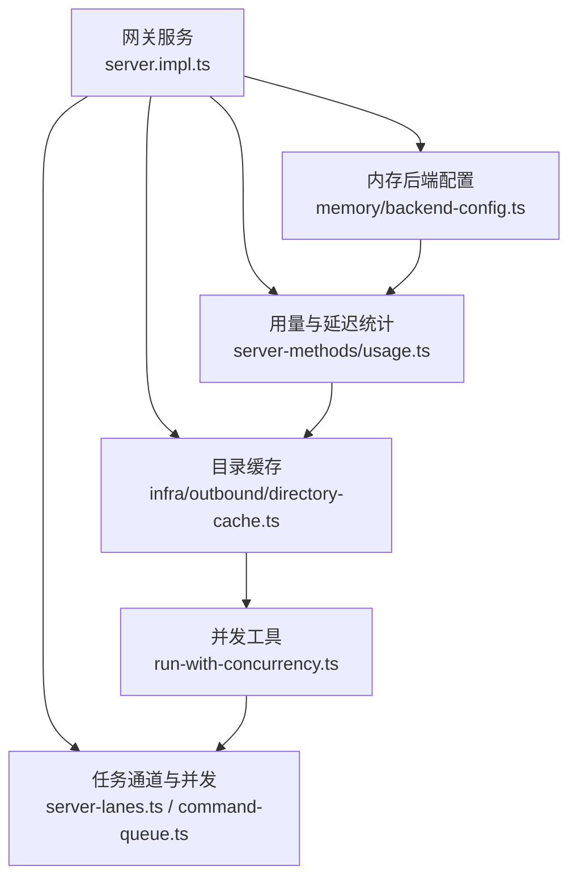
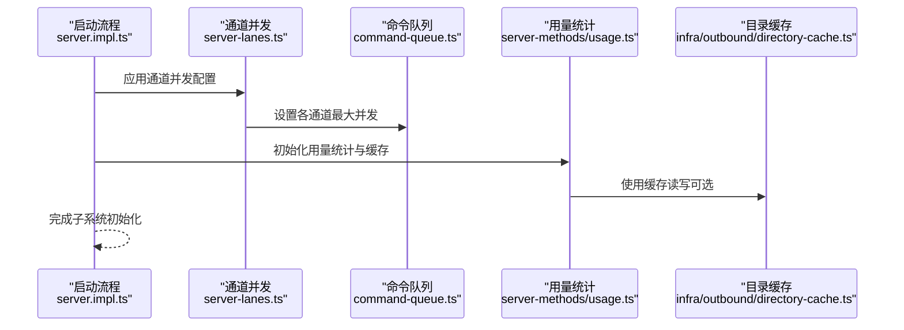
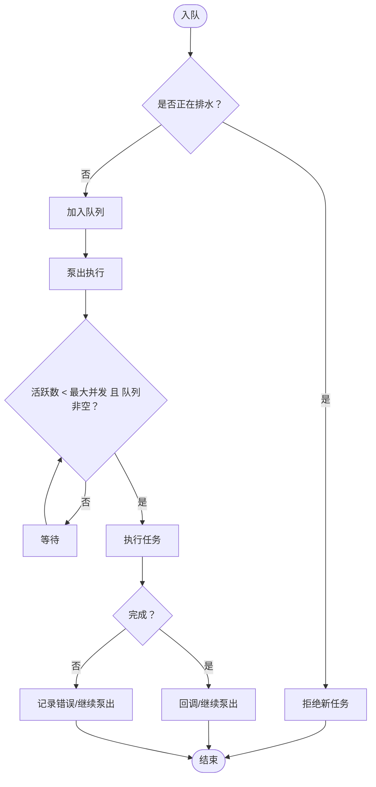
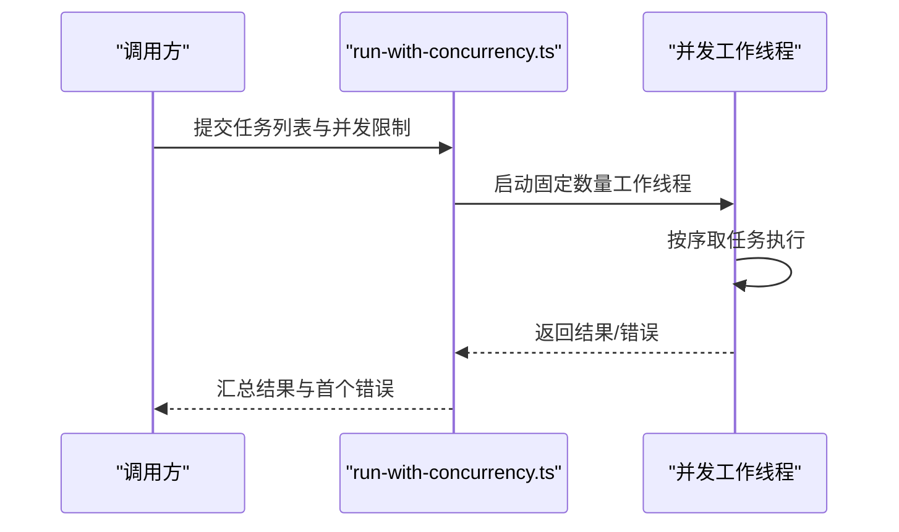
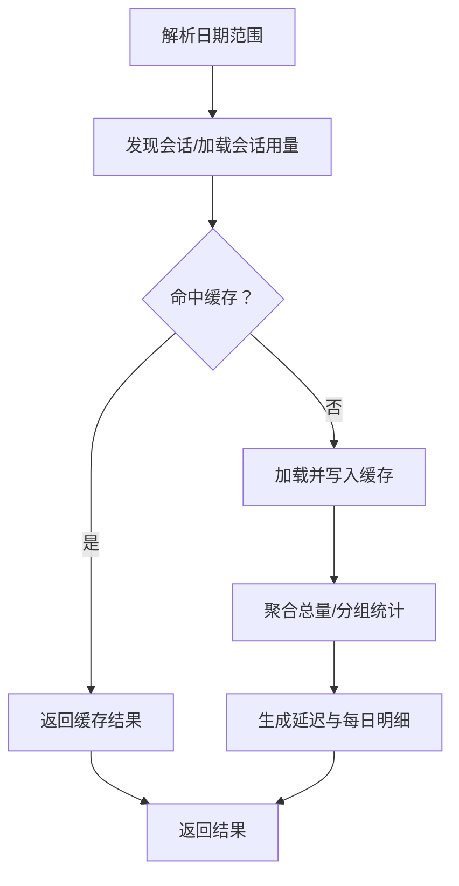
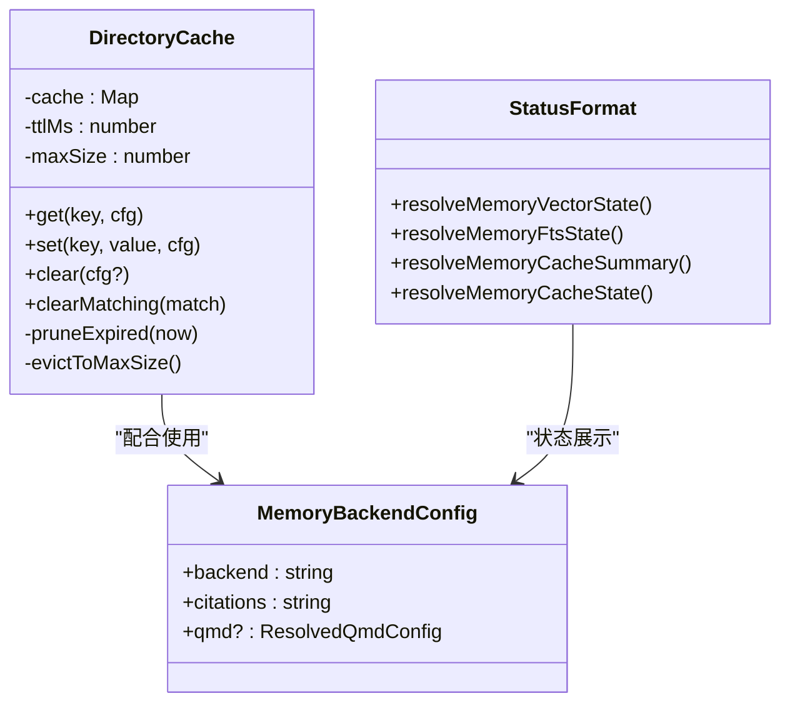
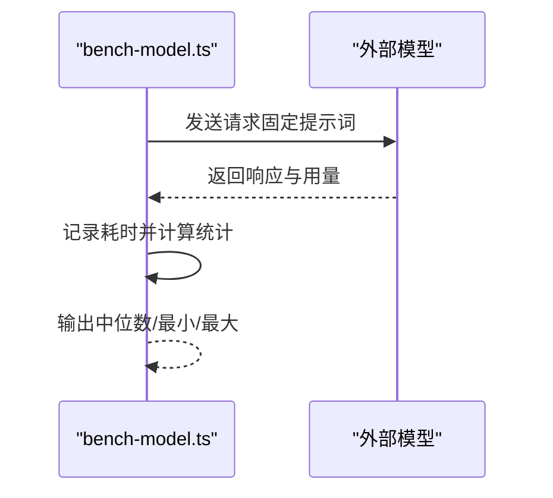
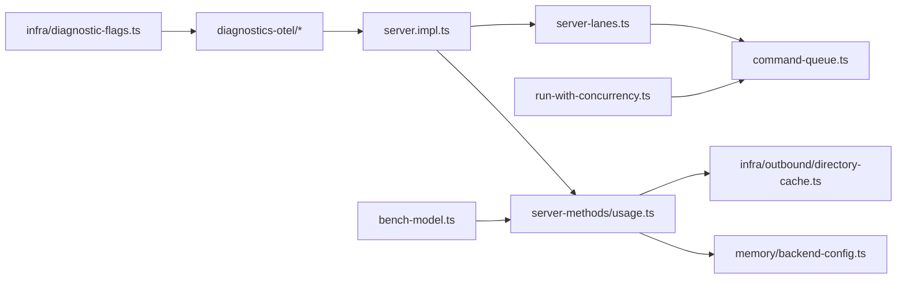

# 网关性能优化

<cite>
**本文引用的文件**
- [src/gateway/server.impl.ts](file://src/gateway/server.impl.ts)
- [src/gateway/server-lanes.ts](file://src/gateway/server-lanes.ts)
- [src/process/command-queue.ts](file://src/process/command-queue.ts)
- [src/utils/run-with-concurrency.ts](file://src/utils/run-with-concurrency.ts)
- [src/gateway/server-methods/usage.ts](file://src/gateway/server-methods/usage.ts)
- [src/infra/outbound/directory-cache.ts](file://src/infra/outbound/directory-cache.ts)
- [src/config/cache-utils.ts](file://src/config/cache-utils.ts)
- [src/agents/tools/web-shared.ts](file://src/agents/tools/web-shared.ts)
- [src/memory/backend-config.ts](file://src/memory/backend-config.ts)
- [src/memory/status-format.ts](file://src/memory/status-format.ts)
- [scripts/bench-model.ts](file://scripts/bench-model.ts)
- [extensions/diagnostics-otel/src/service.ts](file://extensions/diagnostics-otel/src/service.ts)
- [extensions/diagnostics-otel/index.ts](file://extensions/diagnostics-otel/index.ts)
- [src/infra/diagnostic-flags.ts](file://src/infra/diagnostic-flags.ts)
- [scripts/test-parallel.mjs](file://scripts/test-parallel.mjs)
</cite>

## 目录

1. [简介](#简介)
2. [项目结构](#项目结构)
3. [核心组件](#核心组件)
4. [架构总览](#架构总览)
5. [详细组件分析](#详细组件分析)
6. [依赖关系分析](#依赖关系分析)
7. [性能考量](#性能考量)
8. [故障排查指南](#故障排查指南)
9. [结论](#结论)
10. [附录](#附录)

## 简介

本技术文档面向OpenClaw网关的性能优化，聚焦于性能监控指标、瓶颈识别与优化策略，覆盖内存使用优化、CPU利用率提升、网络延迟降低等关键方向；同时系统阐述并发处理模型、资源池管理、异步编程模式，以及缓存策略、预取与懒加载优化。文档还提供性能基准测试、压力测试与容量规划指南，并给出性能分析工具使用方法与调优参数建议，帮助开发者建立完善的性能监控与问题诊断体系。

## 项目结构

围绕网关性能优化的相关模块主要分布在以下路径：

- 网关启动与运行时：gateway/server.\*、process/command-queue.ts、gateway/server-lanes.ts
- 性能数据采集与聚合：gateway/server-methods/usage.ts
- 缓存与内存：infra/outbound/directory-cache.ts、config/cache-utils.ts、agents/tools/web-shared.ts、memory/backend-config.ts、memory/status-format.ts
- 并发控制与限流：utils/run-with-concurrency.ts、process/command-queue.ts
- 基准与测试：scripts/bench-model.ts、scripts/test-parallel.mjs
- 诊断与可观测性：extensions/diagnostics-otel/\*、infra/diagnostic-flags.ts

图表来源

- [src/gateway/server.impl.ts](file://src/gateway/server.impl.ts#L1-L200)
- [src/gateway/server-lanes.ts](file://src/gateway/server-lanes.ts#L1-L11)
- [src/process/command-queue.ts](file://src/process/command-queue.ts#L1-L325)
- [src/gateway/server-methods/usage.ts](file://src/gateway/server-methods/usage.ts#L1-L945)
- [src/infra/outbound/directory-cache.ts](file://src/infra/outbound/directory-cache.ts#L1-L99)
- [src/memory/backend-config.ts](file://src/memory/backend-config.ts#L1-L355)
- [src/utils/run-with-concurrency.ts](file://src/utils/run-with-concurrency.ts#L1-L49)

章节来源

- [src/gateway/server.impl.ts](file://src/gateway/server.impl.ts#L1-L200)
- [src/gateway/server-lanes.ts](file://src/gateway/server-lanes.ts#L1-L11)
- [src/process/command-queue.ts](file://src/process/command-queue.ts#L1-L325)
- [src/gateway/server-methods/usage.ts](file://src/gateway/server-methods/usage.ts#L1-L945)
- [src/infra/outbound/directory-cache.ts](file://src/infra/outbound/directory-cache.ts#L1-L99)
- [src/memory/backend-config.ts](file://src/memory/backend-config.ts#L1-L355)
- [src/utils/run-with-concurrency.ts](file://src/utils/run-with-concurrency.ts#L1-L49)

## 核心组件

- 网关服务器与并发通道
  - 启动流程与子系统初始化在网关实现中完成，包括通道健康监控、插件加载、定时任务、TLS与暴露配置等。
  - 通过“通道（Lane）”模型对不同类型的命令进行隔离与并发限制，避免主工作流被其他任务干扰。
- 命令队列与通道调度
  - 提供统一的任务入队、出队、并发上限、排队等待告警、重启前清理等能力，支持多通道并行执行。
- 并发控制工具
  - 提供通用的并发执行器，支持错误模式（继续/停止）、回调钩子与结果收集，便于批量任务的可控并发。
- 性能数据采集与聚合
  - 聚合会话成本、消息计数、工具调用、模型用量、延迟统计与每日明细，支持缓存与增量聚合，减少重复计算。
- 缓存与内存
  - 目录缓存按键值与TTL管理，支持最大容量淘汰与配置变更重置；内存后端配置含搜索模式、更新超时、嵌入与检索限制等参数，直接影响性能与延迟。
- 基准与测试
  - 提供模型基准脚本与并行测试脚本，用于评估不同模型与并发下的吞吐与延迟表现。

章节来源

- [src/gateway/server.impl.ts](file://src/gateway/server.impl.ts#L1-L200)
- [src/gateway/server-lanes.ts](file://src/gateway/server-lanes.ts#L1-L11)
- [src/process/command-queue.ts](file://src/process/command-queue.ts#L1-L325)
- [src/utils/run-with-concurrency.ts](file://src/utils/run-with-concurrency.ts#L1-L49)
- [src/gateway/server-methods/usage.ts](file://src/gateway/server-methods/usage.ts#L1-L945)
- [src/infra/outbound/directory-cache.ts](file://src/infra/outbound/directory-cache.ts#L1-L99)
- [src/memory/backend-config.ts](file://src/memory/backend-config.ts#L1-L355)
- [scripts/bench-model.ts](file://scripts/bench-model.ts#L1-L147)
- [scripts/test-parallel.mjs](file://scripts/test-parallel.mjs#L208-L243)

## 架构总览

下图展示网关在启动阶段的关键初始化流程与并发通道设置，以及用量统计与缓存的交互关系。

图表来源

- [src/gateway/server.impl.ts](file://src/gateway/server.impl.ts#L1-L200)
- [src/gateway/server-lanes.ts](file://src/gateway/server-lanes.ts#L1-L11)
- [src/process/command-queue.ts](file://src/process/command-queue.ts#L1-L325)
- [src/gateway/server-methods/usage.ts](file://src/gateway/server-methods/usage.ts#L1-L945)
- [src/infra/outbound/directory-cache.ts](file://src/infra/outbound/directory-cache.ts#L1-L99)

## 详细组件分析

### 组件A：并发通道与命令队列

- 设计要点
  - 多通道隔离：将“主工作流”“子代理”“定时任务”等划分到不同通道，避免相互阻塞。
  - 动态并发：根据配置动态调整通道并发度，入队后自动驱动执行。
  - 等待告警：对长时间排队的任务发出诊断日志，便于定位瓶颈。
  - 清理与重启：支持通道清理与重启过程中的“排水”保护，避免任务丢失或悬挂。
- 性能影响
  - 合理设置通道并发可提升吞吐；过小导致排队，过大可能引发上下文切换与资源争用。
  - 队列长度与等待阈值直接影响用户体验与资源占用。

图表来源

- [src/process/command-queue.ts](file://src/process/command-queue.ts#L1-L325)

章节来源

- [src/process/command-queue.ts](file://src/process/command-queue.ts#L1-L325)
- [src/gateway/server-lanes.ts](file://src/gateway/server-lanes.ts#L1-L11)

### 组件B：并发控制工具

- 设计要点
  - 支持批量任务并发执行，限制并发度，提供错误模式与回调。
  - 返回结果数组与首个错误信息，便于快速失败或汇总处理。
- 性能影响
  - 合理的并发度与错误模式可显著提升批量任务的吞吐与稳定性。

图表来源

- [src/utils/run-with-concurrency.ts](file://src/utils/run-with-concurrency.ts#L1-L49)

章节来源

- [src/utils/run-with-concurrency.ts](file://src/utils/run-with-concurrency.ts#L1-L49)

### 组件C：用量统计与延迟聚合

- 设计要点
  - 支持按日期范围、模式与UTC偏移解析，构建时间窗口。
  - 对会话用量进行聚合，包括消息计数、工具调用、模型用量、延迟统计与每日明细。
  - 内置缓存（TTL）避免重复计算，支持“飞行中”去重。
- 性能影响
  - 缓存与增量聚合显著降低磁盘扫描与计算开销；合理TTL平衡实时性与性能。

图表来源

- [src/gateway/server-methods/usage.ts](file://src/gateway/server-methods/usage.ts#L1-L945)

章节来源

- [src/gateway/server-methods/usage.ts](file://src/gateway/server-methods/usage.ts#L1-L945)

### 组件D：缓存与内存后端

- 目录缓存
  - 键由通道、账号、条目类型、来源与签名组成，支持TTL与最大容量淘汰。
  - 配置变更时清空缓存，确保一致性。
- 内存后端配置
  - 包含搜索模式、更新间隔、命令/更新/嵌入超时、查询限制等，直接影响延迟与资源占用。
- 内存状态格式化
  - 将向量可用性、全文检索可用性与缓存状态转换为可视化状态，辅助诊断。

图表来源

- [src/infra/outbound/directory-cache.ts](file://src/infra/outbound/directory-cache.ts#L1-L99)
- [src/memory/backend-config.ts](file://src/memory/backend-config.ts#L1-L355)
- [src/memory/status-format.ts](file://src/memory/status-format.ts#L1-L45)

章节来源

- [src/infra/outbound/directory-cache.ts](file://src/infra/outbound/directory-cache.ts#L1-L99)
- [src/config/cache-utils.ts](file://src/config/cache-utils.ts#L1-L27)
- [src/agents/tools/web-shared.ts](file://src/agents/tools/web-shared.ts#L1-L39)
- [src/memory/backend-config.ts](file://src/memory/backend-config.ts#L1-L355)
- [src/memory/status-format.ts](file://src/memory/status-format.ts#L1-L45)

### 组件E：基准测试与并行测试

- 模型基准
  - 提供简单提示词与多次运行，输出中位数/最小/最大耗时，便于对比不同模型与配置。
- 并行测试
  - 根据主机负载动态调整并行度，避免极端高负载下的抖动与失败。

图表来源

- [scripts/bench-model.ts](file://scripts/bench-model.ts#L1-L147)

章节来源

- [scripts/bench-model.ts](file://scripts/bench-model.ts#L1-L147)
- [scripts/test-parallel.mjs](file://scripts/test-parallel.mjs#L208-L243)

## 依赖关系分析

- 网关启动依赖通道并发配置与命令队列；用量统计依赖缓存与会话存储；内存后端配置影响查询与更新行为；并发工具为批量任务提供统一并发控制；基准与测试脚本为性能评估提供量化依据。
- 诊断扩展通过OpenTelemetry导出事件，结合诊断标志与环境变量启用/过滤。

图表来源

- [src/gateway/server.impl.ts](file://src/gateway/server.impl.ts#L1-L200)
- [src/gateway/server-lanes.ts](file://src/gateway/server-lanes.ts#L1-L11)
- [src/process/command-queue.ts](file://src/process/command-queue.ts#L1-L325)
- [src/gateway/server-methods/usage.ts](file://src/gateway/server-methods/usage.ts#L1-L945)
- [src/infra/outbound/directory-cache.ts](file://src/infra/outbound/directory-cache.ts#L1-L99)
- [src/memory/backend-config.ts](file://src/memory/backend-config.ts#L1-L355)
- [src/utils/run-with-concurrency.ts](file://src/utils/run-with-concurrency.ts#L1-L49)
- [scripts/bench-model.ts](file://scripts/bench-model.ts#L1-L147)
- [extensions/diagnostics-otel/src/service.ts](file://extensions/diagnostics-otel/src/service.ts#L71-L101)
- [src/infra/diagnostic-flags.ts](file://src/infra/diagnostic-flags.ts#L1-L51)

章节来源

- [src/gateway/server.impl.ts](file://src/gateway/server.impl.ts#L1-L200)
- [src/gateway/server-lanes.ts](file://src/gateway/server-lanes.ts#L1-L11)
- [src/process/command-queue.ts](file://src/process/command-queue.ts#L1-L325)
- [src/gateway/server-methods/usage.ts](file://src/gateway/server-methods/usage.ts#L1-L945)
- [src/infra/outbound/directory-cache.ts](file://src/infra/outbound/directory-cache.ts#L1-L99)
- [src/memory/backend-config.ts](file://src/memory/backend-config.ts#L1-L355)
- [src/utils/run-with-concurrency.ts](file://src/utils/run-with-concurrency.ts#L1-L49)
- [scripts/bench-model.ts](file://scripts/bench-model.ts#L1-L147)
- [extensions/diagnostics-otel/src/service.ts](file://extensions/diagnostics-otel/src/service.ts#L71-L101)
- [src/infra/diagnostic-flags.ts](file://src/infra/diagnostic-flags.ts#L1-L51)

## 性能考量

- 内存使用优化
  - 目录缓存采用TTL与容量淘汰，避免无限增长；配置变更时清空缓存，保证一致性。
  - 内存后端配置中的搜索模式、超时与注入限制直接影响内存占用与延迟，应结合场景选择合适策略。
- CPU利用率提升
  - 使用通道隔离与并发控制，避免主工作流被阻塞；并发工具支持批量任务的可控并发。
  - 并行测试脚本根据系统负载动态调整并行度，减少高负载下的抖动。
- 网络延迟降低
  - 用量统计使用缓存与增量聚合，减少重复计算与I/O。
  - 诊断扩展支持OpenTelemetry导出，便于定位网络与外部服务延迟瓶颈。
- 缓存策略
  - 目录缓存键包含来源与签名，支持“缓存/实时”区分；提供显式清理与匹配清理接口。
  - 工具共享缓存提供TTL与最大条目限制，避免热点失效导致的抖动。
- 预取与懒加载
  - 用量统计在特定键请求时跳过全量目录扫描，优先使用存储映射，提高响应速度。
  - 目录缓存按需获取并刷新插入顺序，降低淘汰概率。
- 并发处理模型
  - 多通道并发与动态调整，结合等待告警与重启排水保护，提升稳定性与可观测性。
- 异步编程模式
  - 命令队列与并发工具均基于Promise，支持错误回调与批量结果汇总，便于异步编排。

章节来源

- [src/infra/outbound/directory-cache.ts](file://src/infra/outbound/directory-cache.ts#L1-L99)
- [src/config/cache-utils.ts](file://src/config/cache-utils.ts#L1-L27)
- [src/agents/tools/web-shared.ts](file://src/agents/tools/web-shared.ts#L1-L39)
- [src/memory/backend-config.ts](file://src/memory/backend-config.ts#L1-L355)
- [src/gateway/server-methods/usage.ts](file://src/gateway/server-methods/usage.ts#L1-L945)
- [src/utils/run-with-concurrency.ts](file://src/utils/run-with-concurrency.ts#L1-L49)
- [scripts/test-parallel.mjs](file://scripts/test-parallel.mjs#L208-L243)
- [extensions/diagnostics-otel/src/service.ts](file://extensions/diagnostics-otel/src/service.ts#L71-L101)

## 故障排查指南

- 通道与队列
  - 若出现长时间排队，检查通道并发配置与任务类型；关注等待告警日志以定位瓶颈。
  - 重启过程中若任务被拒绝，确认排水保护逻辑是否生效。
- 用量统计
  - 若统计结果异常或延迟过高，检查缓存TTL与飞行中去重逻辑；必要时清理缓存后重试。
- 诊断与可观测性
  - 通过诊断标志与环境变量启用/过滤诊断事件；OpenTelemetry导出配置需与协议一致。
- 并发与资源
  - 批量任务失败时，检查并发限制与错误模式；根据系统负载动态调整并行度。

章节来源

- [src/process/command-queue.ts](file://src/process/command-queue.ts#L1-L325)
- [src/gateway/server-methods/usage.ts](file://src/gateway/server-methods/usage.ts#L1-L945)
- [src/infra/diagnostic-flags.ts](file://src/infra/diagnostic-flags.ts#L1-L51)
- [extensions/diagnostics-otel/src/service.ts](file://extensions/diagnostics-otel/src/service.ts#L71-L101)

## 结论

通过对网关并发通道、命令队列、用量统计与缓存体系的系统化优化，可在保证稳定性的同时显著提升吞吐与响应速度。结合基准测试与可观测性工具，能够持续评估与改进性能表现。建议在生产环境中根据实际负载动态调整并发与缓存策略，并定期进行容量规划与回归测试。

## 附录

- 性能基准测试
  - 使用模型基准脚本对比不同模型与提示词下的延迟分布，作为容量规划与参数调优的基础。
- 压力测试与容量规划
  - 利用并行测试脚本模拟高负载场景，观察系统在不同并发度下的表现，确定最优并发上限与资源配额。
- 调优参数建议
  - 通道并发：根据任务类型与资源情况分通道设置，避免主通道被阻塞。
  - 缓存TTL：在实时性与性能间权衡，热点场景适当缩短TTL。
  - 内存后端：优先选择适合交互场景的搜索模式，必要时放宽注入限制。
  - 诊断与导出：开启必要的诊断标志与OpenTelemetry导出，以便快速定位问题。

章节来源

- [scripts/bench-model.ts](file://scripts/bench-model.ts#L1-L147)
- [scripts/test-parallel.mjs](file://scripts/test-parallel.mjs#L208-L243)
- [src/gateway/server-lanes.ts](file://src/gateway/server-lanes.ts#L1-L11)
- [src/infra/outbound/directory-cache.ts](file://src/infra/outbound/directory-cache.ts#L1-L99)
- [src/memory/backend-config.ts](file://src/memory/backend-config.ts#L1-L355)
- [extensions/diagnostics-otel/src/service.ts](file://extensions/diagnostics-otel/src/service.ts#L71-L101)
