# 网关架构设计

<cite>
**本文引用的文件**
- [src/gateway/server.impl.ts](file://src/gateway/server.impl.ts)
- [src/gateway/server.ts](file://src/gateway/server.ts)
- [src/gateway/server/http-listen.ts](file://src/gateway/server/http-listen.ts)
- [src/gateway/server/close-reason.ts](file://src/gateway/server/close-reason.ts)
- [src/gateway/server-plugins.ts](file://src/gateway/server-plugins.ts)
- [src/gateway/server-channels.ts](file://src/gateway/server-channels.ts)
- [src/gateway/server-ws-runtime.ts](file://src/gateway/server-ws-runtime.ts)
- [src/gateway/server-runtime-config.ts](file://src/gateway/server-runtime-config.ts)
- [src/gateway/server-runtime-state.ts](file://src/gateway/server-runtime-state.ts)
- [src/gateway/server-discovery-runtime.ts](file://src/gateway/server-discovery-runtime.ts)
- [src/gateway/server-tailscale.ts](file://src/gateway/server-tailscale.ts)
- [src/gateway/server-cron.ts](file://src/gateway/server-cron.ts)
- [src/gateway/server-maintenance.ts](file://src/gateway/server-maintenance.ts)
- [src/gateway/server-methods.ts](file://src/gateway/server-methods.ts)
- [src/gateway/server-methods-list.ts](file://src/gateway/server-methods-list.ts)
- [src/gateway/server-startup-log.ts](file://src/gateway/server-startup-log.ts)
- [src/gateway/server-startup.ts](file://src/gateway/server-startup.ts)
- [src/gateway/server-browser.ts](file://src/gateway/server-browser.ts)
- [src/gateway/server-model-catalog.ts](file://src/gateway/server-model-catalog.ts)
- [src/gateway/server-node-subscriptions.ts](file://src/gateway/server-node-subscriptions.ts)
- [src/gateway/node-registry.ts](file://src/gateway/node-registry.ts)
- [src/gateway/auth.ts](file://src/gateway/auth.ts)
- [src/gateway/auth-rate-limit.ts](file://src/gateway/auth-rate-limit.ts)
- [src/gateway/startup-auth.ts](file://src/gateway/startup-auth.ts)
- [src/gateway/channel-health-monitor.ts](file://src/gateway/channel-health-monitor.ts)
- [src/gateway/exec-approval-manager.ts](file://src/gateway/exec-approval-manager.ts)
- [src/gateway/server-reload-handlers.ts](file://src/gateway/server-reload-handlers.ts)
- [src/gateway/server-session-key.ts](file://src/gateway/server-session-key.ts)
- [src/gateway/server-shared.ts](file://src/gateway/server-shared.ts)
- [src/gateway/server-utils.ts](file://src/gateway/server-utils.ts)
- [src/gateway/server-constants.ts](file://src/gateway/server-constants.ts)
- [src/gateway/server-http.ts](file://src/gateway/server-http.ts)
- [src/gateway/server-wizard-sessions.ts](file://src/gateway/server-wizard-sessions.ts)
- [src/gateway/control-ui.ts](file://src/gateway/control-ui.ts)
- [src/gateway/server-tls.ts](file://src/gateway/server/tls.ts)
- [src/gateway/server/e2e-ws-harness.ts](file://src/gateway/server.e2e-ws-harness.ts)
- [src/gateway/test-helpers.server.ts](file://src/gateway/test-helpers.server.ts)
- [src/gateway/call.test.ts](file://src/gateway/call.test.ts)
- [src/gateway/server.lanes.ts](file://src/gateway/server-lanes.ts)
- [src/gateway/server-roles-allowlist-update.test.ts](file://src/gateway/server.roles-allowlist-update.test.ts)
- [src/gateway/server.config-apply.test.ts](file://src/gateway/server.config-apply.test.ts)
- [src/gateway/server.cron.test.ts](file://src/gateway/server.cron.test.ts)
- [src/gateway/server.auth.browser-hardening.test.ts](file://src/gateway/server.auth.browser-hardening.test.ts)
- [src/gateway/server.canvas-auth.test.ts](file://src/gateway/server.canvas-auth.test.ts)
- [src/gateway/server.chat.gateway-server-chat.test.ts](file://src/gateway/server.chat.gateway-server-chat.test.ts)
- [src/gateway/server.hooks.test.ts](file://src/gateway/server.hooks.test.ts)
- [src/gateway/server.sessions.gateway-server-sessions-a.test.ts](file://src/gateway/server.sessions.gateway-server-sessions-a.test.ts)
- [src/gateway/server.skills-status.test.ts](file://src/gateway/server.skills-status.test.ts)
- [src/gateway/server.tools-catalog.test.ts](file://src/gateway/server.tools-catalog.test.ts)
- [src/gateway/server.agent.gateway-server-agent-a.test.ts](file://src/gateway/server.agent.gateway-server-agent-a.test.ts)
- [src/gateway/server.agent.gateway-server-agent-b.test.ts](file://src/gateway/server.agent.gateway-server-agent-b.test.ts)
- [src/gateway/server.models-voicewake-misc.test.ts](file://src/gateway/server.models-voicewake-misc.test.ts)
- [src/gateway/server.node-invoke-approval-bypass.test.ts](file://src/gateway/server.node-invoke-approval-bypass.test.ts)
- [src/gateway/server.plugin-http-auth.test.ts](file://src/gateway/server.plugin-http-auth.test.ts)
- [src/gateway/server.reload.test.ts](file://src/gateway/server.reload.test.ts)
- [src/gateway/server.sessions-send.test.ts](file://src/gateway/server.sessions-send.test.ts)
- [src/gateway/server.tools-invoke-http.cron-regression.test.ts](file://src/gateway/server.tools-invoke-http.cron-regression.test.ts)
- [src/gateway/server.ios-client-id.test.ts](file://src/gateway/server.ios-client-id.test.ts)
- [src/gateway/server.talk-config.test.ts](file://src/gateway/server.talk-config.test.ts)
- [src/gateway/server.e2e-registry-helpers.ts](file://src/gateway/server.e2e-registry-helpers.ts)
- [src/gateway/server.agent.gateway-server-agent.mocks.ts](file://src/gateway/server.agent.gateway-server-agent.mocks.ts)
- [src/gateway/test-helpers.e2e.ts](file://src/gateway/test-helpers.e2e.ts)
- [src/gateway/test-helpers.openai-mock.ts](file://src/gateway/test-helpers.openai-mock.ts)
- [src/gateway/test-helpers.ts](file://src/gateway/test-helpers.ts)
- [src/gateway/test-with-server.ts](file://src/gateway/test-with-server.ts)
- [src/gateway/ws-log.ts](file://src/gateway/ws-log.ts)
- [src/gateway/ws-logging.ts](file://src/gateway/ws-logging.ts)
- [src/gateway/origin-check.ts](file://src/gateway/origin-check.ts)
- [src/gateway/probe-auth.ts](file://src/gateway/probe-auth.ts)
- [src/gateway/credentials.ts](file://src/gateway/credentials.ts)
- [src/gateway/role-policy.ts](file://src/gateway/role-policy.ts)
- [src/gateway/method-scopes.ts](file://src/gateway/method-scopes.ts)
- [src/gateway/security-path.ts](file://src/gateway/security-path.ts)
- [src/gateway/assistant-identity.ts](file://src/gateway/assistant-identity.ts)
- [src/gateway/agent-prompt.ts](file://src/gateway/agent-prompt.ts)
- [src/gateway/session-utils.ts](file://src/gateway/session-utils.ts)
- [src/gateway/sessions-resolve.ts](file://src/gateway/sessions-resolve.ts)
- [src/gateway/session-title-generator.ts](file://src/gateway/session-title-generator.ts)
- [src/gateway/chat-sanitize.ts](file://src/gateway/chat-sanitize.ts)
- [src/gateway/chat-attachments.ts](file://src/gateway/chat-attachments.ts)
- [src/gateway/chat-abort.ts](file://src/gateway/chat-abort.ts)
- [src/gateway/live-tool-probe-utils.ts](file://src/gateway/live-tool-probe-utils.ts)
- [src/gateway/tools-invoke-http.ts](file://src/gateway/tools-invoke-http.ts)
- [src/gateway/openai-http.ts](file://src/gateway/openai-http.ts)
- [src/gateway/openresponses-http.ts](file://src/gateway/openresponses-http.ts)
- [src/gateway/server-openresponses-prompt.ts](file://src/gateway/server-openresponses-prompt.ts)
- [src/gateway/server-open-responses.schema.ts](file://src/gateway/server-open-responses.schema.ts)
- [src/gateway/server-openai-http.test.ts](file://src/gateway/server-openai-http.test.ts)
- [src/gateway/server-openresponses-http.test.ts](file://src/gateway/server-openresponses-http.test.ts)
- [src/gateway/server-openresponses-parity.test.ts](file://src/gateway/server-openresponses-parity.test.ts)
- [src/gateway/server-openresponses-prompt.test.ts](file://src/gateway/server-openresponses-prompt.test.ts)
- [src/gateway/server-open-responses.schema.test.ts](file://src/gateway/server-open-responses.schema.test.ts)
- [src/gateway/server-openai-http.test.ts](file://src/gateway/server-openai-http.test.ts)
- [src/gateway/server-openresponses-http.test.ts](file://src/gateway/server-openresponses-http.test.ts)
- [src/gateway/server-openresponses-parity.test.ts](file://src/gateway/server-openresponses-parity.test.ts)
- [src/gateway/server-openresponses-prompt.test.ts](file://src/gateway/server-openresponses-prompt.test.ts)
- [src/gateway/server-open-responses.schema.test.ts](file://src/gateway/server-open-responses.schema.test.ts)
</cite>

## 目录

1. [引言](#引言)
2. [项目结构](#项目结构)
3. [核心组件](#核心组件)
4. [架构总览](#架构总览)
5. [详细组件分析](#详细组件分析)
6. [依赖关系分析](#依赖关系分析)
7. [性能考量](#性能考量)
8. [故障排查指南](#故障排查指南)
9. [结论](#结论)
10. [附录](#附录)

## 引言

本文件面向开发者与架构师，系统性阐述 OpenClaw 网关的架构设计与实现细节。内容覆盖整体架构模式、组件层次结构、模块化设计、启动流程、初始化顺序与依赖注入机制；并深入解释网关如何协调 WebSocket 服务器、HTTP 服务器、会话管理、频道适配器等核心子系统。同时给出扩展点、插件集成机制与自定义能力说明，并通过多种图示展示组件交互与数据流。

## 项目结构

OpenClaw 网关位于 src/gateway 目录下，采用“按功能域分层+按职责拆分”的模块化组织方式：

- server.\*：网关运行时核心（启动、配置解析、TLS、绑定策略、广播、订阅、维护任务等）
- server-methods.\*：RPC 方法与控制平面接口实现
- server-channels.\*：频道适配器生命周期与运行时管理
- server-plugins.\*：插件注册、服务句柄与方法扩展
- server-\*：配套子系统（发现、Tailscale 暴露、定时任务、浏览器控制、模型目录、会话键、安全策略等）
- 协议与工具：协议 schema、认证、速率限制、会话工具、聊天与附件处理、HTTP 兼容端点等

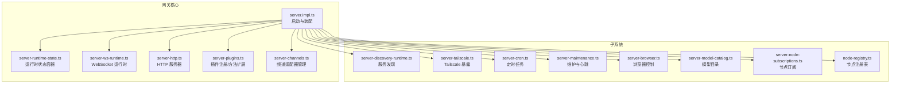

**图表来源**

- [src/gateway/server.impl.ts](file://src/gateway/server.impl.ts#L195-L800)
- [src/gateway/server-runtime-state.ts](file://src/gateway/server-runtime-state.ts)
- [src/gateway/server-ws-runtime.ts](file://src/gateway/server-ws-runtime.ts)
- [src/gateway/server-http.ts](file://src/gateway/server-http.ts)
- [src/gateway/server-plugins.ts](file://src/gateway/server-plugins.ts)
- [src/gateway/server-channels.ts](file://src/gateway/server-channels.ts)
- [src/gateway/server-discovery-runtime.ts](file://src/gateway/server-discovery-runtime.ts)
- [src/gateway/server-tailscale.ts](file://src/gateway/server-tailscale.ts)
- [src/gateway/server-cron.ts](file://src/gateway/server-cron.ts)
- [src/gateway/server-maintenance.ts](file://src/gateway/server-maintenance.ts)
- [src/gateway/server-browser.ts](file://src/gateway/server-browser.ts)
- [src/gateway/server-model-catalog.ts](file://src/gateway/server-model-catalog.ts)
- [src/gateway/server-node-subscriptions.ts](file://src/gateway/server-node-subscriptions.ts)
- [src/gateway/node-registry.ts](file://src/gateway/node-registry.ts)

**章节来源**

- [src/gateway/server.impl.ts](file://src/gateway/server.impl.ts#L195-L800)

## 核心组件

- 启动与装配器：负责配置加载、密钥激活、插件装载、运行时状态构建、子系统初始化与事件订阅。
- 运行时状态容器：聚合 WebSocket、HTTP、Canvas、浏览器控制、鉴权、速率限制、广播、订阅、聊天运行时等。
- WebSocket 运行时：连接接入、握手校验、速率限制、方法路由、事件广播、心跳与健康状态。
- HTTP 服务器：OpenAI 兼容端点、OpenResponses 端点、静态资源（Control UI）、CSP 与安全头。
- 插件系统：动态装载插件、合并方法集、注入额外处理器（如执行审批、密钥重载）。
- 频道适配器：统一管理各渠道（Discord、Telegram、Slack 等）的登录、运行、健康检查与事件。
- 子系统：服务发现（Bonjour/mDNS/广域）、Tailscale 暴露、定时任务、维护任务、浏览器控制、模型目录、节点订阅与注册表。

**章节来源**

- [src/gateway/server.ts](file://src/gateway/server.ts#L1-L4)
- [src/gateway/server.impl.ts](file://src/gateway/server.impl.ts#L195-L800)
- [src/gateway/server-plugins.ts](file://src/gateway/server-plugins.ts)
- [src/gateway/server-channels.ts](file://src/gateway/server-channels.ts)
- [src/gateway/server-ws-runtime.ts](file://src/gateway/server-ws-runtime.ts)
- [src/gateway/server-http.ts](file://src/gateway/server-http.ts)
- [src/gateway/server-runtime-state.ts](file://src/gateway/server-runtime-state.ts)

## 架构总览

下图展示了从启动到运行的关键交互：启动器装配配置与密钥，构建运行时状态，初始化子系统，挂载 WebSocket 与 HTTP 处理器，建立事件通道与广播机制。

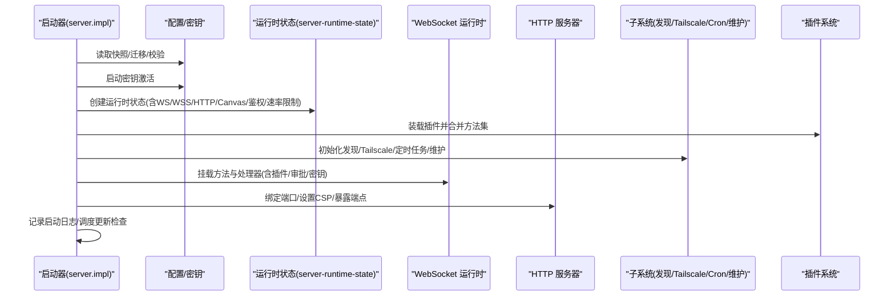

**图表来源**

- [src/gateway/server.impl.ts](file://src/gateway/server.impl.ts#L195-L800)
- [src/gateway/server-runtime-state.ts](file://src/gateway/server-runtime-state.ts)
- [src/gateway/server-plugins.ts](file://src/gateway/server-plugins.ts)
- [src/gateway/server-discovery-runtime.ts](file://src/gateway/server-discovery-runtime.ts)
- [src/gateway/server-tailscale.ts](file://src/gateway/server-tailscale.ts)
- [src/gateway/server-cron.ts](file://src/gateway/server-cron.ts)
- [src/gateway/server-maintenance.ts](file://src/gateway/server-maintenance.ts)

## 详细组件分析

### 启动流程与初始化顺序

- 环境与端口：写入运行时端口环境变量，记录接受的环境选项。
- 配置快照：读取、迁移旧配置、校验有效性；必要时写回迁移结果。
- 插件自动启用：根据环境与配置应用自动启用策略并持久化变更。
- 密钥激活：准备密钥快照并在启动阶段激活；失败则抛出错误。
- 启动前检查：确保必需引用可解析。
- 启动认证：生成或加载网关启动认证令牌，支持持久化。
- 运行时配置解析：基于配置与运行时参数计算绑定主机、端口、TLS、CSP、Control UI 根路径等。
- 运行时状态构建：创建 WebSocket、HTTP、Canvas、浏览器控制、鉴权与速率限制等对象。
- 子系统初始化：服务发现、远程技能缓存预热、节点订阅、心跳与维护任务、代理/审批、密钥重载、聊天运行时、模型目录、节点注册表。
- 处理器挂载：将方法集与插件处理器注入 WebSocket 运行时；HTTP 端点按配置启用。
- 启动日志与更新检查：输出启动摘要，调度更新可用事件广播。

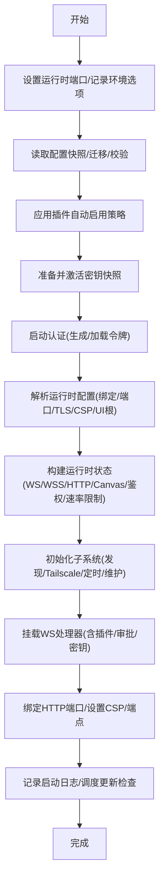

**图表来源**

- [src/gateway/server.impl.ts](file://src/gateway/server.impl.ts#L195-L800)
- [src/gateway/server-runtime-config.ts](file://src/gateway/server-runtime-config.ts)
- [src/gateway/server-runtime-state.ts](file://src/gateway/server-runtime-state.ts)
- [src/gateway/server-plugins.ts](file://src/gateway/server-plugins.ts)
- [src/gateway/server-discovery-runtime.ts](file://src/gateway/server-discovery-runtime.ts)
- [src/gateway/server-tailscale.ts](file://src/gateway/server-tailscale.ts)
- [src/gateway/server-cron.ts](file://src/gateway/server-cron.ts)
- [src/gateway/server-maintenance.ts](file://src/gateway/server-maintenance.ts)
- [src/gateway/server-startup-log.ts](file://src/gateway/server-startup-log.ts)

**章节来源**

- [src/gateway/server.impl.ts](file://src/gateway/server.impl.ts#L195-L800)

### 依赖注入与运行时状态

- 运行时状态容器聚合所有子系统实例与共享上下文，作为 WS/HTTP 插件处理器的依赖注入入口。
- 关键注入项包括：依赖工厂、定时任务、Canvas 服务、节点注册表、聊天运行时、去重器、广播器、订阅管理器、会话键解析器、模型目录加载器、健康状态刷新器、心跳事件广播器等。
- 该模式确保处理器仅依赖抽象接口，便于替换与测试。

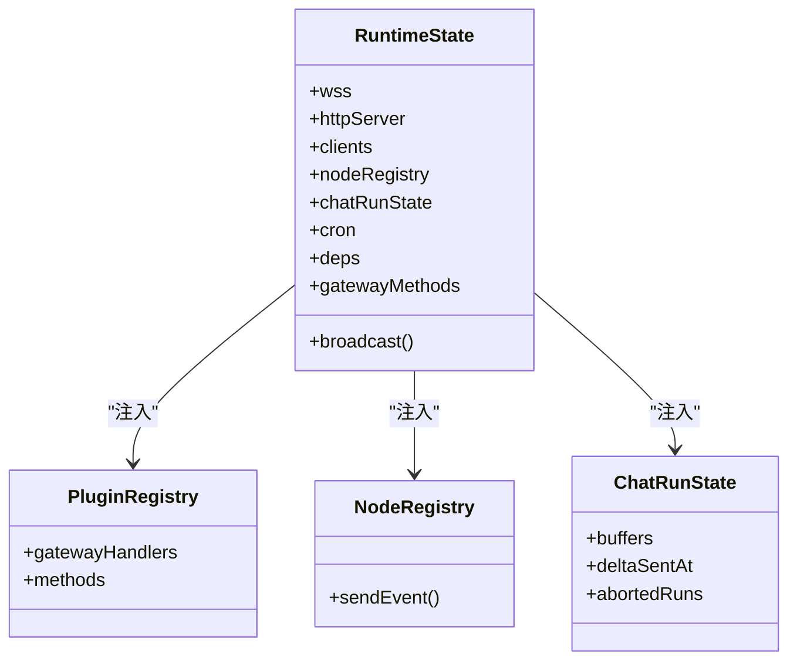

**图表来源**

- [src/gateway/server-runtime-state.ts](file://src/gateway/server-runtime-state.ts)
- [src/gateway/server-plugins.ts](file://src/gateway/server-plugins.ts)
- [src/gateway/node-registry.ts](file://src/gateway/node-registry.ts)
- [src/gateway/server-chat.ts](file://src/gateway/server-chat.ts)

**章节来源**

- [src/gateway/server-runtime-state.ts](file://src/gateway/server-runtime-state.ts)
- [src/gateway/server-plugins.ts](file://src/gateway/server-plugins.ts)
- [src/gateway/node-registry.ts](file://src/gateway/node-registry.ts)

### WebSocket 服务器与连接管理

- 连接接入：根据绑定策略选择监听地址，支持 loopback、LAN、Tailnet 与自动模式；对浏览器来源使用宽松的速率限制策略。
- 握手与鉴权：结合启动认证配置与速率限制器进行握手校验；关闭原因长度截断以符合 RFC 规范。
- 方法路由：将核心方法与插件方法合并后注入运行时，按方法名分发调用。
- 广播与事件：提供全局广播、按连接 ID 广播、节点订阅广播、心跳与健康事件推送。
- 聊天运行时：维护聊天缓冲、中止控制器、去重器与运行序列号，保障消息有序与幂等。

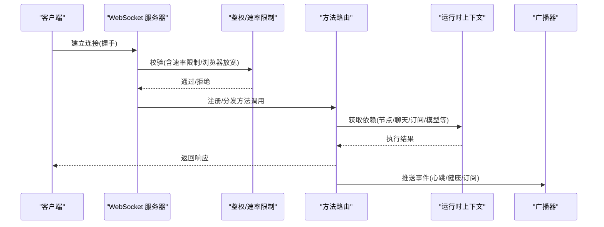

**图表来源**

- [src/gateway/server-ws-runtime.ts](file://src/gateway/server-ws-runtime.ts)
- [src/gateway/auth.ts](file://src/gateway/auth.ts)
- [src/gateway/auth-rate-limit.ts](file://src/gateway/auth-rate-limit.ts)
- [src/gateway/server-methods.ts](file://src/gateway/server-methods.ts)
- [src/gateway/server-methods-list.ts](file://src/gateway/server-methods-list.ts)
- [src/gateway/server-close.ts](file://src/gateway/server-close.ts)
- [src/gateway/server/close-reason.ts](file://src/gateway/server/close-reason.ts)

**章节来源**

- [src/gateway/server-ws-runtime.ts](file://src/gateway/server-ws-runtime.ts)
- [src/gateway/auth.ts](file://src/gateway/auth.ts)
- [src/gateway/auth-rate-limit.ts](file://src/gateway/auth-rate-limit.ts)
- [src/gateway/server-methods.ts](file://src/gateway/server-methods.ts)
- [src/gateway/server-methods-list.ts](file://src/gateway/server-methods-list.ts)
- [src/gateway/server-close.ts](file://src/gateway/server-close.ts)
- [src/gateway/server/close-reason.ts](file://src/gateway/server/close-reason.ts)

### HTTP 服务器与端点

- 绑定与监听：根据绑定策略与端口监听，捕获端口占用错误并转换为网关锁错误。
- 端点启用：按配置决定是否启用 OpenAI 兼容聊天补全与 OpenResponses 端点。
- 安全与 CSP：注入严格传输安全头与内容安全策略；支持 Control UI 根路径与资源构建。
- TLS：在启用时加载 TLS 运行时，失败则抛出错误。

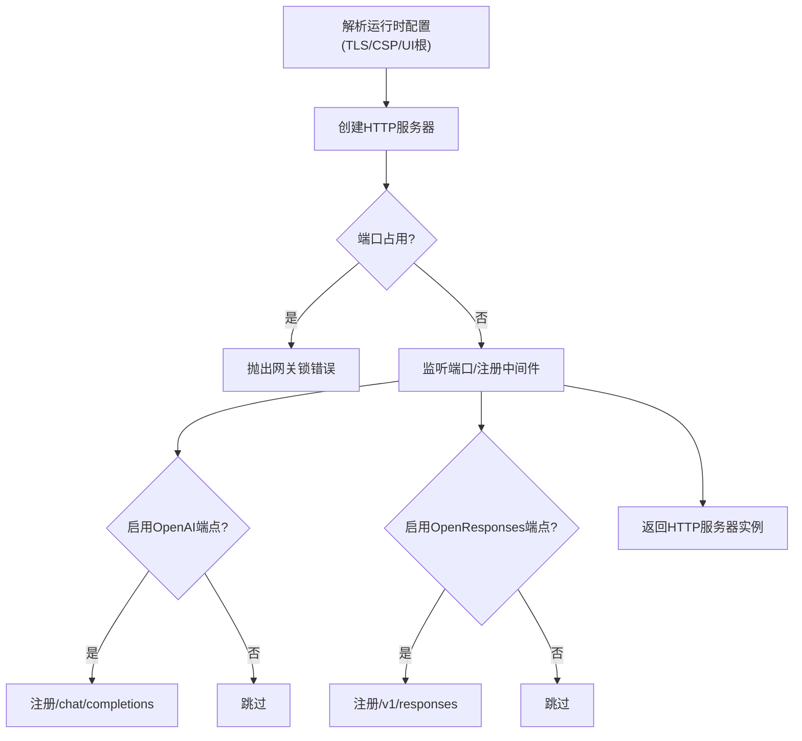

**图表来源**

- [src/gateway/server-http.ts](file://src/gateway/server-http.ts)
- [src/gateway/server-runtime-config.ts](file://src/gateway/server-runtime-config.ts)
- [src/gateway/server/http-listen.ts](file://src/gateway/server/http-listen.ts)
- [src/gateway/server-tls.ts](file://src/gateway/server/tls.ts)
- [src/gateway/control-ui.ts](file://src/gateway/control-ui.ts)

**章节来源**

- [src/gateway/server-http.ts](file://src/gateway/server-http.ts)
- [src/gateway/server/http-listen.ts](file://src/gateway/server/http-listen.ts)
- [src/gateway/server-runtime-config.ts](file://src/gateway/server-runtime-config.ts)
- [src/gateway/server-tls.ts](file://src/gateway/server/tls.ts)
- [src/gateway/control-ui.ts](file://src/gateway/control-ui.ts)

### 插件系统与扩展点

- 插件装载：基于工作区与配置加载插件，合并核心方法与频道方法，形成最终方法集。
- 服务句柄：插件可提供额外的 WebSocket 处理器与 HTTP 中间件。
- 扩展点：执行审批、密钥重载、频道方法、节点事件、会话与聊天扩展等。

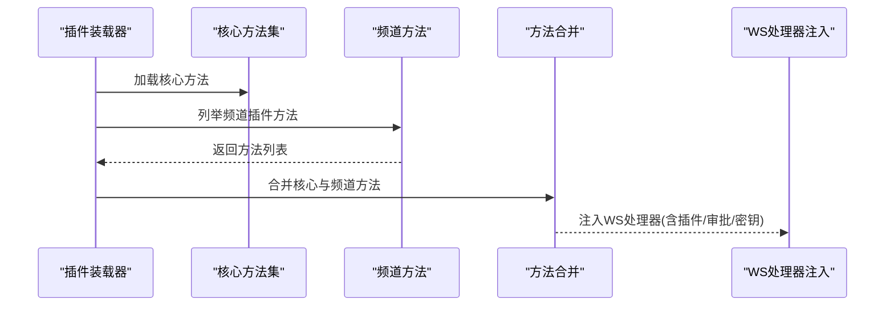

**图表来源**

- [src/gateway/server-plugins.ts](file://src/gateway/server-plugins.ts)
- [src/gateway/server-methods-list.ts](file://src/gateway/server-methods-list.ts)
- [src/gateway/server-ws-runtime.ts](file://src/gateway/server-ws-runtime.ts)

**章节来源**

- [src/gateway/server-plugins.ts](file://src/gateway/server-plugins.ts)
- [src/gateway/server-methods-list.ts](file://src/gateway/server-methods-list.ts)
- [src/gateway/server-ws-runtime.ts](file://src/gateway/server-ws-runtime.ts)

### 频道适配器与会话管理

- 生命周期：统一管理频道登录、运行、停止、登出标记与健康检查。
- 会话键：按运行解析会话键，用于事件与聊天上下文关联。
- 会话工具：会话标题生成、会话解析与预览、会话工具集。

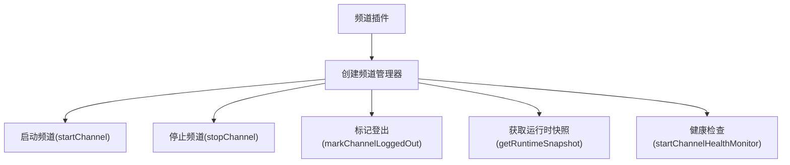

**图表来源**

- [src/gateway/server-channels.ts](file://src/gateway/server-channels.ts)
- [src/gateway/channel-health-monitor.ts](file://src/gateway/channel-health-monitor.ts)
- [src/gateway/server-session-key.ts](file://src/gateway/server-session-key.ts)
- [src/gateway/session-utils.ts](file://src/gateway/session-utils.ts)
- [src/gateway/session-title-generator.ts](file://src/gateway/session-title-generator.ts)

**章节来源**

- [src/gateway/server-channels.ts](file://src/gateway/server-channels.ts)
- [src/gateway/channel-health-monitor.ts](file://src/gateway/channel-health-monitor.ts)
- [src/gateway/server-session-key.ts](file://src/gateway/server-session-key.ts)
- [src/gateway/session-utils.ts](file://src/gateway/session-utils.ts)
- [src/gateway/session-title-generator.ts](file://src/gateway/session-title-generator.ts)

### 子系统与维护任务

- 服务发现：Bonjour/mDNS 与广域发现，支持 Tailnet 模式。
- Tailscale 暴露：按配置开启/重置，暴露本地端口与 Control UI。
- 定时任务：Cron 服务启动与存储路径管理。
- 维护任务：心跳运行器、健康状态刷新、去重清理、聊天运行时清理、节点事件广播。
- 浏览器控制：在启用时提供浏览器侧控制能力。

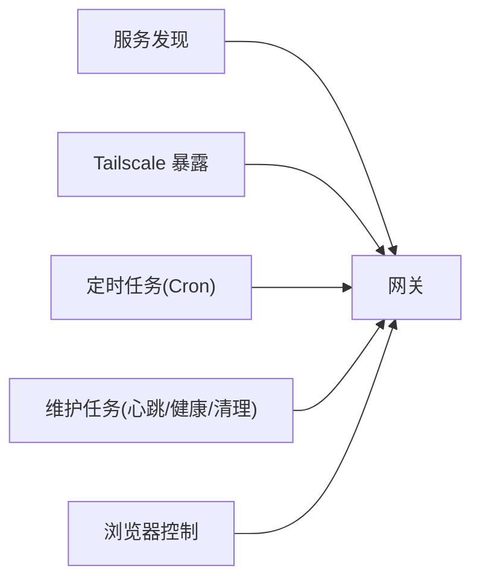

**图表来源**

- [src/gateway/server-discovery-runtime.ts](file://src/gateway/server-discovery-runtime.ts)
- [src/gateway/server-tailscale.ts](file://src/gateway/server-tailscale.ts)
- [src/gateway/server-cron.ts](file://src/gateway/server-cron.ts)
- [src/gateway/server-maintenance.ts](file://src/gateway/server-maintenance.ts)
- [src/gateway/server-browser.ts](file://src/gateway/server-browser.ts)

**章节来源**

- [src/gateway/server-discovery-runtime.ts](file://src/gateway/server-discovery-runtime.ts)
- [src/gateway/server-tailscale.ts](file://src/gateway/server-tailscale.ts)
- [src/gateway/server-cron.ts](file://src/gateway/server-cron.ts)
- [src/gateway/server-maintenance.ts](file://src/gateway/server-maintenance.ts)
- [src/gateway/server-browser.ts](file://src/gateway/server-browser.ts)

### 安全与鉴权

- 启动认证：在启动阶段确保认证令牌存在，支持生成与持久化。
- 速率限制：区分浏览器来源与非浏览器来源，浏览器来源默认放宽环回豁免。
- 速率限制器：可按配置启用，限制握手与认证尝试频率。
- 速率限制策略：支持全局与浏览器专用速率限制器。
- 速率限制配置：支持按时间窗口与次数限制。

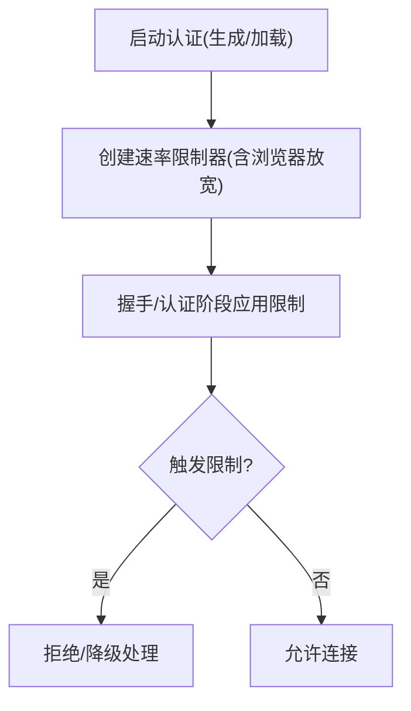

**图表来源**

- [src/gateway/startup-auth.ts](file://src/gateway/startup-auth.ts)
- [src/gateway/auth-rate-limit.ts](file://src/gateway/auth-rate-limit.ts)
- [src/gateway/auth.ts](file://src/gateway/auth.ts)

**章节来源**

- [src/gateway/startup-auth.ts](file://src/gateway/startup-auth.ts)
- [src/gateway/auth-rate-limit.ts](file://src/gateway/auth-rate-limit.ts)
- [src/gateway/auth.ts](file://src/gateway/auth.ts)

### 数据流向与事件广播

- 聊天数据流：客户端发送消息 → WS 路由 → 聊天运行时 → 代理/工具调用 → 结果回传 → 广播/事件推送。
- 节点事件：节点注册表与订阅管理器驱动事件分发，支持按会话与全局广播。
- 健康与心跳：维护任务周期刷新健康状态与心跳事件，WS 广播给客户端。
- 模型目录：按需加载模型目录，供聊天与工具调用使用。

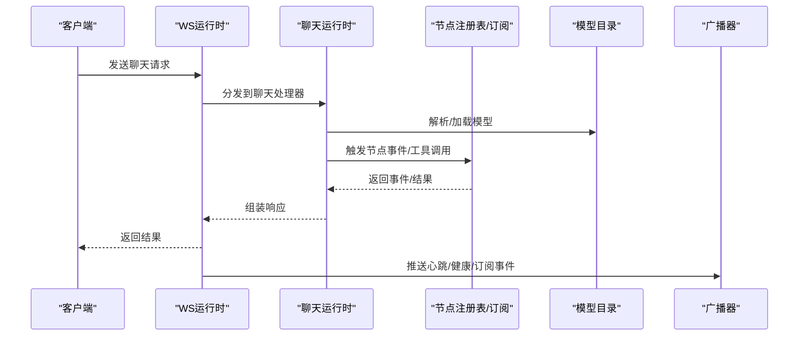

**图表来源**

- [src/gateway/server-ws-runtime.ts](file://src/gateway/server-ws-runtime.ts)
- [src/gateway/server-chat.ts](file://src/gateway/server-chat.ts)
- [src/gateway/server-node-subscriptions.ts](file://src/gateway/server-node-subscriptions.ts)
- [src/gateway/node-registry.ts](file://src/gateway/node-registry.ts)
- [src/gateway/server-model-catalog.ts](file://src/gateway/server-model-catalog.ts)

**章节来源**

- [src/gateway/server-ws-runtime.ts](file://src/gateway/server-ws-runtime.ts)
- [src/gateway/server-chat.ts](file://src/gateway/server-chat.ts)
- [src/gateway/server-node-subscriptions.ts](file://src/gateway/server-node-subscriptions.ts)
- [src/gateway/node-registry.ts](file://src/gateway/node-registry.ts)
- [src/gateway/server-model-catalog.ts](file://src/gateway/server-model-catalog.ts)

## 依赖关系分析

- 启动器对配置、密钥、插件、运行时状态与子系统的强依赖；运行时状态对 WS/HTTP/Canvas/鉴权/速率限制/广播/订阅/聊天/节点/模型目录等弱耦合依赖。
- 插件系统通过方法合并与处理器注入降低耦合度，提升可扩展性。
- 子系统之间通过广播器与事件总线松耦合交互，避免循环依赖。

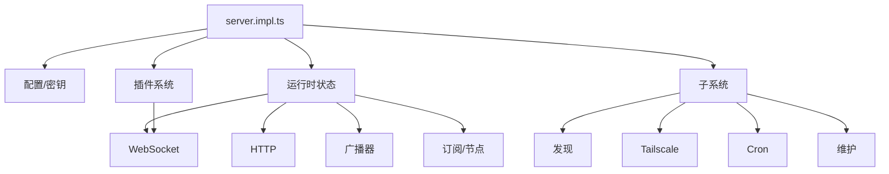

**图表来源**

- [src/gateway/server.impl.ts](file://src/gateway/server.impl.ts#L195-L800)
- [src/gateway/server-plugins.ts](file://src/gateway/server-plugins.ts)
- [src/gateway/server-runtime-state.ts](file://src/gateway/server-runtime-state.ts)
- [src/gateway/server-discovery-runtime.ts](file://src/gateway/server-discovery-runtime.ts)
- [src/gateway/server-tailscale.ts](file://src/gateway/server-tailscale.ts)
- [src/gateway/server-cron.ts](file://src/gateway/server-cron.ts)
- [src/gateway/server-maintenance.ts](file://src/gateway/server-maintenance.ts)

**章节来源**

- [src/gateway/server.impl.ts](file://src/gateway/server.impl.ts#L195-L800)

## 性能考量

- 并发与限流：速率限制器与浏览器放宽策略平衡安全性与易用性；聊天运行时的去重与缓冲减少重复计算与网络开销。
- 维护任务：心跳与健康刷新、聊天运行时清理、节点事件广播均采用定时器与惰性策略，避免阻塞主循环。
- 缓存与预热：远程技能缓存预热、模型目录按需加载，降低冷启动成本。
- 端口冲突与绑定：HTTP 监听捕获端口占用并转换为明确错误，避免隐式失败。

[本节为通用性能建议，不直接分析具体文件]

## 故障排查指南

- 端口占用：HTTP 监听捕获端口占用错误并抛出网关锁错误，提示已有实例占用。
- 启动失败：配置无效或密钥不可用导致启动失败，检查配置快照与密钥激活日志。
- 握手失败：关闭原因长度截断，确保错误信息不超过最大字节数。
- 插件问题：插件装载失败或方法冲突，检查插件注册与方法合并逻辑。
- 速率限制：浏览器来源被放宽但其他来源受限，确认速率限制配置与来源判断。
- 更新检查：更新可用事件通过广播推送，确认广播器与事件订阅正常。

**章节来源**

- [src/gateway/server/http-listen.ts](file://src/gateway/server/http-listen.ts#L1-L37)
- [src/gateway/server.impl.ts](file://src/gateway/server.impl.ts#L213-L247)
- [src/gateway/server/close-reason.ts](file://src/gateway/server/close-reason.ts#L1-L15)
- [src/gateway/server-plugins.ts](file://src/gateway/server-plugins.ts)
- [src/gateway/auth-rate-limit.ts](file://src/gateway/auth-rate-limit.ts)
- [src/gateway/events.ts](file://src/gateway/events.ts)

## 结论

OpenClaw 网关采用“启动装配 + 运行时状态容器 + 松耦合子系统”的架构模式，通过插件系统与方法合并实现高扩展性，借助速率限制、健康与维护任务保障稳定性，配合 WebSocket 与 HTTP 双栈提供统一的控制与数据通道。该设计既满足多频道适配与复杂业务场景，又为二次开发与定制提供了清晰的扩展点与依赖注入机制。

## 附录

- 测试辅助：提供 withGatewayServer 与测试助手，支持端口重试、模拟配置与运行时行为。
- 端点与兼容：OpenAI 兼容聊天补全与 OpenResponses 端点，支持多种绑定模式与 TLS。
- 安全与合规：严格传输安全头、内容安全策略、速率限制与启动认证，保障安全边界。

**章节来源**

- [src/gateway/test-helpers.server.ts](file://src/gateway/test-helpers.server.ts#L312-L347)
- [src/gateway/call.test.ts](file://src/gateway/call.test.ts#L111-L158)
- [src/gateway/server-http.ts](file://src/gateway/server-http.ts)
- [src/gateway/server-runtime-config.ts](file://src/gateway/server-runtime-config.ts)
- [src/gateway/server-tls.ts](file://src/gateway/server/tls.ts)
- [src/gateway/control-ui.ts](file://src/gateway/control-ui.ts)
- [src/gateway/auth-rate-limit.ts](file://src/gateway/auth-rate-limit.ts)
- [src/gateway/startup-auth.ts](file://src/gateway/startup-auth.ts)
