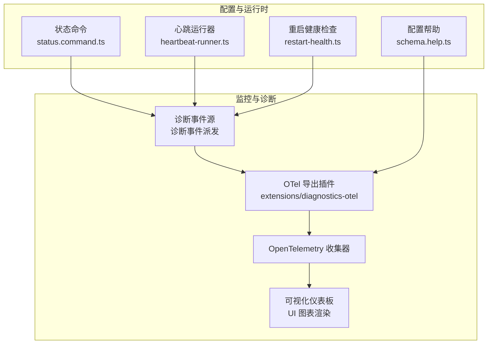
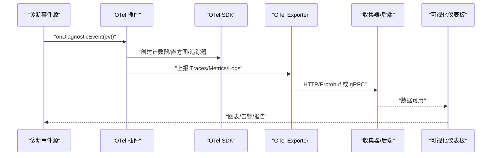
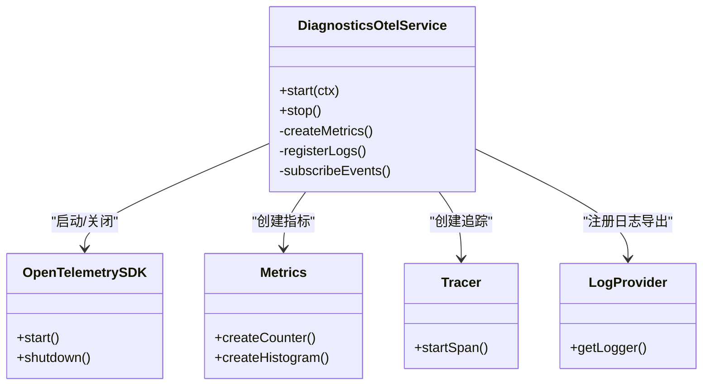
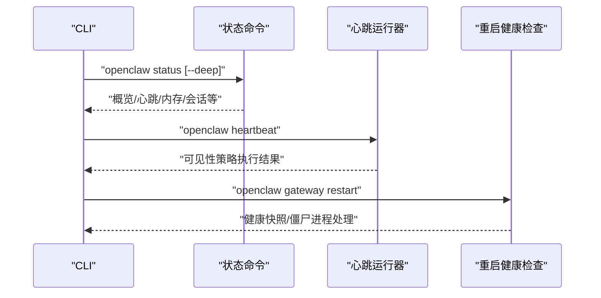
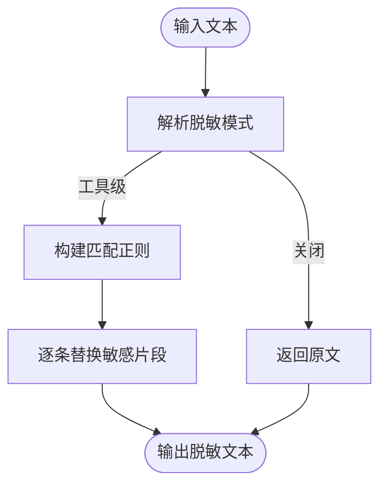
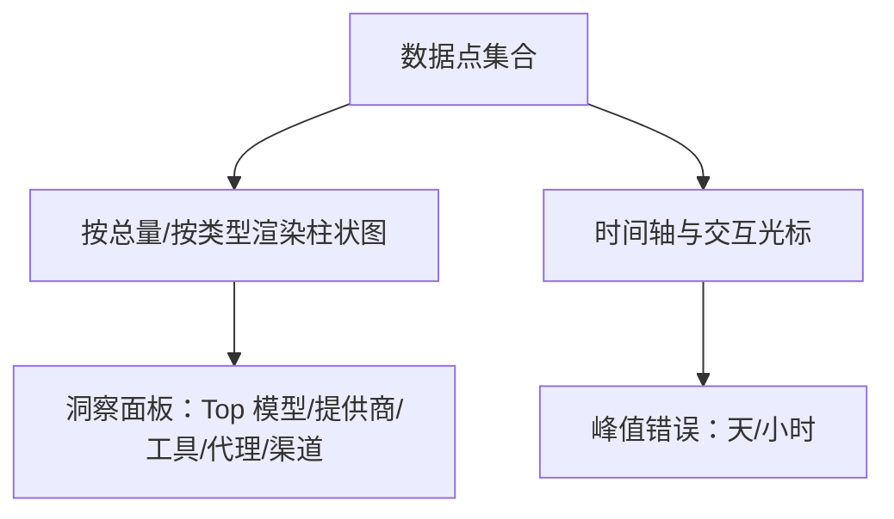
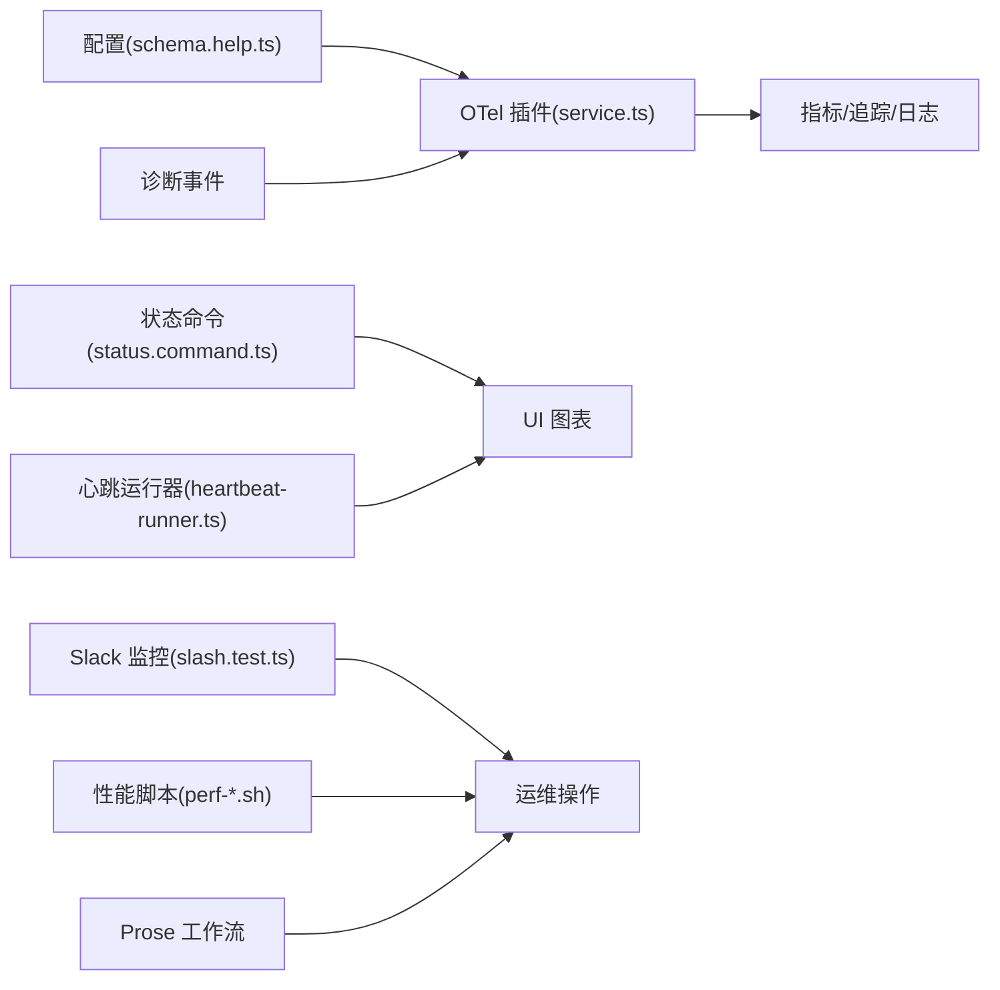

# 网关监控与诊断

<cite>
**本文引用的文件**
- [extensions/diagnostics-otel/src/service.ts](file://extensions/diagnostics-otel/src/service.ts)
- [extensions/diagnostics-otel/index.ts](file://extensions/diagnostics-otel/index.ts)
- [src/config/schema.help.ts](file://src/config/schema.help.ts)
- [src/commands/status.command.ts](file://src/commands/status.command.ts)
- [src/cli/daemon-cli/restart-health.ts](file://src/cli/daemon-cli/restart-health.ts)
- [src/infra/heartbeat-runner.ts](file://src/infra/heartbeat-runner.ts)
- [docs/gateway/heartbeat.md](file://docs/gateway/heartbeat.md)
- [src/logging/redact.ts](file://src/logging/redact.ts)
- [src/infra/errors.ts](file://src/infra/errors.ts)
- [src/slack/monitor/slash.test.ts](file://src/slack/monitor/slash.test.ts)
- [ui/src/ui/views/usage-render-overview.ts](file://ui/src/ui/views/usage-render-overview.ts)
- [ui/src/ui/views/usage-render-details.ts](file://ui/src/ui/views/usage-render-details.ts)
- [extensions/open-prose/skills/prose/examples/45-run-endpoint-ux-test-with-remediation.prose](file://extensions/open-prose/skills/prose/examples/45-run-endpoint-ux-test-with-remediation.prose)
- [extensions/open-prose/skills/prose/examples/36-bug-hunter.prose](file://extensions/open-prose/skills/prose/examples/36-bug-hunter.prose)
- [src/agents/pi-embedded-runner/run.ts](file://src/agents/pi-embedded-runner/run.ts)
- [apps/android/scripts/perf-startup-benchmark.sh](file://apps/android/scripts/perf-startup-benchmark.sh)
- [apps/android/scripts/perf-startup-hotspots.sh](file://apps/android/scripts/perf-startup-hotspots.sh)
- [apps/android/README.md](file://apps/android/README.md)
</cite>

## 目录

1. [简介](#简介)
2. [项目结构](#项目结构)
3. [核心组件](#核心组件)
4. [架构总览](#架构总览)
5. [详细组件分析](#详细组件分析)
6. [依赖关系分析](#依赖关系分析)
7. [性能考量](#性能考量)
8. [故障排查指南](#故障排查指南)
9. [结论](#结论)
10. [附录](#附录)

## 简介

本文件面向运维与平台工程团队，系统化阐述 OpenClaw 网关的监控与诊断能力：包括健康检查机制、监控指标采集与告警配置、日志记录与敏感信息脱敏、错误追踪与性能分析工具、分布式追踪与链路监控、根因分析方法、监控仪表板与可视化、故障诊断流程与应急响应预案，以及最佳实践与运维自动化建议。

## 项目结构

围绕“监控与诊断”的关键代码分布如下：

- 插件式遥测导出：通过扩展模块将诊断事件导出到 OpenTelemetry 收集器（Traces/Metrics/Logs）。
- 配置与帮助：提供诊断开关、OTel 端点、协议、采样率、服务名等配置项说明。
- 健康与状态：命令行状态输出、心跳可见性控制、重启健康检查与诊断。
- 日志与脱敏：统一的敏感信息脱敏策略，确保日志安全。
- 错误格式化：标准化错误消息与未捕获异常处理。
- 可视化与报告：前端使用 SVG 渲染时序与分组统计图表。
- 自动化与辅助：Slack 监控指令、性能基准脚本与热点分析脚本、Prose 根因分析工作流。

**图示来源**

- [extensions/diagnostics-otel/src/service.ts](file://extensions/diagnostics-otel/src/service.ts#L65-L679)
- [src/config/schema.help.ts](file://src/config/schema.help.ts#L400-L428)
- [src/commands/status.command.ts](file://src/commands/status.command.ts#L290-L489)
- [src/infra/heartbeat-runner.ts](file://src/infra/heartbeat-runner.ts#L656-L697)
- [src/cli/daemon-cli/restart-health.ts](file://src/cli/daemon-cli/restart-health.ts#L96-L139)

**章节来源**

- [extensions/diagnostics-otel/src/service.ts](file://extensions/diagnostics-otel/src/service.ts#L65-L679)
- [src/config/schema.help.ts](file://src/config/schema.help.ts#L400-L428)
- [src/commands/status.command.ts](file://src/commands/status.command.ts#L290-L489)
- [src/infra/heartbeat-runner.ts](file://src/infra/heartbeat-runner.ts#L656-L697)
- [src/cli/daemon-cli/restart-health.ts](file://src/cli/daemon-cli/restart-health.ts#L96-L139)

## 核心组件

- 诊断 OTel 插件：负责启动 OTel SDK、注册日志传输、订阅诊断事件并上报 Traces/Metrics/Logs；支持采样率、端点、协议、头部、服务名、刷新间隔等配置。
- 配置与帮助：提供诊断与 OTel 的开关、端点、协议、采样率、服务名、信号类型、刷新间隔等配置项说明。
- 健康与状态：CLI 状态命令输出概览、心跳可见性、内存/会话/代理/更新等健康信息；心跳运行器根据可见性策略决定是否发送提示或指标。
- 重启健康检查：等待网关健康重启、端口占用诊断、僵尸进程清理与终止。
- 日志与脱敏：统一的敏感信息脱敏策略，覆盖环境变量、令牌、授权头、PEM 私钥、常见 Token 前缀等。
- 错误格式化：提取错误码、格式化消息、未捕获异常栈，结合脱敏策略输出。
- 可视化与报告：前端使用 SVG 渲染每日用量、按类型拆分、峰值时段等图表。
- 自动化与辅助：Slack 监控指令注册、Android 启动性能基准与热点分析脚本、Prose 根因分析工作流。

**章节来源**

- [extensions/diagnostics-otel/src/service.ts](file://extensions/diagnostics-otel/src/service.ts#L65-L679)
- [src/config/schema.help.ts](file://src/config/schema.help.ts#L400-L428)
- [src/commands/status.command.ts](file://src/commands/status.command.ts#L290-L489)
- [src/infra/heartbeat-runner.ts](file://src/infra/heartbeat-runner.ts#L656-L697)
- [src/cli/daemon-cli/restart-health.ts](file://src/cli/daemon-cli/restart-health.ts#L96-L139)
- [src/logging/redact.ts](file://src/logging/redact.ts#L1-L151)
- [src/infra/errors.ts](file://src/infra/errors.ts#L1-L59)
- [ui/src/ui/views/usage-render-overview.ts](file://ui/src/ui/views/usage-render-overview.ts#L158-L543)
- [ui/src/ui/views/usage-render-details.ts](file://ui/src/ui/views/usage-render-details.ts#L394-L516)
- [src/slack/monitor/slash.test.ts](file://src/slack/monitor/slash.test.ts#L172-L213)
- [apps/android/scripts/perf-startup-benchmark.sh](file://apps/android/scripts/perf-startup-benchmark.sh#L55-L124)
- [apps/android/scripts/perf-startup-hotspots.sh](file://apps/android/scripts/perf-startup-hotspots.sh#L101-L154)
- [extensions/open-prose/skills/prose/examples/45-run-endpoint-ux-test-with-remediation.prose](file://extensions/open-prose/skills/prose/examples/45-run-endpoint-ux-test-with-remediation.prose#L114-L624)
- [extensions/open-prose/skills/prose/examples/36-bug-hunter.prose](file://extensions/open-prose/skills/prose/examples/36-bug-hunter.prose#L50-L101)

## 架构总览

下图展示从诊断事件到 OTel 导出再到可视化仪表板的完整链路，以及健康检查与心跳策略对可观测性的支撑。

**图示来源**

- [extensions/diagnostics-otel/src/service.ts](file://extensions/diagnostics-otel/src/service.ts#L160-L259)
- [extensions/diagnostics-otel/src/service.ts](file://extensions/diagnostics-otel/src/service.ts#L612-L657)
- [extensions/diagnostics-otel/index.ts](file://extensions/diagnostics-otel/index.ts#L1-L15)

## 详细组件分析

### 组件A：诊断 OTel 插件

- 功能要点
  - 启动条件：仅当诊断与 OTel 开关均启用时初始化。
  - 协议与端点：支持 http/protobuf 协议，自动拼接 /v1/traces|metrics|logs 路径；支持自定义头部与服务名。
  - 指标与追踪：注册多种计数器与直方图（令牌、成本、运行时长、上下文、Webhook、消息队列、会话状态、卡顿等），并在需要时生成追踪跨度。
  - 日志导出：注册日志传输，将通用日志对象转换为 OTLP 日志记录，含严重级别映射、属性注入与敏感信息脱敏。
  - 事件路由：根据事件类型分派到对应记录函数，异常被捕获并记录插件日志。
- 关键实现路径
  - 插件注册与服务创建：[extensions/diagnostics-otel/index.ts](file://extensions/diagnostics-otel/index.ts#L1-L15)
  - 服务启动与 OTel SDK 初始化：[extensions/diagnostics-otel/src/service.ts](file://extensions/diagnostics-otel/src/service.ts#L71-L149)
  - 指标与追踪注册：[extensions/diagnostics-otel/src/service.ts](file://extensions/diagnostics-otel/src/service.ts#L160-L235)
  - 日志导出与属性注入：[extensions/diagnostics-otel/src/service.ts](file://extensions/diagnostics-otel/src/service.ts#L236-L359)
  - 事件订阅与记录：[extensions/diagnostics-otel/src/service.ts](file://extensions/diagnostics-otel/src/service.ts#L612-L657)

**图示来源**

- [extensions/diagnostics-otel/src/service.ts](file://extensions/diagnostics-otel/src/service.ts#L65-L679)

**章节来源**

- [extensions/diagnostics-otel/src/service.ts](file://extensions/diagnostics-otel/src/service.ts#L65-L679)
- [extensions/diagnostics-otel/index.ts](file://extensions/diagnostics-otel/index.ts#L1-L15)

### 组件B：健康检查与状态命令

- 功能要点
  - 状态命令输出：概览、节点/代理/内存/会话/事件/心跳等健康信息；支持深度探测与敏感信息显示控制。
  - 心跳可见性：根据通道/账户配置决定是否发送 OK 提示、告警内容与 UI 指示器。
  - 重启健康检查：轮询网关运行态、端口占用、僵尸进程，支持渲染诊断摘要与终止僵尸进程。
- 关键实现路径
  - 状态命令输出与表格渲染：[src/commands/status.command.ts](file://src/commands/status.command.ts#L290-L489)
  - 心跳可见性与运行逻辑：[src/infra/heartbeat-runner.ts](file://src/infra/heartbeat-runner.ts#L656-L697)
  - 心跳配置说明：[docs/gateway/heartbeat.md](file://docs/gateway/heartbeat.md#L273-L309)
  - 重启健康检查与诊断：[src/cli/daemon-cli/restart-health.ts](file://src/cli/daemon-cli/restart-health.ts#L96-L139)

**图示来源**

- [src/commands/status.command.ts](file://src/commands/status.command.ts#L290-L489)
- [src/infra/heartbeat-runner.ts](file://src/infra/heartbeat-runner.ts#L656-L697)
- [src/cli/daemon-cli/restart-health.ts](file://src/cli/daemon-cli/restart-health.ts#L96-L139)

**章节来源**

- [src/commands/status.command.ts](file://src/commands/status.command.ts#L290-L489)
- [src/infra/heartbeat-runner.ts](file://src/infra/heartbeat-runner.ts#L656-L697)
- [docs/gateway/heartbeat.md](file://docs/gateway/heartbeat.md#L273-L309)
- [src/cli/daemon-cli/restart-health.ts](file://src/cli/daemon-cli/restart-health.ts#L96-L139)

### 组件C：日志记录与敏感信息脱敏

- 功能要点
  - 默认模式：工具级脱敏（仅对工具详情进行脱敏）；可关闭。
  - 匹配规则：环境变量赋值、JSON 字段、CLI 参数、Authorization 头、PEM 私钥、常见 Token 前缀等。
  - 工具细节脱敏：在工具执行详情中应用脱敏策略。
- 关键实现路径
  - 脱敏策略与正则：[src/logging/redact.ts](file://src/logging/redact.ts#L1-L151)
  - 错误消息格式化与脱敏：[src/infra/errors.ts](file://src/infra/errors.ts#L31-L59)

**图示来源**

- [src/logging/redact.ts](file://src/logging/redact.ts#L107-L138)

**章节来源**

- [src/logging/redact.ts](file://src/logging/redact.ts#L1-L151)
- [src/infra/errors.ts](file://src/infra/errors.ts#L31-L59)

### 组件D：可视化与报告

- 功能要点
  - 日常用量图表：支持按总量/按类型切换，峰值洞察列表。
  - 时间序列图表：支持累计/每轮次、按类型拆分、范围选择与高亮。
- 关键实现路径
  - 日常图表与洞察：[ui/src/ui/views/usage-render-overview.ts](file://ui/src/ui/views/usage-render-overview.ts#L158-L543)
  - 时序图表与交互：[ui/src/ui/views/usage-render-details.ts](file://ui/src/ui/views/usage-render-details.ts#L394-L516)

**图示来源**

- [ui/src/ui/views/usage-render-overview.ts](file://ui/src/ui/views/usage-render-overview.ts#L158-L543)
- [ui/src/ui/views/usage-render-details.ts](file://ui/src/ui/views/usage-render-details.ts#L394-L516)

**章节来源**

- [ui/src/ui/views/usage-render-overview.ts](file://ui/src/ui/views/usage-render-overview.ts#L158-L543)
- [ui/src/ui/views/usage-render-details.ts](file://ui/src/ui/views/usage-render-details.ts#L394-L516)

### 组件E：根因分析与自动化辅助

- 功能要点
  - Slack 监控指令：注册监控类 Slash 命令，便于快速诊断与操作。
  - 性能基准与热点：Android 启动性能基准脚本与热点分析脚本，定位 DSO/符号与关键路径线索。
  - Prose 根因分析：基于工作流的诊断、验证、分级与修复闭环。
- 关键实现路径
  - Slack 监控指令注册测试：[src/slack/monitor/slash.test.ts](file://src/slack/monitor/slash.test.ts#L172-L213)
  - Android 性能基准脚本：[apps/android/scripts/perf-startup-benchmark.sh](file://apps/android/scripts/perf-startup-benchmark.sh#L55-L124)
  - Android 热点分析脚本：[apps/android/scripts/perf-startup-hotspots.sh](file://apps/android/scripts/perf-startup-hotspots.sh#L101-L154)
  - Prose 根因分析工作流：[extensions/open-prose/skills/prose/examples/45-run-endpoint-ux-test-with-remediation.prose](file://extensions/open-prose/skills/prose/examples/45-run-endpoint-ux-test-with-remediation.prose#L114-L624)
  - Prose Bug Hunter：[extensions/open-prose/skills/prose/examples/36-bug-hunter.prose](file://extensions/open-prose/skills/prose/examples/36-bug-hunter.prose#L50-L101)

**章节来源**

- [src/slack/monitor/slash.test.ts](file://src/slack/monitor/slash.test.ts#L172-L213)
- [apps/android/scripts/perf-startup-benchmark.sh](file://apps/android/scripts/perf-startup-benchmark.sh#L55-L124)
- [apps/android/scripts/perf-startup-hotspots.sh](file://apps/android/scripts/perf-startup-hotspots.sh#L101-L154)
- [extensions/open-prose/skills/prose/examples/45-run-endpoint-ux-test-with-remediation.prose](file://extensions/open-prose/skills/prose/examples/45-run-endpoint-ux-test-with-remediation.prose#L114-L624)
- [extensions/open-prose/skills/prose/examples/36-bug-hunter.prose](file://extensions/open-prose/skills/prose/examples/36-bug-hunter.prose#L50-L101)

## 依赖关系分析

- 插件与配置：OTel 插件依赖诊断配置（开关、端点、协议、采样率、服务名、信号类型、刷新间隔）。
- 事件与指标：诊断事件驱动指标与追踪，日志导出依赖日志传输注册。
- 运行时与 UI：状态命令与心跳运行器提供运行态信息，前端图表消费指标数据。
- 辅助工具：Slack 指令、性能脚本、Prose 工作流作为诊断与优化的补充手段。

**图示来源**

- [src/config/schema.help.ts](file://src/config/schema.help.ts#L400-L428)
- [extensions/diagnostics-otel/src/service.ts](file://extensions/diagnostics-otel/src/service.ts#L71-L149)
- [src/commands/status.command.ts](file://src/commands/status.command.ts#L290-L489)
- [src/infra/heartbeat-runner.ts](file://src/infra/heartbeat-runner.ts#L656-L697)
- [src/slack/monitor/slash.test.ts](file://src/slack/monitor/slash.test.ts#L172-L213)
- [apps/android/scripts/perf-startup-benchmark.sh](file://apps/android/scripts/perf-startup-benchmark.sh#L55-L124)

**章节来源**

- [src/config/schema.help.ts](file://src/config/schema.help.ts#L400-L428)
- [extensions/diagnostics-otel/src/service.ts](file://extensions/diagnostics-otel/src/service.ts#L71-L149)
- [src/commands/status.command.ts](file://src/commands/status.command.ts#L290-L489)
- [src/infra/heartbeat-runner.ts](file://src/infra/heartbeat-runner.ts#L656-L697)
- [src/slack/monitor/slash.test.ts](file://src/slack/monitor/slash.test.ts#L172-L213)
- [apps/android/scripts/perf-startup-benchmark.sh](file://apps/android/scripts/perf-startup-benchmark.sh#L55-L124)

## 性能考量

- 指标与追踪开销
  - 采样率：通过配置项控制追踪采样比例，降低可观测性开销。
  - 刷新间隔：调整指标与日志刷新间隔，平衡可见性与网络/存储压力。
  - 信号类型：仅启用必要的信号（Traces/Metrics/Logs），避免冗余导出。
- 日志与脱敏
  - 在集中式日志场景启用 OTel Logs，同时对敏感字段进行脱敏，减少泄露风险。
- 前端渲染
  - 使用 SVG 渲染图表，按需计算最大值与坐标，避免大数据量下的 UI 卡顿。
- 移动端性能
  - Android 启动性能基准与热点分析脚本用于定位启动瓶颈，建议在 CI 中定期运行以发现回归。

**章节来源**

- [extensions/diagnostics-otel/src/service.ts](file://extensions/diagnostics-otel/src/service.ts#L120-L149)
- [src/logging/redact.ts](file://src/logging/redact.ts#L107-L138)
- [ui/src/ui/views/usage-render-overview.ts](file://ui/src/ui/views/usage-render-overview.ts#L158-L543)
- [apps/android/scripts/perf-startup-benchmark.sh](file://apps/android/scripts/perf-startup-benchmark.sh#L55-L124)
- [apps/android/scripts/perf-startup-hotspots.sh](file://apps/android/scripts/perf-startup-hotspots.sh#L101-L154)

## 故障排查指南

- 健康检查与状态
  - 使用状态命令查看概览、心跳、内存、会话与事件队列；深度探测可获取最近心跳详情。
  - 心跳可见性：根据通道/账户配置决定是否发送 OK 提示、告警内容与 UI 指示器。
- 重启健康检查
  - 等待网关健康重启，检查端口占用与僵尸进程；必要时终止僵尸进程并重试。
- 日志与错误
  - 统一脱敏策略确保日志安全；错误格式化包含错误码与栈信息，便于定位。
- 分布式追踪与链路监控
  - 通过 OTel 插件上报 Traces/Metrics/Logs，结合服务名与属性进行链路关联与根因定位。
- 根因分析与修复
  - 使用 Prose 工作流进行诊断、验证、分级与修复闭环；配合 Slack 指令快速响应。
- 性能分析
  - 使用 Android 性能基准与热点分析脚本定位启动瓶颈；结合前端图表观察用量与错误峰值。

**章节来源**

- [src/commands/status.command.ts](file://src/commands/status.command.ts#L290-L489)
- [docs/gateway/heartbeat.md](file://docs/gateway/heartbeat.md#L273-L309)
- [src/cli/daemon-cli/restart-health.ts](file://src/cli/daemon-cli/restart-health.ts#L96-L139)
- [src/logging/redact.ts](file://src/logging/redact.ts#L107-L138)
- [src/infra/errors.ts](file://src/infra/errors.ts#L31-L59)
- [extensions/open-prose/skills/prose/examples/45-run-endpoint-ux-test-with-remediation.prose](file://extensions/open-prose/skills/prose/examples/45-run-endpoint-ux-test-with-remediation.prose#L114-L624)
- [apps/android/scripts/perf-startup-benchmark.sh](file://apps/android/scripts/perf-startup-benchmark.sh#L55-L124)
- [apps/android/scripts/perf-startup-hotspots.sh](file://apps/android/scripts/perf-startup-hotspots.sh#L101-L154)

## 结论

OpenClaw 的监控与诊断体系以插件化 OTel 导出为核心，结合健康检查、心跳可见性、日志脱敏、错误格式化、可视化图表与自动化辅助工具，形成从可观测到根因分析与修复的闭环。通过合理配置采样率、刷新间隔与信号类型，可在保证可观测性的同时控制开销；通过状态命令、心跳策略与重启健康检查，可快速定位并恢复网关异常；通过 Prose 工作流与性能脚本，可系统化提升诊断效率与质量。

## 附录

- 配置项速查
  - 诊断总开关、OTel 开关、端点、协议、头部、服务名、Traces/Metrics/Logs 开关、采样率、刷新间隔等。
- 最佳实践
  - 仅在需要时启用 Traces，生产环境适度降低采样率；集中式日志场景启用 OTel Logs 并开启脱敏；定期运行性能基准与热点分析脚本；使用状态命令与心跳策略进行日常巡检；通过 Slack 指令与 Prose 工作流提升响应效率。

**章节来源**

- [src/config/schema.help.ts](file://src/config/schema.help.ts#L400-L428)
- [extensions/diagnostics-otel/src/service.ts](file://extensions/diagnostics-otel/src/service.ts#L71-L149)
- [apps/android/README.md](file://apps/android/README.md#L58-L110)
