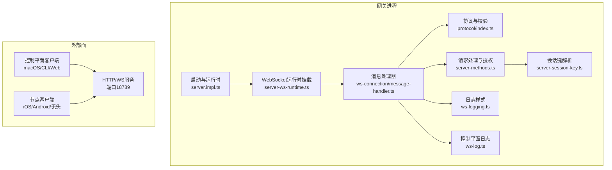
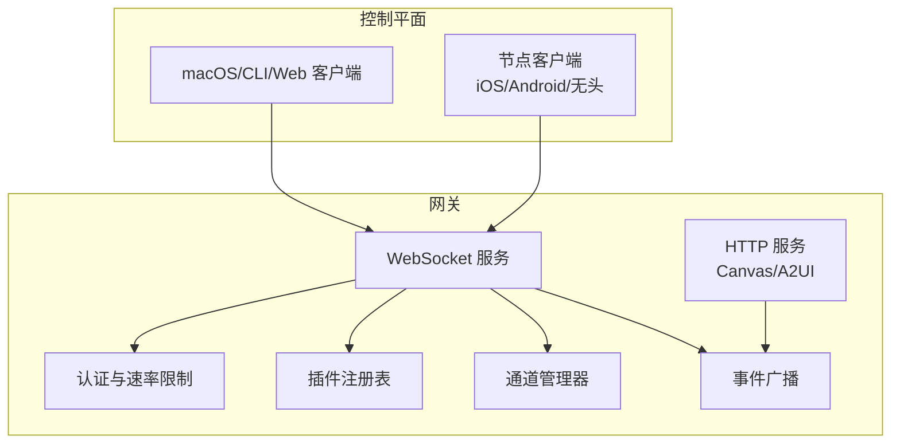
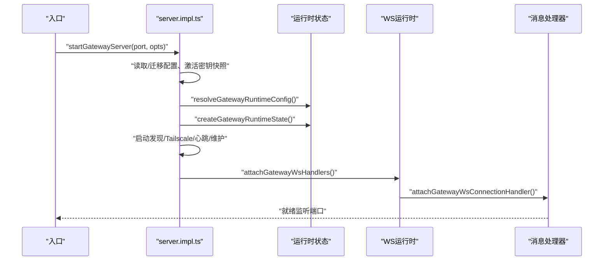
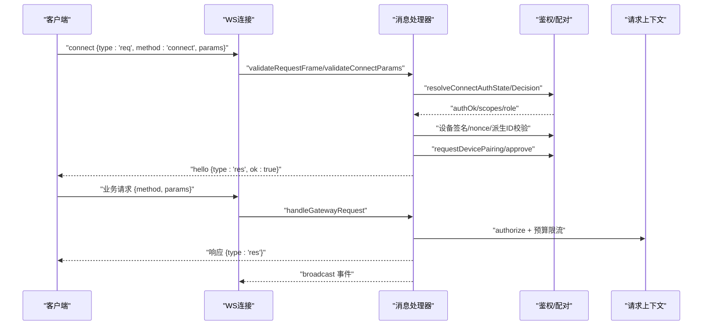
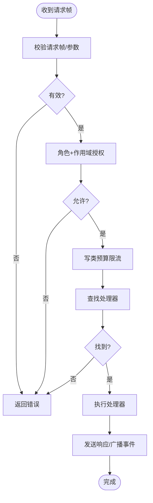
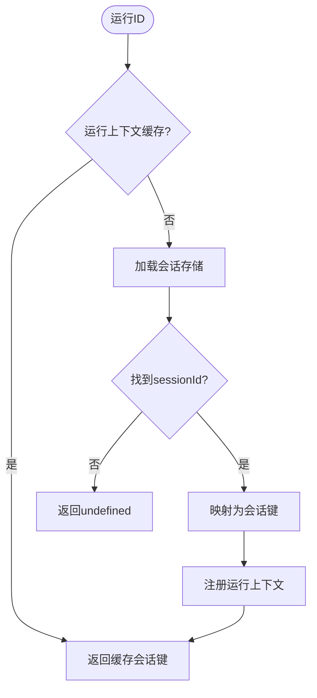
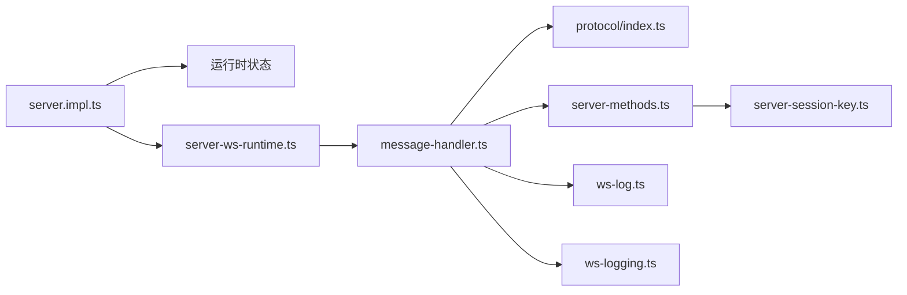

# 网关系统

<cite>
**本文引用的文件**
- [src/gateway/server.impl.ts](file://src/gateway/server.impl.ts)
- [src/gateway/server.ts](file://src/gateway/server.ts)
- [src/gateway/server-ws-runtime.ts](file://src/gateway/server-ws-runtime.ts)
- [src/gateway/server/ws-connection/message-handler.ts](file://src/gateway/server/ws-connection/message-handler.ts)
- [src/gateway/server-methods.ts](file://src/gateway/server-methods.ts)
- [src/gateway/protocol/index.ts](file://src/gateway/protocol/index.ts)
- [src/gateway/ws-logging.ts](file://src/gateway/ws-logging.ts)
- [src/gateway/server-session-key.ts](file://src/gateway/server-session-key.ts)
- [src/gateway/client.ts](file://src/gateway/client.ts)
- [src/gateway/ws-log.ts](file://src/gateway/ws-log.ts)
- [docs/concepts/architecture.md](file://docs/concepts/architecture.md)
- [docs/zh-CN/gateway/protocol.md](file://docs/zh-CN/gateway/protocol.md)
</cite>

## 目录

1. [简介](#简介)
2. [项目结构](#项目结构)
3. [核心组件](#核心组件)
4. [架构总览](#架构总览)
5. [详细组件分析](#详细组件分析)
6. [依赖关系分析](#依赖关系分析)
7. [性能考量](#性能考量)
8. [故障排查指南](#故障排查指南)
9. [结论](#结论)
10. [附录](#附录)

## 简介

本技术文档面向OpenClaw网关系统的开发者与运维人员，系统化阐述网关的架构设计、WebSocket控制平面、消息路由机制与会话管理。文档覆盖启动流程、配置选项、安全机制（含设备身份与配对、TLS与证书固定）、性能优化策略，并解释网关如何协调频道适配器、代理执行、工具调用等核心子系统。同时提供监控、诊断与故障排除方法，以及扩展性、集群部署与高可用配置建议。

## 项目结构

OpenClaw网关以“单主机守护进程”形态运行，统一维护多通道提供商连接，通过WebSocket向控制平面客户端（桌面应用、CLI、Web UI、自动化）与节点（移动端/无头设备）提供一致的控制平面API。HTTP服务承载Canvas与A2UI资源，端口默认18789。

- 关键入口与运行时
  - 启动与运行时装配：[src/gateway/server.impl.ts](file://src/gateway/server.impl.ts)
  - 入口导出：[src/gateway/server.ts](file://src/gateway/server.ts)
  - WebSocket运行时挂载：[src/gateway/server-ws-runtime.ts](file://src/gateway/server-ws-runtime.ts)
- 控制平面与协议
  - 协议校验与模式：[src/gateway/protocol/index.ts](file://src/gateway/protocol/index.ts)
  - 请求处理与授权：[src/gateway/server-methods.ts](file://src/gateway/server-methods.ts)
  - WebSocket消息处理器：[src/gateway/server/ws-connection/message-handler.ts](file://src/gateway/server/ws-connection/message-handler.ts)
- 会话与日志
  - 会话键解析：[src/gateway/server-session-key.ts](file://src/gateway/server-session-key.ts)
  - WebSocket日志样式：[src/gateway/ws-logging.ts](file://src/gateway/ws-logging.ts)
  - 控制平面日志与脱敏：[src/gateway/ws-log.ts](file://src/gateway/ws-log.ts)
- 客户端与协议文档
  - 客户端类型与参数：[src/gateway/client.ts](file://src/gateway/client.ts)
  - 架构概览与协议范围：[docs/concepts/architecture.md](file://docs/concepts/architecture.md)，[docs/zh-CN/gateway/protocol.md](file://docs/zh-CN/gateway/protocol.md)

图表来源

- [src/gateway/server.impl.ts](file://src/gateway/server.impl.ts#L195-L800)
- [src/gateway/server-ws-runtime.ts](file://src/gateway/server-ws-runtime.ts#L9-L56)
- [src/gateway/server/ws-connection/message-handler.ts](file://src/gateway/server/ws-connection/message-handler.ts#L210-L252)
- [src/gateway/protocol/index.ts](file://src/gateway/protocol/index.ts#L1-L640)
- [src/gateway/server-methods.ts](file://src/gateway/server-methods.ts#L1-L150)
- [src/gateway/server-session-key.ts](file://src/gateway/server-session-key.ts#L1-L23)
- [src/gateway/ws-logging.ts](file://src/gateway/ws-logging.ts#L1-L14)
- [src/gateway/ws-log.ts](file://src/gateway/ws-log.ts#L1-L45)

章节来源

- [src/gateway/server.impl.ts](file://src/gateway/server.impl.ts#L195-L800)
- [docs/concepts/architecture.md](file://docs/concepts/architecture.md#L1-L47)

## 核心组件

- 启动与运行时装配
  - 负责加载配置、迁移旧配置、激活密钥运行时快照、初始化插件注册表、构建运行时状态（HTTP/WS、Canvas/A2UI、认证与速率限制、发现与Tailscale暴露、心跳与维护任务、通道管理器等），并挂载WebSocket消息处理器。
- WebSocket运行时
  - 将WebSocketServer与消息处理器桥接，注入认证、速率限制、事件广播、上下文构建器等能力。
- 协议与校验
  - 基于TypeBox Schema与AJV进行请求帧、响应帧、事件帧与各方法参数的严格校验；提供错误格式化与协议版本协商。
- 请求处理与授权
  - 统一的请求分发器，按角色与作用域授权，对写类控制平面操作实施预算限流。
- 消息处理器
  - 处理握手（协议版本、角色、作用域、浏览器来源校验、设备身份与签名验证、配对决策）、鉴权（共享令牌/密码/设备令牌）、事件广播、节点订阅与会话事件转发。
- 会话键解析
  - 在运行时根据会话存储映射解析运行ID到会话键，供代理执行与工具调用使用。
- 日志与脱敏
  - 控制平面日志样式与慢日志阈值；对敏感信息进行脱敏与精简输出。

章节来源

- [src/gateway/server.impl.ts](file://src/gateway/server.impl.ts#L195-L800)
- [src/gateway/server-ws-runtime.ts](file://src/gateway/server-ws-runtime.ts#L9-L56)
- [src/gateway/protocol/index.ts](file://src/gateway/protocol/index.ts#L243-L432)
- [src/gateway/server-methods.ts](file://src/gateway/server-methods.ts#L36-L149)
- [src/gateway/server/ws-connection/message-handler.ts](file://src/gateway/server/ws-connection/message-handler.ts#L210-L252)
- [src/gateway/server-session-key.ts](file://src/gateway/server-session-key.ts#L6-L22)
- [src/gateway/ws-logging.ts](file://src/gateway/ws-logging.ts#L1-L14)
- [src/gateway/ws-log.ts](file://src/gateway/ws-log.ts#L1-L45)

## 架构总览

网关采用“单守护进程 + 多通道适配器”的集中式架构。控制平面通过WebSocket提供统一API，节点与控制平面客户端均接入同一WS服务。HTTP服务承载Canvas与A2UI资源，端口默认18789。网关负责：

- 维护各渠道提供商连接
- 暴露类型化WS API（请求/响应/服务端推送事件）
- 严格的入站帧校验与事件广播
- 设备身份与配对、TLS与证书固定、浏览器来源校验
- 插件化方法扩展、节点订阅与会话事件转发

图表来源

- [docs/concepts/architecture.md](file://docs/concepts/architecture.md#L12-L47)
- [src/gateway/server.impl.ts](file://src/gateway/server.impl.ts#L495-L520)
- [src/gateway/server-ws-runtime.ts](file://src/gateway/server-ws-runtime.ts#L37-L55)

章节来源

- [docs/concepts/architecture.md](file://docs/concepts/architecture.md#L12-L47)

## 详细组件分析

### 启动与运行时装配（startGatewayServer）

- 配置与密钥
  - 读取配置快照、迁移旧配置、持久化变更；激活密钥运行时快照，记录恢复/降级事件。
- 插件与方法集
  - 初始化子代理注册表，加载插件并合并基础方法与通道方法，形成完整网关方法集。
- 运行时状态
  - 解析运行时配置（绑定地址、控制UI、HTTP端点开关、TLS、钩子配置、Canvas/A2UI），创建HTTP/WS服务器、Canvas/A2UI宿主、认证与速率限制器。
- 发现与暴露
  - 启动mDNS/Bonjour发现、Tailscale暴露（可选），并设置更新检查与诊断心跳。
- 维护与健康
  - 启动心跳运行器、通道健康检查、维护定时器（心跳、去重清理、会话清理、聊天运行清理）。
- 事件与通道
  - 订阅代理事件、心跳事件，创建通道管理器，恢复重启前的投递队列。
- WebSocket挂载
  - 注册额外处理器（插件、执行审批、密钥重载），构建上下文，挂载WS处理器。

图表来源

- [src/gateway/server.impl.ts](file://src/gateway/server.impl.ts#L195-L800)
- [src/gateway/server-ws-runtime.ts](file://src/gateway/server-ws-runtime.ts#L37-L55)

章节来源

- [src/gateway/server.impl.ts](file://src/gateway/server.impl.ts#L195-L800)

### WebSocket控制平面（握手、鉴权与消息处理）

- 握手阶段
  - 协议版本协商、角色解析、作用域默认拒绝、浏览器来源校验（可配置允许Host头回退）。
  - 设备身份与签名验证（公钥派生ID、时间戳偏差、nonce匹配、v2/v3签名负载校验）。
  - 未配对设备的配对请求（静默本地自动批准条件、交互式批准流程）。
- 鉴权与速率限制
  - 支持共享令牌/密码/设备令牌；浏览器来源使用非环回豁免的速率限制器。
- 请求处理
  - 统一授权（角色+作用域），写类控制平面操作预算限流；未知方法返回错误。
- 事件广播与节点订阅
  - 广播心跳、健康、代理事件；节点订阅按会话键分发事件。

图表来源

- [src/gateway/server/ws-connection/message-handler.ts](file://src/gateway/server/ws-connection/message-handler.ts#L210-L252)
- [src/gateway/server-methods.ts](file://src/gateway/server-methods.ts#L97-L149)
- [src/gateway/protocol/index.ts](file://src/gateway/protocol/index.ts#L243-L432)

章节来源

- [src/gateway/server/ws-connection/message-handler.ts](file://src/gateway/server/ws-connection/message-handler.ts#L210-L252)
- [src/gateway/server-methods.ts](file://src/gateway/server-methods.ts#L36-L149)

### 协议与消息路由

- 类型与校验
  - 使用TypeBox Schema与AJV对所有帧与参数进行编译期/运行期校验，提供统一错误格式化。
- 方法集与授权
  - 核心方法集合来自各子系统（代理、会话、节点、系统、技能、工具目录、TTS、聊天、健康等），统一授权与预算限流。
- 事件与状态
  - 广播心跳、健康、代理事件、节点事件、更新可用等事件；支持状态版本与去重。

图表来源

- [src/gateway/protocol/index.ts](file://src/gateway/protocol/index.ts#L243-L432)
- [src/gateway/server-methods.ts](file://src/gateway/server-methods.ts#L97-L149)

章节来源

- [src/gateway/protocol/index.ts](file://src/gateway/protocol/index.ts#L243-L432)
- [src/gateway/server-methods.ts](file://src/gateway/server-methods.ts#L36-L149)

### 会话管理与键解析

- 运行ID到会话键映射
  - 优先从代理运行上下文缓存获取；否则查询会话存储，将sessionId映射为会话键，注册上下文以便后续代理执行与工具调用使用。
- 与聊天/代理执行的协作
  - 会话键用于标识运行上下文，确保事件与结果正确路由至对应会话。

图表来源

- [src/gateway/server-session-key.ts](file://src/gateway/server-session-key.ts#L6-L22)

章节来源

- [src/gateway/server-session-key.ts](file://src/gateway/server-session-key.ts#L6-L22)

### 安全机制与TLS

- 设备身份与配对
  - 节点需提供从密钥对派生的稳定设备ID；首次连接需经配对批准（本地直连或主机内网可自动批准）；控制UI在特定配置下可放宽设备身份要求。
- 浏览器来源校验
  - 可配置允许的Origin列表，支持Host头回退的安全开关。
- TLS与证书固定
  - 支持WS/TLS；客户端可固定证书指纹（配置项与CLI参数）。
- 速率限制与防暴力破解
  - 认证阶段使用速率限制器，浏览器来源采用非环回豁免策略。

章节来源

- [docs/zh-CN/gateway/protocol.md](file://docs/zh-CN/gateway/protocol.md#L199-L221)
- [docs/zh-CN/gateway/protocol.md](file://docs/zh-CN/gateway/protocol.md#L245-L256)
- [src/gateway/server/ws-connection/message-handler.ts](file://src/gateway/server/ws-connection/message-handler.ts#L471-L491)
- [src/gateway/server.impl.ts](file://src/gateway/server.impl.ts#L473-L476)

### 客户端与协议范围

- 客户端类型与参数
  - 客户端可声明角色、作用域、能力、命令集、平台、设备家族等元数据；控制UI与Webchat有特殊处理。
- 协议范围
  - 暴露完整网关API（状态、频道、模型、聊天、代理、会话、节点、审批等），具体接口由协议Schema定义。

章节来源

- [src/gateway/client.ts](file://src/gateway/client.ts#L43-L72)
- [docs/zh-CN/gateway/protocol.md](file://docs/zh-CN/gateway/protocol.md#L251-L256)

## 依赖关系分析

- 组件耦合
  - 启动装配与运行时状态高度内聚，负责创建WS/HTTP、认证、速率限制、发现、心跳、通道管理等核心子系统。
  - WebSocket运行时与消息处理器解耦，便于扩展新的处理器与上下文。
  - 协议层与方法层分离，方法实现按职责拆分到各自子模块。
- 外部依赖
  - AJV用于Schema校验；ws用于WebSocket；通道插件通过注册表动态扩展方法集。
- 循环依赖
  - 通过延迟导入与上下文构建器避免循环依赖；方法注册在启动阶段完成。

图表来源

- [src/gateway/server.impl.ts](file://src/gateway/server.impl.ts#L384-L394)
- [src/gateway/server-ws-runtime.ts](file://src/gateway/server-ws-runtime.ts#L37-L55)
- [src/gateway/server/ws-connection/message-handler.ts](file://src/gateway/server/ws-connection/message-handler.ts#L210-L252)
- [src/gateway/protocol/index.ts](file://src/gateway/protocol/index.ts#L1-L640)
- [src/gateway/server-methods.ts](file://src/gateway/server-methods.ts#L66-L95)
- [src/gateway/server-session-key.ts](file://src/gateway/server-session-key.ts#L1-L23)
- [src/gateway/ws-log.ts](file://src/gateway/ws-log.ts#L1-L45)
- [src/gateway/ws-logging.ts](file://src/gateway/ws-logging.ts#L1-L14)

章节来源

- [src/gateway/server.impl.ts](file://src/gateway/server.impl.ts#L384-L394)
- [src/gateway/server-ws-runtime.ts](file://src/gateway/server-ws-runtime.ts#L37-L55)
- [src/gateway/server/ws-connection/message-handler.ts](file://src/gateway/server/ws-connection/message-handler.ts#L210-L252)

## 性能考量

- 速率限制与预算限流
  - 认证阶段使用专用速率限制器，浏览器来源采用非环回豁免策略；写类控制平面操作实施预算限流，避免突发写入。
- 维护与清理
  - 心跳、健康快照刷新、聊天运行清理、会话活跃运行清理、去重清理等定时任务降低内存与CPU占用。
- 日志与慢日志
  - 控制平面日志样式与慢日志阈值可配置，减少高频事件对性能的影响。
- 并发与通道
  - 通道健康检查与远程技能缓存预热，避免频繁探测带来的抖动。

章节来源

- [src/gateway/server.impl.ts](file://src/gateway/server.impl.ts#L603-L620)
- [src/gateway/ws-logging.ts](file://src/gateway/ws-logging.ts#L1-L14)
- [src/gateway/ws-log.ts](file://src/gateway/ws-log.ts#L1-L45)

## 故障排查指南

- 常见握手失败
  - 协议不匹配、角色无效、来源不允许、设备身份缺失或签名无效、nonce不匹配或过期。
- 认证失败
  - 共享令牌/密码/设备令牌无效；浏览器来源被限流；受信任代理配置不当导致误判本地。
- 连接关闭原因
  - 提供关闭码提示映射，结合控制平面日志定位问题。
- 日志与脱敏
  - 控制平面日志支持脱敏与精简输出，便于在生产环境排查；慢日志阈值可调整。

章节来源

- [src/gateway/server/ws-connection/message-handler.ts](file://src/gateway/server/ws-connection/message-handler.ts#L368-L406)
- [src/gateway/server/ws-connection/message-handler.ts](file://src/gateway/server/ws-connection/message-handler.ts#L523-L559)
- [src/gateway/client.ts](file://src/gateway/client.ts#L74-L83)
- [src/gateway/ws-log.ts](file://src/gateway/ws-log.ts#L1-L45)

## 结论

OpenClaw网关以清晰的分层与严格的协议校验为核心，实现了统一的控制平面API与强大的安全性（设备身份、配对、TLS与来源校验）。通过插件化方法扩展、节点订阅与会话键解析，网关高效协调频道适配器、代理执行与工具调用。配合完善的启动流程、性能优化与诊断能力，为开发者提供了可扩展、可观测且易于定制的网关平台。

## 附录

- 扩展性设计
  - 插件注册表支持动态扩展方法集；通道插件通过统一接口接入；Canvas/A2UI可按需启用。
- 集群与高可用
  - 文档未提供多实例集群部署细节；建议通过反向代理与Tailscale暴露实现外网可达与故障转移。
- 配置要点
  - 认证模式、速率限制、控制UI允许的Origin、TLS与证书固定、绑定地址策略等均在运行时配置中体现。

章节来源

- [src/gateway/server.impl.ts](file://src/gateway/server.impl.ts#L384-L394)
- [docs/zh-CN/gateway/protocol.md](file://docs/zh-CN/gateway/protocol.md#L245-L256)
