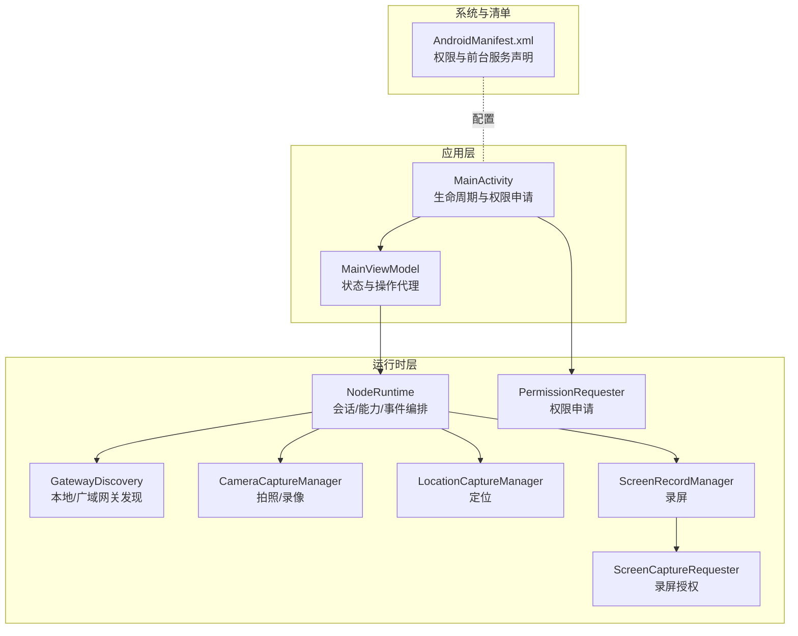
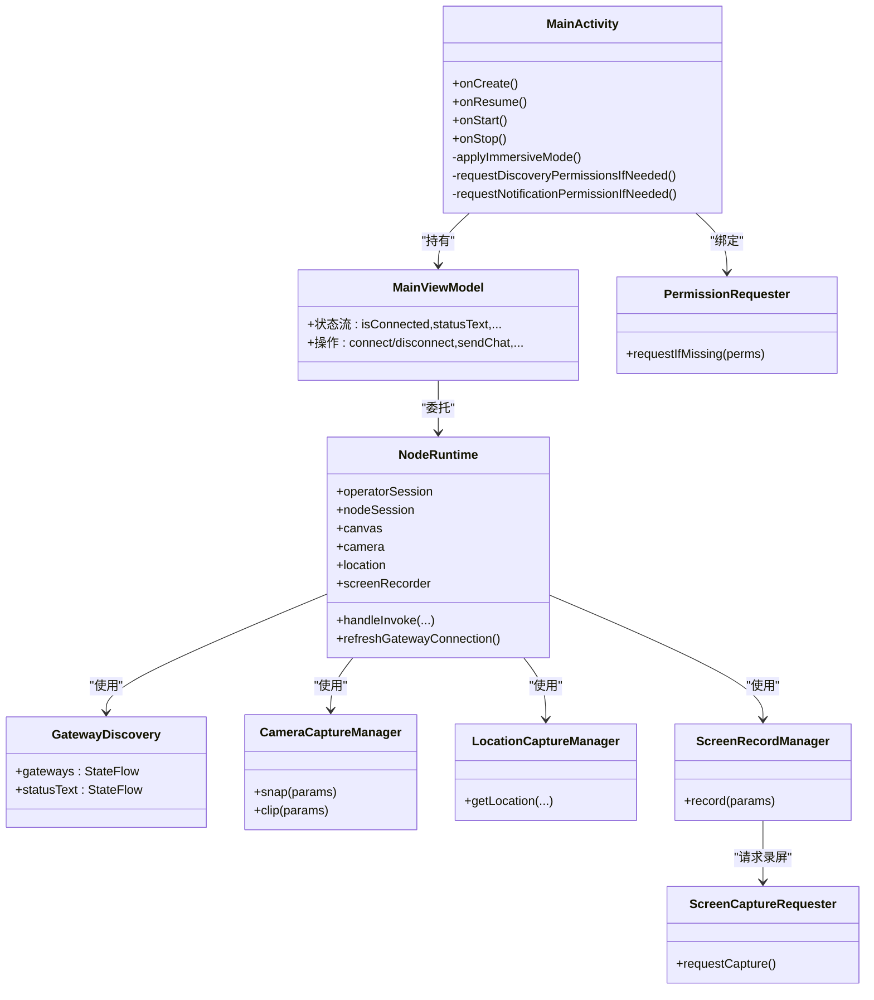
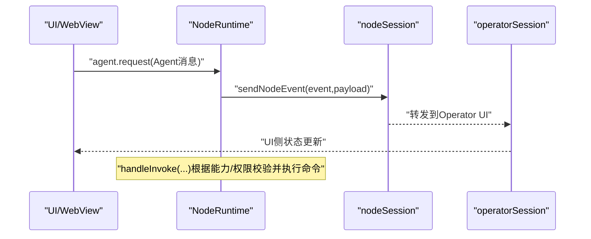
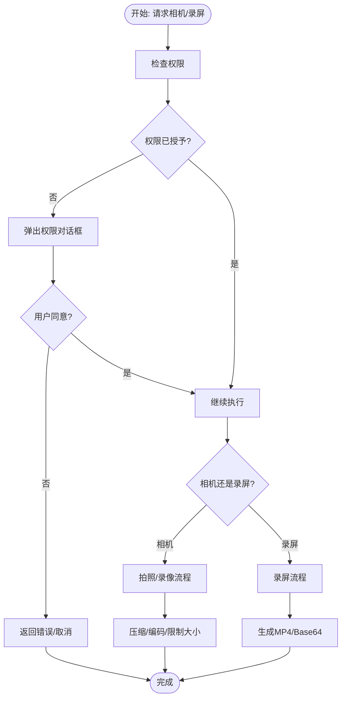
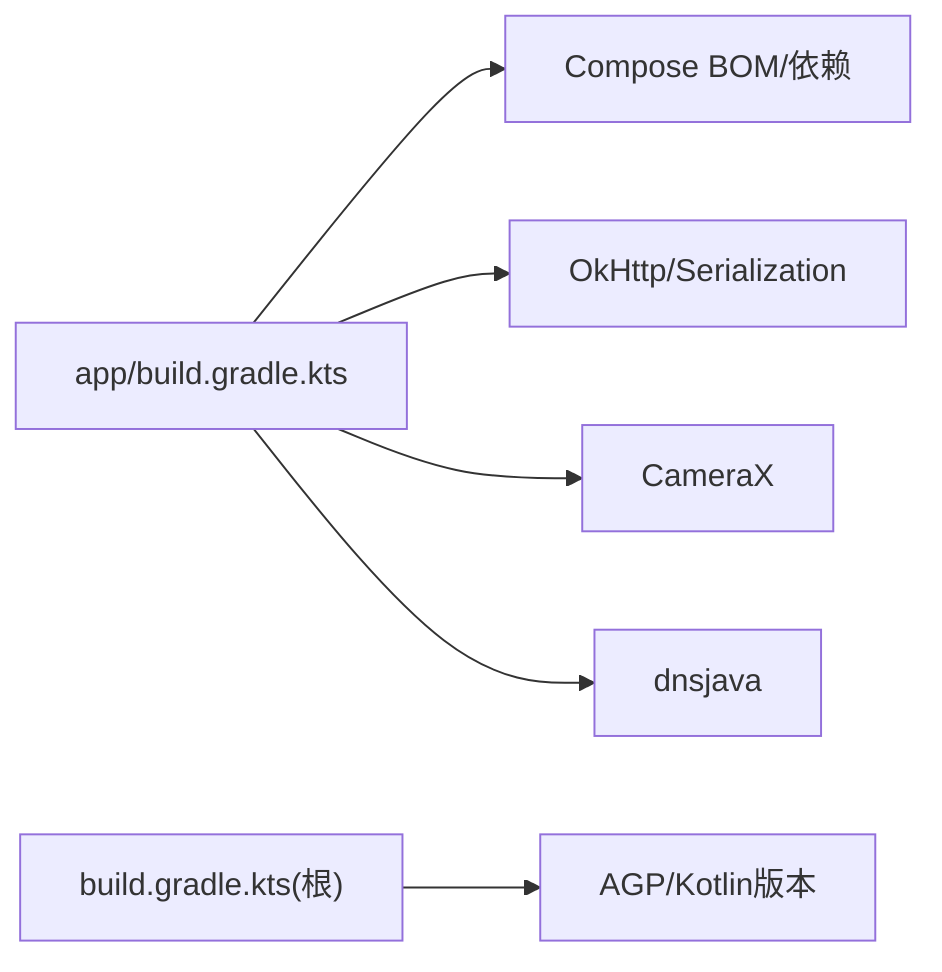

# Android节点

<cite>
**本文引用的文件**
- [apps/android/app/src/main/java/ai/openclaw/android/MainActivity.kt](file://apps/android/app/src/main/java/ai/openclaw/android/MainActivity.kt)
- [apps/android/app/src/main/java/ai/openclaw/android/NodeApp.kt](file://apps/android/app/src/main/java/ai/openclaw/android/NodeApp.kt)
- [apps/android/app/src/main/java/ai/openclaw/android/NodeRuntime.kt](file://apps/android/app/src/main/java/ai/openclaw/android/NodeRuntime.kt)
- [apps/android/app/src/main/java/ai/openclaw/android/MainViewModel.kt](file://apps/android/app/src/main/java/ai/openclaw/android/MainViewModel.kt)
- [apps/android/app/src/main/java/ai/openclaw/android/PermissionRequester.kt](file://apps/android/app/src/main/java/ai/openclaw/android/PermissionRequester.kt)
- [apps/android/app/src/main/java/ai/openclaw/android/ScreenCaptureRequester.kt](file://apps/android/app/src/main/java/ai/openclaw/android/ScreenCaptureRequester.kt)
- [apps/android/app/src/main/java/ai/openclaw/android/node/CameraCaptureManager.kt](file://apps/android/app/src/main/java/ai/openclaw/android/node/CameraCaptureManager.kt)
- [apps/android/app/src/main/java/ai/openclaw/android/node/LocationCaptureManager.kt](file://apps/android/app/src/main/java/ai/openclaw/android/node/LocationCaptureManager.kt)
- [apps/android/app/src/main/java/ai/openclaw/android/node/ScreenRecordManager.kt](file://apps/android/app/src/main/java/ai/openclaw/android/node/ScreenRecordManager.kt)
- [apps/android/app/src/main/java/ai/openclaw/android/gateway/GatewayDiscovery.kt](file://apps/android/app/src/main/java/ai/openclaw/android/gateway/GatewayDiscovery.kt)
- [apps/android/app/src/main/AndroidManifest.xml](file://apps/android/app/src/main/AndroidManifest.xml)
- [apps/android/app/build.gradle.kts](file://apps/android/app/build.gradle.kts)
- [apps/android/build.gradle.kts](file://apps/android/build.gradle.kts)
</cite>

## 目录

1. [简介](#简介)
2. [项目结构](#项目结构)
3. [核心组件](#核心组件)
4. [架构总览](#架构总览)
5. [详细组件分析](#详细组件分析)
6. [依赖关系分析](#依赖关系分析)
7. [性能与资源管理](#性能与资源管理)
8. [故障排查指南](#故障排查指南)
9. [结论](#结论)
10. [附录：开发与构建指南](#附录开发与构建指南)

## 简介

本文件面向OpenClaw Android节点（Node）的技术文档，聚焦于Android端架构设计、权限系统与生命周期管理，以及相机、位置、语音识别与后台服务等Android特有能力。文档同时覆盖节点配对机制、安全认证与设备权限申请流程，并提供Android应用开发指南、Gradle构建配置与APK签名流程建议，以及Android版本兼容性、内存管理与电池优化的最佳实践。

## 项目结构

Android节点位于apps/android目录，采用标准Android应用结构，核心入口为MainActivity，业务运行时由NodeRuntime统一编排，通过MainViewModel向UI层暴露状态与操作接口；各能力模块（相机、位置、屏幕录制、网关发现）以管理器形式注入NodeRuntime。

图表来源

- [apps/android/app/src/main/java/ai/openclaw/android/MainActivity.kt](file://apps/android/app/src/main/java/ai/openclaw/android/MainActivity.kt#L30-L65)
- [apps/android/app/src/main/java/ai/openclaw/android/MainViewModel.kt](file://apps/android/app/src/main/java/ai/openclaw/android/MainViewModel.kt#L13-L66)
- [apps/android/app/src/main/java/ai/openclaw/android/NodeRuntime.kt](file://apps/android/app/src/main/java/ai/openclaw/android/NodeRuntime.kt#L61-L120)
- [apps/android/app/src/main/java/ai/openclaw/android/gateway/GatewayDiscovery.kt](file://apps/android/app/src/main/java/ai/openclaw/android/gateway/GatewayDiscovery.kt#L47-L97)
- [apps/android/app/src/main/java/ai/openclaw/android/node/CameraCaptureManager.kt](file://apps/android/app/src/main/java/ai/openclaw/android/node/CameraCaptureManager.kt#L37-L49)
- [apps/android/app/src/main/java/ai/openclaw/android/node/LocationCaptureManager.kt](file://apps/android/app/src/main/java/ai/openclaw/android/node/LocationCaptureManager.kt#L19-L27)
- [apps/android/app/src/main/java/ai/openclaw/android/node/ScreenRecordManager.kt](file://apps/android/app/src/main/java/ai/openclaw/android/node/ScreenRecordManager.kt#L16-L28)
- [apps/android/app/src/main/AndroidManifest.xml](file://apps/android/app/src/main/AndroidManifest.xml#L1-L50)

章节来源

- [apps/android/app/src/main/java/ai/openclaw/android/MainActivity.kt](file://apps/android/app/src/main/java/ai/openclaw/android/MainActivity.kt#L25-L131)
- [apps/android/app/src/main/java/ai/openclaw/android/MainViewModel.kt](file://apps/android/app/src/main/java/ai/openclaw/android/MainViewModel.kt#L13-L175)
- [apps/android/app/src/main/java/ai/openclaw/android/NodeRuntime.kt](file://apps/android/app/src/main/java/ai/openclaw/android/NodeRuntime.kt#L61-L390)
- [apps/android/app/src/main/AndroidManifest.xml](file://apps/android/app/src/main/AndroidManifest.xml#L1-L50)

## 核心组件

- 应用入口与生命周期
  - MainActivity负责沉浸式窗口、权限申请、通知权限、前台服务启动、权限请求器与录屏请求器绑定、以及屏幕常亮控制。
- 运行时编排
  - NodeRuntime集中管理网关会话（operator与node）、Canvas控制器、相机/位置/录屏/SMS能力、语音唤醒与通话模式、状态流与用户偏好。
- 视图模型
  - MainViewModel将NodeRuntime的状态与操作映射到UI层，便于Compose使用。
- 权限与录屏
  - PermissionRequester统一处理运行时权限弹窗与设置页引导；ScreenCaptureRequester处理系统录屏授权。
- 能力管理器
  - CameraCaptureManager：拍照/视频（含EXIF旋转与压缩限制）。
  - LocationCaptureManager：基于GPS/网络的定位，支持缓存与超时。
  - ScreenRecordManager：录屏并输出MP4，可选音频。

章节来源

- [apps/android/app/src/main/java/ai/openclaw/android/MainActivity.kt](file://apps/android/app/src/main/java/ai/openclaw/android/MainActivity.kt#L30-L131)
- [apps/android/app/src/main/java/ai/openclaw/android/NodeRuntime.kt](file://apps/android/app/src/main/java/ai/openclaw/android/NodeRuntime.kt#L61-L390)
- [apps/android/app/src/main/java/ai/openclaw/android/MainViewModel.kt](file://apps/android/app/src/main/java/ai/openclaw/android/MainViewModel.kt#L13-L175)
- [apps/android/app/src/main/java/ai/openclaw/android/PermissionRequester.kt](file://apps/android/app/src/main/java/ai/openclaw/android/PermissionRequester.kt#L22-L85)
- [apps/android/app/src/main/java/ai/openclaw/android/ScreenCaptureRequester.kt](file://apps/android/app/src/main/java/ai/openclaw/android/ScreenCaptureRequester.kt#L20-L51)
- [apps/android/app/src/main/java/ai/openclaw/android/node/CameraCaptureManager.kt](file://apps/android/app/src/main/java/ai/openclaw/android/node/CameraCaptureManager.kt#L75-L198)
- [apps/android/app/src/main/java/ai/openclaw/android/node/LocationCaptureManager.kt](file://apps/android/app/src/main/java/ai/openclaw/android/node/LocationCaptureManager.kt#L22-L62)
- [apps/android/app/src/main/java/ai/openclaw/android/node/ScreenRecordManager.kt](file://apps/android/app/src/main/java/ai/openclaw/android/node/ScreenRecordManager.kt#L30-L123)

## 架构总览

Android节点采用“运行时编排 + 能力管理器 + 网关会话”的分层架构。NodeRuntime作为中枢，聚合所有能力并通过两个GatewaySession分别与Operator UI与Node进行双向通信；UI通过MainViewModel与NodeRuntime交互；权限与录屏通过专用请求器在需要时触发系统对话框。

图表来源

- [apps/android/app/src/main/java/ai/openclaw/android/MainActivity.kt](file://apps/android/app/src/main/java/ai/openclaw/android/MainActivity.kt#L25-L131)
- [apps/android/app/src/main/java/ai/openclaw/android/MainViewModel.kt](file://apps/android/app/src/main/java/ai/openclaw/android/MainViewModel.kt#L13-L66)
- [apps/android/app/src/main/java/ai/openclaw/android/NodeRuntime.kt](file://apps/android/app/src/main/java/ai/openclaw/android/NodeRuntime.kt#L110-L214)
- [apps/android/app/src/main/java/ai/openclaw/android/gateway/GatewayDiscovery.kt](file://apps/android/app/src/main/java/ai/openclaw/android/gateway/GatewayDiscovery.kt#L47-L64)
- [apps/android/app/src/main/java/ai/openclaw/android/node/CameraCaptureManager.kt](file://apps/android/app/src/main/java/ai/openclaw/android/node/CameraCaptureManager.kt#L75-L137)
- [apps/android/app/src/main/java/ai/openclaw/android/node/LocationCaptureManager.kt](file://apps/android/app/src/main/java/ai/openclaw/android/node/LocationCaptureManager.kt#L22-L61)
- [apps/android/app/src/main/java/ai/openclaw/android/node/ScreenRecordManager.kt](file://apps/android/app/src/main/java/ai/openclaw/android/node/ScreenRecordManager.kt#L30-L122)
- [apps/android/app/src/main/java/ai/openclaw/android/PermissionRequester.kt](file://apps/android/app/src/main/java/ai/openclaw/android/PermissionRequester.kt#L22-L85)
- [apps/android/app/src/main/java/ai/openclaw/android/ScreenCaptureRequester.kt](file://apps/android/app/src/main/java/ai/openclaw/android/ScreenCaptureRequester.kt#L20-L51)

## 详细组件分析

### 生命周期与权限系统

- 沉浸式窗口与焦点管理：在onCreate与onWindowFocusChanged中调用沉浸式窗口隐藏系统栏。
- 权限申请策略：
  - Android 13+：申请NEARBY_WIFI_DEVICES与POST_NOTIFICATIONS。
  - Android 13以下：申请ACCESS_FINE_LOCATION。
- 前台服务：启动NodeForegroundService，声明数据同步、麦克风、媒体投影等前台服务类型。
- 屏幕常亮：根据preventSleep状态动态设置FLAG_KEEP_SCREEN_ON。

章节来源

- [apps/android/app/src/main/java/ai/openclaw/android/MainActivity.kt](file://apps/android/app/src/main/java/ai/openclaw/android/MainActivity.kt#L30-L131)
- [apps/android/app/src/main/AndroidManifest.xml](file://apps/android/app/src/main/AndroidManifest.xml#L36-L39)

### NodeRuntime：会话、能力与事件编排

- 会话与状态
  - 维护operatorSession与nodeSession，分别用于UI与节点通信；维护连接状态、服务器名、远端地址、主会话键等状态流。
- 能力与命令
  - 动态构建capabilities与commands，依据用户偏好与权限决定是否暴露相机、短信、位置、语音唤醒、屏幕录制等能力。
- 事件处理
  - 处理来自网关的事件（如voicewake.changed），并分发给talk模式与聊天控制器。
- A2UI集成
  - 解析并校验A2UI消息格式，确保Canvas端只接收v0.8协议的消息；支持重置与推送。
- 错误与权限检查
  - 在handleInvoke中对后台不可用、权限缺失、禁用能力等情况返回标准化错误码。

图表来源

- [apps/android/app/src/main/java/ai/openclaw/android/NodeRuntime.kt](file://apps/android/app/src/main/java/ai/openclaw/android/NodeRuntime.kt#L652-L722)
- [apps/android/app/src/main/java/ai/openclaw/android/NodeRuntime.kt](file://apps/android/app/src/main/java/ai/openclaw/android/NodeRuntime.kt#L828-L1062)

章节来源

- [apps/android/app/src/main/java/ai/openclaw/android/NodeRuntime.kt](file://apps/android/app/src/main/java/ai/openclaw/android/NodeRuntime.kt#L114-L214)
- [apps/android/app/src/main/java/ai/openclaw/android/NodeRuntime.kt](file://apps/android/app/src/main/java/ai/openclaw/android/NodeRuntime.kt#L452-L487)
- [apps/android/app/src/main/java/ai/openclaw/android/NodeRuntime.kt](file://apps/android/app/src/main/java/ai/openclaw/android/NodeRuntime.kt#L753-L769)
- [apps/android/app/src/main/java/ai/openclaw/android/NodeRuntime.kt](file://apps/android/app/src/main/java/ai/openclaw/android/NodeRuntime.kt#L1112-L1140)

### 相机访问与屏幕录制

- 相机
  - 支持前置/后置选择、JPEG质量与最大宽度限制、EXIF方向旋转、Base64编码与5MB上限保护。
  - 录像支持包含音频（需麦克风权限）。
- 屏幕录制
  - 通过MediaProjection获取录屏授权，创建VirtualDisplay并录制MP4，支持可选音频通道与帧率/比特率估算。

图表来源

- [apps/android/app/src/main/java/ai/openclaw/android/node/CameraCaptureManager.kt](file://apps/android/app/src/main/java/ai/openclaw/android/node/CameraCaptureManager.kt#L75-L198)
- [apps/android/app/src/main/java/ai/openclaw/android/node/ScreenRecordManager.kt](file://apps/android/app/src/main/java/ai/openclaw/android/node/ScreenRecordManager.kt#L30-L123)

章节来源

- [apps/android/app/src/main/java/ai/openclaw/android/node/CameraCaptureManager.kt](file://apps/android/app/src/main/java/ai/openclaw/android/node/CameraCaptureManager.kt#L75-L198)
- [apps/android/app/src/main/java/ai/openclaw/android/node/ScreenRecordManager.kt](file://apps/android/app/src/main/java/ai/openclaw/android/node/ScreenRecordManager.kt#L30-L123)

### 位置服务

- 定位参数解析：支持maxAgeMs、timeoutMs、desiredAccuracy（precise/coarse）。
- 权限与策略：
  - 后台定位要求Always模式且具备ACCESS_BACKGROUND_LOCATION权限。
  - 精确定位需ACCESS_FINE_LOCATION。
- 缓存优先：优先使用最近已知位置，若超过maxAge则发起实时定位请求。

章节来源

- [apps/android/app/src/main/java/ai/openclaw/android/node/LocationCaptureManager.kt](file://apps/android/app/src/main/java/ai/openclaw/android/node/LocationCaptureManager.kt#L22-L62)
- [apps/android/app/src/main/java/ai/openclaw/android/NodeRuntime.kt](file://apps/android/app/src/main/java/ai/openclaw/android/NodeRuntime.kt#L976-L1028)

### 网络与配对机制

- 网关发现
  - 使用DNS-SD（本地）与Unicast DNS（广域）两种方式扫描\_openclaw-gw.\_tcp.服务，解析TXT元数据（显示名、端口、TLS指纹等）。
  - 自动连接策略：优先手动配置，其次上次发现的稳定ID，再次按名称排序选择。
- TLS指纹与信任
  - 支持从网关提示或本地存储加载TLS指纹，允许首次信任（TOFU）策略。
- 用户代理与客户端信息
  - 构建包含平台、版本、设备型号等信息的User-Agent与客户端描述。

章节来源

- [apps/android/app/src/main/java/ai/openclaw/android/gateway/GatewayDiscovery.kt](file://apps/android/app/src/main/java/ai/openclaw/android/gateway/GatewayDiscovery.kt#L47-L97)
- [apps/android/app/src/main/java/ai/openclaw/android/gateway/GatewayDiscovery.kt](file://apps/android/app/src/main/java/ai/openclaw/android/gateway/GatewayDiscovery.kt#L221-L293)
- [apps/android/app/src/main/java/ai/openclaw/android/NodeRuntime.kt](file://apps/android/app/src/main/java/ai/openclaw/android/NodeRuntime.kt#L512-L547)
- [apps/android/app/src/main/java/ai/openclaw/android/NodeRuntime.kt](file://apps/android/app/src/main/java/ai/openclaw/android/NodeRuntime.kt#L616-L650)

### 安全认证与设备权限

- 设备身份与认证
  - 通过DeviceIdentityStore与DeviceAuthStore持久化实例ID、显示名与网关认证凭据。
- 权限申请
  - PermissionRequester统一处理权限弹窗、理由说明与设置页跳转。
  - ScreenCaptureRequester处理录屏授权请求。
- 通知权限
  - Android 13+需申请POST_NOTIFICATIONS权限。

章节来源

- [apps/android/app/src/main/java/ai/openclaw/android/NodeRuntime.kt](file://apps/android/app/src/main/java/ai/openclaw/android/NodeRuntime.kt#L114-L118)
- [apps/android/app/src/main/java/ai/openclaw/android/NodeRuntime.kt](file://apps/android/app/src/main/java/ai/openclaw/android/NodeRuntime.kt#L66-L67)
- [apps/android/app/src/main/java/ai/openclaw/android/PermissionRequester.kt](file://apps/android/app/src/main/java/ai/openclaw/android/PermissionRequester.kt#L33-L85)
- [apps/android/app/src/main/java/ai/openclaw/android/ScreenCaptureRequester.kt](file://apps/android/app/src/main/java/ai/openclaw/android/ScreenCaptureRequester.kt#L38-L51)
- [apps/android/app/src/main/java/ai/openclaw/android/MainActivity.kt](file://apps/android/app/src/main/java/ai/openclaw/android/MainActivity.kt#L119-L129)

## 依赖关系分析

- Gradle插件与版本
  - 应用级：com.android.application、kotlin-android、kotlin-compose、kotlin-serialization。
  - 全局：统一管理Android Gradle Plugin与Kotlin版本。
- 依赖矩阵（关键）
  - Compose BOM、Core KTX、Lifecycle Runtime KTX、Activity Compose、Material3、Navigation Compose、OkHttp、Kotlinx Serialization、Security Crypto、CameraX、dnsjava。
- 打包与命名
  - 输出文件名包含版本号与构建类型，便于分发与回溯。

图表来源

- [apps/android/app/build.gradle.kts](file://apps/android/app/build.gradle.kts#L80-L124)
- [apps/android/build.gradle.kts](file://apps/android/build.gradle.kts#L1-L7)

章节来源

- [apps/android/app/build.gradle.kts](file://apps/android/app/build.gradle.kts#L10-L78)
- [apps/android/build.gradle.kts](file://apps/android/build.gradle.kts#L1-L7)

## 性能与资源管理

- 协程与调度
  - 使用SupervisorJob + IO线程池，避免单点异常影响其他任务；UI相关操作切换至Main线程。
- 资源释放
  - 录屏完成后释放MediaRecorder、VirtualDisplay与投影；临时文件及时删除。
- 图像处理
  - JPEG压缩采用二分策略，确保payload不超过5MB；按需缩放与旋转。
- 电池优化
  - 提供preventSleep选项，必要时保持屏幕常亮；后台能力受权限与模式限制，避免无谓唤醒。
- 内存管理
  - 对中间Bitmap进行回收；避免在主线程执行耗时IO；使用StateFlow减少重复计算。

章节来源

- [apps/android/app/src/main/java/ai/openclaw/android/NodeRuntime.kt](file://apps/android/app/src/main/java/ai/openclaw/android/NodeRuntime.kt#L63-L64)
- [apps/android/app/src/main/java/ai/openclaw/android/node/CameraCaptureManager.kt](file://apps/android/app/src/main/java/ai/openclaw/android/node/CameraCaptureManager.kt#L106-L137)
- [apps/android/app/src/main/java/ai/openclaw/android/node/ScreenRecordManager.kt](file://apps/android/app/src/main/java/ai/openclaw/android/node/ScreenRecordManager.kt#L103-L123)

## 故障排查指南

- 权限相关
  - 相机/录音/SMS/录屏权限未授予：通过PermissionRequester与ScreenCaptureRequester重新申请；必要时引导至设置页。
- 定位失败
  - 未启用定位服务或权限不足；后台定位需Always与后台定位权限；可调整desiredAccuracy与timeout。
- 网关连接
  - TLS指纹不匹配或未配置：检查resolveTlsParams逻辑与本地存储；确认网关提示或手动TLS开关。
- 后台命令不可用
  - Canvas/相机/屏幕命令需前台运行；检查isForeground状态与错误码NODE_BACKGROUND_UNAVAILABLE。
- A2UI消息格式
  - 确保仅传入v0.8消息，且每行仅包含一个动作键；校验失败将返回INVALID_REQUEST。

章节来源

- [apps/android/app/src/main/java/ai/openclaw/android/PermissionRequester.kt](file://apps/android/app/src/main/java/ai/openclaw/android/PermissionRequester.kt#L87-L114)
- [apps/android/app/src/main/java/ai/openclaw/android/NodeRuntime.kt](file://apps/android/app/src/main/java/ai/openclaw/android/NodeRuntime.kt#L835-L841)
- [apps/android/app/src/main/java/ai/openclaw/android/NodeRuntime.kt](file://apps/android/app/src/main/java/ai/openclaw/android/NodeRuntime.kt#L976-L995)
- [apps/android/app/src/main/java/ai/openclaw/android/NodeRuntime.kt](file://apps/android/app/src/main/java/ai/openclaw/android/NodeRuntime.kt#L1185-L1199)

## 结论

OpenClaw Android节点通过清晰的分层架构与严格的权限/生命周期管理，实现了在Android平台上的可靠运行。NodeRuntime作为中枢，将网关会话、UI与各类硬件能力整合；权限与录屏请求器保障用户体验与合规；网关发现与TLS指纹机制提供了灵活而安全的配对方案。结合本文提供的性能与故障排查建议，可进一步提升稳定性与可用性。

## 附录：开发与构建指南

- Android版本与SDK
  - compileSdk/targetSdk：36；minSdk：31（Android 12+）。
- 构建配置要点
  - 启用Compose与BuildConfig；关闭混淆；排除特定META-INF条目；统一JVM目标为17。
  - 输出文件名包含版本与构建类型，便于自动化分发。
- 权限清单
  - INTERNET、网络状态、前台服务、通知、Wi-Fi发现、位置、相机、录音、短信、电话等。
- 前台服务
  - 声明数据同步、麦克风、媒体投影三类前台服务类型。
- APK签名流程（建议）
  - 使用Gradle Signing Config定义密钥库路径、别名与密码；在release构建类型中启用signingConfig；在CI中安全注入密钥信息；发布前进行静态扫描与完整性校验。

章节来源

- [apps/android/app/build.gradle.kts](file://apps/android/app/build.gradle.kts#L10-L58)
- [apps/android/app/build.gradle.kts](file://apps/android/app/build.gradle.kts#L60-L72)
- [apps/android/app/src/main/AndroidManifest.xml](file://apps/android/app/src/main/AndroidManifest.xml#L36-L39)
