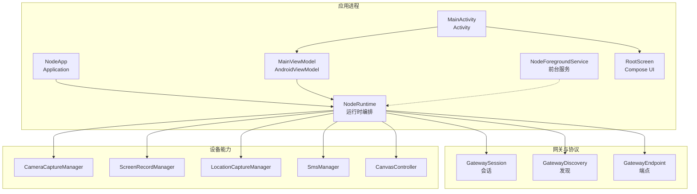
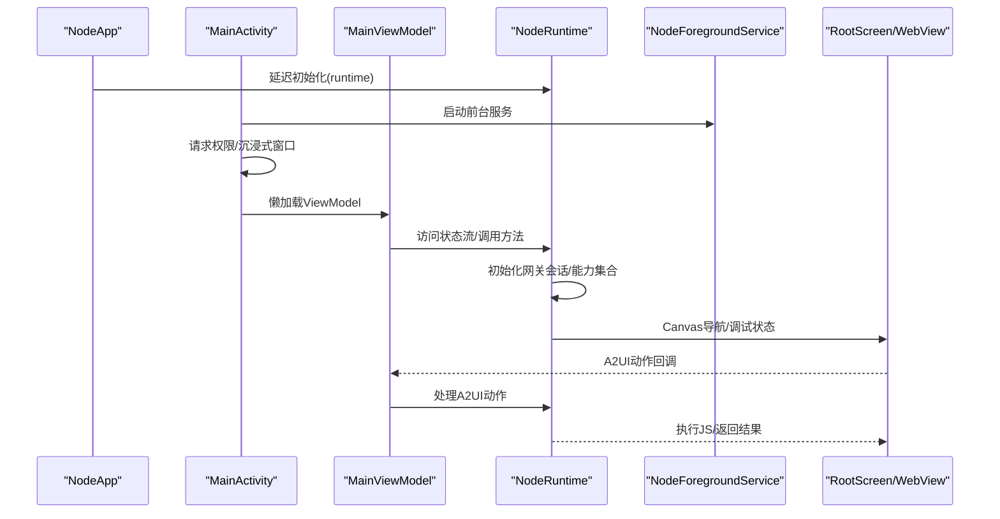
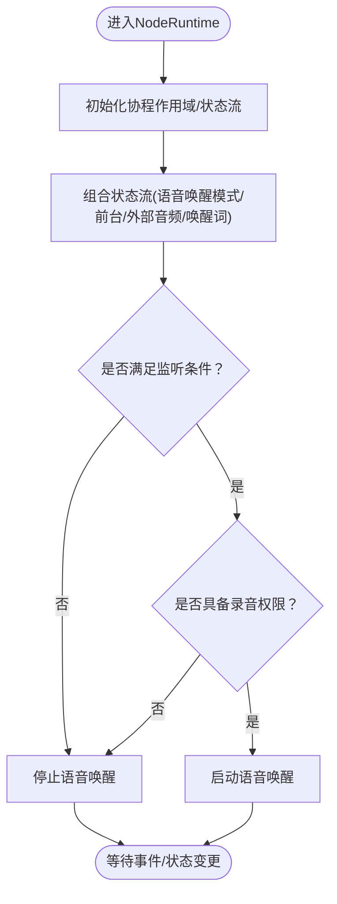
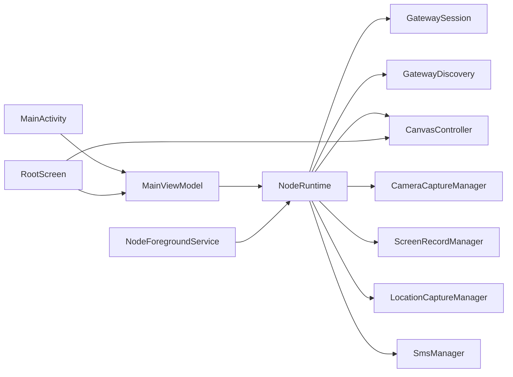

# 应用架构设计

<cite>
**本文引用的文件**
- [apps/android/app/src/main/java/ai/openclaw/android/NodeApp.kt](file://apps/android/app/src/main/java/ai/openclaw/android/NodeApp.kt)
- [apps/android/app/src/main/java/ai/openclaw/android/MainActivity.kt](file://apps/android/app/src/main/java/ai/openclaw/android/MainActivity.kt)
- [apps/android/app/src/main/java/ai/openclaw/android/MainViewModel.kt](file://apps/android/app/src/main/java/ai/openclaw/android/MainViewModel.kt)
- [apps/android/app/src/main/java/ai/openclaw/android/NodeRuntime.kt](file://apps/android/app/src/main/java/ai/openclaw/android/NodeRuntime.kt)
- [apps/android/app/src/main/java/ai/openclaw/android/NodeForegroundService.kt](file://apps/android/app/src/main/java/ai/openclaw/android/NodeForegroundService.kt)
- [apps/android/app/src/main/java/ai/openclaw/android/ui/RootScreen.kt](file://apps/android/app/src/main/java/ai/openclaw/android/ui/RootScreen.kt)
- [apps/android/app/src/main/java/ai/openclaw/android/CameraHudState.kt](file://apps/android/app/src/main/java/ai/openclaw/android/CameraHudState.kt)
- [apps/android/app/src/main/java/ai/openclaw/android/LocationMode.kt](file://apps/android/app/src/main/java/ai/openclaw/android/LocationMode.kt)
- [apps/android/app/src/main/java/ai/openclaw/android/VoiceWakeMode.kt](file://apps/android/app/src/main/java/ai/openclaw/android/VoiceWakeMode.kt)
- [apps/android/app/src/main/AndroidManifest.xml](file://apps/android/app/src/main/AndroidManifest.xml)
- [apps/android/app/build.gradle.kts](file://apps/android/app/build.gradle.kts)
- [apps/android/app/src/main/java/ai/openclaw/android/chat/ChatController.kt](file://apps/android/app/src/main/java/ai/openclaw/android/chat/ChatController.kt)
</cite>

## 目录

1. [简介](#简介)
2. [项目结构](#项目结构)
3. [核心组件](#核心组件)
4. [架构总览](#架构总览)
5. [组件详解](#组件详解)
6. [依赖关系分析](#依赖关系分析)
7. [性能与内存优化](#性能与内存优化)
8. [故障排查指南](#故障排查指南)
9. [结论](#结论)
10. [附录](#附录)

## 简介

本文件面向OpenClaw Android应用，系统性阐述其架构设计与实现要点，重点覆盖以下方面：

- 应用入口与生命周期：NodeApp主类、MainActivity活动管理、MainViewModel数据绑定层
- 运行时环境：NodeRuntime初始化流程、组件注册机制、资源管理策略
- 启动流程、权限与通知、前台服务、UI渲染与事件桥接
- 依赖注入与模块化设计原则
- 性能与内存优化建议
- 架构图与组件交互示意

## 项目结构

Android应用位于apps/android/app目录，采用Kotlin语言与Jetpack Compose UI，配合WebView承载Canvas/A2UI能力，并通过NodeRuntime统一编排网关连接、设备能力（相机、位置、屏幕录制、短信）与语音唤醒/对话功能。

图表来源

- [apps/android/app/src/main/java/ai/openclaw/android/NodeApp.kt](file://apps/android/app/src/main/java/ai/openclaw/android/NodeApp.kt#L6-L26)
- [apps/android/app/src/main/java/ai/openclaw/android/MainActivity.kt](file://apps/android/app/src/main/java/ai/openclaw/android/MainActivity.kt#L25-L65)
- [apps/android/app/src/main/java/ai/openclaw/android/MainViewModel.kt](file://apps/android/app/src/main/java/ai/openclaw/android/MainViewModel.kt#L13-L69)
- [apps/android/app/src/main/java/ai/openclaw/android/NodeRuntime.kt](file://apps/android/app/src/main/java/ai/openclaw/android/NodeRuntime.kt#L61-L389)
- [apps/android/app/src/main/java/ai/openclaw/android/NodeForegroundService.kt](file://apps/android/app/src/main/java/ai/openclaw/android/NodeForegroundService.kt#L23-L84)
- [apps/android/app/src/main/java/ai/openclaw/android/ui/RootScreen.kt](file://apps/android/app/src/main/java/ai/openclaw/android/ui/RootScreen.kt#L72-L290)

章节来源

- [apps/android/app/build.gradle.kts](file://apps/android/app/build.gradle.kts#L10-L78)
- [apps/android/app/src/main/AndroidManifest.xml](file://apps/android/app/src/main/AndroidManifest.xml#L25-L48)

## 核心组件

- NodeApp：应用级Application，负责严格模式调试与延迟初始化NodeRuntime
- MainActivity：应用入口Activity，负责沉浸式窗口、权限请求、前台服务启动、ViewModel绑定与UI渲染
- MainViewModel：AndroidViewModel，作为UI与NodeRuntime之间的薄层代理，暴露状态流与命令方法
- NodeRuntime：核心运行时，统一管理网关连接、设备能力、语音唤醒、Canvas/A2UI、聊天与通话等子系统
- NodeForegroundService：前台服务，持续展示连接状态通知并根据状态动态调整前台类型
- RootScreen：Compose根界面，承载WebView Canvas、状态浮层、底部弹窗与操作按钮

章节来源

- [apps/android/app/src/main/java/ai/openclaw/android/NodeApp.kt](file://apps/android/app/src/main/java/ai/openclaw/android/NodeApp.kt#L6-L26)
- [apps/android/app/src/main/java/ai/openclaw/android/MainActivity.kt](file://apps/android/app/src/main/java/ai/openclaw/android/MainActivity.kt#L25-L131)
- [apps/android/app/src/main/java/ai/openclaw/android/MainViewModel.kt](file://apps/android/app/src/main/java/ai/openclaw/android/MainViewModel.kt#L13-L175)
- [apps/android/app/src/main/java/ai/openclaw/android/NodeRuntime.kt](file://apps/android/app/src/main/java/ai/openclaw/android/NodeRuntime.kt#L61-L389)
- [apps/android/app/src/main/java/ai/openclaw/android/NodeForegroundService.kt](file://apps/android/app/src/main/java/ai/openclaw/android/NodeForegroundService.kt#L23-L84)
- [apps/android/app/src/main/java/ai/openclaw/android/ui/RootScreen.kt](file://apps/android/app/src/main/java/ai/openclaw/android/ui/RootScreen.kt#L72-L290)

## 架构总览

下图展示了从应用启动到运行时编排、UI渲染与设备能力调用的全链路交互：

图表来源

- [apps/android/app/src/main/java/ai/openclaw/android/NodeApp.kt](file://apps/android/app/src/main/java/ai/openclaw/android/NodeApp.kt#L6-L26)
- [apps/android/app/src/main/java/ai/openclaw/android/MainActivity.kt](file://apps/android/app/src/main/java/ai/openclaw/android/MainActivity.kt#L30-L65)
- [apps/android/app/src/main/java/ai/openclaw/android/MainViewModel.kt](file://apps/android/app/src/main/java/ai/openclaw/android/MainViewModel.kt#L13-L69)
- [apps/android/app/src/main/java/ai/openclaw/android/NodeRuntime.kt](file://apps/android/app/src/main/java/ai/openclaw/android/NodeRuntime.kt#L305-L389)
- [apps/android/app/src/main/java/ai/openclaw/android/NodeForegroundService.kt](file://apps/android/app/src/main/java/ai/openclaw/android/NodeForegroundService.kt#L35-L63)
- [apps/android/app/src/main/java/ai/openclaw/android/ui/RootScreen.kt](file://apps/android/app/src/main/java/ai/openclaw/android/ui/RootScreen.kt#L317-L410)

## 组件详解

### NodeApp：应用级入口与严格模式

- 职责
  - 在DEBUG构建中启用StrictMode线程与虚拟机策略，便于早期发现主线程阻塞与违规访问
  - 提供懒加载的NodeRuntime实例，避免在Application构造阶段进行重操作
- 设计要点
  - 将NodeRuntime与Application生命周期解耦，通过惰性委托按需创建
  - 仅承担最小职责，不直接持有业务状态或网络会话

章节来源

- [apps/android/app/src/main/java/ai/openclaw/android/NodeApp.kt](file://apps/android/app/src/main/java/ai/openclaw/android/NodeApp.kt#L6-L26)

### MainActivity：生命周期与UI入口

- 职责
  - 设置沉浸式窗口、启用WebView调试、请求必要权限（位置/Wi‑Fi发现/通知）
  - 启动NodeForegroundService，绑定ViewModel并建立UI与能力组件的生命周期关联
  - 控制“保持唤醒”标志位，影响屏幕常亮行为
  - 渲染RootScreen并承载Compose UI
- 权限策略
  - Android 13+使用NEARBY_WIFI_DEVICES；低于该版本使用ACCESS_FINE_LOCATION
  - 33+需要POST_NOTIFICATIONS
- 生命周期联动
  - onStart/onStop更新isForeground状态，驱动NodeRuntime中的语音唤醒与Canvas调试状态

章节来源

- [apps/android/app/src/main/java/ai/openclaw/android/MainActivity.kt](file://apps/android/app/src/main/java/ai/openclaw/android/MainActivity.kt#L25-L131)

### MainViewModel：数据绑定与命令转发

- 职责
  - 作为UI与NodeRuntime之间的薄层代理，暴露状态流与命令方法
  - 将NodeRuntime中的Canvas、Camera、Screen、SMS、Gateway等能力映射为可观察的状态
  - 提供设置项与控制命令（如显示名、相机开关、位置模式、睡眠策略、手动连接参数、画布调试开关、唤醒词、语音唤醒模式、Talk模式、聊天相关操作等）
- 设计要点
  - 通过NodeApp.runtime获取NodeRuntime单例，避免重复创建
  - ViewModel本身不保存重资源，仅转发调用与状态

章节来源

- [apps/android/app/src/main/java/ai/openclaw/android/MainViewModel.kt](file://apps/android/app/src/main/java/ai/openclaw/android/MainViewModel.kt#L13-L175)

### NodeRuntime：运行时编排与资源管理

- 职责
  - 统一管理网关连接（operator/node双会话）、设备能力（相机/位置/屏幕录制/短信）、Canvas/A2UI、语音唤醒、Talk模式、聊天控制器
  - 通过协程作用域与StateFlow暴露状态，处理自动连接、TLS指纹校验、A2UI消息推送、命令分发与错误处理
- 关键机制
  - 协程作用域：SupervisorJob + Dispatchers.IO，确保任务隔离与异常不影响全局
  - 状态流：大量StateFlow用于UI响应式更新（连接状态、服务器名、远端地址、会话键、聊天消息等）
  - 自动连接：监听网关列表变化，结合手动开关与上次发现ID实现自动重连
  - 能力与命令：根据配置动态生成capabilities与invoke commands，保证平台能力对齐
  - A2UI：解析并校验v0.8消息格式，支持Push/PushJSONL/Reset，确保宿主Canvas可用后执行
- 资源管理
  - 使用SecurePrefs持久化用户偏好与网关TLS指纹
  - Canvas调试状态随开关动态开启/关闭
  - 屏幕录制期间通过状态同步避免叠加UI遮挡

图表来源

- [apps/android/app/src/main/java/ai/openclaw/android/NodeRuntime.kt](file://apps/android/app/src/main/java/ai/openclaw/android/NodeRuntime.kt#L305-L389)

章节来源

- [apps/android/app/src/main/java/ai/openclaw/android/NodeRuntime.kt](file://apps/android/app/src/main/java/ai/openclaw/android/NodeRuntime.kt#L61-L389)

### NodeForegroundService：前台服务与通知

- 职责
  - 在前台展示连接状态通知，支持动态切换前台类型（含麦克风）
  - 监听NodeRuntime状态流，实时更新通知标题/内容
  - 提供“断开连接”快捷操作
- 设计要点
  - 使用combine合并多个状态流，减少冗余更新
  - 根据语音唤醒模式与权限决定是否携带麦克风前台类型
  - 通过ACTION_STOP触发NodeRuntime断开并停止自身

章节来源

- [apps/android/app/src/main/java/ai/openclaw/android/NodeForegroundService.kt](file://apps/android/app/src/main/java/ai/openclaw/android/NodeForegroundService.kt#L23-L84)

### RootScreen与WebView：UI渲染与A2UI桥接

- 职责
  - 承载WebView Canvas，启用JavaScript与DOM存储，适配暗色模式策略
  - 通过addJavascriptInterface暴露openclawCanvasA2UIAction桥接对象，接收前端A2UI动作
  - 渲染状态浮层（连接状态、录音中、拍照/录像HUD、语音唤醒提示）、侧边悬浮按钮与底部弹窗
- 交互流程
  - MainActivity在onCreate中attach WebView并注册桥接
  - RootScreen收集MainViewModel的状态流，驱动UI更新
  - A2UI动作经由桥接传递至MainViewModel，再由NodeRuntime处理并回写UI

章节来源

- [apps/android/app/src/main/java/ai/openclaw/android/ui/RootScreen.kt](file://apps/android/app/src/main/java/ai/openclaw/android/ui/RootScreen.kt#L72-L290)

### 数据模型与枚举

- CameraHudState：拍照/录像/成功/失败HUD状态
- LocationMode：位置能力模式（关闭/使用中/始终）
- VoiceWakeMode：语音唤醒模式（关闭/前台/始终）

章节来源

- [apps/android/app/src/main/java/ai/openclaw/android/CameraHudState.kt](file://apps/android/app/src/main/java/ai/openclaw/android/CameraHudState.kt#L10-L14)
- [apps/android/app/src/main/java/ai/openclaw/android/LocationMode.kt](file://apps/android/app/src/main/java/ai/openclaw/android/LocationMode.kt#L3-L14)
- [apps/android/app/src/main/java/ai/openclaw/android/VoiceWakeMode.kt](file://apps/android/app/src/main/java/ai/openclaw/android/VoiceWakeMode.kt#L3-L13)

### 聊天控制器（ChatController）

- 职责
  - 管理会话键、消息列表、健康状态、思考层级、待执行工具调用、会话列表与运行超时
  - 支持加载/刷新会话、发送消息（含附件）、切换会话、中止运行、订阅事件
- 设计要点
  - 使用并发安全结构维护待执行运行与工具调用
  - 乐观更新用户消息，结合网关返回的runId进行一致性管理
  - 断开连接时清理状态，维持UI一致性

章节来源

- [apps/android/app/src/main/java/ai/openclaw/android/chat/ChatController.kt](file://apps/android/app/src/main/java/ai/openclaw/android/chat/ChatController.kt#L21-L120)

## 依赖关系分析

- 模块化与分层
  - 应用层：NodeApp/MainActivity/NodeForegroundService
  - 表现层：MainViewModel/RootScreen
  - 运行时层：NodeRuntime（聚合网关、设备能力、Canvas/A2UI、聊天/Talk）
  - 协议与网关：GatewaySession/GatewayDiscovery/GatewayEndpoint
  - 设备能力：Camera/Location/Screen/SMS/Canvas
- 依赖方向
  - Activity依赖ViewModel；ViewModel依赖NodeRuntime；NodeRuntime依赖各子系统
  - NodeForegroundService与NodeRuntime双向可见，用于通知与状态同步
  - RootScreen通过桥接与NodeRuntime交互，实现A2UI动作处理
- 外部依赖
  - Jetpack Compose、Kotlinx Coroutines、Kotlinx Serialization、OkHttp、CameraX、dnsjava等

图表来源

- [apps/android/app/src/main/java/ai/openclaw/android/MainActivity.kt](file://apps/android/app/src/main/java/ai/openclaw/android/MainActivity.kt#L25-L65)
- [apps/android/app/src/main/java/ai/openclaw/android/MainViewModel.kt](file://apps/android/app/src/main/java/ai/openclaw/android/MainViewModel.kt#L13-L69)
- [apps/android/app/src/main/java/ai/openclaw/android/NodeRuntime.kt](file://apps/android/app/src/main/java/ai/openclaw/android/NodeRuntime.kt#L61-L120)
- [apps/android/app/src/main/java/ai/openclaw/android/NodeForegroundService.kt](file://apps/android/app/src/main/java/ai/openclaw/android/NodeForegroundService.kt#L35-L63)
- [apps/android/app/src/main/java/ai/openclaw/android/ui/RootScreen.kt](file://apps/android/app/src/main/java/ai/openclaw/android/ui/RootScreen.kt#L317-L410)

章节来源

- [apps/android/app/build.gradle.kts](file://apps/android/app/build.gradle.kts#L80-L124)

## 性能与内存优化

- 协程与调度
  - 使用SupervisorJob隔离异常，避免任务崩溃影响其他子系统
  - IO线程池执行网络与磁盘密集型任务，避免阻塞主线程
- 状态流与响应式更新
  - 通过distinctUntilChanged减少无效重组，降低UI抖动
  - 合理拆分状态流，避免过度combine导致的频繁计算
- WebView与Canvas
  - 启用DOM存储与混合内容兼容，避免额外的页面重载
  - Canvas调试状态按需开启，避免不必要的JS注入与渲染开销
- 前台服务
  - 动态切换前台类型，仅在需要麦克风时声明，降低系统功耗
- 权限与后台限制
  - 语音唤醒与位置在后台受限场景下及时降级，避免频繁权限弹窗
- 内存管理
  - ViewModel不持有重资源；NodeRuntime通过懒加载与作用域管理生命周期
  - A2UI消息解析与JS执行在协程中进行，避免阻塞UI线程

[本节为通用指导，无需特定文件引用]

## 故障排查指南

- 无法连接网关
  - 检查权限：INTERNET、ACCESS_NETWORK_STATE、NEARBY_WIFI_DEVICES/ACCESS_FINE_LOCATION、POST_NOTIFICATIONS
  - 查看状态文本与服务器名，确认是否处于“Connecting…”或错误状态
  - 若为手动连接，检查主机/端口/证书指纹配置
- 语音唤醒无效
  - 确认录音权限已授予
  - 检查VoiceWakeMode与isForeground状态，后台可能被系统限制
- Canvas/A2UI无响应
  - 确认resolveA2uiHostUrl有效且宿主Canvas可达
  - 检查ensureA2uiReady流程，确认openclawA2UI接口存在
- 录屏/拍照失败
  - 检查相机/录屏权限与前台状态
  - 观察CameraHud状态与错误码，定位具体异常
- 通知未显示或类型不正确
  - 确认前台服务已启动，且根据语音唤醒状态正确设置前台类型

章节来源

- [apps/android/app/src/main/java/ai/openclaw/android/NodeRuntime.kt](file://apps/android/app/src/main/java/ai/openclaw/android/NodeRuntime.kt#L828-L1062)
- [apps/android/app/src/main/java/ai/openclaw/android/NodeForegroundService.kt](file://apps/android/app/src/main/java/ai/openclaw/android/NodeForegroundService.kt#L138-L153)
- [apps/android/app/src/main/AndroidManifest.xml](file://apps/android/app/src/main/AndroidManifest.xml#L1-L50)

## 结论

OpenClaw Android应用以NodeRuntime为核心编排器，采用MVVM与响应式状态流实现UI与业务解耦，结合前台服务与WebView Canvas/A2UI能力，形成稳定、可扩展的移动端节点架构。通过严格的权限管理、协程隔离与状态流去抖，兼顾了用户体验与系统资源效率。后续可在以下方面持续优化：

- 进一步细化状态流拆分，降低组合成本
- 引入更细粒度的缓存与离线策略
- 完善自动化测试与端到端验证

[本节为总结性内容，无需特定文件引用]

## 附录

- 构建与依赖
  - Compose、Kotlin 17、minSdk 31、targetSdk 36
  - 依赖Compose BOM、CameraX、OkHttp、dnsjava等
- 资源与打包
  - 开启Compose与BuildConfig，输出文件名包含版本号与构建类型

章节来源

- [apps/android/app/build.gradle.kts](file://apps/android/app/build.gradle.kts#L10-L78)
- [apps/android/app/build.gradle.kts](file://apps/android/app/build.gradle.kts#L80-L124)
