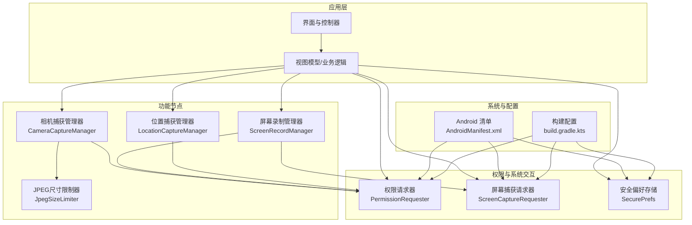
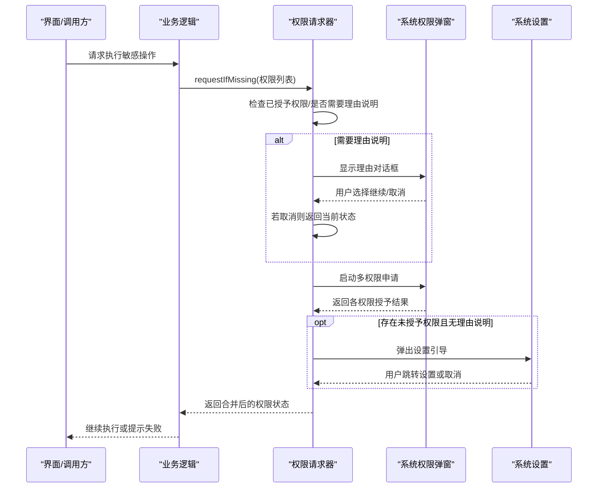
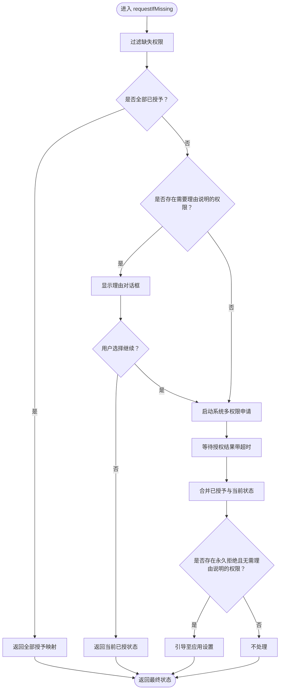
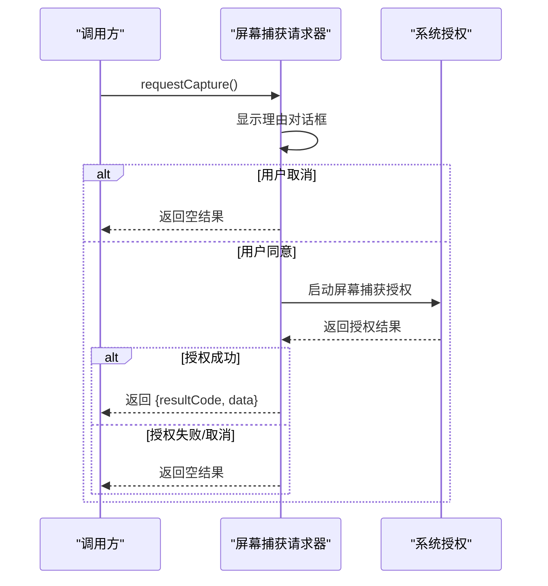
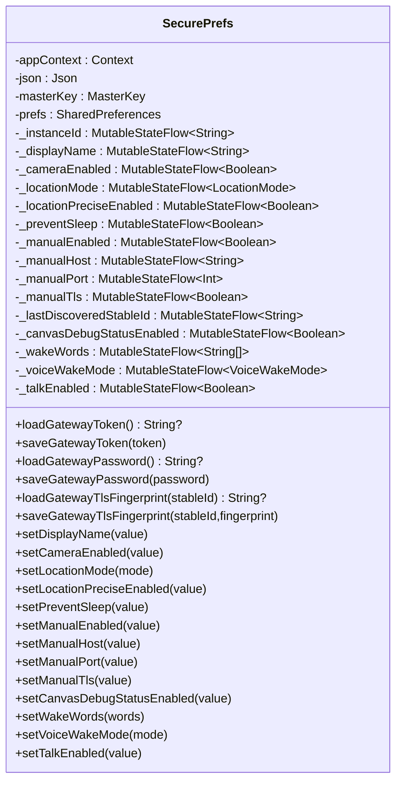
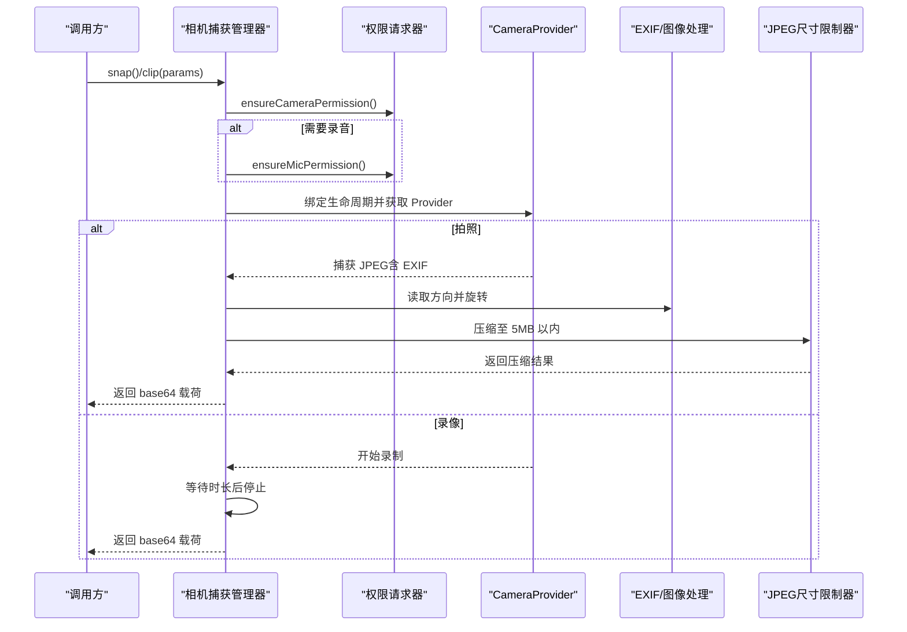
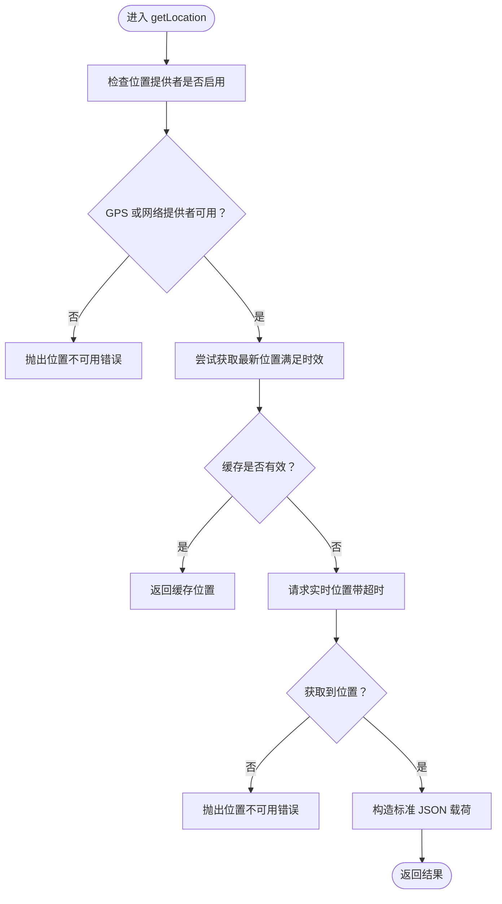
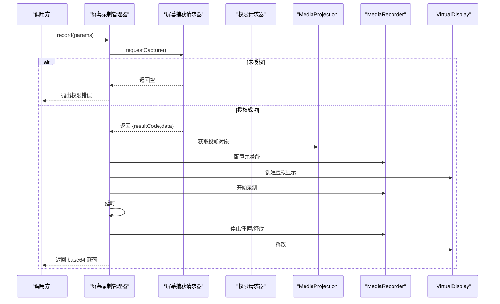
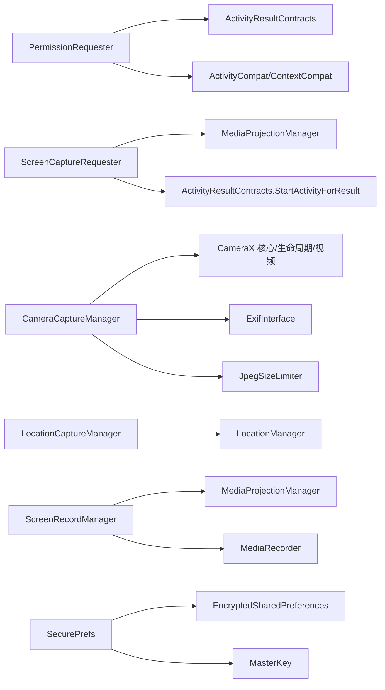

# 权限管理系统

<cite>
**本文档引用的文件**
- [PermissionRequester.kt](file://apps/android/app/src/main/java/ai/openclaw/android/PermissionRequester.kt)
- [ScreenCaptureRequester.kt](file://apps/android/app/src/main/java/ai/openclaw/android/ScreenCaptureRequester.kt)
- [SecurePrefs.kt](file://apps/android/app/src/main/java/ai/openclaw/android/SecurePrefs.kt)
- [CameraCaptureManager.kt](file://apps/android/app/src/main/java/ai/openclaw/android/node/CameraCaptureManager.kt)
- [LocationCaptureManager.kt](file://apps/android/app/src/main/java/ai/openclaw/android/node/LocationCaptureManager.kt)
- [ScreenRecordManager.kt](file://apps/android/app/src/main/java/ai/openclaw/android/node/ScreenRecordManager.kt)
- [JpegSizeLimiter.kt](file://apps/android/app/src/main/java/ai/openclaw/android/node/JpegSizeLimiter.kt)
- [AndroidManifest.xml](file://apps/android/app/src/main/AndroidManifest.xml)
- [build.gradle.kts](file://apps/android/app/build.gradle.kts)
- [DeviceNames.kt](file://apps/android/app/src/main/java/ai/openclaw/android/DeviceNames.kt)
- [VoiceWakeMode.kt](file://apps/android/app/src/main/java/ai/openclaw/android/VoiceWakeMode.kt)
- [WakeWords.kt](file://apps/android/app/src/main/java/ai/openclaw/android/WakeWords.kt)
- [LocationMode.kt](file://apps/android/app/src/main/java/ai/openclaw/android/LocationMode.kt)
</cite>

## 目录

1. [简介](#简介)
2. [项目结构](#项目结构)
3. [核心组件](#核心组件)
4. [架构总览](#架构总览)
5. [详细组件分析](#详细组件分析)
6. [依赖分析](#依赖分析)
7. [性能考虑](#性能考虑)
8. [故障排除指南](#故障排除指南)
9. [结论](#结论)
10. [附录](#附录)

## 简介

本文件为 OpenClaw Android 权限管理系统的技术文档，聚焦以下目标：

- 解释权限请求器、屏幕捕获请求器与安全偏好存储的实现机制
- 记录 Android 权限模型、运行时权限申请与权限拒绝处理流程
- 覆盖敏感权限（相机、录音、位置、屏幕录制）的申请策略
- 提供权限状态检查、用户授权反馈与权限变更监听的实现细节
- 涵盖安全存储机制、敏感信息保护与权限最小化原则
- 总结最佳实践、用户体验优化与兼容性处理方案

## 项目结构

Android 应用位于 apps/android/app，权限相关代码主要分布在以下包与文件中：

- 权限与系统交互层：PermissionRequester、ScreenCaptureRequester、SecurePrefs
- 功能节点层：CameraCaptureManager、LocationCaptureManager、ScreenRecordManager
- 工具与状态：JpegSizeLimiter、DeviceNames、VoiceWakeMode、WakeWords、LocationMode
- 配置与清单：AndroidManifest.xml、build.gradle.kts

图表来源

- [PermissionRequester.kt](file://apps/android/app/src/main/java/ai/openclaw/android/PermissionRequester.kt#L22-L134)
- [ScreenCaptureRequester.kt](file://apps/android/app/src/main/java/ai/openclaw/android/ScreenCaptureRequester.kt#L20-L66)
- [SecurePrefs.kt](file://apps/android/app/src/main/java/ai/openclaw/android/SecurePrefs.kt#L18-L275)
- [CameraCaptureManager.kt](file://apps/android/app/src/main/java/ai/openclaw/android/node/CameraCaptureManager.kt#L37-L317)
- [LocationCaptureManager.kt](file://apps/android/app/src/main/java/ai/openclaw/android/node/LocationCaptureManager.kt#L19-L118)
- [ScreenRecordManager.kt](file://apps/android/app/src/main/java/ai/openclaw/android/node/ScreenRecordManager.kt#L16-L200)
- [JpegSizeLimiter.kt](file://apps/android/app/src/main/java/ai/openclaw/android/node/JpegSizeLimiter.kt#L14-L62)
- [AndroidManifest.xml](file://apps/android/app/src/main/AndroidManifest.xml#L1-L50)
- [build.gradle.kts](file://apps/android/app/build.gradle.kts#L80-L124)

章节来源

- [AndroidManifest.xml](file://apps/android/app/src/main/AndroidManifest.xml#L1-L50)
- [build.gradle.kts](file://apps/android/app/build.gradle.kts#L10-L124)

## 核心组件

本节概述三个核心模块及其职责：

- 权限请求器（PermissionRequester）：封装多权限一次性申请、理由说明对话框、设置跳转与超时控制
- 屏幕捕获请求器（ScreenCaptureRequester）：封装屏幕录制权限的系统级授权流程与结果等待
- 安全偏好存储（SecurePrefs）：基于 EncryptedSharedPreferences 的加密本地存储，提供状态流与敏感凭据保护

章节来源

- [PermissionRequester.kt](file://apps/android/app/src/main/java/ai/openclaw/android/PermissionRequester.kt#L22-L134)
- [ScreenCaptureRequester.kt](file://apps/android/app/src/main/java/ai/openclaw/android/ScreenCaptureRequester.kt#L20-L66)
- [SecurePrefs.kt](file://apps/android/app/src/main/java/ai/openclaw/android/SecurePrefs.kt#L18-L275)

## 架构总览

下图展示权限管理在系统中的调用关系与数据流。

图表来源

- [PermissionRequester.kt](file://apps/android/app/src/main/java/ai/openclaw/android/PermissionRequester.kt#L33-L85)

章节来源

- [PermissionRequester.kt](file://apps/android/app/src/main/java/ai/openclaw/android/PermissionRequester.kt#L22-L134)

## 详细组件分析

### 权限请求器（PermissionRequester）

- 多权限一次性申请：通过 ActivityResultContracts.RequestMultiplePermissions 启动系统授权
- 理由说明与用户反馈：对需要理由说明的权限显示对话框；支持“继续/取消/取消回调”
- 设置跳转：当权限被永久拒绝且无理由说明时，引导用户到应用设置页
- 并发与超时：内部互斥锁保证并发安全；默认超时 20 秒，避免 UI 阻塞
- 结果合并：即使部分权限已在之前授予，也会被合并为最终状态

图表来源

- [PermissionRequester.kt](file://apps/android/app/src/main/java/ai/openclaw/android/PermissionRequester.kt#L33-L85)

章节来源

- [PermissionRequester.kt](file://apps/android/app/src/main/java/ai/openclaw/android/PermissionRequester.kt#L22-L134)

### 屏幕捕获请求器（ScreenCaptureRequester）

- 专用屏幕录制授权流程：通过 MediaProjectionManager 创建系统授权意图
- 理由说明与超时控制：显示必要性说明对话框；超时等待系统授权结果
- 结果封装：成功时返回 resultCode 与 data，便于后续创建投影对象

图表来源

- [ScreenCaptureRequester.kt](file://apps/android/app/src/main/java/ai/openclaw/android/ScreenCaptureRequester.kt#L38-L51)

章节来源

- [ScreenCaptureRequester.kt](file://apps/android/app/src/main/java/ai/openclaw/android/ScreenCaptureRequester.kt#L20-L66)

### 安全偏好存储（SecurePrefs）

- 加密存储：基于 EncryptedSharedPreferences，AES256-GCM 对称加密
- 状态流：使用 StateFlow 暴露可观察的状态，便于 UI 响应式更新
- 敏感凭据：网关令牌、密码与 TLS 指纹按实例隔离存储
- 默认值与迁移：设备名称、唤醒词等具备默认值与迁移逻辑
- 键空间：采用命名空间前缀区分不同功能域（如网关、语音唤醒、相机）

图表来源

- [SecurePrefs.kt](file://apps/android/app/src/main/java/ai/openclaw/android/SecurePrefs.kt#L18-L275)

章节来源

- [SecurePrefs.kt](file://apps/android/app/src/main/java/ai/openclaw/android/SecurePrefs.kt#L18-L275)

### 相机捕获管理器（CameraCaptureManager）

- 权限前置：在拍照与录像前确保相机权限与录音权限（可选）
- 生命周期绑定：通过 ProcessCameraProvider 与生命周期绑定，避免资源泄漏
- 图像处理：EXIF 方向旋转、按需缩放、Base64 编码；严格控制最大载荷（约 5MB）
- 视频录制：使用 VideoCapture 与 MediaRecorder，支持音频开关与时长控制
- 参数解析：从 JSON 字符串解析面向参数（朝向、质量、最大宽度、时长、音频等）

图表来源

- [CameraCaptureManager.kt](file://apps/android/app/src/main/java/ai/openclaw/android/node/CameraCaptureManager.kt#L75-L198)
- [JpegSizeLimiter.kt](file://apps/android/app/src/main/java/ai/openclaw/android/node/JpegSizeLimiter.kt#L14-L62)

章节来源

- [CameraCaptureManager.kt](file://apps/android/app/src/main/java/ai/openclaw/android/node/CameraCaptureManager.kt#L37-L317)
- [JpegSizeLimiter.kt](file://apps/android/app/src/main/java/ai/openclaw/android/node/JpegSizeLimiter.kt#L14-L62)

### 位置捕获管理器（LocationCaptureManager）

- 权限前置：检查细粒度与粗粒度位置权限
- 最新位置优先：若满足时效要求直接返回缓存位置
- 实时定位：若无可用缓存，使用 getCurrentLocation 获取实时位置，支持超时与取消信号
- 输出格式：标准化 JSON 字段（经纬度、精度、海拔、速度、航向、时间戳、来源）

图表来源

- [LocationCaptureManager.kt](file://apps/android/app/src/main/java/ai/openclaw/android/node/LocationCaptureManager.kt#L22-L62)

章节来源

- [LocationCaptureManager.kt](file://apps/android/app/src/main/java/ai/openclaw/android/node/LocationCaptureManager.kt#L19-L118)

### 屏幕录制管理器（ScreenRecordManager）

- 权限前置：依赖 ScreenCaptureRequester 获取系统授权；可选录音权限
- 设备适配：读取屏幕分辨率与密度，估算比特率，创建 VirtualDisplay
- 录制流程：配置 MediaRecorder，启动录制，延时后停止，释放资源
- 输出载荷：将临时文件读入内存并 Base64 编码，返回 JSON 描述

图表来源

- [ScreenRecordManager.kt](file://apps/android/app/src/main/java/ai/openclaw/android/node/ScreenRecordManager.kt#L30-L123)

章节来源

- [ScreenRecordManager.kt](file://apps/android/app/src/main/java/ai/openclaw/android/node/ScreenRecordManager.kt#L16-L200)

## 依赖分析

- 权限与系统交互
  - PermissionRequester 依赖 ActivityResultContracts.RequestMultiplePermissions 与 ActivityCompat/ContextCompat
  - ScreenCaptureRequester 依赖 MediaProjectionManager 与 ActivityResultContracts.StartActivityForResult
- 功能节点
  - CameraCaptureManager 依赖 CameraX（camera-core/camera-lifecycle/video）、EXIF 处理与自定义 JPEG 压缩
  - LocationCaptureManager 依赖 LocationManager 与权限检查
  - ScreenRecordManager 依赖 MediaProjectionManager、MediaRecorder 与 VirtualDisplay
- 安全存储
  - SecurePrefs 依赖 EncryptedSharedPreferences 与 MasterKey，提供状态流与敏感凭据隔离

图表来源

- [PermissionRequester.kt](file://apps/android/app/src/main/java/ai/openclaw/android/PermissionRequester.kt#L22-L31)
- [ScreenCaptureRequester.kt](file://apps/android/app/src/main/java/ai/openclaw/android/ScreenCaptureRequester.kt#L20-L36)
- [CameraCaptureManager.kt](file://apps/android/app/src/main/java/ai/openclaw/android/node/CameraCaptureManager.kt#L37-L49)
- [LocationCaptureManager.kt](file://apps/android/app/src/main/java/ai/openclaw/android/node/LocationCaptureManager.kt#L19-L27)
- [ScreenRecordManager.kt](file://apps/android/app/src/main/java/ai/openclaw/android/node/ScreenRecordManager.kt#L16-L28)
- [SecurePrefs.kt](file://apps/android/app/src/main/java/ai/openclaw/android/SecurePrefs.kt#L18-L35)

章节来源

- [build.gradle.kts](file://apps/android/app/build.gradle.kts#L104-L114)

## 性能考虑

- 相机拍照与录视频
  - 使用 EXIF 方向旋转与按需缩放，避免不必要的大图传输
  - JPEG 压缩采用二分搜索式策略，优先降低质量再缩放，确保不超过 5MB 限制
- 屏幕录制
  - 基于像素数、帧率与编码估算比特率，防止过高导致卡顿或录制失败
  - 录制完成后立即释放 MediaRecorder/VirtualDisplay/投影对象，避免资源泄漏
- 权限申请
  - 互斥锁与超时控制避免 UI 卡死；仅在需要时触发系统弹窗
- 位置服务
  - 优先使用最新缓存位置，减少实时定位开销；超时与取消信号保障响应性

章节来源

- [JpegSizeLimiter.kt](file://apps/android/app/src/main/java/ai/openclaw/android/node/JpegSizeLimiter.kt#L14-L62)
- [ScreenRecordManager.kt](file://apps/android/app/src/main/java/ai/openclaw/android/node/ScreenRecordManager.kt#L194-L198)
- [CameraCaptureManager.kt](file://apps/android/app/src/main/java/ai/openclaw/android/node/CameraCaptureManager.kt#L106-L136)

## 故障排除指南

- 权限被永久拒绝
  - 现象：系统不再显示理由说明，直接进入设置
  - 处理：调用权限请求器的设置引导，跳转至应用设置页手动开启
- 屏幕录制未授权
  - 现象：requestCapture 返回空
  - 处理：确认用户点击“允许”；若仍失败，检查系统设置中是否勾选了屏幕录制权限
- 相机/录音权限未授予
  - 现象：拍照/录视频时报错
  - 处理：调用权限请求器申请对应权限；若用户拒绝且无理由说明，引导至设置页
- 位置服务不可用
  - 现象：实时定位失败或无可用提供者
  - 处理：检查 GPS/网络提供者是否启用；确认位置权限已授予；适当放宽 maxAgeMs

章节来源

- [PermissionRequester.kt](file://apps/android/app/src/main/java/ai/openclaw/android/PermissionRequester.kt#L87-L114)
- [ScreenCaptureRequester.kt](file://apps/android/app/src/main/java/ai/openclaw/android/ScreenCaptureRequester.kt#L53-L64)
- [CameraCaptureManager.kt](file://apps/android/app/src/main/java/ai/openclaw/android/node/CameraCaptureManager.kt#L51-L73)
- [LocationCaptureManager.kt](file://apps/android/app/src/main/java/ai/openclaw/android/node/LocationCaptureManager.kt#L86-L116)

## 结论

OpenClaw Android 权限管理系统通过统一的权限请求器、专门的屏幕捕获请求器与加密的安全偏好存储，实现了：

- 可靠的运行时权限申请与拒绝处理
- 对相机、录音、位置、屏幕录制等敏感权限的最小化使用
- 响应式的状态流与安全的敏感信息保护
- 良好的性能与兼容性设计

建议在实际集成中遵循权限最小化原则，提供清晰的用户提示，并在设置页提供便捷入口以提升用户体验。

## 附录

- Android 权限与清单要点
  - 清单中声明了相机、录音、位置、短信、网络、前台服务等权限
  - 服务声明了多种前台服务类型，覆盖数据同步、麦克风与媒体投影
- 版本与依赖
  - 最小 SDK 31，目标 SDK 36
  - 依赖 CameraX、安全加密库、Kotlinx 序列化与协程

章节来源

- [AndroidManifest.xml](file://apps/android/app/src/main/AndroidManifest.xml#L1-L50)
- [build.gradle.kts](file://apps/android/app/build.gradle.kts#L20-L26)
- [build.gradle.kts](file://apps/android/app/build.gradle.kts#L104-L114)
