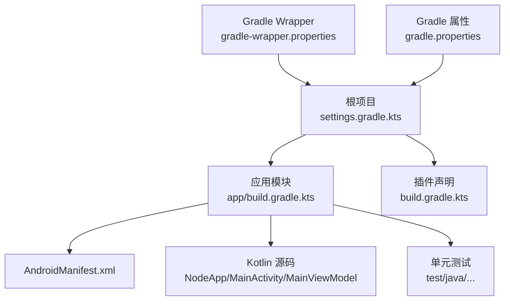
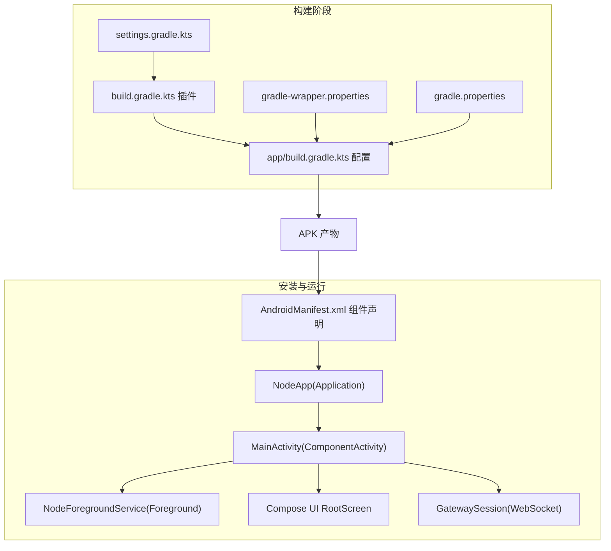
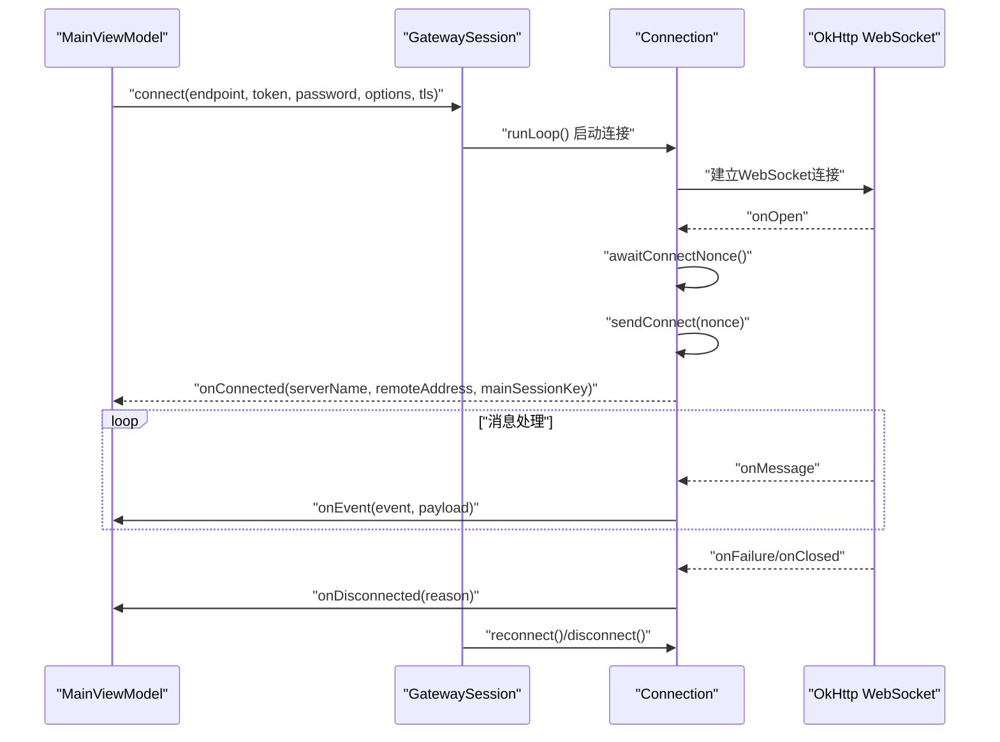
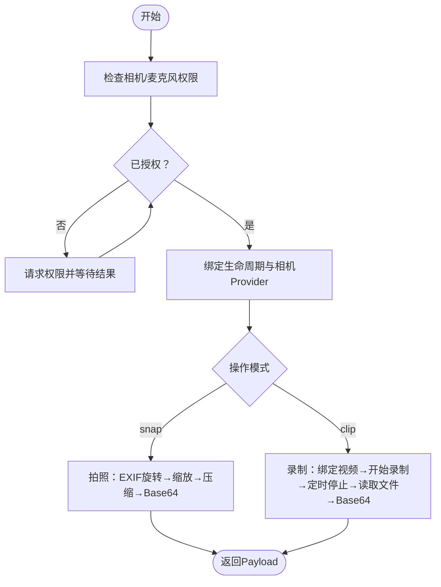
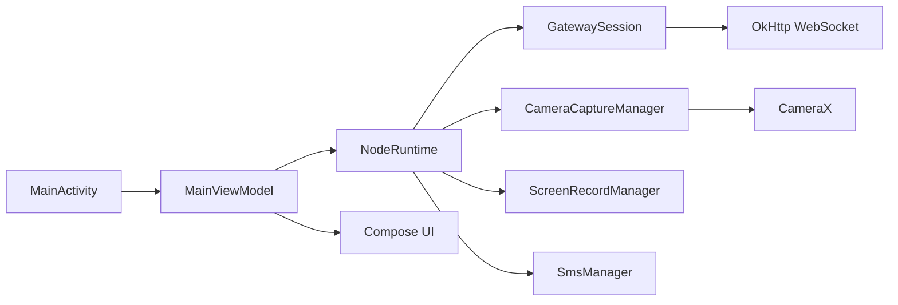

# 构建配置

<cite>
**本文引用的文件**
- [apps/android/build.gradle.kts](file://apps/android/build.gradle.kts)
- [apps/android/settings.gradle.kts](file://apps/android/settings.gradle.kts)
- [apps/android/gradle.properties](file://apps/android/gradle.properties)
- [apps/android/gradle/wrapper/gradle-wrapper.properties](file://apps/android/gradle/wrapper/gradle-wrapper.properties)
- [apps/android/app/build.gradle.kts](file://apps/android/app/build.gradle.kts)
- [apps/android/app/src/main/AndroidManifest.xml](file://apps/android/app/src/main/AndroidManifest.xml)
- [apps/android/app/src/main/java/ai/openclaw/android/NodeApp.kt](file://apps/android/app/src/main/java/ai/openclaw/android/NodeApp.kt)
- [apps/android/app/src/main/java/ai/openclaw/android/MainActivity.kt](file://apps/android/app/src/main/java/ai/openclaw/android/MainActivity.kt)
- [apps/android/app/src/main/java/ai/openclaw/android/MainViewModel.kt](file://apps/android/app/src/main/java/ai/openclaw/android/MainViewModel.kt)
- [apps/android/app/src/main/java/ai/openclaw/android/gateway/GatewaySession.kt](file://apps/android/app/src/main/java/ai/openclaw/android/gateway/GatewaySession.kt)
- [apps/android/app/src/main/java/ai/openclaw/android/node/CameraCaptureManager.kt](file://apps/android/app/src/main/java/ai/openclaw/android/node/CameraCaptureManager.kt)
</cite>

## 目录

1. [简介](#简介)
2. [项目结构](#项目结构)
3. [核心组件](#核心组件)
4. [架构总览](#架构总览)
5. [详细组件分析](#详细组件分析)
6. [依赖关系分析](#依赖关系分析)
7. [性能考虑](#性能考虑)
8. [故障排查指南](#故障排查指南)
9. [结论](#结论)
10. [附录](#附录)

## 简介

本文件面向OpenClaw Android应用的构建配置与发布流程，系统化梳理Gradle构建脚本、项目设置、依赖管理、Android清单与权限、构建变体与签名、发布产物命名规则、以及与运行时组件（网关会话、相机采集）的集成方式。文档同时给出可操作的优化建议与常见问题排查路径，帮助开发者在保证兼容性的前提下提升构建效率与稳定性。

## 项目结构

Android应用位于apps/android目录，采用Kotlin DSL Gradle脚本与多模块设置：

- 根级插件与仓库管理：统一声明插件版本并集中管理仓库来源
- 应用模块：app子工程包含AndroidManifest、Kotlin源码、Compose UI与测试
- Gradle Wrapper：固定Gradle版本，确保团队与CI一致性
- 运行时入口：Application与Activity负责启动前台服务、权限请求与界面初始化

图表来源

- [apps/android/settings.gradle.kts](file://apps/android/settings.gradle.kts#L1-L19)
- [apps/android/build.gradle.kts](file://apps/android/build.gradle.kts#L1-L7)
- [apps/android/app/build.gradle.kts](file://apps/android/app/build.gradle.kts#L1-L129)
- [apps/android/app/src/main/AndroidManifest.xml](file://apps/android/app/src/main/AndroidManifest.xml#L1-L50)
- [apps/android/gradle/wrapper/gradle-wrapper.properties](file://apps/android/gradle/wrapper/gradle-wrapper.properties#L1-L8)
- [apps/android/gradle.properties](file://apps/android/gradle.properties#L1-L5)

章节来源

- [apps/android/settings.gradle.kts](file://apps/android/settings.gradle.kts#L1-L19)
- [apps/android/build.gradle.kts](file://apps/android/build.gradle.kts#L1-L7)
- [apps/android/app/build.gradle.kts](file://apps/android/app/build.gradle.kts#L1-L129)
- [apps/android/app/src/main/AndroidManifest.xml](file://apps/android/app/src/main/AndroidManifest.xml#L1-L50)
- [apps/android/gradle/wrapper/gradle-wrapper.properties](file://apps/android/gradle/wrapper/gradle-wrapper.properties#L1-L8)
- [apps/android/gradle.properties](file://apps/android/gradle.properties#L1-L5)

## 核心组件

- Gradle根脚本：集中声明Android应用、Kotlin、Compose与序列化插件版本，避免在模块内重复指定
- settings脚本：统一仓库源（Google、Maven Central、Gradle插件门户），失败策略限制项目自定义仓库
- 应用模块脚本：定义命名空间、编译/目标SDK、最小SDK、版本号与名称、Compose与BuildConfig特性、Java 17兼容、打包排除、Lint与测试选项
- Gradle属性：启用AndroidX、非传递R类、JVM内存与警告级别
- Gradle Wrapper：固定Gradle 9.2.1二进制分发，校验URL
- 清单与权限：网络、位置、通知、相机、麦克风、短信、近场WiFi设备等权限；前台服务类型声明；应用图标与主题
- 运行时入口：Application中延迟初始化NodeRuntime并在调试模式开启StrictMode；Activity中启动前台服务、请求必要权限、沉浸式窗口与Compose UI渲染

章节来源

- [apps/android/build.gradle.kts](file://apps/android/build.gradle.kts#L1-L7)
- [apps/android/settings.gradle.kts](file://apps/android/settings.gradle.kts#L1-L19)
- [apps/android/gradle.properties](file://apps/android/gradle.properties#L1-L5)
- [apps/android/gradle/wrapper/gradle-wrapper.properties](file://apps/android/gradle/wrapper/gradle-wrapper.properties#L1-L8)
- [apps/android/app/build.gradle.kts](file://apps/android/app/build.gradle.kts#L10-L58)
- [apps/android/app/src/main/AndroidManifest.xml](file://apps/android/app/src/main/AndroidManifest.xml#L1-L50)
- [apps/android/app/src/main/java/ai/openclaw/android/NodeApp.kt](file://apps/android/app/src/main/java/ai/openclaw/android/NodeApp.kt#L1-L27)
- [apps/android/app/src/main/java/ai/openclaw/android/MainActivity.kt](file://apps/android/app/src/main/java/ai/openclaw/android/MainActivity.kt#L1-L131)

## 架构总览

下图展示从构建到运行的关键交互：Gradle解析settings与插件，应用模块按配置编译与打包；安装后由Android系统加载清单声明的应用组件，Activity启动前台服务并初始化运行时，随后通过网关会话与远程节点通信。

图表来源

- [apps/android/settings.gradle.kts](file://apps/android/settings.gradle.kts#L1-L19)
- [apps/android/build.gradle.kts](file://apps/android/build.gradle.kts#L1-L7)
- [apps/android/app/build.gradle.kts](file://apps/android/app/build.gradle.kts#L1-L129)
- [apps/android/gradle/wrapper/gradle-wrapper.properties](file://apps/android/gradle/wrapper/gradle-wrapper.properties#L1-L8)
- [apps/android/gradle.properties](file://apps/android/gradle.properties#L1-L5)
- [apps/android/app/src/main/AndroidManifest.xml](file://apps/android/app/src/main/AndroidManifest.xml#L1-L50)
- [apps/android/app/src/main/java/ai/openclaw/android/NodeApp.kt](file://apps/android/app/src/main/java/ai/openclaw/android/NodeApp.kt#L1-L27)
- [apps/android/app/src/main/java/ai/openclaw/android/MainActivity.kt](file://apps/android/app/src/main/java/ai/openclaw/android/MainActivity.kt#L1-L131)
- [apps/android/app/src/main/java/ai/openclaw/android/gateway/GatewaySession.kt](file://apps/android/app/src/main/java/ai/openclaw/android/gateway/GatewaySession.kt#L1-L684)

## 详细组件分析

### Gradle根脚本与仓库管理

- 插件版本集中声明于根脚本，模块内仅需应用，降低维护成本
- 仓库管理使用FAIL_ON_PROJECT_REPOS策略，强制所有依赖来自统一仓库源，减少私有仓库污染风险

章节来源

- [apps/android/build.gradle.kts](file://apps/android/build.gradle.kts#L1-L7)
- [apps/android/settings.gradle.kts](file://apps/android/settings.gradle.kts#L9-L15)

### 应用模块构建配置

- 命名空间与SDK：命名空间、compileSdk、minSdk、targetSdk明确
- 版本信息：versionCode与versionName遵循日期格式，便于追踪
- Compose与BuildConfig：启用Compose与BuildConfig，便于在代码中访问构建类型与版本常量
- Java兼容：sourceCompatibility/targetCompatibility设为17，Kotlin编译器也对齐JVM目标
- 打包排除：排除META-INF许可证冲突条目，减少打包冲突
- Lint：禁用特定告警并把警告视为错误，提升质量门槛
- 测试：启用Android资源，使用JUnit平台执行测试

章节来源

- [apps/android/app/build.gradle.kts](file://apps/android/app/build.gradle.kts#L10-L58)

### 构建变体与输出命名

- 变体钩子：通过androidComponents回调遍历VariantOutputImpl，将输出文件名格式化为“openclaw-{versionName}-{buildType}.apk”，便于区分版本与构建类型
- 当前未启用混淆与压缩，保持可调试性与可追踪性

章节来源

- [apps/android/app/build.gradle.kts](file://apps/android/app/build.gradle.kts#L60-L72)

### 依赖管理与版本控制

- Compose BOM：通过platform统一管理Compose版本，确保UI栈一致性
- 核心库：AndroidX Core、Lifecycle、Activity-Compose、Material、Navigation等
- 协程与序列化：协程Android与JSON序列化
- 安全与网络：AndroidX Security Crypto、OkHttp
- 相机：CameraX全套能力（core/camera2/lifecycle/video/view）
- DNS：dnsjava用于组播DNS-SD发现
- 测试：JUnit、Kotest、Robolectric、JUnit Vintage引擎

章节来源

- [apps/android/app/build.gradle.kts](file://apps/android/app/build.gradle.kts#L80-L124)

### Android清单、权限与组件注册

- 权限集合：INTERNET、网络状态、前台服务、数据同步、麦克风、媒体投影、通知、近场WiFi设备、位置（含后台）、相机、录音、短信
- 设备特性：声明相机与电话硬件可用性（可选）
- 应用组件：NodeApp作为Application；NodeForegroundService前台服务；MainActivity主入口
- 安全配置：网络安全性配置文件引用（XML）

章节来源

- [apps/android/app/src/main/AndroidManifest.xml](file://apps/android/app/src/main/AndroidManifest.xml#L1-L50)

### 运行时入口与生命周期

- NodeApp：延迟初始化NodeRuntime，并在DEBUG构建启用StrictMode
- MainActivity：WebView调试开关、沉浸式窗口、必要权限请求（含Android 13+的通知权限）、启动前台服务、绑定相机/短信/屏幕录制权限与生命周期

章节来源

- [apps/android/app/src/main/java/ai/openclaw/android/NodeApp.kt](file://apps/android/app/src/main/java/ai/openclaw/android/NodeApp.kt#L1-L27)
- [apps/android/app/src/main/java/ai/openclaw/android/MainActivity.kt](file://apps/android/app/src/main/java/ai/openclaw/android/MainActivity.kt#L1-L131)

### 网关会话与WebSocket通信

- 连接循环：根据DesiredConnection尝试连接，失败指数回退，断开时清理状态
- 认证与签名：生成设备认证载荷，支持token/password两种认证方式，签名与公钥随连接参数携带
- 请求/响应：基于WebSocket的RPC，带超时与pending队列管理
- TLS：可选TLS参数，支持自定义SSL Socket Factory与Hostname Verifier
- Canvas地址归一化：针对本地回环或尾网域名进行地址修正

图表来源

- [apps/android/app/src/main/java/ai/openclaw/android/MainViewModel.kt](file://apps/android/app/src/main/java/ai/openclaw/android/MainViewModel.kt#L1-L175)
- [apps/android/app/src/main/java/ai/openclaw/android/gateway/GatewaySession.kt](file://apps/android/app/src/main/java/ai/openclaw/android/gateway/GatewaySession.kt#L102-L125)
- [apps/android/app/src/main/java/ai/openclaw/android/gateway/GatewaySession.kt](file://apps/android/app/src/main/java/ai/openclaw/android/gateway/GatewaySession.kt#L193-L203)
- [apps/android/app/src/main/java/ai/openclaw/android/gateway/GatewaySession.kt](file://apps/android/app/src/main/java/ai/openclaw/android/gateway/GatewaySession.kt#L294-L326)
- [apps/android/app/src/main/java/ai/openclaw/android/gateway/GatewaySession.kt](file://apps/android/app/src/main/java/ai/openclaw/android/gateway/GatewaySession.kt#L418-L455)

章节来源

- [apps/android/app/src/main/java/ai/openclaw/android/gateway/GatewaySession.kt](file://apps/android/app/src/main/java/ai/openclaw/android/gateway/GatewaySession.kt#L1-L684)
- [apps/android/app/src/main/java/ai/openclaw/android/MainViewModel.kt](file://apps/android/app/src/main/java/ai/openclaw/android/MainViewModel.kt#L1-L175)

### 相机采集与视频录制

- 权限保障：拍照与录制前检查并请求相机/麦克风权限
- 拍照流程：选择前后摄像头、EXIF方向旋转、按最大宽度缩放、压缩至5MB以内限制、Base64封装返回
- 录制流程：绑定生命周期、录制MP4、可选音频、超时与完成事件处理、最终转码为Base64返回
- 参数解析：支持facing、quality、maxWidth、durationMs、includeAudio等参数

图表来源

- [apps/android/app/src/main/java/ai/openclaw/android/node/CameraCaptureManager.kt](file://apps/android/app/src/main/java/ai/openclaw/android/node/CameraCaptureManager.kt#L51-L61)
- [apps/android/app/src/main/java/ai/openclaw/android/node/CameraCaptureManager.kt](file://apps/android/app/src/main/java/ai/openclaw/android/node/CameraCaptureManager.kt#L75-L137)
- [apps/android/app/src/main/java/ai/openclaw/android/node/CameraCaptureManager.kt](file://apps/android/app/src/main/java/ai/openclaw/android/node/CameraCaptureManager.kt#L140-L198)

章节来源

- [apps/android/app/src/main/java/ai/openclaw/android/node/CameraCaptureManager.kt](file://apps/android/app/src/main/java/ai/openclaw/android/node/CameraCaptureManager.kt#L1-L317)

## 依赖关系分析

- 组件耦合：MainActivity依赖MainViewModel与多个Node子系统（相机、屏幕录制、短信），MainViewModel再委托NodeRuntime；NodeRuntime内部持有GatewaySession与各节点管理器
- 外部依赖：OkHttp用于WebSocket通信；CameraX用于图像与视频采集；Compose用于UI；Material与Navigation用于主题与导航
- 版本策略：Compose BOM统一版本，其余库以具体版本号声明，便于升级与锁定

图表来源

- [apps/android/app/src/main/java/ai/openclaw/android/MainActivity.kt](file://apps/android/app/src/main/java/ai/openclaw/android/MainActivity.kt#L1-L131)
- [apps/android/app/src/main/java/ai/openclaw/android/MainViewModel.kt](file://apps/android/app/src/main/java/ai/openclaw/android/MainViewModel.kt#L1-L175)
- [apps/android/app/src/main/java/ai/openclaw/android/gateway/GatewaySession.kt](file://apps/android/app/src/main/java/ai/openclaw/android/gateway/GatewaySession.kt#L1-L684)
- [apps/android/app/src/main/java/ai/openclaw/android/node/CameraCaptureManager.kt](file://apps/android/app/src/main/java/ai/openclaw/android/node/CameraCaptureManager.kt#L1-L317)

章节来源

- [apps/android/app/src/main/java/ai/openclaw/android/MainActivity.kt](file://apps/android/app/src/main/java/ai/openclaw/android/MainActivity.kt#L1-L131)
- [apps/android/app/src/main/java/ai/openclaw/android/MainViewModel.kt](file://apps/android/app/src/main/java/ai/openclaw/android/MainViewModel.kt#L1-L175)
- [apps/android/app/src/main/java/ai/openclaw/android/gateway/GatewaySession.kt](file://apps/android/app/src/main/java/ai/openclaw/android/gateway/GatewaySession.kt#L1-L684)
- [apps/android/app/src/main/java/ai/openclaw/android/node/CameraCaptureManager.kt](file://apps/android/app/src/main/java/ai/openclaw/android/node/CameraCaptureManager.kt#L1-L317)

## 性能考虑

- 构建性能
  - 固定Gradle版本与仓库源，减少网络波动与缓存抖动
  - 使用Compose BOM统一版本，避免组合库版本不一致导致的增量编译问题
  - 将测试资源启用为true，有助于UI测试稳定
- 运行时性能
  - 相机采集阶段严格控制JPEG大小与编码质量，避免超过5MB上限
  - 视频录制采用临时文件与超时控制，防止资源泄漏
  - 网关连接采用指数回退与断线重连，平衡稳定性与资源占用
- 优化建议
  - 在Release变体开启混淆与资源压缩（见后续章节）
  - 引入ProGuard/R8规则，保留必要的反射与序列化字段
  - 对大图片与视频进行异步处理，避免阻塞主线程

## 故障排查指南

- 权限相关
  - 相机/录音权限缺失：相机采集会抛出明确异常提示，请在请求后确认授权状态
  - Android 13+通知权限：若未授予，可能导致通知无法显示
- 网络与TLS
  - WebSocket连接失败：检查端点可达性、证书与主机名校验配置
  - 认证失败：核对token/password与设备签名参数
- 构建问题
  - 仓库解析失败：确认settings中仓库源可用且网络可达
  - Lint错误：当前将警告视为错误，需修复或在本地临时禁用
  - 输出文件名异常：确认androidComponents钩子是否生效

章节来源

- [apps/android/app/src/main/java/ai/openclaw/android/node/CameraCaptureManager.kt](file://apps/android/app/src/main/java/ai/openclaw/android/node/CameraCaptureManager.kt#L51-L61)
- [apps/android/app/src/main/java/ai/openclaw/android/MainActivity.kt](file://apps/android/app/src/main/java/ai/openclaw/android/MainActivity.kt#L97-L129)
- [apps/android/app/src/main/java/ai/openclaw/android/gateway/GatewaySession.kt](file://apps/android/app/src/main/java/ai/openclaw/android/gateway/GatewaySession.kt#L294-L326)
- [apps/android/app/build.gradle.kts](file://apps/android/app/build.gradle.kts#L50-L53)
- [apps/android/settings.gradle.kts](file://apps/android/settings.gradle.kts#L9-L15)

## 结论

该Android构建配置以集中化的插件与仓库管理为基础，配合Compose UI与CameraX能力，实现了从构建到运行的完整链路。通过严格的权限与服务声明、清晰的变体输出命名、以及可扩展的网关会话模型，项目在可维护性与可扩展性方面具备良好基础。建议在Release变体引入混淆与资源压缩，并完善CI/CD流水线与自动化测试策略，进一步提升交付质量与效率。

## 附录

### 构建变体、签名与发布流程

- 构建变体
  - 已定义release变体，默认关闭混淆；可在同文件中添加debug变体并启用混淆与压缩
- 签名配置
  - 建议在gradle.properties中配置密钥库路径与别名，或在CI中注入环境变量
- 发布产物命名
  - 已通过androidComponents钩子统一命名为“openclaw-{versionName}-{buildType}.apk”

章节来源

- [apps/android/app/build.gradle.kts](file://apps/android/app/build.gradle.kts#L28-L32)
- [apps/android/app/build.gradle.kts](file://apps/android/app/build.gradle.kts#L60-L72)

### 依赖库管理与版本控制

- 统一通过Compose BOM管理UI栈版本
- 其余库以具体版本号声明，便于升级与锁定
- 建议定期更新BOM与依赖版本，关注安全公告

章节来源

- [apps/android/app/build.gradle.kts](file://apps/android/app/build.gradle.kts#L80-L124)

### 兼容性设置

- minSdk 31，targetSdk 36，Java 17兼容
- AndroidX启用，非传递R类
- Lint将警告视为错误，提升质量

章节来源

- [apps/android/app/build.gradle.kts](file://apps/android/app/build.gradle.kts#L20-L26)
- [apps/android/app/build.gradle.kts](file://apps/android/app/build.gradle.kts#L39-L42)
- [apps/android/gradle.properties](file://apps/android/gradle.properties#L3-L4)
- [apps/android/app/build.gradle.kts](file://apps/android/app/build.gradle.kts#L50-L53)

### 构建优化、代码混淆与资源压缩

- 建议在release变体启用混淆与资源压缩，结合ProGuard/R8规则
- 保留必要的反射与序列化字段，避免运行时崩溃
- 对大体积资源进行压缩与裁剪，减少APK体积

[本节为通用建议，无需特定文件引用]

### CI/CD集成、自动化测试与持续部署

- CI建议
  - 使用固定Gradle版本（已通过Wrapper锁定）
  - 在CI中注入签名密钥与仓库凭据
  - 分离单元测试与E2E测试任务
- 自动化测试
  - 已启用JUnit平台与Android资源测试
  - 可增加Instrumentation测试与UI自动化
- 持续部署
  - 基于变体输出命名规则，统一归档与分发渠道

[本节为通用建议，无需特定文件引用]
