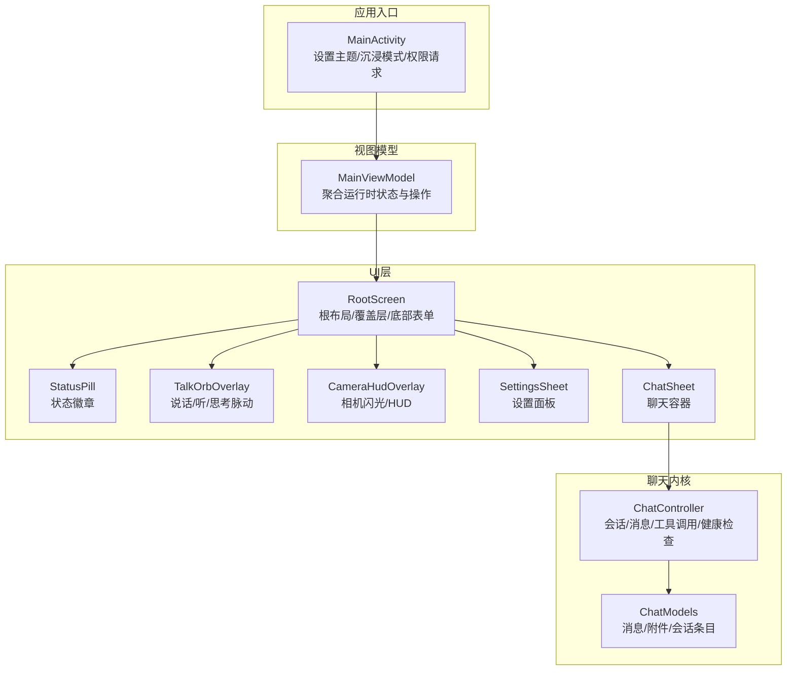
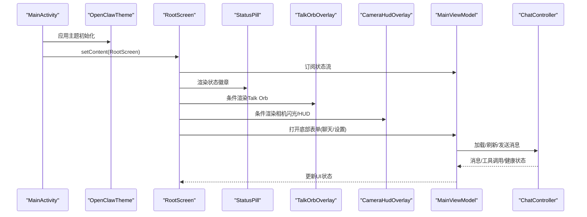
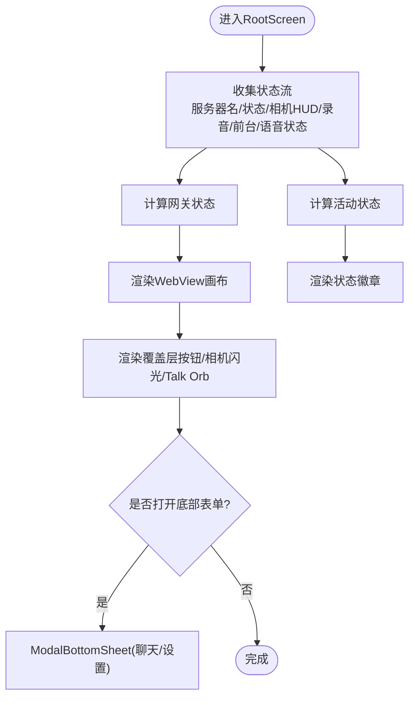
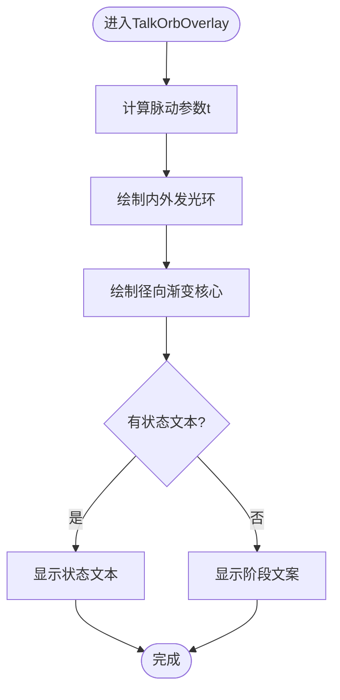
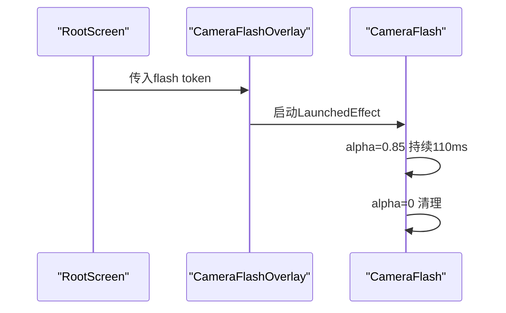
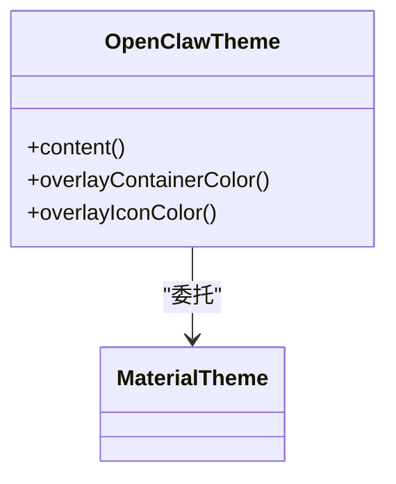
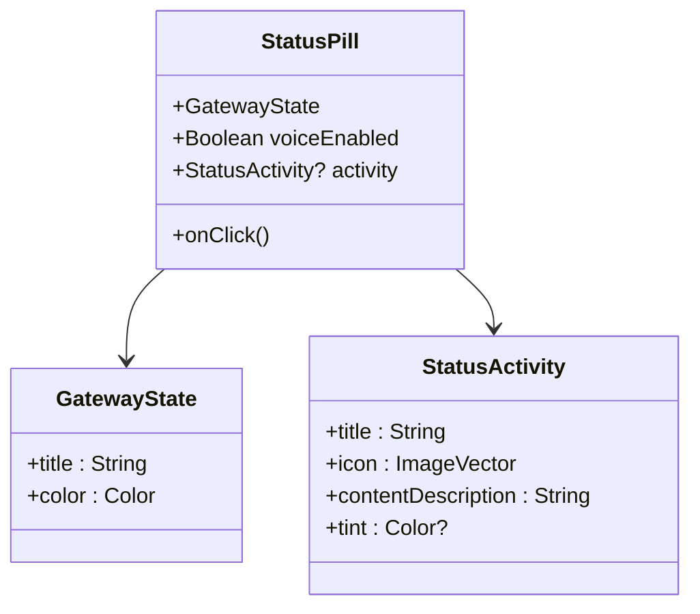
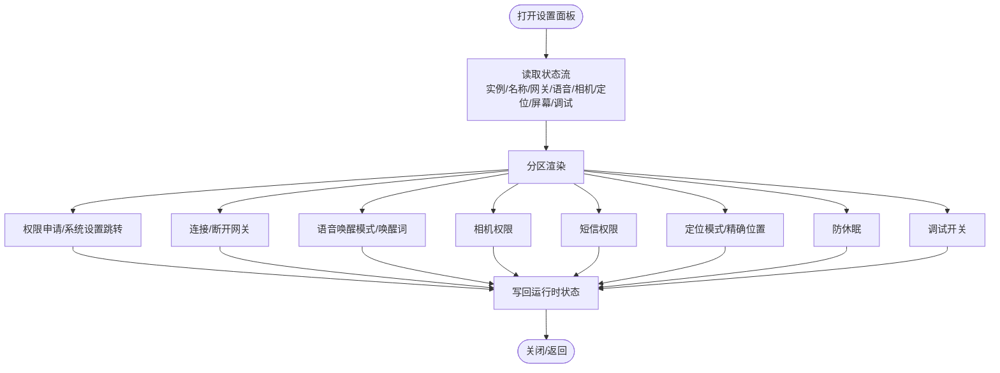
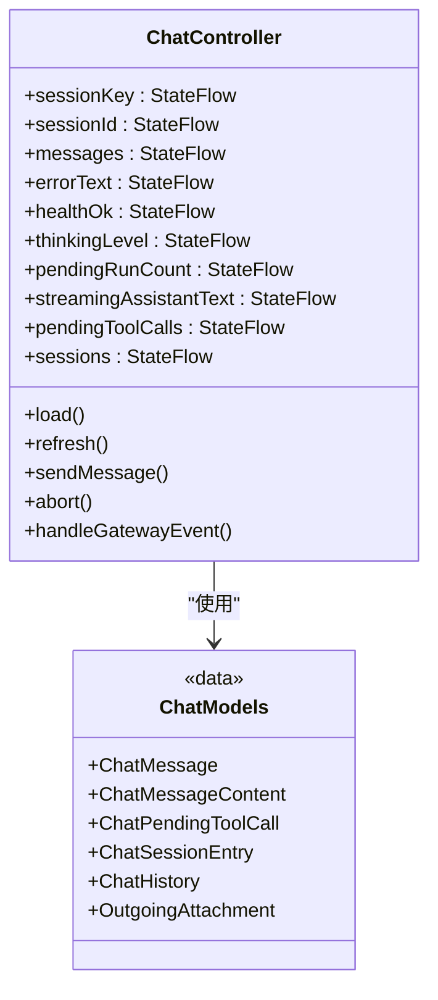
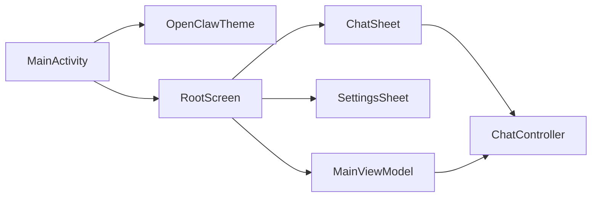

# 用户界面组件

<cite>
**本文引用的文件**
- [apps/android/app/src/main/java/ai/openclaw/android/MainActivity.kt](file://apps/android/app/src/main/java/ai/openclaw/android/MainActivity.kt)
- [apps/android/app/src/main/java/ai/openclaw/android/MainViewModel.kt](file://apps/android/app/src/main/java/ai/openclaw/android/MainViewModel.kt)
- [apps/android/app/src/main/java/ai/openclaw/android/ui/RootScreen.kt](file://apps/android/app/src/main/java/ai/openclaw/android/ui/RootScreen.kt)
- [apps/android/app/src/main/java/ai/openclaw/android/ui/OpenClawTheme.kt](file://apps/android/app/src/main/java/ai/openclaw/android/ui/OpenClawTheme.kt)
- [apps/android/app/src/main/java/ai/openclaw/android/ui/StatusPill.kt](file://apps/android/app/src/main/java/ai/openclaw/android/ui/StatusPill.kt)
- [apps/android/app/src/main/java/ai/openclaw/android/ui/TalkOrbOverlay.kt](file://apps/android/app/src/main/java/ai/openclaw/android/ui/TalkOrbOverlay.kt)
- [apps/android/app/src/main/java/ai/openclaw/android/ui/CameraHudOverlay.kt](file://apps/android/app/src/main/java/ai/openclaw/android/ui/CameraHudOverlay.kt)
- [apps/android/app/src/main/java/ai/openclaw/android/ui/SettingsSheet.kt](file://apps/android/app/src/main/java/ai/openclaw/android/ui/SettingsSheet.kt)
- [apps/android/app/src/main/java/ai/openclaw/android/ui/ChatSheet.kt](file://apps/android/app/src/main/java/ai/openclaw/android/ui/ChatSheet.kt)
- [apps/android/app/src/main/java/ai/openclaw/android/chat/ChatController.kt](file://apps/android/app/src/main/java/ai/openclaw/android/chat/ChatController.kt)
- [apps/android/app/src/main/java/ai/openclaw/android/chat/ChatModels.kt](file://apps/android/app/src/main/java/ai/openclaw/android/chat/ChatModels.kt)
</cite>

## 目录

1. [简介](#简介)
2. [项目结构](#项目结构)
3. [核心组件](#核心组件)
4. [架构总览](#架构总览)
5. [详细组件分析](#详细组件分析)
6. [依赖关系分析](#依赖关系分析)
7. [性能考量](#性能考量)
8. [故障排查指南](#故障排查指南)
9. [结论](#结论)
10. [附录](#附录)

## 简介

本文件面向OpenClaw Android端的用户界面组件，系统性梳理根屏幕、聊天面板、设置面板与状态指示器的设计与实现；解析Talk Orb覆盖层、相机HUD叠加层与OpenClaw主题系统；详解聊天界面组件（ChatSheet内容容器、会话键与消息流）及UI状态管理、主题切换与响应式布局；并总结组件复用、状态持久化与用户体验优化策略，覆盖无障碍访问、多屏幕适配与动画效果。

## 项目结构

Android UI位于apps/android/app/src/main/java/ai/openclaw/android目录下，按功能域划分：

- ui：Compose UI层（根屏幕、覆盖层、主题、底部表单）
- chat：聊天控制器与数据模型
- 其他子包：网关、节点、协议、语音等支撑模块

图表来源

- [apps/android/app/src/main/java/ai/openclaw/android/MainActivity.kt](file://apps/android/app/src/main/java/ai/openclaw/android/MainActivity.kt#L58-L64)
- [apps/android/app/src/main/java/ai/openclaw/android/MainViewModel.kt](file://apps/android/app/src/main/java/ai/openclaw/android/MainViewModel.kt#L13-L66)
- [apps/android/app/src/main/java/ai/openclaw/android/ui/RootScreen.kt](file://apps/android/app/src/main/java/ai/openclaw/android/ui/RootScreen.kt#L73-L290)
- [apps/android/app/src/main/java/ai/openclaw/android/ui/StatusPill.kt](file://apps/android/app/src/main/java/ai/openclaw/android/ui/StatusPill.kt#L28-L100)
- [apps/android/app/src/main/java/ai/openclaw/android/ui/TalkOrbOverlay.kt](file://apps/android/app/src/main/java/ai/openclaw/android/ui/TalkOrbOverlay.kt#L30-L134)
- [apps/android/app/src/main/java/ai/openclaw/android/ui/CameraHudOverlay.kt](file://apps/android/app/src/main/java/ai/openclaw/android/ui/CameraHudOverlay.kt#L18-L44)
- [apps/android/app/src/main/java/ai/openclaw/android/ui/SettingsSheet.kt](file://apps/android/app/src/main/java/ai/openclaw/android/ui/SettingsSheet.kt#L69-L677)
- [apps/android/app/src/main/java/ai/openclaw/android/ui/ChatSheet.kt](file://apps/android/app/src/main/java/ai/openclaw/android/ui/ChatSheet.kt#L8-L10)
- [apps/android/app/src/main/java/ai/openclaw/android/chat/ChatController.kt](file://apps/android/app/src/main/java/ai/openclaw/android/chat/ChatController.kt#L21-L66)
- [apps/android/app/src/main/java/ai/openclaw/android/chat/ChatModels.kt](file://apps/android/app/src/main/java/ai/openclaw/android/chat/ChatModels.kt#L3-L45)

章节来源

- [apps/android/app/src/main/java/ai/openclaw/android/MainActivity.kt](file://apps/android/app/src/main/java/ai/openclaw/android/MainActivity.kt#L25-L65)
- [apps/android/app/src/main/java/ai/openclaw/android/MainViewModel.kt](file://apps/android/app/src/main/java/ai/openclaw/android/MainViewModel.kt#L13-L66)

## 核心组件

- 根屏幕RootScreen：承载WebView画布、状态徽章、覆盖按钮、Talk Orb、相机闪光弹窗与底部表单（聊天/设置）。
- 覆盖层：TalkOrbOverlay（脉动动画）、CameraHudOverlay（闪光/HUD提示）。
- 主题系统OpenClawTheme：基于系统深色模式动态选择Material3颜色方案，并提供覆盖层容器与图标颜色。
- 状态指示器StatusPill：显示网关连接状态与活动状态（录音/拍照/修复中等），支持点击打开设置。
- 设置面板SettingsSheet：集中管理节点/网关/语音/相机/短信/定位/屏幕等配置项与权限请求。
- 聊天容器ChatSheet：包装聊天内容（由具体ChatSheetContent实现），通过MainViewModel暴露聊天状态与操作。
- 聊天内核ChatController：维护会话键、消息列表、工具调用队列、健康检查与事件处理；ChatModels定义消息/附件/会话条目数据结构。

章节来源

- [apps/android/app/src/main/java/ai/openclaw/android/ui/RootScreen.kt](file://apps/android/app/src/main/java/ai/openclaw/android/ui/RootScreen.kt#L73-L290)
- [apps/android/app/src/main/java/ai/openclaw/android/ui/TalkOrbOverlay.kt](file://apps/android/app/src/main/java/ai/openclaw/android/ui/TalkOrbOverlay.kt#L30-L134)
- [apps/android/app/src/main/java/ai/openclaw/android/ui/CameraHudOverlay.kt](file://apps/android/app/src/main/java/ai/openclaw/android/ui/CameraHudOverlay.kt#L18-L44)
- [apps/android/app/src/main/java/ai/openclaw/android/ui/OpenClawTheme.kt](file://apps/android/app/src/main/java/ai/openclaw/android/ui/OpenClawTheme.kt#L12-L33)
- [apps/android/app/src/main/java/ai/openclaw/android/ui/StatusPill.kt](file://apps/android/app/src/main/java/ai/openclaw/android/ui/StatusPill.kt#L28-L115)
- [apps/android/app/src/main/java/ai/openclaw/android/ui/SettingsSheet.kt](file://apps/android/app/src/main/java/ai/openclaw/android/ui/SettingsSheet.kt#L69-L677)
- [apps/android/app/src/main/java/ai/openclaw/android/ui/ChatSheet.kt](file://apps/android/app/src/main/java/ai/openclaw/android/ui/ChatSheet.kt#L8-L10)
- [apps/android/app/src/main/java/ai/openclaw/android/chat/ChatController.kt](file://apps/android/app/src/main/java/ai/openclaw/android/chat/ChatController.kt#L21-L66)
- [apps/android/app/src/main/java/ai/openclaw/android/chat/ChatModels.kt](file://apps/android/app/src/main/java/ai/openclaw/android/chat/ChatModels.kt#L3-L45)

## 架构总览

UI采用MVVM模式：MainActivity负责生命周期与沉浸式窗口；MainViewModel聚合运行时状态与操作；RootScreen作为Compose根布局协调各覆盖层与底部表单；ChatController独立管理聊天会话与事件流。

图表来源

- [apps/android/app/src/main/java/ai/openclaw/android/MainActivity.kt](file://apps/android/app/src/main/java/ai/openclaw/android/MainActivity.kt#L58-L64)
- [apps/android/app/src/main/java/ai/openclaw/android/ui/OpenClawTheme.kt](file://apps/android/app/src/main/java/ai/openclaw/android/ui/OpenClawTheme.kt#L12-L18)
- [apps/android/app/src/main/java/ai/openclaw/android/ui/RootScreen.kt](file://apps/android/app/src/main/java/ai/openclaw/android/ui/RootScreen.kt#L73-L290)
- [apps/android/app/src/main/java/ai/openclaw/android/MainViewModel.kt](file://apps/android/app/src/main/java/ai/openclaw/android/MainViewModel.kt#L13-L66)
- [apps/android/app/src/main/java/ai/openclaw/android/chat/ChatController.kt](file://apps/android/app/src/main/java/ai/openclaw/android/chat/ChatController.kt#L252-L282)

## 详细组件分析

### 根屏幕 RootScreen

- 布局与响应式
  - 使用Box填满全屏，内部嵌入WebView画布（AndroidView），并以Popup层叠覆盖按钮与状态徽章。
  - 顶部安全区与系统栏内边距通过WindowInsets.safeDrawing与windowInsetsPadding统一处理。
- 状态与行为
  - 依据服务器名与状态文本推导网关状态（已连接/连接中/错误/离线）。
  - 动态生成状态活动（前台要求/修复中/待审批/录音中/拍照中/麦克风权限/语音唤醒暂停等）。
  - 语音权限与Talk模式开关联动，必要时触发权限申请。
- 覆盖层
  - 相机闪光使用Popup与透明白色Box实现短时高亮。
  - Talk Orb在启用Talk时居中显示，包含脉动动画与状态文案。
- 底部表单
  - ModalBottomSheet承载聊天/设置面板，支持部分展开与滑动关闭。

图表来源

- [apps/android/app/src/main/java/ai/openclaw/android/ui/RootScreen.kt](file://apps/android/app/src/main/java/ai/openclaw/android/ui/RootScreen.kt#L73-L290)

章节来源

- [apps/android/app/src/main/java/ai/openclaw/android/ui/RootScreen.kt](file://apps/android/app/src/main/java/ai/openclaw/android/ui/RootScreen.kt#L73-L290)

### Talk Orb覆盖层 TalkOrbOverlay

- 动画与视觉
  - 使用无限过渡animateFloat实现双环脉动，径向渐变绘制中心光晕，外层描边与半透明背景提升可读性。
- 状态显示
  - 根据“正在说话/正在听/其他”三态映射显示不同阶段文案；非空状态文本优先展示。
- 颜色与主题
  - 使用seamColor与Material主题色彩混合，确保在深浅色模式下均可见。

图表来源

- [apps/android/app/src/main/java/ai/openclaw/android/ui/TalkOrbOverlay.kt](file://apps/android/app/src/main/java/ai/openclaw/android/ui/TalkOrbOverlay.kt#L30-L134)

章节来源

- [apps/android/app/src/main/java/ai/openclaw/android/ui/TalkOrbOverlay.kt](file://apps/android/app/src/main/java/ai/openclaw/android/ui/TalkOrbOverlay.kt#L30-L134)

### 相机HUD叠加层 CameraHudOverlay

- 闪光效果
  - 通过LaunchedEffect监听token变化，短暂设置透明度后恢复，形成白光闪烁。
- HUD提示
  - 该文件提供闪光实现；HUD文案与状态由上层MainViewModel提供的cameraHud状态驱动。

图表来源

- [apps/android/app/src/main/java/ai/openclaw/android/ui/CameraHudOverlay.kt](file://apps/android/app/src/main/java/ai/openclaw/android/ui/CameraHudOverlay.kt#L18-L44)
- [apps/android/app/src/main/java/ai/openclaw/android/ui/RootScreen.kt](file://apps/android/app/src/main/java/ai/openclaw/android/ui/RootScreen.kt#L202-L204)

章节来源

- [apps/android/app/src/main/java/ai/openclaw/android/ui/CameraHudOverlay.kt](file://apps/android/app/src/main/java/ai/openclaw/android/ui/CameraHudOverlay.kt#L18-L44)

### OpenClaw主题系统 OpenClawTheme

- 动态颜色
  - 根据系统深色模式选择动态暗/亮配色方案，覆盖层容器颜色在深色模式下使用低表面色，在浅色模式下降低不刺眼的不透明度。
- 覆盖层配色
  - 提供overlayContainerColor与overlayIconColor，保证覆盖控件在画布之上清晰可辨。

图表来源

- [apps/android/app/src/main/java/ai/openclaw/android/ui/OpenClawTheme.kt](file://apps/android/app/src/main/java/ai/openclaw/android/ui/OpenClawTheme.kt#L12-L33)

章节来源

- [apps/android/app/src/main/java/ai/openclaw/android/ui/OpenClawTheme.kt](file://apps/android/app/src/main/java/ai/openclaw/android/ui/OpenClawTheme.kt#L12-L33)

### 状态指示器 StatusPill

- 结构
  - 左侧显示网关状态圆点与标题；右侧分隔符；根据是否有活动状态显示图标+标题或麦克风图标（表示语音启用/禁用）。
- 行为
  - 支持点击回调，用于打开设置面板；活动状态由RootScreen动态计算并注入。

图表来源

- [apps/android/app/src/main/java/ai/openclaw/android/ui/StatusPill.kt](file://apps/android/app/src/main/java/ai/openclaw/android/ui/StatusPill.kt#L28-L115)

章节来源

- [apps/android/app/src/main/java/ai/openclaw/android/ui/StatusPill.kt](file://apps/android/app/src/main/java/ai/openclaw/android/ui/StatusPill.kt#L28-L115)

### 设置面板 SettingsSheet

- 组织结构
  - 分区展示：节点信息、网关连接、高级手动连接、语音唤醒、相机、短信、定位、屏幕防休眠、调试选项。
- 权限与系统设置
  - 相机/录音/短信/位置/后台定位权限申请；必要时引导至系统应用详情页。
- 连接与发现
  - 展示发现到的网关列表，支持连接；若已连接则排除当前远端地址；提供“断开连接”按钮。
- 语音唤醒
  - 支持前台监听与后台常驻两种模式；支持自定义唤醒词与重置默认值。
- 定位
  - Off/WhileUsing/Always三种模式；精确位置开关；Always可能需要系统允许后台定位。
- 屏幕
  - 防止休眠开关。
- 调试
  - 开启画布调试状态显示。

图表来源

- [apps/android/app/src/main/java/ai/openclaw/android/ui/SettingsSheet.kt](file://apps/android/app/src/main/java/ai/openclaw/android/ui/SettingsSheet.kt#L69-L677)

章节来源

- [apps/android/app/src/main/java/ai/openclaw/android/ui/SettingsSheet.kt](file://apps/android/app/src/main/java/ai/openclaw/android/ui/SettingsSheet.kt#L69-L677)

### 聊天面板与聊天内核

- ChatSheet
  - 作为容器，直接转发到具体的ChatSheetContent实现（由上层UI决定），并通过MainViewModel暴露聊天状态与操作。
- ChatController
  - 状态管理：会话键、会话ID、消息列表、错误文本、健康状态、思考级别、挂起运行计数、流式助手文本、挂起工具调用。
  - 生命周期：加载/刷新/切换会话；发送消息（乐观插入用户消息）；中止运行；处理心跳/聊天/代理事件。
  - 健康检查：周期性轮询健康接口；事件中断时清理挂起运行并提示。
  - 事件处理：聊天事件（最终/中止/错误）与代理事件（助手流/工具调用/错误）。
- ChatModels
  - 定义消息、消息内容（文本/附件）、挂起工具调用、会话条目、历史、输出附件等数据结构。

图表来源

- [apps/android/app/src/main/java/ai/openclaw/android/chat/ChatController.kt](file://apps/android/app/src/main/java/ai/openclaw/android/chat/ChatController.kt#L21-L66)
- [apps/android/app/src/main/java/ai/openclaw/android/chat/ChatModels.kt](file://apps/android/app/src/main/java/ai/openclaw/android/chat/ChatModels.kt#L3-L45)

章节来源

- [apps/android/app/src/main/java/ai/openclaw/android/ui/ChatSheet.kt](file://apps/android/app/src/main/java/ai/openclaw/android/ui/ChatSheet.kt#L8-L10)
- [apps/android/app/src/main/java/ai/openclaw/android/chat/ChatController.kt](file://apps/android/app/src/main/java/ai/openclaw/android/chat/ChatController.kt#L21-L66)
- [apps/android/app/src/main/java/ai/openclaw/android/chat/ChatModels.kt](file://apps/android/app/src/main/java/ai/openclaw/android/chat/ChatModels.kt#L3-L45)

## 依赖关系分析

- MainActivity依赖OpenClawTheme与RootScreen；订阅MainViewModel状态并控制窗口沉浸模式与权限。
- RootScreen依赖MainViewModel的状态流与操作；协调覆盖层与底部表单。
- SettingsSheet/ChatSheet通过MainViewModel与运行时交互；SettingsSheet还负责权限与系统设置跳转。
- ChatController独立于UI，通过GatewaySession与JSON序列化处理聊天事件与会话历史。

图表来源

- [apps/android/app/src/main/java/ai/openclaw/android/MainActivity.kt](file://apps/android/app/src/main/java/ai/openclaw/android/MainActivity.kt#L58-L64)
- [apps/android/app/src/main/java/ai/openclaw/android/ui/RootScreen.kt](file://apps/android/app/src/main/java/ai/openclaw/android/ui/RootScreen.kt#L73-L290)
- [apps/android/app/src/main/java/ai/openclaw/android/MainViewModel.kt](file://apps/android/app/src/main/java/ai/openclaw/android/MainViewModel.kt#L13-L66)
- [apps/android/app/src/main/java/ai/openclaw/android/ui/ChatSheet.kt](file://apps/android/app/src/main/java/ai/openclaw/android/ui/ChatSheet.kt#L8-L10)
- [apps/android/app/src/main/java/ai/openclaw/android/chat/ChatController.kt](file://apps/android/app/src/main/java/ai/openclaw/android/chat/ChatController.kt#L21-L66)

章节来源

- [apps/android/app/src/main/java/ai/openclaw/android/MainActivity.kt](file://apps/android/app/src/main/java/ai/openclaw/android/MainActivity.kt#L25-L65)
- [apps/android/app/src/main/java/ai/openclaw/android/MainViewModel.kt](file://apps/android/app/src/main/java/ai/openclaw/android/MainViewModel.kt#L13-L66)

## 性能考量

- WebView性能
  - 启用DOM存储与JavaScript；在调试构建中输出页面完成与错误日志；避免强制算法加深色，保持画布原生外观。
- 动画与绘制
  - Talk Orb使用轻量级Canvas绘制与有限动画；覆盖层使用Popup避免层级冲突，减少不必要的重组。
- 状态流与内存
  - ChatController使用ConcurrentHashMap与StateFlow管理挂起运行与工具调用，避免重复渲染；超时清理防止泄漏。
- 权限与后台
  - 语音唤醒后台模式需持久通知；防休眠仅在开启时设置标志，避免无谓CPU占用。

[本节为通用指导，无需特定文件引用]

## 故障排查指南

- WebView错误
  - 页面渲染进程异常、HTTP错误与控制台日志在调试构建中打印，便于定位问题。
- 聊天异常
  - 健康检查失败时禁止发送；事件流中断提示刷新；超时自动清理挂起运行并提示重试。
- 权限问题
  - 语音/相机/短信/定位权限缺失时，设置面板提供一键申请与系统设置跳转；Always模式需额外后台定位授权。
- 状态不一致
  - 断开连接时清空聊天状态并重新bootstrap；会话切换时同步更新会话键与历史。

章节来源

- [apps/android/app/src/main/java/ai/openclaw/android/ui/RootScreen.kt](file://apps/android/app/src/main/java/ai/openclaw/android/ui/RootScreen.kt#L342-L386)
- [apps/android/app/src/main/java/ai/openclaw/android/chat/ChatController.kt](file://apps/android/app/src/main/java/ai/openclaw/android/chat/ChatController.kt#L64-L73)
- [apps/android/app/src/main/java/ai/openclaw/android/chat/ChatController.kt](file://apps/android/app/src/main/java/ai/openclaw/android/chat/ChatController.kt#L228-L250)
- [apps/android/app/src/main/java/ai/openclaw/android/chat/ChatController.kt](file://apps/android/app/src/main/java/ai/openclaw/android/chat/ChatController.kt#L312-L350)
- [apps/android/app/src/main/java/ai/openclaw/android/ui/SettingsSheet.kt](file://apps/android/app/src/main/java/ai/openclaw/android/ui/SettingsSheet.kt#L122-L161)

## 结论

OpenClaw Android UI以Compose为核心，结合WebView承载画布与覆盖层、底部表单实现完整交互闭环。通过MainViewModel聚合状态与操作，ChatController独立处理聊天内核，既保证了UI的响应性，也确保了聊天流程的健壮性。主题系统与动画效果提升了可用性与体验；权限与系统设置集成完善，覆盖多场景需求。

[本节为总结，无需特定文件引用]

## 附录

- 无障碍访问
  - 图标均提供contentDescription；长文本使用省略与滚动；键盘动作与IME集成良好。
- 多屏幕适配
  - 使用WindowInsets与安全区；覆盖层尺寸与间距采用dp；列表懒加载与状态复用。
- 动画与反馈
  - Talk Orb脉动、相机闪光、状态徽章颜色过渡与分隔符增强可读性。

[本节为通用指导，无需特定文件引用]
