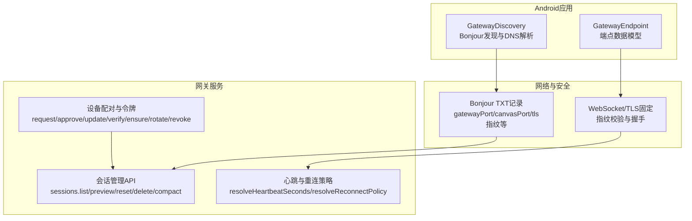
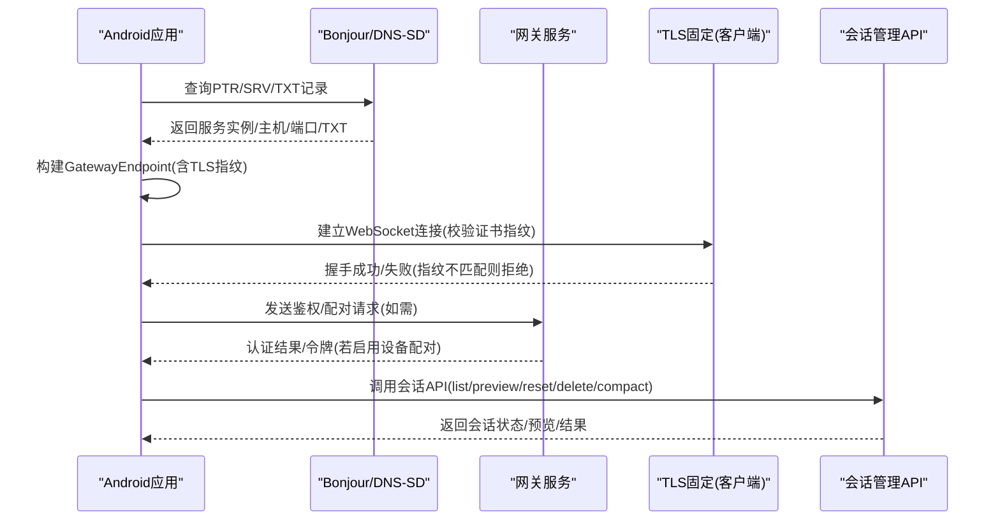
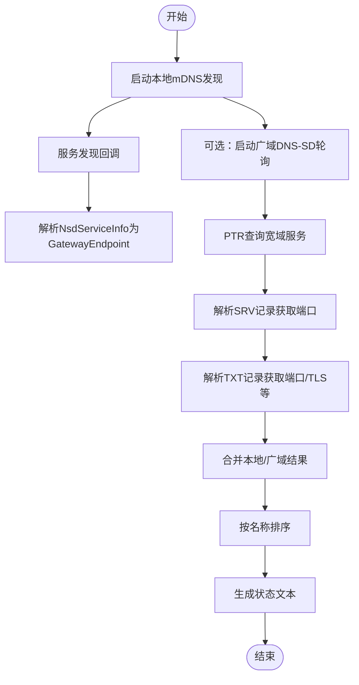
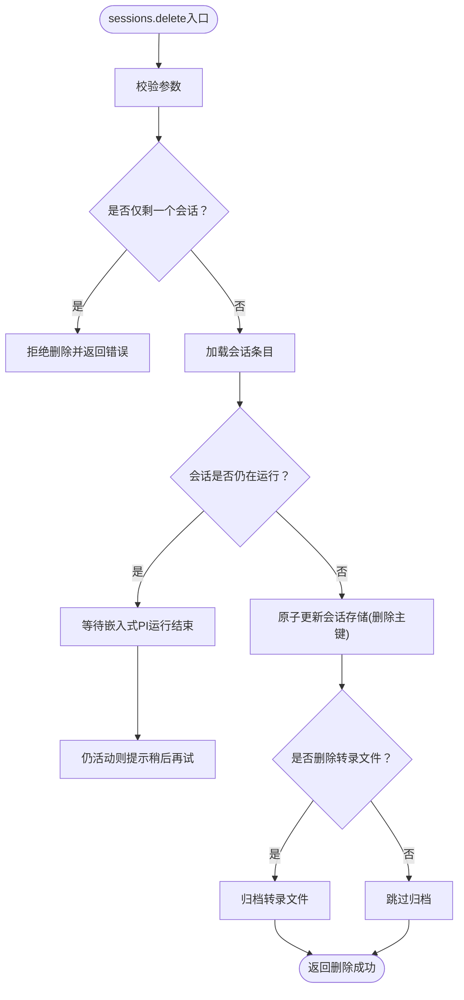
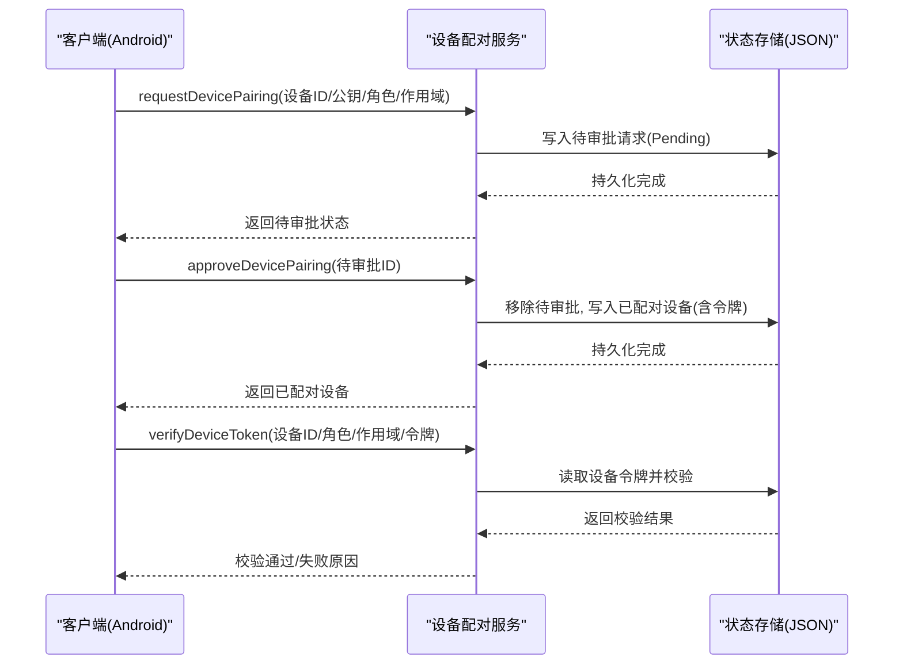
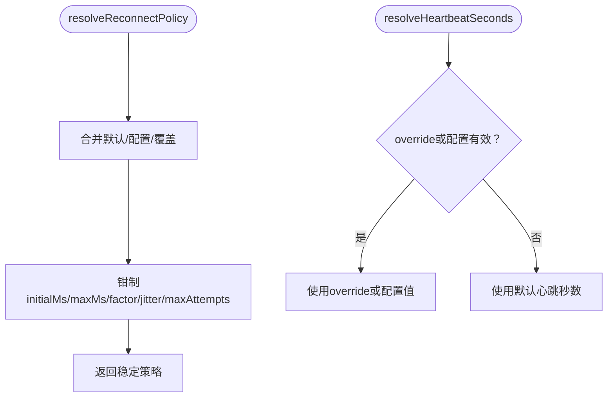
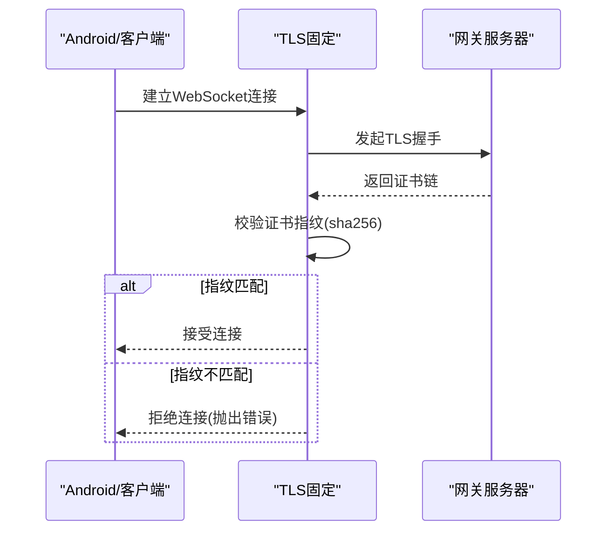
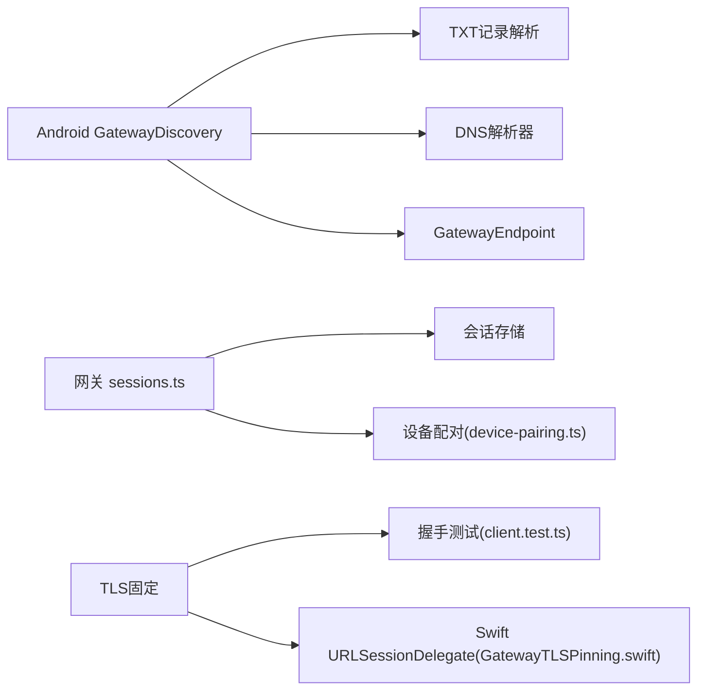

# 网关通信系统

<cite>
**本文档引用的文件**
- [GatewayDiscovery.kt](file://apps/android/app/src/main/java/ai/openclaw/android/gateway/GatewayDiscovery.kt)
- [GatewayEndpoint.kt](file://apps/android/app/src/main/java/ai/openclaw/android/gateway/GatewayEndpoint.kt)
- [bonjour.md](file://docs/gateway/bonjour.md)
- [authentication.md](file://docs/gateway/authentication.md)
- [configuration-reference.md](file://docs/gateway/configuration-reference.md)
- [sessions.ts](file://src/gateway/server-methods/sessions.ts)
- [device-pairing.ts](file://src/infra/device-pairing.ts)
- [reconnect.ts](file://src/web/reconnect.ts)
- [client.test.ts](file://src/gateway/client.test.ts)
- [GatewayTLSPinning.swift](file://apps/shared/OpenClawKit/Sources/OpenClawKit/GatewayTLSPinning.swift)
</cite>

## 目录

1. [简介](#简介)
2. [项目结构](#项目结构)
3. [核心组件](#核心组件)
4. [架构总览](#架构总览)
5. [详细组件分析](#详细组件分析)
6. [依赖关系分析](#依赖关系分析)
7. [性能考量](#性能考量)
8. [故障排查指南](#故障排查指南)
9. [结论](#结论)
10. [附录](#附录)

## 简介

本文件面向OpenClaw Android网关通信系统，聚焦以下关键能力与实现：

- Bonjour（mDNS/DNS-SD）发现机制：本地与广域（基于Tailscale）服务发布与解析
- 网关端点解析与展示：从TXT记录提取端口、TLS指纹、Tailnet DNS等信息
- WebSocket协议与TLS固定（证书指纹校验）
- 会话管理与持久化：会话列表、预览、重置、删除、压缩
- 设备配对与认证令牌管理：设备白名单、角色与作用域授权、令牌轮换与吊销
- 连接策略：心跳周期、指数回退重连、看门狗与异常恢复
- 安全与网络配置：TLS指纹固定、心跳与重连参数、网络绑定模式

## 项目结构

围绕Android端的Bonjour发现与网关端点解析，以及后端的会话管理、设备配对与重连策略，形成如下分层：

- 应用层（Android）：Bonjour发现、DNS查询、TXT记录解析、端点对象构建
- 协议与安全层：WebSocket/TLS固定、握手与错误处理
- 网关服务层：会话管理API、设备配对状态与令牌管理、心跳与重连策略

图表来源

- [GatewayDiscovery.kt](file://apps/android/app/src/main/java/ai/openclaw/android/gateway/GatewayDiscovery.kt#L1-L522)
- [GatewayEndpoint.kt](file://apps/android/app/src/main/java/ai/openclaw/android/gateway/GatewayEndpoint.kt#L1-L27)
- [sessions.ts](file://src/gateway/server-methods/sessions.ts#L1-L490)
- [device-pairing.ts](file://src/infra/device-pairing.ts#L1-L560)
- [reconnect.ts](file://src/web/reconnect.ts#L1-L53)

章节来源

- [GatewayDiscovery.kt](file://apps/android/app/src/main/java/ai/openclaw/android/gateway/GatewayDiscovery.kt#L1-L522)
- [GatewayEndpoint.kt](file://apps/android/app/src/main/java/ai/openclaw/android/gateway/GatewayEndpoint.kt#L1-L27)
- [bonjour.md](file://docs/gateway/bonjour.md#L1-L171)
- [configuration-reference.md](file://docs/gateway/configuration-reference.md#L62-L74)

## 核心组件

- Android端Bonjour发现器：负责本地mDNS与广域DNS-SD（unicast DNS-SD）查询，解析PTR/SRV/TXT记录，生成GatewayEndpoint对象，并维护状态文本
- 网关端点模型：封装主机、端口、Tailnet DNS、Canvas端口、TLS开关与指纹等字段
- 会话管理API：提供会话列表、预览、解析、补丁更新、重置、删除、压缩等操作
- 设备配对与令牌：请求配对、批准/拒绝、元数据更新；令牌签发、轮换、吊销与校验
- 心跳与重连策略：心跳秒数解析、指数回退策略、最大尝试次数、抖动与上限钳制
- TLS固定：客户端侧证书指纹校验，防止中间人攻击

章节来源

- [GatewayDiscovery.kt](file://apps/android/app/src/main/java/ai/openclaw/android/gateway/GatewayDiscovery.kt#L1-L522)
- [GatewayEndpoint.kt](file://apps/android/app/src/main/java/ai/openclaw/android/gateway/GatewayEndpoint.kt#L1-L27)
- [sessions.ts](file://src/gateway/server-methods/sessions.ts#L1-L490)
- [device-pairing.ts](file://src/infra/device-pairing.ts#L1-L560)
- [reconnect.ts](file://src/web/reconnect.ts#L1-L53)
- [client.test.ts](file://src/gateway/client.test.ts#L131-L178)
- [GatewayTLSPinning.swift](file://apps/shared/OpenClawKit/Sources/OpenClawKit/GatewayTLSPinning.swift#L40-L69)

## 架构总览

下图展示了从Android发现到网关会话管理的整体交互：

图表来源

- [GatewayDiscovery.kt](file://apps/android/app/src/main/java/ai/openclaw/android/gateway/GatewayDiscovery.kt#L129-L167)
- [GatewayEndpoint.kt](file://apps/android/app/src/main/java/ai/openclaw/android/gateway/GatewayEndpoint.kt#L1-L27)
- [client.test.ts](file://src/gateway/client.test.ts#L131-L178)
- [GatewayTLSPinning.swift](file://apps/shared/OpenClawKit/Sources/OpenClawKit/GatewayTLSPinning.swift#L40-L69)
- [sessions.ts](file://src/gateway/server-methods/sessions.ts#L44-L135)

## 详细组件分析

### 组件A：Bonjour发现与端点解析

- 本地发现：通过NsdManager启动mDNS服务发现，监听服务出现/丢失事件，解析NsdServiceInfo中的TXT记录，构造GatewayEndpoint
- 广域发现：在配置了宽域域名时，周期性执行PTR查询，解析SRV与TXT记录，支持A/AAAA记录回退解析
- TXT键值解析：displayName、lanHost、tailnetDns、gatewayPort、canvasPort、gatewayTls、gatewayTlsSha256等
- 状态聚合：合并本地与广域结果，排序并生成状态文本，便于UI展示

图表来源

- [GatewayDiscovery.kt](file://apps/android/app/src/main/java/ai/openclaw/android/gateway/GatewayDiscovery.kt#L99-L193)
- [GatewayEndpoint.kt](file://apps/android/app/src/main/java/ai/openclaw/android/gateway/GatewayEndpoint.kt#L1-L27)

章节来源

- [GatewayDiscovery.kt](file://apps/android/app/src/main/java/ai/openclaw/android/gateway/GatewayDiscovery.kt#L1-L522)
- [GatewayEndpoint.kt](file://apps/android/app/src/main/java/ai/openclaw/android/gateway/GatewayEndpoint.kt#L1-L27)
- [bonjour.md](file://docs/gateway/bonjour.md#L1-L171)

### 组件B：会话管理API

- 列表与预览：支持多键查询、限制预览条目数量与字符长度
- 解析：将用户输入的会话键规范化为目标存储键
- 补丁更新：原子更新会话存储，支持模型引用解析
- 重置：生成新sessionId，清零token计数，保留部分上下文字段
- 删除：禁止删除最后一个会话；清理队列与子代理；可选归档转录文件
- 压缩：按行数阈值保留最新内容，归档旧文件并更新会话统计字段

图表来源

- [sessions.ts](file://src/gateway/server-methods/sessions.ts#L273-L370)

章节来源

- [sessions.ts](file://src/gateway/server-methods/sessions.ts#L1-L490)

### 组件C：设备配对与认证令牌管理

- 请求配对：生成待审批请求，带设备标识、公钥、角色/作用域、远程IP等
- 批准/拒绝：批准时合并角色与作用域，生成初始令牌；拒绝则移除待审批项
- 元数据更新：动态更新设备显示名、平台、clientId等
- 令牌校验：严格比对设备已配对、角色存在、未吊销、令牌一致、作用域允许
- 令牌生命周期：确保令牌、轮换、吊销与最后使用时间更新；支持按角色保证最小权限

图表来源

- [device-pairing.ts](file://src/infra/device-pairing.ts#L256-L363)
- [device-pairing.ts](file://src/infra/device-pairing.ts#L411-L449)

章节来源

- [device-pairing.ts](file://src/infra/device-pairing.ts#L1-L560)

### 组件D：心跳与重连策略

- 心跳秒数解析：优先使用配置覆盖，否则采用默认值
- 重连策略：指数回退、抖动、最大尝试次数；对边界值进行钳制
- 连接ID：每次新连接生成唯一ID，便于日志追踪

图表来源

- [reconnect.ts](file://src/web/reconnect.ts#L28-L46)
- [reconnect.ts](file://src/web/reconnect.ts#L20-L26)

章节来源

- [reconnect.ts](file://src/web/reconnect.ts#L1-L53)
- [configuration-reference.md](file://docs/gateway/configuration-reference.md#L62-L74)

### 组件E：TLS固定与握手

- 客户端侧证书固定：在URLSessionDelegate中校验服务器信任链，仅当指纹匹配才接受连接
- 测试用例：当期望指纹与实际不一致时，应触发TLS错误并终止连接
- Swift实现：通过URLSessionDelegate进行证书挑战处理，设置消息大小限制

图表来源

- [client.test.ts](file://src/gateway/client.test.ts#L131-L178)
- [GatewayTLSPinning.swift](file://apps/shared/OpenClawKit/Sources/OpenClawKit/GatewayTLSPinning.swift#L40-L69)

章节来源

- [client.test.ts](file://src/gateway/client.test.ts#L131-L178)
- [GatewayTLSPinning.swift](file://apps/shared/OpenClawKit/Sources/OpenClawKit/GatewayTLSPinning.swift#L40-L69)

## 依赖关系分析

- Android端依赖：
  - 本地mDNS：NsdManager
  - 广域DNS-SD：自定义DNS解析器（A/AAAA/PTR/SRV/TXT），支持系统DNS与直连解析器
  - TXT记录解析：UTF-8解码、键值提取、布尔/整型转换
- 网关端依赖：
  - 会话管理：会话存储路径解析、原子更新、转录文件归档
  - 设备配对：状态目录、原子写入、锁保护、作用域与角色合并
  - 心跳与重连：配置解析、回退策略、连接ID生成
- 安全依赖：
  - TLS固定：证书指纹校验，防止中间人攻击
  - 认证令牌：严格校验、作用域授权、吊销控制

图表来源

- [GatewayDiscovery.kt](file://apps/android/app/src/main/java/ai/openclaw/android/gateway/GatewayDiscovery.kt#L310-L334)
- [sessions.ts](file://src/gateway/server-methods/sessions.ts#L1-L490)
- [device-pairing.ts](file://src/infra/device-pairing.ts#L1-L560)
- [client.test.ts](file://src/gateway/client.test.ts#L131-L178)
- [GatewayTLSPinning.swift](file://apps/shared/OpenClawKit/Sources/OpenClawKit/GatewayTLSPinning.swift#L40-L69)

章节来源

- [GatewayDiscovery.kt](file://apps/android/app/src/main/java/ai/openclaw/android/gateway/GatewayDiscovery.kt#L1-L522)
- [sessions.ts](file://src/gateway/server-methods/sessions.ts#L1-L490)
- [device-pairing.ts](file://src/infra/device-pairing.ts#L1-L560)
- [client.test.ts](file://src/gateway/client.test.ts#L131-L178)
- [GatewayTLSPinning.swift](file://apps/shared/OpenClawKit/Sources/OpenClawKit/GatewayTLSPinning.swift#L40-L69)

## 性能考量

- DNS查询优化：优先使用系统DNS，失败时回退至直连解析器；缓存A/AAAA记录以减少重复查询
- 会话压缩：按行数阈值保留最新内容，避免磁盘膨胀；原子更新避免并发冲突
- 重连策略：指数回退+抖动降低风暴效应；最大尝试次数限制避免无限占用资源
- TLS固定：仅在握手阶段进行指纹校验，避免额外开销；消息大小限制防止内存压力

## 故障排查指南

- Bonjour无法跨网段：确认已启用广域DNS-SD并在Tailscale中配置Split DNS
- 解析失败：检查服务实例名复杂度（避免表情符号/特殊字符），重启网关
- TLS握手失败：核对网关端TLS开启状态与指纹；客户端应拒绝指纹不匹配的连接
- 会话删除失败：确保至少保留一个会话；若会话正在运行，等待其结束后再试
- 设备令牌校验失败：确认设备已配对、角色存在、令牌未吊销且作用域满足要求

章节来源

- [bonjour.md](file://docs/gateway/bonjour.md#L142-L171)
- [client.test.ts](file://src/gateway/client.test.ts#L131-L178)
- [sessions.ts](file://src/gateway/server-methods/sessions.ts#L295-L308)
- [device-pairing.ts](file://src/infra/device-pairing.ts#L411-L449)

## 结论

OpenClaw Android网关通信系统通过Bonjour实现便捷的本地与广域发现，结合TLS固定与严格的设备配对/令牌管理，确保连接安全与会话可控。心跳与指数回退重连策略提升了网络异常场景下的稳定性。建议在生产环境中：

- 启用广域DNS-SD与Split DNS，确保跨网段可达
- 使用TLS固定并定期轮换令牌
- 合理配置心跳与重连参数，平衡延迟与资源消耗
- 对会话进行定期压缩与归档，控制存储成本

## 附录

- 配置参考：心跳与重连参数位于web配置段，可通过配置文件覆盖默认行为
- 认证参考：设备配对与令牌管理遵循最小权限原则，支持按角色与作用域授权

章节来源

- [configuration-reference.md](file://docs/gateway/configuration-reference.md#L62-L74)
- [authentication.md](file://docs/gateway/authentication.md#L1-L146)
