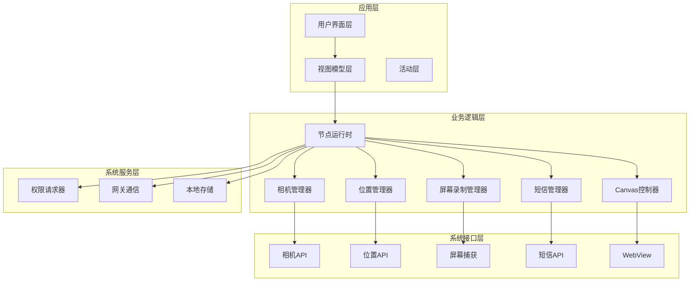
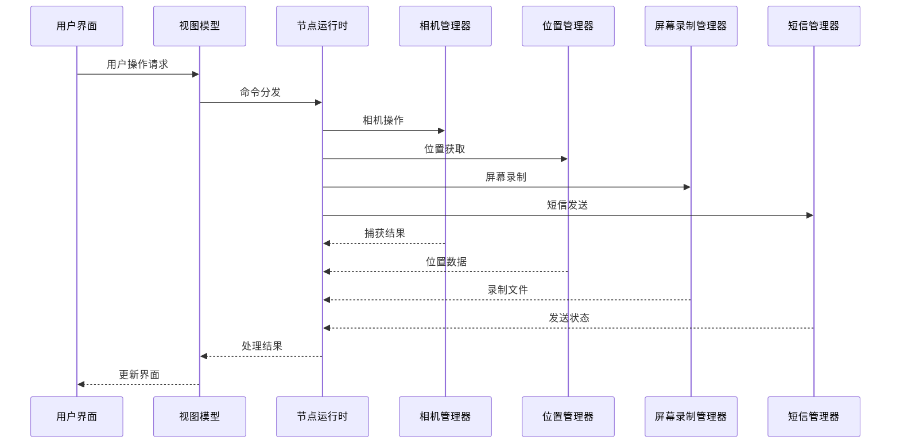
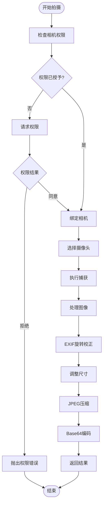
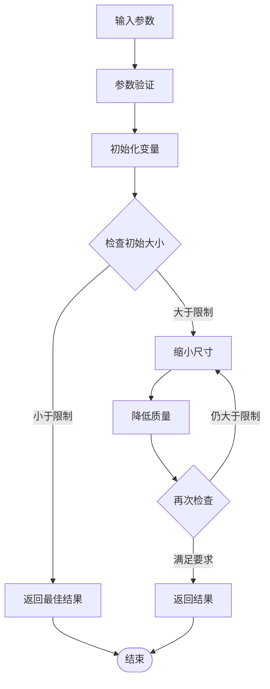
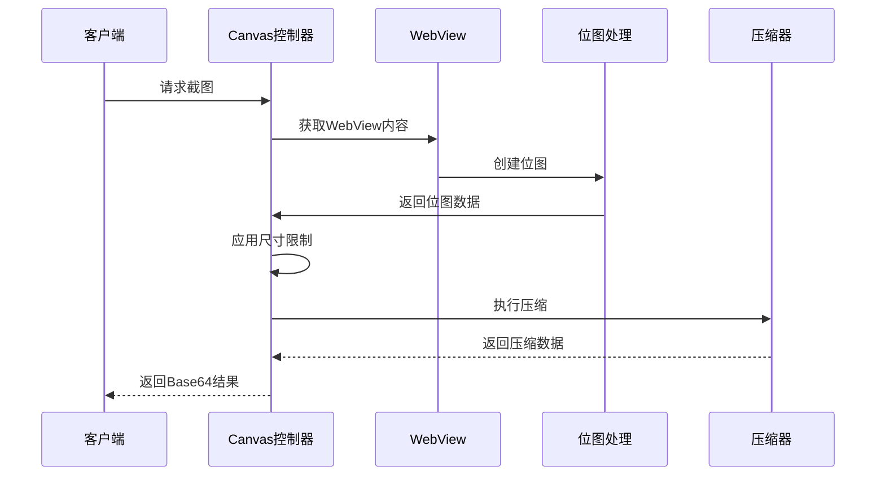
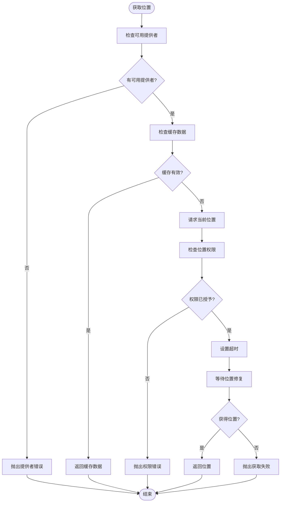
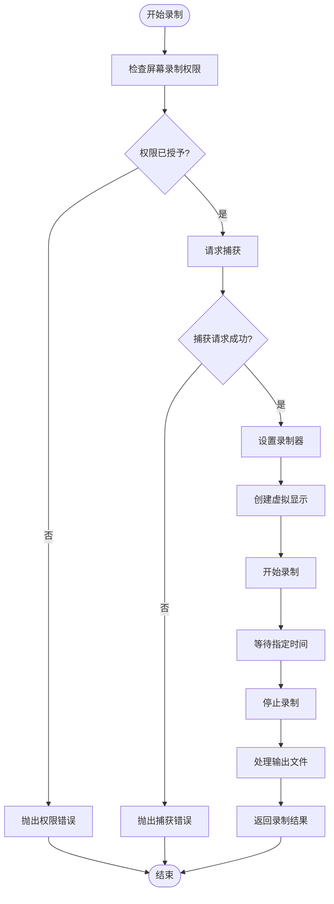
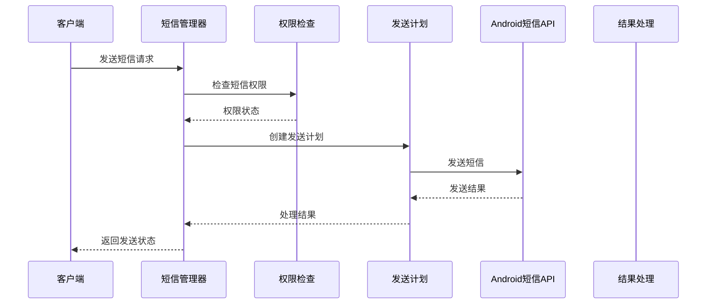
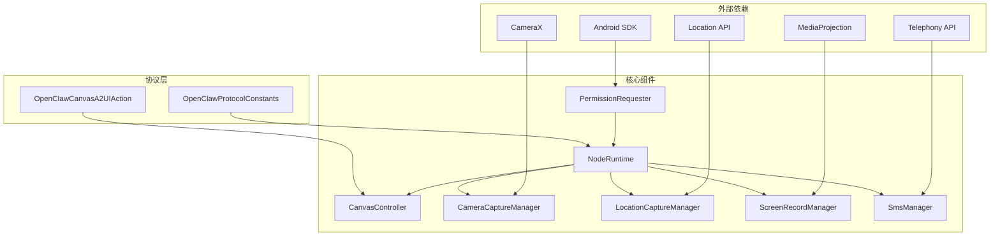

# 设备控制功能

<cite>
**本文档引用的文件**
- [CameraCaptureManager.kt](file://apps/android/app/src/main/java/ai/openclaw/android/node/CameraCaptureManager.kt)
- [CanvasController.kt](file://apps/android/app/src/main/java/ai/openclaw/android/node/CanvasController.kt)
- [LocationCaptureManager.kt](file://apps/android/app/src/main/java/ai/openclaw/android/node/LocationCaptureManager.kt)
- [ScreenRecordManager.kt](file://apps/android/app/src/main/java/ai/openclaw/android/node/ScreenRecordManager.kt)
- [SmsManager.kt](file://apps/android/app/src/main/java/ai/openclaw/android/node/SmsManager.kt)
- [JpegSizeLimiter.kt](file://apps/android/app/src/main/java/ai/openclaw/android/node/JpegSizeLimiter.kt)
- [PermissionRequester.kt](file://apps/android/app/src/main/java/ai/openclaw/android/PermissionRequester.kt)
- [MainActivity.kt](file://apps/android/app/src/main/java/ai/openclaw/android/MainActivity.kt)
- [MainViewModel.kt](file://apps/android/app/src/main/java/ai/openclaw/android/MainViewModel.kt)
- [NodeRuntime.kt](file://apps/android/app/src/main/java/ai/openclaw/android/NodeRuntime.kt)
- [OpenClawProtocolConstants.kt](file://apps/android/app/src/main/java/ai/openclaw/android/protocol/OpenClawProtocolConstants.kt)
- [OpenClawCanvasA2UIAction.kt](file://apps/android/app/src/main/java/ai/openclaw/android/protocol/OpenClawCanvasA2UIAction.kt)
</cite>

## 目录

1. [简介](#简介)
2. [项目结构](#项目结构)
3. [核心组件](#核心组件)
4. [架构概览](#架构概览)
5. [详细组件分析](#详细组件分析)
6. [依赖关系分析](#依赖关系分析)
7. [性能考虑](#性能考虑)
8. [故障排除指南](#故障排除指南)
9. [结论](#结论)

## 简介

OpenClaw Android设备控制功能是一个综合性的移动控制平台，集成了相机捕获、Canvas控制器、位置服务、屏幕录制和短信管理等多种设备控制能力。该系统采用现代Android开发最佳实践，通过协程异步处理、权限管理系统和安全的数据传输机制，为用户提供安全可靠的设备控制体验。

系统的核心设计原则包括：

- **安全性优先**：严格的权限检查和用户授权机制
- **性能优化**：高效的媒体处理和内存管理策略
- **用户体验**：直观的界面和流畅的操作响应
- **兼容性**：广泛的Android版本支持和设备适配

## 项目结构

Android应用采用模块化架构设计，主要分为以下几个核心层次：

**图表来源**

- [MainActivity.kt](file://apps/android/app/src/main/java/ai/openclaw/android/MainActivity.kt#L25-L65)
- [MainViewModel.kt](file://apps/android/app/src/main/java/ai/openclaw/android/MainViewModel.kt#L13-L70)
- [NodeRuntime.kt](file://apps/android/app/src/main/java/ai/openclaw/android/NodeRuntime.kt#L61-L72)

**章节来源**

- [MainActivity.kt](file://apps/android/app/src/main/java/ai/openclaw/android/MainActivity.kt#L1-L131)
- [MainViewModel.kt](file://apps/android/app/src/main/java/ai/openclaw/android/MainViewModel.kt#L1-L175)
- [NodeRuntime.kt](file://apps/android/app/src/main/java/ai/openclaw/android/NodeRuntime.kt#L1-L120)

## 核心组件

### 相机捕获管理器 (CameraCaptureManager)

相机捕获管理器是设备控制功能的核心组件之一，负责处理设备的图像和视频捕获需求。该组件支持多种拍摄模式，包括静态照片拍摄和短视频录制，并提供了完整的权限管理和质量控制机制。

主要功能特性：

- **多相机支持**：前后摄像头切换
- **高质量输出**：可配置的分辨率和质量参数
- **自动优化**：基于EXIF信息的自动旋转校正
- **内存优化**：智能的内存管理和回收策略

### Canvas控制器 (CanvasController)

Canvas控制器提供了一个强大的WebView集成解决方案，允许在应用中嵌入和控制网页内容。该组件支持动态内容加载、JavaScript执行和屏幕截图功能。

核心能力：

- **动态导航**：支持URL导航和内容刷新
- **调试状态**：实时的状态显示和调试信息
- **跨格式截图**：支持PNG和JPEG格式的屏幕截图
- **质量控制**：可配置的压缩质量和尺寸限制

### 位置服务集成 (LocationCaptureManager)

位置服务管理器提供了精确的位置信息获取能力，支持多种定位源和精度级别。该组件能够根据用户需求和设备能力选择最优的定位策略。

关键特性：

- **多源定位**：GPS、网络和辅助定位源
- **精度控制**：可配置的精度要求和年龄限制
- **超时处理**：智能的超时管理和错误恢复
- **隐私保护**：符合Android隐私规范的位置数据处理

### 屏幕录制管理器 (ScreenRecordManager)

屏幕录制管理器实现了高质量的屏幕录制功能，支持音频和视频同步录制。该组件使用Android的MediaProjection API，确保录制质量和系统兼容性。

主要功能：

- **高帧率录制**：支持1-60fps的灵活帧率设置
- **音频录制**：可选的麦克风音频录制
- **格式支持**：MP4容器格式的H.264视频编码
- **内存管理**：高效的临时文件管理和清理

### 短信管理器 (SmsManager)

短信管理器提供了安全可靠的短信发送功能，支持长文本的分段处理和多部分消息发送。该组件严格遵守Android的短信API规范和隐私保护要求。

核心能力：

- **分段发送**：自动的短信分段和重组
- **权限验证**：严格的权限检查和用户授权
- **错误处理**：完善的错误捕获和用户反馈
- **兼容性**：广泛的设备和运营商支持

**章节来源**

- [CameraCaptureManager.kt](file://apps/android/app/src/main/java/ai/openclaw/android/node/CameraCaptureManager.kt#L37-L137)
- [CanvasController.kt](file://apps/android/app/src/main/java/ai/openclaw/android/node/CanvasController.kt#L23-L70)
- [LocationCaptureManager.kt](file://apps/android/app/src/main/java/ai/openclaw/android/node/LocationCaptureManager.kt#L19-L62)
- [ScreenRecordManager.kt](file://apps/android/app/src/main/java/ai/openclaw/android/node/ScreenRecordManager.kt#L16-L123)
- [SmsManager.kt](file://apps/android/app/src/main/java/ai/openclaw/android/node/SmsManager.kt#L20-L115)

## 架构概览

系统采用分层架构设计，确保各组件之间的松耦合和高内聚。整体架构遵循MVVM模式，通过NodeRuntime作为中央协调器管理所有设备控制功能。

**图表来源**

- [NodeRuntime.kt](file://apps/android/app/src/main/java/ai/openclaw/android/NodeRuntime.kt#L452-L473)
- [MainViewModel.kt](file://apps/android/app/src/main/java/ai/openclaw/android/MainViewModel.kt#L13-L70)

**章节来源**

- [NodeRuntime.kt](file://apps/android/app/src/main/java/ai/openclaw/android/NodeRuntime.kt#L452-L487)
- [MainViewModel.kt](file://apps/android/app/src/main/java/ai/openclaw/android/MainViewModel.kt#L13-L70)

## 详细组件分析

### 相机捕获管理器深度分析

相机捕获管理器实现了完整的相机生命周期管理和媒体处理流程。该组件通过ProcessCameraProvider API实现现代化的相机控制，并提供了丰富的配置选项。

#### 核心数据流

**图表来源**

- [CameraCaptureManager.kt](file://apps/android/app/src/main/java/ai/openclaw/android/node/CameraCaptureManager.kt#L75-L137)

#### JPEG尺寸限制器算法

JPEG尺寸限制器采用了智能的二进制搜索算法，确保输出的JPEG文件大小不超过指定限制：

**图表来源**

- [JpegSizeLimiter.kt](file://apps/android/app/src/main/java/ai/openclaw/android/node/JpegSizeLimiter.kt#L15-L60)

**章节来源**

- [CameraCaptureManager.kt](file://apps/android/app/src/main/java/ai/openclaw/android/node/CameraCaptureManager.kt#L75-L198)
- [JpegSizeLimiter.kt](file://apps/android/app/src/main/java/ai/openclaw/android/node/JpegSizeLimiter.kt#L14-L61)

### Canvas控制器深度分析

Canvas控制器提供了强大的WebView集成能力，支持动态内容加载和交互式界面控制。该组件通过JavaScript桥接实现了与原生Android代码的无缝集成。

#### 截图处理流程

**图表来源**

- [CanvasController.kt](file://apps/android/app/src/main/java/ai/openclaw/android/node/CanvasController.kt#L135-L172)

**章节来源**

- [CanvasController.kt](file://apps/android/app/src/main/java/ai/openclaw/android/node/CanvasController.kt#L125-L172)

### 位置服务集成深度分析

位置服务管理器实现了智能的位置获取策略，能够在不同精度要求下选择最优的定位方案。

#### 位置获取决策流程

**图表来源**

- [LocationCaptureManager.kt](file://apps/android/app/src/main/java/ai/openclaw/android/node/LocationCaptureManager.kt#L22-L62)

**章节来源**

- [LocationCaptureManager.kt](file://apps/android/app/src/main/java/ai/openclaw/android/node/LocationCaptureManager.kt#L22-L116)

### 屏幕录制管理器深度分析

屏幕录制管理器实现了高质量的屏幕录制功能，支持音频和视频的同步录制。该组件使用Android的MediaProjection API，确保录制质量和系统兼容性。

#### 录制流程控制

**图表来源**

- [ScreenRecordManager.kt](file://apps/android/app/src/main/java/ai/openclaw/android/node/ScreenRecordManager.kt#L30-L123)

**章节来源**

- [ScreenRecordManager.kt](file://apps/android/app/src/main/java/ai/openclaw/android/node/ScreenRecordManager.kt#L30-L198)

### 短信管理器深度分析

短信管理器提供了安全可靠的短信发送功能，支持长文本的分段处理和多部分消息发送。该组件严格遵守Android的短信API规范和隐私保护要求。

#### 短信发送流程

**图表来源**

- [SmsManager.kt](file://apps/android/app/src/main/java/ai/openclaw/android/node/SmsManager.kt#L142-L202)

**章节来源**

- [SmsManager.kt](file://apps/android/app/src/main/java/ai/openclaw/android/node/SmsManager.kt#L142-L230)

## 依赖关系分析

系统组件之间的依赖关系体现了清晰的分层架构设计，每个组件都有明确的职责边界和依赖方向。

**图表来源**

- [NodeRuntime.kt](file://apps/android/app/src/main/java/ai/openclaw/android/NodeRuntime.kt#L23-L71)
- [PermissionRequester.kt](file://apps/android/app/src/main/java/ai/openclaw/android/PermissionRequester.kt#L22-L31)

**章节来源**

- [NodeRuntime.kt](file://apps/android/app/src/main/java/ai/openclaw/android/NodeRuntime.kt#L23-L71)
- [OpenClawProtocolConstants.kt](file://apps/android/app/src/main/java/ai/openclaw/android/protocol/OpenClawProtocolConstants.kt#L1-L72)

## 性能考虑

### 内存管理策略

系统采用了多层次的内存管理策略，确保在处理大量媒体数据时的内存效率：

1. **及时回收**：所有临时Bitmap对象在使用后立即回收
2. **尺寸限制**：智能的图像尺寸调整避免内存溢出
3. **流式处理**：大文件采用流式读写减少内存占用
4. **协程管理**：合理的协程调度避免并发内存峰值

### 线程安全设计

所有设备控制操作都在适当的线程上下文中执行：

- **主线程**：UI相关操作和WebView交互
- **IO线程**：文件读写和网络通信
- **默认线程**：CPU密集型任务如图像处理

### 缓存优化

系统实现了智能的缓存策略：

- **位置缓存**：最近位置信息的短期缓存
- **权限状态**：权限检查结果的短期缓存
- **配置缓存**：用户偏好的持久化存储

## 故障排除指南

### 常见问题诊断

#### 相机相关问题

- **无权限**：检查相机权限是否被用户拒绝
- **设备不支持**：验证设备是否具备相机硬件
- **内存不足**：检查是否有足够的内存空间进行图像处理

#### 位置服务问题

- **GPS未启用**：确认GPS和网络定位服务已开启
- **权限缺失**：验证ACCESS_FINE_LOCATION或ACCESS_COARSE_LOCATION权限
- **超时错误**：检查网络连接和定位服务可用性

#### 屏幕录制问题

- **捕获权限**：确认用户已授予屏幕录制权限
- **音频权限**：如果包含音频，需额外的麦克风权限
- **存储空间**：确保有足够的存储空间保存录制文件

#### 短信发送问题

- **短信权限**：验证SEND_SMS权限状态
- **设备支持**：检查设备是否具备电话功能
- **号码格式**：确认目标号码格式正确

**章节来源**

- [PermissionRequester.kt](file://apps/android/app/src/main/java/ai/openclaw/android/PermissionRequester.kt#L87-L114)
- [CameraCaptureManager.kt](file://apps/android/app/src/main/java/ai/openclaw/android/node/CameraCaptureManager.kt#L51-L73)
- [LocationCaptureManager.kt](file://apps/android/app/src/main/java/ai/openclaw/android/node/LocationCaptureManager.kt#L64-L84)

## 结论

OpenClaw Android设备控制功能展现了现代移动应用开发的最佳实践，通过精心设计的架构和实现策略，为用户提供了强大而安全的设备控制能力。

### 主要优势

1. **安全性**：严格的权限管理和用户授权机制
2. **性能**：高效的媒体处理和内存管理策略
3. **兼容性**：广泛的Android版本和设备支持
4. **用户体验**：直观的界面和流畅的操作响应
5. **扩展性**：模块化的架构便于功能扩展

### 技术亮点

- **协程异步处理**：充分利用Kotlin协程的优势
- **智能权限管理**：友好的权限请求和用户引导
- **高质量媒体处理**：专业的图像和视频处理算法
- **健壮的错误处理**：完善的异常捕获和用户反馈

该系统为OpenClaw平台提供了坚实的移动控制基础，为未来的功能扩展和技术演进奠定了良好的技术基础。
