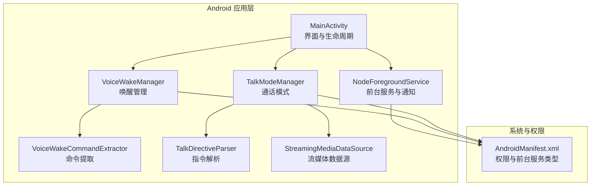
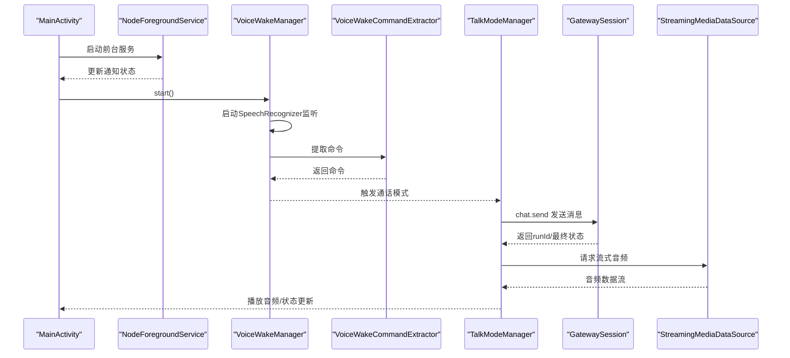
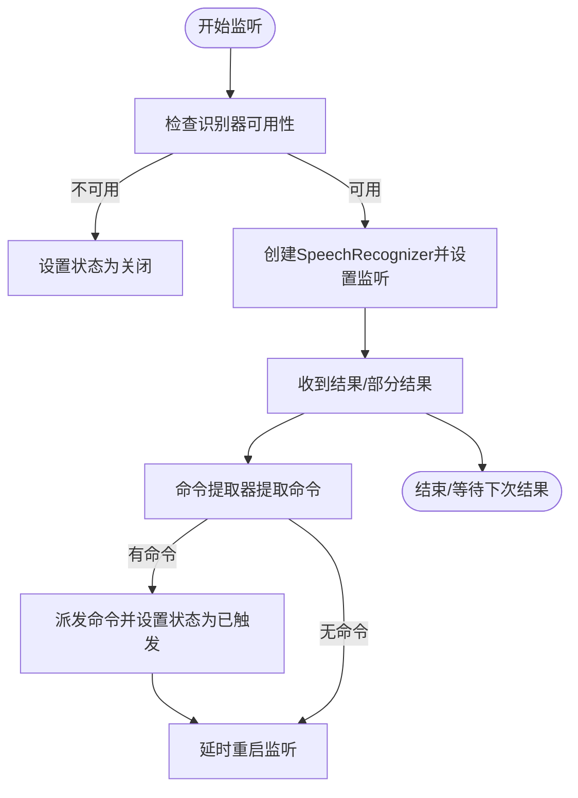
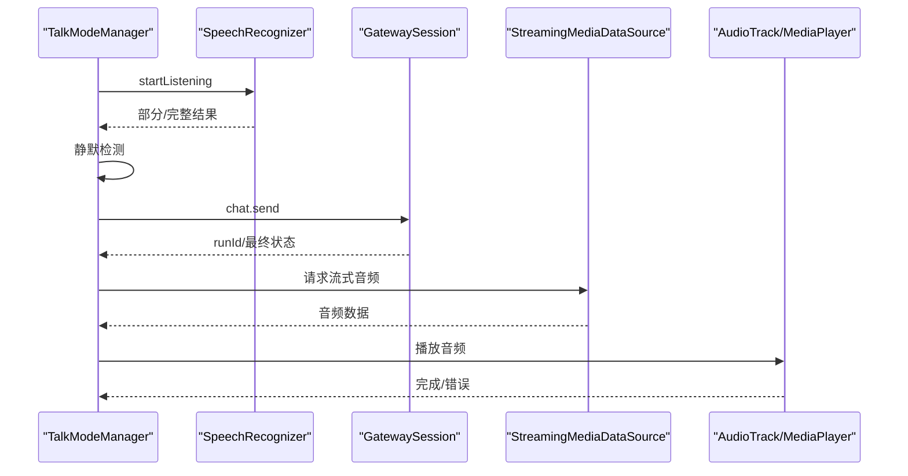
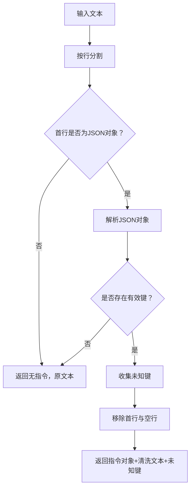
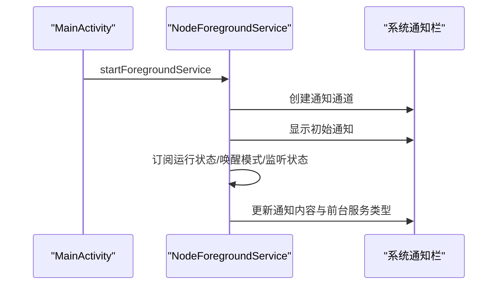
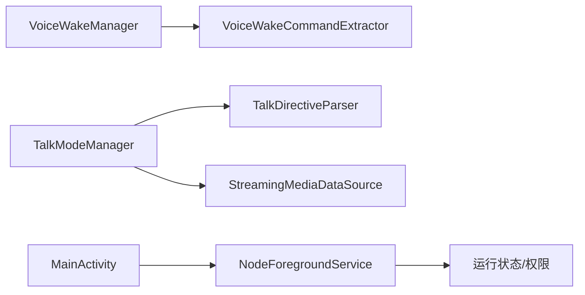

# 语音交互系统

<cite>
**本文引用的文件**
- [AndroidManifest.xml](file://apps/android/app/src/main/AndroidManifest.xml)
- [MainActivity.kt](file://apps/android/app/src/main/java/ai/openclaw/android/MainActivity.kt)
- [NodeForegroundService.kt](file://apps/android/app/src/main/java/ai/openclaw/android/NodeForegroundService.kt)
- [VoiceWakeManager.kt](file://apps/android/app/src/main/java/ai/openclaw/android/voice/VoiceWakeManager.kt)
- [VoiceWakeCommandExtractor.kt](file://apps/android/app/src/main/java/ai/openclaw/android/voice/VoiceWakeCommandExtractor.kt)
- [TalkDirectiveParser.kt](file://apps/android/app/src/main/java/ai/openclaw/android/voice/TalkDirectiveParser.kt)
- [TalkModeManager.kt](file://apps/android/app/src/main/java/ai/openclaw/android/voice/TalkModeManager.kt)
- [StreamingMediaDataSource.kt](file://apps/android/app/src/main/java/ai/openclaw/android/voice/StreamingMediaDataSource.kt)
- [VoiceWakeMode.kt](file://apps/android/app/src/main/java/ai/openclaw/android/VoiceWakeMode.kt)
- [SecurePrefs.kt](file://apps/android/app/src/main/java/ai/openclaw/android/SecurePrefs.kt)
</cite>

## 目录

1. [简介](#简介)
2. [项目结构](#项目结构)
3. [核心组件](#核心组件)
4. [架构总览](#架构总览)
5. [详细组件分析](#详细组件分析)
6. [依赖关系分析](#依赖关系分析)
7. [性能与功耗优化](#性能与功耗优化)
8. [故障排查指南](#故障排查指南)
9. [结论](#结论)
10. [附录](#附录)

## 简介

本文件面向OpenClaw Android语音交互系统，聚焦以下能力与模块：

- 语音唤醒管理：基于Android SpeechRecognizer的触发词检测与命令提取
- 命令提取器：从唤醒后的自然语言中抽取可执行命令
- 通话模式管理：端到端语音对话（ASR → 网关 → TTS/流式播放）
- 指令解析：Talk指令解析与参数标准化
- 流媒体数据源：ElevenLabs流式音频的接收与播放
- 权限与前台服务：录音权限、通知与前台服务类型
- 用户体验与延迟优化：静默窗口、重试与中断策略
- 功耗控制：按需启动/停止、最小化资源占用

## 项目结构

Android语音交互相关代码主要位于apps/android/app/src/main/java/ai/openclaw/android及子目录voice下，配合应用清单与前台服务实现持续运行与权限声明。

**图表来源**

- [MainActivity.kt](file://apps/android/app/src/main/java/ai/openclaw/android/MainActivity.kt#L25-L87)
- [NodeForegroundService.kt](file://apps/android/app/src/main/java/ai/openclaw/android/NodeForegroundService.kt#L23-L82)
- [VoiceWakeManager.kt](file://apps/android/app/src/main/java/ai/openclaw/android/voice/VoiceWakeManager.kt#L18-L76)
- [VoiceWakeCommandExtractor.kt](file://apps/android/app/src/main/java/ai/openclaw/android/voice/VoiceWakeCommandExtractor.kt#L3-L26)
- [TalkModeManager.kt](file://apps/android/app/src/main/java/ai/openclaw/android/voice/TalkModeManager.kt#L46-L134)
- [TalkDirectiveParser.kt](file://apps/android/app/src/main/java/ai/openclaw/android/voice/TalkDirectiveParser.kt#L33-L114)
- [StreamingMediaDataSource.kt](file://apps/android/app/src/main/java/ai/openclaw/android/voice/StreamingMediaDataSource.kt)
- [AndroidManifest.xml](file://apps/android/app/src/main/AndroidManifest.xml#L1-L50)

**章节来源**

- [AndroidManifest.xml](file://apps/android/app/src/main/AndroidManifest.xml#L1-L50)
- [MainActivity.kt](file://apps/android/app/src/main/java/ai/openclaw/android/MainActivity.kt#L25-L87)
- [NodeForegroundService.kt](file://apps/android/app/src/main/java/ai/openclaw/android/NodeForegroundService.kt#L23-L82)

## 核心组件

- 语音唤醒管理器：负责启动/停止唤醒监听、错误处理与命令提取
- 命令提取器：从识别结果中提取触发词后的命令文本
- 通话模式管理器：端到端语音对话，含静默检测、网关通信、TTS与播放
- 指令解析器：解析Talk指令中的JSON参数并清理文本
- 流媒体数据源：接收ElevenLabs流式音频并驱动MediaPlayer/AudioTrack播放
- 前台服务与权限：维持后台运行、显示通知、申请录音权限

**章节来源**

- [VoiceWakeManager.kt](file://apps/android/app/src/main/java/ai/openclaw/android/voice/VoiceWakeManager.kt#L18-L174)
- [VoiceWakeCommandExtractor.kt](file://apps/android/app/src/main/java/ai/openclaw/android/voice/VoiceWakeCommandExtractor.kt#L3-L41)
- [TalkModeManager.kt](file://apps/android/app/src/main/java/ai/openclaw/android/voice/TalkModeManager.kt#L46-L800)
- [TalkDirectiveParser.kt](file://apps/android/app/src/main/java/ai/openclaw/android/voice/TalkDirectiveParser.kt#L33-L192)
- [StreamingMediaDataSource.kt](file://apps/android/app/src/main/java/ai/openclaw/android/voice/StreamingMediaDataSource.kt)

## 架构总览

Android侧通过前台服务维持长连接与唤醒监听；唤醒管理器使用系统语音识别引擎进行触发词检测；通话模式管理器在识别完成后与网关通信获取回复，并通过流式TTS播放。权限与通知由清单与服务统一管理。

**图表来源**

- [MainActivity.kt](file://apps/android/app/src/main/java/ai/openclaw/android/MainActivity.kt#L37-L64)
- [NodeForegroundService.kt](file://apps/android/app/src/main/java/ai/openclaw/android/NodeForegroundService.kt#L35-L63)
- [VoiceWakeManager.kt](file://apps/android/app/src/main/java/ai/openclaw/android/voice/VoiceWakeManager.kt#L43-L91)
- [VoiceWakeCommandExtractor.kt](file://apps/android/app/src/main/java/ai/openclaw/android/voice/VoiceWakeCommandExtractor.kt#L4-L25)
- [TalkModeManager.kt](file://apps/android/app/src/main/java/ai/openclaw/android/voice/TalkModeManager.kt#L156-L340)
- [StreamingMediaDataSource.kt](file://apps/android/app/src/main/java/ai/openclaw/android/voice/StreamingMediaDataSource.kt)

## 详细组件分析

### 语音唤醒管理器

职责与行为：

- 管理SpeechRecognizer生命周期，设置识别参数（自由模型、部分结果、最大结果数）
- 处理识别回调，提取首条候选文本并交由命令提取器
- 错误处理与自动重启，避免长时间无响应
- 状态流暴露“是否监听”和状态文本

关键点：

- 识别可用性检查与异常捕获
- 部分/完整结果均尝试提取命令
- 重试调度与去抖动，防止频繁重启
- 权限不足时提示“需要录音权限”

**图表来源**

- [VoiceWakeManager.kt](file://apps/android/app/src/main/java/ai/openclaw/android/voice/VoiceWakeManager.kt#L43-L119)

**章节来源**

- [VoiceWakeManager.kt](file://apps/android/app/src/main/java/ai/openclaw/android/voice/VoiceWakeManager.kt#L18-L174)

### 命令提取器

职责与行为：

- 将触发词列表规范化为正则备选
- 使用正则匹配“触发词 + 命令”的结构，剔除标点与空白
- 返回清洗后的命令文本

注意：

- 忽略空触发词与重复项
- 正则大小写不敏感，支持多种标点分隔

**章节来源**

- [VoiceWakeCommandExtractor.kt](file://apps/android/app/src/main/java/ai/openclaw/android/voice/VoiceWakeCommandExtractor.kt#L3-L41)

### 通话模式管理器

职责与行为：

- 端到端语音对话：监听 → 静默检测 → 网关对话 → 文本提取 → TTS播放
- 静默检测：超过静默窗口后提交最终文本
- 网关订阅：按会话键订阅聊天事件，等待最终状态
- TTS播放：优先ElevenLabs流式PCM/MP3，失败回退系统TTS
- 中断策略：若正在说话且检测到新语音，可选择打断

关键流程：

- 启动：检查权限与识别器可用性，创建识别器并开始监听
- 结束：取消任务、销毁识别器、停止播放、释放资源
- 播放：根据输出格式选择AudioTrack或MediaPlayer；支持流式下载与边播边播

**图表来源**

- [TalkModeManager.kt](file://apps/android/app/src/main/java/ai/openclaw/android/voice/TalkModeManager.kt#L156-L340)
- [StreamingMediaDataSource.kt](file://apps/android/app/src/main/java/ai/openclaw/android/voice/StreamingMediaDataSource.kt)

**章节来源**

- [TalkModeManager.kt](file://apps/android/app/src/main/java/ai/openclaw/android/voice/TalkModeManager.kt#L46-L800)

### Talk指令解析

职责与行为：

- 解析首行JSON指令，支持多键名别名映射
- 支持的键包括voice/model/speed/rate/stability/similarity/style/speakerBoost/seed/normalize/language/outputFormat/latencyTier/once等
- 若存在有效键，则剥离首行指令并返回剩余文本与未知键列表

**图表来源**

- [TalkDirectiveParser.kt](file://apps/android/app/src/main/java/ai/openclaw/android/voice/TalkDirectiveParser.kt#L34-L114)

**章节来源**

- [TalkDirectiveParser.kt](file://apps/android/app/src/main/java/ai/openclaw/android/voice/TalkDirectiveParser.kt#L33-L192)

### 流媒体数据源

职责与行为：

- 作为MediaPlayer的数据源，支持异步拉取音频数据
- 在播放完成或出错时清理资源
- 与TalkModeManager协作，驱动流式播放

**章节来源**

- [StreamingMediaDataSource.kt](file://apps/android/app/src/main/java/ai/openclaw/android/voice/StreamingMediaDataSource.kt)

### 前台服务与权限

职责与行为：

- 启动前台服务，展示连接状态与唤醒监听状态通知
- 根据是否处于“常驻唤醒模式”和录音权限动态设置前台服务类型
- 主活动在启动时请求必要权限（如位置/WiFi发现/通知）

**图表来源**

- [MainActivity.kt](file://apps/android/app/src/main/java/ai/openclaw/android/MainActivity.kt#L37-L64)
- [NodeForegroundService.kt](file://apps/android/app/src/main/java/ai/openclaw/android/NodeForegroundService.kt#L35-L63)

**章节来源**

- [AndroidManifest.xml](file://apps/android/app/src/main/AndroidManifest.xml#L1-L50)
- [NodeForegroundService.kt](file://apps/android/app/src/main/java/ai/openclaw/android/NodeForegroundService.kt#L23-L181)
- [MainActivity.kt](file://apps/android/app/src/main/java/ai/openclaw/android/MainActivity.kt#L97-L129)

## 依赖关系分析

- 组件耦合
  - VoiceWakeManager依赖系统SpeechRecognizer与VoiceWakeCommandExtractor
  - TalkModeManager依赖GatewaySession、TalkDirectiveParser、StreamingMediaDataSource
  - NodeForegroundService依赖运行状态与权限状态，向UI反馈
- 外部依赖
  - Android系统权限与前台服务API
  - ElevenLabs流式TTS接口（通过流媒体数据源与播放器）
- 潜在循环依赖
  - 当前模块间为单向依赖，未见循环

**图表来源**

- [VoiceWakeManager.kt](file://apps/android/app/src/main/java/ai/openclaw/android/voice/VoiceWakeManager.kt#L18-L76)
- [VoiceWakeCommandExtractor.kt](file://apps/android/app/src/main/java/ai/openclaw/android/voice/VoiceWakeCommandExtractor.kt#L3-L26)
- [TalkModeManager.kt](file://apps/android/app/src/main/java/ai/openclaw/android/voice/TalkModeManager.kt#L46-L134)
- [TalkDirectiveParser.kt](file://apps/android/app/src/main/java/ai/openclaw/android/voice/TalkDirectiveParser.kt#L33-L114)
- [StreamingMediaDataSource.kt](file://apps/android/app/src/main/java/ai/openclaw/android/voice/StreamingMediaDataSource.kt)
- [NodeForegroundService.kt](file://apps/android/app/src/main/java/ai/openclaw/android/NodeForegroundService.kt#L35-L63)
- [MainActivity.kt](file://apps/android/app/src/main/java/ai/openclaw/android/MainActivity.kt#L37-L64)

**章节来源**

- [VoiceWakeManager.kt](file://apps/android/app/src/main/java/ai/openclaw/android/voice/VoiceWakeManager.kt#L18-L174)
- [TalkModeManager.kt](file://apps/android/app/src/main/java/ai/openclaw/android/voice/TalkModeManager.kt#L46-L800)

## 性能与功耗优化

- 启停策略
  - 仅在启用时启动识别器与播放器，及时销毁释放资源
  - 静默窗口结束后再发起对话，减少无效网络请求
- 重试与去抖
  - 识别错误与结束事件后延时重启，避免频繁重启
  - 已派发相同命令时去重，降低重复处理
- 播放路径选择
  - 优先PCM流式直播以降低延迟；失败回退MP3播放
  - 打断策略：正在播放时检测到新语音可中断，缩短总时延
- 前台服务类型
  - 仅在录音权限满足且常驻唤醒模式时开启麦克风前台服务类型，降低功耗

[本节为通用指导，无需特定文件引用]

## 故障排查指南

常见问题与定位建议：

- 无法启动唤醒
  - 检查识别器可用性与权限；查看状态文本提示
  - 参考：[VoiceWakeManager.kt](file://apps/android/app/src/main/java/ai/openclaw/android/voice/VoiceWakeManager.kt#L48-L62)
- 录音权限不足
  - 系统弹窗未授权或被拒绝；检查前台服务通知与权限请求
  - 参考：[NodeForegroundService.kt](file://apps/android/app/src/main/java/ai/openclaw/android/NodeForegroundService.kt#L56-L61)
- 识别错误频繁
  - 检查错误码与状态文本，确认网络/服务器状态
  - 参考：[VoiceWakeManager.kt](file://apps/android/app/src/main/java/ai/openclaw/android/voice/VoiceWakeManager.kt#L137-L158)
- 对话无回复
  - 网关未连接或超时；检查连接状态与会话订阅
  - 参考：[TalkModeManager.kt](file://apps/android/app/src/main/java/ai/openclaw/android/voice/TalkModeManager.kt#L306-L335)
- 播放异常
  - PCM初始化失败或缓冲区无效；回退MP3或检查音频属性
  - 参考：[TalkModeManager.kt](file://apps/android/app/src/main/java/ai/openclaw/android/voice/TalkModeManager.kt#L625-L665)

**章节来源**

- [VoiceWakeManager.kt](file://apps/android/app/src/main/java/ai/openclaw/android/voice/VoiceWakeManager.kt#L48-L158)
- [TalkModeManager.kt](file://apps/android/app/src/main/java/ai/openclaw/android/voice/TalkModeManager.kt#L306-L665)
- [NodeForegroundService.kt](file://apps/android/app/src/main/java/ai/openclaw/android/NodeForegroundService.kt#L56-L61)

## 结论

OpenClaw Android语音交互系统以清晰的模块划分实现了从唤醒到对话再到播放的完整链路。通过前台服务与权限管理保障长期稳定运行，通过静默检测与播放策略优化用户体验与延迟，通过流式TTS与回退机制提升鲁棒性。后续可在触发词自学习、噪声抑制与更细粒度的功耗控制方面进一步增强。

[本节为总结性内容，无需特定文件引用]

## 附录

- 唤醒模式配置
  - 通过偏好存储保存唤醒模式与触发词列表
  - 参考：[VoiceWakeMode.kt](file://apps/android/app/src/main/java/ai/openclaw/android/VoiceWakeMode.kt#L1-L14)，[SecurePrefs.kt](file://apps/android/app/src/main/java/ai/openclaw/android/SecurePrefs.kt#L232-L274)
- 清单与权限
  - 录音、通知、位置、前台服务等权限与类型声明
  - 参考：[AndroidManifest.xml](file://apps/android/app/src/main/AndroidManifest.xml#L1-L50)

**章节来源**

- [VoiceWakeMode.kt](file://apps/android/app/src/main/java/ai/openclaw/android/VoiceWakeMode.kt#L1-L14)
- [SecurePrefs.kt](file://apps/android/app/src/main/java/ai/openclaw/android/SecurePrefs.kt#L232-L274)
- [AndroidManifest.xml](file://apps/android/app/src/main/AndroidManifest.xml#L1-L50)
