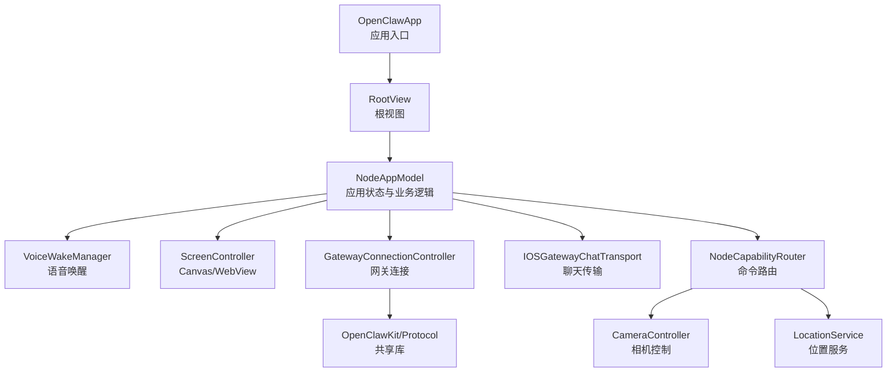
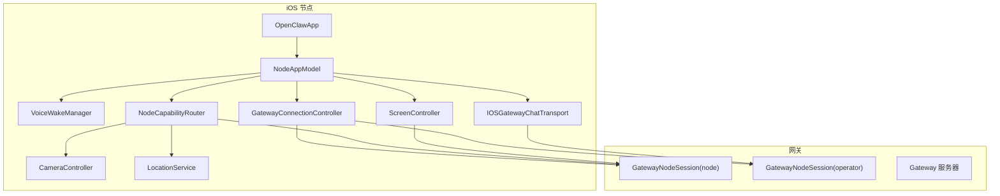
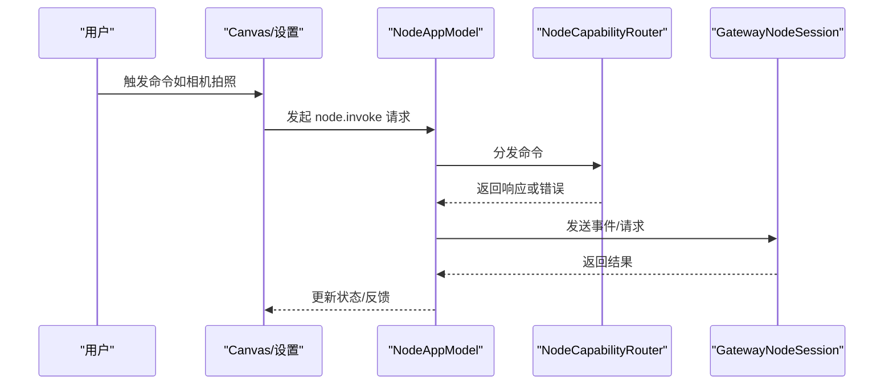
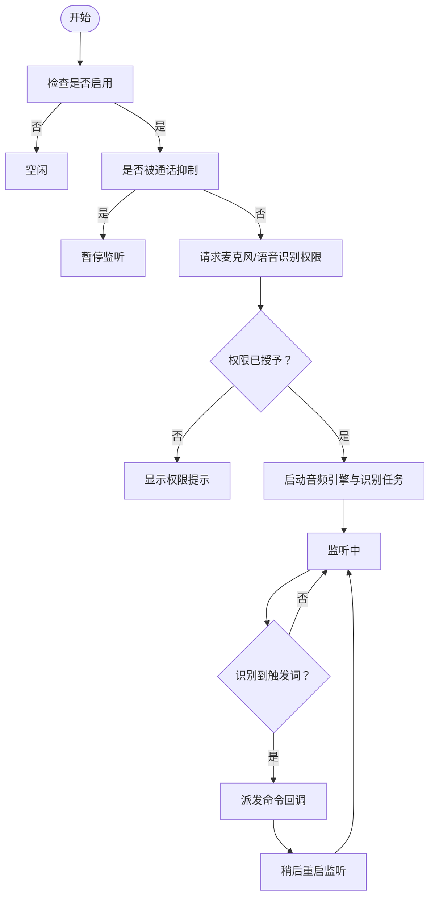
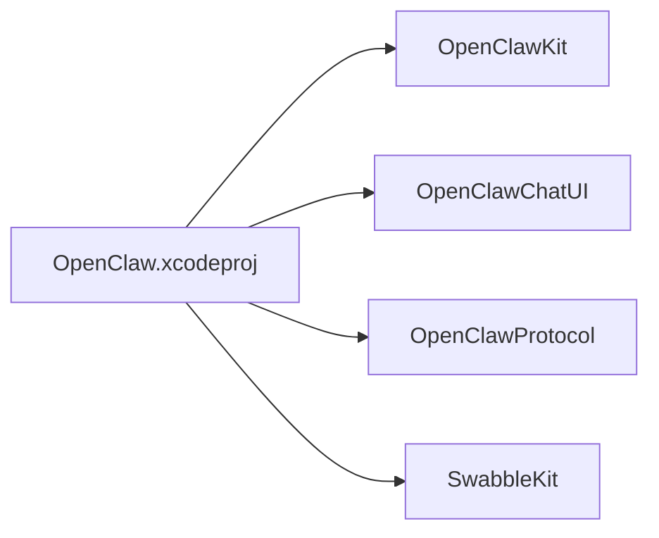

# iOS节点

<cite>
**本文档引用的文件**
- [apps/ios/README.md](file://apps/ios/README.md)
- [apps/ios/project.yml](file://apps/ios/project.yml)
- [apps/ios/Sources/OpenClawApp.swift](file://apps/ios/Sources/OpenClawApp.swift)
- [apps/ios/Sources/RootView.swift](file://apps/ios/Sources/RootView.swift)
- [apps/ios/Sources/Model/NodeAppModel.swift](file://apps/ios/Sources/Model/NodeAppModel.swift)
- [apps/ios/Sources/Model/NodeAppModel+Canvas.swift](file://apps/ios/Sources/Model/NodeAppModel+Canvas.swift)
- [apps/ios/Sources/Capabilities/NodeCapabilityRouter.swift](file://apps/ios/Sources/Capabilities/NodeCapabilityRouter.swift)
- [apps/ios/Sources/Voice/VoiceWakeManager.swift](file://apps/ios/Sources/Voice/VoiceWakeManager.swift)
- [apps/ios/Sources/Camera/CameraController.swift](file://apps/ios/Sources/Camera/CameraController.swift)
- [apps/ios/Sources/Location/LocationService.swift](file://apps/ios/Sources/Location/LocationService.swift)
- [apps/ios/Sources/Screen/ScreenController.swift](file://apps/ios/Sources/Screen/ScreenController.swift)
- [apps/ios/Sources/Gateway/GatewayConnectionController.swift](file://apps/ios/Sources/Gateway/GatewayConnectionController.swift)
- [apps/ios/Sources/Settings/VoiceWakeWordsSettingsView.swift](file://apps/ios/Sources/Settings/VoiceWakeWordsSettingsView.swift)
- [apps/ios/Sources/Chat/IOSGatewayChatTransport.swift](file://apps/ios/Sources/Chat/IOSGatewayChatTransport.swift)
- [apps/ios/fastlane/Fastfile](file://apps/ios/fastlane/Fastfile)
- [apps/shared/OpenClawKit/Package.swift](file://apps/shared/OpenClawKit/Package.swift)
</cite>

## 目录

1. [简介](#简介)
2. [项目结构](#项目结构)
3. [核心组件](#核心组件)
4. [架构总览](#架构总览)
5. [详细组件分析](#详细组件分析)
6. [依赖关系分析](#依赖关系分析)
7. [性能与平台限制](#性能与平台限制)
8. [故障排查指南](#故障排查指南)
9. [结论](#结论)
10. [附录：开发与发布指南](#附录开发与发布指南)

## 简介

本文件为 OpenClaw iOS 节点（role: node）的全面技术文档，面向 iOS 应用开发者与维护者。内容覆盖应用架构、界面与交互流程、iOS 特有功能（相机控制、位置服务、语音唤醒、屏幕录制）、节点配对与安全认证、设备权限管理、后台执行限制、开发与发布流程以及性能优化建议。

## 项目结构

iOS 节点位于 apps/ios 目录，采用 Swift 语言与 SwiftUI 构建，核心模块包括：

- 应用入口与根视图：OpenClawApp、RootView
- 应用模型与状态：NodeAppModel 及其 Canvas 扩展
- 能力路由：NodeCapabilityRouter
- 语音唤醒：VoiceWakeManager
- 设备能力服务：CameraController、LocationService、ScreenController
- 网关连接：GatewayConnectionController
- 聊天传输：IOSGatewayChatTransport
- 设置页面：VoiceWakeWordsSettingsView
- 共享库：apps/shared/OpenClawKit（协议、通用能力与聊天 UI）

图表来源

- [apps/ios/Sources/OpenClawApp.swift](file://apps/ios/Sources/OpenClawApp.swift#L1-L32)
- [apps/ios/Sources/RootView.swift](file://apps/ios/Sources/RootView.swift#L1-L8)
- [apps/ios/Sources/Model/NodeAppModel.swift](file://apps/ios/Sources/Model/NodeAppModel.swift#L1-L1813)
- [apps/ios/Sources/Capabilities/NodeCapabilityRouter.swift](file://apps/ios/Sources/Capabilities/NodeCapabilityRouter.swift#L1-L26)
- [apps/ios/Sources/Voice/VoiceWakeManager.swift](file://apps/ios/Sources/Voice/VoiceWakeManager.swift#L1-L496)
- [apps/ios/Sources/Camera/CameraController.swift](file://apps/ios/Sources/Camera/CameraController.swift#L1-L407)
- [apps/ios/Sources/Location/LocationService.swift](file://apps/ios/Sources/Location/LocationService.swift#L1-L139)
- [apps/ios/Sources/Screen/ScreenController.swift](file://apps/ios/Sources/Screen/ScreenController.swift#L1-L438)
- [apps/ios/Sources/Gateway/GatewayConnectionController.swift](file://apps/ios/Sources/Gateway/GatewayConnectionController.swift#L1-L667)
- [apps/ios/Sources/Chat/IOSGatewayChatTransport.swift](file://apps/ios/Sources/Chat/IOSGatewayChatTransport.swift#L1-L130)

章节来源

- [apps/ios/README.md](file://apps/ios/README.md#L1-L67)
- [apps/ios/project.yml](file://apps/ios/project.yml#L1-L135)

## 核心组件

- 应用入口与生命周期
  - OpenClawApp 初始化 NodeAppModel 与 GatewayConnectionController，并在 ScenePhase 变化时同步到各子系统。
- 应用模型 NodeAppModel
  - 维护网关连接（node 会话与 operator 会话）、语音唤醒与通话模式、屏幕 Canvas、设备能力服务等。
  - 处理 Canvas/A2UI 动作、深链转发、代理请求、后台限制策略、健康监测与自动重连。
- 能力路由 NodeCapabilityRouter
  - 将 node.invoke 的命令分发到具体服务处理器（相机、位置、设备、媒体、联系人、日历、提醒、运动等）。
- 语音唤醒 VoiceWakeManager
  - 基于 AVAudioEngine 与 SFSpeech 的本地唤醒识别；支持触发词配置、暂停/恢复、麦克风抢占。
- 设备能力服务
  - CameraController：拍照、录短片、设备列表、权限校验与质量/时长裁剪。
  - LocationService：授权、精度、超时、缓存与定位查询。
  - ScreenController：Canvas WebView 宿主、快照、A2UI 消息通道、深链拦截。
- 网关连接 GatewayConnectionController
  - 自动发现、TLS 参数解析、自动重连、能力/命令/权限上报、显示名与客户端标识解析。
- 聊天传输 IOSGatewayChatTransport
  - 通过网关会话实现聊天历史、发送消息、订阅事件、健康检查。
- 设置页面 VoiceWakeWordsSettingsView
  - 触发词编辑、默认值重置、异步同步到网关。

章节来源

- [apps/ios/Sources/OpenClawApp.swift](file://apps/ios/Sources/OpenClawApp.swift#L1-L32)
- [apps/ios/Sources/Model/NodeAppModel.swift](file://apps/ios/Sources/Model/NodeAppModel.swift#L1-L1813)
- [apps/ios/Sources/Capabilities/NodeCapabilityRouter.swift](file://apps/ios/Sources/Capabilities/NodeCapabilityRouter.swift#L1-L26)
- [apps/ios/Sources/Voice/VoiceWakeManager.swift](file://apps/ios/Sources/Voice/VoiceWakeManager.swift#L1-L496)
- [apps/ios/Sources/Camera/CameraController.swift](file://apps/ios/Sources/Camera/CameraController.swift#L1-L407)
- [apps/ios/Sources/Location/LocationService.swift](file://apps/ios/Sources/Location/LocationService.swift#L1-L139)
- [apps/ios/Sources/Screen/ScreenController.swift](file://apps/ios/Sources/Screen/ScreenController.swift#L1-L438)
- [apps/ios/Sources/Gateway/GatewayConnectionController.swift](file://apps/ios/Sources/Gateway/GatewayConnectionController.swift#L1-L667)
- [apps/ios/Sources/Chat/IOSGatewayChatTransport.swift](file://apps/ios/Sources/Chat/IOSGatewayChatTransport.swift#L1-L130)
- [apps/ios/Sources/Settings/VoiceWakeWordsSettingsView.swift](file://apps/ios/Sources/Settings/VoiceWakeWordsSettingsView.swift#L1-L99)

## 架构总览

下图展示 iOS 节点与网关之间的交互路径，以及关键子系统的职责边界。

图表来源

- [apps/ios/Sources/OpenClawApp.swift](file://apps/ios/Sources/OpenClawApp.swift#L1-L32)
- [apps/ios/Sources/Model/NodeAppModel.swift](file://apps/ios/Sources/Model/NodeAppModel.swift#L1-L1813)
- [apps/ios/Sources/Gateway/GatewayConnectionController.swift](file://apps/ios/Sources/Gateway/GatewayConnectionController.swift#L1-L667)
- [apps/ios/Sources/Chat/IOSGatewayChatTransport.swift](file://apps/ios/Sources/Chat/IOSGatewayChatTransport.swift#L1-L130)

## 详细组件分析

### 应用入口与生命周期（OpenClawApp）

- 初始化持久化与控制器，注入环境变量供视图使用。
- 监听深链与场景状态变化，驱动应用模型与网关控制器更新。

章节来源

- [apps/ios/Sources/OpenClawApp.swift](file://apps/ios/Sources/OpenClawApp.swift#L1-L32)

### 应用模型（NodeAppModel）

- 连接与健康
  - 维护两个会话：node 用于设备能力与 node.invoke，operator 用于聊天/配置/语音唤醒。
  - 健康监测失败时断开并尝试重连；后台时进行保守处理（释放麦克风、延迟重连）。
- Canvas/A2UI
  - 支持 present/hide/navigate/evalJS/snapshot 等命令；A2UI 动作通过 WebView 消息通道回传到应用模型。
- 语音唤醒与通话
  - 与 VoiceWakeManager 协调，避免同时占用麦克风；支持前台恢复后继续监听。
- 权限与后台限制
  - 对 canvas/camera/screen/talk 等后台受限命令进行保护，返回明确错误码。
- 深链与代理请求
  - 解析 openclaw:// 深链并转发至网关；支持代理请求格式化与发送。

图表来源

- [apps/ios/Sources/Model/NodeAppModel.swift](file://apps/ios/Sources/Model/NodeAppModel.swift#L627-L673)
- [apps/ios/Sources/Capabilities/NodeCapabilityRouter.swift](file://apps/ios/Sources/Capabilities/NodeCapabilityRouter.swift#L1-L26)

章节来源

- [apps/ios/Sources/Model/NodeAppModel.swift](file://apps/ios/Sources/Model/NodeAppModel.swift#L1-L1813)
- [apps/ios/Sources/Model/NodeAppModel+Canvas.swift](file://apps/ios/Sources/Model/NodeAppModel+Canvas.swift#L1-L98)

### 能力路由（NodeCapabilityRouter）

- 将命令字符串映射到对应处理器，统一返回 BridgeInvokeResponse。
- 未知命令与处理器不可用时返回标准化错误。

章节来源

- [apps/ios/Sources/Capabilities/NodeCapabilityRouter.swift](file://apps/ios/Sources/Capabilities/NodeCapabilityRouter.swift#L1-L26)

### 语音唤醒（VoiceWakeManager）

- 使用 AVAudioEngine + SFSpeech 实现本地唤醒识别。
- 支持触发词加载/保存/同步；在外部音频捕获（如相机）时暂停，结束后恢复。
- 权限申请与错误处理，包含麦克风与语音识别授权。

图表来源

- [apps/ios/Sources/Voice/VoiceWakeManager.swift](file://apps/ios/Sources/Voice/VoiceWakeManager.swift#L160-L364)

章节来源

- [apps/ios/Sources/Voice/VoiceWakeManager.swift](file://apps/ios/Sources/Voice/VoiceWakeManager.swift#L1-L496)
- [apps/ios/Sources/Settings/VoiceWakeWordsSettingsView.swift](file://apps/ios/Sources/Settings/VoiceWakeWordsSettingsView.swift#L1-L99)

### 相机控制（CameraController）

- 支持拍照与录短片，自动裁剪质量与时长，转码为 MP4 并进行 Base64 编码以控制负载。
- 设备选择、权限校验与异常处理，包含导出失败等错误类型。

章节来源

- [apps/ios/Sources/Camera/CameraController.swift](file://apps/ios/Sources/Camera/CameraController.swift#L1-L407)

### 位置服务（LocationService）

- 授权状态管理、WhenInUse/Always 切换、精度与超时控制、缓存命中判断。
- 提供当前定位查询与委托回调封装。

章节来源

- [apps/ios/Sources/Location/LocationService.swift](file://apps/ios/Sources/Location/LocationService.swift#L1-L139)

### 屏幕与 Canvas（ScreenController）

- WKWebView 宿主，支持导航、快照、A2UI 消息通道与深链拦截。
- 本地网络与受信 Canvas 校验，防止加载不受信任的 loopback 资源。

章节来源

- [apps/ios/Sources/Screen/ScreenController.swift](file://apps/ios/Sources/Screen/ScreenController.swift#L1-L438)
- [apps/ios/Sources/Model/NodeAppModel+Canvas.swift](file://apps/ios/Sources/Model/NodeAppModel+Canvas.swift#L1-L98)

### 网关连接（GatewayConnectionController）

- 自动发现、TLS 参数解析（指纹/TOFU）、端口推断、自动重连策略。
- 能力/命令/权限动态上报，显示名与客户端标识解析，平台信息采集。

章节来源

- [apps/ios/Sources/Gateway/GatewayConnectionController.swift](file://apps/ios/Sources/Gateway/GatewayConnectionController.swift#L1-L667)

### 聊天传输（IOSGatewayChatTransport）

- 聊天会话管理、历史拉取、消息发送、事件订阅与健康检查。
- 与网关 operator 会话配合，提供聊天 UI 所需的传输层抽象。

章节来源

- [apps/ios/Sources/Chat/IOSGatewayChatTransport.swift](file://apps/ios/Sources/Chat/IOSGatewayChatTransport.swift#L1-L130)

## 依赖关系分析

- 项目构建与目标平台
  - iOS 18+，Swift 6，严格并发。
  - 依赖 OpenClawKit（协议、通用能力、聊天 UI），Swabble（语音唤醒算法）。
- 运行时权限与背景模式
  - 麦克风、相机、位置、屏幕录制、Bonjour 服务、本地网络使用说明、音频后台模式。

图表来源

- [apps/ios/project.yml](file://apps/ios/project.yml#L12-L42)
- [apps/shared/OpenClawKit/Package.swift](file://apps/shared/OpenClawKit/Package.swift#L1-L62)

章节来源

- [apps/ios/project.yml](file://apps/ios/project.yml#L1-L135)
- [apps/shared/OpenClawKit/Package.swift](file://apps/shared/OpenClawKit/Package.swift#L1-L62)

## 性能与平台限制

- 后台执行限制
  - 前台为受支持模式；后台时释放麦克风、延迟重连，避免“已连接但死”的状态。
  - canvas/camera/screen/talk 等命令在后台受限，返回明确错误码。
- 相机与录屏
  - 默认裁剪照片最大宽度与视频时长，避免超大负载；转码为 MP4 降低下游处理成本。
- 语音唤醒
  - 在外部音频捕获（如相机）时暂停，结束后恢复；权限请求带超时保护。
- WebView 与 Canvas
  - 本地网络 Canvas 校验与受信资源限制，避免 loopback 不安全加载。
- 内存与电量
  - 合理使用一次性会话与临时文件；及时停止音频引擎与释放资源；避免不必要的后台网络活动。

章节来源

- [apps/ios/Sources/Model/NodeAppModel.swift](file://apps/ios/Sources/Model/NodeAppModel.swift#L266-L326)
- [apps/ios/Sources/Camera/CameraController.swift](file://apps/ios/Sources/Camera/CameraController.swift#L49-L110)
- [apps/ios/Sources/Voice/VoiceWakeManager.swift](file://apps/ios/Sources/Voice/VoiceWakeManager.swift#L241-L268)
- [apps/ios/Sources/Screen/ScreenController.swift](file://apps/ios/Sources/Screen/ScreenController.swift#L257-L341)

## 故障排查指南

- 无法连接网关
  - 检查自动发现与 TLS 参数（指纹/TOFU），确认端口与协议（ws/wss）。
  - 查看健康监测失败后的断连与重连行为。
- 语音唤醒无响应
  - 确认麦克风与语音识别权限；检查是否被通话模式抑制；查看权限请求超时。
- 相机/录屏失败
  - 检查相机/麦克风授权；确认设备存在且可添加输入输出；关注导出/转码错误。
- Canvas/A2UI 异常
  - 确认 Canvas URL 为本地网络或受信资源；检查 A2UI 消息通道来源校验。
- 权限与后台限制
  - 后台访问位置需 Always；后台不支持 canvas/camera/screen/talk 等命令。

章节来源

- [apps/ios/Sources/Gateway/GatewayConnectionController.swift](file://apps/ios/Sources/Gateway/GatewayConnectionController.swift#L316-L340)
- [apps/ios/Sources/Voice/VoiceWakeManager.swift](file://apps/ios/Sources/Voice/VoiceWakeManager.swift#L181-L197)
- [apps/ios/Sources/Camera/CameraController.swift](file://apps/ios/Sources/Camera/CameraController.swift#L202-L221)
- [apps/ios/Sources/Screen/ScreenController.swift](file://apps/ios/Sources/Screen/ScreenController.swift#L415-L437)
- [apps/ios/Sources/Model/NodeAppModel.swift](file://apps/ios/Sources/Model/NodeAppModel.swift#L630-L678)

## 结论

iOS 节点以 NodeAppModel 为核心协调各子系统，结合 GatewayConnectionController 实现稳定连接与能力上报，通过 VoiceWakeManager、CameraController、LocationService、ScreenController 提供丰富的设备能力与用户体验。在后台执行限制、权限管理与性能优化方面采取了多项工程化措施，确保在 iOS 平台上的可用性与稳定性。

## 附录：开发与发布指南

### 开发与运行

- 前置条件：Xcode、pnpm、xcodegen。
- 从仓库根目录安装依赖并打开项目，选择 OpenClaw 方案与模拟器/真机运行。
- 如使用个人开发团队，可能需要在 Xcode 中修改 Bundle Identifier 以通过签名。

章节来源

- [apps/ios/README.md](file://apps/ios/README.md#L27-L54)

### 测试

- 使用 xcodegen 生成项目，再通过 xcodebuild 在 iPhone 17 模拟器上运行测试套件。

章节来源

- [apps/ios/README.md](file://apps/ios/README.md#L56-L62)

### App Store 发布（Fastlane）

- 支持 TestFlight Beta 上传与 App Store 元数据上传。
- 通过 App Store Connect API Key（支持 p8 或 JSON 形式）完成自动化签名与上传。
- 需要提供团队 ID（可通过脚本或环境变量提供）。

章节来源

- [apps/ios/fastlane/Fastfile](file://apps/ios/fastlane/Fastfile#L1-L104)

### 配对与认证流程（推荐）

- 在 Telegram Bot 执行 /pair 获取设置码，粘贴到 iOS 设置中的网关配置并连接。
- 回到 Bot 执行 /pair approve 完成批准。

章节来源

- [apps/ios/README.md](file://apps/ios/README.md#L18-L26)
