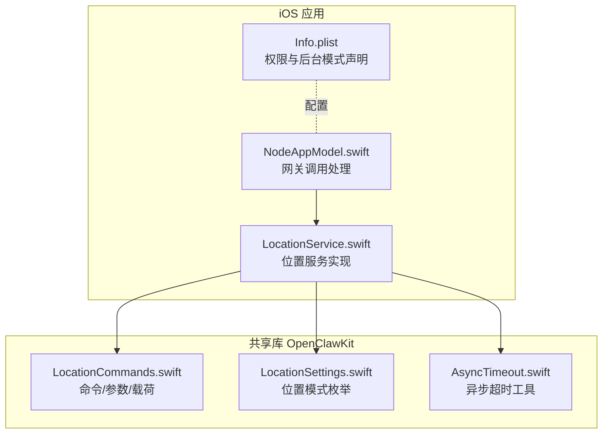
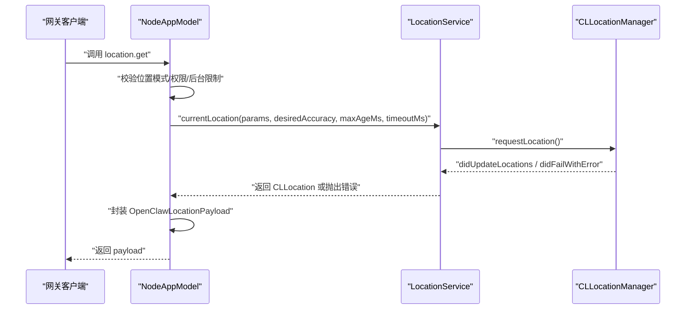
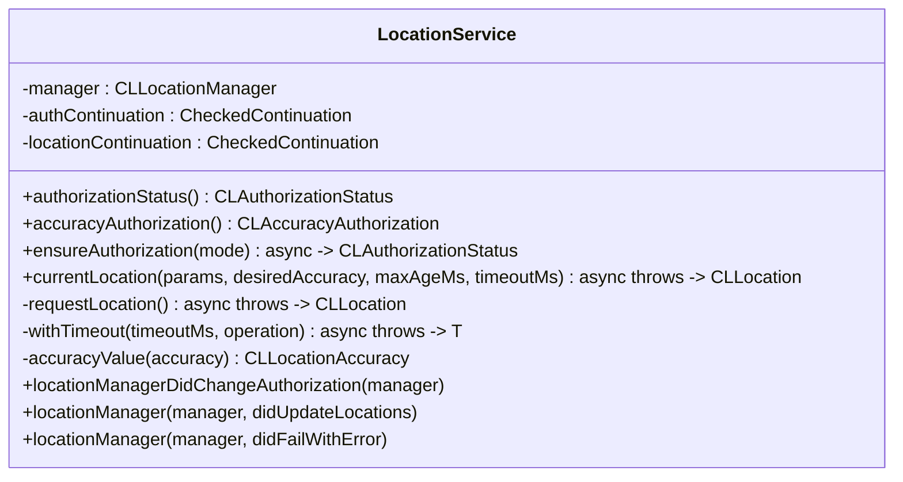
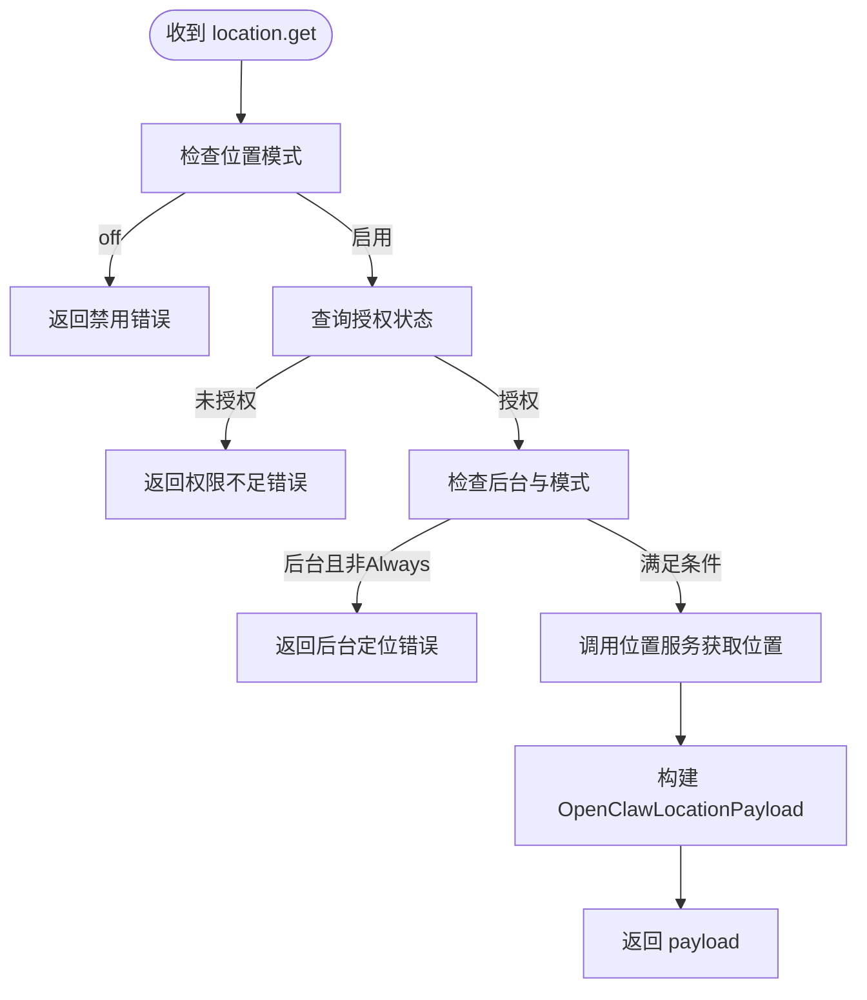
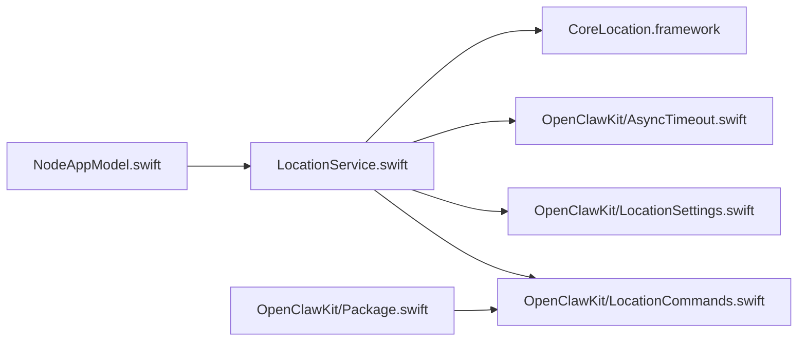

# 位置模块

<cite>
**本文引用的文件**
- [apps/ios/Sources/Location/LocationService.swift](file://apps/ios/Sources/Location/LocationService.swift)
- [apps/shared/OpenClawKit/Sources/OpenClawKit/LocationCommands.swift](file://apps/shared/OpenClawKit/Sources/OpenClawKit/LocationCommands.swift)
- [apps/shared/OpenClawKit/Sources/OpenClawKit/LocationSettings.swift](file://apps/shared/OpenClawKit/Sources/OpenClawKit/LocationSettings.swift)
- [apps/shared/OpenClawKit/Sources/OpenClawKit/AsyncTimeout.swift](file://apps/shared/OpenClawKit/Sources/OpenClawKit/AsyncTimeout.swift)
- [apps/ios/Sources/Model/NodeAppModel.swift](file://apps/ios/Sources/Model/NodeAppModel.swift)
- [apps/ios/Sources/Info.plist](file://apps/ios/Sources/Info.plist)
- [apps/shared/OpenClawKit/Package.swift](file://apps/shared/OpenClawKit/Package.swift)
</cite>

## 目录

1. [简介](#简介)
2. [项目结构](#项目结构)
3. [核心组件](#核心组件)
4. [架构总览](#架构总览)
5. [组件详解](#组件详解)
6. [依赖关系分析](#依赖关系分析)
7. [性能考量](#性能考量)
8. [故障排查指南](#故障排查指南)
9. [结论](#结论)
10. [附录](#附录)

## 简介

本文件面向OpenClaw iOS位置模块，系统性阐述位置服务的实现方式、权限管理策略、定位精度控制与超时机制，并覆盖后台定位与隐私保护实践。文档同时梳理CLLocationManager的使用模式、位置更新监听与地理围栏能力现状，以及准确性优化、电池消耗控制与用户隐私保护建议。

## 项目结构

位置模块由两部分组成：

- iOS端实现：位于apps/ios/Sources/Location/LocationService.swift，封装CLLocationManager并提供授权与定位查询接口。
- 共享协议与类型：位于apps/shared/OpenClawKit/Sources/OpenClawKit，定义位置命令、参数、精度等级与超时工具。

图表来源

- [apps/ios/Sources/Location/LocationService.swift](file://apps/ios/Sources/Location/LocationService.swift#L1-L139)
- [apps/ios/Sources/Model/NodeAppModel.swift](file://apps/ios/Sources/Model/NodeAppModel.swift#L680-L737)
- [apps/shared/OpenClawKit/Sources/OpenClawKit/LocationCommands.swift](file://apps/shared/OpenClawKit/Sources/OpenClawKit/LocationCommands.swift#L1-L58)
- [apps/shared/OpenClawKit/Sources/OpenClawKit/LocationSettings.swift](file://apps/shared/OpenClawKit/Sources/OpenClawKit/LocationSettings.swift#L1-L8)
- [apps/shared/OpenClawKit/Sources/OpenClawKit/AsyncTimeout.swift](file://apps/shared/OpenClawKit/Sources/OpenClawKit/AsyncTimeout.swift#L1-L37)
- [apps/ios/Sources/Info.plist](file://apps/ios/Sources/Info.plist#L1-L73)

章节来源

- [apps/ios/Sources/Location/LocationService.swift](file://apps/ios/Sources/Location/LocationService.swift#L1-L139)
- [apps/shared/OpenClawKit/Sources/OpenClawKit/LocationCommands.swift](file://apps/shared/OpenClawKit/Sources/OpenClawKit/LocationCommands.swift#L1-L58)
- [apps/shared/OpenClawKit/Sources/OpenClawKit/LocationSettings.swift](file://apps/shared/OpenClawKit/Sources/OpenClawKit/LocationSettings.swift#L1-L8)
- [apps/shared/OpenClawKit/Sources/OpenClawKit/AsyncTimeout.swift](file://apps/shared/OpenClawKit/Sources/OpenClawKit/AsyncTimeout.swift#L1-L37)
- [apps/ios/Sources/Model/NodeAppModel.swift](file://apps/ios/Sources/Model/NodeAppModel.swift#L680-L737)
- [apps/ios/Sources/Info.plist](file://apps/ios/Sources/Info.plist#L1-L73)

## 核心组件

- 位置服务（LocationService）
  - 基于CLLocationManager，负责授权状态查询、授权流程触发、位置请求与回调处理。
  - 支持按需设置desiredAccuracy，结合超时机制与缓存策略提升稳定性与能耗表现。
- 网关调用处理（NodeAppModel.handleLocationInvoke）
  - 解析location.get请求，校验位置模式与权限，调用位置服务获取结果并封装为payload返回。
- 共享类型与命令（OpenClawKit）
  - 定义位置命令、精度等级、请求参数与响应载荷；提供异步超时工具以统一处理超时逻辑。
- 权限与后台模式（Info.plist）
  - 声明位置使用描述与后台模式，确保在必要场景下可进行后台定位。

章节来源

- [apps/ios/Sources/Location/LocationService.swift](file://apps/ios/Sources/Location/LocationService.swift#L5-L139)
- [apps/ios/Sources/Model/NodeAppModel.swift](file://apps/ios/Sources/Model/NodeAppModel.swift#L680-L737)
- [apps/shared/OpenClawKit/Sources/OpenClawKit/LocationCommands.swift](file://apps/shared/OpenClawKit/Sources/OpenClawKit/LocationCommands.swift#L3-L58)
- [apps/shared/OpenClawKit/Sources/OpenClawKit/LocationSettings.swift](file://apps/shared/OpenClawKit/Sources/OpenClawKit/LocationSettings.swift#L3-L7)
- [apps/shared/OpenClawKit/Sources/OpenClawKit/AsyncTimeout.swift](file://apps/shared/OpenClawKit/Sources/OpenClawKit/AsyncTimeout.swift#L3-L36)
- [apps/ios/Sources/Info.plist](file://apps/ios/Sources/Info.plist#L38-L54)

## 架构总览

位置服务从网关命令入口进入，经NodeAppModel校验后委派给LocationService完成授权与定位，最终将结果封装回网关。

图表来源

- [apps/ios/Sources/Model/NodeAppModel.swift](file://apps/ios/Sources/Model/NodeAppModel.swift#L680-L737)
- [apps/ios/Sources/Location/LocationService.swift](file://apps/ios/Sources/Location/LocationService.swift#L55-L81)
- [apps/shared/OpenClawKit/Sources/OpenClawKit/LocationCommands.swift](file://apps/shared/OpenClawKit/Sources/OpenClawKit/LocationCommands.swift#L13-L57)

## 组件详解

### 位置服务（LocationService）

- 授权管理
  - 支持WhenInUse与Always两种模式，自动处理未确定状态下的授权请求与变更等待。
  - 提供accuracyAuthorization查询，用于判断是否具备全精度授权。
- 定位请求与缓存
  - 支持maxAgeMs缓存策略：若缓存位置时间未过期则直接返回，避免重复请求。
  - desiredAccuracy根据传入精度或设备全精度能力动态选择。
- 超时与错误
  - 使用AsyncTimeout统一处理超时，避免长时间阻塞。
  - 错误类型包含超时与不可用两类，便于上层区分处理。
- 回调与线程
  - 通过delegate回调接收位置更新与失败事件，内部切换到主线程以安全恢复continuation。

图表来源

- [apps/ios/Sources/Location/LocationService.swift](file://apps/ios/Sources/Location/LocationService.swift#L6-L139)

章节来源

- [apps/ios/Sources/Location/LocationService.swift](file://apps/ios/Sources/Location/LocationService.swift#L16-L139)

### 网关调用处理（NodeAppModel.handleLocationInvoke）

- 请求解析与默认值
  - 解析OpenClawLocationGetParams，若未指定desiredAccuracy，则依据“精确模式开关”决定采用precise还是balanced。
- 权限与后台限制
  - 若位置模式为off直接拒绝。
  - 后台运行且模式非always时拒绝。
  - 无授权或授权不足时拒绝，并给出明确提示。
- 结果封装
  - 将CLLocation转换为OpenClawLocationPayload，包含经纬度、精度、海拔、速度、朝向、时间戳与是否全精度等字段。

图表来源

- [apps/ios/Sources/Model/NodeAppModel.swift](file://apps/ios/Sources/Model/NodeAppModel.swift#L680-L737)
- [apps/shared/OpenClawKit/Sources/OpenClawKit/LocationCommands.swift](file://apps/shared/OpenClawKit/Sources/OpenClawKit/LocationCommands.swift#L13-L57)

章节来源

- [apps/ios/Sources/Model/NodeAppModel.swift](file://apps/ios/Sources/Model/NodeAppModel.swift#L680-L737)

### 共享类型与命令（OpenClawKit）

- 命令与参数
  - 命令：location.get
  - 参数：timeoutMs、maxAgeMs、desiredAccuracy
  - 载荷：lat、lon、accuracyMeters、altitudeMps、speedMps、headingDeg、timestamp、isPrecise、source
- 位置模式
  - off、whileUsing、always
- 超时工具
  - 提供秒级与毫秒级超时封装，内部使用TaskGroup并发控制任务与超时。

章节来源

- [apps/shared/OpenClawKit/Sources/OpenClawKit/LocationCommands.swift](file://apps/shared/OpenClawKit/Sources/OpenClawKit/LocationCommands.swift#L3-L58)
- [apps/shared/OpenClawKit/Sources/OpenClawKit/LocationSettings.swift](file://apps/shared/OpenClawKit/Sources/OpenClawKit/LocationSettings.swift#L3-L7)
- [apps/shared/OpenClawKit/Sources/OpenClawKit/AsyncTimeout.swift](file://apps/shared/OpenClawKit/Sources/OpenClawKit/AsyncTimeout.swift#L3-L36)

### 权限与后台定位（Info.plist）

- 位置使用描述
  - NSLocationWhenInUseUsageDescription：前台使用时
  - NSLocationAlwaysAndWhenInUseUsageDescription：后台使用时
- 后台模式
  - UIBackgroundModes包含audio，满足后台音频场景；后台定位需Always授权并在权限描述中明确用途。

章节来源

- [apps/ios/Sources/Info.plist](file://apps/ios/Sources/Info.plist#L38-L54)

## 依赖关系分析

- 模块耦合
  - NodeAppModel依赖LocationService进行实际定位，职责清晰。
  - LocationService依赖OpenClawKit的类型与超时工具，保持跨平台一致性。
- 外部依赖
  - CoreLocation框架提供底层定位能力。
  - 包平台要求iOS 18+，确保新特性可用性。

图表来源

- [apps/ios/Sources/Model/NodeAppModel.swift](file://apps/ios/Sources/Model/NodeAppModel.swift#L680-L737)
- [apps/ios/Sources/Location/LocationService.swift](file://apps/ios/Sources/Location/LocationService.swift#L1-L139)
- [apps/shared/OpenClawKit/Sources/OpenClawKit/LocationCommands.swift](file://apps/shared/OpenClawKit/Sources/OpenClawKit/LocationCommands.swift#L1-L58)
- [apps/shared/OpenClawKit/Sources/OpenClawKit/LocationSettings.swift](file://apps/shared/OpenClawKit/Sources/OpenClawKit/LocationSettings.swift#L1-L8)
- [apps/shared/OpenClawKit/Sources/OpenClawKit/AsyncTimeout.swift](file://apps/shared/OpenClawKit/Sources/OpenClawKit/AsyncTimeout.swift#L1-L37)
- [apps/shared/OpenClawKit/Package.swift](file://apps/shared/OpenClawKit/Package.swift#L7-L10)

章节来源

- [apps/shared/OpenClawKit/Package.swift](file://apps/shared/OpenClawKit/Package.swift#L7-L10)

## 性能考量

- 定位精度与能耗
  - 优先使用balanced或coarse以降低能耗；仅在需要高精度时采用precise。
  - 利用maxAgeMs缓存减少重复请求，避免频繁唤醒定位硬件。
- 超时控制
  - 通过AsyncTimeout统一设置合理超时，防止长时间等待导致的资源占用。
- 后台定位
  - 后台定位需Always授权，且应尽量缩短后台活跃窗口，避免不必要的持续扫描。
- 电池优化建议
  - 在不需要实时位置时关闭位置服务或降低精度。
  - 合理设置请求频率与缓存窗口，避免高频定位。

## 故障排查指南

- 常见错误与原因
  - LOCATION_DISABLED：位置模式为off，需在系统设置中开启。
  - LOCATION_PERMISSION_REQUIRED：未授予授权或授权不足（前台/后台）。
  - LOCATION_BACKGROUND_UNAVAILABLE：后台定位但未授予Always授权。
  - 超时错误：定位请求超过设定超时，检查网络环境与设备定位服务。
  - 不可用错误：底层定位服务不可用或无有效位置更新。
- 排查步骤
  - 确认Info.plist中位置使用描述完整。
  - 检查系统设置中位置权限与后台模式。
  - 调整desiredAccuracy与timeoutMs，观察行为变化。
  - 查看日志与错误码，定位具体阶段（授权、请求、回调）。

章节来源

- [apps/ios/Sources/Model/NodeAppModel.swift](file://apps/ios/Sources/Model/NodeAppModel.swift#L680-L737)
- [apps/ios/Sources/Location/LocationService.swift](file://apps/ios/Sources/Location/LocationService.swift#L7-L139)

## 结论

OpenClaw iOS位置模块以CLLocationManager为核心，结合共享协议与超时工具，提供了完整的授权、定位与结果封装能力。通过合理的精度选择、缓存与超时策略，可在保证用户体验的同时降低能耗。后台定位严格遵循权限约束，并通过清晰的错误反馈帮助用户与开发者快速定位问题。

## 附录

### 地理围栏能力现状

- 当前实现未发现地理围栏相关代码或API调用，如需扩展可在CLLocationManager基础上增加region监控与回调处理，并配套持久化存储与事件上报机制。

### 权限与隐私最佳实践

- 最小化权限：仅在需要时请求位置权限，避免过度索取。
- 明确用途：在Info.plist中清晰说明前台与后台定位用途，增强用户信任。
- 用户控制：允许用户随时在系统设置中撤销或调整权限。
- 数据最小化：仅传输必要字段，避免泄露额外位置信息。
