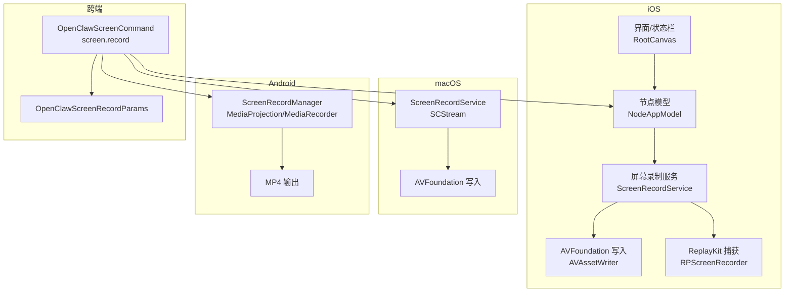
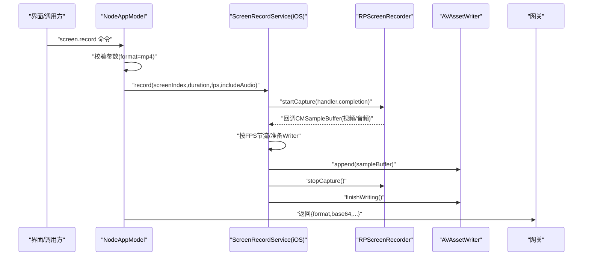
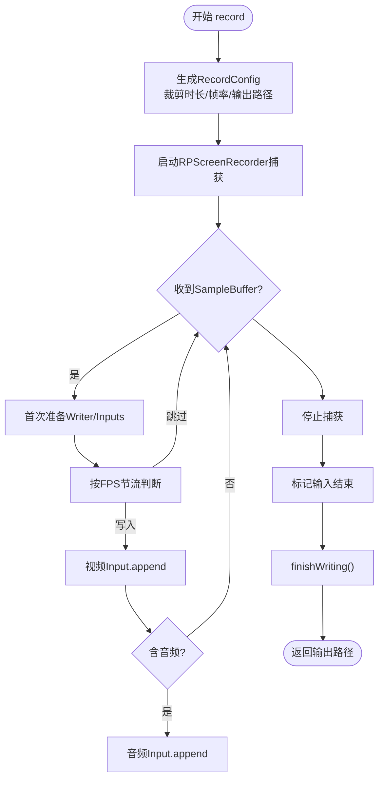
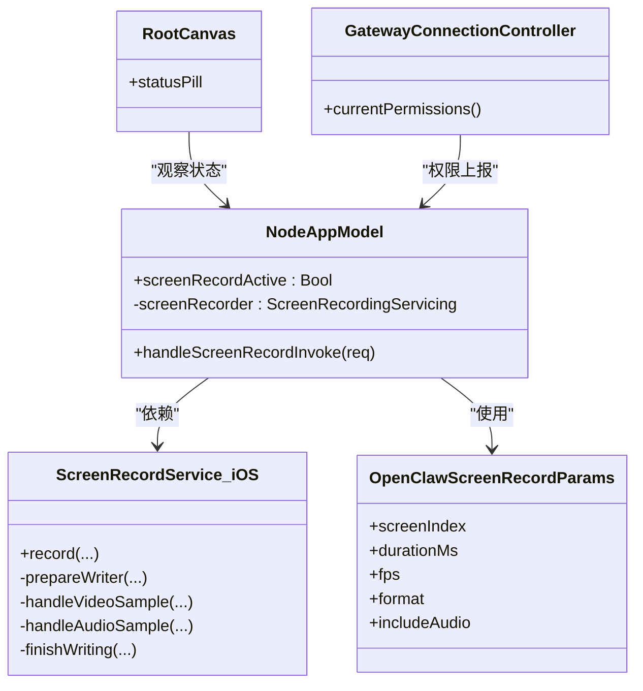

# 屏幕共享

<cite>
**本文引用的文件**
- [apps/ios/Sources/Screen/ScreenRecordService.swift](file://apps/ios/Sources/Screen/ScreenRecordService.swift)
- [apps/ios/Tests/ScreenRecordServiceTests.swift](file://apps/ios/Tests/ScreenRecordServiceTests.swift)
- [apps/ios/Sources/Model/NodeAppModel.swift](file://apps/ios/Sources/Model/NodeAppModel.swift)
- [apps/ios/Sources/Gateway/GatewayConnectionController.swift](file://apps/ios/Sources/Gateway/GatewayConnectionController.swift)
- [apps/ios/Sources/RootCanvas.swift](file://apps/ios/Sources/RootCanvas.swift)
- [apps/shared/OpenClawKit/Sources/OpenClawKit/ScreenCommands.swift](file://apps/shared/OpenClawKit/Sources/OpenClawKit/ScreenCommands.swift)
- [src/agents/tools/nodes-tool.ts](file://src/agents/tools/nodes-tool.ts)
- [apps/macos/Sources/OpenClaw/ScreenRecordService.swift](file://apps/macos/Sources/OpenClaw/ScreenRecordService.swift)
- [apps/android/app/src/main/java/ai/openclaw/android/node/ScreenRecordManager.kt](file://apps/android/app/src/main/java/ai/openclaw/android/node/ScreenRecordManager.kt)
</cite>

## 目录

1. [简介](#简介)
2. [项目结构](#项目结构)
3. [核心组件](#核心组件)
4. [架构总览](#架构总览)
5. [组件详解](#组件详解)
6. [依赖关系分析](#依赖关系分析)
7. [性能考量](#性能考量)
8. [故障排查指南](#故障排查指南)
9. [结论](#结论)
10. [附录](#附录)

## 简介

本文件面向OpenClaw在iOS平台的屏幕共享能力，系统性阐述屏幕录制控制器的实现方式、屏幕捕获技术与实时写入机制、ScreenRecordService的工作原理、屏幕权限管理策略、录制质量控制（时长、帧率、音频），以及跨平台一致性设计。同时给出iOS端ReplayKit API使用要点、AVFoundation实时编码与写入路径、以及性能调优、内存管理与用户体验优化建议。

## 项目结构

OpenClaw在多端实现了统一的“屏幕录制”能力，并通过跨端一致的命令参数模型进行编排：

- iOS端：基于ReplayKit进行屏幕/麦克风采样，使用AVAssetWriter实时写入MP4。
- macOS端：基于ScreenCaptureKit进行采集，同样使用AVAssetWriter写入MP4。
- Android端：基于MediaProjection/MediaRecorder进行录制。
- 跨端命令模型：统一的OpenClawScreenCommand与OpenClawScreenRecordParams定义了参数契约。

图表来源

- [apps/ios/Sources/Screen/ScreenRecordService.swift](file://apps/ios/Sources/Screen/ScreenRecordService.swift#L1-L361)
- [apps/ios/Sources/Model/NodeAppModel.swift](file://apps/ios/Sources/Model/NodeAppModel.swift#L940-L975)
- [apps/macos/Sources/OpenClaw/ScreenRecordService.swift](file://apps/macos/Sources/OpenClaw/ScreenRecordService.swift#L1-L246)
- [apps/android/app/src/main/java/ai/openclaw/android/node/ScreenRecordManager.kt](file://apps/android/app/src/main/java/ai/openclaw/android/node/ScreenRecordManager.kt#L1-L142)
- [apps/shared/OpenClawKit/Sources/OpenClawKit/ScreenCommands.swift](file://apps/shared/OpenClawKit/Sources/OpenClawKit/ScreenCommands.swift#L1-L27)

章节来源

- [apps/ios/Sources/Screen/ScreenRecordService.swift](file://apps/ios/Sources/Screen/ScreenRecordService.swift#L1-L361)
- [apps/ios/Sources/Model/NodeAppModel.swift](file://apps/ios/Sources/Model/NodeAppModel.swift#L940-L975)
- [apps/macos/Sources/OpenClaw/ScreenRecordService.swift](file://apps/macos/Sources/OpenClaw/ScreenRecordService.swift#L1-L246)
- [apps/android/app/src/main/java/ai/openclaw/android/node/ScreenRecordManager.kt](file://apps/android/app/src/main/java/ai/openclaw/android/node/ScreenRecordManager.kt#L1-L142)
- [apps/shared/OpenClawKit/Sources/OpenClawKit/ScreenCommands.swift](file://apps/shared/OpenClawKit/Sources/OpenClawKit/ScreenCommands.swift#L1-L27)

## 核心组件

- ScreenRecordService（iOS）：负责启动ReplayKit捕获、按帧率节流、实时写入AVAssetWriter、结束捕获与收尾。
- NodeAppModel（iOS）：桥接命令层与录制服务，将录制结果以MP4+Base64形式回传给网关。
- GatewayConnectionController（iOS）：上报设备权限状态，包括屏幕录制可用性。
- RootCanvas（iOS）：在屏幕录制期间显示状态提示，提升用户可见性。
- OpenClawScreenRecordParams：跨端统一的录制参数模型。
- macOS/Android对应实现：分别基于ScreenCaptureKit与MediaProjection，保持参数与输出格式一致。

章节来源

- [apps/ios/Sources/Screen/ScreenRecordService.swift](file://apps/ios/Sources/Screen/ScreenRecordService.swift#L1-L361)
- [apps/ios/Sources/Model/NodeAppModel.swift](file://apps/ios/Sources/Model/NodeAppModel.swift#L940-L975)
- [apps/ios/Sources/Gateway/GatewayConnectionController.swift](file://apps/ios/Sources/Gateway/GatewayConnectionController.swift#L540-L570)
- [apps/ios/Sources/RootCanvas.swift](file://apps/ios/Sources/RootCanvas.swift#L270-L316)
- [apps/shared/OpenClawKit/Sources/OpenClawKit/ScreenCommands.swift](file://apps/shared/OpenClawKit/Sources/OpenClawKit/ScreenCommands.swift#L1-L27)
- [apps/macos/Sources/OpenClaw/ScreenRecordService.swift](file://apps/macos/Sources/OpenClaw/ScreenRecordService.swift#L1-L246)
- [apps/android/app/src/main/java/ai/openclaw/android/node/ScreenRecordManager.kt](file://apps/android/app/src/main/java/ai/openclaw/android/node/ScreenRecordManager.kt#L1-L142)

## 架构总览

下图展示了从命令触发到录制完成并回传数据的关键流程，涵盖iOS端ReplayKit采集、AVFoundation写入、以及NodeAppModel对网关的响应封装。

图表来源

- [apps/ios/Sources/Model/NodeAppModel.swift](file://apps/ios/Sources/Model/NodeAppModel.swift#L940-L975)
- [apps/ios/Sources/Screen/ScreenRecordService.swift](file://apps/ios/Sources/Screen/ScreenRecordService.swift#L111-L132)
- [apps/ios/Sources/Screen/ScreenRecordService.swift](file://apps/ios/Sources/Screen/ScreenRecordService.swift#L334-L348)

章节来源

- [apps/ios/Sources/Model/NodeAppModel.swift](file://apps/ios/Sources/Model/NodeAppModel.swift#L940-L975)
- [apps/ios/Sources/Screen/ScreenRecordService.swift](file://apps/ios/Sources/Screen/ScreenRecordService.swift#L111-L132)
- [apps/ios/Sources/Screen/ScreenRecordService.swift](file://apps/ios/Sources/Screen/ScreenRecordService.swift#L334-L348)

## 组件详解

### iOS 屏幕录制控制器（ScreenRecordService）

- 录制生命周期
  - 参数裁剪：时长限制在250–60000ms，默认10000ms；帧率限制在1–30，默认10；仅支持screenIndex=0。
  - 启动捕获：通过RPScreenRecorder.startCapture注册handler，开启主队列捕获。
  - 实时写入：首次收到视频样本时初始化AVAssetWriter与AVAssetWriterInput，设置expectsMediaDataInRealTime=true；视频按目标帧率节流写入；可选音频输入同时写入。
  - 结束与收尾：停止捕获后标记输入结束，调用finishWriting并等待完成或错误。
- 并发与线程
  - 捕获回调可能在后台队列触发，内部使用串行队列(recordQueue)序列化写入，避免并发写入冲突。
  - 关键状态使用NSLock保护，确保handlerError、writer、started等字段的线程安全访问。
- 错误处理
  - 捕获失败、写入失败、无帧被捕获、Writer未启动等均抛出明确错误类型，便于上层感知与提示。

图表来源

- [apps/ios/Sources/Screen/ScreenRecordService.swift](file://apps/ios/Sources/Screen/ScreenRecordService.swift#L43-L101)
- [apps/ios/Sources/Screen/ScreenRecordService.swift](file://apps/ios/Sources/Screen/ScreenRecordService.swift#L111-L132)
- [apps/ios/Sources/Screen/ScreenRecordService.swift](file://apps/ios/Sources/Screen/ScreenRecordService.swift#L165-L204)
- [apps/ios/Sources/Screen/ScreenRecordService.swift](file://apps/ios/Sources/Screen/ScreenRecordService.swift#L286-L320)

章节来源

- [apps/ios/Sources/Screen/ScreenRecordService.swift](file://apps/ios/Sources/Screen/ScreenRecordService.swift#L1-L361)
- [apps/ios/Tests/ScreenRecordServiceTests.swift](file://apps/ios/Tests/ScreenRecordServiceTests.swift#L1-L33)

### iOS 节点模型与命令桥接（NodeAppModel）

- 命令入口：handleScreenRecordInvoke解析参数，强制要求format=mp4；设置screenRecordActive用于UI状态反馈。
- 执行录制：调用screenRecorder.record，读取临时文件内容并Base64编码，封装为payload回传给网关。
- 超时与健壮性：在录制期间设置状态位，结束后恢复；对异常进行错误包装返回。

章节来源

- [apps/ios/Sources/Model/NodeAppModel.swift](file://apps/ios/Sources/Model/NodeAppModel.swift#L940-L975)

### 权限与可用性（GatewayConnectionController）

- 上报权限：currentPermissions包含screenRecording可用性（RPScreenRecorder.isAvailable）。
- 设备信息：平台字符串、设备型号、应用版本等辅助诊断。

章节来源

- [apps/ios/Sources/Gateway/GatewayConnectionController.swift](file://apps/ios/Sources/Gateway/GatewayConnectionController.swift#L540-L570)

### 用户界面状态（RootCanvas）

- 当screenRecordActive为true时，显示“正在录制屏幕…”的状态提示，避免叠加其他活动提示，保证用户可见性。

章节来源

- [apps/ios/Sources/RootCanvas.swift](file://apps/ios/Sources/RootCanvas.swift#L270-L316)

### 跨端命令与参数模型

- OpenClawScreenCommand：统一的“screen.record”命令。
- OpenClawScreenRecordParams：screenIndex/durationMs/fps/format/includeAudio等参数，供iOS/macOS/Android端一致使用。

章节来源

- [apps/shared/OpenClawKit/Sources/OpenClawKit/ScreenCommands.swift](file://apps/shared/OpenClawKit/Sources/OpenClawKit/ScreenCommands.swift#L1-L27)

### macOS 与 Android 对应实现（对比参考）

- macOS：基于ScreenCaptureKit的SCStream回调，同样使用AVAssetWriter写入MP4，具备错误上报与收尾逻辑。
- Android：基于MediaProjection与MediaRecorder，支持屏幕与麦克风录制，输出MP4并Base64编码回传。

章节来源

- [apps/macos/Sources/OpenClaw/ScreenRecordService.swift](file://apps/macos/Sources/OpenClaw/ScreenRecordService.swift#L115-L217)
- [apps/android/app/src/main/java/ai/openclaw/android/node/ScreenRecordManager.kt](file://apps/android/app/src/main/java/ai/openclaw/android/node/ScreenRecordManager.kt#L30-L123)

## 依赖关系分析

- iOS端
  - NodeAppModel依赖ScreenRecordService接口，注入具体实现。
  - ScreenRecordService依赖ReplayKit与AVFoundation，内部自持锁与串行队列保障线程安全。
  - RootCanvas依赖NodeAppModel的screenRecordActive状态更新UI。
  - GatewayConnectionController提供权限上报能力。
- 跨端
  - OpenClawScreenRecordParams作为统一契约，iOS/macOS/Android均遵循相同参数语义与输出格式。

图表来源

- [apps/ios/Sources/Model/NodeAppModel.swift](file://apps/ios/Sources/Model/NodeAppModel.swift#L50-L139)
- [apps/ios/Sources/Screen/ScreenRecordService.swift](file://apps/ios/Sources/Screen/ScreenRecordService.swift#L4-L361)
- [apps/ios/Sources/Gateway/GatewayConnectionController.swift](file://apps/ios/Sources/Gateway/GatewayConnectionController.swift#L540-L570)
- [apps/ios/Sources/RootCanvas.swift](file://apps/ios/Sources/RootCanvas.swift#L270-L316)
- [apps/shared/OpenClawKit/Sources/OpenClawKit/ScreenCommands.swift](file://apps/shared/OpenClawKit/Sources/OpenClawKit/ScreenCommands.swift#L1-L27)

章节来源

- [apps/ios/Sources/Model/NodeAppModel.swift](file://apps/ios/Sources/Model/NodeAppModel.swift#L50-L139)
- [apps/ios/Sources/Screen/ScreenRecordService.swift](file://apps/ios/Sources/Screen/ScreenRecordService.swift#L4-L361)
- [apps/ios/Sources/Gateway/GatewayConnectionController.swift](file://apps/ios/Sources/Gateway/GatewayConnectionController.swift#L540-L570)
- [apps/ios/Sources/RootCanvas.swift](file://apps/ios/Sources/RootCanvas.swift#L270-L316)
- [apps/shared/OpenClawKit/Sources/OpenClawKit/ScreenCommands.swift](file://apps/shared/OpenClawKit/Sources/OpenClawKit/ScreenCommands.swift#L1-L27)

## 性能考量

- 帧率节流与写入实时性
  - 通过比较PTS差值实现按目标FPS节流，避免高频重复写入造成CPU与I/O压力。
  - AVAssetWriterInput设置expectsMediaDataInRealTime=true，有助于系统优化实时写入路径。
- 并发与锁
  - 使用NSLock保护共享状态，配合串行队列(recordQueue)序列化写入，降低竞态风险。
- 参数裁剪
  - 默认时长与帧率范围限制，防止极端配置导致资源耗尽或录制失败。
- 输出与传输
  - iOS端将MP4读入内存并Base64回传，适合小规模录制场景；若录制时间较长或帧率较高，建议考虑分块传输或直接上传文件以减少内存峰值。
- 音频可选
  - includeAudio默认开启，但可按需关闭以降低CPU占用与写入压力。

章节来源

- [apps/ios/Sources/Screen/ScreenRecordService.swift](file://apps/ios/Sources/Screen/ScreenRecordService.swift#L165-L204)
- [apps/ios/Sources/Screen/ScreenRecordService.swift](file://apps/ios/Sources/Screen/ScreenRecordService.swift#L223-L262)
- [apps/ios/Sources/Model/NodeAppModel.swift](file://apps/ios/Sources/Model/NodeAppModel.swift#L940-L975)

## 故障排查指南

- 常见错误与定位
  - 无效屏幕索引：screenIndex必须为0；否则抛出错误。
  - 无帧被捕获：finalize阶段若未看到视频帧，抛出捕获失败。
  - 写入失败：Writer启动失败、添加Input失败、finishWriting非完成状态等均会抛出写入失败。
  - 捕获失败：缺失图像缓冲、停止捕获错误等。
- 单元测试覆盖
  - 测试验证参数裁剪边界与非法screenIndex的拒绝行为。
- 权限检查
  - 通过GatewayConnectionController上报screenRecording可用性，确认设备是否支持ReplayKit录制。

章节来源

- [apps/ios/Sources/Screen/ScreenRecordService.swift](file://apps/ios/Sources/Screen/ScreenRecordService.swift#L26-L41)
- [apps/ios/Tests/ScreenRecordServiceTests.swift](file://apps/ios/Tests/ScreenRecordServiceTests.swift#L1-L33)
- [apps/ios/Sources/Gateway/GatewayConnectionController.swift](file://apps/ios/Sources/Gateway/GatewayConnectionController.swift#L540-L570)

## 结论

OpenClaw在iOS端通过ReplayKit+AVFoundation实现了稳定、可控的屏幕录制能力：参数裁剪确保合理配置，帧率节流与串行写入兼顾性能与稳定性，错误路径清晰可测。结合NodeAppModel的命令桥接与UI状态反馈，形成从调用到呈现的一体化体验。跨端参数模型与不同平台实现共同保证了功能一致性与扩展性。

## 附录

- 命令与参数
  - 命令：screen.record
  - 参数：screenIndex（仅0）、durationMs（250–60000，默认10000）、fps（1–30，默认10）、format（仅mp4）、includeAudio（布尔，默认true）
- 参考实现
  - iOS：ScreenRecordService（ReplayKit+AVAssetWriter）
  - macOS：ScreenRecordService（SCStream+AVAssetWriter）
  - Android：ScreenRecordManager（MediaProjection+MediaRecorder）

章节来源

- [apps/shared/OpenClawKit/Sources/OpenClawKit/ScreenCommands.swift](file://apps/shared/OpenClawKit/Sources/OpenClawKit/ScreenCommands.swift#L1-L27)
- [apps/macos/Sources/OpenClaw/ScreenRecordService.swift](file://apps/macos/Sources/OpenClaw/ScreenRecordService.swift#L115-L217)
- [apps/android/app/src/main/java/ai/openclaw/android/node/ScreenRecordManager.kt](file://apps/android/app/src/main/java/ai/openclaw/android/node/ScreenRecordManager.kt#L30-L123)
- [src/agents/tools/nodes-tool.ts](file://src/agents/tools/nodes-tool.ts#L314-L359)
