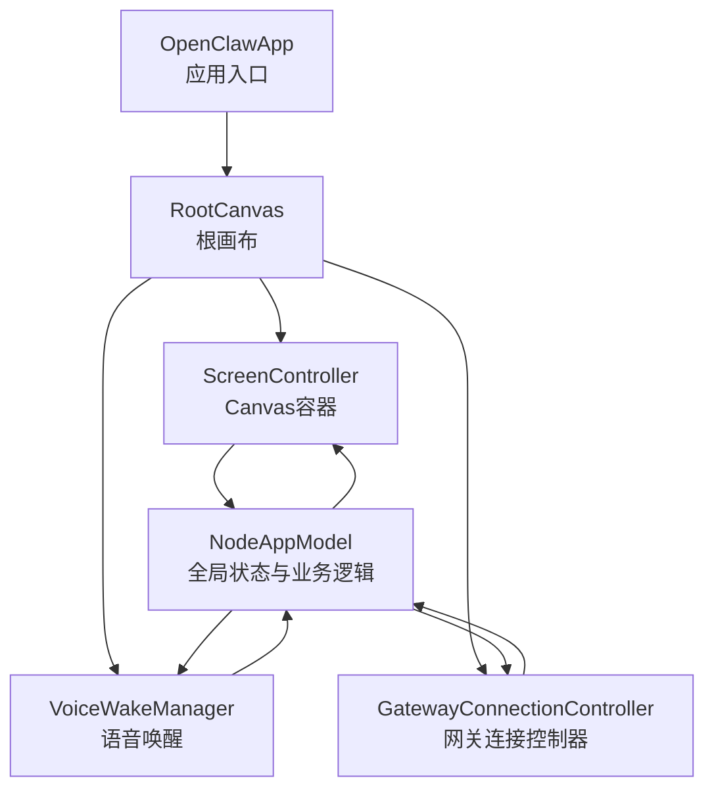
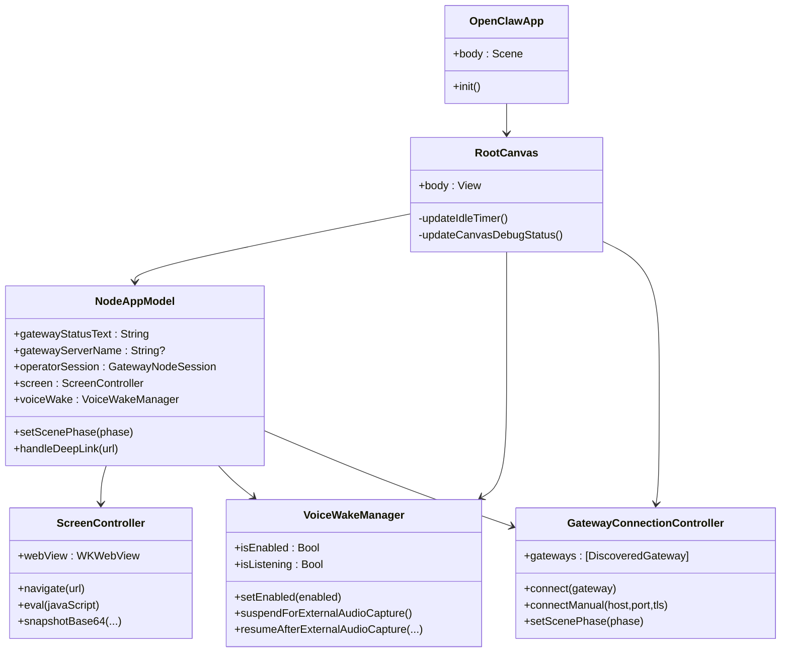
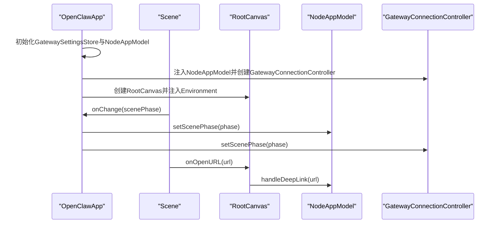
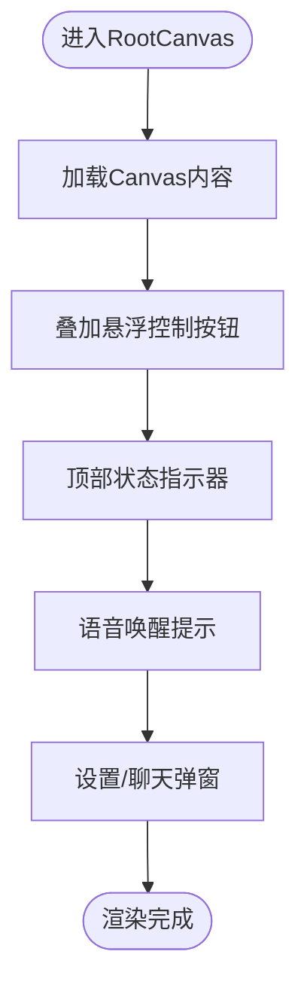
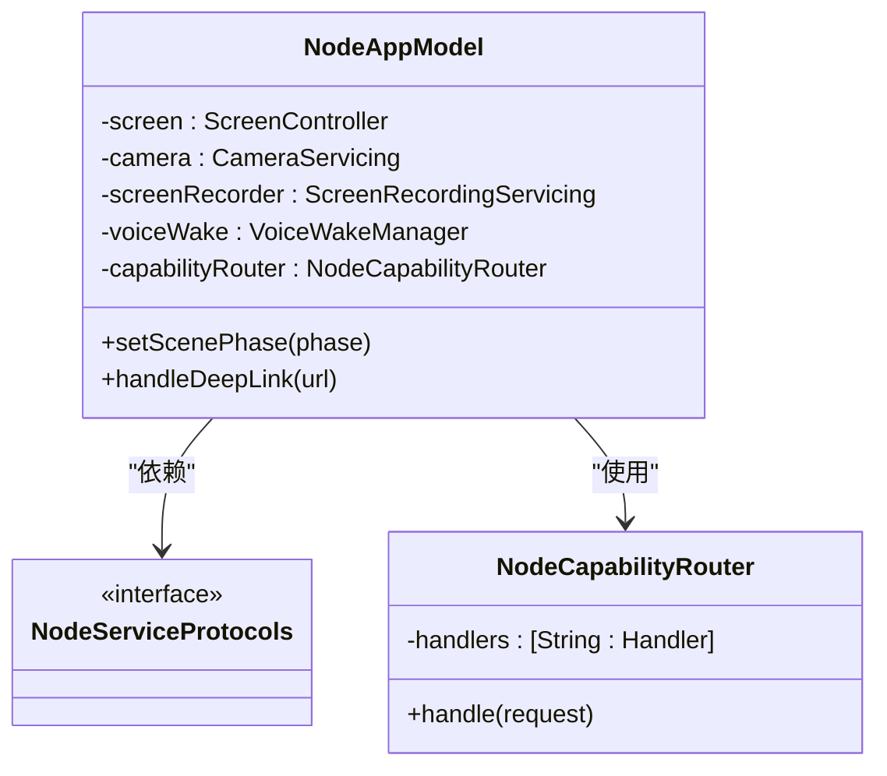
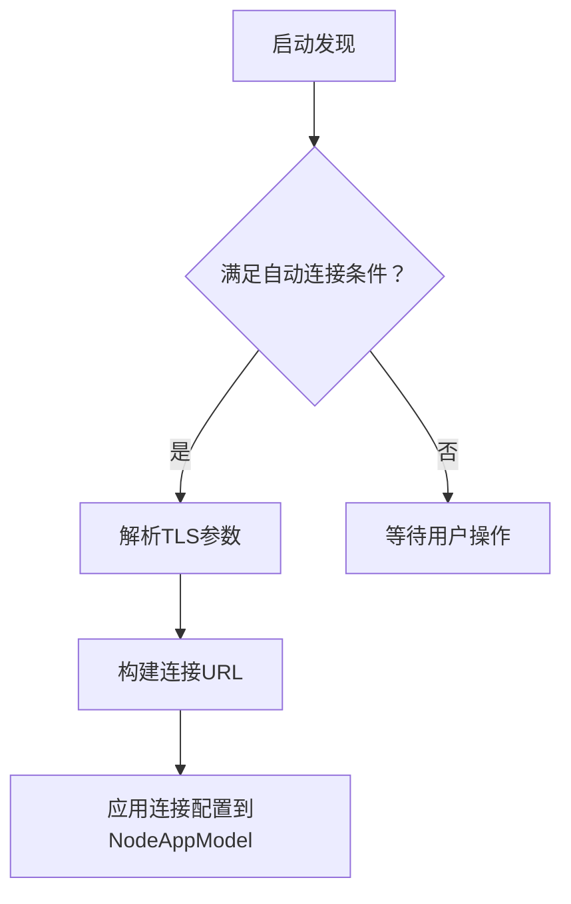
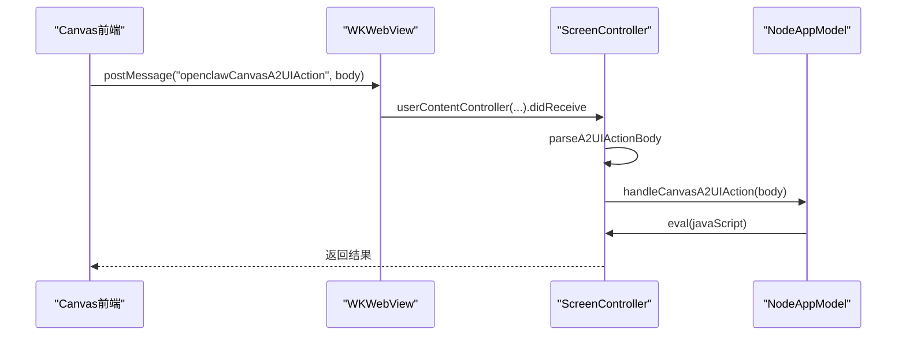
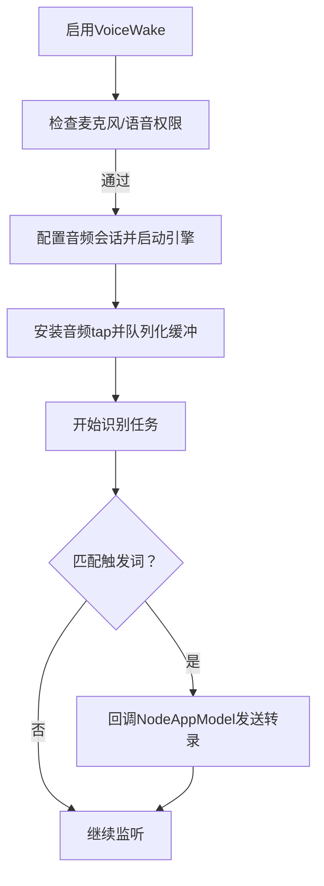
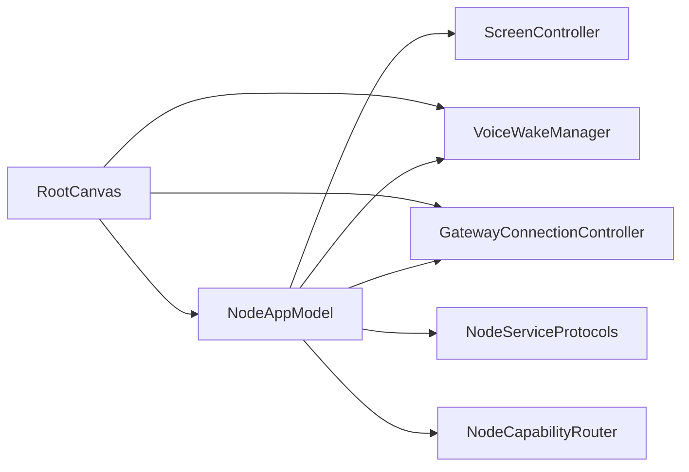

# 应用架构

<cite>
**本文档引用的文件**
- [OpenClawApp.swift](file://apps/ios/Sources/OpenClawApp.swift)
- [RootCanvas.swift](file://apps/ios/Sources/RootCanvas.swift)
- [NodeAppModel.swift](file://apps/ios/Sources/Model/NodeAppModel.swift)
- [GatewayConnectionController.swift](file://apps/ios/Sources/Gateway/GatewayConnectionController.swift)
- [ScreenController.swift](file://apps/ios/Sources/Screen/ScreenController.swift)
- [NodeServiceProtocols.swift](file://apps/ios/Sources/Services/NodeServiceProtocols.swift)
- [NodeCapabilityRouter.swift](file://apps/ios/Sources/Capabilities/NodeCapabilityRouter.swift)
- [VoiceWakeManager.swift](file://apps/ios/Sources/Voice/VoiceWakeManager.swift)
- [RootTabs.swift](file://apps/ios/Sources/RootTabs.swift)
- [SettingsTab.swift](file://apps/ios/Sources/Settings/SettingsTab.swift)
- [VoiceTab.swift](file://apps/ios/Sources/Voice/VoiceTab.swift)
</cite>

## 目录

1. [简介](#简介)
2. [项目结构](#项目结构)
3. [核心组件](#核心组件)
4. [架构总览](#架构总览)
5. [详细组件分析](#详细组件分析)
6. [依赖分析](#依赖分析)
7. [性能考虑](#性能考虑)
8. [故障排查指南](#故障排查指南)
9. [结论](#结论)

## 简介

本文件面向OpenClaw iOS应用，系统性阐述其架构设计、模块组织与核心组件关系，覆盖启动流程、视图层次结构、状态管理机制、SwiftUI架构模式、依赖注入与组件解耦策略，并提供生命周期管理、内存优化与性能监控的最佳实践建议。目标是帮助开发者快速理解并高效扩展该应用。

## 项目结构

iOS应用位于apps/ios/Sources目录下，采用按功能域划分的模块化组织方式：

- 应用入口与场景：OpenClawApp.swift、RootCanvas.swift
- 核心模型与状态：Model/NodeAppModel.swift
- 网关连接与发现：Gateway/ GatewayConnectionController.swift 及相关模型
- 屏幕与Canvas：Screen/ScreenController.swift
- 能力路由与服务协议：Capabilities/NodeCapabilityRouter.swift、Services/NodeServiceProtocols.swift
- 语音与唤醒：Voice/VoiceWakeManager.swift、Voice/VoiceTab.swift
- 设置与导航：Settings/SettingsTab.swift、RootTabs.swift
- 其他能力服务：Camera、Location、Media、Device等（通过协议注入）

图表来源

- [OpenClawApp.swift](file://apps/ios/Sources/OpenClawApp.swift#L1-L32)
- [RootCanvas.swift](file://apps/ios/Sources/RootCanvas.swift#L1-L157)
- [NodeAppModel.swift](file://apps/ios/Sources/Model/NodeAppModel.swift#L1-L186)
- [GatewayConnectionController.swift](file://apps/ios/Sources/Gateway/GatewayConnectionController.swift#L1-L622)
- [ScreenController.swift](file://apps/ios/Sources/Screen/ScreenController.swift#L1-L51)
- [VoiceWakeManager.swift](file://apps/ios/Sources/Voice/VoiceWakeManager.swift#L1-L120)

章节来源

- [OpenClawApp.swift](file://apps/ios/Sources/OpenClawApp.swift#L1-L32)
- [RootCanvas.swift](file://apps/ios/Sources/RootCanvas.swift#L1-L157)

## 核心组件

- 应用入口与场景
  - OpenClawApp：声明式App入口，初始化NodeAppModel与GatewayConnectionController，注入环境变量并通过Scene处理URL打开与场景状态变化。
- 根画布与视图层次
  - RootCanvas：承载Canvas内容、悬浮操作按钮、状态指示器、语音唤醒提示与设置/聊天弹窗；负责空闲计时器与调试状态同步。
  - RootTabs：传统标签页导航（Screen/Voice/Settings），作为替代入口。
- 全局状态与业务逻辑
  - NodeAppModel：集中管理网关连接、Canvas交互、设备能力调用、语音唤醒与Talk模式协调、后台态行为、会话键与代理选择等。
- 网关连接与发现
  - GatewayConnectionController：负责mDNS/Bonjour发现、自动连接策略、TLS指纹校验、权限与能力配置、连接参数构建与生命周期联动。
- 屏幕与Canvas
  - ScreenController：封装WKWebView，提供Canvas加载、快照、脚本执行、A2UI动作拦截、调试状态注入与本地网络安全校验。
- 能力路由与服务协议
  - NodeCapabilityRouter：命令到处理器的路由分发器，统一错误处理。
  - NodeServiceProtocols：设备能力服务协议族，便于替换实现与测试。
- 语音与唤醒
  - VoiceWakeManager：基于SFSpeech与AVAudioEngine的实时唤醒识别、权限请求、音频会话管理与暂停/恢复策略。

章节来源

- [OpenClawApp.swift](file://apps/ios/Sources/OpenClawApp.swift#L1-L32)
- [RootCanvas.swift](file://apps/ios/Sources/RootCanvas.swift#L1-L157)
- [NodeAppModel.swift](file://apps/ios/Sources/Model/NodeAppModel.swift#L1-L186)
- [GatewayConnectionController.swift](file://apps/ios/Sources/Gateway/GatewayConnectionController.swift#L1-L622)
- [ScreenController.swift](file://apps/ios/Sources/Screen/ScreenController.swift#L1-L51)
- [NodeServiceProtocols.swift](file://apps/ios/Sources/Services/NodeServiceProtocols.swift#L1-L65)
- [NodeCapabilityRouter.swift](file://apps/ios/Sources/Capabilities/NodeCapabilityRouter.swift#L1-L26)
- [VoiceWakeManager.swift](file://apps/ios/Sources/Voice/VoiceWakeManager.swift#L1-L120)

## 架构总览

应用采用“观察者驱动的状态模型 + 协议化服务 + 命令路由”的架构风格：

- 观察者驱动：使用@Observable与@State管理UI状态，配合Environment注入在视图间传递NodeAppModel与VoiceWakeManager实例。
- 协议化服务：将相机、屏幕录制、位置、设备信息、联系人、日历、提醒、运动等能力抽象为协议，便于替换实现与测试。
- 命令路由：NodeAppModel内部以NodeCapabilityRouter分发命令，统一处理未知命令与处理器不可用等异常。
- 网关层：GatewayConnectionController负责连接建立、自动重连、权限与能力上报、TLS参数解析与保存；NodeAppModel持有两个会话（node/operator）以区分不同用途。

图表来源

- [OpenClawApp.swift](file://apps/ios/Sources/OpenClawApp.swift#L1-L32)
- [RootCanvas.swift](file://apps/ios/Sources/RootCanvas.swift#L1-L157)
- [NodeAppModel.swift](file://apps/ios/Sources/Model/NodeAppModel.swift#L1-L186)
- [GatewayConnectionController.swift](file://apps/ios/Sources/Gateway/GatewayConnectionController.swift#L1-L622)
- [ScreenController.swift](file://apps/ios/Sources/Screen/ScreenController.swift#L1-L51)
- [VoiceWakeManager.swift](file://apps/ios/Sources/Voice/VoiceWakeManager.swift#L1-L120)

## 详细组件分析

### 启动流程与场景生命周期

- 应用启动：OpenClawApp在初始化时完成网关持久化引导、NodeAppModel与GatewayConnectionController实例化，并将二者注入到RootCanvas的Environment中。
- 场景事件：OpenClawApp监听Scene的scenePhase变化，分别通知NodeAppModel与GatewayConnectionController更新状态（如后台释放麦克风、前台恢复）。
- URL处理：RootCanvas注册onOpenURL回调，交由NodeAppModel进行深链解析与转发。

图表来源

- [OpenClawApp.swift](file://apps/ios/Sources/OpenClawApp.swift#L1-L32)
- [RootCanvas.swift](file://apps/ios/Sources/RootCanvas.swift#L1-L157)
- [NodeAppModel.swift](file://apps/ios/Sources/Model/NodeAppModel.swift#L574-L621)
- [GatewayConnectionController.swift](file://apps/ios/Sources/Gateway/GatewayConnectionController.swift#L46-L57)

章节来源

- [OpenClawApp.swift](file://apps/ios/Sources/OpenClawApp.swift#L1-L32)
- [RootCanvas.swift](file://apps/ios/Sources/RootCanvas.swift#L1-L157)
- [NodeAppModel.swift](file://apps/ios/Sources/Model/NodeAppModel.swift#L266-L326)
- [GatewayConnectionController.swift](file://apps/ios/Sources/Gateway/GatewayConnectionController.swift#L46-L57)

### 视图层次结构与状态管理

- RootCanvas作为顶层容器，内含Canvas内容与悬浮控制按钮，顶部状态指示器与语音唤醒提示，支持设置/聊天弹窗。
- RootTabs提供传统标签页导航，与RootCanvas共享同一套状态（NodeAppModel、VoiceWakeManager）。
- NodeAppModel集中维护网关状态、Canvas状态、相机HUD、屏幕录制状态、Talk模式与语音唤醒状态，并通过@Observable驱动UI刷新。

图表来源

- [RootCanvas.swift](file://apps/ios/Sources/RootCanvas.swift#L34-L107)
- [RootTabs.swift](file://apps/ios/Sources/RootTabs.swift#L12-L87)

章节来源

- [RootCanvas.swift](file://apps/ios/Sources/RootCanvas.swift#L1-L157)
- [RootTabs.swift](file://apps/ios/Sources/RootTabs.swift#L1-L170)

### 状态管理机制与依赖注入

- 环境注入：OpenClawApp通过Environment将NodeAppModel与VoiceWakeManager注入RootCanvas，确保视图可直接访问全局状态与服务。
- 依赖注入：NodeAppModel构造函数接受多种服务协议的实现，默认使用具体实现，便于单元测试替换。
- 解耦策略：通过NodeServiceProtocols定义能力边界，NodeCapabilityRouter将命令分发给对应处理器，避免视图直接依赖底层实现。

图表来源

- [NodeAppModel.swift](file://apps/ios/Sources/Model/NodeAppModel.swift#L126-L186)
- [NodeServiceProtocols.swift](file://apps/ios/Sources/Services/NodeServiceProtocols.swift#L1-L65)
- [NodeCapabilityRouter.swift](file://apps/ios/Sources/Capabilities/NodeCapabilityRouter.swift#L1-L26)

章节来源

- [NodeAppModel.swift](file://apps/ios/Sources/Model/NodeAppModel.swift#L126-L186)
- [NodeServiceProtocols.swift](file://apps/ios/Sources/Services/NodeServiceProtocols.swift#L1-L65)
- [NodeCapabilityRouter.swift](file://apps/ios/Sources/Capabilities/NodeCapabilityRouter.swift#L1-L26)

### 网关连接与自动重连策略

- 发现与自动连接：GatewayConnectionController在活跃场景启动发现，根据用户偏好与上次连接信息自动尝试连接；支持手动连接与首选稳定ID。
- TLS参数：根据发现结果或手动输入解析TLS指纹、允许TOFU重置与端口推断（如.ts.net域名强制443）。
- 连接选项：动态生成客户端显示名、能力列表、命令集与权限映射，确保最小权限与平台可用性检测。

图表来源

- [GatewayConnectionController.swift](file://apps/ios/Sources/Gateway/GatewayConnectionController.swift#L173-L299)

章节来源

- [GatewayConnectionController.swift](file://apps/ios/Sources/Gateway/GatewayConnectionController.swift#L1-L622)

### Canvas与A2UI交互

- Canvas加载：ScreenController默认加载内置scaffold页面，支持从URL或文件路径加载；对loopback主机进行安全过滤。
- A2UI动作：通过WKWebView消息通道接收前端动作，经ScreenController解析后回调NodeAppModel，再由NodeAppModel向Canvas发送事件或执行请求。
- 快照与脚本：提供PNG/JPEG快照与JavaScript执行接口，用于截图与调试。

图表来源

- [ScreenController.swift](file://apps/ios/Sources/Screen/ScreenController.swift#L415-L437)
- [NodeAppModel.swift](file://apps/ios/Sources/Model/NodeAppModel.swift#L188-L263)

章节来源

- [ScreenController.swift](file://apps/ios/Sources/Screen/ScreenController.swift#L1-L438)
- [NodeAppModel.swift](file://apps/ios/Sources/Model/NodeAppModel.swift#L188-L263)

### 语音唤醒与Talk模式协同

- 权限与会话：VoiceWakeManager在启用时请求麦克风与语音识别权限，配置AVAudioSession，安装音频tap并将PCM缓冲队列化。
- 唤醒识别：通过SFSpeechRecognitionTask持续监听，匹配触发词后回调NodeAppModel发送转录事件。
- 协同策略：当Talk模式启用时，VoiceWakeManager暂停以释放麦克风；后台态自动暂停并在前台恢复；支持外部音频捕获（如相机录像）时的临时暂停/恢复。

图表来源

- [VoiceWakeManager.swift](file://apps/ios/Sources/Voice/VoiceWakeManager.swift#L160-L357)
- [NodeAppModel.swift](file://apps/ios/Sources/Model/NodeAppModel.swift#L154-L162)

章节来源

- [VoiceWakeManager.swift](file://apps/ios/Sources/Voice/VoiceWakeManager.swift#L1-L496)
- [NodeAppModel.swift](file://apps/ios/Sources/Model/NodeAppModel.swift#L154-L162)

## 依赖分析

- 组件耦合与内聚
  - NodeAppModel聚合多个服务与控制器，承担高内聚的业务编排职责；通过协议隔离具体实现，降低对外部框架的耦合。
  - GatewayConnectionController与NodeAppModel双向协作：前者负责连接与配置，后者负责会话与状态同步。
- 直接与间接依赖
  - RootCanvas依赖NodeAppModel与VoiceWakeManager；NodeAppModel依赖ScreenController、VoiceWakeManager、GatewayConnectionController以及各类服务协议。
  - NodeCapabilityRouter作为命令分发中枢，被NodeAppModel广泛调用。
- 外部依赖与集成点
  - 网络与WebSocket：通过OpenClawKit的GatewayNodeSession与订阅机制。
  - 系统框架：AVFoundation（音频）、Speech（识别）、WebKit（Canvas）、UIKit（视图与会话）。
- 接口契约与实现细节
  - NodeServiceProtocols定义了设备能力的最小接口集合，便于替换实现与测试；具体实现分散在各服务模块中。

图表来源

- [RootCanvas.swift](file://apps/ios/Sources/RootCanvas.swift#L1-L157)
- [NodeAppModel.swift](file://apps/ios/Sources/Model/NodeAppModel.swift#L1-L186)
- [NodeServiceProtocols.swift](file://apps/ios/Sources/Services/NodeServiceProtocols.swift#L1-L65)
- [NodeCapabilityRouter.swift](file://apps/ios/Sources/Capabilities/NodeCapabilityRouter.swift#L1-L26)
- [VoiceWakeManager.swift](file://apps/ios/Sources/Voice/VoiceWakeManager.swift#L1-L120)
- [GatewayConnectionController.swift](file://apps/ios/Sources/Gateway/GatewayConnectionController.swift#L1-L622)

章节来源

- [NodeAppModel.swift](file://apps/ios/Sources/Model/NodeAppModel.swift#L1-L186)
- [GatewayConnectionController.swift](file://apps/ios/Sources/Gateway/GatewayConnectionController.swift#L1-L622)
- [NodeServiceProtocols.swift](file://apps/ios/Sources/Services/NodeServiceProtocols.swift#L1-L65)
- [NodeCapabilityRouter.swift](file://apps/ios/Sources/Capabilities/NodeCapabilityRouter.swift#L1-L26)
- [VoiceWakeManager.swift](file://apps/ios/Sources/Voice/VoiceWakeManager.swift#L1-L120)
- [ScreenController.swift](file://apps/ios/Sources/Screen/ScreenController.swift#L1-L51)

## 性能考虑

- UI线程与异步
  - 所有耗时操作（网络请求、Canvas脚本执行、快照）均在异步任务中执行，避免阻塞主线程。
- 内存与资源
  - Canvas快照与视频录制完成后及时释放临时数据；音频识别任务在暂停/停止时清理tap与队列，避免残留缓冲。
- 后台态优化
  - 场景切换至后台时释放麦克风与停止健康监测，前台回到活跃态时按需恢复；长驻后台可能导致网络连接失效，应用在前台时主动握手验证。
- 网络与连接
  - 健康监测周期性检查网关状态，失败时断开并重连；自动重连策略避免重复连接循环。

[本节为通用指导，无需特定文件引用]

## 故障排查指南

- Canvas无法加载或报错
  - 检查URL合法性与本地网络范围；确认ScreenController的调试状态已开启以便获取详细状态。
- 语音唤醒无响应
  - 确认麦克风与语音识别权限已授予；检查VoiceWakeManager状态文本与是否被Talk模式暂停；在Simulator上可能不支持。
- 网关连接失败
  - 查看GatewayConnectionController的发现状态与调试日志；确认TLS指纹、端口与域名解析；必要时使用手动连接。
- 深链与A2UI动作无效
  - 确认Canvas前端消息通道已正确注册；检查ScreenController对本地网络页面的白名单校验；验证NodeAppModel的A2UI动作处理流程。

章节来源

- [ScreenController.swift](file://apps/ios/Sources/Screen/ScreenController.swift#L100-L154)
- [VoiceWakeManager.swift](file://apps/ios/Sources/Voice/VoiceWakeManager.swift#L179-L215)
- [GatewayConnectionController.swift](file://apps/ios/Sources/Gateway/GatewayConnectionController.swift#L173-L299)
- [NodeAppModel.swift](file://apps/ios/Sources/Model/NodeAppModel.swift#L188-L263)

## 结论

OpenClaw iOS应用通过清晰的模块划分与协议化设计，实现了良好的可维护性与可扩展性。以NodeAppModel为中心的状态与业务编排、以NodeCapabilityRouter为核心的命令路由、以GatewayConnectionController为入口的连接管理，共同构成了稳定可靠的用户体验。建议在后续迭代中持续强化错误边界与性能监控，完善自动化测试覆盖，以进一步提升质量与稳定性。
