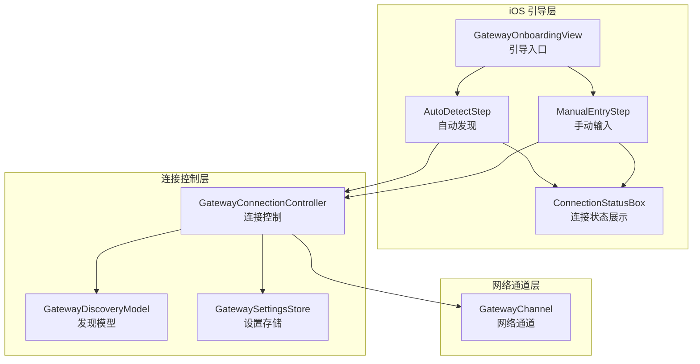
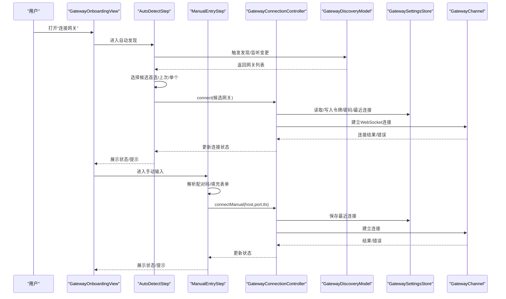
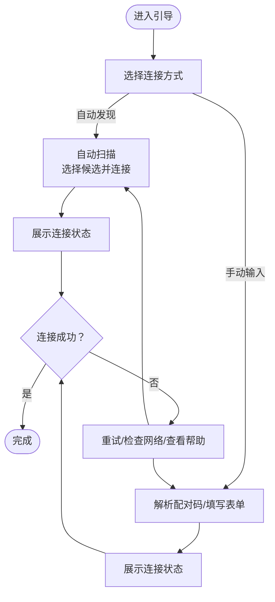
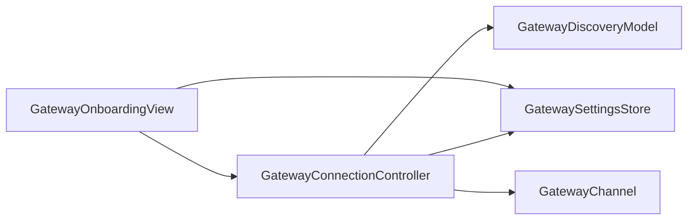

# 引导流程

<cite>
**本文引用的文件**
- [apps/ios/Sources/Onboarding/GatewayOnboardingView.swift](file://apps/ios/Sources/Onboarding/GatewayOnboardingView.swift)
- [apps/ios/Sources/Gateway/GatewayConnectionController.swift](file://apps/ios/Sources/Gateway/GatewayConnectionController.swift)
- [apps/ios/Sources/Gateway/GatewaySettingsStore.swift](file://apps/ios/Sources/Gateway/GatewaySettingsStore.swift)
- [apps/ios/Sources/Gateway/GatewayDiscoveryModel.swift](file://apps/ios/Sources/Gateway/GatewayDiscoveryModel.swift)
- [apps/ios/Sources/Settings/SettingsTab.swift](file://apps/ios/Sources/Settings/SettingsTab.swift)
- [apps/shared/OpenClawKit/Sources/OpenClawKit/GatewayChannel.swift](file://apps/shared/OpenClawKit/Sources/OpenClawKit/GatewayChannel.swift)
- [apps/shared/OpenClawKit/Sources/OpenClawKit/InstanceIdentity.swift](file://apps/shared/OpenClawKit/Sources/OpenClawKit/InstanceIdentity.swift)
- [src/pairing/pairing-store.ts](file://src/pairing/pairing-store.ts)
- [apps/macos/Sources/OpenClaw/OnboardingView+Pages.swift](file://apps/macos/Sources/OpenClaw/OnboardingView+Pages.swift)
- [apps/macos/Sources/OpenClaw/OnboardingView+Actions.swift](file://apps/macos/Sources/OpenClaw/OnboardingView+Actions.swift)
- [apps/macos/Sources/OpenClaw/OnboardingView+Testing.swift](file://apps/macos/Sources/OpenClaw/OnboardingView+Testing.swift)
- [apps/macos/Sources/OpenClaw/OnboardingWizard.swift](file://apps/macos/Sources/OpenClaw/OnboardingWizard.swift)
- [apps/macos/Sources/OpenClaw/DevicePairingApprovalPrompter.swift](file://apps/macos/Sources/OpenClaw/DevicePairingApprovalPrompter.swift)
- [apps/macos/Sources/OpenClaw/NodePairingApprovalPrompter.swift](file://apps/macos/Sources/OpenClaw/NodePairingApprovalPrompter.swift)
- [apps/macos/Sources/OpenClaw/ControlChannel.swift](file://apps/macos/Sources/OpenClaw/ControlChannel.swift)
</cite>

## 目录

1. [简介](#简介)
2. [项目结构](#项目结构)
3. [核心组件](#核心组件)
4. [架构总览](#架构总览)
5. [详细组件分析](#详细组件分析)
6. [依赖关系分析](#依赖关系分析)
7. [性能考虑](#性能考虑)
8. [故障排查指南](#故障排查指南)
9. [结论](#结论)
10. [附录](#附录)

## 简介

本文件面向OpenClaw在iOS平台的引导与配对流程，聚焦以下目标：

- 用户引导界面的实现与交互逻辑
- 节点配对流程与配置向导（Wizard）的衔接
- GatewayOnboardingView的设计思路、步骤导航与用户交互
- iOS引导页面设计、配对码输入与网络配置界面
- 引导流程的用户体验优化、错误处理与帮助信息设计指南

该文档既适用于开发者深入理解代码实现，也适用于产品与运营人员把握用户路径与常见问题。

## 项目结构

iOS引导流程主要由以下模块构成：

- 引导视图：GatewayOnboardingView 及其子步骤（自动发现、手动输入）
- 连接控制：GatewayConnectionController 负责发现、连接、状态更新与自动重连
- 设置存储：GatewaySettingsStore 负责持久化网关凭据与最近一次连接信息
- 发现模型：GatewayDiscoveryModel 提供Bonjour服务发现与网关列表
- 配对与向导：macOS侧的OnboardingWizard与配对提示器作为参考，体现跨平台一致性
- 网络通道：OpenClawKit的GatewayChannel封装底层连接错误包装，便于UI展示

图表来源

- [apps/ios/Sources/Onboarding/GatewayOnboardingView.swift](file://apps/ios/Sources/Onboarding/GatewayOnboardingView.swift#L1-L390)
- [apps/ios/Sources/Gateway/GatewayConnectionController.swift](file://apps/ios/Sources/Gateway/GatewayConnectionController.swift#L1-L200)
- [apps/ios/Sources/Gateway/GatewaySettingsStore.swift](file://apps/ios/Sources/Gateway/GatewaySettingsStore.swift#L68-L168)
- [apps/ios/Sources/Gateway/GatewayDiscoveryModel.swift](file://apps/ios/Sources/Gateway/GatewayDiscoveryModel.swift#L71-L90)
- [apps/shared/OpenClawKit/Sources/OpenClawKit/GatewayChannel.swift](file://apps/shared/OpenClawKit/Sources/OpenClawKit/GatewayChannel.swift#L668-L688)

章节来源

- [apps/ios/Sources/Onboarding/GatewayOnboardingView.swift](file://apps/ios/Sources/Onboarding/GatewayOnboardingView.swift#L1-L390)
- [apps/ios/Sources/Gateway/GatewayConnectionController.swift](file://apps/ios/Sources/Gateway/GatewayConnectionController.swift#L1-L200)

## 核心组件

- GatewayOnboardingView：引导入口，提供“自动检测”和“手动输入”两种连接方式
- AutoDetectStep：自动扫描局域网内的网关，按优先级选择候选并尝试连接
- ManualEntryStep：支持粘贴配对码或手动填写主机、端口、TLS开关、令牌与密码
- GatewayConnectionController：负责发现、连接、保存最近连接、自动重连策略
- GatewaySettingsStore：基于Keychain与UserDefaults的凭据与偏好持久化
- GatewayDiscoveryModel：Bonjour服务发现，解析TXT记录生成可读实例名与稳定ID
- GatewayChannel：封装网络错误上下文，便于UI展示具体错误
- InstanceIdentity：设备实例标识与显示名称，用于配对与识别

章节来源

- [apps/ios/Sources/Onboarding/GatewayOnboardingView.swift](file://apps/ios/Sources/Onboarding/GatewayOnboardingView.swift#L1-L390)
- [apps/ios/Sources/Gateway/GatewayConnectionController.swift](file://apps/ios/Sources/Gateway/GatewayConnectionController.swift#L1-L200)
- [apps/ios/Sources/Gateway/GatewaySettingsStore.swift](file://apps/ios/Sources/Gateway/GatewaySettingsStore.swift#L68-L168)
- [apps/ios/Sources/Gateway/GatewayDiscoveryModel.swift](file://apps/ios/Sources/Gateway/GatewayDiscoveryModel.swift#L71-L90)
- [apps/shared/OpenClawKit/Sources/OpenClawKit/GatewayChannel.swift](file://apps/shared/OpenClawKit/Sources/OpenClawKit/GatewayChannel.swift#L668-L688)
- [apps/shared/OpenClawKit/Sources/OpenClawKit/InstanceIdentity.swift](file://apps/shared/OpenClawKit/Sources/OpenClawKit/InstanceIdentity.swift#L35-L70)

## 架构总览

下图展示了iOS引导流程从用户操作到连接建立的关键调用链路：

图表来源

- [apps/ios/Sources/Onboarding/GatewayOnboardingView.swift](file://apps/ios/Sources/Onboarding/GatewayOnboardingView.swift#L27-L105)
- [apps/ios/Sources/Onboarding/GatewayOnboardingView.swift](file://apps/ios/Sources/Onboarding/GatewayOnboardingView.swift#L107-L353)
- [apps/ios/Sources/Gateway/GatewayConnectionController.swift](file://apps/ios/Sources/Gateway/GatewayConnectionController.swift#L59-L148)
- [apps/ios/Sources/Gateway/GatewaySettingsStore.swift](file://apps/ios/Sources/Gateway/GatewaySettingsStore.swift#L117-L136)
- [apps/shared/OpenClawKit/Sources/OpenClawKit/GatewayChannel.swift](file://apps/shared/OpenClawKit/Sources/OpenClawKit/GatewayChannel.swift#L668-L688)

## 详细组件分析

### GatewayOnboardingView 设计与步骤导航

- 设计思路
  - 采用分步式导航，先“自动发现”，再“手动输入”，降低认知负担
  - 自动发现优先使用“首选稳定ID”“上次发现ID”“单网关场景”的策略，提升成功率
  - 手动输入支持配对码解析与表单输入，兼顾易用性与灵活性
- 步骤导航
  - 入口：List + Section + 导航链接（自动检测/手动输入）
  - 自动发现：Form + 连接状态展示 + 重试按钮
  - 手动输入：配对码区域 + 主机/端口/TLS/令牌/密码 + 连接状态展示 + 连接/重试
- 用户交互逻辑
  - 自动发现：onAppear触发；监听网关变化；禁用重试按钮时的连接中状态
  - 手动输入：校验主机与端口范围；保存最近连接；令牌/密码写入Keychain
  - 状态展示：统一通过ConnectionStatusBox输出“网关状态/发现状态/服务器/地址”

图表来源

- [apps/ios/Sources/Onboarding/GatewayOnboardingView.swift](file://apps/ios/Sources/Onboarding/GatewayOnboardingView.swift#L27-L105)
- [apps/ios/Sources/Onboarding/GatewayOnboardingView.swift](file://apps/ios/Sources/Onboarding/GatewayOnboardingView.swift#L107-L353)

章节来源

- [apps/ios/Sources/Onboarding/GatewayOnboardingView.swift](file://apps/ios/Sources/Onboarding/GatewayOnboardingView.swift#L1-L390)

### AutoDetectStep：自动发现与连接策略

- 优先级策略
  - 首选稳定ID匹配
  - 上次发现ID匹配
  - 单一网关直接连接
- 连接过程
  - 读取首选/上次稳定ID与当前网关列表
  - 选择候选后调用GatewayConnectionController.connect
  - 保存最近连接信息，启动自动连接流程
- 错误与重试
  - onAppear触发；监听网关变化；禁用重试按钮时的连接中状态
  - 支持“重置状态+重试”以应对瞬时异常

章节来源

- [apps/ios/Sources/Onboarding/GatewayOnboardingView.swift](file://apps/ios/Sources/Onboarding/GatewayOnboardingView.swift#L64-L94)
- [apps/ios/Sources/Gateway/GatewayConnectionController.swift](file://apps/ios/Sources/Gateway/GatewayConnectionController.swift#L59-L84)

### ManualEntryStep：配对码解析与手动配置

- 配对码支持
  - JSON对象、Base64解码后的JSON、原始URL三种形式
  - 自动填充主机、端口、TLS开关，并保留令牌/密码
- 手动输入
  - 主机必填；端口范围校验；TLS开关；令牌/密码可选但建议配合使用
  - 连接前写入UserDefaults与Keychain，便于后续自动连接
- 连接与状态
  - connectManual(host,port,tls)；保存最近连接；展示连接状态

章节来源

- [apps/ios/Sources/Onboarding/GatewayOnboardingView.swift](file://apps/ios/Sources/Onboarding/GatewayOnboardingView.swift#L107-L353)
- [apps/ios/Sources/Gateway/GatewaySettingsStore.swift](file://apps/ios/Sources/Gateway/GatewaySettingsStore.swift#L117-L136)

### GatewayConnectionController：连接控制与自动重连

- 发现与观察
  - 初始化时启动发现；监听网关变化并更新列表
  - 支持调试日志开关
- 连接方法
  - connect(DiscoveredGateway)：解析主机/端口/TLS，构建URL，保存最近连接，启动连接
  - connectManual(host,port,tls)：解析并强制TLS策略，保存最近连接，启动连接
  - connectLastKnown()：读取上次连接，必要时修正TLS，启动连接
- 自动重连
  - 场景切换（活跃/后台）时尝试自动重连
  - 首次连接成功后避免重复自动连接

章节来源

- [apps/ios/Sources/Gateway/GatewayConnectionController.swift](file://apps/ios/Sources/Gateway/GatewayConnectionController.swift#L1-L200)
- [apps/ios/Sources/Gateway/GatewayConnectionController.swift](file://apps/ios/Sources/Gateway/GatewayConnectionController.swift#L173-L200)

### GatewaySettingsStore：凭据与偏好持久化

- Keychain与UserDefaults结合
  - 令牌/密码按instanceId隔离存储
  - 最近一次连接信息（host/port/tls/stableID）持久化
  - 首选/上次发现稳定ID
- 启动引导
  - bootstrapPersistence确保Keychain与UserDefaults一致性

章节来源

- [apps/ios/Sources/Gateway/GatewaySettingsStore.swift](file://apps/ios/Sources/Gateway/GatewaySettingsStore.swift#L68-L168)

### GatewayDiscoveryModel：Bonjour服务发现

- 解析TXT记录
  - displayName、lanHost、tailnetDns等字段映射
  - 稳定ID与友好名称生成
- 结果变更回调
  - browseResultsChangedHandler更新内部网关列表

章节来源

- [apps/ios/Sources/Gateway/GatewayDiscoveryModel.swift](file://apps/ios/Sources/Gateway/GatewayDiscoveryModel.swift#L71-L90)

### 配对码生成与规范化（跨平台参考）

- 生成唯一配对码，保证不冲突
- 允许条目规范化（如通配符处理），便于网关侧允许列表管理

章节来源

- [src/pairing/pairing-store.ts](file://src/pairing/pairing-store.ts#L190-L228)

### macOS Onboarding 与配对提示器（跨平台一致性参考）

- OnboardingView：连接页、工作区页、卡片与按钮等UI组织
- OnboardingWizard：跨步骤向导，提交答案、取消会话、状态更新
- DevicePairingApprovalPrompter/NodePairingApprovalPrompter：订阅设备/节点配对事件，弹窗审批与修复流程

章节来源

- [apps/macos/Sources/OpenClaw/OnboardingView+Pages.swift](file://apps/macos/Sources/OpenClaw/OnboardingView+Pages.swift#L74-L108)
- [apps/macos/Sources/OpenClaw/OnboardingView+Actions.swift](file://apps/macos/Sources/OpenClaw/OnboardingView+Actions.swift#L1-L26)
- [apps/macos/Sources/OpenClaw/OnboardingWizard.swift](file://apps/macos/Sources/OpenClaw/OnboardingWizard.swift#L104-L412)
- [apps/macos/Sources/OpenClaw/DevicePairingApprovalPrompter.swift](file://apps/macos/Sources/OpenClaw/DevicePairingApprovalPrompter.swift#L43-L296)
- [apps/macos/Sources/OpenClaw/NodePairingApprovalPrompter.swift](file://apps/macos/Sources/OpenClaw/NodePairingApprovalPrompter.swift#L46-L153)

## 依赖关系分析

- 组件耦合
  - GatewayOnboardingView 依赖 GatewayConnectionController 与 GatewaySettingsStore
  - GatewayConnectionController 依赖 GatewayDiscoveryModel 与 GatewaySettingsStore
  - GatewayChannel 封装网络错误，向上游提供可读错误信息
- 外部依赖
  - Bonjour服务发现（系统框架）
  - Keychain与UserDefaults（系统框架）
  - WebSocket（OpenClawKit）

图表来源

- [apps/ios/Sources/Onboarding/GatewayOnboardingView.swift](file://apps/ios/Sources/Onboarding/GatewayOnboardingView.swift#L1-L390)
- [apps/ios/Sources/Gateway/GatewayConnectionController.swift](file://apps/ios/Sources/Gateway/GatewayConnectionController.swift#L1-L200)
- [apps/ios/Sources/Gateway/GatewaySettingsStore.swift](file://apps/ios/Sources/Gateway/GatewaySettingsStore.swift#L68-L168)
- [apps/ios/Sources/Gateway/GatewayDiscoveryModel.swift](file://apps/ios/Sources/Gateway/GatewayDiscoveryModel.swift#L71-L90)
- [apps/shared/OpenClawKit/Sources/OpenClawKit/GatewayChannel.swift](file://apps/shared/OpenClawKit/Sources/OpenClawKit/GatewayChannel.swift#L668-L688)

## 性能考虑

- 发现窗口与轮询
  - 自动发现应避免频繁触发，建议在onAppear与网关变化时按需刷新
  - 端口与TLS解析尽量一次性完成，减少无效连接尝试
- 连接超时与重试
  - 连接失败时提供明确状态文本，避免无反馈重试风暴
  - 对于网络不稳定场景，建议增加指数退避与最大重试次数
- UI渲染
  - 状态展示使用轻量组件（如ConnectionStatusBox），避免过度布局嵌套

## 故障排查指南

- 常见问题与定位
  - 无法发现网关：检查Bonjour服务、网络连通性、DNS解析；查看ConnectionStatusBox中的“discovery”行
  - 连接失败：查看“gateway/server/address”行；确认主机/端口/TLS是否正确
  - 认证失败：核对令牌/密码；确认instanceId是否一致
- 错误处理与帮助信息
  - GatewayChannel将底层URL错误包装为带上下文的NSError，UI可直接展示
  - ManualEntryStep对端口范围进行校验并给出提示
  - SettingsTab提供“最后已知连接”快捷重连入口

章节来源

- [apps/shared/OpenClawKit/Sources/OpenClawKit/GatewayChannel.swift](file://apps/shared/OpenClawKit/Sources/OpenClawKit/GatewayChannel.swift#L668-L688)
- [apps/ios/Sources/Onboarding/GatewayOnboardingView.swift](file://apps/ios/Sources/Onboarding/GatewayOnboardingView.swift#L196-L231)
- [apps/ios/Sources/Settings/SettingsTab.swift](file://apps/ios/Sources/Settings/SettingsTab.swift#L381-L412)

## 结论

iOS引导流程围绕“自动发现优先、手动输入兜底”的策略，通过清晰的步骤导航与状态反馈，显著降低了首次连接门槛。配合GatewaySettingsStore与GatewayConnectionController的持久化与自动重连机制，可在不同网络环境下提升稳定性。建议在后续版本中进一步增强错误提示的可读性与帮助信息的直达性，以完善用户体验闭环。

## 附录

### iOS引导页面设计要点

- 分步式导航：将复杂流程拆分为“自动发现”和“手动输入”，降低认知负荷
- 明确的状态展示：统一使用ConnectionStatusBox，提供关键指标（网关/发现/服务器/地址）
- 输入校验与容错：对主机、端口、TLS进行即时校验与提示
- 快速重试：提供“重试”按钮与“最后已知连接”入口，缩短恢复时间

### 配对码输入与网络配置界面

- 配对码解析：支持JSON、Base64 JSON与URL三种格式，自动填充表单
- 手动配置：主机必填、端口范围校验、TLS开关、令牌/密码可选
- 凭据持久化：按instanceId隔离存储，保障多实例场景下的安全性

### 跨平台一致性参考

- macOS OnboardingView提供连接页、工作区页与卡片按钮的组织方式
- OnboardingWizard定义了跨步骤向导的提交与取消流程
- 配对提示器（设备/节点）提供事件订阅与弹窗审批，体现一致的配对体验

章节来源

- [apps/macos/Sources/OpenClaw/OnboardingView+Pages.swift](file://apps/macos/Sources/OpenClaw/OnboardingView+Pages.swift#L74-L108)
- [apps/macos/Sources/OpenClaw/OnboardingView+Actions.swift](file://apps/macos/Sources/OpenClaw/OnboardingView+Actions.swift#L1-L26)
- [apps/macos/Sources/OpenClaw/OnboardingWizard.swift](file://apps/macos/Sources/OpenClaw/OnboardingWizard.swift#L104-L412)
- [apps/macos/Sources/OpenClaw/DevicePairingApprovalPrompter.swift](file://apps/macos/Sources/OpenClaw/DevicePairingApprovalPrompter.swift#L43-L296)
- [apps/macos/Sources/OpenClaw/NodePairingApprovalPrompter.swift](file://apps/macos/Sources/OpenClaw/NodePairingApprovalPrompter.swift#L46-L153)
