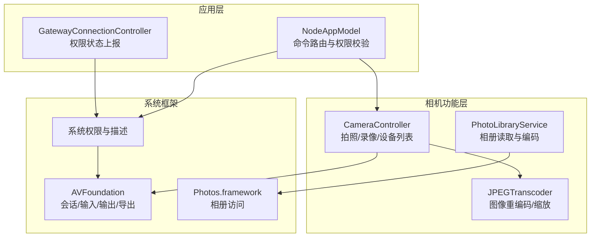
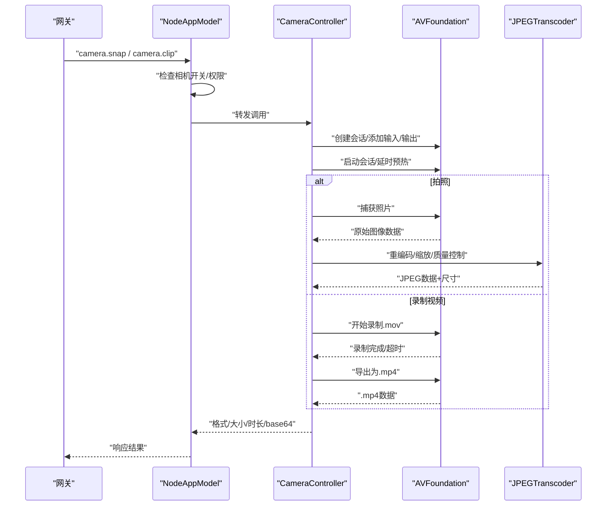
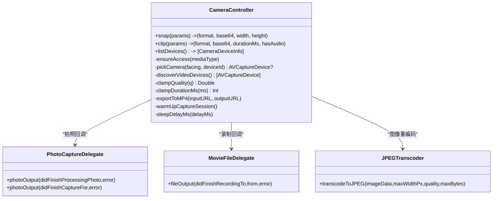
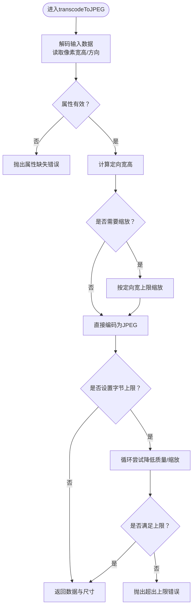
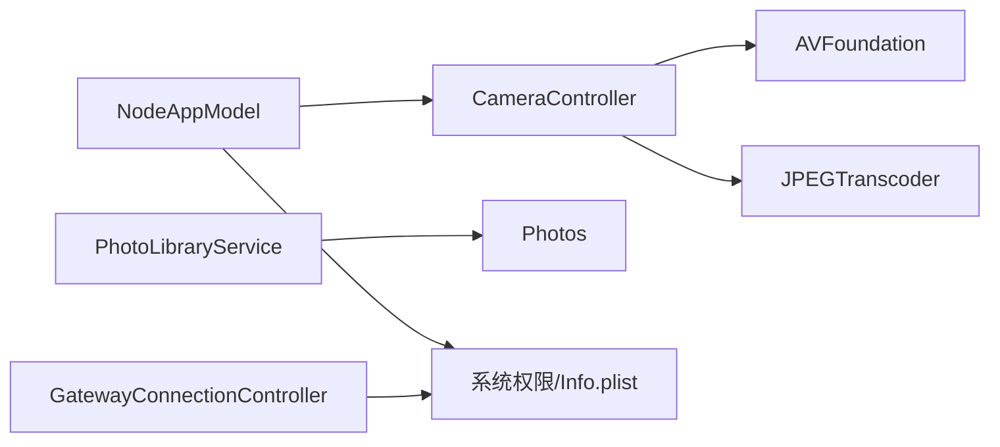

# 相机模块

<cite>
**本文引用的文件**
- [apps/ios/Sources/Camera/CameraController.swift](file://apps/ios/Sources/Camera/CameraController.swift)
- [apps/shared/OpenClawKit/Sources/OpenClawKit/CameraCommands.swift](file://apps/shared/OpenClawKit/Sources/OpenClawKit/CameraCommands.swift)
- [apps/shared/OpenClawKit/Sources/OpenClawKit/JPEGTranscoder.swift](file://apps/shared/OpenClawKit/Sources/OpenClawKit/JPEGTranscoder.swift)
- [apps/ios/Sources/Media/PhotoLibraryService.swift](file://apps/ios/Sources/Media/PhotoLibraryService.swift)
- [apps/ios/Sources/Model/NodeAppModel.swift](file://apps/ios/Sources/Model/NodeAppModel.swift)
- [apps/ios/Sources/Info.plist](file://apps/ios/Sources/Info.plist)
- [apps/ios/Tests/CameraControllerErrorTests.swift](file://apps/ios/Tests/CameraControllerErrorTests.swift)
- [apps/ios/Tests/CameraControllerClampTests.swift](file://apps/ios/Tests/CameraControllerClampTests.swift)
- [apps/ios/Sources/Gateway/GatewayConnectionController.swift](file://apps/ios/Sources/Gateway/GatewayConnectionController.swift)
</cite>

## 目录

1. [简介](#简介)
2. [项目结构](#项目结构)
3. [核心组件](#核心组件)
4. [架构总览](#架构总览)
5. [详细组件分析](#详细组件分析)
6. [依赖关系分析](#依赖关系分析)
7. [性能考量](#性能考量)
8. [故障排查指南](#故障排查指南)
9. [结论](#结论)
10. [附录](#附录)

## 简介

本技术文档面向OpenClaw iOS相机模块，系统性阐述相机控制器的实现、权限管理与设备访问控制策略，以及相机预览、拍照与视频录制（剪辑）功能的端到端流程。文档同时覆盖AVFoundation框架的使用方式、图像处理管线（含JPEG重编码与尺寸限制）、错误处理机制、性能优化建议与用户体验设计要点，并提供可操作的故障排查步骤。

## 项目结构

相机模块在iOS应用中的位置与职责如下：

- 控制器层：CameraController负责调用AVFoundation进行拍照与视频录制，封装权限检查、设备选择、导出与传输。
- 命令定义层：OpenClawKit中定义了相机命令与参数类型，统一跨平台调用契约。
- 图像处理层：JPEGTranscoder提供图像解码、EXIF方向归一化、缩放与压缩，确保输出满足网关传输约束。
- 相册访问层：PhotoLibraryService提供相册最新照片读取与安全编码，避免超大载荷。
- 应用模型层：NodeAppModel将相机能力接入网关桥接调用，统一错误提示与后台限制策略。
- 权限与配置：Info.plist声明相机与麦克风使用说明；GatewayConnectionController上报当前权限状态；NodeAppModel在调用前校验相机开关与权限。

图表来源

- [apps/ios/Sources/Camera/CameraController.swift](file://apps/ios/Sources/Camera/CameraController.swift#L1-L407)
- [apps/shared/OpenClawKit/Sources/OpenClawKit/JPEGTranscoder.swift](file://apps/shared/OpenClawKit/Sources/OpenClawKit/JPEGTranscoder.swift#L1-L136)
- [apps/ios/Sources/Media/PhotoLibraryService.swift](file://apps/ios/Sources/Media/PhotoLibraryService.swift#L1-L165)
- [apps/ios/Sources/Model/NodeAppModel.swift](file://apps/ios/Sources/Model/NodeAppModel.swift#L623-L646)
- [apps/ios/Sources/Info.plist](file://apps/ios/Sources/Info.plist#L34-L43)

章节来源

- [apps/ios/Sources/Camera/CameraController.swift](file://apps/ios/Sources/Camera/CameraController.swift#L1-L407)
- [apps/shared/OpenClawKit/Sources/OpenClawKit/CameraCommands.swift](file://apps/shared/OpenClawKit/Sources/OpenClawKit/CameraCommands.swift#L1-L69)
- [apps/shared/OpenClawKit/Sources/OpenClawKit/JPEGTranscoder.swift](file://apps/shared/OpenClawKit/Sources/OpenClawKit/JPEGTranscoder.swift#L1-L136)
- [apps/ios/Sources/Media/PhotoLibraryService.swift](file://apps/ios/Sources/Media/PhotoLibraryService.swift#L1-L165)
- [apps/ios/Sources/Model/NodeAppModel.swift](file://apps/ios/Sources/Model/NodeAppModel.swift#L623-L646)
- [apps/ios/Sources/Info.plist](file://apps/ios/Sources/Info.plist#L34-L43)

## 核心组件

- 相机控制器（CameraController）
  - 提供snap（拍照）、clip（短时视频录制并转码为MP4）、listDevices（列出可用摄像头）等能力。
  - 内置ensureAccess用于请求并校验相机/麦克风权限；pickCamera根据朝向或设备ID选择具体设备；clampQuality/clampDurationMs对质量与时长进行边界裁剪。
  - 使用AVCaptureSession、AVCapturePhotoOutput、AVCaptureMovieFileOutput与AVAssetExportSession完成采集与导出。
- 命令与参数（OpenClawKit）
  - 定义camera.list/snap/clip命令枚举与参数结构体，统一跨平台调用格式。
- 图像处理（JPEGTranscoder）
  - 支持按“定向像素宽度”上限缩放、EXIF方向归一化、质量与字节上限双重约束的重编码。
- 相册服务（PhotoLibraryService）
  - 读取相册最新照片，按最大宽度与质量预算进行编码，保障单次RPC载荷安全。
- 应用模型（NodeAppModel）
  - 在网关调用前检查相机开关与权限，必要时弹出HUD提示错误信息。
- 权限与配置（Info.plist）
  - 声明相机与麦克风使用说明，引导用户授权。

章节来源

- [apps/ios/Sources/Camera/CameraController.swift](file://apps/ios/Sources/Camera/CameraController.swift#L39-L190)
- [apps/shared/OpenClawKit/Sources/OpenClawKit/CameraCommands.swift](file://apps/shared/OpenClawKit/Sources/OpenClawKit/CameraCommands.swift#L1-L69)
- [apps/shared/OpenClawKit/Sources/OpenClawKit/JPEGTranscoder.swift](file://apps/shared/OpenClawKit/Sources/OpenClawKit/JPEGTranscoder.swift#L26-L134)
- [apps/ios/Sources/Media/PhotoLibraryService.swift](file://apps/ios/Sources/Media/PhotoLibraryService.swift#L16-L55)
- [apps/ios/Sources/Model/NodeAppModel.swift](file://apps/ios/Sources/Model/NodeAppModel.swift#L623-L646)
- [apps/ios/Sources/Info.plist](file://apps/ios/Sources/Info.plist#L34-L43)

## 架构总览

相机功能从网关命令入口开始，经NodeAppModel路由至CameraController，再通过AVFoundation完成采集与导出，最终将结果（base64+元数据）返回给网关。相册读取由PhotoLibraryService独立完成，遵循同样的载荷约束策略。

图表来源

- [apps/ios/Sources/Model/NodeAppModel.swift](file://apps/ios/Sources/Model/NodeAppModel.swift#L627-L673)
- [apps/ios/Sources/Camera/CameraController.swift](file://apps/ios/Sources/Camera/CameraController.swift#L39-L190)
- [apps/shared/OpenClawKit/Sources/OpenClawKit/JPEGTranscoder.swift](file://apps/shared/OpenClawKit/Sources/OpenClawKit/JPEGTranscoder.swift#L35-L96)

## 详细组件分析

### 相机控制器（CameraController）

- 职责与能力
  - 拍照：创建photo会话，选择相机输入，配置输出，捕获后通过JPEGTranscoder进行重编码与尺寸控制。
  - 录像：创建movie会话，可选音频输入，录制完成后导出为MP4，再读取为base64返回。
  - 设备列表：发现并列举所有可用视频设备，包含朝向与类型信息。
- 权限管理
  - ensureAccess针对视频/音频分别检查授权状态，未授权时触发系统授权请求；拒绝或受限则抛出对应错误。
- 参数裁剪
  - clampQuality将质量限定在合理区间，默认0.9；clampDurationMs将时长限制在较短范围，避免超大payload。
- 导出与转码
  - exportToMP4使用AVAssetExportSession将录制产物转为MP4，兼容新旧iOS版本异步导出路径。
- 错误处理
  - 统一的CameraError枚举涵盖设备不可用、权限被拒、参数无效、捕获失败、导出失败等场景。

图表来源

- [apps/ios/Sources/Camera/CameraController.swift](file://apps/ios/Sources/Camera/CameraController.swift#L5-L407)
- [apps/shared/OpenClawKit/Sources/OpenClawKit/JPEGTranscoder.swift](file://apps/shared/OpenClawKit/Sources/OpenClawKit/JPEGTranscoder.swift#L26-L134)

章节来源

- [apps/ios/Sources/Camera/CameraController.swift](file://apps/ios/Sources/Camera/CameraController.swift#L39-L190)
- [apps/ios/Sources/Camera/CameraController.swift](file://apps/ios/Sources/Camera/CameraController.swift#L202-L221)
- [apps/ios/Sources/Camera/CameraController.swift](file://apps/ios/Sources/Camera/CameraController.swift#L266-L275)
- [apps/ios/Sources/Camera/CameraController.swift](file://apps/ios/Sources/Camera/CameraController.swift#L277-L312)
- [apps/ios/Sources/Camera/CameraController.swift](file://apps/ios/Sources/Camera/CameraController.swift#L327-L374)
- [apps/ios/Sources/Camera/CameraController.swift](file://apps/ios/Sources/Camera/CameraController.swift#L376-L406)

### 命令与参数（OpenClawKit）

- 命令
  - camera.list：查询可用相机设备。
  - camera.snap：拍照。
  - camera.clip：录制短时视频。
- 参数
  - Snap参数：朝向、最大宽度、质量、格式、设备ID、拍摄延时。
  - Clip参数：朝向、时长、是否包含音频、格式、设备ID。
- 类型与等价性
  - 所有参数结构体均符合Codable、Sendable、Equatable，便于跨线程与跨进程传递。

章节来源

- [apps/shared/OpenClawKit/Sources/OpenClawKit/CameraCommands.swift](file://apps/shared/OpenClawKit/Sources/OpenClawKit/CameraCommands.swift#L3-L68)

### 图像处理（JPEGTranscoder）

- 功能特性
  - 解码输入图像数据，读取像素宽高与EXIF方向。
  - 按“定向像素宽度”上限进行缩放，保证输出像素宽度不超过阈值。
  - 支持质量与最大字节数双重约束，自动降低质量或进一步缩放以满足上限。
  - 输出数据包含最终宽度与高度，便于上层统计与展示。
- 错误类型
  - 解码失败、属性缺失、编码失败、超出字节上限等。

图表来源

- [apps/shared/OpenClawKit/Sources/OpenClawKit/JPEGTranscoder.swift](file://apps/shared/OpenClawKit/Sources/OpenClawKit/JPEGTranscoder.swift#L35-L134)

章节来源

- [apps/shared/OpenClawKit/Sources/OpenClawKit/JPEGTranscoder.swift](file://apps/shared/OpenClawKit/Sources/OpenClawKit/JPEGTranscoder.swift#L6-L24)
- [apps/shared/OpenClawKit/Sources/OpenClawKit/JPEGTranscoder.swift](file://apps/shared/OpenClawKit/Sources/OpenClawKit/JPEGTranscoder.swift#L35-L134)

### 相册访问（PhotoLibraryService）

- 能力
  - 获取相册最新照片，支持限制数量、最大宽度与质量。
  - 将UIImage编码为JPEG，按预算逐步降低质量或缩小尺寸，确保单张与总量不超网关载荷。
- 权限
  - 仅在授权为“已授权”或“有限授权”时允许读取；否则抛出明确错误。
- 传输约束
  - 单张与总量的base64字符数上限，避免WebSocket连接因超大载荷而断开。

章节来源

- [apps/ios/Sources/Media/PhotoLibraryService.swift](file://apps/ios/Sources/Media/PhotoLibraryService.swift#L16-L55)
- [apps/ios/Sources/Media/PhotoLibraryService.swift](file://apps/ios/Sources/Media/PhotoLibraryService.swift#L111-L148)

### 权限管理与设备访问控制

- 系统权限
  - Info.plist中声明相机与麦克风使用说明，引导用户授权。
- 运行时检查
  - ensureAccess在调用前检查并请求相机/麦克风权限；拒绝或受限时立即报错。
  - GatewayConnectionController上报当前权限状态，便于前端显示。
- 应用模型校验
  - NodeAppModel在收到camera.\*命令时，先检查相机开关与权限，若未启用则返回明确错误提示。
- 设备选择
  - pickCamera优先按deviceId匹配，其次按朝向选择内置广角相机，最后回退到默认视频设备。

章节来源

- [apps/ios/Sources/Info.plist](file://apps/ios/Sources/Info.plist#L34-L43)
- [apps/ios/Sources/Camera/CameraController.swift](file://apps/ios/Sources/Camera/CameraController.swift#L202-L221)
- [apps/ios/Sources/Gateway/GatewayConnectionController.swift](file://apps/ios/Sources/Gateway/GatewayConnectionController.swift#L542-L562)
- [apps/ios/Sources/Model/NodeAppModel.swift](file://apps/ios/Sources/Model/NodeAppModel.swift#L639-L646)
- [apps/ios/Sources/Camera/CameraController.swift](file://apps/ios/Sources/Camera/CameraController.swift#L223-L238)

## 依赖关系分析

- 模块耦合
  - CameraController强依赖AVFoundation与OpenClawKit（参数与工具），弱依赖JPEGTranscoder。
  - NodeAppModel作为网关调用入口，耦合权限检查与错误提示逻辑。
  - PhotoLibraryService独立于相机控制器，但共享相同的载荷约束策略。
- 外部依赖
  - AVFoundation：会话、输入/输出、导出。
  - Photos：相册访问与图片请求。
  - Foundation/UIKit：基础数据结构与UI交互。

图表来源

- [apps/ios/Sources/Model/NodeAppModel.swift](file://apps/ios/Sources/Model/NodeAppModel.swift#L627-L673)
- [apps/ios/Sources/Camera/CameraController.swift](file://apps/ios/Sources/Camera/CameraController.swift#L1-L407)
- [apps/ios/Sources/Media/PhotoLibraryService.swift](file://apps/ios/Sources/Media/PhotoLibraryService.swift#L1-L165)
- [apps/ios/Sources/Info.plist](file://apps/ios/Sources/Info.plist#L34-L43)
- [apps/ios/Sources/Gateway/GatewayConnectionController.swift](file://apps/ios/Sources/Gateway/GatewayConnectionController.swift#L542-L562)

章节来源

- [apps/ios/Sources/Model/NodeAppModel.swift](file://apps/ios/Sources/Model/NodeAppModel.swift#L627-L673)
- [apps/ios/Sources/Camera/CameraController.swift](file://apps/ios/Sources/Camera/CameraController.swift#L1-L407)
- [apps/ios/Sources/Media/PhotoLibraryService.swift](file://apps/ios/Sources/Media/PhotoLibraryService.swift#L1-L165)
- [apps/ios/Sources/Info.plist](file://apps/ios/Sources/Info.plist#L34-L43)
- [apps/ios/Sources/Gateway/GatewayConnectionController.swift](file://apps/ios/Sources/Gateway/GatewayConnectionController.swift#L542-L562)

## 性能考量

- 会话预热与延时
  - 启动会话后短暂休眠以减少首帧空白问题；支持可配置拍摄延时，避免手抖。
- 缩放与质量
  - 默认最大宽度与质量在保证体验的同时控制payload大小；JPEGTranscoder在超限时自动降质或缩放。
- 导出策略
  - 录制完成后转码为MP4，便于下游处理；导出过程按系统版本采用同步或异步路径。
- 相册读取
  - 限制每次读取数量与最大宽度，按预算逐步编码，避免一次性传输过多数据。

章节来源

- [apps/ios/Sources/Camera/CameraController.swift](file://apps/ios/Sources/Camera/CameraController.swift#L314-L324)
- [apps/ios/Sources/Camera/CameraController.swift](file://apps/ios/Sources/Camera/CameraController.swift#L49-L51)
- [apps/shared/OpenClawKit/Sources/OpenClawKit/JPEGTranscoder.swift](file://apps/shared/OpenClawKit/Sources/OpenClawKit/JPEGTranscoder.swift#L99-L134)
- [apps/ios/Sources/Media/PhotoLibraryService.swift](file://apps/ios/Sources/Media/PhotoLibraryService.swift#L24-L52)

## 故障排查指南

- 常见错误与定位
  - 相机不可用：检查设备是否被占用或无可用相机；确认pickCamera返回非空。
  - 权限被拒：ensureAccess会在未授权时触发系统请求；若被拒或受限，需引导用户前往系统设置开启。
  - 参数无效：clampQuality/clampDurationMs对异常值进行裁剪；如仍报错，检查传入参数范围。
  - 导出失败：exportToMP4在不同iOS版本采用不同导出路径；失败时查看错误域与代码。
- 单元测试参考
  - 错误描述稳定性测试：验证各错误类型的本地化描述。
  - 参数裁剪测试：验证默认值与边界值行为。
- 用户提示
  - NodeAppModel在相机命令失败时弹出HUD提示，帮助用户快速定位问题。

章节来源

- [apps/ios/Sources/Camera/CameraController.swift](file://apps/ios/Sources/Camera/CameraController.swift#L13-L37)
- [apps/ios/Tests/CameraControllerErrorTests.swift](file://apps/ios/Tests/CameraControllerErrorTests.swift#L5-L13)
- [apps/ios/Tests/CameraControllerClampTests.swift](file://apps/ios/Tests/CameraControllerClampTests.swift#L5-L23)
- [apps/ios/Sources/Model/NodeAppModel.swift](file://apps/ios/Sources/Model/NodeAppModel.swift#L664-L667)

## 结论

OpenClaw iOS相机模块以CameraController为核心，结合OpenClawKit的命令契约与JPEGTranscoder的图像处理能力，实现了稳定、可控且高性能的拍照与短视频录制流程。通过严格的权限管理、参数裁剪与导出策略，系统在保证用户体验的同时满足网关传输约束。配合NodeAppModel的统一错误提示与后台限制策略，整体功能具备良好的可维护性与可扩展性。

## 附录

- 关键API与流程路径
  - 拍照：[snap实现](file://apps/ios/Sources/Camera/CameraController.swift#L39-L110)
  - 录像：[clip实现](file://apps/ios/Sources/Camera/CameraController.swift#L112-L190)
  - 设备列表：[listDevices实现](file://apps/ios/Sources/Camera/CameraController.swift#L192-L200)
  - 权限检查：[ensureAccess实现](file://apps/ios/Sources/Camera/CameraController.swift#L202-L221)
  - 导出转码：[exportToMP4实现](file://apps/ios/Sources/Camera/CameraController.swift#L277-L312)
  - 图像重编码：[JPEGTranscoder](file://apps/shared/OpenClawKit/Sources/OpenClawKit/JPEGTranscoder.swift#L35-L134)
  - 相册读取：[PhotoLibraryService](file://apps/ios/Sources/Media/PhotoLibraryService.swift#L16-L55)
  - 命令定义：[CameraCommands](file://apps/shared/OpenClawKit/Sources/OpenClawKit/CameraCommands.swift#L3-L68)
  - 权限描述：[Info.plist](file://apps/ios/Sources/Info.plist#L34-L43)
  - 权限状态上报：[GatewayConnectionController](file://apps/ios/Sources/Gateway/GatewayConnectionController.swift#L542-L562)
  - 调用前置校验：[NodeAppModel](file://apps/ios/Sources/Model/NodeAppModel.swift#L639-L646)
