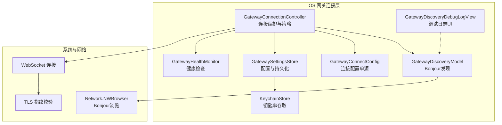
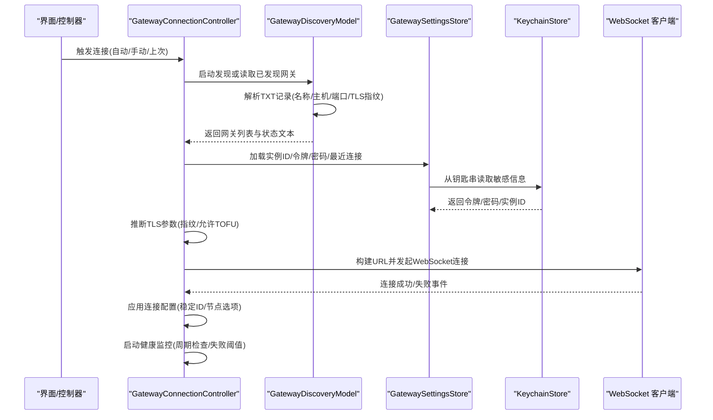
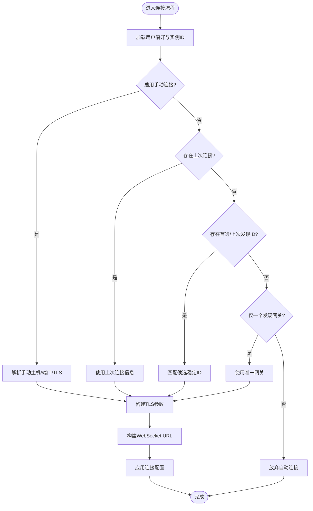
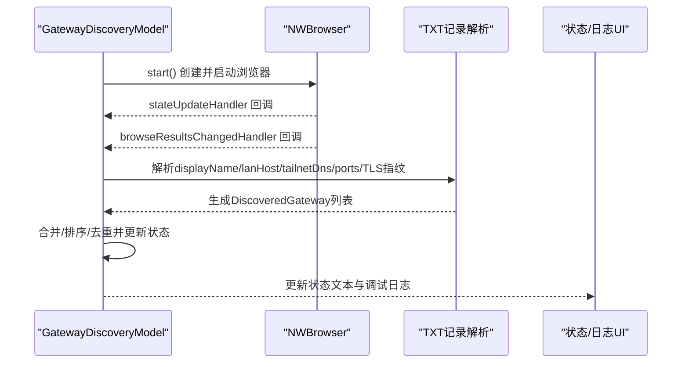
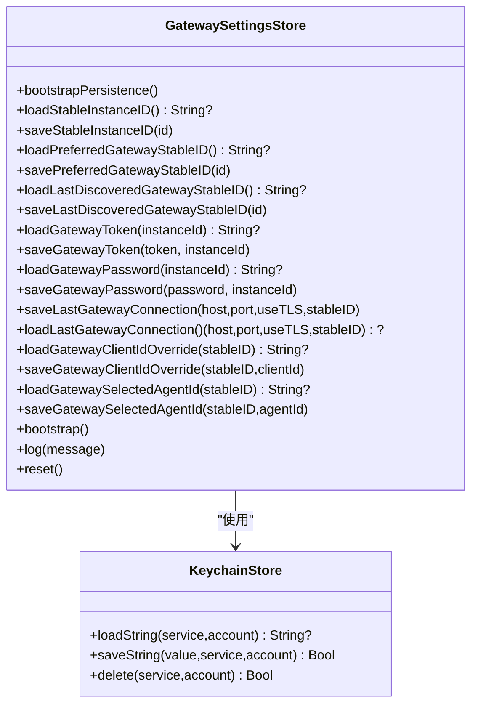
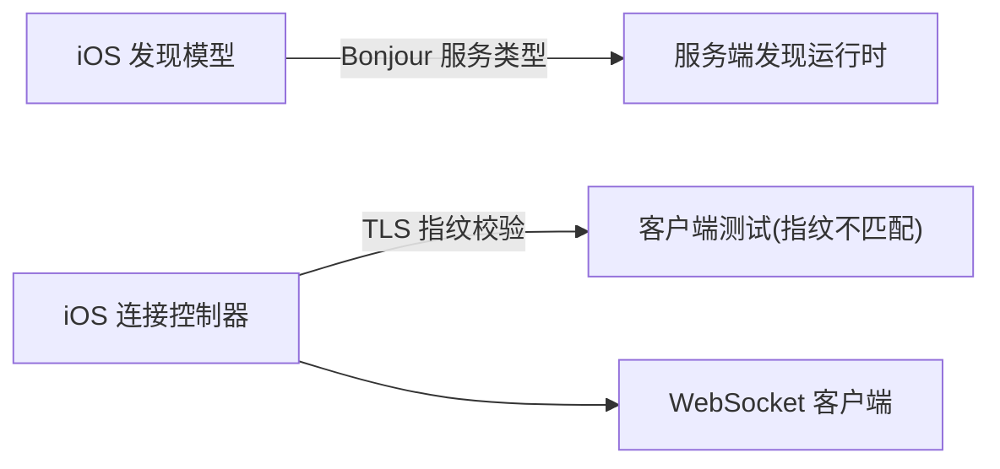

# 网关连接

<cite>
**本文引用的文件**
- [apps/ios/Sources/Gateway/GatewayConnectionController.swift](file://apps/ios/Sources/Gateway/GatewayConnectionController.swift)
- [apps/ios/Sources/Gateway/GatewayDiscoveryModel.swift](file://apps/ios/Sources/Gateway/GatewayDiscoveryModel.swift)
- [apps/ios/Sources/Gateway/GatewayConnectConfig.swift](file://apps/ios/Sources/Gateway/GatewayConnectConfig.swift)
- [apps/ios/Sources/Gateway/GatewaySettingsStore.swift](file://apps/ios/Sources/Gateway/GatewaySettingsStore.swift)
- [apps/ios/Sources/Gateway/KeychainStore.swift](file://apps/ios/Sources/Gateway/KeychainStore.swift)
- [apps/ios/Sources/Gateway/GatewayHealthMonitor.swift](file://apps/ios/Sources/Gateway/GatewayHealthMonitor.swift)
- [apps/ios/Sources/Gateway/GatewayDiscoveryDebugLogView.swift](file://apps/ios/Sources/Gateway/GatewayDiscoveryDebugLogView.swift)
- [apps/ios/Tests/GatewayConnectionControllerTests.swift](file://apps/ios/Tests/GatewayConnectionControllerTests.swift)
- [src/gateway/server-discovery-runtime.ts](file://src/gateway/server-discovery-runtime.ts)
- [src/gateway/client.test.ts](file://src/gateway/client.test.ts)
</cite>

## 目录

1. [简介](#简介)
2. [项目结构](#项目结构)
3. [核心组件](#核心组件)
4. [架构总览](#架构总览)
5. [详细组件分析](#详细组件分析)
6. [依赖关系分析](#依赖关系分析)
7. [性能考虑](#性能考虑)
8. [故障排查指南](#故障排查指南)
9. [结论](#结论)
10. [附录](#附录)

## 简介

本技术文档聚焦于OpenClaw iOS端“网关连接”能力，系统性阐述网关连接控制器的实现、Bonjour服务发现机制、配置管理、连接状态与重连策略、WebSocket连接建立以及安全认证（TLS指纹校验）等关键环节。文档同时提供性能优化建议、错误处理策略与用户体验设计要点，帮助开发者与运维人员高效理解并维护该模块。

## 项目结构

iOS侧网关连接相关代码主要位于apps/ios/Sources/Gateway目录，围绕以下职责划分：

- 发现与浏览：GatewayDiscoveryModel使用Network框架的NWBrowser进行Bonjour服务发现，解析TXT记录并聚合网关列表。
- 连接编排：GatewayConnectionController负责自动/手动连接、TLS参数解析、客户端能力/命令/权限声明、连接配置下发。
- 配置与持久化：GatewaySettingsStore与KeychainStore分别负责用户偏好、实例ID、令牌/密码、最近连接信息等的持久化。
- 健康监控：GatewayHealthMonitor提供周期性健康检查与失败阈值控制。
- 调试与日志：GatewayDiscoveryDebugLogView展示发现阶段调试日志；GatewaySettingsStore内含网关诊断日志工具。

图表来源

- [apps/ios/Sources/Gateway/GatewayConnectionController.swift](file://apps/ios/Sources/Gateway/GatewayConnectionController.swift#L18-L40)
- [apps/ios/Sources/Gateway/GatewayDiscoveryModel.swift](file://apps/ios/Sources/Gateway/GatewayDiscoveryModel.swift#L51-L109)
- [apps/ios/Sources/Gateway/GatewayConnectConfig.swift](file://apps/ios/Sources/Gateway/GatewayConnectConfig.swift#L12-L27)
- [apps/ios/Sources/Gateway/GatewaySettingsStore.swift](file://apps/ios/Sources/Gateway/GatewaySettingsStore.swift#L27-L31)
- [apps/ios/Sources/Gateway/KeychainStore.swift](file://apps/ios/Sources/Gateway/KeychainStore.swift#L5-L47)
- [apps/ios/Sources/Gateway/GatewayHealthMonitor.swift](file://apps/ios/Sources/Gateway/GatewayHealthMonitor.swift#L16-L24)
- [apps/ios/Sources/Gateway/GatewayDiscoveryDebugLogView.swift](file://apps/ios/Sources/Gateway/GatewayDiscoveryDebugLogView.swift#L4-L41)

章节来源

- [apps/ios/Sources/Gateway/GatewayConnectionController.swift](file://apps/ios/Sources/Gateway/GatewayConnectionController.swift#L18-L40)
- [apps/ios/Sources/Gateway/GatewayDiscoveryModel.swift](file://apps/ios/Sources/Gateway/GatewayDiscoveryModel.swift#L51-L109)

## 核心组件

- GatewayConnectionController：连接编排核心，负责自动/手动连接、TLS参数推断、客户端能力/命令/权限声明、连接配置下发与重连触发。
- GatewayDiscoveryModel：基于Network.NWBrowser的Bonjour发现模型，解析TXT记录，聚合网关列表并维护状态文本与调试日志。
- GatewayConnectConfig：单一可信连接配置，承载URL、稳定ID、TLS参数、令牌/密码及节点会话选项。
- GatewaySettingsStore：集中管理实例ID、首选/上次发现的网关稳定ID、手动连接参数、最近连接信息、客户端ID覆盖、选中代理ID以及诊断日志。
- KeychainStore：封装钥匙串读写，用于安全存储令牌、密码与实例ID。
- GatewayHealthMonitor：周期性健康检查，支持超时与失败计数阈值，触发回调。
- GatewayDiscoveryDebugLogView：展示发现阶段调试日志，支持复制导出。

章节来源

- [apps/ios/Sources/Gateway/GatewayConnectionController.swift](file://apps/ios/Sources/Gateway/GatewayConnectionController.swift#L18-L40)
- [apps/ios/Sources/Gateway/GatewayDiscoveryModel.swift](file://apps/ios/Sources/Gateway/GatewayDiscoveryModel.swift#L8-L32)
- [apps/ios/Sources/Gateway/GatewayConnectConfig.swift](file://apps/ios/Sources/Gateway/GatewayConnectConfig.swift#L12-L27)
- [apps/ios/Sources/Gateway/GatewaySettingsStore.swift](file://apps/ios/Sources/Gateway/GatewaySettingsStore.swift#L4-L24)
- [apps/ios/Sources/Gateway/KeychainStore.swift](file://apps/ios/Sources/Gateway/KeychainStore.swift#L5-L47)
- [apps/ios/Sources/Gateway/GatewayHealthMonitor.swift](file://apps/ios/Sources/Gateway/GatewayHealthMonitor.swift#L6-L10)
- [apps/ios/Sources/Gateway/GatewayDiscoveryDebugLogView.swift](file://apps/ios/Sources/Gateway/GatewayDiscoveryDebugLogView.swift#L4-L41)

## 架构总览

下图展示了从发现到连接的关键交互路径，包括Bonjour服务发现、TLS指纹校验、WebSocket握手与健康监控。

图表来源

- [apps/ios/Sources/Gateway/GatewayConnectionController.swift](file://apps/ios/Sources/Gateway/GatewayConnectionController.swift#L59-L84)
- [apps/ios/Sources/Gateway/GatewayDiscoveryModel.swift](file://apps/ios/Sources/Gateway/GatewayDiscoveryModel.swift#L51-L109)
- [apps/ios/Sources/Gateway/GatewaySettingsStore.swift](file://apps/ios/Sources/Gateway/GatewaySettingsStore.swift#L88-L136)
- [apps/ios/Sources/Gateway/KeychainStore.swift](file://apps/ios/Sources/Gateway/KeychainStore.swift#L5-L47)

## 详细组件分析

### 组件A：GatewayConnectionController（连接编排）

职责与流程

- 自动连接策略：依据用户偏好、实例ID、最近连接、上次发现的稳定ID与单网关候选，按优先级选择目标网关并发起连接。
- 手动连接与上次连接：支持手动指定主机/端口/TLS，或复用最近一次连接信息。
- TLS参数解析：根据发现结果或用户设置推断TLS必需性、期望指纹、是否允许首次信任(TOFU)。
- 客户端能力/命令/权限声明：动态收集相机、位置、运动、屏幕录制、通讯录/日历/提醒等授权状态，生成能力集合与命令清单。
- 连接配置下发：构造GatewayConnectConfig并交由应用模型执行连接。

图表来源

- [apps/ios/Sources/Gateway/GatewayConnectionController.swift](file://apps/ios/Sources/Gateway/GatewayConnectionController.swift#L173-L289)
- [apps/ios/Sources/Gateway/GatewayConnectionController.swift](file://apps/ios/Sources/Gateway/GatewayConnectionController.swift#L316-L340)

章节来源

- [apps/ios/Sources/Gateway/GatewayConnectionController.swift](file://apps/ios/Sources/Gateway/GatewayConnectionController.swift#L59-L148)
- [apps/ios/Sources/Gateway/GatewayConnectionController.swift](file://apps/ios/Sources/Gateway/GatewayConnectionController.swift#L173-L289)
- [apps/ios/Sources/Gateway/GatewayConnectionController.swift](file://apps/ios/Sources/Gateway/GatewayConnectionController.swift#L316-L340)

### 组件B：GatewayDiscoveryModel（Bonjour服务发现）

职责与流程

- 使用Network.NWBrowser在多个域名上浏览\_openclaw-gw.\_tcp.服务类型，监听状态变化与浏览结果变更。
- 解析TXT记录中的显示名、LAN主机、Tailnet DNS、端口、TLS开关与指纹等字段，生成标准化的网关描述对象。
- 维护状态文本（Idle/Setup/Searching/Waiting/Failed）与调试日志队列，支持上限截断以控制内存占用。

图表来源

- [apps/ios/Sources/Gateway/GatewayDiscoveryModel.swift](file://apps/ios/Sources/Gateway/GatewayDiscoveryModel.swift#L51-L109)
- [apps/ios/Sources/Gateway/GatewayDiscoveryModel.swift](file://apps/ios/Sources/Gateway/GatewayDiscoveryModel.swift#L123-L136)
- [apps/ios/Sources/Gateway/GatewayDiscoveryModel.swift](file://apps/ios/Sources/Gateway/GatewayDiscoveryModel.swift#L138-L176)

章节来源

- [apps/ios/Sources/Gateway/GatewayDiscoveryModel.swift](file://apps/ios/Sources/Gateway/GatewayDiscoveryModel.swift#L8-L32)
- [apps/ios/Sources/Gateway/GatewayDiscoveryModel.swift](file://apps/ios/Sources/Gateway/GatewayDiscoveryModel.swift#L51-L109)
- [apps/ios/Sources/Gateway/GatewayDiscoveryModel.swift](file://apps/ios/Sources/Gateway/GatewayDiscoveryModel.swift#L138-L176)

### 组件C：GatewayConnectConfig（连接配置单源）

- 单一可信来源：统一承载URL、稳定ID、TLS参数、令牌/密码与节点会话选项，避免不同键空间导致的状态漂移。
- 稳定ID回退：当显式稳定ID为空时，回退到URL字符串作为有效稳定ID。

章节来源

- [apps/ios/Sources/Gateway/GatewayConnectConfig.swift](file://apps/ios/Sources/Gateway/GatewayConnectConfig.swift#L12-L27)

### 组件D：GatewaySettingsStore 与 KeychainStore（配置与持久化）

- GatewaySettingsStore
  - 实例ID、首选/上次发现稳定ID的引导与同步。
  - 手动连接参数、最近连接信息、客户端ID覆盖、选中代理ID的读写。
  - 诊断日志文件的引导、追加与裁剪。
- KeychainStore
  - 封装钥匙串读写与删除，支持首次解锁后设备可用属性。

图表来源

- [apps/ios/Sources/Gateway/GatewaySettingsStore.swift](file://apps/ios/Sources/Gateway/GatewaySettingsStore.swift#L4-L249)
- [apps/ios/Sources/Gateway/KeychainStore.swift](file://apps/ios/Sources/Gateway/KeychainStore.swift#L5-L47)

章节来源

- [apps/ios/Sources/Gateway/GatewaySettingsStore.swift](file://apps/ios/Sources/Gateway/GatewaySettingsStore.swift#L27-L247)
- [apps/ios/Sources/Gateway/KeychainStore.swift](file://apps/ios/Sources/Gateway/KeychainStore.swift#L5-L47)

### 组件E：GatewayHealthMonitor（健康监控）

- 支持自定义检查间隔、超时与最大失败次数。
- 提供异步超时包装的检查执行器，失败计数超过阈值后回调失败处理逻辑。
- 可注入sleep以支持测试与可观察性。

章节来源

- [apps/ios/Sources/Gateway/GatewayHealthMonitor.swift](file://apps/ios/Sources/Gateway/GatewayHealthMonitor.swift#L6-L57)

### 组件F：GatewayDiscoveryDebugLogView（调试日志UI）

- 展示发现阶段调试日志，支持复制导出。
- 通过AppStorage控制是否开启调试日志。

章节来源

- [apps/ios/Sources/Gateway/GatewayDiscoveryDebugLogView.swift](file://apps/ios/Sources/Gateway/GatewayDiscoveryDebugLogView.swift#L4-L41)

## 依赖关系分析

- 运行时发现与广告
  - iOS侧通过Network.NWBrowser进行Bonjour发现；服务端通过server-discovery-runtime.ts启动Bonjour广告，确保双向可见。
- 安全认证与握手
  - 客户端侧对TLS指纹进行严格校验，测试用例验证了指纹不匹配导致的连接错误。
- 测试与验证
  - iOS端测试覆盖显示名解析、能力集合与命令清单的条件分支。

图表来源

- [src/gateway/server-discovery-runtime.ts](file://src/gateway/server-discovery-runtime.ts#L41-L58)
- [src/gateway/client.test.ts](file://src/gateway/client.test.ts#L131-L178)
- [apps/ios/Sources/Gateway/GatewayConnectionController.swift](file://apps/ios/Sources/Gateway/GatewayConnectionController.swift#L342-L372)

章节来源

- [src/gateway/server-discovery-runtime.ts](file://src/gateway/server-discovery-runtime.ts#L41-L58)
- [src/gateway/client.test.ts](file://src/gateway/client.test.ts#L131-L178)
- [apps/ios/Tests/GatewayConnectionControllerTests.swift](file://apps/ios/Tests/GatewayConnectionControllerTests.swift#L32-L79)

## 性能考虑

- 发现与浏览
  - 控制并发浏览器数量与队列命名，避免过多线程竞争；限制调试日志条目数量，防止内存膨胀。
- 连接与握手
  - 合理设置TLS指纹缓存与TOFU策略，减少重复校验成本；在无指纹或首次连接时谨慎启用TOFU。
- 健康监控
  - 适度调整检查间隔与超时，避免频繁轮询造成CPU/电量消耗；失败阈值应结合网络环境设定。
- 用户体验
  - 在后台/前台切换时合理启停发现，避免不必要的资源占用；连接状态文本与日志需及时反馈，便于用户感知。

## 故障排查指南

- 发现阶段问题
  - 开启“发现调试日志”，查看状态文本与日志条目，定位NWBrowser状态（Setup/Ready/Waiting/Failed）与TXT字段解析异常。
  - 确认Bonjour服务类型与域名配置一致，服务端是否正确启动广告。
- 连接阶段问题
  - 检查URL构建（scheme/host/port）、TLS参数（指纹/必需性/TOFU），确认令牌/密码与实例ID是否正确保存在钥匙串。
  - 若出现TLS错误，优先核对指纹一致性与服务端证书链。
- 健康监控问题
  - 调整检查间隔与超时，确认失败计数阈值合理；必要时临时禁用健康监控以排除干扰。
- 日志与诊断
  - 使用诊断日志工具记录关键事件，配合复制导出功能协助远程诊断。

章节来源

- [apps/ios/Sources/Gateway/GatewayDiscoveryModel.swift](file://apps/ios/Sources/Gateway/GatewayDiscoveryModel.swift#L40-L49)
- [apps/ios/Sources/Gateway/GatewayDiscoveryModel.swift](file://apps/ios/Sources/Gateway/GatewayDiscoveryModel.swift#L138-L176)
- [apps/ios/Sources/Gateway/GatewaySettingsStore.swift](file://apps/ios/Sources/Gateway/GatewaySettingsStore.swift#L251-L347)
- [src/gateway/client.test.ts](file://src/gateway/client.test.ts#L131-L178)

## 结论

iOS网关连接模块以GatewayConnectionController为核心，结合GatewayDiscoveryModel的Bonjour发现、GatewaySettingsStore的配置与持久化、KeychainStore的安全存储、GatewayHealthMonitor的健康检查，形成一套完整且可维护的连接体系。通过清晰的自动/手动连接策略、严格的TLS指纹校验与完善的调试日志，能够在复杂网络环境中提供稳定可靠的连接体验。

## 附录

- 关键流程参考路径
  - 自动连接策略：[apps/ios/Sources/Gateway/GatewayConnectionController.swift](file://apps/ios/Sources/Gateway/GatewayConnectionController.swift#L173-L289)
  - 手动/上次连接：[apps/ios/Sources/Gateway/GatewayConnectionController.swift](file://apps/ios/Sources/Gateway/GatewayConnectionController.swift#L86-L148)
  - TLS参数解析：[apps/ios/Sources/Gateway/GatewayConnectionController.swift](file://apps/ios/Sources/Gateway/GatewayConnectionController.swift#L342-L372)
  - 发现模型与状态：[apps/ios/Sources/Gateway/GatewayDiscoveryModel.swift](file://apps/ios/Sources/Gateway/GatewayDiscoveryModel.swift#L51-L176)
  - 连接配置单源：[apps/ios/Sources/Gateway/GatewayConnectConfig.swift](file://apps/ios/Sources/Gateway/GatewayConnectConfig.swift#L12-L27)
  - 配置与持久化：[apps/ios/Sources/Gateway/GatewaySettingsStore.swift](file://apps/ios/Sources/Gateway/GatewaySettingsStore.swift#L27-L247)
  - 钥匙串存取：[apps/ios/Sources/Gateway/KeychainStore.swift](file://apps/ios/Sources/Gateway/KeychainStore.swift#L5-L47)
  - 健康监控：[apps/ios/Sources/Gateway/GatewayHealthMonitor.swift](file://apps/ios/Sources/Gateway/GatewayHealthMonitor.swift#L16-L57)
  - 调试日志UI：[apps/ios/Sources/Gateway/GatewayDiscoveryDebugLogView.swift](file://apps/ios/Sources/Gateway/GatewayDiscoveryDebugLogView.swift#L4-L41)
  - 服务端发现运行时：[src/gateway/server-discovery-runtime.ts](file://src/gateway/server-discovery-runtime.ts#L41-L58)
  - 客户端TLS测试：[src/gateway/client.test.ts](file://src/gateway/client.test.ts#L131-L178)
  - iOS测试用例：[apps/ios/Tests/GatewayConnectionControllerTests.swift](file://apps/ios/Tests/GatewayConnectionControllerTests.swift#L32-L79)
