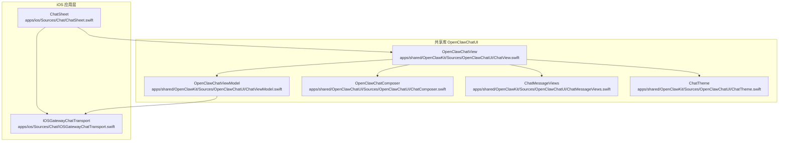
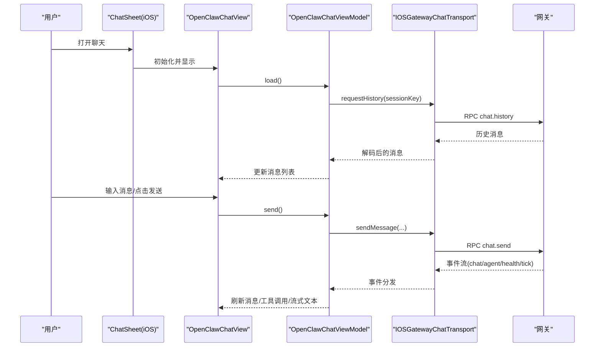
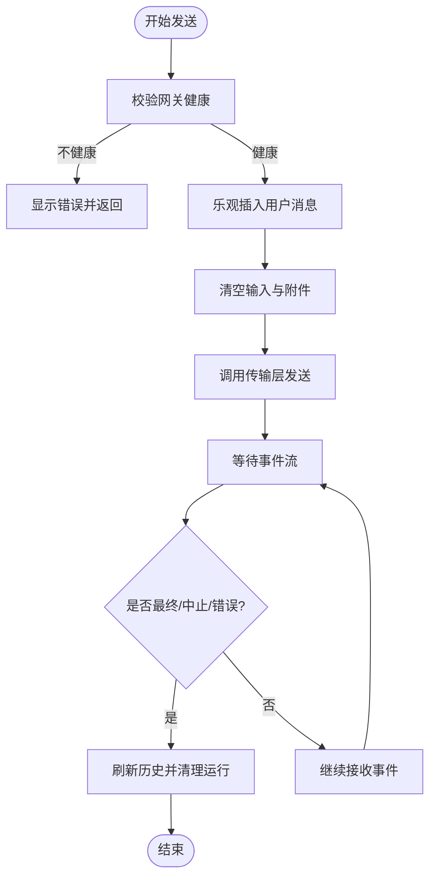
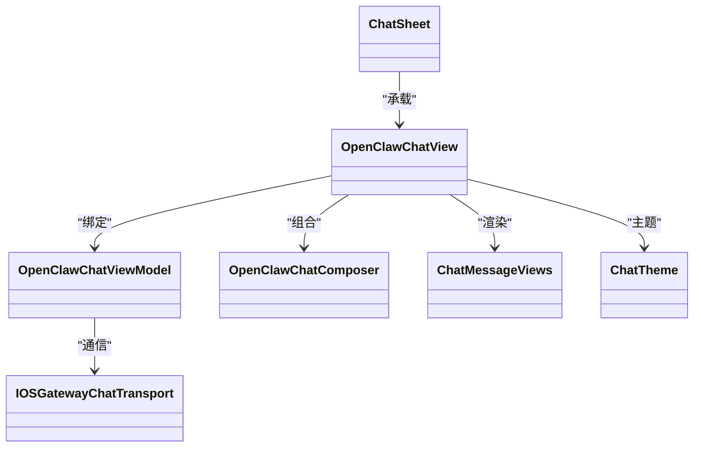

# 聊天界面

<cite>
**本文引用的文件**
- [apps/ios/Sources/Chat/ChatSheet.swift](file://apps/ios/Sources/Chat/ChatSheet.swift)
- [apps/ios/Sources/Chat/IOSGatewayChatTransport.swift](file://apps/ios/Sources/Chat/IOSGatewayChatTransport.swift)
- [apps/shared/OpenClawKit/Sources/OpenClawChatUI/ChatView.swift](file://apps/shared/OpenClawKit/Sources/OpenClawChatUI/ChatView.swift)
- [apps/shared/OpenClawKit/Sources/OpenClawChatUI/ChatViewModel.swift](file://apps/shared/OpenClawKit/Sources/OpenClawChatUI/ChatViewModel.swift)
- [apps/shared/OpenClawKit/Sources/OpenClawChatUI/ChatComposer.swift](file://apps/shared/OpenClawKit/Sources/OpenClawChatUI/ChatComposer.swift)
- [apps/shared/OpenClawKit/Sources/OpenClawChatUI/ChatMessageViews.swift](file://apps/shared/OpenClawKit/Sources/OpenClawChatUI/ChatMessageViews.swift)
- [apps/shared/OpenClawKit/Sources/OpenClawChatUI/ChatTheme.swift](file://apps/shared/OpenClawKit/Sources/OpenClawChatUI/ChatTheme.swift)
</cite>

## 目录

1. [简介](#简介)
2. [项目结构](#项目结构)
3. [核心组件](#核心组件)
4. [架构总览](#架构总览)
5. [详细组件分析](#详细组件分析)
6. [依赖关系分析](#依赖关系分析)
7. [性能考虑](#性能考虑)
8. [故障排查指南](#故障排查指南)
9. [结论](#结论)
10. [附录](#附录)

## 简介

本文件面向OpenClaw iOS聊天界面，系统性梳理iOS端ChatSheet的布局与交互、消息列表渲染、输入框处理，以及跨平台共享的OpenClawChatUI组件（消息格式化、实时更新机制）。文档同时提供性能优化建议、用户体验设计要点与无障碍访问支持指南，帮助开发者与产品人员快速理解并高效迭代聊天界面。

## 项目结构

iOS聊天相关代码主要分布在两个位置：

- iOS应用层：负责承载与导航，将OpenClawChatUI作为可复用组件渲染
- 共享库OpenClawChatUI：提供跨平台聊天视图、视图模型、主题与消息渲染等

图表来源

- [apps/ios/Sources/Chat/ChatSheet.swift](file://apps/ios/Sources/Chat/ChatSheet.swift#L1-L48)
- [apps/ios/Sources/Chat/IOSGatewayChatTransport.swift](file://apps/ios/Sources/Chat/IOSGatewayChatTransport.swift#L1-L130)
- [apps/shared/OpenClawKit/Sources/OpenClawChatUI/ChatView.swift](file://apps/shared/OpenClawKit/Sources/OpenClawChatUI/ChatView.swift#L1-L508)
- [apps/shared/OpenClawKit/Sources/OpenClawChatUI/ChatViewModel.swift](file://apps/shared/OpenClawKit/Sources/OpenClawChatUI/ChatViewModel.swift#L1-L555)
- [apps/shared/OpenClawKit/Sources/OpenClawChatUI/ChatComposer.swift](file://apps/shared/OpenClawKit/Sources/OpenClawChatUI/ChatComposer.swift#L1-L490)
- [apps/shared/OpenClawKit/Sources/OpenClawChatUI/ChatMessageViews.swift](file://apps/shared/OpenClawKit/Sources/OpenClawChatUI/ChatMessageViews.swift#L1-L617)
- [apps/shared/OpenClawKit/Sources/OpenClawChatUI/ChatTheme.swift](file://apps/shared/OpenClawKit/Sources/OpenClawChatUI/ChatTheme.swift#L1-L175)

章节来源

- [apps/ios/Sources/Chat/ChatSheet.swift](file://apps/ios/Sources/Chat/ChatSheet.swift#L1-L48)
- [apps/ios/Sources/Chat/IOSGatewayChatTransport.swift](file://apps/ios/Sources/Chat/IOSGatewayChatTransport.swift#L1-L130)
- [apps/shared/OpenClawKit/Sources/OpenClawChatUI/ChatView.swift](file://apps/shared/OpenClawKit/Sources/OpenClawChatUI/ChatView.swift#L1-L508)
- [apps/shared/OpenClawKit/Sources/OpenClawChatUI/ChatViewModel.swift](file://apps/shared/OpenClawKit/Sources/OpenClawChatUI/ChatViewModel.swift#L1-L555)
- [apps/shared/OpenClawKit/Sources/OpenClawChatUI/ChatComposer.swift](file://apps/shared/OpenClawKit/Sources/OpenClawChatUI/ChatComposer.swift#L1-L490)
- [apps/shared/OpenClawKit/Sources/OpenClawChatUI/ChatMessageViews.swift](file://apps/shared/OpenClawKit/Sources/OpenClawChatUI/ChatMessageViews.swift#L1-L617)
- [apps/shared/OpenClawKit/Sources/OpenClawChatUI/ChatTheme.swift](file://apps/shared/OpenClawKit/Sources/OpenClawChatUI/ChatTheme.swift#L1-L175)

## 核心组件

- ChatSheet（iOS入口）
  - 作用：在iOS中承载OpenClawChatView，提供导航标题、关闭按钮与会话切换入口
  - 关键点：通过初始化时注入IOSGatewayChatTransport，将iOS网关能力桥接到共享UI
- OpenClawChatView（聊天视图）
  - 作用：渲染消息列表、输入区、空状态、错误提示与工具调用等
  - 关键点：基于LazyVStack渲染消息；使用滚动锚点保持底部对齐；支持“正在输入”指示与流式助手文本
- OpenClawChatViewModel（聊天视图模型）
  - 作用：管理消息、输入、发送状态、健康检查、会话切换、附件与运行超时等
  - 关键点：订阅传输事件流；乐观地插入用户消息；处理多客户端同步与历史刷新
- OpenClawChatComposer（输入区）
  - 作用：编辑器、发送/停止按钮、会话选择、思考级别、附件选择与拖拽上传
  - 关键点：macOS使用自定义TextView；iOS使用TextEditor；支持粘贴板图片与文件限制
- ChatMessageViews（消息渲染）
  - 作用：消息气泡、工具调用/结果卡片、打字动画、流式助手文本等
  - 关键点：根据角色与风格绘制带尾部的圆角气泡；支持Markdown渲染与可展开输出
- ChatTheme（主题）
  - 作用：跨平台颜色与背景资源；适配浅色/深色外观
- IOSGatewayChatTransport（iOS传输层）
  - 作用：将iOS侧的聊天请求映射到网关RPC方法，订阅服务端事件流

章节来源

- [apps/ios/Sources/Chat/ChatSheet.swift](file://apps/ios/Sources/Chat/ChatSheet.swift#L1-L48)
- [apps/shared/OpenClawKit/Sources/OpenClawChatUI/ChatView.swift](file://apps/shared/OpenClawKit/Sources/OpenClawChatUI/ChatView.swift#L1-L508)
- [apps/shared/OpenClawKit/Sources/OpenClawChatUI/ChatViewModel.swift](file://apps/shared/OpenClawKit/Sources/OpenClawChatUI/ChatViewModel.swift#L1-L555)
- [apps/shared/OpenClawKit/Sources/OpenClawChatUI/ChatComposer.swift](file://apps/shared/OpenClawKit/Sources/OpenClawChatUI/ChatComposer.swift#L1-L490)
- [apps/shared/OpenClawKit/Sources/OpenClawChatUI/ChatMessageViews.swift](file://apps/shared/OpenClawKit/Sources/OpenClawChatUI/ChatMessageViews.swift#L1-L617)
- [apps/shared/OpenClawKit/Sources/OpenClawChatUI/ChatTheme.swift](file://apps/shared/OpenClawKit/Sources/OpenClawChatUI/ChatTheme.swift#L1-L175)
- [apps/ios/Sources/Chat/IOSGatewayChatTransport.swift](file://apps/ios/Sources/Chat/IOSGatewayChatTransport.swift#L1-L130)

## 架构总览

iOS通过ChatSheet将OpenClawChatView嵌入导航栈，OpenClawChatView内部组合OpenClawChatViewModel与OpenClawChatComposer，并以ChatMessageViews渲染消息。传输层由IOSGatewayChatTransport实现，将UI动作转化为网关RPC调用，并消费服务端事件流驱动UI更新。

图表来源

- [apps/ios/Sources/Chat/ChatSheet.swift](file://apps/ios/Sources/Chat/ChatSheet.swift#L1-L48)
- [apps/shared/OpenClawKit/Sources/OpenClawChatUI/ChatView.swift](file://apps/shared/OpenClawKit/Sources/OpenClawChatUI/ChatView.swift#L1-L508)
- [apps/shared/OpenClawKit/Sources/OpenClawChatUI/ChatViewModel.swift](file://apps/shared/OpenClawKit/Sources/OpenClawChatUI/ChatViewModel.swift#L1-L555)
- [apps/ios/Sources/Chat/IOSGatewayChatTransport.swift](file://apps/ios/Sources/Chat/IOSGatewayChatTransport.swift#L1-L130)

## 详细组件分析

### ChatSheet（iOS承载层）

- 导航与标题
  - 使用NavigationStack包裹OpenClawChatView，设置内联标题与右上角关闭按钮
  - 标题根据agentName动态生成，若为空则显示默认“Chat”
- 视图模型注入
  - 通过IOSGatewayChatTransport构造OpenClawChatViewModel，确保iOS端具备网关通信能力
- 会话开关
  - 传入showsSessionSwitcher=true，允许在OpenClawChatView中打开会话切换弹窗

章节来源

- [apps/ios/Sources/Chat/ChatSheet.swift](file://apps/ios/Sources/Chat/ChatSheet.swift#L1-L48)

### OpenClawChatView（消息列表与布局）

- 布局与间距
  - 根据平台差异设置外边距、堆叠间距、消息间距与列表内边距
- 消息列表
  - 使用LazyVStack与ScrollView，配合scrollTargetLayout与scrollPosition锚点实现稳定自动滚动
  - 首次加载与每次新消息到达时，自动滚动到底部
  - 当用户手动滚动时，仅在回到底部时才自动滚动
- 错误与空状态
  - 根据错误文本与可见内容决定展示横幅或卡片式提示
  - 无消息且无流式文本/工具调用时显示空状态提示
- 工具与流式文本
  - 合并工具结果消息，避免重复渲染
  - 支持“正在输入”指示与流式助手文本的即时呈现

章节来源

- [apps/shared/OpenClawKit/Sources/OpenClawChatUI/ChatView.swift](file://apps/shared/OpenClawKit/Sources/OpenClawChatUI/ChatView.swift#L1-L508)

### OpenClawChatViewModel（状态与事件）

- 生命周期
  - 初始化即启动事件流订阅；load/refresh触发引导流程
- 发送与乐观更新
  - 乐观插入用户消息，清空输入与附件，随后调用传输层发送
  - 设置运行超时任务，避免长时间挂起
- 事件处理
  - 处理health/tick/chat/agent等事件，维护pendingRuns/pendingToolCalls/streamingAssistantText
  - 多客户端同步：当其他客户端结束运行时，主动刷新历史
- 会话管理
  - 提供sessionChoices与switchSession，支持最近会话筛选与占位会话

图表来源

- [apps/shared/OpenClawKit/Sources/OpenClawChatUI/ChatViewModel.swift](file://apps/shared/OpenClawKit/Sources/OpenClawChatUI/ChatViewModel.swift#L216-L300)
- [apps/shared/OpenClawKit/Sources/OpenClawChatUI/ChatViewModel.swift](file://apps/shared/OpenClawKit/Sources/OpenClawChatUI/ChatViewModel.swift#L357-L438)

章节来源

- [apps/shared/OpenClawKit/Sources/OpenClawChatUI/ChatViewModel.swift](file://apps/shared/OpenClawKit/Sources/OpenClawChatUI/ChatViewModel.swift#L1-L555)

### OpenClawChatComposer（输入与附件）

- 编辑器
  - macOS：自定义NSTextView，支持回车发送、Shift+回车换行
  - iOS：TextEditor，支持多行输入
- 工具栏
  - 思考级别选择、会话选择（条件显示）、刷新按钮、附件选择
- 附件
  - iOS：PhotosPicker选择图片，限制大小与类型；支持预览与移除
  - macOS：文件对话框选择图片；支持拖拽
- 发送/停止
  - 正常：发送按钮启用条件为可发送；发送中显示进度
  - 中止：存在进行中运行时显示停止按钮，支持中止中状态

章节来源

- [apps/shared/OpenClawKit/Sources/OpenClawChatUI/ChatComposer.swift](file://apps/shared/OpenClawKit/Sources/OpenClawChatUI/ChatComposer.swift#L1-L490)

### ChatMessageViews（消息气泡与渲染）

- 气泡形状
  - 自定义ChatBubbleShape，支持左右尾部，限定最大宽度
- 内容类型
  - 文本、附件、工具调用/结果、流式助手文本
- 工具结果
  - 可折叠预览，超过阈值显示“展开/收起”
- 主题
  - 用户气泡与助手气泡颜色、边框与阴影按风格配置

章节来源

- [apps/shared/OpenClawKit/Sources/OpenClawChatUI/ChatMessageViews.swift](file://apps/shared/OpenClawKit/Sources/OpenClawChatUI/ChatMessageViews.swift#L1-L617)

### ChatTheme（主题与颜色）

- 背景与表面
  - macOS：渐变与径向渐变背景；iOS：系统背景色
- 气泡与文字
  - 用户气泡、助手气泡、文字颜色；composer区域背景与边框
- 材质
  - macOS：薄/超薄材质；iOS：系统次级背景

章节来源

- [apps/shared/OpenClawKit/Sources/OpenClawChatUI/ChatTheme.swift](file://apps/shared/OpenClawKit/Sources/OpenClawChatUI/ChatTheme.swift#L1-L175)

### IOSGatewayChatTransport（iOS传输层）

- 方法映射
  - chat.abort、sessions.list、chat.subscribe、chat.history、chat.send、health
- 事件流
  - 将网关事件转换为OpenClawChatTransportEvent（health、chat、agent、tick、seqGap）

章节来源

- [apps/ios/Sources/Chat/IOSGatewayChatTransport.swift](file://apps/ios/Sources/Chat/IOSGatewayChatTransport.swift#L1-L130)

## 依赖关系分析

- 组件耦合
  - ChatSheet依赖OpenClawChatView与IOSGatewayChatTransport
  - OpenClawChatView依赖OpenClawChatViewModel、OpenClawChatComposer、ChatMessageViews、ChatTheme
  - OpenClawChatViewModel依赖IOSGatewayChatTransport与传输事件
- 平台差异
  - macOS与iOS在输入控件、附件选择与拖拽上有差异化实现
- 数据流向
  - UI -> ViewModel -> Transport -> Gateway -> Transport -> ViewModel -> UI

图表来源

- [apps/ios/Sources/Chat/ChatSheet.swift](file://apps/ios/Sources/Chat/ChatSheet.swift#L1-L48)
- [apps/shared/OpenClawKit/Sources/OpenClawChatUI/ChatView.swift](file://apps/shared/OpenClawKit/Sources/OpenClawChatUI/ChatView.swift#L1-L508)
- [apps/shared/OpenClawKit/Sources/OpenClawChatUI/ChatViewModel.swift](file://apps/shared/OpenClawKit/Sources/OpenClawChatUI/ChatViewModel.swift#L1-L555)
- [apps/shared/OpenClawKit/Sources/OpenClawChatUI/ChatComposer.swift](file://apps/shared/OpenClawKit/Sources/OpenClawChatUI/ChatComposer.swift#L1-L490)
- [apps/shared/OpenClawKit/Sources/OpenClawChatUI/ChatMessageViews.swift](file://apps/shared/OpenClawKit/Sources/OpenClawChatUI/ChatMessageViews.swift#L1-L617)
- [apps/shared/OpenClawKit/Sources/OpenClawChatUI/ChatTheme.swift](file://apps/shared/OpenClawKit/Sources/OpenClawChatUI/ChatTheme.swift#L1-L175)
- [apps/ios/Sources/Chat/IOSGatewayChatTransport.swift](file://apps/ios/Sources/Chat/IOSGatewayChatTransport.swift#L1-L130)

## 性能考虑

- 滚动性能
  - 使用LazyVStack与scrollTargetLayout减少重排；通过锚点与scrollPosition避免ScrollViewReader引发的布局抖动
  - 首次加载与消息变化时才执行自动滚动，降低不必要的动画
- 渲染优化
  - 消息气泡最大宽度限制，避免过宽导致测量成本上升
  - 工具结果卡片支持折叠预览，减少长输出渲染压力
- 事件与网络
  - 传输层事件流采用AsyncStream，及时取消任务避免泄漏
  - 发送超时任务与运行集合管理，防止悬挂状态累积
- 附件处理
  - 图片大小限制与类型校验，避免大文件与非图片类型带来的解码与内存压力

章节来源

- [apps/shared/OpenClawKit/Sources/OpenClawChatUI/ChatView.swift](file://apps/shared/OpenClawKit/Sources/OpenClawChatUI/ChatView.swift#L89-L174)
- [apps/shared/OpenClawKit/Sources/OpenClawChatUI/ChatMessageViews.swift](file://apps/shared/OpenClawKit/Sources/OpenClawChatUI/ChatMessageViews.swift#L1-L617)
- [apps/shared/OpenClawKit/Sources/OpenClawChatUI/ChatViewModel.swift](file://apps/shared/OpenClawKit/Sources/OpenClawChatUI/ChatViewModel.swift#L453-L482)
- [apps/shared/OpenClawKit/Sources/OpenClawChatUI/ChatComposer.swift](file://apps/shared/OpenClawKit/Sources/OpenClawChatUI/ChatComposer.swift#L367-L382)

## 故障排查指南

- 连接问题
  - 网关健康检查失败：检查requestHealth调用与事件流；关注health事件与错误提示
  - 断线重连：事件流中断(seqGap)时提示刷新并清理pendingRuns
- 发送失败
  - 发送前校验健康状态；捕获异常并显示错误；检查传输层sendMessage参数与超时
- 历史不同步
  - 多客户端场景下，其他客户端完成运行后会触发刷新；若未刷新，可手动调用refresh
- 附件问题
  - iOS图片选择限制与类型校验；过大文件报错；拖拽/粘贴上传失败时检查权限与类型

章节来源

- [apps/shared/OpenClawKit/Sources/OpenClawChatUI/ChatViewModel.swift](file://apps/shared/OpenClawKit/Sources/OpenClawChatUI/ChatViewModel.swift#L357-L438)
- [apps/shared/OpenClawKit/Sources/OpenClawChatUI/ChatViewModel.swift](file://apps/shared/OpenClawKit/Sources/OpenClawChatUI/ChatViewModel.swift#L484-L495)
- [apps/shared/OpenClawKit/Sources/OpenClawChatUI/ChatComposer.swift](file://apps/shared/OpenClawKit/Sources/OpenClawChatUI/ChatComposer.swift#L367-L382)
- [apps/ios/Sources/Chat/IOSGatewayChatTransport.swift](file://apps/ios/Sources/Chat/IOSGatewayChatTransport.swift#L79-L83)

## 结论

OpenClaw iOS聊天界面以ChatSheet为入口，依托OpenClawChatUI实现跨平台一致的消息渲染与交互体验。通过OpenClawChatViewModel统一管理状态与事件，结合IOSGatewayChatTransport与网关通信，实现了从输入到实时反馈的完整链路。在性能与可用性方面，已通过懒渲染、滚动锚点、折叠预览与健康检查等策略优化体验；建议在后续迭代中进一步完善无障碍与国际化细节。

## 附录

- 无障碍访问建议
  - 为发送/停止按钮、会话选择、附件条目提供清晰的accessibilityLabel与help
  - 在流式文本与工具调用场景下，提供可读性更强的语义标签
  - 对打字指示与进度控件，提供可配置的动画节律与可选禁用
- 用户体验设计要点
  - 明确的空状态提示与引导文案
  - 会话切换与刷新按钮的可见性与易达性
  - 输入区高度自适应与键盘遮挡规避
- 国际化与本地化
  - 文案与占位符需支持多语言；日期时间与数字格式按地区设置
  - Markdown渲染需考虑不同语言的排版特性
