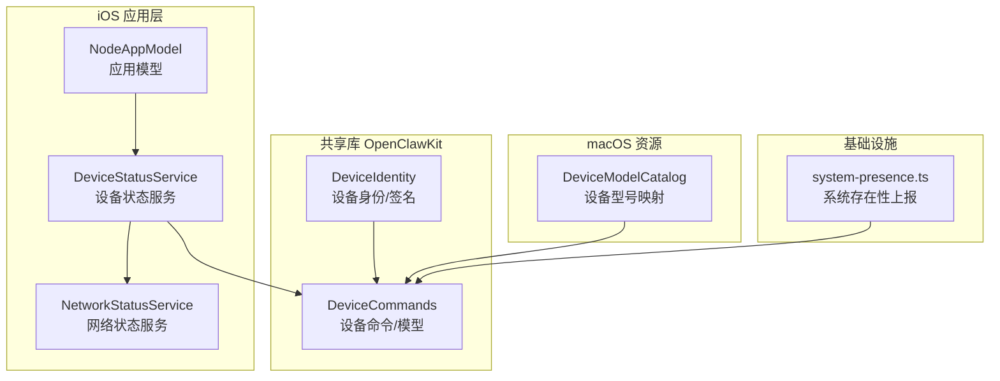
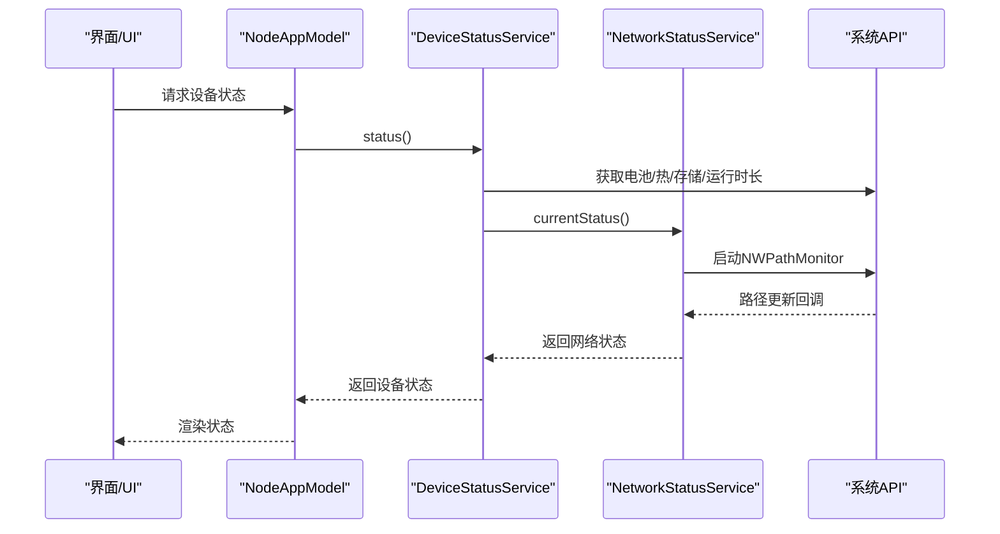
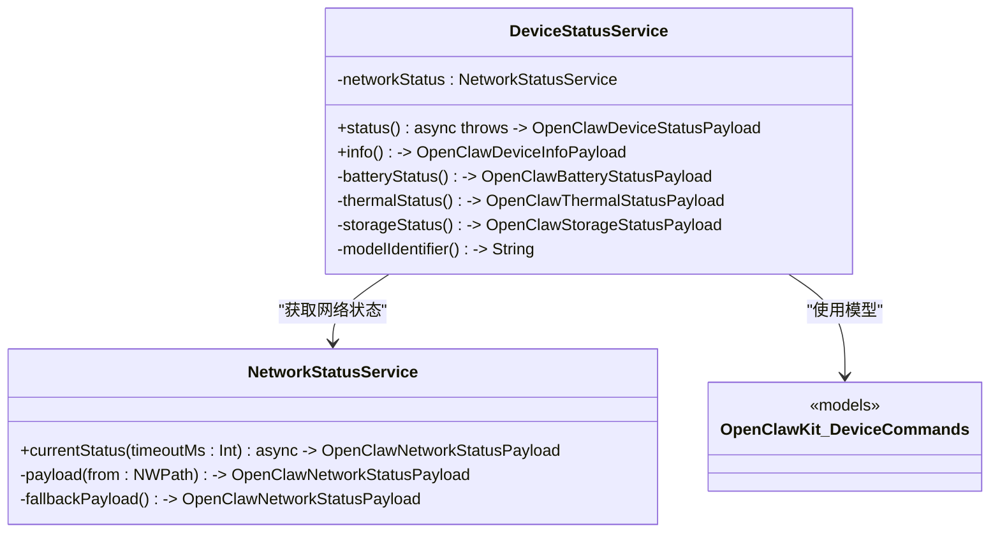
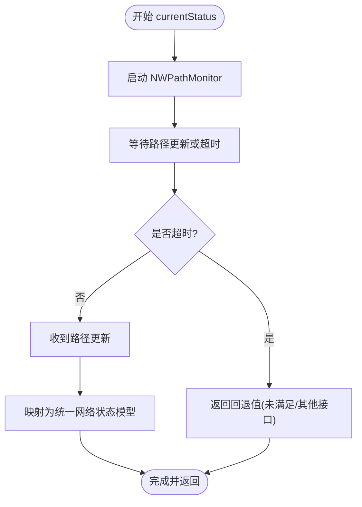
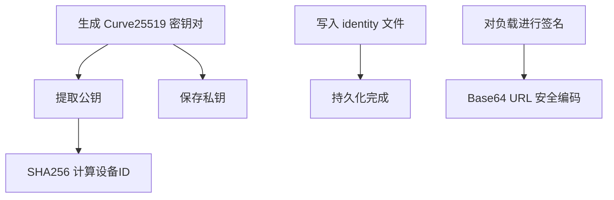
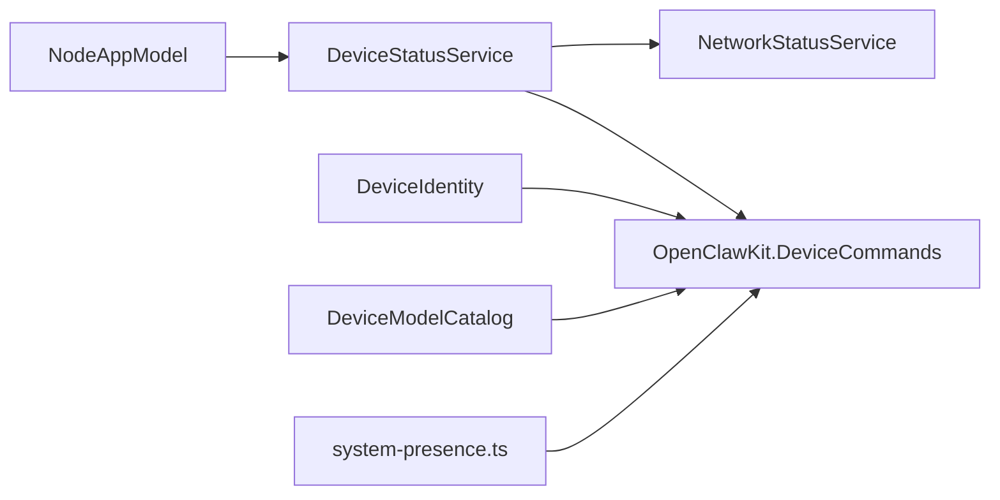

# 设备管理

<cite>
**本文引用的文件**
- [apps/ios/Sources/Device/DeviceStatusService.swift](file://apps/ios/Sources/Device/DeviceStatusService.swift)
- [apps/ios/Sources/Device/NetworkStatusService.swift](file://apps/ios/Sources/Device/NetworkStatusService.swift)
- [apps/shared/OpenClawKit/Sources/OpenClawKit/DeviceCommands.swift](file://apps/shared/OpenClawKit/Sources/OpenClawKit/DeviceCommands.swift)
- [apps/shared/OpenClawKit/Sources/OpenClawKit/DeviceIdentity.swift](file://apps/shared/OpenClawKit/Sources/OpenClawKit/DeviceIdentity.swift)
- [apps/ios/Sources/Model/NodeAppModel.swift](file://apps/ios/Sources/Model/NodeAppModel.swift)
- [apps/macos/Sources/OpenClaw/DeviceModelCatalog.swift](file://apps/macos/Sources/OpenClaw/DeviceModelCatalog.swift)
- [src/infra/system-presence.ts](file://src/infra/system-presence.ts)
</cite>

## 目录

1. [简介](#简介)
2. [项目结构](#项目结构)
3. [核心组件](#核心组件)
4. [架构总览](#架构总览)
5. [组件详解](#组件详解)
6. [依赖关系分析](#依赖关系分析)
7. [性能考量](#性能考量)
8. [故障排查指南](#故障排查指南)
9. [结论](#结论)
10. [附录](#附录)

## 简介

本技术文档聚焦于 OpenClaw 在 iOS 平台上的设备管理能力，涵盖以下关键主题：

- 设备状态监控：电池、热状态、存储与网络路径状态的采集与封装
- 网络连接管理：基于 Network.framework 的路径监控与状态回退策略
- 设备标识管理：设备唯一标识生成、密钥对生成与持久化
- 能力检测与状态同步：在应用生命周期中的状态更新与健康检查
- 性能监控与故障诊断：超时控制、并发安全、错误回退与日志定位

## 项目结构

iOS 设备管理相关代码主要分布在以下模块：

- 应用层（iOS）：设备状态服务与网络状态服务
- 共享库（OpenClawKit）：设备命令与数据模型、设备身份与签名
- 模型与视图（iOS）：应用模型中注入设备状态服务并驱动 UI 状态
- 资源映射（macOS）：设备型号到人类可读名称的映射（用于跨平台展示）
- 基础设施（Node 层）：系统存在性上报字段（含设备标识）

图表来源

- [apps/ios/Sources/Device/DeviceStatusService.swift](file://apps/ios/Sources/Device/DeviceStatusService.swift#L1-L88)
- [apps/ios/Sources/Device/NetworkStatusService.swift](file://apps/ios/Sources/Device/NetworkStatusService.swift#L1-L70)
- [apps/shared/OpenClawKit/Sources/OpenClawKit/DeviceCommands.swift](file://apps/shared/OpenClawKit/Sources/OpenClawKit/DeviceCommands.swift#L1-L135)
- [apps/shared/OpenClawKit/Sources/OpenClawKit/DeviceIdentity.swift](file://apps/shared/OpenClawKit/Sources/OpenClawKit/DeviceIdentity.swift#L1-L113)
- [apps/ios/Sources/Model/NodeAppModel.swift](file://apps/ios/Sources/Model/NodeAppModel.swift#L125-L186)
- [apps/macos/Sources/OpenClaw/DeviceModelCatalog.swift](file://apps/macos/Sources/OpenClaw/DeviceModelCatalog.swift#L97-L172)
- [src/infra/system-presence.ts](file://src/infra/system-presence.ts#L175-L207)

章节来源

- [apps/ios/Sources/Device/DeviceStatusService.swift](file://apps/ios/Sources/Device/DeviceStatusService.swift#L1-L88)
- [apps/ios/Sources/Device/NetworkStatusService.swift](file://apps/ios/Sources/Device/NetworkStatusService.swift#L1-L70)
- [apps/shared/OpenClawKit/Sources/OpenClawKit/DeviceCommands.swift](file://apps/shared/OpenClawKit/Sources/OpenClawKit/DeviceCommands.swift#L1-L135)
- [apps/shared/OpenClawKit/Sources/OpenClawKit/DeviceIdentity.swift](file://apps/shared/OpenClawKit/Sources/OpenClawKit/DeviceIdentity.swift#L1-L113)
- [apps/ios/Sources/Model/NodeAppModel.swift](file://apps/ios/Sources/Model/NodeAppModel.swift#L125-L186)
- [apps/macos/Sources/OpenClaw/DeviceModelCatalog.swift](file://apps/macos/Sources/OpenClaw/DeviceModelCatalog.swift#L97-L172)
- [src/infra/system-presence.ts](file://src/infra/system-presence.ts#L175-L207)

## 核心组件

- 设备状态服务（DeviceStatusService）
  - 职责：聚合电池、热状态、存储、网络与系统运行时长等设备状态；提供设备信息（品牌、系统版本、应用版本、语言等）
  - 关键点：异步获取网络状态；使用 UIDevice、ProcessInfo、FileManager 等系统 API
- 网络状态服务（NetworkStatusService）
  - 职责：通过 NWPathMonitor 监听网络路径变化；支持超时回退策略；将系统路径转换为统一的网络状态模型
  - 关键点：线程安全标记避免重复回调；超时后返回“未满足”回退值
- 设备命令与模型（OpenClawKit.DeviceCommands）
  - 职责：定义设备命令枚举与设备状态/信息的数据模型（电池、热、存储、网络、设备信息）
- 设备身份与签名（OpenClawKit.DeviceIdentity）
  - 职责：生成 Curve25519 密钥对，计算设备 ID（SHA256），持久化保存；提供签名与公钥编码工具
- 应用模型集成（NodeAppModel）
  - 职责：在应用初始化时注入设备状态服务；在前台/后台切换时进行健康检查与重连策略
- 设备型号映射（macOS DeviceModelCatalog）
  - 职责：加载 iOS/macOS 设备标识到名称的映射资源，用于跨平台展示
- 系统存在性上报（system-presence.ts）
  - 职责：系统存在性消息包含设备标识、平台、型号等字段，便于后端识别设备

章节来源

- [apps/ios/Sources/Device/DeviceStatusService.swift](file://apps/ios/Sources/Device/DeviceStatusService.swift#L1-L88)
- [apps/ios/Sources/Device/NetworkStatusService.swift](file://apps/ios/Sources/Device/NetworkStatusService.swift#L1-L70)
- [apps/shared/OpenClawKit/Sources/OpenClawKit/DeviceCommands.swift](file://apps/shared/OpenClawKit/Sources/OpenClawKit/DeviceCommands.swift#L1-L135)
- [apps/shared/OpenClawKit/Sources/OpenClawKit/DeviceIdentity.swift](file://apps/shared/OpenClawKit/Sources/OpenClawKit/DeviceIdentity.swift#L1-L113)
- [apps/ios/Sources/Model/NodeAppModel.swift](file://apps/ios/Sources/Model/NodeAppModel.swift#L125-L186)
- [apps/macos/Sources/OpenClaw/DeviceModelCatalog.swift](file://apps/macos/Sources/OpenClaw/DeviceModelCatalog.swift#L97-L172)
- [src/infra/system-presence.ts](file://src/infra/system-presence.ts#L175-L207)

## 架构总览

下图展示了 iOS 设备管理在应用内的调用链路与数据流：

图表来源

- [apps/ios/Sources/Model/NodeAppModel.swift](file://apps/ios/Sources/Model/NodeAppModel.swift#L125-L186)
- [apps/ios/Sources/Device/DeviceStatusService.swift](file://apps/ios/Sources/Device/DeviceStatusService.swift#L12-L25)
- [apps/ios/Sources/Device/NetworkStatusService.swift](file://apps/ios/Sources/Device/NetworkStatusService.swift#L6-L26)

## 组件详解

### 设备状态服务（DeviceStatusService）

- 功能要点
  - 聚合多维状态：电池电量与状态、低功耗模式；热状态；存储总量/可用/已用；网络路径状态、是否昂贵/受限及接口类型；系统运行时长
  - 设备信息：设备名、模型标识、系统名/版本、应用版本/构建号、语言区域
  - 网络状态异步获取：通过 NetworkStatusService 获取一次当前网络状态
- 数据模型
  - 使用 OpenClawKit 中的设备状态与设备信息模型进行封装
- 并发与安全
  - 网络状态服务实现为 Sendable；内部通过状态标记避免重复完成回调

图表来源

- [apps/ios/Sources/Device/DeviceStatusService.swift](file://apps/ios/Sources/Device/DeviceStatusService.swift#L5-L88)
- [apps/ios/Sources/Device/NetworkStatusService.swift](file://apps/ios/Sources/Device/NetworkStatusService.swift#L5-L70)
- [apps/shared/OpenClawKit/Sources/OpenClawKit/DeviceCommands.swift](file://apps/shared/OpenClawKit/Sources/OpenClawKit/DeviceCommands.swift#L35-L135)

章节来源

- [apps/ios/Sources/Device/DeviceStatusService.swift](file://apps/ios/Sources/Device/DeviceStatusService.swift#L1-L88)
- [apps/shared/OpenClawKit/Sources/OpenClawKit/DeviceCommands.swift](file://apps/shared/OpenClawKit/Sources/OpenClawKit/DeviceCommands.swift#L1-L135)

### 网络状态服务（NetworkStatusService）

- 功能要点
  - 使用 NWPathMonitor 监听网络路径变化；在首次回调或超时后完成任务
  - 将系统路径状态映射为统一的网络状态模型（满足/未满足/需要连接），并标注昂贵/受限与接口类型
  - 超时回退：若在指定时间内无回调，则返回“未满足”的回退值
- 并发与安全
  - 使用内部状态对象与锁确保仅完成一次；使用独立队列处理回调

图表来源

- [apps/ios/Sources/Device/NetworkStatusService.swift](file://apps/ios/Sources/Device/NetworkStatusService.swift#L6-L26)
- [apps/ios/Sources/Device/NetworkStatusService.swift](file://apps/ios/Sources/Device/NetworkStatusService.swift#L28-L55)

章节来源

- [apps/ios/Sources/Device/NetworkStatusService.swift](file://apps/ios/Sources/Device/NetworkStatusService.swift#L1-L70)

### 设备命令与模型（OpenClawKit.DeviceCommands）

- 定义
  - 设备命令：设备状态查询、设备信息查询
  - 设备状态模型：电池、热、存储、网络、运行时长
  - 设备信息模型：设备名、模型标识、系统信息、应用信息、语言
- 作用
  - 作为 iOS 与后端通信的数据契约，保证跨平台一致性

章节来源

- [apps/shared/OpenClawKit/Sources/OpenClawKit/DeviceCommands.swift](file://apps/shared/OpenClawKit/Sources/OpenClawKit/DeviceCommands.swift#L1-L135)

### 设备身份与签名（OpenClawKit.DeviceIdentity）

- 生成与持久化
  - 使用 Curve25519 生成密钥对；公钥经 SHA256 得到设备 ID；私钥用于对负载签名
  - 身份信息保存在应用支持目录下的固定路径，支持自定义状态目录环境变量
- 签名与编码
  - 提供对任意字符串负载进行签名的方法；公钥以 Base64 URL 安全格式导出

图表来源

- [apps/shared/OpenClawKit/Sources/OpenClawKit/DeviceIdentity.swift](file://apps/shared/OpenClawKit/Sources/OpenClawKit/DeviceIdentity.swift#L67-L86)
- [apps/shared/OpenClawKit/Sources/OpenClawKit/DeviceIdentity.swift](file://apps/shared/OpenClawKit/Sources/OpenClawKit/DeviceIdentity.swift#L93-L111)

章节来源

- [apps/shared/OpenClawKit/Sources/OpenClawKit/DeviceIdentity.swift](file://apps/shared/OpenClawKit/Sources/OpenClawKit/DeviceIdentity.swift#L1-L113)

### 应用模型集成（NodeAppModel）

- 注入设备状态服务：在构造函数中注入默认实现
- 生命周期联动
  - 前台/后台切换时调整网络健康监测与重连策略
  - 后台时间较长时进行健康探测，必要时断开并重建连接，避免“已连接但失效”的状态

章节来源

- [apps/ios/Sources/Model/NodeAppModel.swift](file://apps/ios/Sources/Model/NodeAppModel.swift#L125-L186)
- [apps/ios/Sources/Model/NodeAppModel.swift](file://apps/ios/Sources/Model/NodeAppModel.swift#L266-L323)

### 设备型号映射（macOS DeviceModelCatalog）

- 作用：加载 iOS/macOS 设备标识到人类可读名称的映射资源，用于跨平台展示与呈现
- 实现：从主包或模块包查找资源，解码 JSON 并合并映射

章节来源

- [apps/macos/Sources/OpenClaw/DeviceModelCatalog.swift](file://apps/macos/Sources/OpenClaw/DeviceModelCatalog.swift#L97-L172)

### 系统存在性上报（system-presence.ts）

- 字段：包含设备标识、实例标识、主机、IP、版本、平台、设备家族、模型标识等
- 用途：后端通过系统存在性消息识别设备并进行路由与权限管理

章节来源

- [src/infra/system-presence.ts](file://src/infra/system-presence.ts#L175-L207)

## 依赖关系分析

- 组件耦合
  - DeviceStatusService 依赖 NetworkStatusService 与系统 API；通过 OpenClawKit 的模型进行数据交换
  - NodeAppModel 注入 DeviceStatusService，形成上层 UI 与底层服务的桥接
- 外部依赖
  - iOS 系统 API：UIDevice、ProcessInfo、FileManager、NWPathMonitor
  - 加密库：CryptoKit（Curve25519）
- 可能的循环依赖
  - 当前结构清晰，服务间单向依赖，未见循环

图表来源

- [apps/ios/Sources/Model/NodeAppModel.swift](file://apps/ios/Sources/Model/NodeAppModel.swift#L125-L186)
- [apps/ios/Sources/Device/DeviceStatusService.swift](file://apps/ios/Sources/Device/DeviceStatusService.swift#L5-L10)
- [apps/ios/Sources/Device/NetworkStatusService.swift](file://apps/ios/Sources/Device/NetworkStatusService.swift#L1-L4)
- [apps/shared/OpenClawKit/Sources/OpenClawKit/DeviceCommands.swift](file://apps/shared/OpenClawKit/Sources/OpenClawKit/DeviceCommands.swift#L1-L135)
- [apps/shared/OpenClawKit/Sources/OpenClawKit/DeviceIdentity.swift](file://apps/shared/OpenClawKit/Sources/OpenClawKit/DeviceIdentity.swift#L1-L113)
- [apps/macos/Sources/OpenClaw/DeviceModelCatalog.swift](file://apps/macos/Sources/OpenClaw/DeviceModelCatalog.swift#L97-L172)
- [src/infra/system-presence.ts](file://src/infra/system-presence.ts#L175-L207)

## 性能考量

- 网络状态监听
  - 使用一次性监控器并在首次回调或超时后取消，避免持续占用系统资源
  - 超时回退策略确保 UI 不会无限等待
- 并发与线程
  - 回调在独立队列执行；内部状态使用锁保证仅完成一次，降低竞态风险
- I/O 与加密
  - 身份文件写入采用原子写；签名与编码为轻量操作，建议在后台队列执行
- 生命周期优化
  - 应用后台时停止健康监测；前台恢复时按需重建连接，减少无效握手

[本节为通用性能建议，不直接分析具体文件]

## 故障排查指南

- 网络状态异常
  - 现象：长时间无网络状态返回或始终显示“未满足”
  - 排查：确认超时参数设置合理；检查系统网络权限；验证路径监控是否被提前取消
- 电池/热/存储状态为空
  - 现象：部分指标缺失或为默认值
  - 排查：确认系统 API 返回值范围；检查低功耗模式与监控开关
- 设备身份文件无法写入
  - 现象：设备 ID 无法持久化或每次重启变化
  - 排查：检查状态目录权限与磁盘空间；确认写入路径与文件夹创建逻辑
- 前台/后台导致连接异常
  - 现象：后台断开后前台仍显示“已连接但失效”
  - 排查：查看健康探测逻辑与重连策略；确认后台挂起后的握手重建流程

章节来源

- [apps/ios/Sources/Device/NetworkStatusService.swift](file://apps/ios/Sources/Device/NetworkStatusService.swift#L6-L26)
- [apps/ios/Sources/Device/DeviceStatusService.swift](file://apps/ios/Sources/Device/DeviceStatusService.swift#L42-L76)
- [apps/shared/OpenClawKit/Sources/OpenClawKit/DeviceIdentity.swift](file://apps/shared/OpenClawKit/Sources/OpenClawKit/DeviceIdentity.swift#L93-L111)
- [apps/ios/Sources/Model/NodeAppModel.swift](file://apps/ios/Sources/Model/NodeAppModel.swift#L291-L323)

## 结论

OpenClaw 的 iOS 设备管理通过清晰的服务分层与统一的数据模型，实现了对设备状态、网络连接与设备身份的可靠管理。DeviceStatusService 与 NetworkStatusService 分别承担状态聚合与网络监听职责，配合 NodeAppModel 的生命周期联动，确保了在不同场景下的稳定性与性能。同时，DeviceIdentity 提供了安全的设备标识与签名能力，为设备配对与认证提供了基础。

[本节为总结性内容，不直接分析具体文件]

## 附录

- 相关数据模型字段参考
  - 设备命令：设备状态查询、设备信息查询
  - 设备状态：电池（电量、状态、低功耗）、热状态、存储（总量/可用/已用）、网络（路径状态、昂贵/受限、接口类型）、运行时长
  - 设备信息：设备名、模型标识、系统名/版本、应用版本/构建号、语言
- 系统存在性上报字段
  - 包含设备标识、实例标识、主机、IP、版本、平台、设备家族、模型标识等

章节来源

- [apps/shared/OpenClawKit/Sources/OpenClawKit/DeviceCommands.swift](file://apps/shared/OpenClawKit/Sources/OpenClawKit/DeviceCommands.swift#L1-L135)
- [src/infra/system-presence.ts](file://src/infra/system-presence.ts#L175-L207)
