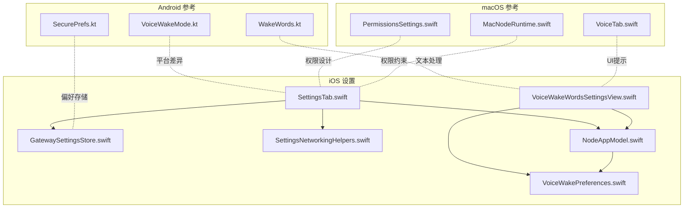
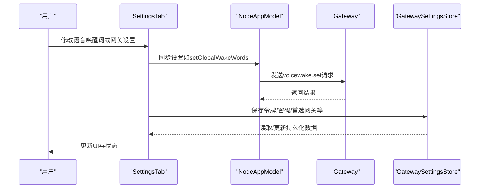
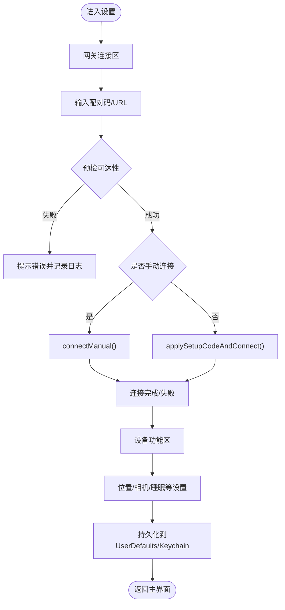
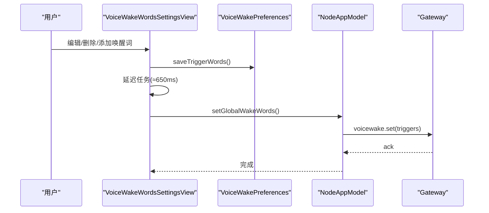
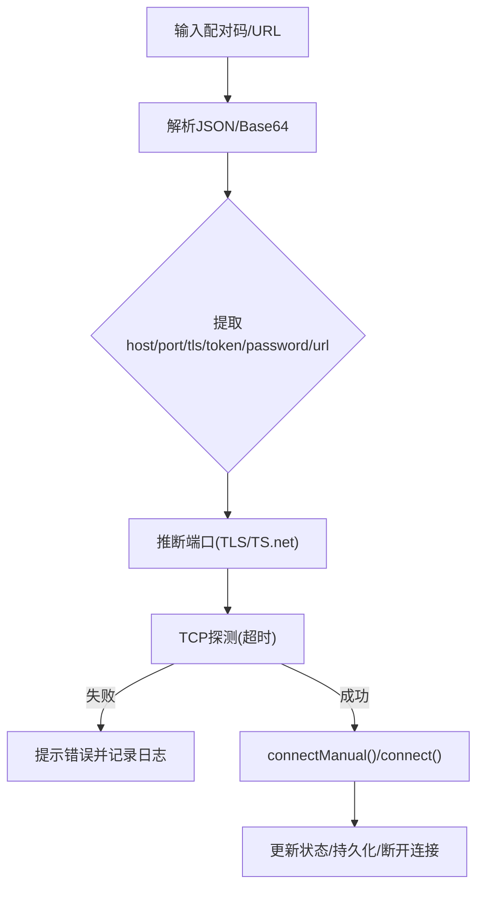
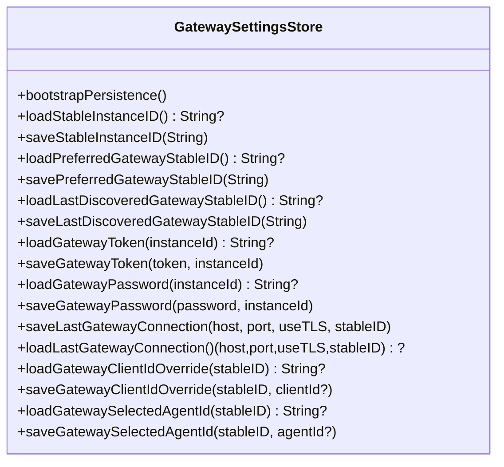
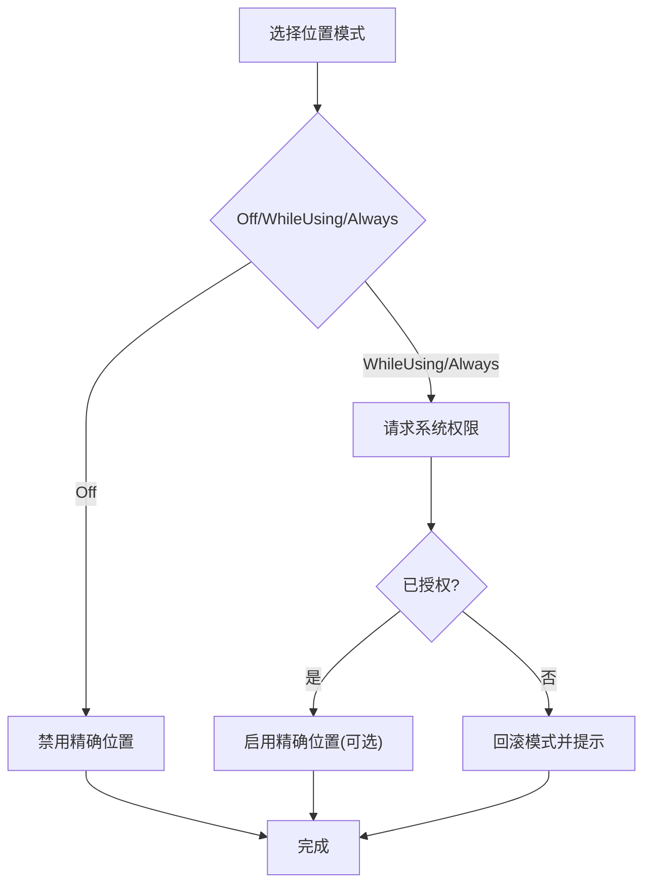
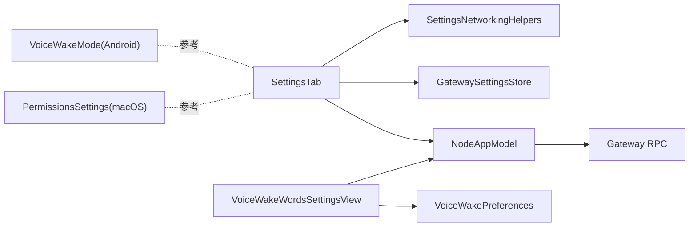

# 设置配置

<cite>
**本文引用的文件**
- [SettingsTab.swift](file://apps/ios/Sources/Settings/SettingsTab.swift)
- [VoiceWakeWordsSettingsView.swift](file://apps/ios/Sources/Settings/VoiceWakeWordsSettingsView.swift)
- [GatewaySettingsStore.swift](file://apps/ios/Sources/Gateway/GatewaySettingsStore.swift)
- [SettingsNetworkingHelpers.swift](file://apps/ios/Sources/Settings/SettingsNetworkingHelpers.swift)
- [NodeAppModel.swift](file://apps/ios/Sources/Model/NodeAppModel.swift)
- [VoiceWakePreferences.swift](file://apps/ios/Sources/Voice/VoiceWakePreferences.swift)
- [VoiceWakeMode.kt](file://apps/android/app/src/main/java/ai/openclaw/android/VoiceWakeMode.kt)
- [SecurePrefs.kt](file://apps/android/app/src/main/java/ai/openclaw/android/SecurePrefs.kt)
- [WakeWords.kt](file://apps/android/app/src/main/java/ai/openclaw/android/WakeWords.kt)
- [voicewake.md](file://docs/nodes/voicewake.md)
- [voicewake.md](file://docs/zh-CN/nodes/voicewake.md)
- [PermissionsSettings.swift](file://apps/macos/Sources/OpenClaw/PermissionsSettings.swift)
- [VoiceTab.swift](file://apps/ios/Sources/Voice/VoiceTab.swift)
- [MacNodeRuntime.swift](file://apps/macos/Sources/OpenClaw/NodeMode/MacNodeRuntime.swift)
</cite>

## 目录

1. [简介](#简介)
2. [项目结构](#项目结构)
3. [核心组件](#核心组件)
4. [架构总览](#架构总览)
5. [组件详解](#组件详解)
6. [依赖关系分析](#依赖关系分析)
7. [性能与可用性考量](#性能与可用性考量)
8. [故障排除指南](#故障排除指南)
9. [结论](#结论)

## 简介

本文件面向OpenClaw iOS设置配置功能，系统化阐述设置界面设计、网络配置与功能开关管理，记录SettingsTab的组织结构、配置项管理与数据持久化策略，并覆盖iOS设置UI设计、网络参数配置、语音唤醒设置、用户体验设计、配置验证与故障排除。文档同时对比Android平台的语音唤醒模式与偏好存储，帮助读者理解跨平台一致性与差异。

## 项目结构

iOS设置相关代码主要位于apps/ios/Sources/Settings与apps/ios/Sources/Gateway、apps/ios/Sources/Voice、apps/ios/Sources/Model等目录；macOS端提供了权限与语音唤醒设置的参考实现；Android端提供了语音唤醒模式与偏好存储的参考实现。

**图表来源**

- [SettingsTab.swift](file://apps/ios/Sources/Settings/SettingsTab.swift#L1-L120)
- [VoiceWakeWordsSettingsView.swift](file://apps/ios/Sources/Settings/VoiceWakeWordsSettingsView.swift#L1-L60)
- [GatewaySettingsStore.swift](file://apps/ios/Sources/Gateway/GatewaySettingsStore.swift#L1-L60)
- [SettingsNetworkingHelpers.swift](file://apps/ios/Sources/Settings/SettingsNetworkingHelpers.swift#L1-L41)
- [NodeAppModel.swift](file://apps/ios/Sources/Model/NodeAppModel.swift#L440-L470)
- [VoiceWakePreferences.swift](file://apps/ios/Sources/Voice/VoiceWakePreferences.swift#L1-L45)
- [VoiceWakeMode.kt](file://apps/android/app/src/main/java/ai/openclaw/android/VoiceWakeMode.kt#L1-L14)
- [SecurePrefs.kt](file://apps/android/app/src/main/java/ai/openclaw/android/SecurePrefs.kt#L232-L274)
- [WakeWords.kt](file://apps/android/app/src/main/java/ai/openclaw/android/WakeWords.kt#L1-L21)
- [PermissionsSettings.swift](file://apps/macos/Sources/OpenClaw/PermissionsSettings.swift#L1-L101)
- [VoiceTab.swift](file://apps/ios/Sources/Voice/VoiceTab.swift#L21-L46)
- [MacNodeRuntime.swift](file://apps/macos/Sources/OpenClaw/NodeMode/MacNodeRuntime.swift#L232-L264)

**章节来源**

- [SettingsTab.swift](file://apps/ios/Sources/Settings/SettingsTab.swift#L1-L120)
- [GatewaySettingsStore.swift](file://apps/ios/Sources/Gateway/GatewaySettingsStore.swift#L1-L60)

## 核心组件

- SettingsTab：iOS设置主界面，负责网关连接、设备功能开关、设备信息展示与调试信息输出。
- VoiceWakeWordsSettingsView：语音唤醒词编辑界面，支持增删改、重置默认值、延迟同步至网关。
- GatewaySettingsStore：网关配置持久化工具，使用Keychain与UserDefaults组合保存实例ID、首选网关、最后连接信息、令牌与密码等。
- SettingsNetworkingHelpers：网络辅助工具，解析主机与端口、生成HTTP URL字符串。
- NodeAppModel：应用状态与业务逻辑入口，负责将设置变更同步到网关（如语音唤醒词）、维护网关健康监控与事件订阅。
- VoiceWakePreferences：语音唤醒词偏好存储与清洗，定义默认唤醒词、最大数量与长度限制、显示格式等。

**章节来源**

- [SettingsTab.swift](file://apps/ios/Sources/Settings/SettingsTab.swift#L8-L40)
- [VoiceWakeWordsSettingsView.swift](file://apps/ios/Sources/Settings/VoiceWakeWordsSettingsView.swift#L4-L20)
- [GatewaySettingsStore.swift](file://apps/ios/Sources/Gateway/GatewaySettingsStore.swift#L4-L31)
- [SettingsNetworkingHelpers.swift](file://apps/ios/Sources/Settings/SettingsNetworkingHelpers.swift#L3-L40)
- [NodeAppModel.swift](file://apps/ios/Sources/Model/NodeAppModel.swift#L452-L468)
- [VoiceWakePreferences.swift](file://apps/ios/Sources/Voice/VoiceWakePreferences.swift#L3-L20)

## 架构总览

iOS设置配置采用“视图-模型-持久化-网关”的分层架构：

- 视图层：SwiftUI视图负责用户交互与展示（SettingsTab、VoiceWakeWordsSettingsView）。
- 模型层：NodeAppModel协调网关通信、健康检查、事件订阅与设置同步。
- 持久化层：GatewaySettingsStore统一管理Keychain与UserDefaults，确保敏感信息安全与非敏感信息便捷访问。
- 网络层：SettingsNetworkingHelpers提供地址解析与URL构造；SettingsTab负责连接流程与连通性探测。

**图表来源**

- [SettingsTab.swift](file://apps/ios/Sources/Settings/SettingsTab.swift#L319-L344)
- [NodeAppModel.swift](file://apps/ios/Sources/Model/NodeAppModel.swift#L452-L468)
- [GatewaySettingsStore.swift](file://apps/ios/Sources/Gateway/GatewaySettingsStore.swift#L88-L115)

## 组件详解

### SettingsTab：设置界面组织与控制流

- 网关连接区：提供“配对码连接”“手动连接”“自动连接”“发现日志”等能力；支持复制地址、查看服务器名与远程地址、断开连接。
- 设备功能区：语音唤醒、Talk模式、是否显示Talk按钮、相机授权、位置权限、精确位置、防止休眠等。
- 设备信息区：名称、实例ID、本地IP、平台版本、机型等；支持复制IP。
- 数据绑定：大量@AppStorage键值与状态变量联动，配合onChange回调即时持久化与权限申请。
- 连接流程：解析配对码/URL→预检可达性→按需TLS端口推断→发起连接→更新状态与UI。
- 网络辅助：解析主机端口、构造HTTP URL、连通性探测（NWConnection）。

**图表来源**

- [SettingsTab.swift](file://apps/ios/Sources/Settings/SettingsTab.swift#L44-L378)
- [SettingsNetworkingHelpers.swift](file://apps/ios/Sources/Settings/SettingsNetworkingHelpers.swift#L8-L40)

**章节来源**

- [SettingsTab.swift](file://apps/ios/Sources/Settings/SettingsTab.swift#L44-L378)
- [SettingsNetworkingHelpers.swift](file://apps/ios/Sources/Settings/SettingsNetworkingHelpers.swift#L8-L40)

### 语音唤醒设置：编辑、同步与体验

- 编辑界面：支持逐行编辑唤醒词、删除、添加、重置默认值；失去焦点或定时触发提交。
- 提交策略：本地清洗（去空、截断、上限）→延迟合并（约650ms）→异步同步到网关（voicewake.set）。
- 显示格式：以逗号分隔的展示字符串，若为空则回退默认值。
- iOS与Android差异：iOS侧通过NodeAppModel调用网关方法同步；Android侧通过SecurePrefs与WakeWords处理模式与唤醒词。

**图表来源**

- [VoiceWakeWordsSettingsView.swift](file://apps/ios/Sources/Settings/VoiceWakeWordsSettingsView.swift#L88-L98)
- [VoiceWakePreferences.swift](file://apps/ios/Sources/Voice/VoiceWakePreferences.swift#L23-L43)
- [NodeAppModel.swift](file://apps/ios/Sources/Model/NodeAppModel.swift#L452-L468)

**章节来源**

- [VoiceWakeWordsSettingsView.swift](file://apps/ios/Sources/Settings/VoiceWakeWordsSettingsView.swift#L4-L62)
- [VoiceWakePreferences.swift](file://apps/ios/Sources/Voice/VoiceWakePreferences.swift#L23-L43)
- [NodeAppModel.swift](file://apps/ios/Sources/Model/NodeAppModel.swift#L452-L468)
- [voicewake.md](file://docs/nodes/voicewake.md#L62-L66)
- [voicewake.md](file://docs/zh-CN/nodes/voicewake.md#L64-L73)

### 网络配置与连接流程

- 配对码/URL解析：支持JSON负载或Base64解码，提取host/port/tls/token/password/url等字段。
- 端口推断：若未指定端口且为TLS且主机为特定后缀，则推断为443；否则默认18789。
- 连通性探测：使用NWConnection进行TCP探测，超时控制，失败时记录诊断日志。
- 手动连接：校验主机与端口有效性，支持TLS开关，连接后更新状态与持久化。
- 发现日志：可开启/关闭发现调试日志，并提供查看页面。

**图表来源**

- [SettingsTab.swift](file://apps/ios/Sources/Settings/SettingsTab.swift#L599-L724)
- [SettingsTab.swift](file://apps/ios/Sources/Settings/SettingsTab.swift#L789-L810)
- [SettingsNetworkingHelpers.swift](file://apps/ios/Sources/Settings/SettingsNetworkingHelpers.swift#L8-L40)

**章节来源**

- [SettingsTab.swift](file://apps/ios/Sources/Settings/SettingsTab.swift#L599-L724)
- [SettingsTab.swift](file://apps/ios/Sources/Settings/SettingsTab.swift#L789-L810)
- [SettingsNetworkingHelpers.swift](file://apps/ios/Sources/Settings/SettingsNetworkingHelpers.swift#L8-L40)

### 数据持久化：Keychain与UserDefaults

- Keychain：用于保存实例ID、首选网关稳定ID、最后发现的网关稳定ID、网关令牌、网关密码、客户端ID覆盖、选中代理ID等。
- UserDefaults：用于保存非敏感设置（如自动连接、发现调试日志、手动网关开关与端口等）。
- 启动引导：确保Keychain与UserDefaults之间的一致性，避免缺失或不一致。

**图表来源**

- [GatewaySettingsStore.swift](file://apps/ios/Sources/Gateway/GatewaySettingsStore.swift#L4-L249)

**章节来源**

- [GatewaySettingsStore.swift](file://apps/ios/Sources/Gateway/GatewaySettingsStore.swift#L27-L249)

### 权限与用户体验设计

- 位置权限：提供“关闭/使用期间/始终”三种模式；“始终”需要系统权限，可能触发系统设置弹窗；精确位置开关随模式禁用/启用。
- 相机授权：允许网关在前台请求短时拍照/视频片段。
- 防止休眠：保持屏幕常亮，提升交互连续性。
- 语音提示：VoiceTab根据当前激活的唤醒词给出简要使用提示。

**图表来源**

- [SettingsTab.swift](file://apps/ios/Sources/Settings/SettingsTab.swift#L364-L377)
- [PermissionsSettings.swift](file://apps/macos/Sources/OpenClaw/PermissionsSettings.swift#L33-L97)
- [VoiceTab.swift](file://apps/ios/Sources/Voice/VoiceTab.swift#L21-L35)

**章节来源**

- [SettingsTab.swift](file://apps/ios/Sources/Settings/SettingsTab.swift#L254-L272)
- [PermissionsSettings.swift](file://apps/macos/Sources/OpenClaw/PermissionsSettings.swift#L33-L97)
- [VoiceTab.swift](file://apps/ios/Sources/Voice/VoiceTab.swift#L21-L35)

### Android参考：语音唤醒模式与偏好

- VoiceWakeMode：枚举“关闭/前台/总是”，支持从原始字符串解析，默认为前台。
- SecurePrefs：保存/加载语音唤醒模式、Talk开关、唤醒词列表等。
- WakeWords：解析、清洗与限制唤醒词数量与长度。

**章节来源**

- [VoiceWakeMode.kt](file://apps/android/app/src/main/java/ai/openclaw/android/VoiceWakeMode.kt#L1-L14)
- [SecurePrefs.kt](file://apps/android/app/src/main/java/ai/openclaw/android/SecurePrefs.kt#L232-L274)
- [WakeWords.kt](file://apps/android/app/src/main/java/ai/openclaw/android/WakeWords.kt#L1-L21)

## 依赖关系分析

- SettingsTab依赖NodeAppModel进行网关操作与状态查询，依赖GatewaySettingsStore进行持久化，依赖SettingsNetworkingHelpers进行网络解析。
- VoiceWakeWordsSettingsView依赖VoiceWakePreferences进行本地存储与清洗，并通过NodeAppModel同步到网关。
- NodeAppModel依赖Gateway RPC接口进行voicewake.set/get与事件订阅，维护网关健康监控。
- macOS与Android提供权限与语音唤醒的参考实现，便于跨平台一致性评估。

**图表来源**

- [SettingsTab.swift](file://apps/ios/Sources/Settings/SettingsTab.swift#L8-L12)
- [VoiceWakeWordsSettingsView.swift](file://apps/ios/Sources/Settings/VoiceWakeWordsSettingsView.swift#L4-L6)
- [NodeAppModel.swift](file://apps/ios/Sources/Model/NodeAppModel.swift#L452-L468)
- [GatewaySettingsStore.swift](file://apps/ios/Sources/Gateway/GatewaySettingsStore.swift#L4-L31)
- [PermissionsSettings.swift](file://apps/macos/Sources/OpenClaw/PermissionsSettings.swift#L6-L31)
- [VoiceWakeMode.kt](file://apps/android/app/src/main/java/ai/openclaw/android/VoiceWakeMode.kt#L3-L14)

**章节来源**

- [SettingsTab.swift](file://apps/ios/Sources/Settings/SettingsTab.swift#L8-L12)
- [VoiceWakeWordsSettingsView.swift](file://apps/ios/Sources/Settings/VoiceWakeWordsSettingsView.swift#L4-L6)
- [NodeAppModel.swift](file://apps/ios/Sources/Model/NodeAppModel.swift#L452-L468)
- [GatewaySettingsStore.swift](file://apps/ios/Sources/Gateway/GatewaySettingsStore.swift#L4-L31)
- [PermissionsSettings.swift](file://apps/macos/Sources/OpenClaw/PermissionsSettings.swift#L6-L31)
- [VoiceWakeMode.kt](file://apps/android/app/src/main/java/ai/openclaw/android/VoiceWakeMode.kt#L3-L14)

## 性能与可用性考量

- 延迟同步：语音唤醒词提交采用延迟合并（约650ms），减少频繁RPC调用，提升交互流畅度。
- 连接预检：TCP探测与端口推断降低无效连接尝试，缩短失败反馈时间。
- 权限申请：位置权限变更时异步申请，失败时回滚，避免状态不一致。
- 日志裁剪：网关诊断日志定期裁剪，避免无限增长影响性能。

[本节为通用建议，无需具体文件分析]

## 故障排除指南

- 无法连接网关
  - 检查Tailscale状态与可达性；若目标为tailnet域名/IP，需确保已连接。
  - 使用“发现日志”定位问题；必要时切换“手动连接”并核对主机、端口、TLS。
  - 参考友好消息提示：配对要求、设备签名过期/无效、连接超时、未授权角色等。
- 语音唤醒不同步
  - 确认已连接网关且具备相应权限；检查NodeAppModel的voicewake.set返回。
  - 若网关侧有变更，NodeAppModel会订阅事件并刷新本地存储。
- 位置权限异常
  - “始终”模式需系统授权；若被拒绝，回滚到上一模式并提示前往系统设置。
  - macOS端对后台位置有更严格约束，需遵循Always模式。
- Android模式差异
  - VoiceWakeMode默认为前台；若需要后台唤醒，需调整模式并在SecurePrefs中保存。

**章节来源**

- [SettingsTab.swift](file://apps/ios/Sources/Settings/SettingsTab.swift#L822-L850)
- [NodeAppModel.swift](file://apps/ios/Sources/Model/NodeAppModel.swift#L470-L490)
- [PermissionsSettings.swift](file://apps/macos/Sources/OpenClaw/PermissionsSettings.swift#L82-L96)
- [MacNodeRuntime.swift](file://apps/macos/Sources/OpenClaw/NodeMode/MacNodeRuntime.swift#L232-L264)
- [VoiceWakeMode.kt](file://apps/android/app/src/main/java/ai/openclaw/android/VoiceWakeMode.kt#L9-L14)
- [SecurePrefs.kt](file://apps/android/app/src/main/java/ai/openclaw/android/SecurePrefs.kt#L242-L252)

## 结论

OpenClaw iOS设置配置围绕“直观的设置界面、稳健的网络连接、可靠的语音唤醒同步与严格的权限控制”展开。通过SettingsTab统一编排，结合GatewaySettingsStore的安全持久化与NodeAppModel的网关交互，实现了良好的用户体验与跨平台一致性。建议在后续迭代中进一步完善错误提示的本地化与可操作性，并持续优化语音唤醒词的批量编辑与导入导出能力。
