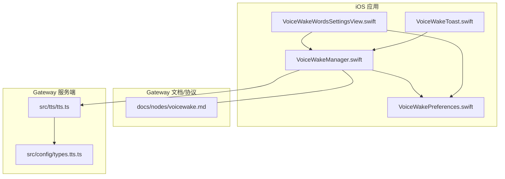
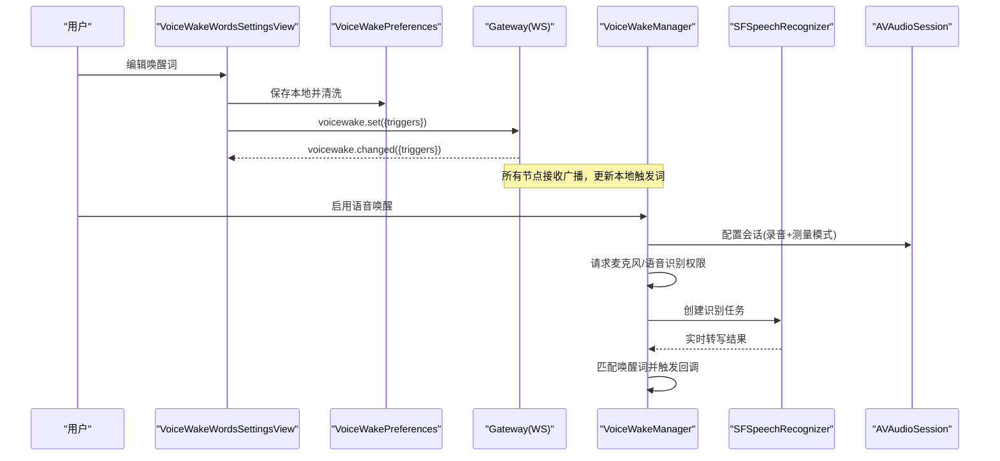
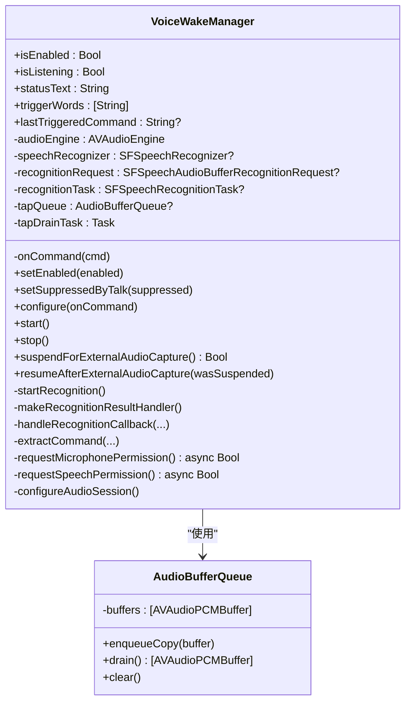
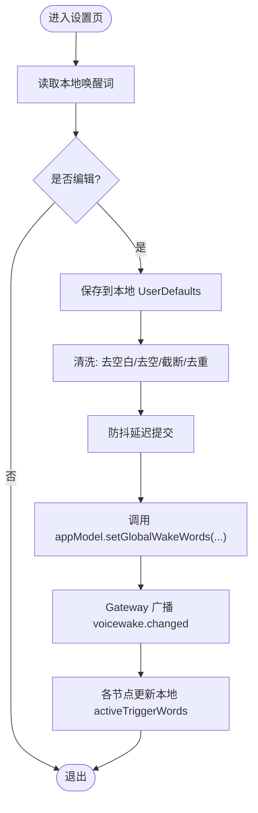
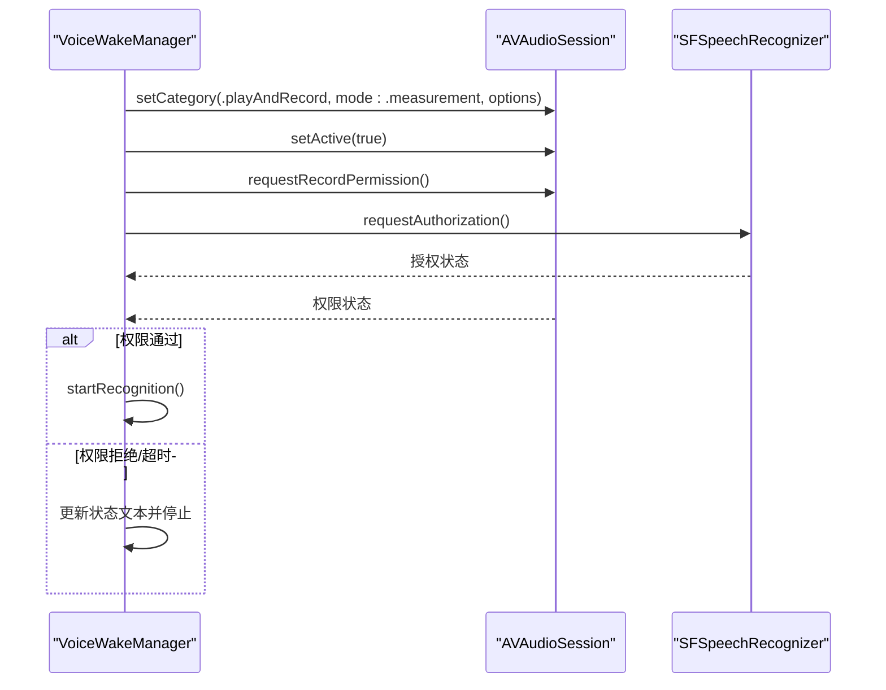
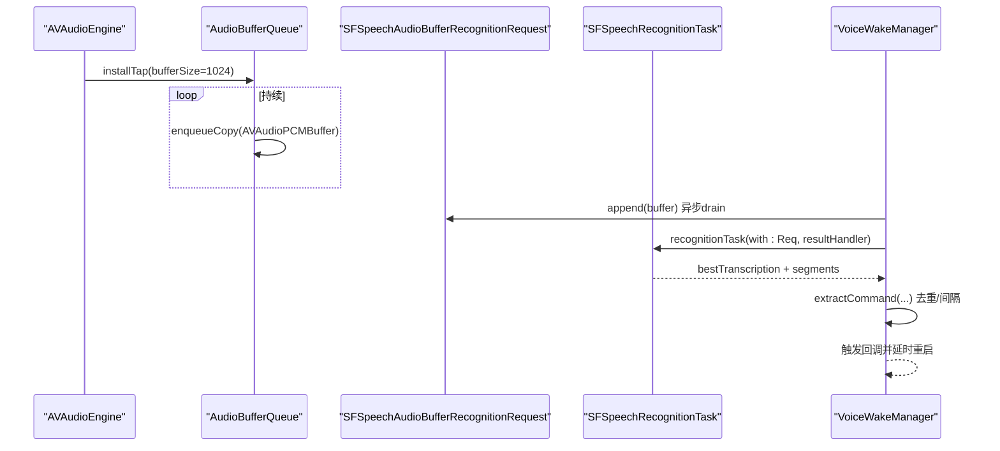
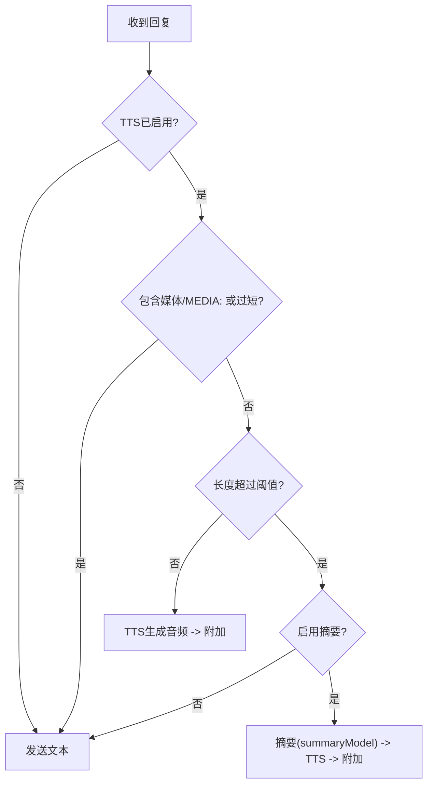
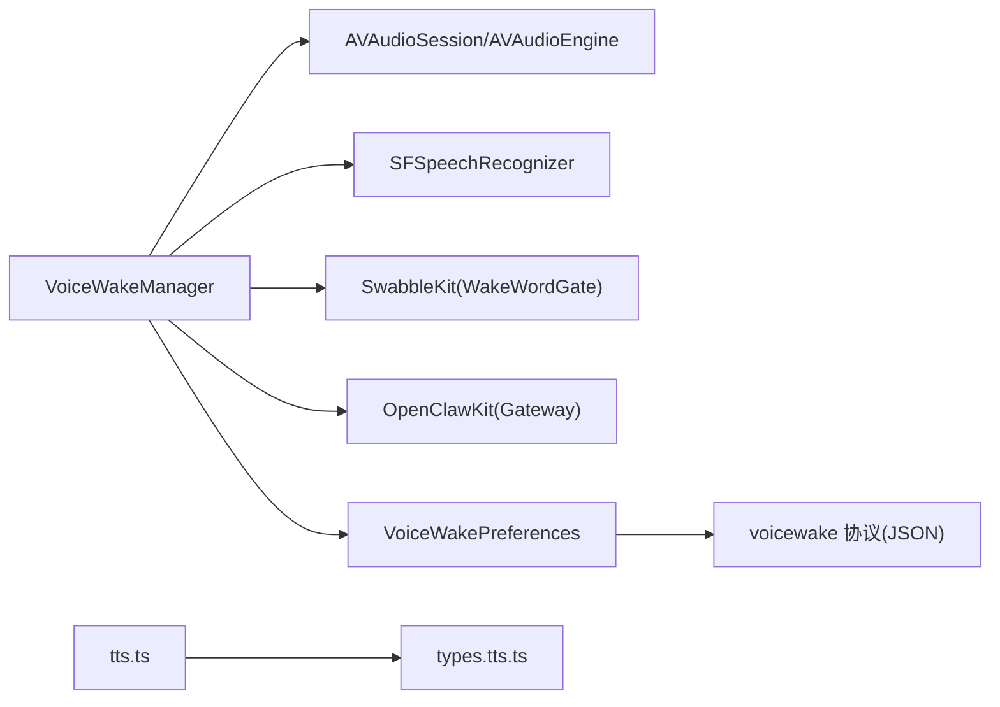

# 语音模块

<cite>
**本文引用的文件**
- [VoiceWakeManager.swift](file://apps/ios/Sources/Voice/VoiceWakeManager.swift)
- [VoiceWakePreferences.swift](file://apps/ios/Sources/Voice/VoiceWakePreferences.swift)
- [VoiceWakeWordsSettingsView.swift](file://apps/ios/Sources/Settings/VoiceWakeWordsSettingsView.swift)
- [VoiceWakeToast.swift](file://apps/ios/Sources/Status/VoiceWakeToast.swift)
- [voicewake.md](file://docs/nodes/voicewake.md)
- [tts.ts](file://src/tts/tts.ts)
- [types.tts.ts](file://src/config/types.tts.ts)
- [tts.md](file://docs/tts.md)
</cite>

## 目录

1. [简介](#简介)
2. [项目结构](#项目结构)
3. [核心组件](#核心组件)
4. [架构总览](#架构总览)
5. [详细组件分析](#详细组件分析)
6. [依赖关系分析](#依赖关系分析)
7. [性能考虑](#性能考虑)
8. [故障排查指南](#故障排查指南)
9. [结论](#结论)
10. [附录](#附录)

## 简介

本技术文档面向OpenClaw的iOS语音模块，系统性阐述语音唤醒（Voice Wake）、语音识别与TTS（文本转语音）在iOS端的实现与集成方式。重点包括：

- VoiceWakeManager的工作原理、唤醒词配置与语音模式管理
- iOS音频权限、AVAudioSession配置与实时音频处理
- 语音识别流程、唤醒词匹配与触发回调
- TTS能力的配置、自动触发策略与输出格式
- 性能优化、电池管理与用户体验设计建议

## 项目结构

iOS语音模块位于apps/ios/Sources/Voice与apps/ios/Sources/Settings等目录，配合Gateway侧的全局唤醒词同步协议与Gateway侧TTS服务共同工作。

**图表来源**

- [VoiceWakeManager.swift](file://apps/ios/Sources/Voice/VoiceWakeManager.swift#L81-L487)
- [VoiceWakePreferences.swift](file://apps/ios/Sources/Voice/VoiceWakePreferences.swift#L1-L45)
- [VoiceWakeWordsSettingsView.swift](file://apps/ios/Sources/Settings/VoiceWakeWordsSettingsView.swift#L1-L99)
- [VoiceWakeToast.swift](file://apps/ios/Sources/Status/VoiceWakeToast.swift#L1-L34)
- [voicewake.md](file://docs/nodes/voicewake.md#L1-L66)
- [tts.ts](file://src/tts/tts.ts#L249-L304)
- [types.tts.ts](file://src/config/types.tts.ts#L1-L83)

**章节来源**

- [VoiceWakeManager.swift](file://apps/ios/Sources/Voice/VoiceWakeManager.swift#L81-L487)
- [VoiceWakePreferences.swift](file://apps/ios/Sources/Voice/VoiceWakePreferences.swift#L1-L45)
- [VoiceWakeWordsSettingsView.swift](file://apps/ios/Sources/Settings/VoiceWakeWordsSettingsView.swift#L1-L99)
- [VoiceWakeToast.swift](file://apps/ios/Sources/Status/VoiceWakeToast.swift#L1-L34)
- [voicewake.md](file://docs/nodes/voicewake.md#L1-L66)
- [tts.ts](file://src/tts/tts.ts#L249-L304)
- [types.tts.ts](file://src/config/types.tts.ts#L1-L83)

## 核心组件

- VoiceWakeManager：负责麦克风权限请求、AVAudioSession配置、实时音频采集与SFSpeech识别、唤醒词匹配与触发回调。
- VoiceWakePreferences：本地存储与清洗唤醒词列表，支持从Gateway下发的触发词集合解码与校验。
- VoiceWakeWordsSettingsView：设置界面，允许用户编辑唤醒词并异步同步到Gateway。
- VoiceWakeToast：状态提示视图，展示被触发的命令。
- Gateway协议与TTS：通过voicewake文档定义的全局唤醒词同步机制与TTS配置类型，支撑跨节点一致的语音体验。

**章节来源**

- [VoiceWakeManager.swift](file://apps/ios/Sources/Voice/VoiceWakeManager.swift#L81-L487)
- [VoiceWakePreferences.swift](file://apps/ios/Sources/Voice/VoiceWakePreferences.swift#L1-L45)
- [VoiceWakeWordsSettingsView.swift](file://apps/ios/Sources/Settings/VoiceWakeWordsSettingsView.swift#L1-L99)
- [VoiceWakeToast.swift](file://apps/ios/Sources/Status/VoiceWakeToast.swift#L1-L34)
- [voicewake.md](file://docs/nodes/voicewake.md#L1-L66)
- [tts.ts](file://src/tts/tts.ts#L249-L304)
- [types.tts.ts](file://src/config/types.tts.ts#L1-L83)

## 架构总览

iOS语音模块与Gateway之间的交互遵循“全局唤醒词由Gateway持有并广播”的协议；TTS能力由Gateway侧统一解析与执行，iOS端负责触发与呈现。

**图表来源**

- [VoiceWakeWordsSettingsView.swift](file://apps/ios/Sources/Settings/VoiceWakeWordsSettingsView.swift#L88-L97)
- [VoiceWakePreferences.swift](file://apps/ios/Sources/Voice/VoiceWakePreferences.swift#L12-L21)
- [voicewake.md](file://docs/nodes/voicewake.md#L29-L48)
- [VoiceWakeManager.swift](file://apps/ios/Sources/Voice/VoiceWakeManager.swift#L160-L215)
- [VoiceWakeManager.swift](file://apps/ios/Sources/Voice/VoiceWakeManager.swift#L270-L313)

## 详细组件分析

### VoiceWakeManager 分析

VoiceWakeManager是iOS语音唤醒的核心类，职责包括：

- 权限管理：请求麦克风与语音识别授权，并在超时或失败时反馈状态
- AVAudioSession配置：使用播放/录音+测量模式，确保低延迟与混音
- 实时音频处理：通过AudioEngine输入节点安装音频tap，将PCM缓冲区复制到队列，再注入SFSpeech识别请求
- 唤醒词匹配：基于segments与配置进行匹配，去重与最小间隔控制，触发回调后自动重启监听
- 外部抢占：当相机等外部音频捕获占用麦克风时，暂停自身并等待恢复

**图表来源**

- [VoiceWakeManager.swift](file://apps/ios/Sources/Voice/VoiceWakeManager.swift#L81-L487)
- [VoiceWakeManager.swift](file://apps/ios/Sources/Voice/VoiceWakeManager.swift#L15-L79)

**章节来源**

- [VoiceWakeManager.swift](file://apps/ios/Sources/Voice/VoiceWakeManager.swift#L81-L487)

### 唤醒词配置与同步

- 本地偏好：支持默认唤醒词、最大数量与长度限制、空值清理与截断
- Gateway同步：从JSON载荷解码触发词数组，清洗后作为activeTriggerWords参与匹配
- 设置界面：支持增删改、重置默认、延迟批量同步至Gateway，避免频繁网络请求

**图表来源**

- [VoiceWakePreferences.swift](file://apps/ios/Sources/Voice/VoiceWakePreferences.swift#L23-L38)
- [VoiceWakeWordsSettingsView.swift](file://apps/ios/Sources/Settings/VoiceWakeWordsSettingsView.swift#L88-L97)
- [voicewake.md](file://docs/nodes/voicewake.md#L29-L48)

**章节来源**

- [VoiceWakePreferences.swift](file://apps/ios/Sources/Voice/VoiceWakePreferences.swift#L1-L45)
- [VoiceWakeWordsSettingsView.swift](file://apps/ios/Sources/Settings/VoiceWakeWordsSettingsView.swift#L1-L99)
- [voicewake.md](file://docs/nodes/voicewake.md#L1-L66)

### iOS音频权限与AVAudioSession配置

- 权限请求：麦克风权限与SFSpeech识别授权分别处理，带超时保护
- 会话配置：采用播放/录音+测量模式，启用duckOthers、mixWithOthers、蓝牙HFP与默认扬声器选项，以降低延迟并兼容外设
- 模拟器限制：检测到模拟器环境时禁用唤醒，避免CoreAudio死锁风险

**图表来源**

- [VoiceWakeManager.swift](file://apps/ios/Sources/Voice/VoiceWakeManager.swift#L380-L389)
- [VoiceWakeManager.swift](file://apps/ios/Sources/Voice/VoiceWakeManager.swift#L391-L429)
- [VoiceWakeManager.swift](file://apps/ios/Sources/Voice/VoiceWakeManager.swift#L169-L177)

**章节来源**

- [VoiceWakeManager.swift](file://apps/ios/Sources/Voice/VoiceWakeManager.swift#L380-L429)

### 实时音频处理与识别流程

- 安装tap：在AudioEngine输入节点安装1024帧缓冲的tap，将PCM数据深拷贝入队
- 异步出队：后台任务周期性drain队列，将缓冲区追加到SFSpeech识别请求
- 结果处理：主线程回调中提取最佳转写与segments，匹配唤醒词并去重与最小间隔控制
- 自动重启：触发后延时重启监听，保证连续可用

**图表来源**

- [VoiceWakeManager.swift](file://apps/ios/Sources/Voice/VoiceWakeManager.swift#L287-L313)
- [VoiceWakeManager.swift](file://apps/ios/Sources/Voice/VoiceWakeManager.swift#L315-L327)
- [VoiceWakeManager.swift](file://apps/ios/Sources/Voice/VoiceWakeManager.swift#L359-L364)

**章节来源**

- [VoiceWakeManager.swift](file://apps/ios/Sources/Voice/VoiceWakeManager.swift#L270-L364)

### TTS 功能与配置

- 配置解析：Gateway侧根据openclaw.json与用户偏好解析TTS模式、提供商、输出格式与超时等
- 提供商选择：优先级为OpenAI/ElevenLabs/Edge，Edge无需密钥且默认启用
- 输出格式：Telegram使用Opus语音便笺，其他渠道默认MP3；Edge支持多种微软输出格式
- 自动触发：支持off/always/inbound/tagged四种模式；长回复可自动摘要

**图表来源**

- [tts.ts](file://src/tts/tts.ts#L328-L342)
- [tts.ts](file://src/tts/tts.ts#L477-L482)
- [tts.md](file://docs/tts.md#L325-L351)

**章节来源**

- [tts.ts](file://src/tts/tts.ts#L249-L304)
- [types.tts.ts](file://src/config/types.tts.ts#L1-L83)
- [tts.md](file://docs/tts.md#L1-L397)

## 依赖关系分析

- VoiceWakeManager依赖：
  - AVFAudio/AVAudioEngine：实时音频采集与会话管理
  - Speech/SFSpeechRecognizer：离线/在线语音识别
  - SwabbleKit：唤醒词匹配算法（WakeWordGate等）
  - OpenClawKit：与Gateway通信与节点模型
- 配置与协议：
  - VoiceWakePreferences与Gateway的voicewake方法保持一致的数据结构
  - TTS配置类型与Gateway侧解析逻辑对齐

**图表来源**

- [VoiceWakeManager.swift](file://apps/ios/Sources/Voice/VoiceWakeManager.swift#L1-L7)
- [VoiceWakePreferences.swift](file://apps/ios/Sources/Voice/VoiceWakePreferences.swift#L1-L45)
- [voicewake.md](file://docs/nodes/voicewake.md#L29-L48)
- [tts.ts](file://src/tts/tts.ts#L1-L25)
- [types.tts.ts](file://src/config/types.tts.ts#L1-L83)

**章节来源**

- [VoiceWakeManager.swift](file://apps/ios/Sources/Voice/VoiceWakeManager.swift#L1-L7)
- [VoiceWakePreferences.swift](file://apps/ios/Sources/Voice/VoiceWakePreferences.swift#L1-L45)
- [voicewake.md](file://docs/nodes/voicewake.md#L1-L66)
- [tts.ts](file://src/tts/tts.ts#L1-L25)
- [types.tts.ts](file://src/config/types.tts.ts#L1-L83)

## 性能考虑

- 低延迟音频路径
  - 使用测量模式与混音选项，减少系统路由切换开销
  - tap缓冲大小与drain周期折中，兼顾CPU与延迟
- 资源释放与抢占
  - 外部音频捕获时主动暂停识别，释放会话与engine，避免冲突
  - 模拟器下禁用唤醒，规避不可靠的音频栈
- 识别稳定性
  - 部分结果上报与错误重试，失败后短暂休眠再重启
  - 唤醒词匹配加入最小间隔与去重，降低误触概率
- TTS节流
  - 长文本自动摘要，避免超限与高成本请求
  - 合理设置超时与输出格式，平衡清晰度与体积

[本节为通用指导，不直接分析具体文件]

## 故障排查指南

- 权限问题
  - 状态文本显示“权限被拒/未授予”，检查系统设置与App权限
  - 超时：权限请求超时会返回失败，建议引导用户手动开启
- 识别异常
  - 错误回调后自动重启，若持续失败，检查设备网络与系统版本
- 唤醒词无效
  - 确认Gateway广播的触发词已被清洗与截断，且本地activeTriggerWords已更新
- TTS失败
  - 检查提供商密钥、输出格式与超时设置；必要时降级到Edge TTS

**章节来源**

- [VoiceWakeManager.swift](file://apps/ios/Sources/Voice/VoiceWakeManager.swift#L454-L486)
- [VoiceWakeManager.swift](file://apps/ios/Sources/Voice/VoiceWakeManager.swift#L329-L342)
- [VoiceWakePreferences.swift](file://apps/ios/Sources/Voice/VoiceWakePreferences.swift#L31-L38)
- [tts.ts](file://src/tts/tts.ts#L492-L516)

## 结论

OpenClaw iOS语音模块通过VoiceWakeManager实现低延迟、稳定的唤醒识别，结合Gateway的全局唤醒词同步与TTS配置，形成一致的跨平台语音体验。在权限、会话与实时处理方面进行了针对性优化，并提供完善的错误处理与用户反馈路径。建议在实际部署中关注电池与网络条件，合理配置TTS参数与唤醒词策略，以获得更佳的用户体验。

[本节为总结，不直接分析具体文件]

## 附录

- 关键API与行为参考
  - 唤醒词同步：voicewake.get/set/changed
  - TTS模式：off/always/inbound/tagged
  - 输出格式：Telegram Opus、其他渠道MP3、Edge自定义格式

**章节来源**

- [voicewake.md](file://docs/nodes/voicewake.md#L29-L48)
- [tts.md](file://docs/tts.md#L200-L234)
- [types.tts.ts](file://src/config/types.tts.ts#L5-L6)
