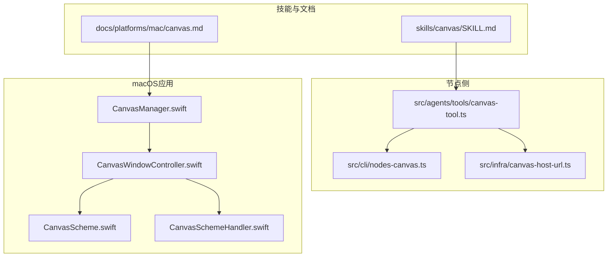
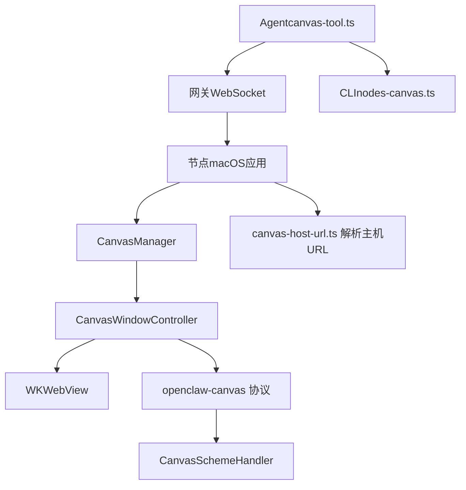
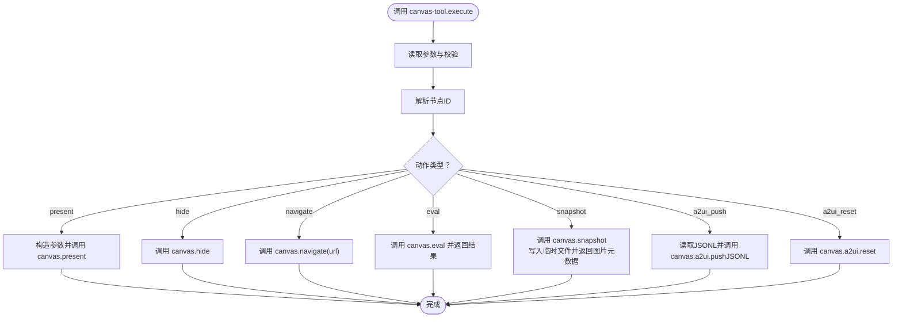
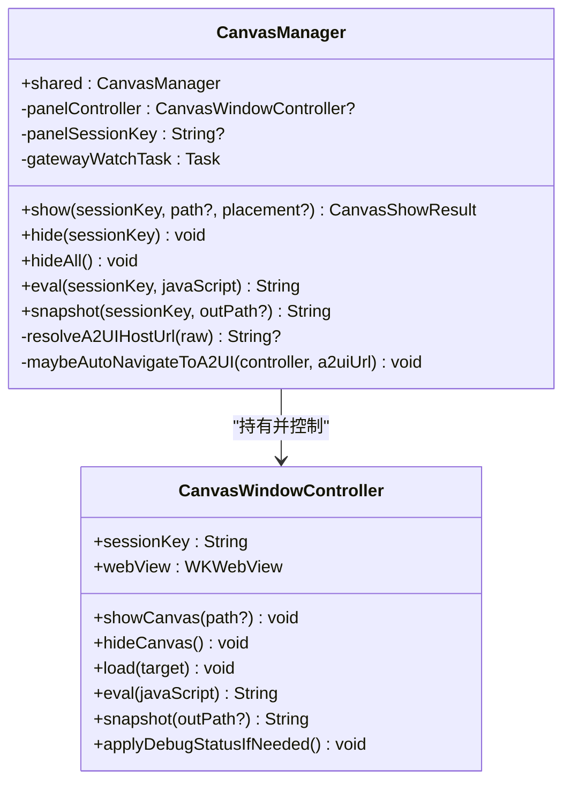
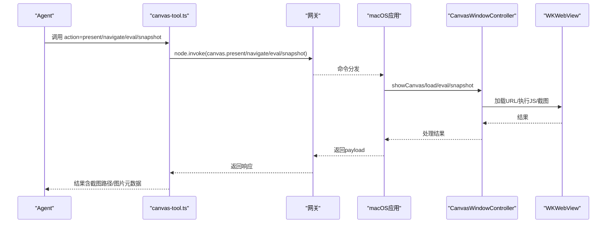
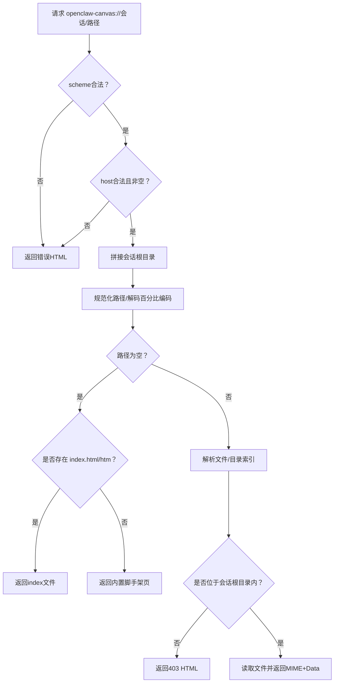
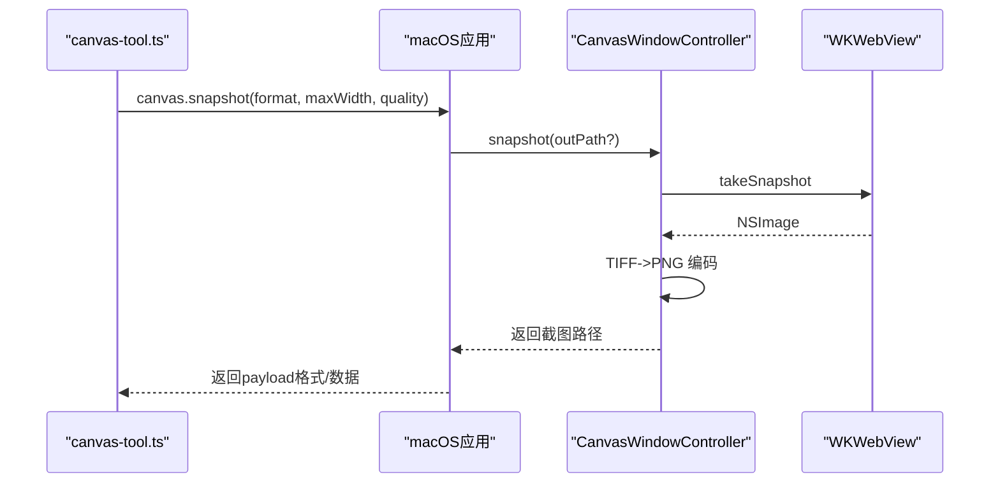
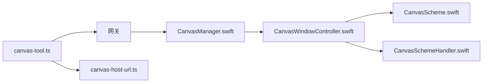

# Canvas可视化控制

<cite>
**本文引用的文件**
- [SKILL.md](file://skills/canvas/SKILL.md)
- [canvas.md](file://docs/platforms/mac/canvas.md)
- [canvas-tool.ts](file://src/agents/tools/canvas-tool.ts)
- [nodes-canvas.ts](file://src/cli/nodes-canvas.ts)
- [canvas-host-url.ts](file://src/infra/canvas-host-url.ts)
- [CanvasManager.swift](file://apps/macos/Sources/OpenClaw/CanvasManager.swift)
- [CanvasWindowController.swift](file://apps/macos/Sources/OpenClaw/CanvasWindowController.swift)
- [CanvasScheme.swift](file://apps/macos/Sources/OpenClaw/CanvasScheme.swift)
- [CanvasSchemeHandler.swift](file://apps/macos/Sources/OpenClaw/CanvasSchemeHandler.swift)
</cite>

## 目录

1. [简介](#简介)
2. [项目结构](#项目结构)
3. [核心组件](#核心组件)
4. [架构总览](#架构总览)
5. [组件详解](#组件详解)
6. [依赖关系分析](#依赖关系分析)
7. [性能考量](#性能考量)
8. [故障排查指南](#故障排查指南)
9. [结论](#结论)
10. [附录](#附录)

## 简介

本文件面向OpenClaw macOS节点的Canvas可视化控制能力，系统性阐述Canvas系统的架构设计、屏幕捕获与图像处理机制、屏幕录制与摄像头权限管理、图像渲染优化、Canvas窗口创建与管理、多显示器支持与分辨率适配、屏幕录制质量控制与编码存储、Canvas控制API与事件处理、以及权限申请、安全策略与隐私保护。文档同时结合技能文档与macOS应用源码，提供从概念到实现的完整说明，并辅以图示帮助理解。

## 项目结构

围绕Canvas功能的关键位置如下：

- 技能与使用说明：skills/canvas/SKILL.md、docs/platforms/mac/canvas.md
- 节点侧Canvas工具与CLI：src/agents/tools/canvas-tool.ts、src/cli/nodes-canvas.ts
- Canvas主机URL解析：src/infra/canvas-host-url.ts
- macOS应用Canvas实现：apps/macos/Sources/OpenClaw/CanvasManager.swift、CanvasWindowController.swift、CanvasScheme.swift、CanvasSchemeHandler.swift

**图表来源**

- [SKILL.md](file://skills/canvas/SKILL.md#L1-L199)
- [canvas.md](file://docs/platforms/mac/canvas.md#L1-L126)
- [canvas-tool.ts](file://src/agents/tools/canvas-tool.ts#L1-L181)
- [nodes-canvas.ts](file://src/cli/nodes-canvas.ts#L1-L36)
- [canvas-host-url.ts](file://src/infra/canvas-host-url.ts#L1-L67)
- [CanvasManager.swift](file://apps/macos/Sources/OpenClaw/CanvasManager.swift#L1-L343)
- [CanvasWindowController.swift](file://apps/macos/Sources/OpenClaw/CanvasWindowController.swift#L1-L372)
- [CanvasScheme.swift](file://apps/macos/Sources/OpenClaw/CanvasScheme.swift#L1-L43)
- [CanvasSchemeHandler.swift](file://apps/macos/Sources/OpenClaw/CanvasSchemeHandler.swift#L1-L260)

**章节来源**

- [SKILL.md](file://skills/canvas/SKILL.md#L1-L199)
- [canvas.md](file://docs/platforms/mac/canvas.md#L1-L126)

## 核心组件

- Canvas工具（Agent侧）：封装present/hide/navigate/eval/snapshot/A2UI推送等动作，通过网关调用节点命令，支持快照输出与A2UI消息推送。
- Canvas主机URL解析：根据绑定模式与请求头推导Canvas主机URL，确保跨网络（本地回环/LAN/Tailscale）场景下URL一致性。
- macOS Canvas管理器：负责面板生命周期、会话隔离、自动导航至A2UI、调试状态更新、锚定与放置策略。
- Canvas窗口控制器：基于WKWebView承载Canvas内容，注入A2UI桥接脚本，处理自定义协议、文件监听与自动刷新、快照与JS求值。
- 自定义协议与处理器：openclaw-canvas://会话/路径，严格限制目录遍历，按扩展名映射MIME类型，提供内置脚手架页。

**章节来源**

- [canvas-tool.ts](file://src/agents/tools/canvas-tool.ts#L1-L181)
- [canvas-host-url.ts](file://src/infra/canvas-host-url.ts#L1-L67)
- [CanvasManager.swift](file://apps/macos/Sources/OpenClaw/CanvasManager.swift#L1-L343)
- [CanvasWindowController.swift](file://apps/macos/Sources/OpenClaw/CanvasWindowController.swift#L1-L372)
- [CanvasScheme.swift](file://apps/macos/Sources/OpenClaw/CanvasScheme.swift#L1-L43)
- [CanvasSchemeHandler.swift](file://apps/macos/Sources/OpenClaw/CanvasSchemeHandler.swift#L1-L260)

## 架构总览

Canvas系统由“技能/工具层”、“网关/节点桥接层”、“macOS应用层”三部分协作构成。Agent通过Canvas工具向节点下发命令；节点侧macOS应用以WKWebView加载内容，支持本地自定义协议与外部URL；Canvas主机URL解析保证在不同绑定模式下的URL一致性；A2UI消息通过WebSocket或深链路触发Agent运行。

**图表来源**

- [canvas-tool.ts](file://src/agents/tools/canvas-tool.ts#L51-L181)
- [CanvasManager.swift](file://apps/macos/Sources/OpenClaw/CanvasManager.swift#L8-L120)
- [CanvasWindowController.swift](file://apps/macos/Sources/OpenClaw/CanvasWindowController.swift#L26-L183)
- [CanvasSchemeHandler.swift](file://apps/macos/Sources/OpenClaw/CanvasSchemeHandler.swift#L8-L40)
- [canvas-host-url.ts](file://src/infra/canvas-host-url.ts#L46-L67)
- [nodes-canvas.ts](file://src/cli/nodes-canvas.ts#L19-L36)

## 组件详解

### Canvas工具（Agent侧）

- 功能：封装Canvas动作（展示、隐藏、导航、JS求值、截图、A2UI推送/重置），将参数标准化后通过网关调用节点命令。
- 关键点：
  - 支持目标URL、窗口放置参数（x/y/宽/高）、截图格式与质量、A2UI JSONL输入。
  - 截图结果写入临时文件并返回图片元数据。
  - A2UI推送支持直接文本或文件路径两种输入方式。

**图表来源**

- [canvas-tool.ts](file://src/agents/tools/canvas-tool.ts#L58-L181)

**章节来源**

- [canvas-tool.ts](file://src/agents/tools/canvas-tool.ts#L1-L181)
- [nodes-canvas.ts](file://src/cli/nodes-canvas.ts#L1-L36)

### macOS Canvas管理器（CanvasManager）

- 职责：
  - 面板生命周期管理：显示/隐藏、锚定（菜单栏或鼠标）、记忆尺寸与位置。
  - 会话隔离：每个sessionKey对应独立目录与窗口实例。
  - 自动导航：当网关推送Canvas主机URL时，自动导航至A2UI地址（带平台参数）。
  - 调试状态：根据连接模式与状态更新面板内调试信息。
  - 目标解析：区分本地自定义协议、HTTP/HTTPS、file协议与绝对文件路径。
  - 本地状态判定：判断根路径、目录索引存在与否，决定“欢迎页/脚手架页/未找到”。

**图表来源**

- [CanvasManager.swift](file://apps/macos/Sources/OpenClaw/CanvasManager.swift#L8-L120)
- [CanvasWindowController.swift](file://apps/macos/Sources/OpenClaw/CanvasWindowController.swift#L8-L60)

**章节来源**

- [CanvasManager.swift](file://apps/macos/Sources/OpenClaw/CanvasManager.swift#L1-L343)

### Canvas窗口控制器（CanvasWindowController）

- WKWebView配置：启用全屏、开发者选项，安装自定义协议处理器，注入A2UI桥接脚本。
- 文件监听：对会话目录进行监听，当显示本地Canvas内容时自动刷新。
- 加载策略：优先识别HTTP/HTTPS、file协议；否则按openclaw-canvas://会话/路径生成URL。
- 快照：调用WKWebView takeSnapshot，转换为PNG并写入指定路径或默认路径。
- 调试状态：通过JS注入设置调试开关与状态标题/副标题。

**图表来源**

- [canvas-tool.ts](file://src/agents/tools/canvas-tool.ts#L73-L181)
- [CanvasWindowController.swift](file://apps/macos/Sources/OpenClaw/CanvasWindowController.swift#L199-L372)

**章节来源**

- [CanvasWindowController.swift](file://apps/macos/Sources/OpenClaw/CanvasWindowController.swift#L1-L372)

### 自定义协议与处理器（openclaw-canvas）

- 协议：openclaw-canvas://会话/路径，支持路径前缀自动补全。
- MIME映射：依据扩展名映射常见静态资源MIME类型。
- 处理器：
  - 校验scheme与host合法性，拒绝路径穿越。
  - 将请求路径映射到会话根目录，支持目录索引行为。
  - 当根目录无index时，返回内置脚手架页或欢迎页。
  - 读取文件并返回URLResponse与Data，统一UTF-8文本编码。

**图表来源**

- [CanvasScheme.swift](file://apps/macos/Sources/OpenClaw/CanvasScheme.swift#L7-L42)
- [CanvasSchemeHandler.swift](file://apps/macos/Sources/OpenClaw/CanvasSchemeHandler.swift#L47-L106)

**章节来源**

- [CanvasScheme.swift](file://apps/macos/Sources/OpenClaw/CanvasScheme.swift#L1-L43)
- [CanvasSchemeHandler.swift](file://apps/macos/Sources/OpenClaw/CanvasSchemeHandler.swift#L1-L260)

### 屏幕捕获与图像处理机制

- 截图流程：CanvasWindowController调用WKWebView takeSnapshot，将TIFF转为PNG并写入磁盘，返回文件路径。
- 图像格式与质量：当前实现以PNG为主；Agent侧Canvas工具支持png/jpg/jpeg格式与质量参数，最终由节点侧快照逻辑生成PNG文件。
- 性能建议：避免频繁截图；必要时限制截图尺寸；将大图保存到持久化路径而非临时目录。

**图表来源**

- [canvas-tool.ts](file://src/agents/tools/canvas-tool.ts#L128-L158)
- [CanvasWindowController.swift](file://apps/macos/Sources/OpenClaw/CanvasWindowController.swift#L318-L354)

**章节来源**

- [CanvasWindowController.swift](file://apps/macos/Sources/OpenClaw/CanvasWindowController.swift#L318-L354)
- [canvas-tool.ts](file://src/agents/tools/canvas-tool.ts#L128-L158)

### 屏幕录制与摄像头权限管理

- 屏幕录制：macOS应用未直接暴露Canvas屏幕录制入口；若需录制，可结合系统级屏幕录制功能与Canvas窗口定位。
- 摄像头权限：Canvas内容本身不直接调用摄像头；如需摄像头访问，请遵循macOS权限模型，在应用清单中声明并引导用户授权。Canvas窗口控制器未包含摄像头相关逻辑。

**章节来源**

- [CanvasWindowController.swift](file://apps/macos/Sources/OpenClaw/CanvasWindowController.swift#L1-L372)

### 图像渲染优化

- WKWebView偏好：启用全屏、开发者选项，避免透明背景以减少合成开销。
- 自动刷新：仅在显示本地Canvas内容时触发文件变更自动刷新，降低不必要的重绘。
- 调试状态注入：通过JS注入设置调试状态，便于诊断加载与渲染问题。

**章节来源**

- [CanvasWindowController.swift](file://apps/macos/Sources/OpenClaw/CanvasWindowController.swift#L41-L45)
- [CanvasWindowController.swift](file://apps/macos/Sources/OpenClaw/CanvasWindowController.swift#L141-L162)
- [CanvasWindowController.swift](file://apps/macos/Sources/OpenClaw/CanvasWindowController.swift#L267-L294)

### Canvas窗口创建与管理、多显示器支持与分辨率适配

- 窗口呈现：支持面板式呈现（靠近菜单栏或鼠标）与普通窗口两种模式；面板模式支持锚定与记忆位置。
- 多显示器：锚定提供者可来自菜单栏或鼠标位置，系统自动适配当前显示器。
- 分辨率适配：Canvas内容为Web技术栈，遵循CSS媒体查询与视口设置；WKWebView负责渲染与缩放。

**章节来源**

- [CanvasManager.swift](file://apps/macos/Sources/OpenClaw/CanvasManager.swift#L24-L26)
- [CanvasManager.swift](file://apps/macos/Sources/OpenClaw/CanvasManager.swift#L32-L114)
- [CanvasWindowController.swift](file://apps/macos/Sources/OpenClaw/CanvasWindowController.swift#L199-L215)

### 屏幕录制的质量控制、编码格式选择与存储优化

- 质量控制：Canvas快照为静态图像，未涉及视频编码；如需录制视频，应另行采用系统级录制方案。
- 编码格式：当前截图以PNG为主；Agent侧支持png/jpg/jpeg格式参数，节点侧快照逻辑生成PNG文件。
- 存储优化：截图写入指定路径或默认/tmp目录；建议在Agent侧将base64写入临时文件并返回路径，减少内存占用。

**章节来源**

- [canvas-tool.ts](file://src/agents/tools/canvas-tool.ts#L128-L158)
- [nodes-canvas.ts](file://src/cli/nodes-canvas.ts#L29-L36)
- [CanvasWindowController.swift](file://apps/macos/Sources/OpenClaw/CanvasWindowController.swift#L344-L354)

### Canvas控制API接口、事件处理与性能监控

- API接口（macOS应用通过网关暴露）：
  - canvas.present：展示Canvas，支持目标URL与窗口放置参数。
  - canvas.hide：隐藏Canvas。
  - canvas.navigate：导航到URL或本地路径。
  - canvas.eval：在Canvas上下文中执行JavaScript。
  - canvas.snapshot：截取Canvas画面为PNG/JPG。
  - canvas.a2ui.pushJSONL：推送A2UI消息流。
  - canvas.a2ui.reset：重置A2UI状态。
- 事件处理：
  - A2UI动作桥接：通过WKScriptMessageHandler或深链路触发Agent运行。
  - 文件监听：本地Canvas内容变更时自动刷新。
- 性能监控：
  - CanvasManager维护调试状态，可在Canvas内注入状态信息。
  - 日志记录：各组件使用OSLog记录关键步骤与错误。

**章节来源**

- [canvas.md](file://docs/platforms/mac/canvas.md#L44-L60)
- [CanvasWindowController.swift](file://apps/macos/Sources/OpenClaw/CanvasWindowController.swift#L55-L132)
- [CanvasManager.swift](file://apps/macos/Sources/OpenClaw/CanvasManager.swift#L142-L229)

### 权限申请流程、安全策略与隐私保护

- 权限申请：
  - Canvas内容加载遵循macOS安全模型；HTTP/HTTPS内容需显式导航；file协议仅允许受控路径。
  - 自定义协议openclaw-canvas严格限制会话根目录，禁止目录遍历。
- 安全策略：
  - 目录遍历防护：标准化路径并检查是否位于会话根目录内。
  - MIME类型映射：按扩展名精确映射，避免错误解析。
  - 内置脚手架页：在无index时提供安全的默认页面。
- 隐私保护：
  - 本地Canvas内容通过自定义协议访问，无需回环服务器。
  - 深链路触发Agent运行时携带一次性密钥，避免重复提示。

**章节来源**

- [CanvasSchemeHandler.swift](file://apps/macos/Sources/OpenClaw/CanvasSchemeHandler.swift#L84-L105)
- [CanvasSchemeHandler.swift](file://apps/macos/Sources/OpenClaw/CanvasSchemeHandler.swift#L201-L209)
- [CanvasScheme.swift](file://apps/macos/Sources/OpenClaw/CanvasScheme.swift#L22-L41)
- [canvas.md](file://docs/platforms/mac/canvas.md#L121-L126)

## 依赖关系分析

- Agent工具依赖网关调用节点命令；节点侧Canvas管理器依赖Canvas窗口控制器；窗口控制器依赖自定义协议与处理器。
- Canvas主机URL解析服务于跨网络场景下的URL一致性，确保节点收到的URL与绑定模式匹配。

**图表来源**

- [canvas-tool.ts](file://src/agents/tools/canvas-tool.ts#L73-L181)
- [CanvasManager.swift](file://apps/macos/Sources/OpenClaw/CanvasManager.swift#L8-L120)
- [CanvasWindowController.swift](file://apps/macos/Sources/OpenClaw/CanvasWindowController.swift#L26-L183)
- [CanvasScheme.swift](file://apps/macos/Sources/OpenClaw/CanvasScheme.swift#L1-L43)
- [CanvasSchemeHandler.swift](file://apps/macos/Sources/OpenClaw/CanvasSchemeHandler.swift#L1-L260)
- [canvas-host-url.ts](file://src/infra/canvas-host-url.ts#L46-L67)

**章节来源**

- [canvas-tool.ts](file://src/agents/tools/canvas-tool.ts#L1-L181)
- [CanvasManager.swift](file://apps/macos/Sources/OpenClaw/CanvasManager.swift#L1-L343)
- [CanvasWindowController.swift](file://apps/macos/Sources/OpenClaw/CanvasWindowController.swift#L1-L372)
- [CanvasScheme.swift](file://apps/macos/Sources/OpenClaw/CanvasScheme.swift#L1-L43)
- [CanvasSchemeHandler.swift](file://apps/macos/Sources/OpenClaw/CanvasSchemeHandler.swift#L1-L260)
- [canvas-host-url.ts](file://src/infra/canvas-host-url.ts#L1-L67)

## 性能考量

- 截图成本：频繁截图会增加CPU/GPU与I/O压力，建议按需触发并限制分辨率。
- 渲染路径：优先使用本地Canvas内容，避免跨域与复杂资源加载；合理使用缓存与预加载。
- 文件监听：仅在本地Canvas内容时启用自动刷新，减少无效重绘。
- 连接模式：远程模式下调试状态与降级信息有助于快速定位性能瓶颈。

[本节为通用指导，无需特定文件引用]

## 故障排查指南

- 白屏或内容不加载：
  - 检查网关绑定模式与实际URL是否一致；localhost在Tailscale绑定下不可用。
  - 使用curl测试Canvas主机URL可达性。
- “node required”或“node not connected”：
  - 确保指定有效节点ID；使用节点列表确认在线状态。
- Live reload不生效：
  - 确认canvasHost.liveReload开启；文件位于canvas root目录；检查日志中的监视器错误。
- 目录遍历或403：
  - 自定义协议URL不得包含“..”或斜杠；确保请求路径位于会话根目录内。
- 截图失败：
  - 检查快照返回的图像对象是否为空；确认PNG编码成功；检查输出路径可写。

**章节来源**

- [SKILL.md](file://skills/canvas/SKILL.md#L151-L180)
- [CanvasSchemeHandler.swift](file://apps/macos/Sources/OpenClaw/CanvasSchemeHandler.swift#L55-L89)
- [CanvasWindowController.swift](file://apps/macos/Sources/OpenClaw/CanvasWindowController.swift#L318-L354)

## 结论

OpenClaw的Canvas可视化控制以“Agent工具—网关—macOS应用—WKWebView”为主线，实现了灵活的内容展示、A2UI集成与安全的本地协议访问。通过严格的目录遍历防护、MIME映射与内置脚手架页，系统在安全性与可用性之间取得平衡。配合文件监听与调试状态注入，开发体验与问题定位得到显著提升。未来可在屏幕录制、图像压缩与多显示器适配方面进一步优化。

[本节为总结性内容，无需特定文件引用]

## 附录

- 配置要点：
  - canvasHost.enabled/port/root/liveReload：控制Canvas主机服务与热重载。
  - gateway.bind：决定Canvas主机URL的绑定模式（loopback/lan/tailnet/auto）。
- URL结构：
  - Canvas主机：/**openclaw**/canvas/<文件>
  - A2UI主机：/**openclaw**/a2ui/?platform=macos
  - 自定义协议：openclaw-canvas://<会话>/<路径>

**章节来源**

- [SKILL.md](file://skills/canvas/SKILL.md#L58-L74)
- [SKILL.md](file://skills/canvas/SKILL.md#L181-L190)
- [canvas.md](file://docs/platforms/mac/canvas.md#L73-L77)
- [canvas-host-url.ts](file://src/infra/canvas-host-url.ts#L46-L67)
