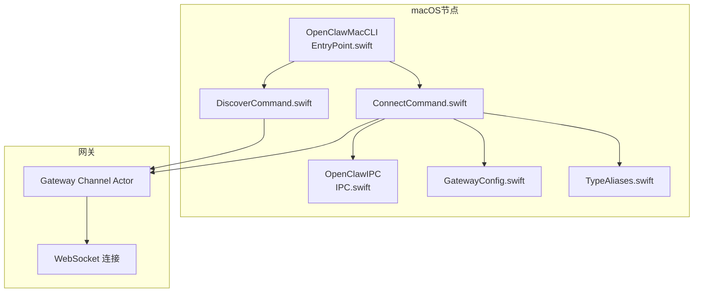
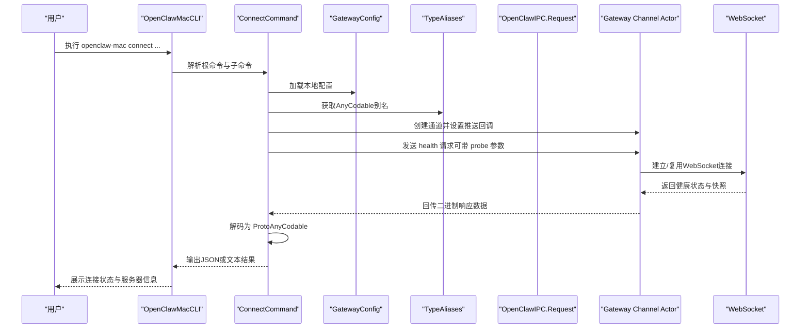
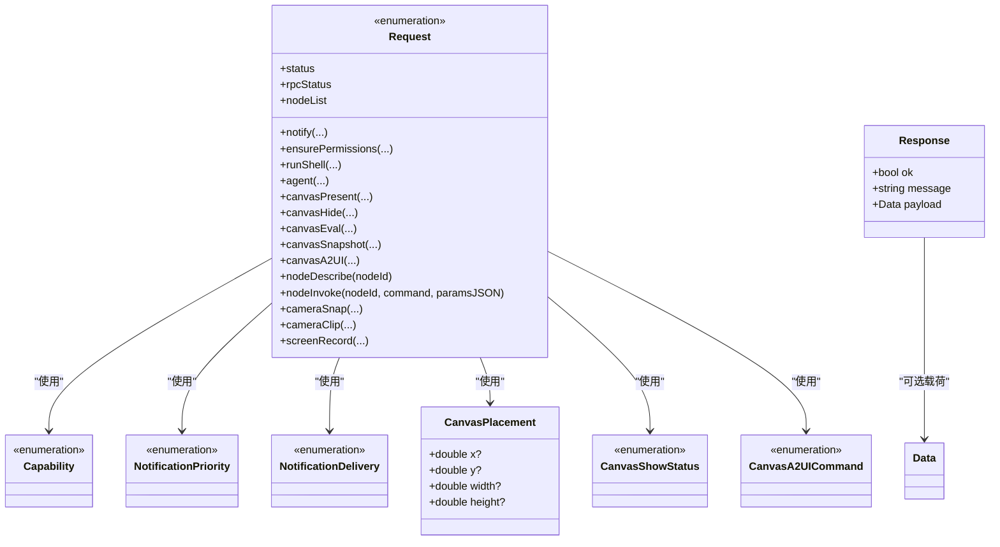
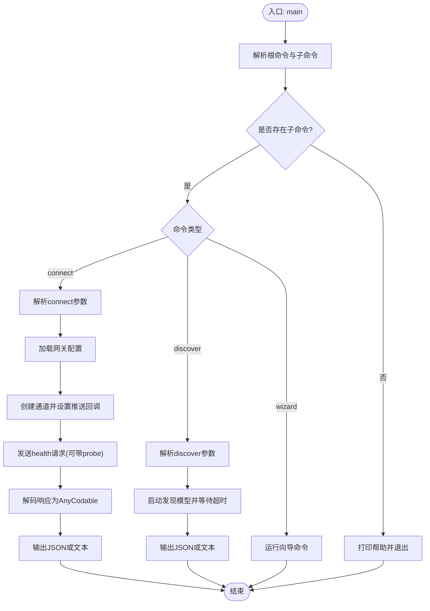
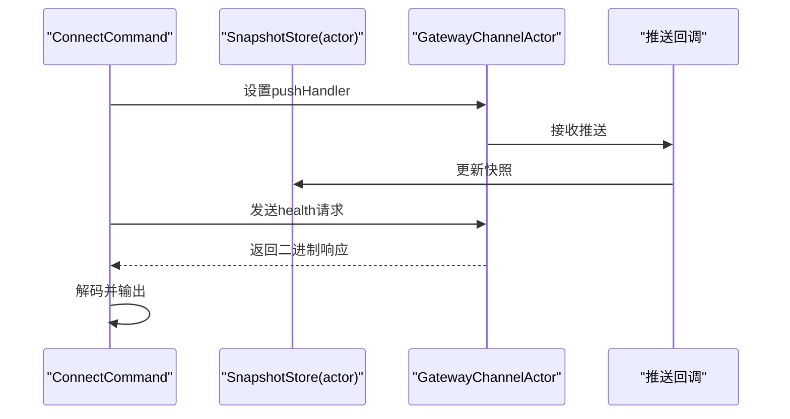
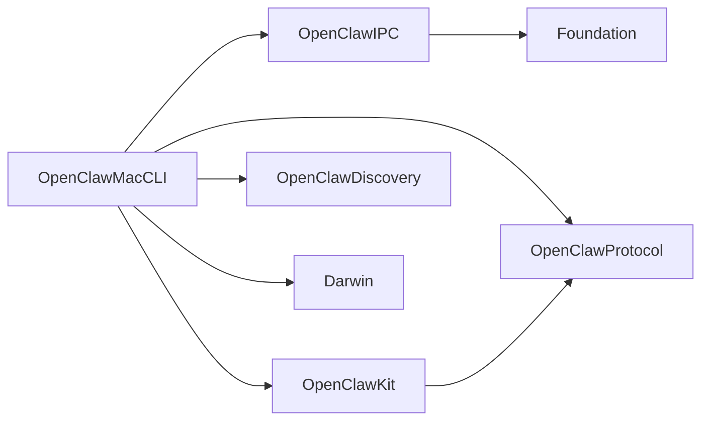

# IPC通信协议

<cite>
**本文引用的文件**
- [apps/macos/Sources/OpenClawIPC/IPC.swift](file://apps/macos/Sources/OpenClawIPC/IPC.swift)
- [apps/macos/Sources/OpenClawMacCLI/EntryPoint.swift](file://apps/macos/Sources/OpenClawMacCLI/EntryPoint.swift)
- [apps/macos/Sources/OpenClawMacCLI/ConnectCommand.swift](file://apps/macos/Sources/OpenClawMacCLI/ConnectCommand.swift)
- [apps/macos/Sources/OpenClawMacCLI/DiscoverCommand.swift](file://apps/macos/Sources/OpenClawMacCLI/DiscoverCommand.swift)
- [apps/macos/Sources/OpenClawMacCLI/GatewayConfig.swift](file://apps/macos/Sources/OpenClawMacCLI/GatewayConfig.swift)
- [apps/macos/Sources/OpenClawMacCLI/TypeAliases.swift](file://apps/macos/Sources/OpenClawMacCLI/TypeAliases.swift)
- [apps/macos/Tests/OpenClawIPCTests/CameraIPCTests.swift](file://apps/macos/Tests/OpenClawIPCTests/CameraIPCTests.swift)
- [apps/macos/Tests/OpenClawIPCTests/CanvasIPCTests.swift](file://apps/macos/Tests/OpenClawIPCTests/CanvasIPCTests.swift)
</cite>

## 目录

1. [引言](#引言)
2. [项目结构](#项目结构)
3. [核心组件](#核心组件)
4. [架构总览](#架构总览)
5. [详细组件分析](#详细组件分析)
6. [依赖关系分析](#依赖关系分析)
7. [性能考虑](#性能考虑)
8. [故障排查指南](#故障排查指南)
9. [结论](#结论)
10. [附录](#附录)

## 引言

本文件面向OpenClaw在macOS节点上的IPC（进程间通信）协议与命令行接口（CLI）实现，系统性阐述以下内容：

- macOS节点与网关之间的IPC消息模型与序列化方案
- 请求/响应的类型定义、编码规则与传输约定
- OpenClawMacCLI命令行工具的参数解析、执行流程与输出格式
- 安全验证、权限控制与错误处理策略
- 跨进程数据共享、同步机制与性能优化建议
- 协议规范、消息格式示例与调试工具使用指南

## 项目结构

OpenClaw在macOS侧通过独立模块提供IPC协议与CLI能力：

- OpenClawIPC：定义IPC请求/响应、能力枚举、Canvas布局与状态等数据结构
- OpenClawMacCLI：提供connect/discover/wizard等子命令的入口与实现
- OpenClawKit/OpenClawProtocol：与网关交互所需的类型别名与通用编解码器

**图表来源**

- [apps/macos/Sources/OpenClawIPC/IPC.swift](file://apps/macos/Sources/OpenClawIPC/IPC.swift#L108-L136)
- [apps/macos/Sources/OpenClawMacCLI/EntryPoint.swift](file://apps/macos/Sources/OpenClawMacCLI/EntryPoint.swift#L8-L30)
- [apps/macos/Sources/OpenClawMacCLI/ConnectCommand.swift](file://apps/macos/Sources/OpenClawMacCLI/ConnectCommand.swift#L100-L194)
- [apps/macos/Sources/OpenClawMacCLI/DiscoverCommand.swift](file://apps/macos/Sources/OpenClawMacCLI/DiscoverCommand.swift#L57-L150)
- [apps/macos/Sources/OpenClawMacCLI/GatewayConfig.swift](file://apps/macos/Sources/OpenClawMacCLI/GatewayConfig.swift#L21-L49)
- [apps/macos/Sources/OpenClawMacCLI/TypeAliases.swift](file://apps/macos/Sources/OpenClawMacCLI/TypeAliases.swift#L1-L6)

**章节来源**

- [apps/macos/Sources/OpenClawIPC/IPC.swift](file://apps/macos/Sources/OpenClawIPC/IPC.swift#L1-L418)
- [apps/macos/Sources/OpenClawMacCLI/EntryPoint.swift](file://apps/macos/Sources/OpenClawMacCLI/EntryPoint.swift#L1-L57)
- [apps/macos/Sources/OpenClawMacCLI/ConnectCommand.swift](file://apps/macos/Sources/OpenClawMacCLI/ConnectCommand.swift#L1-L354)
- [apps/macos/Sources/OpenClawMacCLI/DiscoverCommand.swift](file://apps/macos/Sources/OpenClawMacCLI/DiscoverCommand.swift#L1-L150)
- [apps/macos/Sources/OpenClawMacCLI/GatewayConfig.swift](file://apps/macos/Sources/OpenClawMacCLI/GatewayConfig.swift#L1-L63)
- [apps/macos/Sources/OpenClawMacCLI/TypeAliases.swift](file://apps/macos/Sources/OpenClawMacCLI/TypeAliases.swift#L1-L6)

## 核心组件

- IPC协议模型
  - 能力枚举：用于声明所需系统能力（如AppleScript、通知、无障碍、屏幕录制、麦克风、语音识别、摄像头、定位）
  - 请求类型：统一以枚举形式表达，包含通知、权限检查、Shell执行、状态查询、代理消息、Canvas操作、节点管理、相机/屏幕录制等
  - 响应类型：统一返回结构体，包含成功标志、可选消息与可选二进制载荷（如截图、stdout）
  - 编码规则：请求采用自定义Codable实现，显式写入“type”键区分请求种类，并对可选字段进行条件编码
- CLI命令
  - 入口：解析根命令与子命令，分派到对应处理器
  - connect：解析连接参数，加载网关配置，建立通道并请求健康状态与快照
  - discover：扫描局域网/远程网关，输出发现结果
  - wizard：向导式配置（由入口分派）

**章节来源**

- [apps/macos/Sources/OpenClawIPC/IPC.swift](file://apps/macos/Sources/OpenClawIPC/IPC.swift#L6-L16)
- [apps/macos/Sources/OpenClawIPC/IPC.swift](file://apps/macos/Sources/OpenClawIPC/IPC.swift#L108-L136)
- [apps/macos/Sources/OpenClawIPC/IPC.swift](file://apps/macos/Sources/OpenClawIPC/IPC.swift#L140-L151)
- [apps/macos/Sources/OpenClawIPC/IPC.swift](file://apps/macos/Sources/OpenClawIPC/IPC.swift#L155-L408)
- [apps/macos/Sources/OpenClawMacCLI/EntryPoint.swift](file://apps/macos/Sources/OpenClawMacCLI/EntryPoint.swift#L8-L30)
- [apps/macos/Sources/OpenClawMacCLI/ConnectCommand.swift](file://apps/macos/Sources/OpenClawMacCLI/ConnectCommand.swift#L100-L194)
- [apps/macos/Sources/OpenClawMacCLI/DiscoverCommand.swift](file://apps/macos/Sources/OpenClawMacCLI/DiscoverCommand.swift#L57-L150)

## 架构总览

下图展示macOS CLI如何通过OpenClawKit/OpenClawProtocol与网关建立连接，并使用OpenClawIPC协议发送请求与接收响应。

**图表来源**

- [apps/macos/Sources/OpenClawMacCLI/EntryPoint.swift](file://apps/macos/Sources/OpenClawMacCLI/EntryPoint.swift#L8-L30)
- [apps/macos/Sources/OpenClawMacCLI/ConnectCommand.swift](file://apps/macos/Sources/OpenClawMacCLI/ConnectCommand.swift#L100-L194)
- [apps/macos/Sources/OpenClawMacCLI/GatewayConfig.swift](file://apps/macos/Sources/OpenClawMacCLI/GatewayConfig.swift#L21-L49)
- [apps/macos/Sources/OpenClawMacCLI/TypeAliases.swift](file://apps/macos/Sources/OpenClawMacCLI/TypeAliases.swift#L1-L6)
- [apps/macos/Sources/OpenClawIPC/IPC.swift](file://apps/macos/Sources/OpenClawIPC/IPC.swift#L108-L136)

## 详细组件分析

### IPC协议模型与序列化

- 数据模型
  - 能力枚举：用于权限申请与检查
  - 通知优先级与投递方式：支持系统通知中心与应用内覆盖层
  - Canvas几何与显示状态：窗口位置、尺寸与导航状态
  - Canvas A2UI命令：JSONL推送与重置
  - 请求类型：覆盖通知、权限、Shell执行、状态、代理消息、Canvas生命周期/脚本/截图/A2UI、节点列表/描述/调用、相机拍照/录像、屏幕录制
  - 响应类型：统一包含成功标志、可选消息与可选二进制载荷
- 编码规则
  - 自定义Codable：显式写入type键标识请求种类；对可选字段使用条件编码
  - 可选字段默认值：部分请求对布尔/数值字段提供默认值（如包含音频默认true）
- 传输约定
  - 控制套接字路径：位于用户主目录的应用支持目录下
  - 请求/响应通过WebSocket通道发送，使用AnyCodable进行通用编解码

**图表来源**

- [apps/macos/Sources/OpenClawIPC/IPC.swift](file://apps/macos/Sources/OpenClawIPC/IPC.swift#L6-L16)
- [apps/macos/Sources/OpenClawIPC/IPC.swift](file://apps/macos/Sources/OpenClawIPC/IPC.swift#L26-L40)
- [apps/macos/Sources/OpenClawIPC/IPC.swift](file://apps/macos/Sources/OpenClawIPC/IPC.swift#L46-L58)
- [apps/macos/Sources/OpenClawIPC/IPC.swift](file://apps/macos/Sources/OpenClawIPC/IPC.swift#L62-L99)
- [apps/macos/Sources/OpenClawIPC/IPC.swift](file://apps/macos/Sources/OpenClawIPC/IPC.swift#L103-L106)
- [apps/macos/Sources/OpenClawIPC/IPC.swift](file://apps/macos/Sources/OpenClawIPC/IPC.swift#L108-L136)
- [apps/macos/Sources/OpenClawIPC/IPC.swift](file://apps/macos/Sources/OpenClawIPC/IPC.swift#L140-L151)

**章节来源**

- [apps/macos/Sources/OpenClawIPC/IPC.swift](file://apps/macos/Sources/OpenClawIPC/IPC.swift#L1-L418)

### OpenClawMacCLI命令行接口

- 入口与命令分派
  - 支持connect、discover、wizard等子命令；未知命令打印帮助并退出
- connect命令
  - 参数解析：支持URL、令牌、密码、模式、超时、探测、JSON输出、客户端ID/模式、显示名称、角色、作用域等
  - 配置加载：从用户家目录加载JSON配置，解析网关模式、绑定地址、端口、认证与远程配置
  - 连接与健康检查：创建通道，发送health请求（可带probe），等待快照推送，输出JSON或文本
  - 错误处理：捕获异常，回退到最佳努力端点，输出错误信息并退出
- discover命令
  - 参数解析：支持超时、JSON输出、是否包含本地网关
  - 发现流程：构造发现模型，启动扫描，等待指定时间，停止并汇总结果，输出JSON或文本
- 类型别名
  - ProtoAnyCodable与KitAnyCodable用于协议与SDK间的通用编解码

**图表来源**

- [apps/macos/Sources/OpenClawMacCLI/EntryPoint.swift](file://apps/macos/Sources/OpenClawMacCLI/EntryPoint.swift#L8-L30)
- [apps/macos/Sources/OpenClawMacCLI/ConnectCommand.swift](file://apps/macos/Sources/OpenClawMacCLI/ConnectCommand.swift#L100-L194)
- [apps/macos/Sources/OpenClawMacCLI/DiscoverCommand.swift](file://apps/macos/Sources/OpenClawMacCLI/DiscoverCommand.swift#L57-L150)
- [apps/macos/Sources/OpenClawMacCLI/GatewayConfig.swift](file://apps/macos/Sources/OpenClawMacCLI/GatewayConfig.swift#L21-L49)
- [apps/macos/Sources/OpenClawMacCLI/TypeAliases.swift](file://apps/macos/Sources/OpenClawMacCLI/TypeAliases.swift#L1-L6)

**章节来源**

- [apps/macos/Sources/OpenClawMacCLI/EntryPoint.swift](file://apps/macos/Sources/OpenClawMacCLI/EntryPoint.swift#L1-L57)
- [apps/macos/Sources/OpenClawMacCLI/ConnectCommand.swift](file://apps/macos/Sources/OpenClawMacCLI/ConnectCommand.swift#L1-L354)
- [apps/macos/Sources/OpenClawMacCLI/DiscoverCommand.swift](file://apps/macos/Sources/OpenClawMacCLI/DiscoverCommand.swift#L1-L150)
- [apps/macos/Sources/OpenClawMacCLI/GatewayConfig.swift](file://apps/macos/Sources/OpenClawMacCLI/GatewayConfig.swift#L1-L63)
- [apps/macos/Sources/OpenClawMacCLI/TypeAliases.swift](file://apps/macos/Sources/OpenClawMacCLI/TypeAliases.swift#L1-L6)

### 消息路由与事件分发机制

- 请求路由
  - connect命令通过GatewayChannelActor封装请求方法，将请求方法名与参数映射到通道请求
  - 健康检查与快照推送通过回调在通道层处理，避免阻塞主线程
- 事件分发
  - 使用actor SnapshotStore保存快照，确保并发安全
  - 推送回调在actor上下文中更新快照，随后在异步任务中进行后续处理

**图表来源**

- [apps/macos/Sources/OpenClawMacCLI/ConnectCommand.swift](file://apps/macos/Sources/OpenClawMacCLI/ConnectCommand.swift#L144-L163)

**章节来源**

- [apps/macos/Sources/OpenClawMacCLI/ConnectCommand.swift](file://apps/macos/Sources/OpenClawMacCLI/ConnectCommand.swift#L88-L98)

### 安全验证、权限控制与错误处理

- 权限控制
  - 通过ensurePermissions请求声明所需能力，结合系统TCC（透明件）进行授权
  - 支持交互式授权与非交互式模式
- 认证与授权
  - connect命令支持令牌与密码参数，优先使用命令行参数，其次从配置中解析
  - 支持本地与远程两种模式，远程模式优先使用远程配置
- 错误处理
  - 参数校验失败抛出错误并回退到最佳努力端点
  - 健康检查失败输出错误信息并以非零退出码终止
  - JSON输出失败时回退输出错误提示

**章节来源**

- [apps/macos/Sources/OpenClawIPC/IPC.swift](file://apps/macos/Sources/OpenClawIPC/IPC.swift#L115-L115)
- [apps/macos/Sources/OpenClawMacCLI/ConnectCommand.swift](file://apps/macos/Sources/OpenClawMacCLI/ConnectCommand.swift#L235-L300)
- [apps/macos/Sources/OpenClawMacCLI/ConnectCommand.swift](file://apps/macos/Sources/OpenClawMacCLI/ConnectCommand.swift#L177-L193)

### 跨进程数据共享与同步

- 数据共享
  - 通过WebSocket通道传输二进制载荷（如截图、视频片段）与文本数据（如stdout）
  - 使用AnyCodable进行通用编解码，便于跨语言/跨模块传输
- 同步机制
  - 使用actor SnapshotStore保证快照更新的线程安全
  - 通道推送回调在actor上下文中执行，避免竞态条件

**章节来源**

- [apps/macos/Sources/OpenClawIPC/IPC.swift](file://apps/macos/Sources/OpenClawIPC/IPC.swift#L144-L144)
- [apps/macos/Sources/OpenClawMacCLI/ConnectCommand.swift](file://apps/macos/Sources/OpenClawMacCLI/ConnectCommand.swift#L88-L98)

## 依赖关系分析

- 组件耦合
  - OpenClawMacCLI依赖OpenClawIPC定义的消息模型
  - ConnectCommand依赖OpenClawKit/OpenClawProtocol提供的AnyCodable与通道抽象
  - DiscoverCommand依赖OpenClawDiscovery进行网关发现
- 外部依赖
  - Darwin（macOS系统库）用于网络接口检测与系统服务
  - Foundation用于文件读取、JSON解析与字符串处理

**图表来源**

- [apps/macos/Sources/OpenClawMacCLI/ConnectCommand.swift](file://apps/macos/Sources/OpenClawMacCLI/ConnectCommand.swift#L1-L6)
- [apps/macos/Sources/OpenClawMacCLI/TypeAliases.swift](file://apps/macos/Sources/OpenClawMacCLI/TypeAliases.swift#L1-L6)
- [apps/macos/Sources/OpenClawIPC/IPC.swift](file://apps/macos/Sources/OpenClawIPC/IPC.swift#L1-L2)

**章节来源**

- [apps/macos/Sources/OpenClawMacCLI/ConnectCommand.swift](file://apps/macos/Sources/OpenClawMacCLI/ConnectCommand.swift#L1-L6)
- [apps/macos/Sources/OpenClawMacCLI/TypeAliases.swift](file://apps/macos/Sources/OpenClawMacCLI/TypeAliases.swift#L1-L6)
- [apps/macos/Sources/OpenClawIPC/IPC.swift](file://apps/macos/Sources/OpenClawIPC/IPC.swift#L1-L2)

## 性能考虑

- 请求合并与批处理
  - 对于频繁的Canvas脚本执行与截图请求，建议在应用侧进行去抖/节流，减少通道压力
- 载荷压缩
  - 对大体积二进制载荷（如视频帧）建议在通道层启用压缩或分块传输
- 并发控制
  - 使用actor隔离共享状态，避免锁竞争；对高并发场景限制同时请求数
- 超时与重试
  - 为健康检查与长耗时操作设置合理超时；对瞬时网络波动进行指数退避重试

## 故障排查指南

- 常见问题
  - 网关URL无效：检查命令行参数或配置文件中的URL格式
  - 无法解析配置：确认~/.openclaw/openclaw.json存在且可读
  - Tailnet地址解析失败：确认系统网络接口状态与Tailnet IPv4范围匹配
  - 权限不足：使用ensurePermissions交互式授权或调整系统TCC设置
- 调试工具
  - 使用--json输出机器可读结果，便于自动化脚本解析
  - 使用--probe触发健康探针，获取最新服务器状态
  - 结合单元测试用例定位Canvas/相机相关功能问题

**章节来源**

- [apps/macos/Sources/OpenClawMacCLI/ConnectCommand.swift](file://apps/macos/Sources/OpenClawMacCLI/ConnectCommand.swift#L235-L300)
- [apps/macos/Sources/OpenClawMacCLI/DiscoverCommand.swift](file://apps/macos/Sources/OpenClawMacCLI/DiscoverCommand.swift#L57-L150)
- [apps/macos/Tests/OpenClawIPCTests/CameraIPCTests.swift](file://apps/macos/Tests/OpenClawIPCTests/CameraIPCTests.swift)
- [apps/macos/Tests/OpenClawIPCTests/CanvasIPCTests.swift](file://apps/macos/Tests/OpenClawIPCTests/CanvasIPCTests.swift)

## 结论

OpenClaw在macOS节点上的IPC协议以清晰的数据模型与自定义Codable编码为基础，结合OpenClawMacCLI实现了简洁高效的命令行工具链。通过权限声明、认证参数与错误回退机制，系统在易用性与安全性之间取得平衡。建议在生产环境中配合超时/重试、并发控制与载荷优化策略，进一步提升稳定性与性能。

## 附录

- 协议规范要点
  - 请求类型：统一以枚举表达，显式type键区分
  - 可选字段：按需编码，避免冗余
  - 二进制载荷：payload字段承载，如截图、视频片段
  - Canvas操作：支持展示、隐藏、脚本执行、截图与A2UI命令
- 消息格式示例（路径参考）
  - 请求编码示例：[apps/macos/Sources/OpenClawIPC/IPC.swift](file://apps/macos/Sources/OpenClawIPC/IPC.swift#L201-L300)
  - 响应解码示例：[apps/macos/Sources/OpenClawMacCLI/ConnectCommand.swift](file://apps/macos/Sources/OpenClawMacCLI/ConnectCommand.swift#L157-L161)
- 调试工具使用
  - connect命令：--json、--probe、--timeout
  - discover命令：--json、--include-local、--timeout
