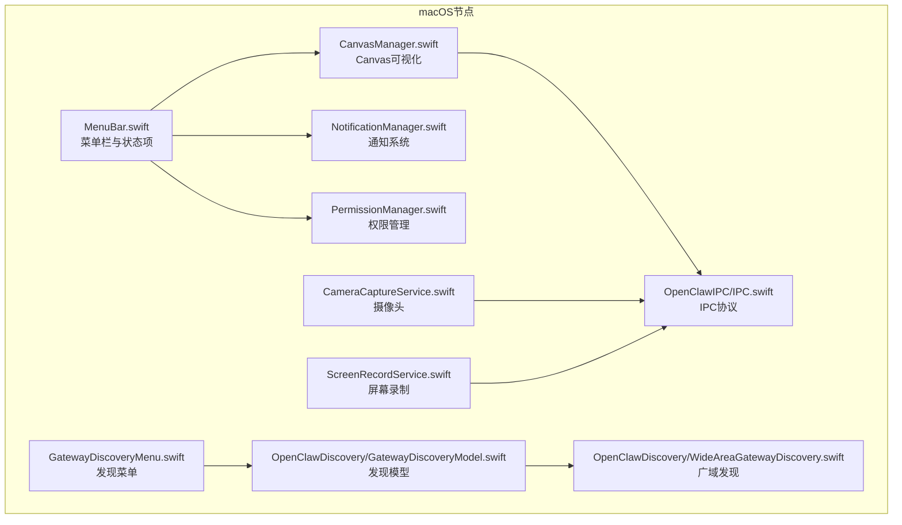
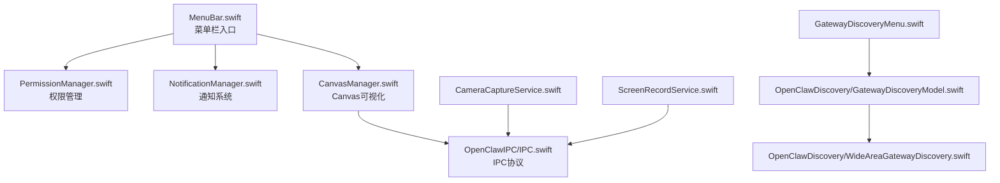
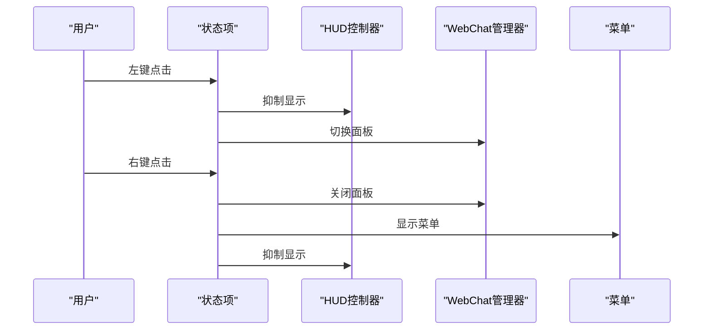
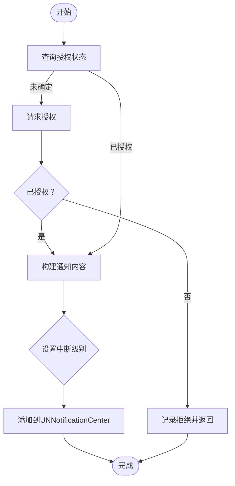
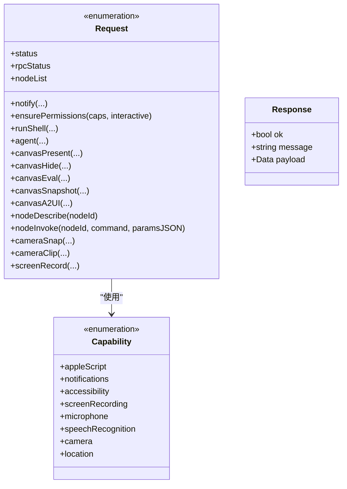
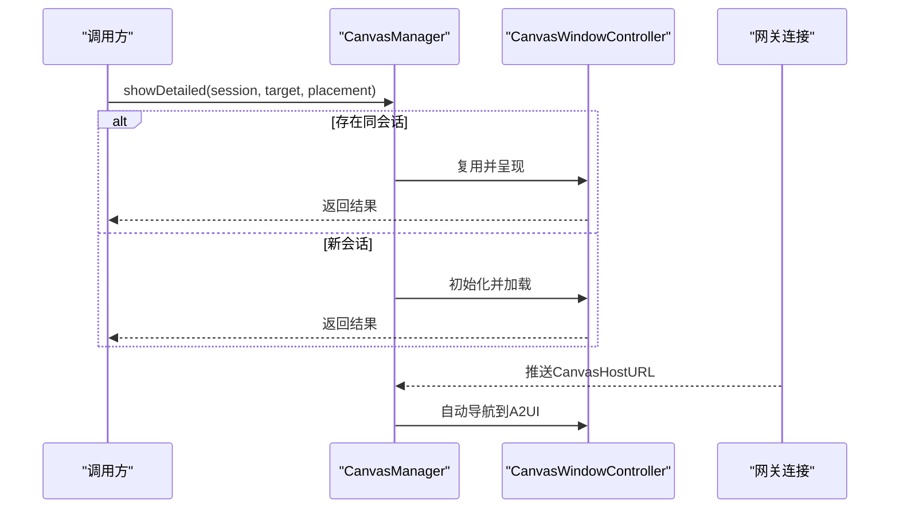
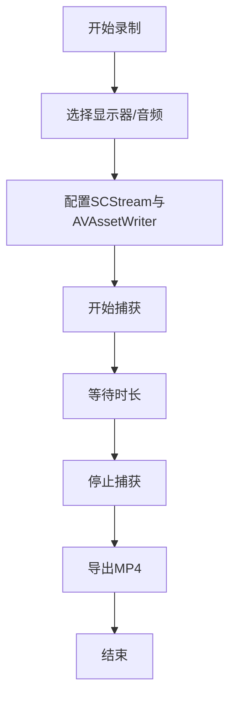
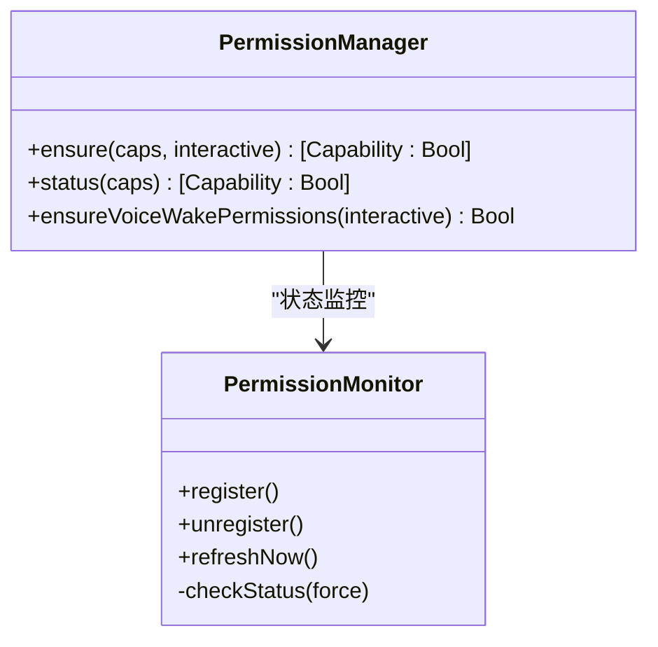
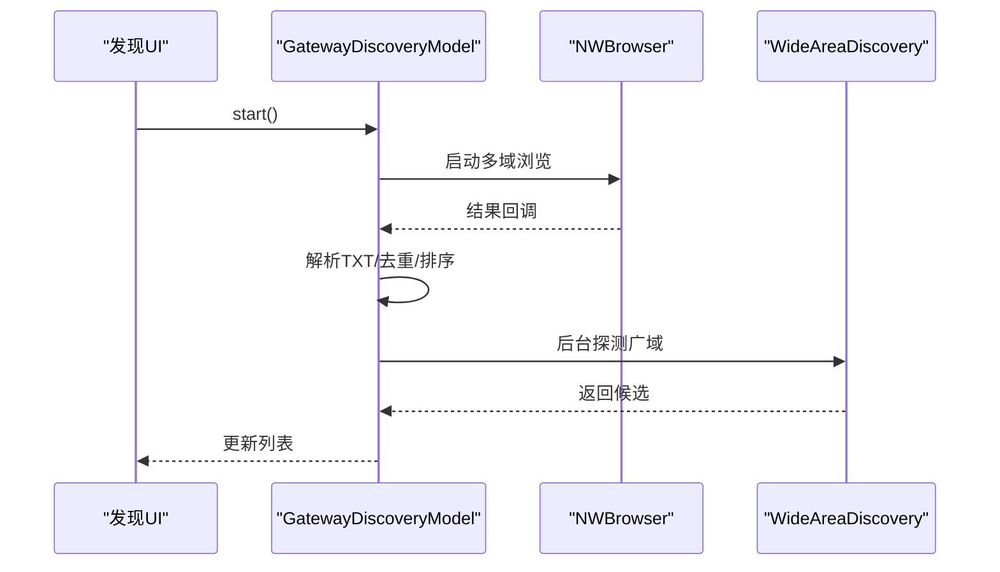
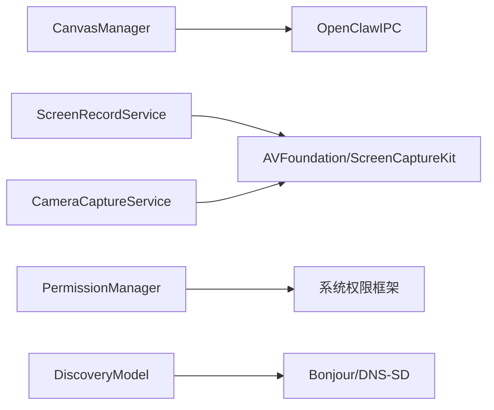

# macOS节点

<cite>
**本文引用的文件**
- [apps/macos/Sources/OpenClaw/MenuBar.swift](file://apps/macos/Sources/OpenClaw/MenuBar.swift)
- [apps/macos/Sources/OpenClaw/NotificationManager.swift](file://apps/macos/Sources/OpenClaw/NotificationManager.swift)
- [apps/macos/Sources/OpenClawIPC/IPC.swift](file://apps/macos/Sources/OpenClawIPC/IPC.swift)
- [apps/macos/Sources/OpenClaw/CanvasManager.swift](file://apps/macos/Sources/OpenClaw/CanvasManager.swift)
- [apps/macos/Sources/OpenClaw/CameraCaptureService.swift](file://apps/macos/Sources/OpenClaw/CameraCaptureService.swift)
- [apps/macos/Sources/OpenClaw/ScreenRecordService.swift](file://apps/macos/Sources/OpenClaw/ScreenRecordService.swift)
- [apps/macos/Sources/OpenClaw/PermissionManager.swift](file://apps/macos/Sources/OpenClaw/PermissionManager.swift)
- [apps/macos/Sources/OpenClaw/GatewayDiscoveryMenu.swift](file://apps/macos/Sources/OpenClaw/GatewayDiscoveryMenu.swift)
- [apps/macos/Sources/OpenClawDiscovery/GatewayDiscoveryModel.swift](file://apps/macos/Sources/OpenClawDiscovery/GatewayDiscoveryModel.swift)
- [apps/macos/Sources/OpenClawDiscovery/WideAreaGatewayDiscovery.swift](file://apps/macos/Sources/OpenClawDiscovery/WideAreaGatewayDiscovery.swift)
- [apps/macos/Package.swift](file://apps/macos/Package.swift)
- [apps/macos/README.md](file://apps/macos/README.md)
</cite>

## 目录

1. [简介](#简介)
2. [项目结构](#项目结构)
3. [核心组件](#核心组件)
4. [架构总览](#架构总览)
5. [详细组件分析](#详细组件分析)
6. [依赖关系分析](#依赖关系分析)
7. [性能考量](#性能考量)
8. [故障排除指南](#故障排除指南)
9. [结论](#结论)
10. [附录](#附录)

## 简介

本文件面向OpenClaw的macOS节点，系统性梳理其架构设计、菜单栏控制、通知系统、Canvas可视化、屏幕录制与摄像头访问、权限管理、节点发现机制以及IPC通信协议。文档同时覆盖与macOS系统的深度集成、沙箱限制与安全策略，并提供安装配置、权限设置与故障排除建议，帮助开发者与运维人员高效部署与维护。

## 项目结构

macOS节点位于apps/macos目录，采用SwiftUI与AppKit构建菜单栏应用，核心模块包括：

- 应用入口与菜单栏：MenuBar.swift
- 通知系统：NotificationManager.swift
- IPC协议定义：OpenClawIPC/IPC.swift
- Canvas可视化：CanvasManager.swift
- 摄像头与屏幕录制：CameraCaptureService.swift、ScreenRecordService.swift
- 权限管理：PermissionManager.swift
- 节点发现：GatewayDiscoveryMenu.swift、OpenClawDiscovery/GatewayDiscoveryModel.swift、OpenClawDiscovery/WideAreaGatewayDiscovery.swift
- 包配置与说明：Package.swift、README.md

图表来源

- [apps/macos/Sources/OpenClaw/MenuBar.swift](file://apps/macos/Sources/OpenClaw/MenuBar.swift#L1-L473)
- [apps/macos/Sources/OpenClaw/NotificationManager.swift](file://apps/macos/Sources/OpenClaw/NotificationManager.swift#L1-L67)
- [apps/macos/Sources/OpenClawIPC/IPC.swift](file://apps/macos/Sources/OpenClawIPC/IPC.swift#L1-L418)
- [apps/macos/Sources/OpenClaw/CanvasManager.swift](file://apps/macos/Sources/OpenClaw/CanvasManager.swift#L1-L343)
- [apps/macos/Sources/OpenClaw/CameraCaptureService.swift](file://apps/macos/Sources/OpenClaw/CameraCaptureService.swift#L1-L426)
- [apps/macos/Sources/OpenClaw/ScreenRecordService.swift](file://apps/macos/Sources/OpenClaw/ScreenRecordService.swift#L1-L267)
- [apps/macos/Sources/OpenClaw/PermissionManager.swift](file://apps/macos/Sources/OpenClaw/PermissionManager.swift#L1-L507)
- [apps/macos/Sources/OpenClaw/GatewayDiscoveryMenu.swift](file://apps/macos/Sources/OpenClaw/GatewayDiscoveryMenu.swift#L1-L140)
- [apps/macos/Sources/OpenClawDiscovery/GatewayDiscoveryModel.swift](file://apps/macos/Sources/OpenClawDiscovery/GatewayDiscoveryModel.swift#L1-L685)
- [apps/macos/Sources/OpenClawDiscovery/WideAreaGatewayDiscovery.swift](file://apps/macos/Sources/OpenClawDiscovery/WideAreaGatewayDiscovery.swift#L1-L375)

章节来源

- [apps/macos/Package.swift](file://apps/macos/Package.swift)
- [apps/macos/README.md](file://apps/macos/README.md)

## 核心组件

- 菜单栏与状态项：负责图标状态、悬停HUD抑制、面板可见性联动、连接模式切换与更新器控制。
- 通知系统：封装UNUserNotificationCenter授权与发送，支持优先级与静默提醒。
- IPC协议：统一请求/响应模型，覆盖通知、权限确保、Shell执行、Canvas操作、媒体采集、节点管理等。
- Canvas可视化：会话化面板展示、自动导航到A2UI、窗口锚定与调试信息。
- 摄像头与屏幕录制：基于AVFoundation与ScreenCaptureKit的安全采集与导出。
- 权限管理：统一检查与交互式授权，覆盖通知、AppleScript、辅助功能、屏幕录制、麦克风、语音识别、相机、位置。
- 节点发现：本地Bonjour与广域DNS-SD结合，动态解析TXT参数并去重排序。

章节来源

- [apps/macos/Sources/OpenClaw/MenuBar.swift](file://apps/macos/Sources/OpenClaw/MenuBar.swift#L1-L473)
- [apps/macos/Sources/OpenClaw/NotificationManager.swift](file://apps/macos/Sources/OpenClaw/NotificationManager.swift#L1-L67)
- [apps/macos/Sources/OpenClawIPC/IPC.swift](file://apps/macos/Sources/OpenClawIPC/IPC.swift#L1-L418)
- [apps/macos/Sources/OpenClaw/CanvasManager.swift](file://apps/macos/Sources/OpenClaw/CanvasManager.swift#L1-L343)
- [apps/macos/Sources/OpenClaw/CameraCaptureService.swift](file://apps/macos/Sources/OpenClaw/CameraCaptureService.swift#L1-L426)
- [apps/macos/Sources/OpenClaw/ScreenRecordService.swift](file://apps/macos/Sources/OpenClaw/ScreenRecordService.swift#L1-L267)
- [apps/macos/Sources/OpenClaw/PermissionManager.swift](file://apps/macos/Sources/OpenClaw/PermissionManager.swift#L1-L507)
- [apps/macos/Sources/OpenClaw/GatewayDiscoveryMenu.swift](file://apps/macos/Sources/OpenClaw/GatewayDiscoveryMenu.swift#L1-L140)
- [apps/macos/Sources/OpenClawDiscovery/GatewayDiscoveryModel.swift](file://apps/macos/Sources/OpenClawDiscovery/GatewayDiscoveryModel.swift#L1-L685)
- [apps/macos/Sources/OpenClawDiscovery/WideAreaGatewayDiscovery.swift](file://apps/macos/Sources/OpenClawDiscovery/WideAreaGatewayDiscovery.swift#L1-L375)

## 架构总览

macOS节点以MenuBarExtra为核心入口，通过状态项与悬浮HUD协同控制面板显示；Canvas作为主要可视化承载，借助IPC协议与网关通信；通知系统与权限管理贯穿各功能模块；节点发现通过本地与广域双通道互补，确保在不同网络环境下稳定可用。

图表来源

- [apps/macos/Sources/OpenClaw/MenuBar.swift](file://apps/macos/Sources/OpenClaw/MenuBar.swift#L1-L473)
- [apps/macos/Sources/OpenClaw/PermissionManager.swift](file://apps/macos/Sources/OpenClaw/PermissionManager.swift#L1-L507)
- [apps/macos/Sources/OpenClaw/NotificationManager.swift](file://apps/macos/Sources/OpenClaw/NotificationManager.swift#L1-L67)
- [apps/macos/Sources/OpenClaw/CanvasManager.swift](file://apps/macos/Sources/OpenClaw/CanvasManager.swift#L1-L343)
- [apps/macos/Sources/OpenClaw/CameraCaptureService.swift](file://apps/macos/Sources/OpenClaw/CameraCaptureService.swift#L1-L426)
- [apps/macos/Sources/OpenClaw/ScreenRecordService.swift](file://apps/macos/Sources/OpenClaw/ScreenRecordService.swift#L1-L267)
- [apps/macos/Sources/OpenClaw/GatewayDiscoveryMenu.swift](file://apps/macos/Sources/OpenClaw/GatewayDiscoveryMenu.swift#L1-L140)
- [apps/macos/Sources/OpenClawDiscovery/GatewayDiscoveryModel.swift](file://apps/macos/Sources/OpenClawDiscovery/GatewayDiscoveryModel.swift#L1-L685)
- [apps/macos/Sources/OpenClawDiscovery/WideAreaGatewayDiscovery.swift](file://apps/macos/Sources/OpenClawDiscovery/WideAreaGatewayDiscovery.swift#L1-L375)
- [apps/macos/Sources/OpenClawIPC/IPC.swift](file://apps/macos/Sources/OpenClawIPC/IPC.swift#L1-L418)

## 详细组件分析

### 菜单栏控制与状态项

- 图标状态与高亮：根据暂停、睡眠、工作状态与连接模式动态调整按钮外观与高亮。
- 面板可见性联动：左键打开聊天面板，右键弹出菜单，悬停触发HUD控制。
- 连接模式与进程管理：切换本地/远程时启动或停止网关进程，支持“仅附加”模式禁用launchd写入。
- 更新器控制：按签名状态启用Sparkle或禁用更新器，避免开发/未签名版本弹窗。

图表来源

- [apps/macos/Sources/OpenClaw/MenuBar.swift](file://apps/macos/Sources/OpenClaw/MenuBar.swift#L134-L192)

章节来源

- [apps/macos/Sources/OpenClaw/MenuBar.swift](file://apps/macos/Sources/OpenClaw/MenuBar.swift#L1-L473)

### 通知系统

- 授权流程：未确定时请求授权，拒绝则引导至系统设置。
- 优先级与中断级别：支持被动、活跃、时间敏感（需entitlement）。
- 发送与错误处理：记录队列与失败原因，返回布尔结果。

图表来源

- [apps/macos/Sources/OpenClaw/NotificationManager.swift](file://apps/macos/Sources/OpenClaw/NotificationManager.swift#L17-L65)

章节来源

- [apps/macos/Sources/OpenClaw/NotificationManager.swift](file://apps/macos/Sources/OpenClaw/NotificationManager.swift#L1-L67)

### IPC通信协议

- 能力枚举：AppleScript、通知、辅助功能、屏幕录制、麦克风、语音识别、相机、位置。
- 请求类型：通知、权限确保、Shell执行、状态查询、代理消息、Canvas操作、节点管理、媒体采集、屏幕录制。
- 响应结构：统一ok/message/payload字段，便于上层处理。
- 传输路径：默认Unix域套接字路径位于用户目录的应用支持下。

图表来源

- [apps/macos/Sources/OpenClawIPC/IPC.swift](file://apps/macos/Sources/OpenClawIPC/IPC.swift#L6-L16)
- [apps/macos/Sources/OpenClawIPC/IPC.swift](file://apps/macos/Sources/OpenClawIPC/IPC.swift#L108-L136)
- [apps/macos/Sources/OpenClawIPC/IPC.swift](file://apps/macos/Sources/OpenClawIPC/IPC.swift#L140-L151)
- [apps/macos/Sources/OpenClawIPC/IPC.swift](file://apps/macos/Sources/OpenClawIPC/IPC.swift#L411-L418)

章节来源

- [apps/macos/Sources/OpenClawIPC/IPC.swift](file://apps/macos/Sources/OpenClawIPC/IPC.swift#L1-L418)

### Canvas可视化控制

- 会话化面板：按sessionKey管理独立窗口，支持目标导航与自动A2UI跳转。
- 锚定与定位：默认以菜单栏状态项为锚点，也可跟随鼠标；支持placement参数。
- 状态刷新：根据连接模式与控制通道状态更新调试信息。
- 结果报告：返回会话目录、目标、有效目标、状态与URL。

图表来源

- [apps/macos/Sources/OpenClaw/CanvasManager.swift](file://apps/macos/Sources/OpenClaw/CanvasManager.swift#L32-L114)
- [apps/macos/Sources/OpenClaw/CanvasManager.swift](file://apps/macos/Sources/OpenClaw/CanvasManager.swift#L142-L195)

章节来源

- [apps/macos/Sources/OpenClaw/CanvasManager.swift](file://apps/macos/Sources/OpenClaw/CanvasManager.swift#L1-L343)

### 屏幕录制与摄像头访问

- 屏幕录制：基于ScreenCaptureKit捕获屏幕与音频，使用AVAssetWriter导出MP4，支持帧率与时长限制。
- 摄像头：基于AVCaptureSession抓拍照片与录制视频，支持前置/后置、设备选择、质量与时长裁剪、延迟拍摄、白平衡与曝光等待。
- 导出：MOV到MP4转换，兼容旧系统异步导出与新系统并发导出。

图表来源

- [apps/macos/Sources/OpenClaw/ScreenRecordService.swift](file://apps/macos/Sources/OpenClaw/ScreenRecordService.swift#L30-L98)

章节来源

- [apps/macos/Sources/OpenClaw/ScreenRecordService.swift](file://apps/macos/Sources/OpenClaw/ScreenRecordService.swift#L1-L267)
- [apps/macos/Sources/OpenClaw/CameraCaptureService.swift](file://apps/macos/Sources/OpenClaw/CameraCaptureService.swift#L1-L426)

### 权限管理与系统集成

- 统一授权：通知、AppleScript、辅助功能、屏幕录制、麦克风、语音识别、相机、位置分别检查与交互式授权。
- 位置权限：支持按需请求“使用期间”或“始终”，并提供系统设置入口。
- 监控：定时轮询权限状态，注册计数控制生命周期。
- 辅助功能：通过AXIsProcessTrusted判断Trusted状态，必要时触发prompt。

图表来源

- [apps/macos/Sources/OpenClaw/PermissionManager.swift](file://apps/macos/Sources/OpenClaw/PermissionManager.swift#L25-L31)
- [apps/macos/Sources/OpenClaw/PermissionManager.swift](file://apps/macos/Sources/OpenClaw/PermissionManager.swift#L423-L490)

章节来源

- [apps/macos/Sources/OpenClaw/PermissionManager.swift](file://apps/macos/Sources/OpenClaw/PermissionManager.swift#L1-L507)

### 节点发现机制

- 本地发现：Bonjour多域浏览，合并TXT解析结果，去重与排序，过滤本地节点。
- 广域发现：通过dig查询DNS-SD PTR/SRV/TXT，解析网关端口、SSH端口、CLI路径等。
- 回退策略：Bonjour无结果时，后台周期探测广域结果，提升首次体验。
- UI呈现：内联列表与菜单两种形式，支持直接填充URL或SSH目标。

图表来源

- [apps/macos/Sources/OpenClaw/GatewayDiscoveryMenu.swift](file://apps/macos/Sources/OpenClaw/GatewayDiscoveryMenu.swift#L1-L140)
- [apps/macos/Sources/OpenClawDiscovery/GatewayDiscoveryModel.swift](file://apps/macos/Sources/OpenClawDiscovery/GatewayDiscoveryModel.swift#L81-L144)
- [apps/macos/Sources/OpenClawDiscovery/WideAreaGatewayDiscovery.swift](file://apps/macos/Sources/OpenClawDiscovery/WideAreaGatewayDiscovery.swift#L33-L102)

章节来源

- [apps/macos/Sources/OpenClaw/GatewayDiscoveryMenu.swift](file://apps/macos/Sources/OpenClaw/GatewayDiscoveryMenu.swift#L1-L140)
- [apps/macos/Sources/OpenClawDiscovery/GatewayDiscoveryModel.swift](file://apps/macos/Sources/OpenClawDiscovery/GatewayDiscoveryModel.swift#L1-L685)
- [apps/macos/Sources/OpenClawDiscovery/WideAreaGatewayDiscovery.swift](file://apps/macos/Sources/OpenClawDiscovery/WideAreaGatewayDiscovery.swift#L1-L375)

## 依赖关系分析

- 模块耦合：CanvasManager与IPC强耦合，用于展示与交互；ScreenRecordService与CameraCaptureService均依赖系统框架；PermissionManager横跨多个系统权限。
- 外部依赖：Bonjour、ScreenCaptureKit、AVFoundation、UNUserNotificationCenter、CoreLocation、Speech等。
- IPC边界：所有外部能力通过Request/Response抽象，便于测试与替换。

图表来源

- [apps/macos/Sources/OpenClaw/CanvasManager.swift](file://apps/macos/Sources/OpenClaw/CanvasManager.swift#L1-L343)
- [apps/macos/Sources/OpenClaw/ScreenRecordService.swift](file://apps/macos/Sources/OpenClaw/ScreenRecordService.swift#L1-L267)
- [apps/macos/Sources/OpenClaw/CameraCaptureService.swift](file://apps/macos/Sources/OpenClaw/CameraCaptureService.swift#L1-L426)
- [apps/macos/Sources/OpenClaw/PermissionManager.swift](file://apps/macos/Sources/OpenClaw/PermissionManager.swift#L1-L507)
- [apps/macos/Sources/OpenClawDiscovery/GatewayDiscoveryModel.swift](file://apps/macos/Sources/OpenClawDiscovery/GatewayDiscoveryModel.swift#L1-L685)

章节来源

- [apps/macos/Sources/OpenClawIPC/IPC.swift](file://apps/macos/Sources/OpenClawIPC/IPC.swift#L1-L418)

## 性能考量

- Canvas渲染：避免过大的maxWidth与低质量导致payload过大，建议默认值兼顾清晰度与带宽。
- 屏幕录制：合理设置帧率与时长上限，及时释放资源，避免长时间录制导致内存压力。
- 摄像头：预热会话与等待曝光/白平衡，减少首帧空白；导出阶段避免阻塞主线程。
- 发现机制：Bonjour与dig并发探测，设置超时与回退策略，避免UI卡顿。
- 权限轮询：最小检查间隔与注册计数，降低CPU占用。

## 故障排除指南

- 通知不显示
  - 检查授权状态与系统设置；确认时间敏感通知是否具备entitlement。
  - 参考路径：[apps/macos/Sources/OpenClaw/NotificationManager.swift](file://apps/macos/Sources/OpenClaw/NotificationManager.swift#L17-L65)
- 屏幕录制失败
  - 确认屏幕录制权限；检查显示器索引与音频开关；验证输出路径可写。
  - 参考路径：[apps/macos/Sources/OpenClaw/ScreenRecordService.swift](file://apps/macos/Sources/OpenClaw/ScreenRecordService.swift#L30-L98)
- 摄像头/麦克风无权限
  - 引导至系统隐私设置；确认交互式授权已同意；检查设备是否存在。
  - 参考路径：[apps/macos/Sources/OpenClaw/PermissionManager.swift](file://apps/macos/Sources/OpenClaw/PermissionManager.swift#L104-L150)
- Canvas无法加载或A2UI未跳转
  - 检查网关推送的CanvasHostURL；确认会话存在且目标路径有效。
  - 参考路径：[apps/macos/Sources/OpenClaw/CanvasManager.swift](file://apps/macos/Sources/OpenClaw/CanvasManager.swift#L142-L195)
- 节点发现为空
  - 检查Bonjour与DNS-SD连通性；确认广域发现后台任务是否返回候选。
  - 参考路径：[apps/macos/Sources/OpenClawDiscovery/GatewayDiscoveryModel.swift](file://apps/macos/Sources/OpenClawDiscovery/GatewayDiscoveryModel.swift#L115-L126), [apps/macos/Sources/OpenClawDiscovery/WideAreaGatewayDiscovery.swift](file://apps/macos/Sources/OpenClawDiscovery/WideAreaGatewayDiscovery.swift#L33-L102)

章节来源

- [apps/macos/Sources/OpenClaw/NotificationManager.swift](file://apps/macos/Sources/OpenClaw/NotificationManager.swift#L1-L67)
- [apps/macos/Sources/OpenClaw/ScreenRecordService.swift](file://apps/macos/Sources/OpenClaw/ScreenRecordService.swift#L1-L267)
- [apps/macos/Sources/OpenClaw/CameraCaptureService.swift](file://apps/macos/Sources/OpenClaw/CameraCaptureService.swift#L1-L426)
- [apps/macos/Sources/OpenClaw/CanvasManager.swift](file://apps/macos/Sources/OpenClaw/CanvasManager.swift#L1-L343)
- [apps/macos/Sources/OpenClawDiscovery/GatewayDiscoveryModel.swift](file://apps/macos/Sources/OpenClawDiscovery/GatewayDiscoveryModel.swift#L1-L685)
- [apps/macos/Sources/OpenClawDiscovery/WideAreaGatewayDiscovery.swift](file://apps/macos/Sources/OpenClawDiscovery/WideAreaGatewayDiscovery.swift#L1-L375)

## 结论

macOS节点以菜单栏为中心，结合通知、Canvas、媒体采集与权限管理，形成完整的本地控制与可视化平台。通过Bonjour与DNS-SD的双通道发现机制，确保在复杂网络环境下的可用性。IPC协议将外部能力抽象化，便于扩展与测试。遵循本文的安装配置与故障排除建议，可显著提升部署效率与运行稳定性。

## 附录

- 安装与配置
  - 使用包管理器安装依赖，确保系统版本满足ScreenCaptureKit与AVFoundation要求。
  - 配置权限：通知、辅助功能、屏幕录制、摄像头、麦克风、位置等。
  - 参考路径：[apps/macos/README.md](file://apps/macos/README.md)
- 沙箱与安全策略
  - 开发/未签名版本禁用自动更新弹窗；时间敏感通知需entitlement。
  - 参考路径：[apps/macos/Sources/OpenClaw/MenuBar.swift](file://apps/macos/Sources/OpenClaw/MenuBar.swift#L434-L472), [apps/macos/Sources/OpenClaw/NotificationManager.swift](file://apps/macos/Sources/OpenClaw/NotificationManager.swift#L10-L15)
