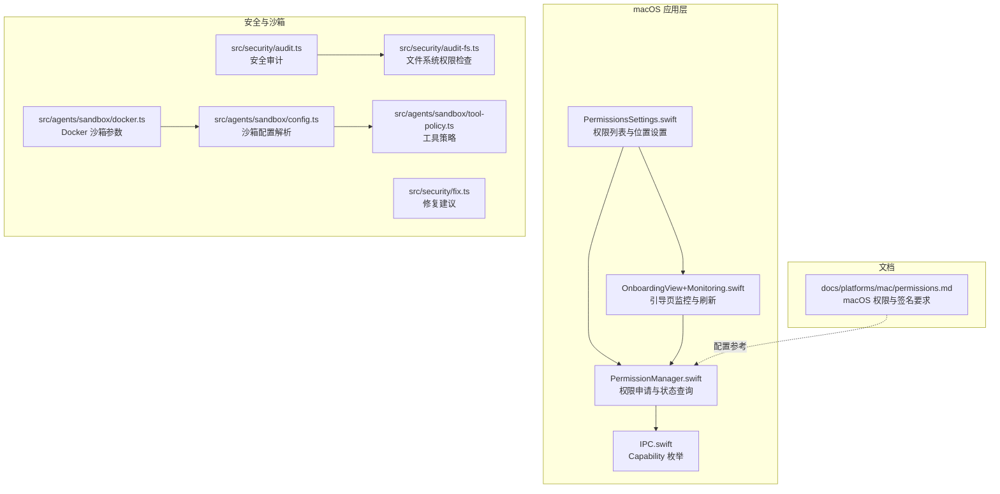
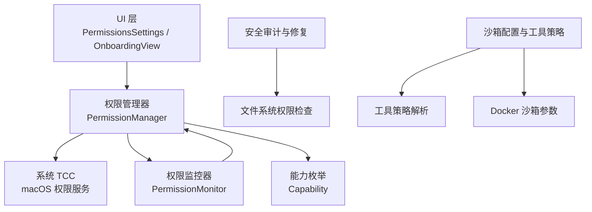
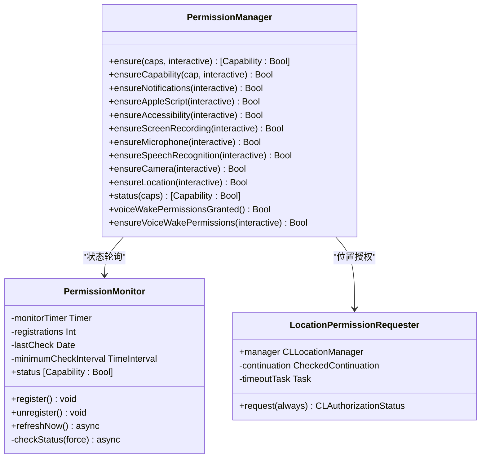
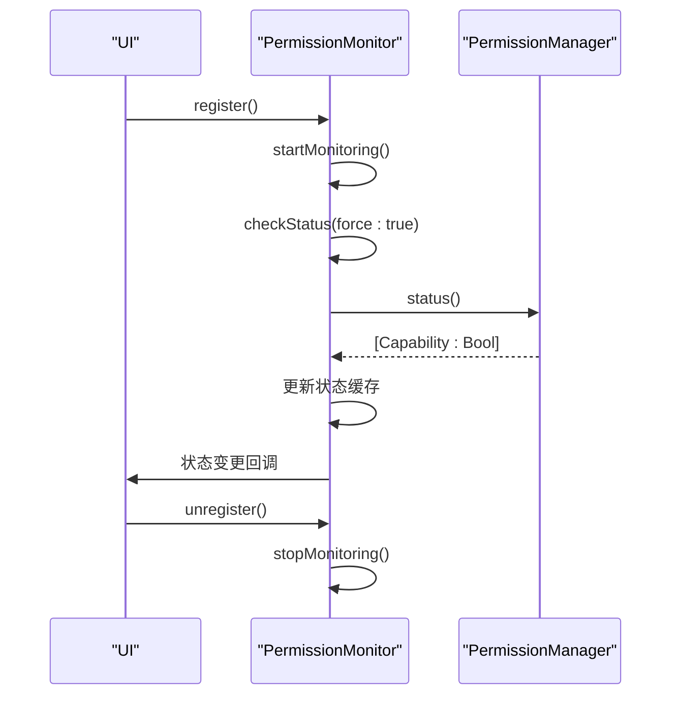
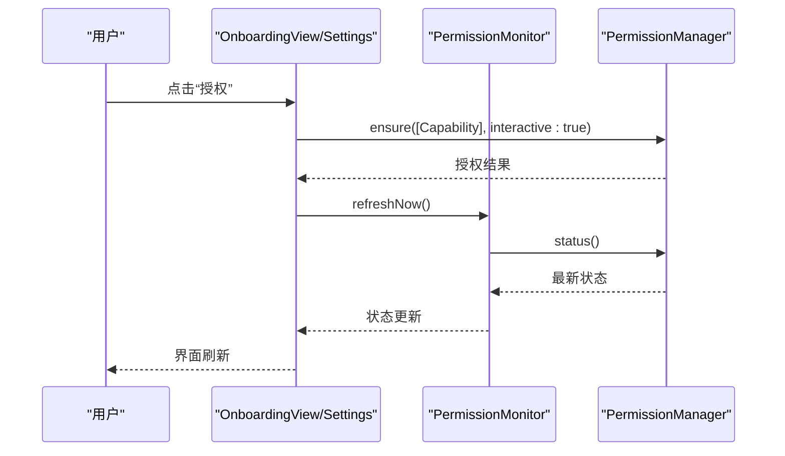
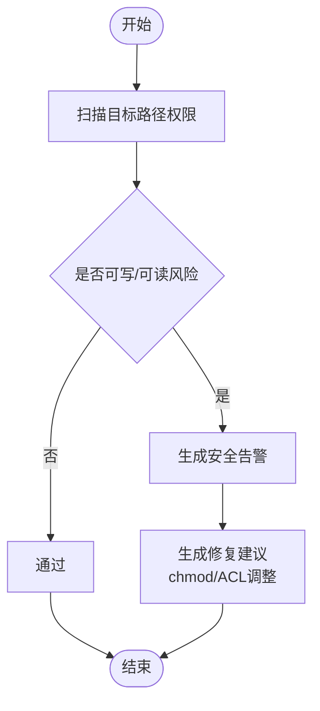
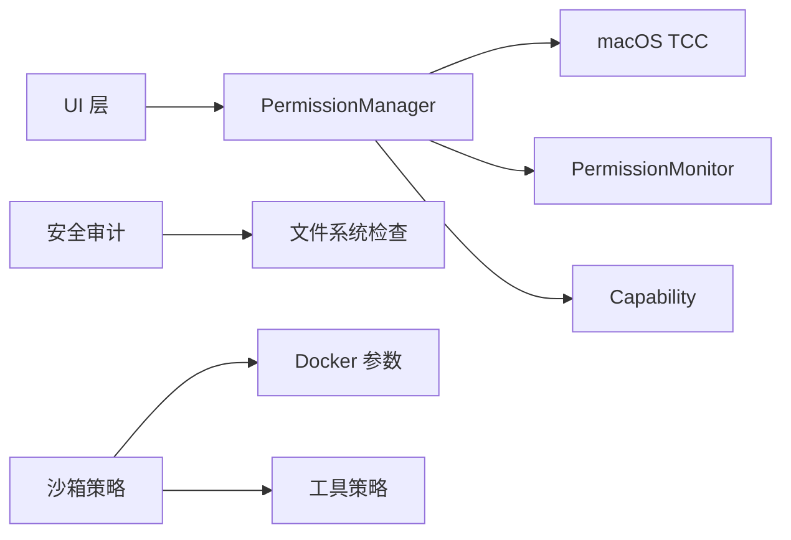

# 权限管理

<cite>
**本文引用的文件**
- [apps/macos/Sources/OpenClaw/PermissionManager.swift](file://apps/macos/Sources/OpenClaw/PermissionManager.swift)
- [apps/macos/Sources/OpenClaw/OnboardingView+Monitoring.swift](file://apps/macos/Sources/OpenClaw/OnboardingView+Monitoring.swift)
- [apps/macos/Sources/OpenClaw/PermissionsSettings.swift](file://apps/macos/Sources/OpenClaw/PermissionsSettings.swift)
- [apps/macos/Sources/OpenClawIPC/IPC.swift](file://apps/macos/Sources/OpenClawIPC/IPC.swift)
- [docs/platforms/mac/permissions.md](file://docs/platforms/mac/permissions.md)
- [src/agents/sandbox/docker.ts](file://src/agents/sandbox/docker.ts)
- [src/agents/sandbox/config.ts](file://src/agents/sandbox/config.ts)
- [src/agents/sandbox/tool-policy.ts](file://src/agents/sandbox/tool-policy.ts)
- [src/security/audit.ts](file://src/security/audit.ts)
- [src/security/audit-fs.ts](file://src/security/audit-fs.ts)
- [src/security/fix.ts](file://src/security/fix.ts)
- [src/infra/tailscale.ts](file://src/infra/tailscale.ts)
</cite>

## 目录

1. [简介](#简介)
2. [项目结构](#项目结构)
3. [核心组件](#核心组件)
4. [架构总览](#架构总览)
5. [详细组件分析](#详细组件分析)
6. [依赖关系分析](#依赖关系分析)
7. [性能考量](#性能考量)
8. [故障排查指南](#故障排查指南)
9. [结论](#结论)
10. [附录](#附录)

## 简介

本文件聚焦于 OpenClaw 在 macOS 平台上的节点权限管理，系统化阐述 macOS 权限模型、应用权限配置与安全策略实施，覆盖设备访问权限的申请流程、权限状态监控与用户授权管理，以及系统服务的权限要求、沙箱限制与安全边界。文档同时提供权限验证机制、错误处理与用户引导流程，并总结最佳实践、常见问题排查与解决方案，涵盖隐私保护、数据安全策略与合规性要求。

## 项目结构

围绕 macOS 节点权限管理的关键代码分布在以下模块：

- macOS 应用层：权限申请与状态展示、引导页监控与刷新
- IPC 层：能力枚举 Capability 的定义
- 文档：macOS 权限持久化与签名要求
- 安全审计与沙箱：文件系统权限检查、沙箱配置与工具策略

**图表来源**

- [apps/macos/Sources/OpenClaw/PermissionManager.swift](file://apps/macos/Sources/OpenClaw/PermissionManager.swift#L1-L507)
- [apps/macos/Sources/OpenClaw/PermissionsSettings.swift](file://apps/macos/Sources/OpenClaw/PermissionsSettings.swift#L1-L228)
- [apps/macos/Sources/OpenClaw/OnboardingView+Monitoring.swift](file://apps/macos/Sources/OpenClaw/OnboardingView+Monitoring.swift#L1-L179)
- [apps/macos/Sources/OpenClawIPC/IPC.swift](file://apps/macos/Sources/OpenClawIPC/IPC.swift#L1-L200)
- [docs/platforms/mac/permissions.md](file://docs/platforms/mac/permissions.md#L1-L51)
- [src/security/audit.ts](file://src/security/audit.ts#L197-L231)
- [src/security/audit-fs.ts](file://src/security/audit-fs.ts#L1-L84)
- [src/security/fix.ts](file://src/security/fix.ts#L44-L109)
- [src/agents/sandbox/docker.ts](file://src/agents/sandbox/docker.ts#L125-L168)
- [src/agents/sandbox/config.ts](file://src/agents/sandbox/config.ts#L113-L144)
- [src/agents/sandbox/tool-policy.ts](file://src/agents/sandbox/tool-policy.ts#L43-L79)

**章节来源**

- [apps/macos/Sources/OpenClaw/PermissionManager.swift](file://apps/macos/Sources/OpenClaw/PermissionManager.swift#L1-L507)
- [apps/macos/Sources/OpenClaw/PermissionsSettings.swift](file://apps/macos/Sources/OpenClaw/PermissionsSettings.swift#L1-L228)
- [apps/macos/Sources/OpenClaw/OnboardingView+Monitoring.swift](file://apps/macos/Sources/OpenClaw/OnboardingView+Monitoring.swift#L1-L179)
- [apps/macos/Sources/OpenClawIPC/IPC.swift](file://apps/macos/Sources/OpenClawIPC/IPC.swift#L1-L200)
- [docs/platforms/mac/permissions.md](file://docs/platforms/mac/permissions.md#L1-L51)
- [src/security/audit.ts](file://src/security/audit.ts#L197-L231)
- [src/security/audit-fs.ts](file://src/security/audit-fs.ts#L1-L84)
- [src/security/fix.ts](file://src/security/fix.ts#L44-L109)
- [src/agents/sandbox/docker.ts](file://src/agents/sandbox/docker.ts#L125-L168)
- [src/agents/sandbox/config.ts](file://src/agents/sandbox/config.ts#L113-L144)
- [src/agents/sandbox/tool-policy.ts](file://src/agents/sandbox/tool-policy.ts#L43-L79)

## 核心组件

- 权限管理器（PermissionManager）：封装各类 macOS 权限的检查、申请与状态查询，包括通知、AppleScript、辅助功能、屏幕录制、麦克风、语音识别、摄像头与位置权限。
- 权限监控器（PermissionMonitor）：周期性轮询并缓存权限状态，支持注册/注销以避免无谓开销。
- 引导页与设置视图（OnboardingView+Monitoring、PermissionsSettings）：负责权限状态展示、手动刷新、交互式授权请求与位置权限设置。
- 能力枚举（Capability）：统一描述节点所需的能力集合，供权限管理器与 UI 使用。
- 安全审计与沙箱：对文件系统权限进行检查与修复建议，结合沙箱配置与工具策略实现最小权限原则。

**章节来源**

- [apps/macos/Sources/OpenClaw/PermissionManager.swift](file://apps/macos/Sources/OpenClaw/PermissionManager.swift#L12-L228)
- [apps/macos/Sources/OpenClaw/PermissionsSettings.swift](file://apps/macos/Sources/OpenClaw/PermissionsSettings.swift#L6-L31)
- [apps/macos/Sources/OpenClaw/OnboardingView+Monitoring.swift](file://apps/macos/Sources/OpenClaw/OnboardingView+Monitoring.swift#L4-L28)
- [apps/macos/Sources/OpenClawIPC/IPC.swift](file://apps/macos/Sources/OpenClawIPC/IPC.swift#L1-L200)

## 架构总览

下图展示了 macOS 节点权限管理的整体架构：应用层通过 PermissionManager 与系统 TCC 对话，PermissionMonitor 负责状态轮询；UI 层提供可视化展示与交互；安全审计与沙箱策略保障最小权限与合规。

**图表来源**

- [apps/macos/Sources/OpenClaw/PermissionManager.swift](file://apps/macos/Sources/OpenClaw/PermissionManager.swift#L421-L490)
- [apps/macos/Sources/OpenClaw/PermissionsSettings.swift](file://apps/macos/Sources/OpenClaw/PermissionsSettings.swift#L99-L128)
- [apps/macos/Sources/OpenClaw/OnboardingView+Monitoring.swift](file://apps/macos/Sources/OpenClaw/OnboardingView+Monitoring.swift#L6-L28)
- [apps/macos/Sources/OpenClawIPC/IPC.swift](file://apps/macos/Sources/OpenClawIPC/IPC.swift#L1-L200)
- [src/security/audit-fs.ts](file://src/security/audit-fs.ts#L62-L84)
- [src/agents/sandbox/config.ts](file://src/agents/sandbox/config.ts#L126-L144)
- [src/agents/sandbox/tool-policy.ts](file://src/agents/sandbox/tool-policy.ts#L43-L79)
- [src/agents/sandbox/docker.ts](file://src/agents/sandbox/docker.ts#L125-L168)

## 详细组件分析

### 权限管理器（PermissionManager）

- 功能职责
  - 统一入口：接收能力数组，逐项调用对应 ensure 方法完成交互式或非交互式授权。
  - 各类权限处理：通知、AppleScript、辅助功能、屏幕录制、麦克风、语音识别、摄像头、位置。
  - 状态查询：批量查询当前授权状态，用于 UI 展示与监控。
  - 语音唤醒权限：组合麦克风与语音识别授权状态。
- 关键实现要点
  - 交互式授权：当权限未授予且允许交互时，触发系统提示或打开系统设置相应面板。
  - 系统设置导航：针对不同权限类型提供系统偏好设置的快捷跳转链接。
  - 位置权限：支持“使用期间”和“始终”，并在授权失败时引导至系统设置。
  - 辅助功能与屏幕录制：利用系统 API 进行预检与请求，兼容旧版本 macOS。
- 错误处理与用户引导
  - 当权限被拒绝或受限时，自动打开系统设置对应页面，减少用户操作成本。
  - 对于位置权限，若服务关闭或授权失败，引导用户前往系统设置。

**图表来源**

- [apps/macos/Sources/OpenClaw/PermissionManager.swift](file://apps/macos/Sources/OpenClaw/PermissionManager.swift#L25-L227)
- [apps/macos/Sources/OpenClaw/PermissionManager.swift](file://apps/macos/Sources/OpenClaw/PermissionManager.swift#L421-L490)
- [apps/macos/Sources/OpenClaw/PermissionManager.swift](file://apps/macos/Sources/OpenClaw/PermissionManager.swift#L291-L373)

**章节来源**

- [apps/macos/Sources/OpenClaw/PermissionManager.swift](file://apps/macos/Sources/OpenClaw/PermissionManager.swift#L12-L228)
- [apps/macos/Sources/OpenClaw/PermissionManager.swift](file://apps/macos/Sources/OpenClaw/PermissionManager.swift#L291-L373)

### 权限监控器（PermissionMonitor）

- 功能职责
  - 注册/注销：根据 UI 生命周期动态启动/停止轮询，避免常驻定时器带来的资源消耗。
  - 周期轮询：每秒检查一次权限状态，最小间隔 0.5 秒，防止抖动。
  - 状态缓存：仅在状态变化时更新，降低 UI 刷新频率。
- 性能与可靠性
  - 防抖：通过最小检查间隔与上次检查时间控制，避免频繁 I/O。
  - 测试环境适配：测试模式下不启动定时器，保证单元测试稳定性。

**图表来源**

- [apps/macos/Sources/OpenClaw/PermissionManager.swift](file://apps/macos/Sources/OpenClaw/PermissionManager.swift#L421-L490)

**章节来源**

- [apps/macos/Sources/OpenClaw/PermissionManager.swift](file://apps/macos/Sources/OpenClaw/PermissionManager.swift#L421-L490)

### 引导页与设置视图（OnboardingView+Monitoring、PermissionsSettings）

- 功能职责
  - 引导页监控：在权限页激活时注册监控，在离开时注销，避免后台轮询。
  - 手动刷新：提供“刷新”按钮，强制重新查询权限状态。
  - 交互式授权：点击“授权”按钮触发 PermissionManager.ensure，完成后刷新状态。
  - 位置权限设置：提供“关闭/使用期间/始终”三种模式，动态请求授权并回滚失败。
- 用户体验
  - 状态可视化：以图标与文字展示各权限的授权状态。
  - 快速跳转：针对未授权权限，一键打开系统设置相应面板。

**图表来源**

- [apps/macos/Sources/OpenClaw/OnboardingView+Monitoring.swift](file://apps/macos/Sources/OpenClaw/OnboardingView+Monitoring.swift#L6-L28)
- [apps/macos/Sources/OpenClaw/PermissionsSettings.swift](file://apps/macos/Sources/OpenClaw/PermissionsSettings.swift#L103-L128)
- [apps/macos/Sources/OpenClaw/PermissionManager.swift](file://apps/macos/Sources/OpenClaw/PermissionManager.swift#L25-L31)

**章节来源**

- [apps/macos/Sources/OpenClaw/OnboardingView+Monitoring.swift](file://apps/macos/Sources/OpenClaw/OnboardingView+Monitoring.swift#L4-L28)
- [apps/macos/Sources/OpenClaw/PermissionsSettings.swift](file://apps/macos/Sources/OpenClaw/PermissionsSettings.swift#L99-L128)

### 能力枚举（Capability）

- 作用：统一抽象节点所需能力，作为权限管理器与 UI 的契约。
- 能力范围：通知、AppleScript、辅助功能、屏幕录制、麦克风、语音识别、摄像头、位置。

**章节来源**

- [apps/macos/Sources/OpenClawIPC/IPC.swift](file://apps/macos/Sources/OpenClawIPC/IPC.swift#L1-L200)

### 安全审计与沙箱策略

- 文件系统权限检查：对配置文件与凭据目录进行权限扫描，识别世界可写/可读等高危风险，并给出修复建议。
- 沙箱配置：通过 Docker 参数实现只读根文件系统、网络隔离、能力降级、进程与内存限制等硬核加固。
- 工具策略：基于 allow/deny 模式与正则匹配，实现最小可用工具集，优先级遵循“代理覆盖 > 全局 > 默认”。

**图表来源**

- [src/security/audit.ts](file://src/security/audit.ts#L197-L231)
- [src/security/audit-fs.ts](file://src/security/audit-fs.ts#L62-L84)
- [src/security/fix.ts](file://src/security/fix.ts#L44-L109)

**章节来源**

- [src/security/audit.ts](file://src/security/audit.ts#L197-L231)
- [src/security/audit-fs.ts](file://src/security/audit-fs.ts#L1-L84)
- [src/security/fix.ts](file://src/security/fix.ts#L44-L109)
- [src/agents/sandbox/docker.ts](file://src/agents/sandbox/docker.ts#L125-L168)
- [src/agents/sandbox/config.ts](file://src/agents/sandbox/config.ts#L113-L144)
- [src/agents/sandbox/tool-policy.ts](file://src/agents/sandbox/tool-policy.ts#L43-L79)

## 依赖关系分析

- 组件耦合
  - PermissionManager 与 PermissionMonitor：弱耦合，通过状态缓存与最小刷新间隔降低耦合度。
  - UI 与 PermissionManager：通过交互式授权与状态刷新解耦，UI 不直接关心系统细节。
  - Capability 与 PermissionManager：通过枚举契约，确保能力定义与实现一致。
- 外部依赖
  - macOS TCC：所有权限申请最终依赖系统服务。
  - 系统设置与偏好：在权限被拒绝或未触发时，引导用户打开系统设置。
- 潜在循环依赖
  - 未发现循环依赖迹象；各模块职责清晰，接口稳定。

**图表来源**

- [apps/macos/Sources/OpenClaw/PermissionManager.swift](file://apps/macos/Sources/OpenClaw/PermissionManager.swift#L1-L507)
- [apps/macos/Sources/OpenClaw/PermissionsSettings.swift](file://apps/macos/Sources/OpenClaw/PermissionsSettings.swift#L1-L228)
- [apps/macos/Sources/OpenClaw/OnboardingView+Monitoring.swift](file://apps/macos/Sources/OpenClaw/OnboardingView+Monitoring.swift#L1-L179)
- [apps/macos/Sources/OpenClawIPC/IPC.swift](file://apps/macos/Sources/OpenClawIPC/IPC.swift#L1-L200)
- [src/security/audit-fs.ts](file://src/security/audit-fs.ts#L1-L84)
- [src/agents/sandbox/docker.ts](file://src/agents/sandbox/docker.ts#L125-L168)
- [src/agents/sandbox/tool-policy.ts](file://src/agents/sandbox/tool-policy.ts#L43-L79)

**章节来源**

- [apps/macos/Sources/OpenClaw/PermissionManager.swift](file://apps/macos/Sources/OpenClaw/PermissionManager.swift#L1-L507)
- [apps/macos/Sources/OpenClaw/PermissionsSettings.swift](file://apps/macos/Sources/OpenClaw/PermissionsSettings.swift#L1-L228)
- [apps/macos/Sources/OpenClaw/OnboardingView+Monitoring.swift](file://apps/macos/Sources/OpenClaw/OnboardingView+Monitoring.swift#L1-L179)
- [apps/macos/Sources/OpenClawIPC/IPC.swift](file://apps/macos/Sources/OpenClawIPC/IPC.swift#L1-L200)
- [src/security/audit-fs.ts](file://src/security/audit-fs.ts#L1-L84)
- [src/agents/sandbox/docker.ts](file://src/agents/sandbox/docker.ts#L125-L168)
- [src/agents/sandbox/tool-policy.ts](file://src/agents/sandbox/tool-policy.ts#L43-L79)

## 性能考量

- 轮询节流：PermissionMonitor 设置最小检查间隔与上次检查时间，避免频繁 I/O 与 UI 抖动。
- 注册/注销：仅在权限页激活时启动轮询，离开即停止，降低后台开销。
- 状态缓存：仅在状态变化时更新，减少不必要的界面刷新。
- 沙箱参数：通过只读根文件系统、能力降级与网络隔离，降低容器运行时的资源占用与攻击面。

[本节为通用指导，无需列出具体文件来源]

## 故障排查指南

- 权限提示消失或不弹窗
  - 确认应用签名与路径稳定，遵循文档要求的签名与路径一致性。
  - 清理系统设置中的旧条目或使用命令重置 TCC。
- 权限被拒绝
  - 自动打开系统设置相应面板；若仍失败，检查系统设置中的“始终”选项。
- 位置权限异常
  - 确认“始终”模式需要额外系统设置批准；若无效，尝试重启 macOS。
- 文件系统权限问题
  - 使用安全审计工具扫描配置与凭据目录，按建议调整权限。
- 沙箱内工具不可用
  - 检查工具策略与沙箱配置，确认 allow/deny 规则与优先级。

**章节来源**

- [docs/platforms/mac/permissions.md](file://docs/platforms/mac/permissions.md#L27-L51)
- [src/security/audit.ts](file://src/security/audit.ts#L197-L231)
- [src/security/audit-fs.ts](file://src/security/audit-fs.ts#L62-L84)
- [src/infra/tailscale.ts](file://src/infra/tailscale.ts#L251-L295)

## 结论

OpenClaw 在 macOS 节点权限管理上采用“统一入口 + 状态监控 + 可视化引导”的设计，既满足用户交互需求，又通过系统设置导航与最小权限策略降低安全风险。配合安全审计与沙箱策略，整体方案在易用性与安全性之间取得平衡，适合本地工作站与远程网关场景部署。

[本节为总结性内容，无需列出具体文件来源]

## 附录

- 最佳实践
  - 固定安装路径与签名证书，确保 TCC 授权持久有效。
  - 在 UI 中提供“刷新”与“授权”按钮，提升用户体验。
  - 严格限制沙箱工具集，遵循“默认拒绝 + 显式允许”的最小权限原则。
- 隐私与合规
  - 对敏感配置与凭据目录进行权限加固，避免世界可读/可写。
  - 通过安全审计工具定期扫描，及时修复风险项。

[本节为通用指导，无需列出具体文件来源]
