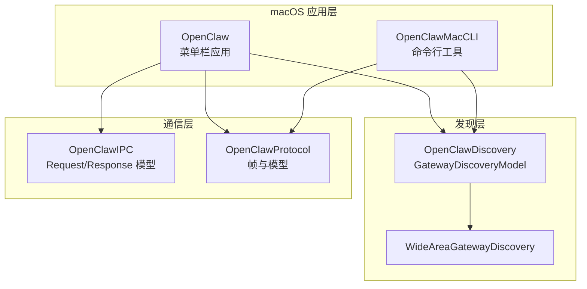
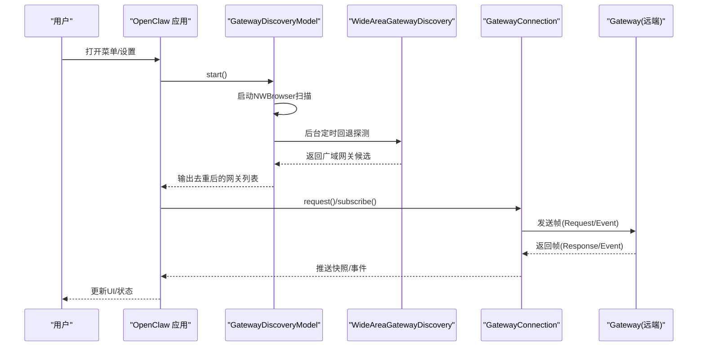
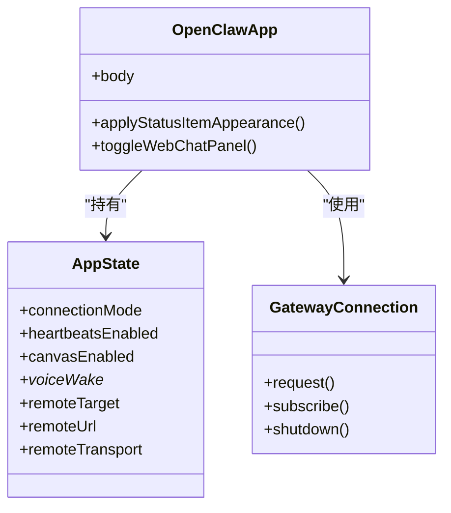
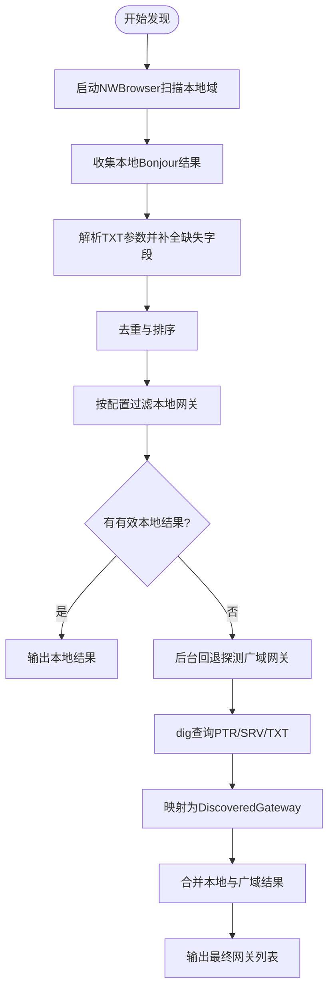
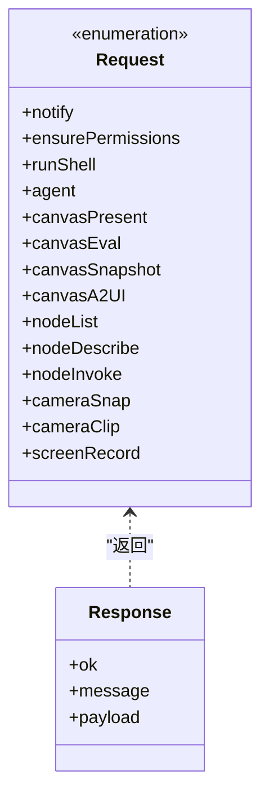
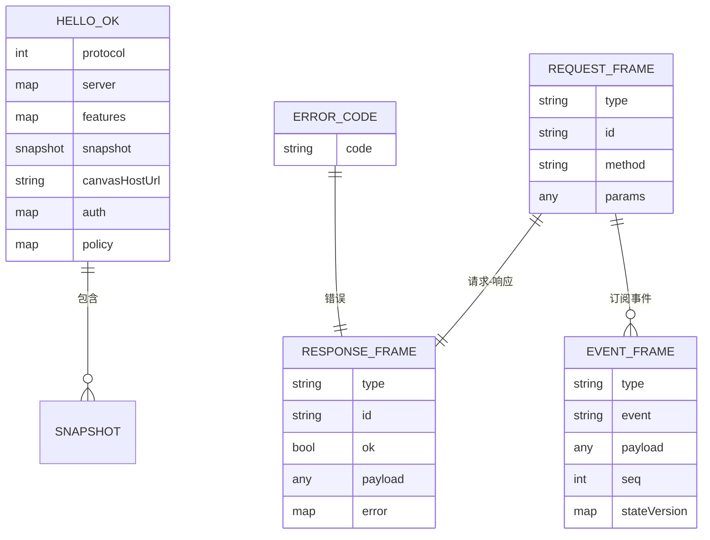
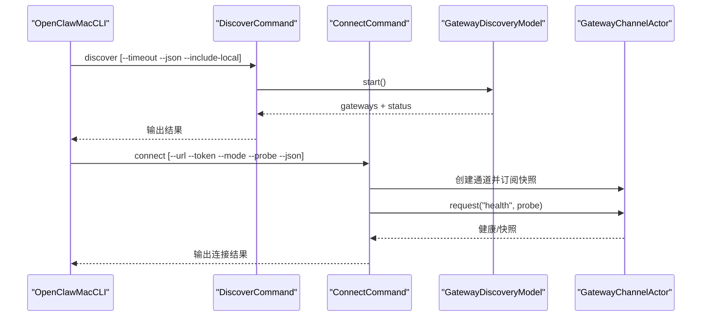
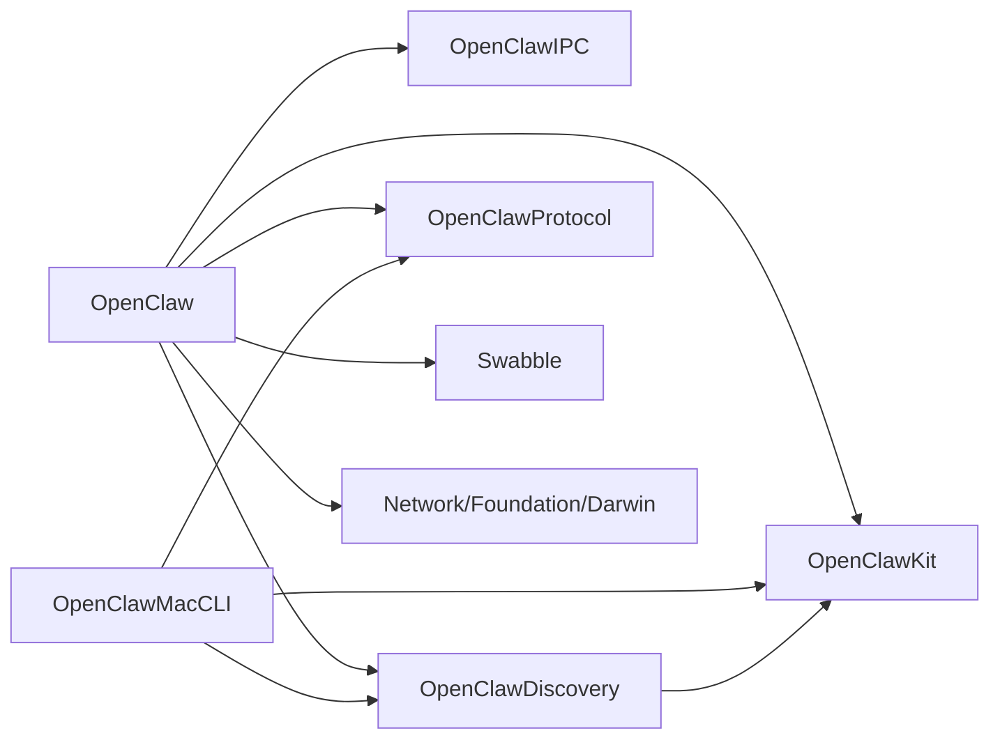

# 架构设计

<cite>
**本文引用的文件**
- [apps/macos/Package.swift](file://apps/macos/Package.swift)
- [apps/macos/README.md](file://apps/macos/README.md)
- [apps/macos/Sources/OpenClaw/MenuBar.swift](file://apps/macos/Sources/OpenClaw/MenuBar.swift)
- [apps/macos/Sources/OpenClaw/AppState.swift](file://apps/macos/Sources/OpenClaw/AppState.swift)
- [apps/macos/Sources/OpenClaw/GatewayConnection.swift](file://apps/macos/Sources/OpenClaw/GatewayConnection.swift)
- [apps/macos/Sources/OpenClawDiscovery/GatewayDiscoveryModel.swift](file://apps/macos/Sources/OpenClawDiscovery/GatewayDiscoveryModel.swift)
- [apps/macos/Sources/OpenClawDiscovery/WideAreaGatewayDiscovery.swift](file://apps/macos/Sources/OpenClawDiscovery/WideAreaGatewayDiscovery.swift)
- [apps/macos/Sources/OpenClawIPC/IPC.swift](file://apps/macos/Sources/OpenClawIPC/IPC.swift)
- [apps/macos/Sources/OpenClawProtocol/GatewayModels.swift](file://apps/macos/Sources/OpenClawProtocol/GatewayModels.swift)
- [apps/macos/Sources/OpenClawMacCLI/EntryPoint.swift](file://apps/macos/Sources/OpenClawMacCLI/EntryPoint.swift)
- [apps/macos/Sources/OpenClawMacCLI/DiscoverCommand.swift](file://apps/macos/Sources/OpenClawMacCLI/DiscoverCommand.swift)
- [apps/macos/Sources/OpenClawMacCLI/ConnectCommand.swift](file://apps/macos/Sources/OpenClawMacCLI/ConnectCommand.swift)
</cite>

## 目录

1. [引言](#引言)
2. [项目结构](#项目结构)
3. [核心组件](#核心组件)
4. [架构总览](#架构总览)
5. [组件详细分析](#组件详细分析)
6. [依赖关系分析](#依赖关系分析)
7. [性能考虑](#性能考虑)
8. [故障排查指南](#故障排查指南)
9. [结论](#结论)
10. [附录](#附录)

## 引言

本文件面向OpenClaw macOS节点架构，系统化阐述OpenClaw主应用、OpenClawDiscovery发现组件与OpenClawProtocol通信协议的设计理念与实现细节。文档聚焦以下目标：

- 整体架构：菜单栏应用如何协调连接、发现、IPC与协议通信
- 组件交互：各模块职责边界、数据流与控制流
- 发现机制：基于Bonjour与广域DNS-SD的双通道网关发现
- 协议通信：帧模型、错误码与会话状态管理
- 解耦设计：通过库产物与接口契约实现松耦合
- 性能与扩展：并发、重试、降级与可演进的协议版本

## 项目结构

OpenClaw macOS子包由多个目标组成，采用清晰的分层与职责分离：

- OpenClaw（菜单栏应用）：UI、状态管理、连接协调、服务编排
- OpenClawDiscovery（发现组件）：本地与广域网关发现、去重与过滤
- OpenClawIPC（IPC协议）：跨进程请求/响应模型与传输路径
- OpenClawProtocol（协议模型）：WebSocket帧定义、错误码、快照与参数结构
- OpenClawMacCLI（命令行工具）：连接探测、发现查询与向导流程

**图表来源**

- [apps/macos/Package.swift](file://apps/macos/Package.swift#L26-L57)
- [apps/macos/Sources/OpenClaw/MenuBar.swift](file://apps/macos/Sources/OpenClaw/MenuBar.swift#L10-L92)
- [apps/macos/Sources/OpenClawDiscovery/GatewayDiscoveryModel.swift](file://apps/macos/Sources/OpenClawDiscovery/GatewayDiscoveryModel.swift#L81-L144)
- [apps/macos/Sources/OpenClawDiscovery/WideAreaGatewayDiscovery.swift](file://apps/macos/Sources/OpenClawDiscovery/WideAreaGatewayDiscovery.swift#L33-L102)
- [apps/macos/Sources/OpenClawIPC/IPC.swift](file://apps/macos/Sources/OpenClawIPC/IPC.swift#L108-L136)
- [apps/macos/Sources/OpenClawProtocol/GatewayModels.swift](file://apps/macos/Sources/OpenClawProtocol/GatewayModels.swift#L5-L140)

**章节来源**

- [apps/macos/Package.swift](file://apps/macos/Package.swift#L6-L57)
- [apps/macos/README.md](file://apps/macos/README.md#L1-L65)

## 核心组件

- OpenClaw（菜单栏应用）
  - 负责应用生命周期、状态持久化、UI与系统集成
  - 协调连接模式（本地/远程）、心跳、权限与工作态
  - 作为上层调用者，使用GatewayConnection进行协议通信
- OpenClawDiscovery
  - 基于NWBrowser的本地Bonjour服务发现
  - 广域网关通过dig + DNS-SD轮询，回退到本地结果
  - 提供去重、排序、本地网关过滤与状态文本
- OpenClawIPC
  - 定义请求类型（通知、权限、Shell执行、Canvas操作、节点能力等）
  - 统一编码/解码与传输路径（套接字）
- OpenClawProtocol
  - 定义帧结构（Request/Response/Event）、错误码、快照与参数
  - 支持多客户端连接、会话键别名解析与推送订阅
- OpenClawMacCLI
  - 提供discover/connect/wizard三类命令
  - 以最小依赖直接调用发现与协议能力

**章节来源**

- [apps/macos/Sources/OpenClaw/MenuBar.swift](file://apps/macos/Sources/OpenClaw/MenuBar.swift#L10-L92)
- [apps/macos/Sources/OpenClaw/AppState.swift](file://apps/macos/Sources/OpenClaw/AppState.swift#L21-L331)
- [apps/macos/Sources/OpenClaw/GatewayConnection.swift](file://apps/macos/Sources/OpenClaw/GatewayConnection.swift#L47-L383)
- [apps/macos/Sources/OpenClawDiscovery/GatewayDiscoveryModel.swift](file://apps/macos/Sources/OpenClawDiscovery/GatewayDiscoveryModel.swift#L81-L352)
- [apps/macos/Sources/OpenClawDiscovery/WideAreaGatewayDiscovery.swift](file://apps/macos/Sources/OpenClawDiscovery/WideAreaGatewayDiscovery.swift#L33-L102)
- [apps/macos/Sources/OpenClawIPC/IPC.swift](file://apps/macos/Sources/OpenClawIPC/IPC.swift#L108-L418)
- [apps/macos/Sources/OpenClawProtocol/GatewayModels.swift](file://apps/macos/Sources/OpenClawProtocol/GatewayModels.swift#L5-L140)
- [apps/macos/Sources/OpenClawMacCLI/EntryPoint.swift](file://apps/macos/Sources/OpenClawMacCLI/EntryPoint.swift#L8-L30)

## 架构总览

OpenClaw macOS节点采用“应用层-发现层-通信层-协议层”的分层设计，核心交互如下：

- 应用层通过状态机与连接器管理连接模式与生命周期
- 发现层提供本地与广域网关列表，支持过滤与回退
- 通信层封装WebSocket通道与帧模型，提供统一请求/订阅接口
- 协议层定义消息语义、错误处理与会话状态

**图表来源**

- [apps/macos/Sources/OpenClaw/MenuBar.swift](file://apps/macos/Sources/OpenClaw/MenuBar.swift#L41-L92)
- [apps/macos/Sources/OpenClawDiscovery/GatewayDiscoveryModel.swift](file://apps/macos/Sources/OpenClawDiscovery/GatewayDiscoveryModel.swift#L81-L144)
- [apps/macos/Sources/OpenClawDiscovery/WideAreaGatewayDiscovery.swift](file://apps/macos/Sources/OpenClawDiscovery/WideAreaGatewayDiscovery.swift#L246-L277)
- [apps/macos/Sources/OpenClaw/GatewayConnection.swift](file://apps/macos/Sources/OpenClaw/GatewayConnection.swift#L118-L209)

## 组件详细分析

### OpenClaw 主应用（菜单栏）

- 角色定位
  - 应用入口与生命周期管理
  - 状态中心（连接模式、权限、工作态、心跳等）
  - UI与系统交互（菜单、悬浮窗、权限提示）
- 关键行为
  - 初始化状态并监听配置变更
  - 根据连接模式切换本地/远程控制通道
  - 集成更新器、调试面板、画布窗口与语音唤醒

**图表来源**

- [apps/macos/Sources/OpenClaw/MenuBar.swift](file://apps/macos/Sources/OpenClaw/MenuBar.swift#L10-L92)
- [apps/macos/Sources/OpenClaw/AppState.swift](file://apps/macos/Sources/OpenClaw/AppState.swift#L21-L331)
- [apps/macos/Sources/OpenClaw/GatewayConnection.swift](file://apps/macos/Sources/OpenClaw/GatewayConnection.swift#L47-L114)

**章节来源**

- [apps/macos/Sources/OpenClaw/MenuBar.swift](file://apps/macos/Sources/OpenClaw/MenuBar.swift#L10-L207)
- [apps/macos/Sources/OpenClaw/AppState.swift](file://apps/macos/Sources/OpenClaw/AppState.swift#L21-L331)

### OpenClawDiscovery 发现组件

- 设计要点
  - 本地：NWBrowser + Bonjour服务浏览，按域聚合结果
  - 广域：通过dig查询DNS-SD PTR/SRV/TXT，解析TXT参数
  - 去重与过滤：按稳定ID去重；可过滤本地网关；按显示名美化
  - 回退策略：在无本地结果时，后台持续探测广域网关
- 数据结构
  - DiscoveredGateway：包含展示名、主机、端口、稳定ID与是否本地
  - GatewayTXT：从TXT中提取lanHost/tailnetDns/ssh/gateway端口/cli路径
  - WideAreaGatewayBeacon：广域网关探测结果载体

**图表来源**

- [apps/macos/Sources/OpenClawDiscovery/GatewayDiscoveryModel.swift](file://apps/macos/Sources/OpenClawDiscovery/GatewayDiscoveryModel.swift#L81-L185)
- [apps/macos/Sources/OpenClawDiscovery/WideAreaGatewayDiscovery.swift](file://apps/macos/Sources/OpenClawDiscovery/WideAreaGatewayDiscovery.swift#L33-L102)

**章节来源**

- [apps/macos/Sources/OpenClawDiscovery/GatewayDiscoveryModel.swift](file://apps/macos/Sources/OpenClawDiscovery/GatewayDiscoveryModel.swift#L81-L352)
- [apps/macos/Sources/OpenClawDiscovery/WideAreaGatewayDiscovery.swift](file://apps/macos/Sources/OpenClawDiscovery/WideAreaGatewayDiscovery.swift#L33-L375)

### OpenClawIPC IPC 协议

- 请求类型
  - 通知、权限检查、Shell执行、Canvas操作（展示/隐藏/脚本/截图/A2UI）、节点能力（枚举/描述/调用）、相机/屏幕录制等
- 编码与传输
  - 使用统一的Request枚举与自定义Codable，区分类型字段
  - 控制套接字路径固定，便于跨进程通信
- 适用场景
  - 菜单栏应用与Canvas窗口、系统权限与媒体访问的桥接

**图表来源**

- [apps/macos/Sources/OpenClawIPC/IPC.swift](file://apps/macos/Sources/OpenClawIPC/IPC.swift#L108-L418)

**章节来源**

- [apps/macos/Sources/OpenClawIPC/IPC.swift](file://apps/macos/Sources/OpenClawIPC/IPC.swift#L6-L418)

### OpenClawProtocol 通信协议

- 帧模型
  - RequestFrame/ResponseFrame/EventFrame：统一的请求/响应/事件帧
  - 错误码ErrorCode：未关联/未配对/超时/无效请求/不可用等
- 快照与状态
  - HelloOk：握手成功后携带协议版本、服务器信息、特性、快照与策略
  - Snapshot：包含presence/health/stateVersion/uptime等
- 方法集
  - agent/status/set-heartbeats/system-event/health/config/\*、talk.mode、技能/会话/聊天/语音唤醒/节点配对/设备配对/Cron等

**图表来源**

- [apps/macos/Sources/OpenClawProtocol/GatewayModels.swift](file://apps/macos/Sources/OpenClawProtocol/GatewayModels.swift#L5-L140)
- [apps/macos/Sources/OpenClawProtocol/GatewayModels.swift](file://apps/macos/Sources/OpenClawProtocol/GatewayModels.swift#L117-L198)

**章节来源**

- [apps/macos/Sources/OpenClawProtocol/GatewayModels.swift](file://apps/macos/Sources/OpenClawProtocol/GatewayModels.swift#L5-L800)

### OpenClawMacCLI 命令行工具

- 命令
  - connect：连接网关并打印健康/快照信息，支持覆盖角色、作用域、客户端标识与探测
  - discover：扫描网关，支持超时、JSON输出与包含本地网关
  - wizard：引导向导（与应用内向导一致）
- 实现要点
  - discover：直接构造GatewayDiscoveryModel并启动/停止
  - connect：构造GatewayChannelActor，发送health请求并订阅快照

**图表来源**

- [apps/macos/Sources/OpenClawMacCLI/EntryPoint.swift](file://apps/macos/Sources/OpenClawMacCLI/EntryPoint.swift#L8-L30)
- [apps/macos/Sources/OpenClawMacCLI/DiscoverCommand.swift](file://apps/macos/Sources/OpenClawMacCLI/DiscoverCommand.swift#L57-L149)
- [apps/macos/Sources/OpenClawMacCLI/ConnectCommand.swift](file://apps/macos/Sources/OpenClawMacCLI/ConnectCommand.swift#L100-L194)

**章节来源**

- [apps/macos/Sources/OpenClawMacCLI/EntryPoint.swift](file://apps/macos/Sources/OpenClawMacCLI/EntryPoint.swift#L8-L57)
- [apps/macos/Sources/OpenClawMacCLI/DiscoverCommand.swift](file://apps/macos/Sources/OpenClawMacCLI/DiscoverCommand.swift#L1-L150)
- [apps/macos/Sources/OpenClawMacCLI/ConnectCommand.swift](file://apps/macos/Sources/OpenClawMacCLI/ConnectCommand.swift#L1-L354)

## 依赖关系分析

- 包依赖与产品
  - OpenClaw目标依赖OpenClawIPC、OpenClawDiscovery、OpenClawKit、OpenClawProtocol、Swabble、MenuBarExtraAccess、Subprocess、Logging、Sparkle、Peekaboo
  - OpenClawMacCLI依赖OpenClawDiscovery、OpenClawKit、OpenClawProtocol
- 内聚与耦合
  - 发现层与协议层通过OpenClawKit抽象解耦
  - 应用层仅通过GatewayConnection与协议层交互，避免直接依赖底层网络细节
- 外部依赖
  - Network.framework（Bonjour/NWBrowser）、Foundation（NetService）、Darwin（getifaddrs）

**图表来源**

- [apps/macos/Package.swift](file://apps/macos/Package.swift#L26-L57)

**章节来源**

- [apps/macos/Package.swift](file://apps/macos/Package.swift#L6-L93)

## 性能考虑

- 发现阶段
  - 本地扫描与广域回退并行推进，避免阻塞UI线程
  - 对TXT解析与去重采用集合去重，减少重复计算
- 通信阶段
  - GatewayConnection使用actor隔离共享状态，避免竞态
  - 自动重连与降级：本地模式下自动拉起/附加网关并重试；远程模式下重建隧道后重试
  - 订阅缓冲：AsyncStream缓冲最新N条推送，降低丢帧风险
- IPC阶段
  - 固定套接字路径，避免动态查找开销
  - 请求类型明确，序列化开销可控

[本节为通用指导，无需特定文件引用]

## 故障排查指南

- 发现问题
  - 若Bonjour无结果，检查本地网络与DNS-SD可用性；确认广域回退任务是否运行
  - 本地过滤导致列表为空时，尝试开启包含本地选项
- 连接问题
  - 本地模式：确认网关进程状态与端口；必要时触发自动激活
  - 远程模式：检查隧道是否建立成功；必要时清理并重建
- 协议问题
  - 关注错误码（未配对/未关联/超时/不可用），结合日志定位
  - 快照中的协议版本与服务器信息可用于诊断兼容性

**章节来源**

- [apps/macos/Sources/OpenClawDiscovery/GatewayDiscoveryModel.swift](file://apps/macos/Sources/OpenClawDiscovery/GatewayDiscoveryModel.swift#L314-L352)
- [apps/macos/Sources/OpenClaw/GatewayConnection.swift](file://apps/macos/Sources/OpenClaw/GatewayConnection.swift#L136-L209)
- [apps/macos/Sources/OpenClawProtocol/GatewayModels.swift](file://apps/macos/Sources/OpenClawProtocol/GatewayModels.swift#L7-L14)

## 结论

OpenClaw macOS节点通过清晰的分层与解耦设计，实现了稳定的发现、通信与应用体验。发现层兼顾本地与广域场景，通信层以协议模型与订阅机制保障实时性，应用层以状态机与UI驱动提升可用性。该架构具备良好的扩展性与可维护性，适合在多平台与多场景下演进。

[本节为总结，无需特定文件引用]

## 附录

- 开发与打包
  - 提供快速启动脚本与签名/打包流程，支持开发与发布签名策略
- 命令行参考
  - discover/connect/wizard命令行参数与示例

**章节来源**

- [apps/macos/README.md](file://apps/macos/README.md#L1-L65)
- [apps/macos/Sources/OpenClawMacCLI/EntryPoint.swift](file://apps/macos/Sources/OpenClawMacCLI/EntryPoint.swift#L37-L56)
