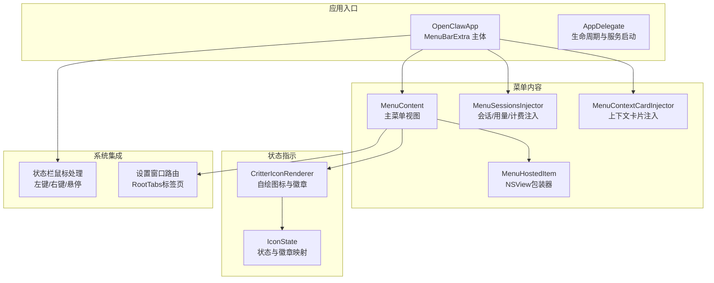
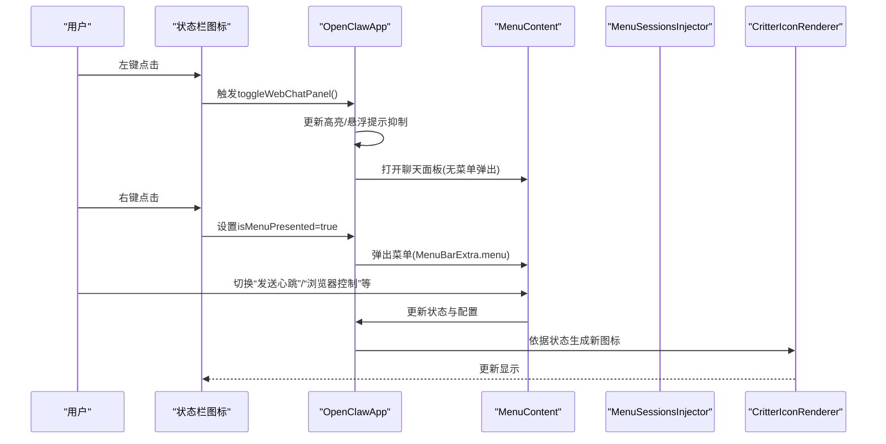
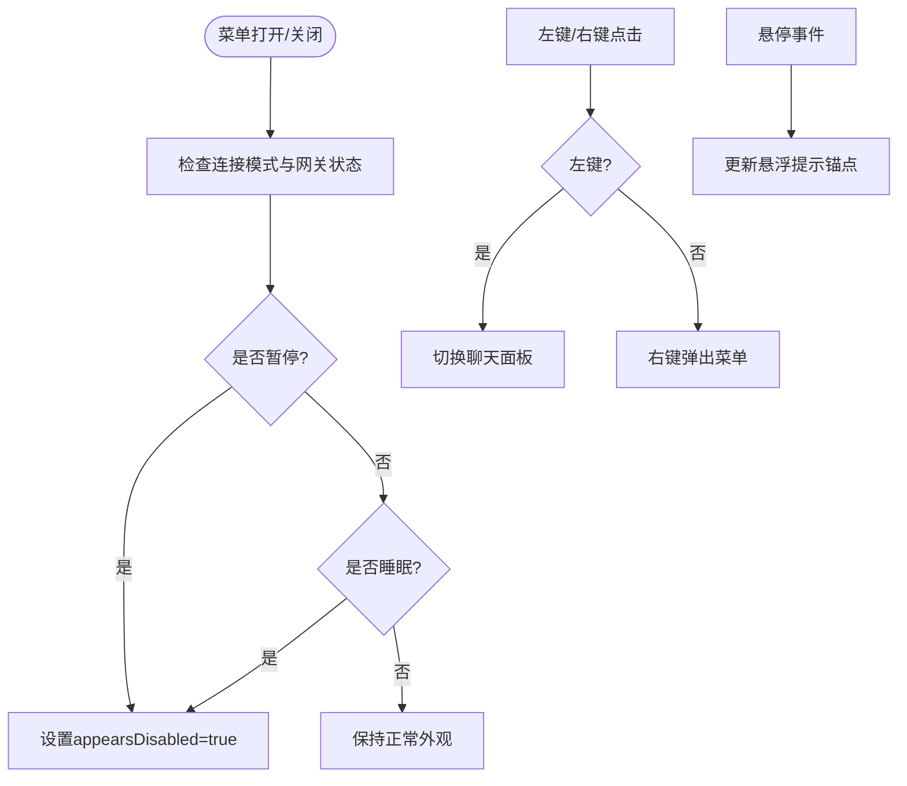
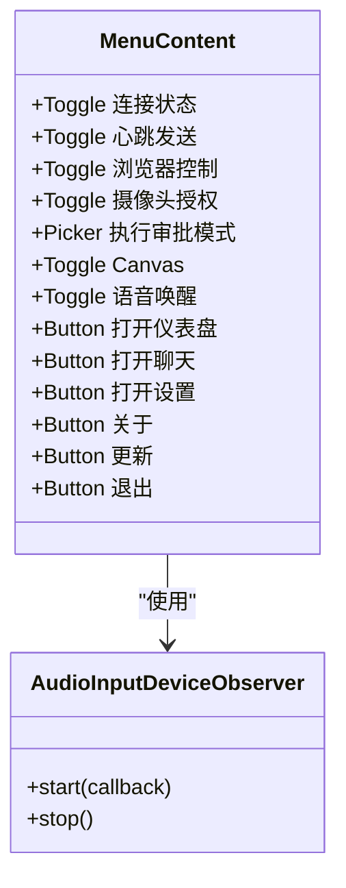
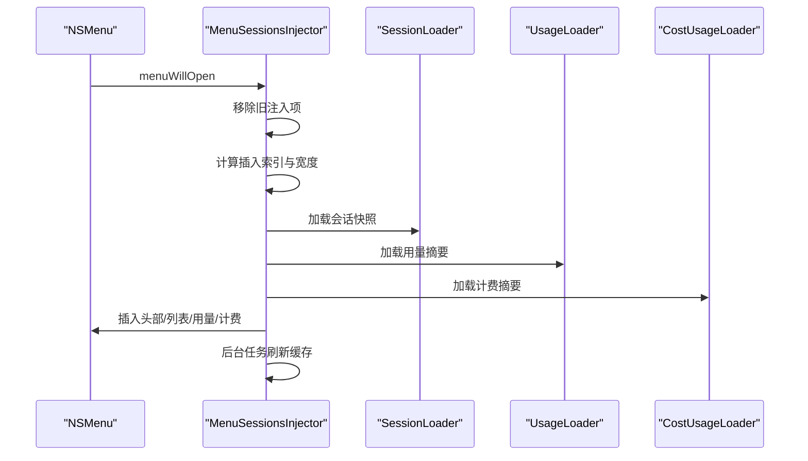
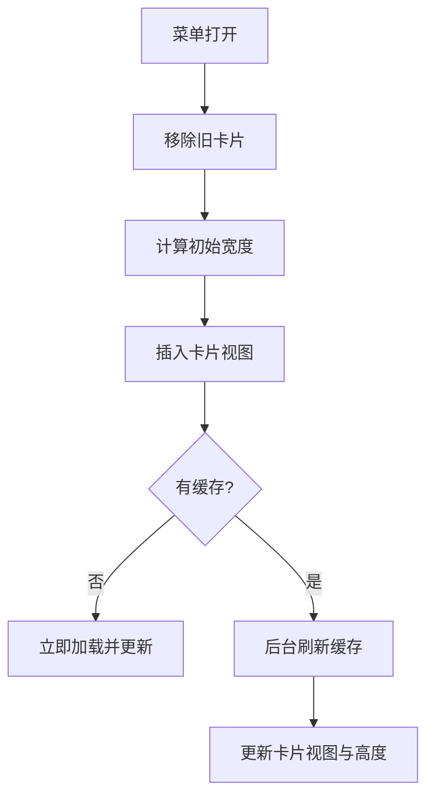
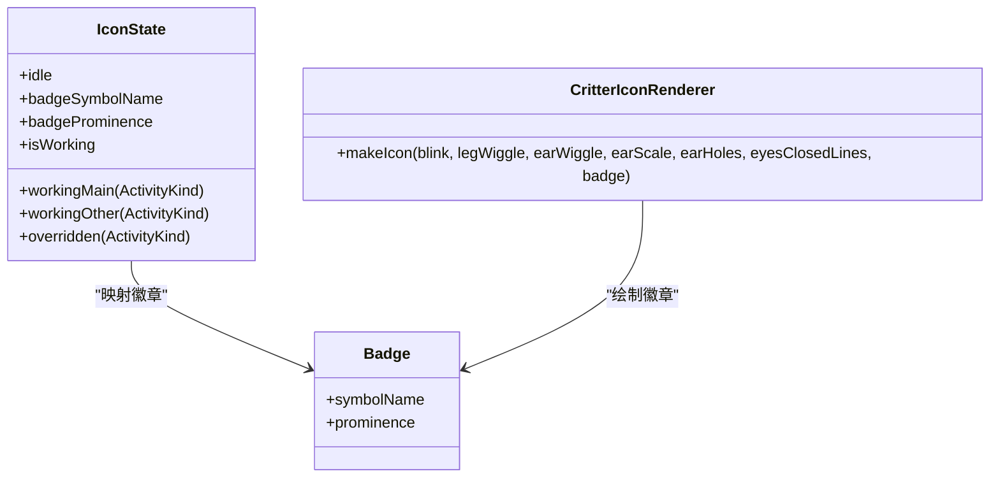
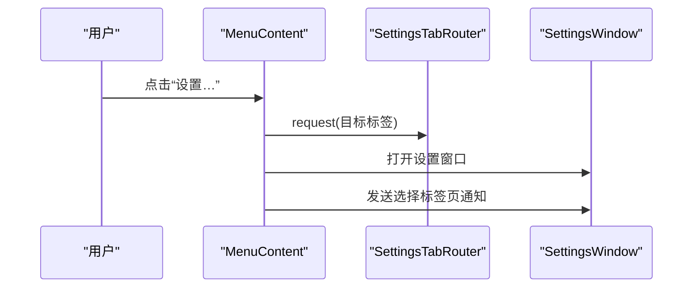
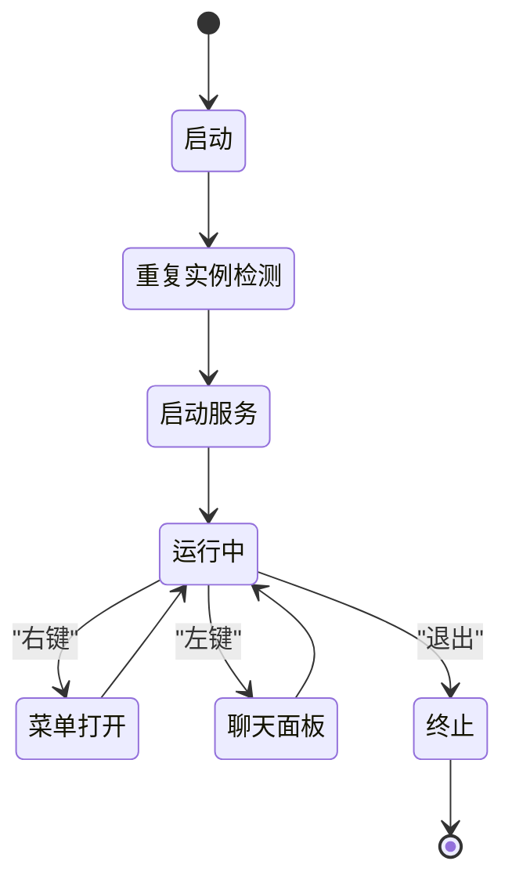
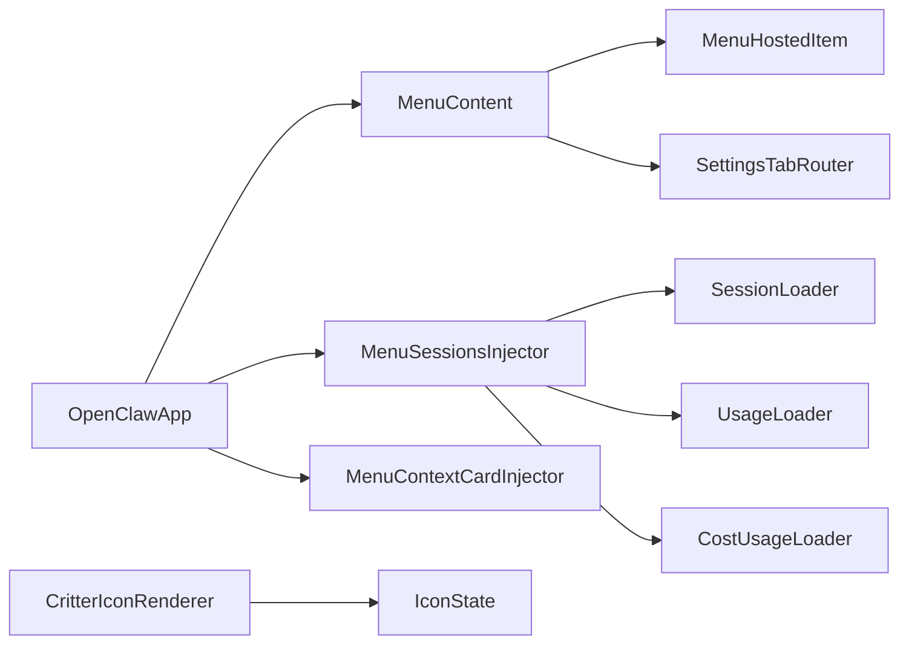

# 菜单栏控制

<cite>
**本文引用的文件**
- [apps/macos/Sources/OpenClaw/MenuBar.swift](file://apps/macos/Sources/OpenClaw/MenuBar.swift)
- [apps/macos/Sources/OpenClaw/MenuContentView.swift](file://apps/macos/Sources/OpenClaw/MenuContentView.swift)
- [apps/macos/Sources/OpenClaw/MenuSessionsInjector.swift](file://apps/macos/Sources/OpenClaw/MenuSessionsInjector.swift)
- [apps/macos/Sources/OpenClaw/MenuContextCardInjector.swift](file://apps/macos/Sources/OpenClaw/MenuContextCardInjector.swift)
- [apps/macos/Sources/OpenClaw/MenuHostedItem.swift](file://apps/macos/Sources/OpenClaw/MenuHostedItem.swift)
- [apps/macos/Sources/OpenClaw/CritterIconRenderer.swift](file://apps/macos/Sources/OpenClaw/CritterIconRenderer.swift)
- [apps/macos/Sources/OpenClaw/IconState.swift](file://apps/macos/Sources/OpenClaw/IconState.swift)
- [apps/macos/README.md](file://apps/macos/README.md)
</cite>

## 目录

1. [简介](#简介)
2. [项目结构](#项目结构)
3. [核心组件](#核心组件)
4. [架构总览](#架构总览)
5. [详细组件分析](#详细组件分析)
6. [依赖关系分析](#依赖关系分析)
7. [性能考量](#性能考量)
8. [故障排除指南](#故障排除指南)
9. [结论](#结论)
10. [附录](#附录)

## 简介

本文件面向OpenClaw在macOS平台的菜单栏控制能力，系统化阐述菜单栏应用的实现架构、状态显示机制与用户交互设计。内容覆盖：

- 菜单栏入口与外观：MenuBarExtra风格、状态指示器（图标与徽章）、悬停与点击行为
- 菜单项组织结构：会话卡片注入、节点设备列表、用量与计费信息、快捷操作按钮
- RootTabs标签页切换：通过设置窗口路由实现的“设置”标签页导航
- 生命周期管理：应用启动/终止、重复实例检测、更新器集成
- 内存优化与系统集成：菜单缓存策略、视图尺寸适配、模板图像渲染
- 配置选项与自定义：连接模式、执行审批模式、浏览器控制开关、日志级别等
- 故障排除：常见问题定位与建议

## 项目结构

OpenClaw macOS端采用SwiftUI + AppKit混合架构，菜单栏主体由MenuBarExtra驱动，配合NSMenuDelegate注入自定义视图与子菜单，状态指示器以自绘NSImage实现。

图表来源

- [apps/macos/Sources/OpenClaw/MenuBar.swift](file://apps/macos/Sources/OpenClaw/MenuBar.swift#L10-L92)
- [apps/macos/Sources/OpenClaw/MenuContentView.swift](file://apps/macos/Sources/OpenClaw/MenuContentView.swift#L8-L33)
- [apps/macos/Sources/OpenClaw/MenuSessionsInjector.swift](file://apps/macos/Sources/OpenClaw/MenuSessionsInjector.swift#L6-L58)
- [apps/macos/Sources/OpenClaw/MenuContextCardInjector.swift](file://apps/macos/Sources/OpenClaw/MenuContextCardInjector.swift#L4-L33)
- [apps/macos/Sources/OpenClaw/MenuHostedItem.swift](file://apps/macos/Sources/OpenClaw/MenuHostedItem.swift#L8-L29)
- [apps/macos/Sources/OpenClaw/CritterIconRenderer.swift](file://apps/macos/Sources/OpenClaw/CritterIconRenderer.swift#L3-L19)
- [apps/macos/Sources/OpenClaw/IconState.swift](file://apps/macos/Sources/OpenClaw/IconState.swift#L18-L67)

章节来源

- [apps/macos/Sources/OpenClaw/MenuBar.swift](file://apps/macos/Sources/OpenClaw/MenuBar.swift#L10-L92)
- [apps/macos/Sources/OpenClaw/MenuContentView.swift](file://apps/macos/Sources/OpenClaw/MenuContentView.swift#L8-L33)

## 核心组件

- OpenClawApp：应用主入口，定义MenuBarExtra主体、状态栏外观与菜单呈现绑定，负责菜单打开/关闭时的高亮与悬浮提示抑制。
- MenuContent：菜单主视图，包含连接状态、心跳发送、浏览器控制、摄像头授权、执行审批模式、Canvas开关、语音唤醒、聊天/仪表盘/关于/退出等快捷操作。
- MenuSessionsInjector：NSMenuDelegate实现，负责在菜单打开时注入会话卡片、节点设备列表、用量与计费图表，并维护缓存与刷新策略。
- MenuContextCardInjector：上下文卡片注入器，向菜单顶部插入一个可随菜单宽度自适应的会话预览卡片。
- MenuHostedItem：将任意SwiftUI视图包装为NSHostingView，嵌入到NSMenuItem.view中，确保在MenuBarExtra.menu风格下仍能保留复杂布局。
- CritterIconRenderer与IconState：自绘菜单栏图标与徽章，根据工作状态、工具类型与覆盖选择生成不同样式与颜色。
- AppDelegate：应用生命周期管理，包括重复实例检测、服务启动/停止、信号监听、首次引导等。

章节来源

- [apps/macos/Sources/OpenClaw/MenuBar.swift](file://apps/macos/Sources/OpenClaw/MenuBar.swift#L10-L92)
- [apps/macos/Sources/OpenClaw/MenuContentView.swift](file://apps/macos/Sources/OpenClaw/MenuContentView.swift#L8-L33)
- [apps/macos/Sources/OpenClaw/MenuSessionsInjector.swift](file://apps/macos/Sources/OpenClaw/MenuSessionsInjector.swift#L6-L58)
- [apps/macos/Sources/OpenClaw/MenuContextCardInjector.swift](file://apps/macos/Sources/OpenClaw/MenuContextCardInjector.swift#L4-L33)
- [apps/macos/Sources/OpenClaw/MenuHostedItem.swift](file://apps/macos/Sources/OpenClaw/MenuHostedItem.swift#L8-L29)
- [apps/macos/Sources/OpenClaw/CritterIconRenderer.swift](file://apps/macos/Sources/OpenClaw/CritterIconRenderer.swift#L106-L149)
- [apps/macos/Sources/OpenClaw/IconState.swift](file://apps/macos/Sources/OpenClaw/IconState.swift#L18-L67)

## 架构总览

菜单栏应用通过MenuBarExtra构建主入口，状态栏图标由自绘NSImage提供，菜单内容由SwiftUI视图构成并通过NSViewRepresentable桥接到AppKit菜单系统。菜单打开时，注入器动态加载数据并生成子菜单；状态变化通过观察者机制实时反映在图标与菜单文本上。

图表来源

- [apps/macos/Sources/OpenClaw/MenuBar.swift](file://apps/macos/Sources/OpenClaw/MenuBar.swift#L134-L185)
- [apps/macos/Sources/OpenClaw/MenuContentView.swift](file://apps/macos/Sources/OpenClaw/MenuContentView.swift#L41-L183)
- [apps/macos/Sources/OpenClaw/CritterIconRenderer.swift](file://apps/macos/Sources/OpenClaw/CritterIconRenderer.swift#L106-L149)

## 详细组件分析

### 菜单栏入口与状态栏交互

- 状态栏外观：通过NSStatusItem.button.appearsDisabled反映暂停或休眠状态；左键点击打开聊天面板，右键点击弹出菜单；悬停时触发悬浮提示控制器。
- 鼠标处理：StatusItemMouseHandlerView拦截点击与悬停事件，避免抢夺MenuBarExtra所有权，同时更新面板可见性与高亮状态。
- 睡眠判定：根据连接模式与网关状态综合判断是否进入睡眠态，影响图标与菜单可用性。

图表来源

- [apps/macos/Sources/OpenClaw/MenuBar.swift](file://apps/macos/Sources/OpenClaw/MenuBar.swift#L94-L131)
- [apps/macos/Sources/OpenClaw/MenuBar.swift](file://apps/macos/Sources/OpenClaw/MenuBar.swift#L134-L185)
- [apps/macos/Sources/OpenClaw/MenuBar.swift](file://apps/macos/Sources/OpenClaw/MenuBar.swift#L210-L251)

章节来源

- [apps/macos/Sources/OpenClaw/MenuBar.swift](file://apps/macos/Sources/OpenClaw/MenuBar.swift#L94-L131)
- [apps/macos/Sources/OpenClaw/MenuBar.swift](file://apps/macos/Sources/OpenClaw/MenuBar.swift#L134-L185)
- [apps/macos/Sources/OpenClaw/MenuBar.swift](file://apps/macos/Sources/OpenClaw/MenuBar.swift#L210-L251)

### 菜单内容与快捷操作

- 主菜单视图包含：
  - 连接状态切换（对应暂停/恢复）
  - 心跳发送开关与状态行
  - 浏览器控制开关（动态读写配置）
  - 摄像头授权开关
  - 执行审批模式选择
  - Canvas开关与面板控制
  - 语音唤醒与麦克风选择
  - 快捷按钮：打开仪表盘、打开聊天、打开设置、关于、更新、退出
- 微型设备选择：自动发现外部麦克风，支持断连检测与延迟刷新。

图表来源

- [apps/macos/Sources/OpenClaw/MenuContentView.swift](file://apps/macos/Sources/OpenClaw/MenuContentView.swift#L41-L183)
- [apps/macos/Sources/OpenClaw/MenuContentView.swift](file://apps/macos/Sources/OpenClaw/MenuContentView.swift#L554-L576)

章节来源

- [apps/macos/Sources/OpenClaw/MenuContentView.swift](file://apps/macos/Sources/OpenClaw/MenuContentView.swift#L41-L183)
- [apps/macos/Sources/OpenClaw/MenuContentView.swift](file://apps/macos/Sources/OpenClaw/MenuContentView.swift#L554-L576)

### 会话卡片与节点注入

- MenuSessionsInjector在菜单打开时注入三类内容：
  - 会话头部与列表（含预览任务与缓存）
  - 设备节点列表（含网关条目与更多设备溢出菜单）
  - 用量与计费图表（按提供商聚合）
- 缓存策略：会话与用量/计费分别设定刷新间隔，菜单打开时后台刷新，保持当前展示稳定。
- 宽度适配：根据上次已知宽度与最小宽度计算卡片宽度，保证多分辨率一致性。

图表来源

- [apps/macos/Sources/OpenClaw/MenuSessionsInjector.swift](file://apps/macos/Sources/OpenClaw/MenuSessionsInjector.swift#L60-L101)
- [apps/macos/Sources/OpenClaw/MenuSessionsInjector.swift](file://apps/macos/Sources/OpenClaw/MenuSessionsInjector.swift#L164-L271)
- [apps/macos/Sources/OpenClaw/MenuSessionsInjector.swift](file://apps/macos/Sources/OpenClaw/MenuSessionsInjector.swift#L273-L345)
- [apps/macos/Sources/OpenClaw/MenuSessionsInjector.swift](file://apps/macos/Sources/OpenClaw/MenuSessionsInjector.swift#L670-L759)

章节来源

- [apps/macos/Sources/OpenClaw/MenuSessionsInjector.swift](file://apps/macos/Sources/OpenClaw/MenuSessionsInjector.swift#L60-L101)
- [apps/macos/Sources/OpenClaw/MenuSessionsInjector.swift](file://apps/macos/Sources/OpenClaw/MenuSessionsInjector.swift#L164-L271)
- [apps/macos/Sources/OpenClaw/MenuSessionsInjector.swift](file://apps/macos/Sources/OpenClaw/MenuSessionsInjector.swift#L273-L345)
- [apps/macos/Sources/OpenClaw/MenuSessionsInjector.swift](file://apps/macos/Sources/OpenClaw/MenuSessionsInjector.swift#L670-L759)

### 上下文卡片注入

- 在菜单打开前插入一个上下文卡片，展示最近会话预览；卡片宽度与菜单窗口一致，避免菜单抖动。
- 首次打开时先显示缓存内容，随后异步刷新并更新视图高度。

图表来源

- [apps/macos/Sources/OpenClaw/MenuContextCardInjector.swift](file://apps/macos/Sources/OpenClaw/MenuContextCardInjector.swift#L35-L96)
- [apps/macos/Sources/OpenClaw/MenuContextCardInjector.swift](file://apps/macos/Sources/OpenClaw/MenuContextCardInjector.swift#L115-L139)

章节来源

- [apps/macos/Sources/OpenClaw/MenuContextCardInjector.swift](file://apps/macos/Sources/OpenClaw/MenuContextCardInjector.swift#L35-L96)
- [apps/macos/Sources/OpenClaw/MenuContextCardInjector.swift](file://apps/macos/Sources/OpenClaw/MenuContextCardInjector.swift#L115-L139)

### 状态指示器与图标系统

- IconState定义工作状态与徽章层级，支持主/其他会话、工具类型与覆盖选择。
- CritterIconRenderer基于位图绘制自定义图标，支持眨眼、腿部摆动、耳朵摆动与缩放，以及可选的徽章符号。
- 图标作为NSImage渲染，isTemplate启用以适配系统主题。

图表来源

- [apps/macos/Sources/OpenClaw/IconState.swift](file://apps/macos/Sources/OpenClaw/IconState.swift#L18-L67)
- [apps/macos/Sources/OpenClaw/CritterIconRenderer.swift](file://apps/macos/Sources/OpenClaw/CritterIconRenderer.swift#L6-L19)
- [apps/macos/Sources/OpenClaw/CritterIconRenderer.swift](file://apps/macos/Sources/OpenClaw/CritterIconRenderer.swift#L106-L149)

章节来源

- [apps/macos/Sources/OpenClaw/IconState.swift](file://apps/macos/Sources/OpenClaw/IconState.swift#L18-L67)
- [apps/macos/Sources/OpenClaw/CritterIconRenderer.swift](file://apps/macos/Sources/OpenClaw/CritterIconRenderer.swift#L106-L149)

### RootTabs标签页切换

- 通过SettingsTabRouter请求目标标签页，激活应用后打开设置窗口，并通过通知选择对应标签页。
- 支持通用快捷键打开设置窗口，便于快速导航。

图表来源

- [apps/macos/Sources/OpenClaw/MenuContentView.swift](file://apps/macos/Sources/OpenClaw/MenuContentView.swift#L327-L334)

章节来源

- [apps/macos/Sources/OpenClaw/MenuContentView.swift](file://apps/macos/Sources/OpenClaw/MenuContentView.swift#L327-L334)

### 生命周期管理与系统集成

- AppDelegate负责重复实例检测、应用激活策略、服务启动/停止、信号监听、首次引导调度等。
- OpenClawApp在菜单打开/关闭时更新状态栏高亮与悬浮提示抑制，确保用户体验一致。
- 更新器集成：根据签名状态选择Sparkle或禁用更新器，避免未签名应用弹窗干扰。

图表来源

- [apps/macos/Sources/OpenClaw/MenuBar.swift](file://apps/macos/Sources/OpenClaw/MenuBar.swift#L254-L335)
- [apps/macos/Sources/OpenClaw/MenuBar.swift](file://apps/macos/Sources/OpenClaw/MenuBar.swift#L88-L91)

章节来源

- [apps/macos/Sources/OpenClaw/MenuBar.swift](file://apps/macos/Sources/OpenClaw/MenuBar.swift#L254-L335)
- [apps/macos/Sources/OpenClaw/MenuBar.swift](file://apps/macos/Sources/OpenClaw/MenuBar.swift#L88-L91)

## 依赖关系分析

- OpenClawApp依赖状态存储与连接协调器，菜单内容依赖配置存储与运行时服务。
- MenuHostedItem作为桥接层，使SwiftUI视图能在NSMenuItem中渲染。
- MenuSessionsInjector与MenuContextCardInjector共享会话加载与缓存逻辑，减少重复网络调用。
- CritterIconRenderer独立于菜单系统，仅依赖状态枚举进行绘制。

图表来源

- [apps/macos/Sources/OpenClaw/MenuBar.swift](file://apps/macos/Sources/OpenClaw/MenuBar.swift#L41-L92)
- [apps/macos/Sources/OpenClaw/MenuContentView.swift](file://apps/macos/Sources/OpenClaw/MenuContentView.swift#L8-L33)
- [apps/macos/Sources/OpenClaw/MenuHostedItem.swift](file://apps/macos/Sources/OpenClaw/MenuHostedItem.swift#L8-L29)
- [apps/macos/Sources/OpenClaw/MenuSessionsInjector.swift](file://apps/macos/Sources/OpenClaw/MenuSessionsInjector.swift#L6-L58)
- [apps/macos/Sources/OpenClaw/CritterIconRenderer.swift](file://apps/macos/Sources/OpenClaw/CritterIconRenderer.swift#L106-L149)
- [apps/macos/Sources/OpenClaw/IconState.swift](file://apps/macos/Sources/OpenClaw/IconState.swift#L18-L67)

章节来源

- [apps/macos/Sources/OpenClaw/MenuBar.swift](file://apps/macos/Sources/OpenClaw/MenuBar.swift#L41-L92)
- [apps/macos/Sources/OpenClaw/MenuContentView.swift](file://apps/macos/Sources/OpenClaw/MenuContentView.swift#L8-L33)
- [apps/macos/Sources/OpenClaw/MenuHostedItem.swift](file://apps/macos/Sources/OpenClaw/MenuHostedItem.swift#L8-L29)
- [apps/macos/Sources/OpenClaw/MenuSessionsInjector.swift](file://apps/macos/Sources/OpenClaw/MenuSessionsInjector.swift#L6-L58)
- [apps/macos/Sources/OpenClaw/CritterIconRenderer.swift](file://apps/macos/Sources/OpenClaw/CritterIconRenderer.swift#L106-L149)
- [apps/macos/Sources/OpenClaw/IconState.swift](file://apps/macos/Sources/OpenClaw/IconState.swift#L18-L67)

## 性能考量

- 菜单缓存与节流：会话、用量、计费分别设定刷新间隔，避免频繁网络请求；菜单打开时后台刷新，前台保持稳定。
- 视图尺寸适配：通过fittingSize与约束计算，确保卡片宽度与菜单窗口一致，减少重排。
- 自绘图像优化：固定像素分辨率与禁用抗锯齿，保证Retina清晰度与渲染效率。
- 任务取消：菜单关闭或被新任务替代时及时取消，防止资源浪费。

[本节为通用指导，无需特定文件引用]

## 故障排除指南

- 菜单不显示或空白
  - 检查控制通道连接状态；若未连接，菜单会显示占位文案与错误提示。
  - 参考会话/用量/计费注入器的错误处理与缓存策略。
- 图标不更新或异常
  - 确认IconState覆盖选择与工作状态映射正确；检查CritterIconRenderer参数（眨眼、摆动、缩放）。
- 聊天面板无法打开
  - 确认左键点击行为与面板可见性回调；检查状态栏高亮与悬浮提示抑制逻辑。
- 设置窗口标签页未选中
  - 确认SettingsTabRouter请求与通知广播流程；检查设置窗口打开后的标签页选择逻辑。
- 开发签名与Sparkle
  - 若未签名或签名不匹配，更新器将被禁用；参考打包与签名脚本说明。

章节来源

- [apps/macos/Sources/OpenClaw/MenuSessionsInjector.swift](file://apps/macos/Sources/OpenClaw/MenuSessionsInjector.swift#L670-L759)
- [apps/macos/Sources/OpenClaw/MenuBar.swift](file://apps/macos/Sources/OpenClaw/MenuBar.swift#L134-L185)
- [apps/macos/README.md](file://apps/macos/README.md#L17-L65)

## 结论

OpenClaw macOS菜单栏控制以MenuBarExtra为核心，结合自绘图标与注入式菜单扩展，实现了高效、直观且可扩展的状态监控与快捷操作界面。通过缓存与任务管理优化性能，借助NSViewRepresentable桥接SwiftUI与AppKit，既保持了现代UI体验，又确保与系统菜单的深度集成。

[本节为总结，无需特定文件引用]

## 附录

- 配置选项与自定义
  - 连接模式：本地/远程/未配置
  - 执行审批模式：快速模式枚举
  - 浏览器控制：动态读取/保存配置
  - 日志级别与文件日志：调试面板内设置
  - Canvas开关：全局控制与面板隐藏逻辑
- 快速操作
  - 打开仪表盘、打开聊天、打开设置、关于、更新、退出
- 开发与打包
  - 开发运行脚本与打包脚本，签名行为与团队ID审计说明

章节来源

- [apps/macos/Sources/OpenClaw/MenuContentView.swift](file://apps/macos/Sources/OpenClaw/MenuContentView.swift#L327-L334)
- [apps/macos/README.md](file://apps/macos/README.md#L1-L65)
