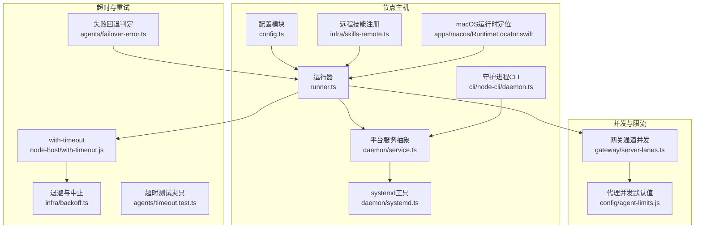
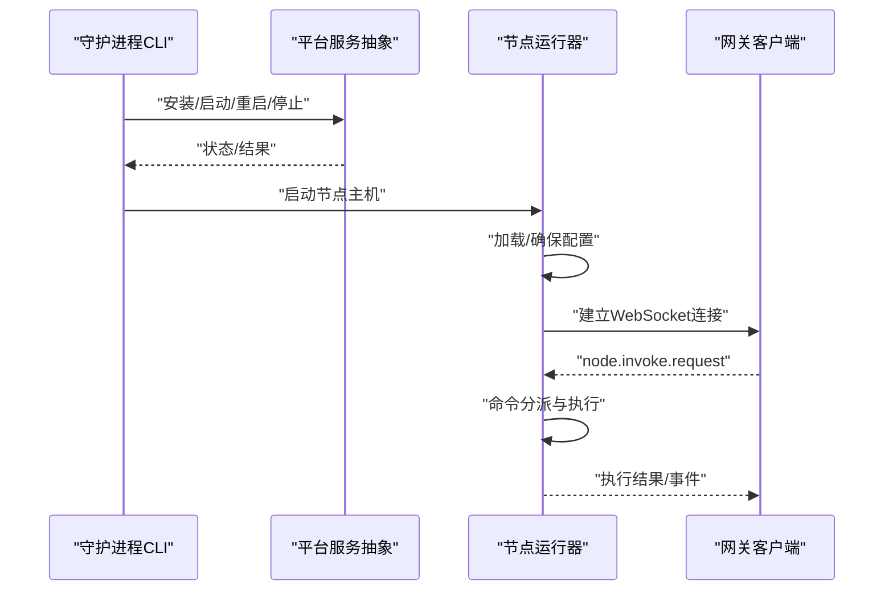
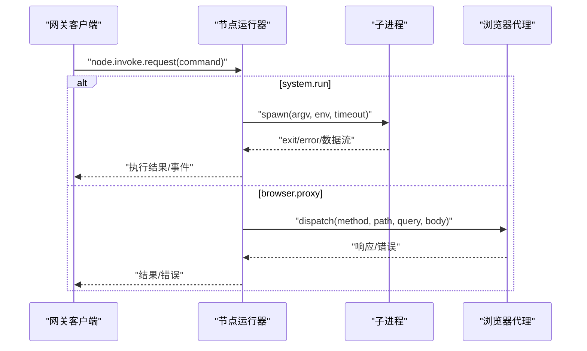
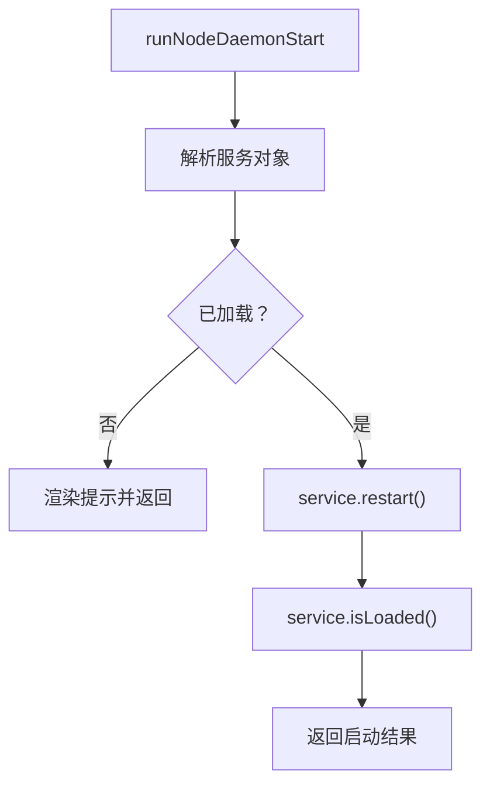
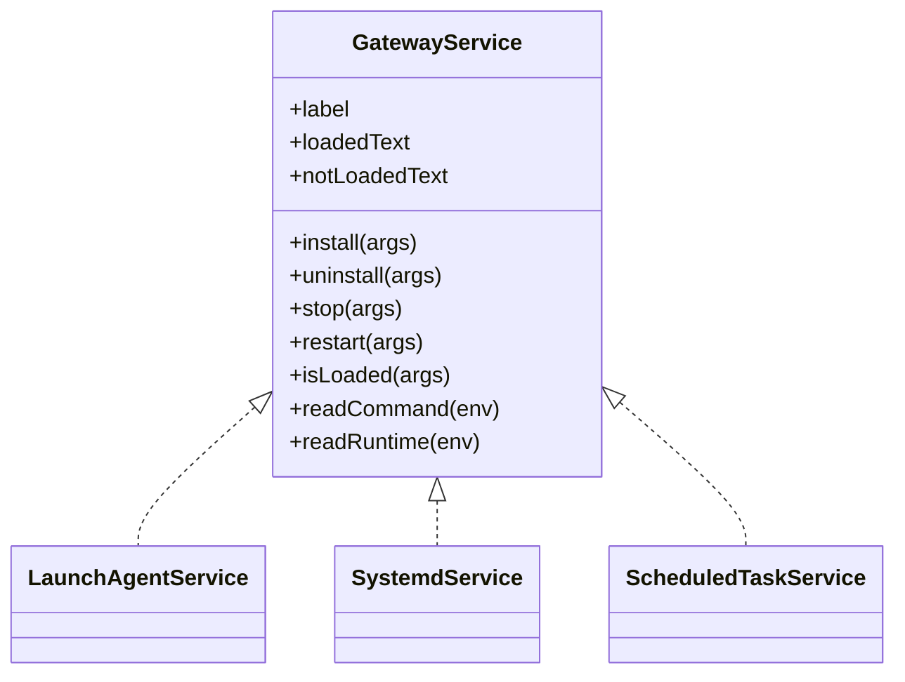
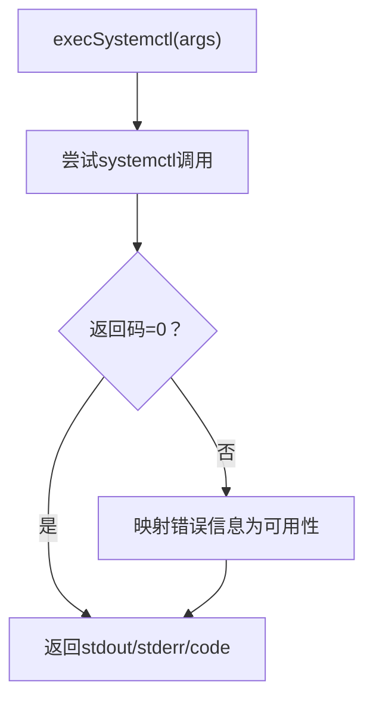
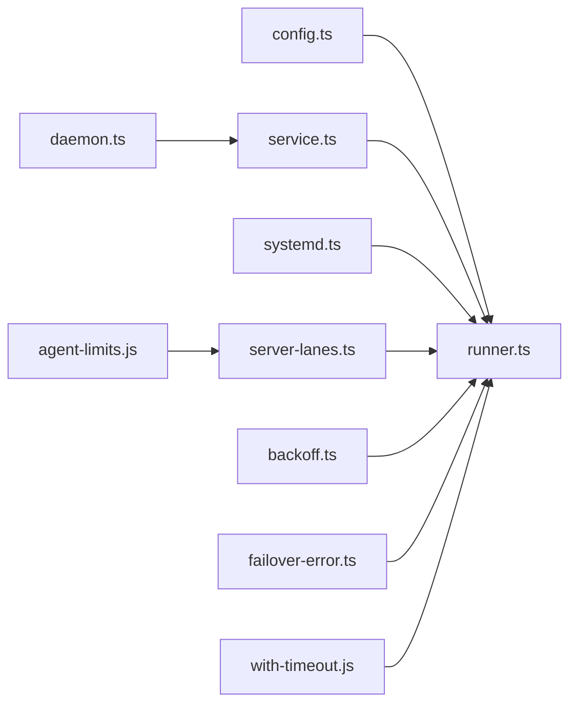

# 节点主机系统

<cite>
**本文引用的文件**
- [src/node-host/config.ts](file://src/node-host/config.ts)
- [src/node-host/runner.ts](file://src/node-host/runner.ts)
- [src/cli/node-cli/daemon.ts](file://src/cli/node-cli/daemon.ts)
- [src/daemon/service.ts](file://src/daemon/service.ts)
- [src/daemon/systemd.ts](file://src/daemon/systemd.ts)
- [src/infra/skills-remote.ts](file://src/infra/skills-remote.ts)
- [apps/macos/Sources/OpenClaw/RuntimeLocator.swift](file://apps/macos/Sources/OpenClaw/RuntimeLocator.swift)
- [src/gateway/server-lanes.ts](file://src/gateway/server-lanes.ts)
- [src/config/agent-limits.js](file://src/config/agent-limits.js)
- [src/infra/backoff.ts](file://src/infra/backoff.ts)
- [src/agents/failover-error.ts](file://src/agents/failover-error.ts)
- [src/agents/timeout.test.ts](file://src/agents/timeout.test.ts)
- [src/node-host/with-timeout.js](file://src/node-host/with-timeout.js)
</cite>

## 目录

1. [简介](#简介)
2. [项目结构](#项目结构)
3. [核心组件](#核心组件)
4. [架构总览](#架构总览)
5. [详细组件分析](#详细组件分析)
6. [依赖关系分析](#依赖关系分析)
7. [性能考量](#性能考量)
8. [故障排查指南](#故障排查指南)
9. [结论](#结论)
10. [附录](#附录)

## 简介

本文件面向OpenClaw节点主机系统（Node Host），提供从架构到实现细节的完整技术文档。内容覆盖节点主机的启动流程、配置加载与持久化、进程执行与资源调度、超时与错误处理、进程生命周期管理（安装/启动/重启/停止）、多节点并发与资源限制、以及安全隔离与权限控制等主题。读者可据此完成节点主机的部署、运维、性能调优与故障诊断。

## 项目结构

节点主机相关代码主要分布在以下模块：

- 配置与持久化：负责节点主机配置的读取、归一化、保存与权限控制
- 运行器：负责与网关建立连接、接收命令、执行系统调用、浏览器代理、输出截断与事件上报
- 守护进程CLI：封装跨平台服务安装与生命周期管理（macOS LaunchAgent、Linux systemd、Windows Scheduled Task）
- 平台服务抽象：统一不同平台的服务安装、查询、运行时状态读取
- 并发与限流：基于命令通道与代理并发限制，保障系统稳定
- 超时与重试：通用退避与超时工具，支持任务中止与超时判定
- 远程技能注册：用于远程节点能力登记与平台识别

**图表来源**

- [src/node-host/config.ts](file://src/node-host/config.ts#L1-L73)
- [src/node-host/runner.ts](file://src/node-host/runner.ts#L538-L629)
- [src/cli/node-cli/daemon.ts](file://src/cli/node-cli/daemon.ts#L85-L447)
- [src/daemon/service.ts](file://src/daemon/service.ts#L66-L156)
- [src/daemon/systemd.ts](file://src/daemon/systemd.ts#L148-L383)
- [src/infra/skills-remote.ts](file://src/infra/skills-remote.ts#L104-L128)
- [apps/macos/Sources/OpenClaw/RuntimeLocator.swift](file://apps/macos/Sources/OpenClaw/RuntimeLocator.swift#L131-L167)
- [src/gateway/server-lanes.ts](file://src/gateway/server-lanes.ts#L1-L10)
- [src/config/agent-limits.js](file://src/config/agent-limits.js)
- [src/infra/backoff.ts](file://src/infra/backoff.ts#L1-L28)
- [src/agents/failover-error.ts](file://src/agents/failover-error.ts#L115-L165)
- [src/agents/timeout.test.ts](file://src/agents/timeout.test.ts#L1-L14)
- [src/node-host/with-timeout.js](file://src/node-host/with-timeout.js)

**章节来源**

- [src/node-host/config.ts](file://src/node-host/config.ts#L1-L73)
- [src/node-host/runner.ts](file://src/node-host/runner.ts#L538-L629)
- [src/cli/node-cli/daemon.ts](file://src/cli/node-cli/daemon.ts#L85-L447)
- [src/daemon/service.ts](file://src/daemon/service.ts#L66-L156)
- [src/daemon/systemd.ts](file://src/daemon/systemd.ts#L148-L383)
- [src/infra/skills-remote.ts](file://src/infra/skills-remote.ts#L104-L128)
- [apps/macos/Sources/OpenClaw/RuntimeLocator.swift](file://apps/macos/Sources/OpenClaw/RuntimeLocator.swift#L131-L167)
- [src/gateway/server-lanes.ts](file://src/gateway/server-lanes.ts#L1-L10)
- [src/config/agent-limits.js](file://src/config/agent-limits.js)
- [src/infra/backoff.ts](file://src/infra/backoff.ts#L1-L28)
- [src/agents/failover-error.ts](file://src/agents/failover-error.ts#L115-L165)
- [src/agents/timeout.test.ts](file://src/agents/timeout.test.ts#L1-L14)
- [src/node-host/with-timeout.js](file://src/node-host/with-timeout.js)

## 核心组件

- 配置模块：定义节点主机配置结构、路径解析、加载/保存与权限设置；确保节点ID唯一性与安全权限
- 运行器：负责与网关建立连接、命令分发、系统执行、浏览器代理、输出截断与事件上报；内置超时与错误处理
- 守护进程CLI：跨平台服务安装与生命周期管理，支持macOS、Linux、Windows
- 平台服务抽象：统一封装不同平台的服务安装、查询、运行时状态读取
- 并发与限流：通过命令通道与代理并发限制，保障系统稳定
- 超时与重试：通用退避与超时工具，支持任务中止与超时判定
- 远程技能注册：用于远程节点能力登记与平台识别

**章节来源**

- [src/node-host/config.ts](file://src/node-host/config.ts#L1-L73)
- [src/node-host/runner.ts](file://src/node-host/runner.ts#L538-L629)
- [src/cli/node-cli/daemon.ts](file://src/cli/node-cli/daemon.ts#L85-L447)
- [src/daemon/service.ts](file://src/daemon/service.ts#L66-L156)
- [src/gateway/server-lanes.ts](file://src/gateway/server-lanes.ts#L1-L10)
- [src/infra/backoff.ts](file://src/infra/backoff.ts#L1-L28)
- [src/agents/failover-error.ts](file://src/agents/failover-error.ts#L115-L165)
- [src/infra/skills-remote.ts](file://src/infra/skills-remote.ts#L104-L128)

## 架构总览

节点主机以“配置驱动 + 命令分发 + 执行与代理 + 并发控制 + 超时与重试”的方式工作。其核心流程如下：

- 启动阶段：加载并确保节点配置，解析网关地址与TLS指纹，初始化设备身份与PATH环境
- 连接阶段：根据平台选择服务抽象，建立WebSocket连接，声明能力与命令集
- 命令阶段：接收“node.invoke.request”后，按命令类型分派到系统执行、浏览器代理或执行授权管理
- 执行阶段：执行系统命令、浏览器代理请求，进行输出截断与事件上报，支持超时与错误处理
- 生命周期阶段：通过守护进程CLI对服务进行安装、启动、重启、停止，并读取运行时状态

**图表来源**

- [src/cli/node-cli/daemon.ts](file://src/cli/node-cli/daemon.ts#L85-L447)
- [src/daemon/service.ts](file://src/daemon/service.ts#L66-L156)
- [src/node-host/runner.ts](file://src/node-host/runner.ts#L538-L629)

## 详细组件分析

### 组件A：配置与持久化（config.ts）

- 职责：定义节点主机配置结构、解析状态目录路径、加载/保存配置、生成唯一节点ID
- 关键点：
  - 配置文件路径：位于状态目录下的固定文件名
  - 加载失败容错：不存在时返回空配置
  - 保存权限：写入后设置严格权限，尽量保证平台兼容
  - 归一化：确保节点ID存在且无多余空白字符

**图表来源**

- [src/node-host/config.ts](file://src/node-host/config.ts#L44-L72)

**章节来源**

- [src/node-host/config.ts](file://src/node-host/config.ts#L1-L73)

### 组件B：节点运行器（runner.ts）

- 职责：与网关建立连接、接收命令、执行系统调用、浏览器代理、输出截断与事件上报
- 关键点：
  - 网关连接：支持TLS与指纹校验，声明能力与命令集合
  - 命令分派：system.run、system.which、system.execApprovals.\*、browser.proxy
  - 输出截断：超过容量自动截断，事件上报仅保留尾部
  - 环境变量：阻断敏感键与前缀，合并PATH
  - 执行缓存：技能二进制列表缓存，带TTL
  - 超时与错误：withTimeout包装，超时强制终止子进程

**图表来源**

- [src/node-host/runner.ts](file://src/node-host/runner.ts#L576-L629)
- [src/node-host/runner.ts](file://src/node-host/runner.ts#L631-L800)

**章节来源**

- [src/node-host/runner.ts](file://src/node-host/runner.ts#L50-L800)

### 组件C：守护进程CLI（daemon.ts）

- 职责：跨平台服务安装与生命周期管理，支持macOS、Linux、Windows
- 关键点：
  - 默认端口与主机解析，支持从配置与参数覆盖
  - Linux检测systemd可用性，提供WSL提示
  - 统一JSON输出格式，便于自动化集成
  - 启动/重启/停止均返回服务快照与状态

**图表来源**

- [src/cli/node-cli/daemon.ts](file://src/cli/node-cli/daemon.ts#L285-L365)

**章节来源**

- [src/cli/node-cli/daemon.ts](file://src/cli/node-cli/daemon.ts#L85-L447)

### 组件D：平台服务抽象（service.ts）

- 职责：统一封装不同平台的服务安装、查询、运行时状态读取
- 关键点：
  - macOS：LaunchAgent
  - Linux：systemd
  - Windows：Scheduled Task
  - 提供install/uninstall/stop/restart/isLoaded/readCommand/readRuntime

**图表来源**

- [src/daemon/service.ts](file://src/daemon/service.ts#L39-L64)
- [src/daemon/service.ts](file://src/daemon/service.ts#L66-L156)

**章节来源**

- [src/daemon/service.ts](file://src/daemon/service.ts#L1-L156)

### 组件E：Linux systemd工具（systemd.ts）

- 职责：systemd用户服务可用性检测、unit状态读取、属性解析
- 关键点：
  - systemctl调用封装，捕获异常并返回标准结构
  - 解析ActiveState/SubState/MainPID/Exec\*字段
  - 可用性判断：根据stderr/stdout关键字判定

**图表来源**

- [src/daemon/systemd.ts](file://src/daemon/systemd.ts#L148-L174)
- [src/daemon/systemd.ts](file://src/daemon/systemd.ts#L336-L377)

**章节来源**

- [src/daemon/systemd.ts](file://src/daemon/systemd.ts#L148-L383)

### 组件F：远程技能注册（skills-remote.ts）

- 职责：远程节点能力登记、平台识别、命令支持检测
- 关键点：
  - 支持system.run与system.which命令检测
  - 通过remoteNodes维护节点注册表

**章节来源**

- [src/infra/skills-remote.ts](file://src/infra/skills-remote.ts#L77-L128)

### 组件G：macOS运行时定位（RuntimeLocator.swift）

- 职责：记录runtime --version执行耗时，提供慢速警告与错误日志
- 关键点：
  - 超过阈值输出warning，否则debug
  - 失败时输出错误与耗时

**章节来源**

- [apps/macos/Sources/OpenClaw/RuntimeLocator.swift](file://apps/macos/Sources/OpenClaw/RuntimeLocator.swift#L131-L167)

### 组件H：并发与限流（server-lanes.ts 与 agent-limits.js）

- 职责：设置命令通道并发度，限制主代理与子代理最大并发
- 关键点：
  - Cron、Main、Subagent三类通道并发度可配置
  - 默认值由代理并发限制模块提供

**章节来源**

- [src/gateway/server-lanes.ts](file://src/gateway/server-lanes.ts#L1-L10)
- [src/config/agent-limits.js](file://src/config/agent-limits.js)

### 组件I：超时与重试（backoff.ts、failover-error.ts、timeout.test.ts、with-timeout.js）

- 职责：通用退避与中止、超时判定、超时测试夹具、withTimeout包装
- 关键点：
  - 退避计算含抖动，避免同步风暴
  - 超时判定支持HTTP状态、常见网络错误码与AbortError
  - withTimeout包装可传入AbortSignal，支持中止

**章节来源**

- [src/infra/backoff.ts](file://src/infra/backoff.ts#L1-L28)
- [src/agents/failover-error.ts](file://src/agents/failover-error.ts#L115-L165)
- [src/agents/timeout.test.ts](file://src/agents/timeout.test.ts#L1-L14)
- [src/node-host/with-timeout.js](file://src/node-host/with-timeout.js)

## 依赖关系分析

- 配置模块被运行器依赖，确保启动时具备正确的节点标识与网关信息
- 运行器依赖平台服务抽象以建立连接，同时依赖systemd工具在Linux上读取运行时状态
- 守护进程CLI依赖平台服务抽象进行安装与生命周期管理
- 并发与限流模块通过网关通道并发设置影响运行器的命令处理吞吐
- 超时与重试模块贯穿运行器的命令执行与浏览器代理过程

**图表来源**

- [src/node-host/config.ts](file://src/node-host/config.ts#L1-L73)
- [src/node-host/runner.ts](file://src/node-host/runner.ts#L538-L629)
- [src/daemon/service.ts](file://src/daemon/service.ts#L66-L156)
- [src/daemon/systemd.ts](file://src/daemon/systemd.ts#L148-L383)
- [src/cli/node-cli/daemon.ts](file://src/cli/node-cli/daemon.ts#L85-L447)
- [src/gateway/server-lanes.ts](file://src/gateway/server-lanes.ts#L1-L10)
- [src/config/agent-limits.js](file://src/config/agent-limits.js)
- [src/infra/backoff.ts](file://src/infra/backoff.ts#L1-L28)
- [src/agents/failover-error.ts](file://src/agents/failover-error.ts#L115-L165)
- [src/node-host/with-timeout.js](file://src/node-host/with-timeout.js)

**章节来源**

- [src/node-host/config.ts](file://src/node-host/config.ts#L1-L73)
- [src/node-host/runner.ts](file://src/node-host/runner.ts#L538-L629)
- [src/daemon/service.ts](file://src/daemon/service.ts#L66-L156)
- [src/daemon/systemd.ts](file://src/daemon/systemd.ts#L148-L383)
- [src/cli/node-cli/daemon.ts](file://src/cli/node-cli/daemon.ts#L85-L447)
- [src/gateway/server-lanes.ts](file://src/gateway/server-lanes.ts#L1-L10)
- [src/config/agent-limits.js](file://src/config/agent-limits.js)
- [src/infra/backoff.ts](file://src/infra/backoff.ts#L1-L28)
- [src/agents/failover-error.ts](file://src/agents/failover-error.ts#L115-L165)
- [src/node-host/with-timeout.js](file://src/node-host/with-timeout.js)

## 性能考量

- 输出截断：单次执行输出超过容量上限时自动截断，避免内存膨胀与事件过大
- 环境变量过滤：阻断潜在危险键与前缀，减少注入风险并保持执行环境整洁
- 并发限制：通过命令通道与代理并发限制，防止资源争用导致的性能抖动
- 退避与中止：在重试场景使用指数退避+抖动，结合AbortSignal提升稳定性
- 超时控制：对长时间操作使用withTimeout包装，避免线程池与子进程悬挂

[本节为通用指导，不直接分析具体文件]

## 故障排查指南

- 启动失败
  - 检查守护进程CLI输出，确认服务是否已加载
  - 在Linux上检查systemd可用性与unit状态
- 连接问题
  - 校验网关主机、端口、TLS指纹配置
  - 查看网关连接错误回调与关闭事件
- 执行超时
  - 使用withTimeout包装的命令，确认超时阈值与中止信号
  - 检查子进程是否被SIGKILL终止
- 权限与安全
  - 确认配置文件权限为严格模式
  - 检查环境变量过滤规则是否误拦截必要变量
- 并发瓶颈
  - 调整命令通道并发度与代理并发限制
  - 观察浏览器代理请求的profile白名单与大小限制

**章节来源**

- [src/cli/node-cli/daemon.ts](file://src/cli/node-cli/daemon.ts#L285-L365)
- [src/daemon/systemd.ts](file://src/daemon/systemd.ts#L336-L377)
- [src/node-host/runner.ts](file://src/node-host/runner.ts#L378-L459)
- [src/node-host/config.ts](file://src/node-host/config.ts#L55-L72)
- [src/gateway/server-lanes.ts](file://src/gateway/server-lanes.ts#L1-L10)
- [src/infra/backoff.ts](file://src/infra/backoff.ts#L1-L28)

## 结论

节点主机系统通过“配置驱动 + 命令分发 + 执行与代理 + 并发控制 + 超时与重试”的设计，在多平台上实现了稳定、可控、可观测的节点运行环境。借助守护进程CLI与平台服务抽象，系统可在不同操作系统上以一致的方式进行安装与生命周期管理；通过严格的配置权限、环境变量过滤与输出截断，有效提升了安全性与稳定性；通过并发限制与超时/重试机制，保障了高负载场景下的可靠性。

[本节为总结，不直接分析具体文件]

## 附录

### 节点启动流程（概要）

- 加载并确保节点配置
- 解析网关主机、端口、TLS指纹
- 初始化设备身份与PATH
- 建立WebSocket连接，声明能力与命令
- 接收命令并分派执行
- 上报执行结果与事件

**章节来源**

- [src/node-host/runner.ts](file://src/node-host/runner.ts#L538-L629)

### 配置选项与安全

- 配置文件路径：状态目录下的固定文件名
- 保存权限：写入后设置严格权限
- 节点ID：自动生成唯一ID
- 环境变量：阻断敏感键与前缀，合并PATH

**章节来源**

- [src/node-host/config.ts](file://src/node-host/config.ts#L23-L72)
- [src/node-host/runner.ts](file://src/node-host/runner.ts#L207-L245)

### 并发与资源限制

- 命令通道并发：Cron、Main、Subagent三类
- 代理并发默认值：由代理并发限制模块提供
- 浏览器代理文件大小限制：超过阈值抛出错误

**章节来源**

- [src/gateway/server-lanes.ts](file://src/gateway/server-lanes.ts#L1-L10)
- [src/config/agent-limits.js](file://src/config/agent-limits.js)
- [src/node-host/runner.ts](file://src/node-host/runner.ts#L313-L326)

### 超时管理与错误处理

- withTimeout包装：支持AbortSignal与超时中止
- 退避与中止：指数退避+抖动，支持中止
- 超时判定：HTTP状态、网络错误码、AbortError

**章节来源**

- [src/node-host/with-timeout.js](file://src/node-host/with-timeout.js)
- [src/infra/backoff.ts](file://src/infra/backoff.ts#L1-L28)
- [src/agents/failover-error.ts](file://src/agents/failover-error.ts#L115-L165)
- [src/agents/timeout.test.ts](file://src/agents/timeout.test.ts#L1-L14)
