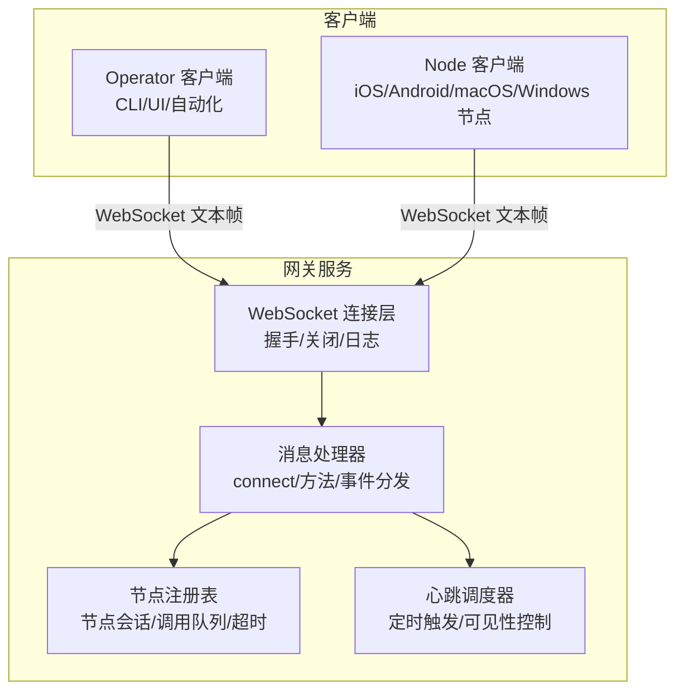
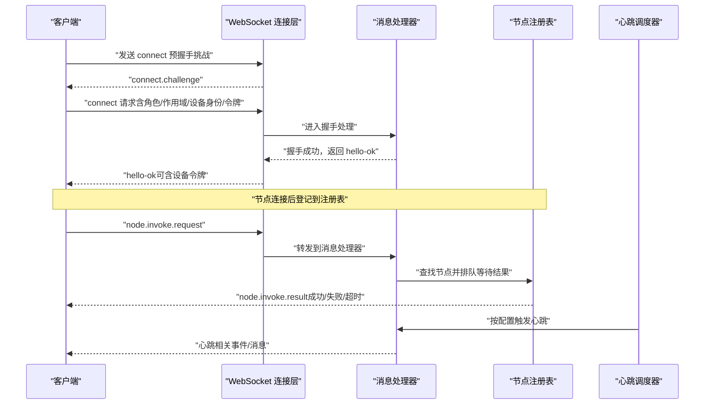
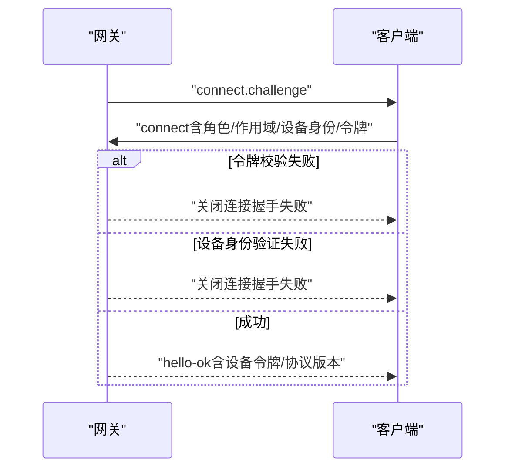
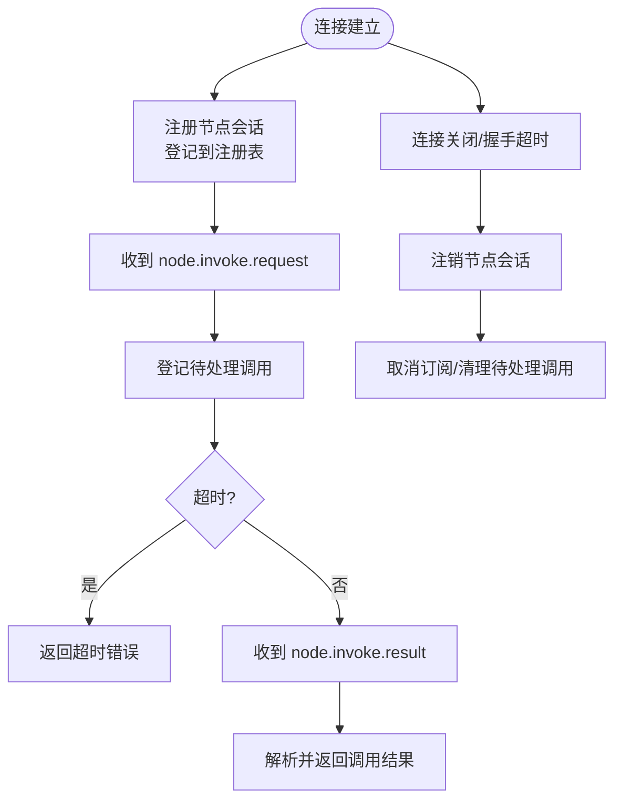
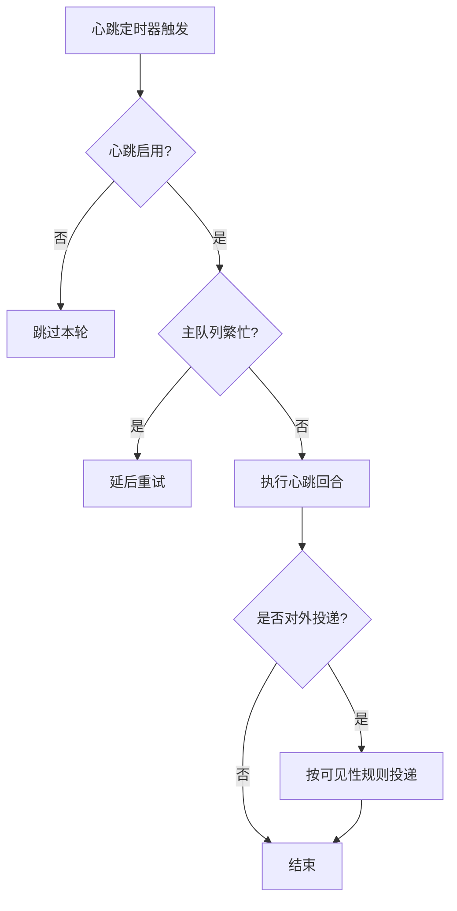
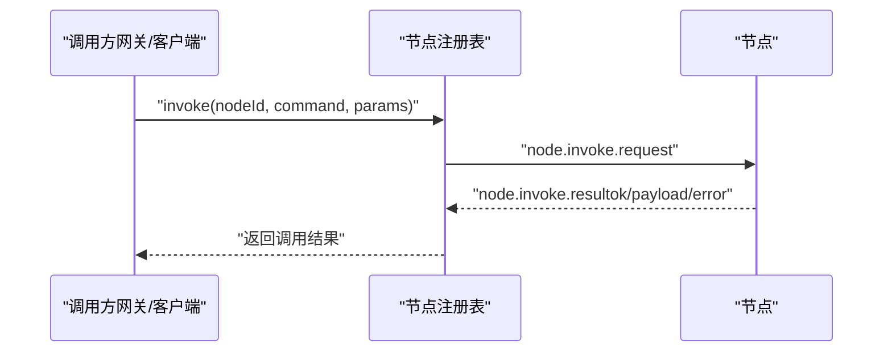
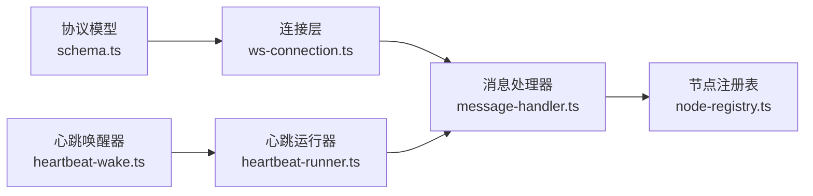

# 节点通信协议

<cite>
**本文引用的文件**
- [docs/gateway/protocol.md](file://docs/gateway/protocol.md)
- [docs/gateway/heartbeat.md](file://docs/gateway/heartbeat.md)
- [docs/gateway/authentication.md](file://docs/gateway/authentication.md)
- [src/gateway/server/ws-connection.ts](file://src/gateway/server/ws-connection.ts)
- [src/gateway/server/ws-connection/message-handler.ts](file://src/gateway/server/ws-connection/message-handler.ts)
- [src/gateway/node-registry.ts](file://src/gateway/node-registry.ts)
- [src/gateway/protocol/schema.ts](file://src/gateway/protocol/schema.ts)
- [scripts/dev/ios-node-e2e.ts](file://scripts/dev/ios-node-e2e.ts)
- [src/gateway/server.ios-client-id.e2e.test.ts](file://src/gateway/server.ios-client-id.e2e.test.ts)
- [src/gateway/server.health.e2e.test.ts](file://src/gateway/server.health.e2e.test.ts)
- [src/gateway/server-mobile-nodes.ts](file://src/gateway/server-mobile-nodes.ts)
- [src/infra/heartbeat-wake.ts](file://src/infra/heartbeat-wake.ts)
- [src/infra/heartbeat-runner.ts](file://src/infra/heartbeat-runner.ts)
</cite>

## 目录

1. [简介](#简介)
2. [项目结构](#项目结构)
3. [核心组件](#核心组件)
4. [架构总览](#架构总览)
5. [详细组件分析](#详细组件分析)
6. [依赖关系分析](#依赖关系分析)
7. [性能考量](#性能考量)
8. [故障排查指南](#故障排查指南)
9. [结论](#结论)
10. [附录](#附录)

## 简介

本文件面向实现与维护 OpenClaw 节点（Node）与网关（Gateway）之间 WebSocket 控制平面的开发者，系统化梳理协议握手、帧格式、角色与权限、节点注册与生命周期、心跳机制、断线重连、事件订阅与数据传输、安全认证与加密传输、以及连接管理等关键主题。文档同时给出协议规范、消息示例与错误处理策略，并提供最佳实践建议。

## 项目结构

围绕“网关 WebSocket 协议”，相关知识与实现主要分布在以下位置：

- 协议规范与示例：docs/gateway/protocol.md
- 心跳机制与可见性控制：docs/gateway/heartbeat.md
- 认证与凭据管理：docs/gateway/authentication.md
- 服务端连接与握手：src/gateway/server/ws-connection.ts
- 消息处理与节点注册：src/gateway/server/ws-connection/message-handler.ts
- 节点注册表与调用编排：src/gateway/node-registry.ts
- 协议模型与版本：src/gateway/protocol/schema.ts
- 客户端示例与测试：scripts/dev/ios-node-e2e.ts、src/gateway/server.ios-client-id.e2e.test.ts、src/gateway/server.health.e2e.test.ts
- 移动节点辅助：src/gateway/server-mobile-nodes.ts
- 心跳调度与运行器：src/infra/heartbeat-wake.ts、src/infra/heartbeat-runner.ts

图表来源

- [src/gateway/server/ws-connection.ts](file://src/gateway/server/ws-connection.ts#L61-L267)
- [src/gateway/server/ws-connection/message-handler.ts](file://src/gateway/server/ws-connection/message-handler.ts#L874-L907)
- [src/gateway/node-registry.ts](file://src/gateway/node-registry.ts#L38-L210)
- [src/infra/heartbeat-runner.ts](file://src/infra/heartbeat-runner.ts#L933-L965)

章节来源

- [docs/gateway/protocol.md](file://docs/gateway/protocol.md#L10-L222)
- [docs/gateway/heartbeat.md](file://docs/gateway/heartbeat.md#L9-L365)
- [docs/gateway/authentication.md](file://docs/gateway/authentication.md#L9-L146)
- [src/gateway/server/ws-connection.ts](file://src/gateway/server/ws-connection.ts#L1-L267)
- [src/gateway/server/ws-connection/message-handler.ts](file://src/gateway/server/ws-connection/message-handler.ts#L874-L907)
- [src/gateway/node-registry.ts](file://src/gateway/node-registry.ts#L1-L210)
- [src/gateway/protocol/schema.ts](file://src/gateway/protocol/schema.ts#L1-L17)

## 核心组件

- WebSocket 控制平面：统一承载请求/响应与事件广播，文本帧 JSON 化。
- 握手与认证：预握手挑战、设备身份签名、令牌校验、设备令牌签发与轮换。
- 角色与作用域：operator（控制面）、node（能力宿主），并区分读写、审批、配对等作用域。
- 节点注册与生命周期：节点连接建立后登记到注册表；断开时清理订阅与待处理调用。
- 心跳机制：周期性代理回合，支持可见性控制与理由交付。
- 事件与订阅：presence、health、channels 等系统事件与状态版本号。
- 方法调用：节点侧通过“node.invoke.request”发起调用，网关侧以“node.invoke.result”回传结果。

章节来源

- [docs/gateway/protocol.md](file://docs/gateway/protocol.md#L12-L222)
- [src/gateway/server/ws-connection.ts](file://src/gateway/server/ws-connection.ts#L112-L267)
- [src/gateway/node-registry.ts](file://src/gateway/node-registry.ts#L38-L210)

## 架构总览

下图展示从连接建立到节点调用与心跳的整体交互路径。

图表来源

- [src/gateway/server/ws-connection.ts](file://src/gateway/server/ws-connection.ts#L120-L125)
- [src/gateway/server/ws-connection.ts](file://src/gateway/server/ws-connection.ts#L218-L228)
- [src/gateway/server/ws-connection/message-handler.ts](file://src/gateway/server/ws-connection/message-handler.ts#L874-L907)
- [src/gateway/node-registry.ts](file://src/gateway/node-registry.ts#L107-L155)
- [src/infra/heartbeat-runner.ts](file://src/infra/heartbeat-runner.ts#L933-L965)

## 详细组件分析

### WebSocket 协议与帧格式

- 传输：WebSocket 文本帧，JSON 负载。
- 帧类型：
  - 请求：{type:"req", id, method, params}
  - 响应：{type:"res", id, ok, payload|error}
  - 事件：{type:"event", event, payload, seq?, stateVersion?}
- 首帧必须是 connect 请求。
- 版本协商：客户端声明 min/maxProtocol，服务端拒绝不兼容版本。

章节来源

- [docs/gateway/protocol.md](file://docs/gateway/protocol.md#L17-L134)
- [src/gateway/protocol/schema.ts](file://src/gateway/protocol/schema.ts#L1-L17)

### 握手与认证

- 预握手挑战：服务端先下发 {event:"connect.challenge", payload:{nonce, ts}}。
- connect 请求：包含客户端标识、平台、模式、角色、作用域、能力声明、命令白名单、权限开关、认证信息、语言环境、UA、设备身份签名等。
- 设备身份与签名：非本地连接需对挑战 nonce 进行签名；本地连接（回环/同机尾网地址）可自动批准。
- 令牌校验：若启用网关令牌，connect.params.auth.token 必须匹配；成功后可颁发设备令牌（含角色与作用域）。
- 设备令牌轮换/吊销：通过专用方法进行。

图表来源

- [docs/gateway/protocol.md](file://docs/gateway/protocol.md#L22-L90)
- [docs/gateway/protocol.md](file://docs/gateway/protocol.md#L187-L216)

章节来源

- [docs/gateway/protocol.md](file://docs/gateway/protocol.md#L22-L90)
- [docs/gateway/protocol.md](file://docs/gateway/protocol.md#L187-L216)

### 节点注册与生命周期

- 注册：握手完成后，节点会话登记到注册表，记录能力、命令、权限、版本、连接时间等。
- 断开：连接关闭或握手超时，清理节点注册、取消其所有订阅、并拒绝/清理未完成的调用请求。
- 调用编排：通过“node.invoke.request”发起调用，注册表维护待处理调用并在超时后返回超时错误。

图表来源

- [src/gateway/server/ws-connection.ts](file://src/gateway/server/ws-connection.ts#L197-L203)
- [src/gateway/server/ws-connection/message-handler.ts](file://src/gateway/server/ws-connection/message-handler.ts#L874-L907)
- [src/gateway/node-registry.ts](file://src/gateway/node-registry.ts#L43-L97)
- [src/gateway/node-registry.ts](file://src/gateway/node-registry.ts#L107-L155)

章节来源

- [src/gateway/server/ws-connection.ts](file://src/gateway/server/ws-connection.ts#L197-L203)
- [src/gateway/server/ws-connection/message-handler.ts](file://src/gateway/server/ws-connection/message-handler.ts#L874-L907)
- [src/gateway/node-registry.ts](file://src/gateway/node-registry.ts#L38-L210)

### 心跳检测与可见性控制

- 触发方式：周期性运行或手动唤醒（enqueue system event）。
- 行为：在代理主会话中执行一次完整回合，根据配置决定是否对外投递、是否包含理由内容、是否限制活跃时段。
- 可见性：可通过通道/账户级别配置隐藏 OK 回执、显示告警、使用指示器事件等。
- 响应约定：仅包含“HEARTBEAT_OK”的回复会被裁剪并丢弃，中间出现的不特殊处理。

图表来源

- [docs/gateway/heartbeat.md](file://docs/gateway/heartbeat.md#L26-L99)
- [docs/gateway/heartbeat.md](file://docs/gateway/heartbeat.md#L218-L231)
- [src/infra/heartbeat-runner.ts](file://src/infra/heartbeat-runner.ts#L933-L965)
- [src/infra/heartbeat-wake.ts](file://src/infra/heartbeat-wake.ts#L164-L175)

章节来源

- [docs/gateway/heartbeat.md](file://docs/gateway/heartbeat.md#L9-L365)
- [src/infra/heartbeat-runner.ts](file://src/infra/heartbeat-runner.ts#L933-L965)
- [src/infra/heartbeat-wake.ts](file://src/infra/heartbeat-wake.ts#L164-L175)

### 事件订阅与状态同步

- 系统事件：presence、health、channels.status 等，支持带 stateVersion 的状态版本号以避免重复推送。
- 订阅方式：客户端通过 system-presence 等方法获取初始状态，随后接收事件流。
- 节点侧事件：节点可订阅自身能力范围内的事件，如 exec.approval.requested 等。

章节来源

- [docs/gateway/protocol.md](file://docs/gateway/protocol.md#L162-L177)
- [src/gateway/server.ws-connection.ts](file://src/gateway/server.ws-connection.ts#L186-L195)
- [src/gateway/server.health.e2e.test.ts](file://src/gateway/server.health.e2e.test.ts#L53-L80)

### 数据传输与方法调用

- 方法调用：客户端向节点发送 node.invoke.request，携带命令、参数、超时与幂等键；节点侧处理后以 node.invoke.result 返回。
- 超时与错误：注册表维护超时计时器，超时返回 TIME_OUT；节点离线则返回 NOT_CONNECTED；发送失败返回 UNAVAILABLE。
- 客户端示例：测试脚本展示了如何解析响应帧、等待特定 id 的响应。

图表来源

- [src/gateway/node-registry.ts](file://src/gateway/node-registry.ts#L107-L155)
- [src/gateway/node-registry.ts](file://src/gateway/node-registry.ts#L157-L181)
- [scripts/dev/ios-node-e2e.ts](file://scripts/dev/ios-node-e2e.ts#L153-L178)

章节来源

- [src/gateway/node-registry.ts](file://src/gateway/node-registry.ts#L107-L181)
- [scripts/dev/ios-node-e2e.ts](file://scripts/dev/ios-node-e2e.ts#L127-L180)

### 断线重连机制

- 握手超时：若在限定时间内未收到 connect 请求，服务端主动关闭连接。
- 连接关闭：记录关闭原因、握手阶段、最后帧元信息；节点角色会注销并取消订阅。
- 重连建议：客户端应在连接断开后指数退避重连，携带持久化的设备令牌与必要的设备身份信息。

章节来源

- [src/gateway/server/ws-connection.ts](file://src/gateway/server/ws-connection.ts#L218-L228)
- [src/gateway/server/ws-connection.ts](file://src/gateway/server/ws-connection.ts#L153-L216)

### 安全认证、加密传输与连接管理

- TLS 与证书固定：支持 WebSocket over TLS，可配置证书指纹以进行固定。
- 设备身份与签名：非本地连接必须对挑战 nonce 进行签名；本地连接可自动批准。
- 令牌管理：OPENCLAW_GATEWAY_TOKEN 或 --token 作为全局令牌；节点连接成功后颁发设备令牌，支持轮换与吊销。
- 连接管理：服务端记录连接元信息（远端地址、User-Agent、Forwarded 等），并区分 WebChat 客户端。

章节来源

- [docs/gateway/protocol.md](file://docs/gateway/protocol.md#L211-L216)
- [docs/gateway/protocol.md](file://docs/gateway/protocol.md#L187-L210)
- [src/gateway/server/ws-connection.ts](file://src/gateway/server/ws-connection.ts#L66-L85)
- [src/gateway/server/ws-connection.ts](file://src/gateway/server/ws-connection.ts#L177-L181)

## 依赖关系分析

- 协议版本与模型：协议版本常量与类型定义由 schema.ts 导出，客户端需与之保持一致。
- 连接层依赖消息处理器：连接层负责握手与生命周期，消息处理器负责具体业务逻辑（如节点注册）。
- 注册表依赖连接上下文：注册表操作需要访问请求上下文（如 nodeUnsubscribeAll）。
- 心跳依赖运行器：心跳调度器驱动心跳运行器执行代理回合。

图表来源

- [src/gateway/protocol/schema.ts](file://src/gateway/protocol/schema.ts#L1-L17)
- [src/gateway/server/ws-connection.ts](file://src/gateway/server/ws-connection.ts#L1-L267)
- [src/gateway/server/ws-connection/message-handler.ts](file://src/gateway/server/ws-connection/message-handler.ts#L874-L907)
- [src/gateway/node-registry.ts](file://src/gateway/node-registry.ts#L38-L210)
- [src/infra/heartbeat-runner.ts](file://src/infra/heartbeat-runner.ts#L933-L965)
- [src/infra/heartbeat-wake.ts](file://src/infra/heartbeat-wake.ts#L164-L175)

章节来源

- [src/gateway/protocol/schema.ts](file://src/gateway/protocol/schema.ts#L1-L17)
- [src/gateway/server/ws-connection.ts](file://src/gateway/server/ws-connection.ts#L1-L267)
- [src/gateway/server/ws-connection/message-handler.ts](file://src/gateway/server/ws-connection/message-handler.ts#L874-L907)
- [src/gateway/node-registry.ts](file://src/gateway/node-registry.ts#L38-L210)
- [src/infra/heartbeat-runner.ts](file://src/infra/heartbeat-runner.ts#L933-L965)
- [src/infra/heartbeat-wake.ts](file://src/infra/heartbeat-wake.ts#L164-L175)

## 性能考量

- 帧大小与缓冲：变更日志显示已提升 WS 负载/缓冲上限以支持大附件（如图像）可靠传输。
- 广播优化：presence/health 广播支持 dropIfSlow 与 stateVersion，避免慢消费者阻塞。
- 心跳成本：更短间隔会增加令牌消耗，建议保持 HEARTBEAT.md 精简并考虑使用较便宜模型或禁用外部投递。

章节来源

- [docs/gateway/protocol.md](file://docs/gateway/protocol.md#L178-L186)
- [src/gateway/server/ws-connection.ts](file://src/gateway/server/ws-connection.ts#L186-L195)
- [docs/gateway/heartbeat.md](file://docs/gateway/heartbeat.md#L360-L365)

## 故障排查指南

- 握手失败：检查 connect.challenge 是否正确签名、令牌是否匹配、设备身份是否有效。
- 连接关闭：关注关闭原因、握手阶段、最后帧类型/方法/id，以及远端地址与 UA。
- 节点调用超时：确认节点是否在线、命令是否在允许列表内、超时阈值是否合理。
- 心跳异常：核对心跳配置（间隔、目标、可见性）、活跃时段设置、主队列是否繁忙。
- 客户端示例：参考测试脚本中的消息解析与等待逻辑，定位响应帧与 id 对应问题。

章节来源

- [src/gateway/server/ws-connection.ts](file://src/gateway/server/ws-connection.ts#L143-L146)
- [src/gateway/server/ws-connection.ts](file://src/gateway/server/ws-connection.ts#L153-L216)
- [src/gateway/node-registry.ts](file://src/gateway/node-registry.ts#L138-L155)
- [scripts/dev/ios-node-e2e.ts](file://scripts/dev/ios-node-e2e.ts#L153-L178)

## 结论

OpenClaw 的节点通信协议以单一 WebSocket 控制平面为核心，结合严格的握手与认证、清晰的角色与作用域、完善的节点注册与调用编排、以及可配置的心跳与事件机制，形成了稳定、可观测且可扩展的节点-网关通信体系。遵循本文档的协议规范与最佳实践，可在多平台节点间实现可靠的连接、事件与数据交互。

## 附录

- 协议版本与生成：协议版本常量与模型由 schema.ts 导出，支持生成 TypeScript 与 Swift 模型。
- 客户端示例：iOS/Android 节点示例展示了如何处理握手、解析响应帧与等待结果。
- 移动节点识别：辅助函数用于识别移动平台节点，便于运维与可见性控制。

章节来源

- [src/gateway/protocol/schema.ts](file://src/gateway/protocol/schema.ts#L1-L17)
- [scripts/dev/ios-node-e2e.ts](file://scripts/dev/ios-node-e2e.ts#L127-L180)
- [src/gateway/server-mobile-nodes.ts](file://src/gateway/server-mobile-nodes.ts#L1-L14)
