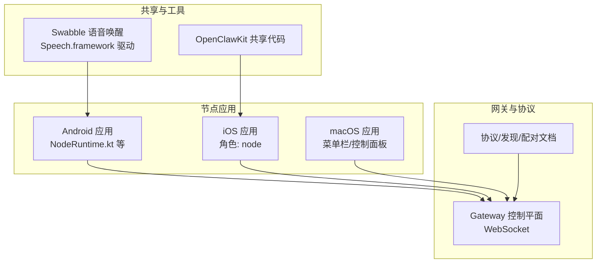
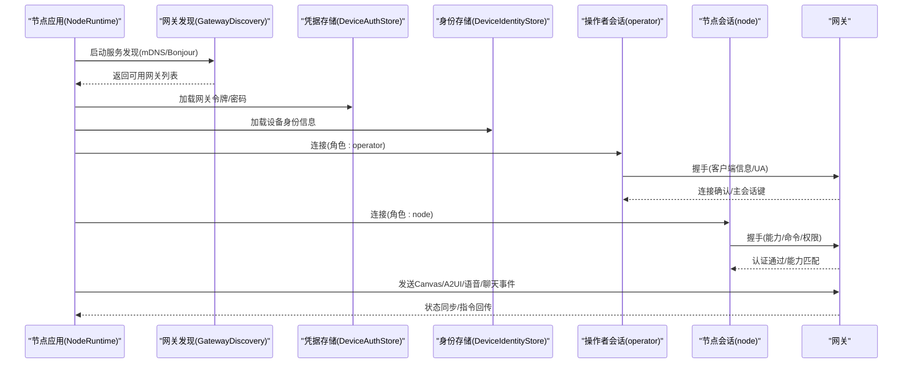
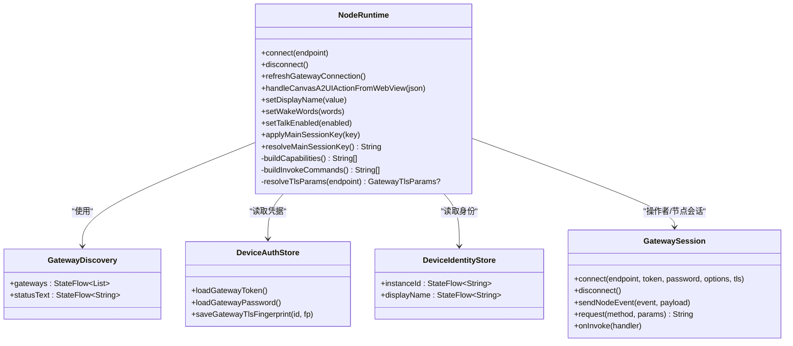
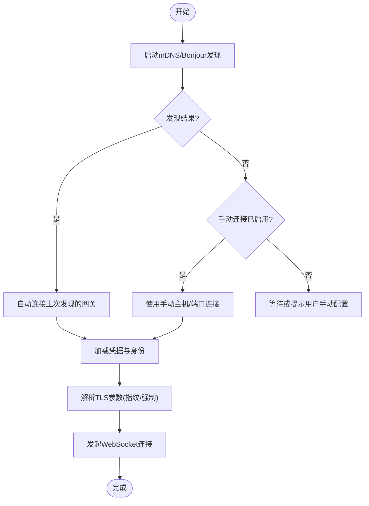
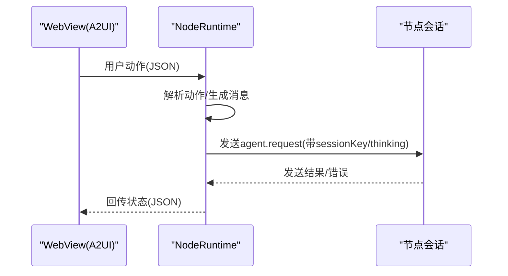
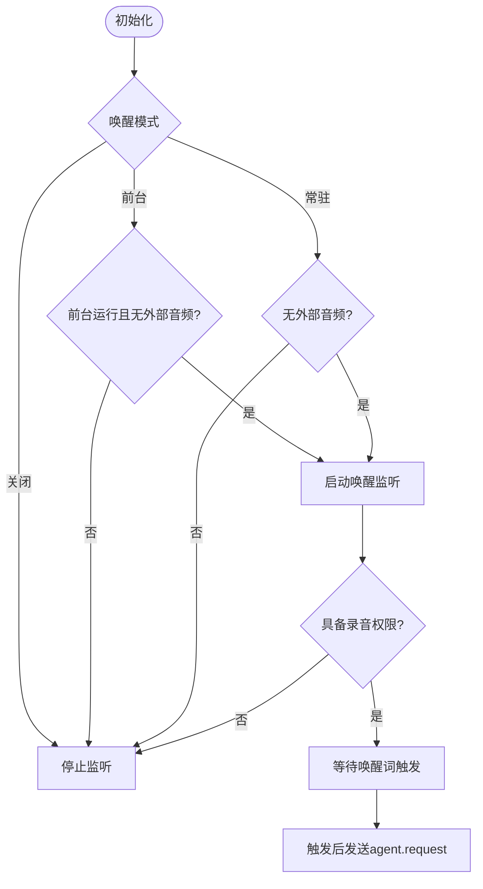
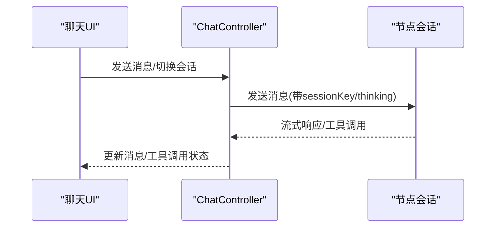
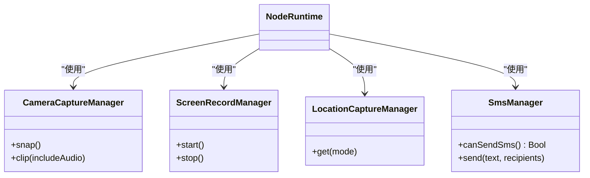
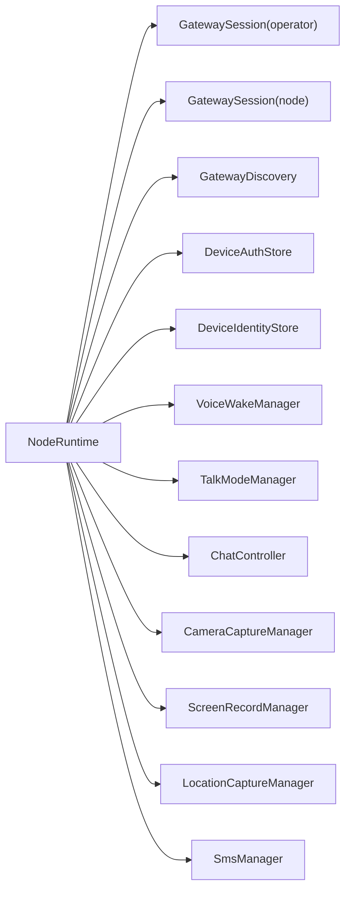

# 设备节点系统

<cite>
**本文档引用的文件**
- [README.md](file://README.md)
- [Swabble/README.md](file://Swabble/README.md)
- [apps/macos/README.md](file://apps/macos/README.md)
- [apps/ios/README.md](file://apps/ios/README.md)
- [apps/android/README.md](file://apps/android/README.md)
- [apps/android/app/src/main/java/ai/openclaw/android/NodeRuntime.kt](file://apps/android/app/src/main/java/ai/openclaw/android/NodeRuntime.kt)
- [apps/android/app/src/main/java/ai/openclaw/android/gateway/GatewayDiscovery.kt](file://apps/android/app/src/main/java/ai/openclaw/android/gateway/GatewayDiscovery.kt)
- [apps/android/app/src/main/java/ai/openclaw/android/gateway/DeviceAuthStore.kt](file://apps/android/app/src/main/java/ai/openclaw/android/gateway/DeviceAuthStore.kt)
- [apps/android/app/src/main/java/ai/openclaw/android/gateway/DeviceIdentityStore.kt](file://apps/android/app/src/main/java/ai/openclaw/android/gateway/DeviceIdentityStore.kt)
- [apps/android/app/src/main/java/ai/openclaw/android/node/CameraCaptureManager.kt](file://apps/android/app/src/main/java/ai/openclaw/android/node/CameraCaptureManager.kt)
- [apps/android/app/src/main/java/ai/openclaw/android/node/LocationCaptureManager.kt](file://apps/android/app/src/main/java/ai/openclaw/android/node/LocationCaptureManager.kt)
- [apps/android/app/src/main/java/ai/openclaw/android/node/ScreenRecordManager.kt](file://apps/android/app/src/main/java/ai/openclaw/android/node/ScreenRecordManager.kt)
- [apps/android/app/src/main/java/ai/openclaw/android/node/SmsManager.kt](file://apps/android/app/src/main/java/ai/openclaw/android/node/SmsManager.kt)
- [apps/android/app/src/main/java/ai/openclaw/android/voice/VoiceWakeManager.kt](file://apps/android/app/src/main/java/ai/openclaw/android/voice/VoiceWakeManager.kt)
- [apps/android/app/src/main/java/ai/openclaw/android/voice/TalkModeManager.kt](file://apps/android/app/src/main/java/ai/openclaw/android/voice/TalkModeManager.kt)
- [apps/android/app/src/main/java/ai/openclaw/android/chat/ChatController.kt](file://apps/android/app/src/main/java/ai/openclaw/android/chat/ChatController.kt)
- [apps/android/app/src/main/java/ai/openclaw/android/protocol/OpenClawCapability.kt](file://apps/android/app/src/main/java/ai/openclaw/android/protocol/OpenClawCapability.kt)
- [apps/android/app/src/main/java/ai/openclaw/android/protocol/OpenClawCanvasCommand.kt](file://apps/android/app/src/main/java/ai/openclaw/android/protocol/OpenClawCanvasCommand.kt)
- [apps/android/app/src/main/java/ai/openclaw/android/protocol/OpenClawScreenCommand.kt](file://apps/android/app/src/main/java/ai/openclaw/android/protocol/OpenClawScreenCommand.kt)
- [apps/android/app/src/main/java/ai/openclaw/android/protocol/OpenClawCameraCommand.kt](file://apps/android/app/src/main/java/ai/openclaw/android/protocol/OpenClawCameraCommand.kt)
- [apps/android/app/src/main/java/ai/openclaw/android/protocol/OpenClawLocationCommand.kt](file://apps/android/app/src/main/java/ai/openclaw/android/protocol/OpenClawLocationCommand.kt)
- [apps/android/app/src/main/java/ai/openclaw/android/protocol/OpenClawSmsCommand.kt](file://apps/android/app/src/main/java/ai/openclaw/android/protocol/OpenClawSmsCommand.kt)
- [src/gateway/protocol.md](file://docs/gateway/protocol.md)
- [docs/gateway/discovery.md](file://docs/gateway/discovery.md)
- [docs/gateway/bonjour.md](file://docs/gateway/bonjour.md)
- [docs/gateway/pairing.md](file://docs/gateway/pairing.md)
- [docs/nodes/index.md](file://docs/nodes/index.md)
- [docs/platforms/android.md](file://docs/platforms/android.md)
- [docs/platforms/ios.md](file://docs/platforms/ios.md)
- [docs/platforms/macos.md](file://docs/platforms/macos.md)
- [docs/gateway/authentication.md](file://docs/gateway/authentication.md)
- [docs/gateway/remote.md](file://docs/gateway/remote.md)
- [docs/gateway/security.md](file://docs/gateway/security.md)
</cite>

## 目录

1. [简介](#简介)
2. [项目结构](#项目结构)
3. [核心组件](#核心组件)
4. [架构总览](#架构总览)
5. [详细组件分析](#详细组件分析)
6. [依赖关系分析](#依赖关系分析)
7. [性能考虑](#性能考虑)
8. [故障排除指南](#故障排除指南)
9. [结论](#结论)
10. [附录](#附录)

## 简介

本文件面向OpenClaw设备节点系统，聚焦以下主题：

- 节点连接与配对机制：包括自动发现、手动连接、TLS指纹校验、凭据存储与身份管理
- 设备权限管理：Android平台的权限模型、TCC（macOS）权限映射、节点能力声明
- 本地执行机制：Canvas控制、相机/屏幕录制、位置获取、短信发送等命令路由
- Canvas控制功能：A2UI交互、WebView事件转发、状态同步
- 平台差异：macOS、iOS、Android节点在能力、权限、UI上的实现差异
- 完整流程：节点发现、安全认证、远程控制与本地动作执行
- 开发指南、权限配置与故障排除
- 节点与网关通信协议、数据传输与状态同步机制

## 项目结构

OpenClaw采用多模块架构，节点侧主要由Android应用、iOS应用、macOS应用组成；同时包含语音唤醒组件Swabble以及大量文档说明。下图展示与设备节点系统相关的核心目录与职责：

图表来源

- [README.md](file://README.md#L180-L250)
- [Swabble/README.md](file://Swabble/README.md#L1-L112)
- [apps/android/README.md](file://apps/android/README.md#L1-L52)
- [apps/ios/README.md](file://apps/ios/README.md#L1-L67)
- [apps/macos/README.md](file://apps/macos/README.md#L1-L65)

章节来源

- [README.md](file://README.md#L180-L250)
- [Swabble/README.md](file://Swabble/README.md#L1-L112)
- [apps/android/README.md](file://apps/android/README.md#L1-L52)
- [apps/ios/README.md](file://apps/ios/README.md#L1-L67)
- [apps/macos/README.md](file://apps/macos/README.md#L1-L65)

## 核心组件

- 节点运行时（NodeRuntime）：负责网关会话管理、能力与命令声明、Canvas/A2UI交互、语音唤醒与Talk模式、聊天与会话管理、权限检查与状态同步
- 网关发现与连接：基于mDNS/Bonjour的服务发现、TLS指纹校验、凭据与身份持久化
- 能力与命令协议：节点向网关声明支持的能力与可调用命令，用于Canvas、相机、屏幕录制、位置、短信等
- 语音唤醒与Talk模式：Swabble驱动的本地唤醒，配合Talk模式进行持续对话
- 聊天控制器：统一的聊天会话管理、消息流式处理、工具调用与会话切换
- 本地功能管理器：相机、屏幕录制、位置、短信等本地能力的封装与调用

章节来源

- [apps/android/app/src/main/java/ai/openclaw/android/NodeRuntime.kt](file://apps/android/app/src/main/java/ai/openclaw/android/NodeRuntime.kt#L61-L800)
- [apps/android/app/src/main/java/ai/openclaw/android/gateway/GatewayDiscovery.kt](file://apps/android/app/src/main/java/ai/openclaw/android/gateway/GatewayDiscovery.kt)
- [apps/android/app/src/main/java/ai/openclaw/android/gateway/DeviceAuthStore.kt](file://apps/android/app/src/main/java/ai/openclaw/android/gateway/DeviceAuthStore.kt)
- [apps/android/app/src/main/java/ai/openclaw/android/gateway/DeviceIdentityStore.kt](file://apps/android/app/src/main/java/ai/openclaw/android/gateway/DeviceIdentityStore.kt)
- [apps/android/app/src/main/java/ai/openclaw/android/protocol/OpenClawCapability.kt](file://apps/android/app/src/main/java/ai/openclaw/android/protocol/OpenClawCapability.kt)
- [apps/android/app/src/main/java/ai/openclaw/android/protocol/OpenClawCanvasCommand.kt](file://apps/android/app/src/main/java/ai/openclaw/android/protocol/OpenClawCanvasCommand.kt)
- [apps/android/app/src/main/java/ai/openclaw/android/protocol/OpenClawScreenCommand.kt](file://apps/android/app/src/main/java/ai/openclaw/android/protocol/OpenClawScreenCommand.kt)
- [apps/android/app/src/main/java/ai/openclaw/android/protocol/OpenClawCameraCommand.kt](file://apps/android/app/src/main/java/ai/openclaw/android/protocol/OpenClawCameraCommand.kt)
- [apps/android/app/src/main/java/ai/openclaw/android/protocol/OpenClawLocationCommand.kt](file://apps/android/app/src/main/java/ai/openclaw/android/protocol/OpenClawLocationCommand.kt)
- [apps/android/app/src/main/java/ai/openclaw/android/protocol/OpenClawSmsCommand.kt](file://apps/android/app/src/main/java/ai/openclaw/android/protocol/OpenClawSmsCommand.kt)
- [apps/android/app/src/main/java/ai/openclaw/android/voice/VoiceWakeManager.kt](file://apps/android/app/src/main/java/ai/openclaw/android/voice/VoiceWakeManager.kt)
- [apps/android/app/src/main/java/ai/openclaw/android/voice/TalkModeManager.kt](file://apps/android/app/src/main/java/ai/openclaw/android/voice/TalkModeManager.kt)
- [apps/android/app/src/main/java/ai/openclaw/android/chat/ChatController.kt](file://apps/android/app/src/main/java/ai/openclaw/android/chat/ChatController.kt)

## 架构总览

节点系统通过WebSocket与网关建立双通道连接：操作者通道（operator）与节点通道（node）。节点侧通过能力与命令声明向网关暴露自身功能，并在获得授权后执行本地动作或转发用户请求到网关。

图表来源

- [apps/android/app/src/main/java/ai/openclaw/android/NodeRuntime.kt](file://apps/android/app/src/main/java/ai/openclaw/android/NodeRuntime.kt#L549-L570)
- [apps/android/app/src/main/java/ai/openclaw/android/gateway/GatewayDiscovery.kt](file://apps/android/app/src/main/java/ai/openclaw/android/gateway/GatewayDiscovery.kt)
- [apps/android/app/src/main/java/ai/openclaw/android/gateway/DeviceAuthStore.kt](file://apps/android/app/src/main/java/ai/openclaw/android/gateway/DeviceAuthStore.kt)
- [apps/android/app/src/main/java/ai/openclaw/android/gateway/DeviceIdentityStore.kt](file://apps/android/app/src/main/java/ai/openclaw/android/gateway/DeviceIdentityStore.kt)

章节来源

- [apps/android/app/src/main/java/ai/openclaw/android/NodeRuntime.kt](file://apps/android/app/src/main/java/ai/openclaw/android/NodeRuntime.kt#L549-L570)
- [apps/android/app/src/main/java/ai/openclaw/android/gateway/GatewayDiscovery.kt](file://apps/android/app/src/main/java/ai/openclaw/android/gateway/GatewayDiscovery.kt)
- [apps/android/app/src/main/java/ai/openclaw/android/gateway/DeviceAuthStore.kt](file://apps/android/app/src/main/java/ai/openclaw/android/gateway/DeviceAuthStore.kt)
- [apps/android/app/src/main/java/ai/openclaw/android/gateway/DeviceIdentityStore.kt](file://apps/android/app/src/main/java/ai/openclaw/android/gateway/DeviceIdentityStore.kt)

## 详细组件分析

### 节点运行时（NodeRuntime）

NodeRuntime是Android节点的核心协调器，负责：

- 会话管理：维护操作者会话与节点会话，分别承载UI控制与设备能力
- 能力与命令构建：根据偏好设置动态生成节点能力与可调用命令
- 事件处理：接收网关事件（如语音唤醒词变更），分发到语音、聊天、Talk模式等子系统
- Canvas/A2UI：解析WebView中的用户动作，格式化为agent.request消息并发送
- 自动连接：基于mDNS发现最近一次连接的网关，或按手动配置连接
- TLS参数解析：根据网关提示、存储指纹与手动TLS开关决定是否启用TLS及指纹校验

图表来源

- [apps/android/app/src/main/java/ai/openclaw/android/NodeRuntime.kt](file://apps/android/app/src/main/java/ai/openclaw/android/NodeRuntime.kt#L61-L800)
- [apps/android/app/src/main/java/ai/openclaw/android/gateway/GatewayDiscovery.kt](file://apps/android/app/src/main/java/ai/openclaw/android/gateway/GatewayDiscovery.kt)
- [apps/android/app/src/main/java/ai/openclaw/android/gateway/DeviceAuthStore.kt](file://apps/android/app/src/main/java/ai/openclaw/android/gateway/DeviceAuthStore.kt)
- [apps/android/app/src/main/java/ai/openclaw/android/gateway/DeviceIdentityStore.kt](file://apps/android/app/src/main/java/ai/openclaw/android/gateway/DeviceIdentityStore.kt)

章节来源

- [apps/android/app/src/main/java/ai/openclaw/android/NodeRuntime.kt](file://apps/android/app/src/main/java/ai/openclaw/android/NodeRuntime.kt#L61-L800)

### 网关发现与连接

- 服务发现：通过mDNS/Bonjour扫描网关服务（\_openclaw-gw.\_tcp），自动发现局域网内的Gateway实例
- 手动连接：当无可用发现结果或用户选择手动输入主机与端口时，使用手动配置连接
- TLS指纹校验：优先使用网关提示的指纹，其次使用已保存指纹，最后根据手动TLS开关决定是否强制TLS
- 凭据与身份：从DeviceAuthStore加载令牌/密码，从DeviceIdentityStore加载设备标识与显示名

图表来源

- [apps/android/app/src/main/java/ai/openclaw/android/gateway/GatewayDiscovery.kt](file://apps/android/app/src/main/java/ai/openclaw/android/gateway/GatewayDiscovery.kt)
- [apps/android/app/src/main/java/ai/openclaw/android/NodeRuntime.kt](file://apps/android/app/src/main/java/ai/openclaw/android/NodeRuntime.kt#L560-L650)
- [apps/android/app/src/main/java/ai/openclaw/android/gateway/DeviceAuthStore.kt](file://apps/android/app/src/main/java/ai/openclaw/android/gateway/DeviceAuthStore.kt)
- [apps/android/app/src/main/java/ai/openclaw/android/gateway/DeviceIdentityStore.kt](file://apps/android/app/src/main/java/ai/openclaw/android/gateway/DeviceIdentityStore.kt)

章节来源

- [apps/android/app/src/main/java/ai/openclaw/android/gateway/GatewayDiscovery.kt](file://apps/android/app/src/main/java/ai/openclaw/android/gateway/GatewayDiscovery.kt)
- [apps/android/app/src/main/java/ai/openclaw/android/NodeRuntime.kt](file://apps/android/app/src/main/java/ai/openclaw/android/NodeRuntime.kt#L560-L650)

### Canvas与A2UI控制

- A2UI动作解析：从WebView中提取用户动作（id/name/surfaceId/context），格式化为agent.request消息
- 会话键绑定：使用主会话键（main）确保跨平台一致性
- 错误反馈：将发送结果与错误状态回传给WebView，保证前端状态一致
- 自动导航：首次连接时根据网关提供的A2UI地址自动导航至Canvas

图表来源

- [apps/android/app/src/main/java/ai/openclaw/android/NodeRuntime.kt](file://apps/android/app/src/main/java/ai/openclaw/android/NodeRuntime.kt#L652-L722)

章节来源

- [apps/android/app/src/main/java/ai/openclaw/android/NodeRuntime.kt](file://apps/android/app/src/main/java/ai/openclaw/android/NodeRuntime.kt#L652-L722)

### 语音唤醒与Talk模式

- 语音唤醒：基于Swabble的本地唤醒词检测，支持前台/常驻/关闭三种模式，受麦克风权限与外部音频占用影响
- Talk模式：与网关协作的持续对话模式，支持外部音频采集时暂停唤醒监听
- 唤醒词同步：从网关拉取当前唤醒词列表，去抖后同步到本地偏好

图表来源

- [apps/android/app/src/main/java/ai/openclaw/android/NodeRuntime.kt](file://apps/android/app/src/main/java/ai/openclaw/android/NodeRuntime.kt#L305-L389)
- [apps/android/app/src/main/java/ai/openclaw/android/voice/VoiceWakeManager.kt](file://apps/android/app/src/main/java/ai/openclaw/android/voice/VoiceWakeManager.kt)
- [apps/android/app/src/main/java/ai/openclaw/android/voice/TalkModeManager.kt](file://apps/android/app/src/main/java/ai/openclaw/android/voice/TalkModeManager.kt)

章节来源

- [apps/android/app/src/main/java/ai/openclaw/android/NodeRuntime.kt](file://apps/android/app/src/main/java/ai/openclaw/android/NodeRuntime.kt#L305-L389)
- [apps/android/app/src/main/java/ai/openclaw/android/voice/VoiceWakeManager.kt](file://apps/android/app/src/main/java/ai/openclaw/android/voice/VoiceWakeManager.kt)
- [apps/android/app/src/main/java/ai/openclaw/android/voice/TalkModeManager.kt](file://apps/android/app/src/main/java/ai/openclaw/android/voice/TalkModeManager.kt)

### 聊天与会话管理

- 会话键：默认使用“main”，支持动态切换与恢复
- 流式消息：支持流式助手文本、工具调用、会话历史与订阅
- 思维级别：支持低/中/高等不同思维级别，影响响应质量与速度
- 中断与重试：支持中止当前请求、刷新会话与会话列表

图表来源

- [apps/android/app/src/main/java/ai/openclaw/android/chat/ChatController.kt](file://apps/android/app/src/main/java/ai/openclaw/android/chat/ChatController.kt)
- [apps/android/app/src/main/java/ai/openclaw/android/NodeRuntime.kt](file://apps/android/app/src/main/java/ai/openclaw/android/NodeRuntime.kt#L724-L751)

章节来源

- [apps/android/app/src/main/java/ai/openclaw/android/chat/ChatController.kt](file://apps/android/app/src/main/java/ai/openclaw/android/chat/ChatController.kt)
- [apps/android/app/src/main/java/ai/openclaw/android/NodeRuntime.kt](file://apps/android/app/src/main/java/ai/openclaw/android/NodeRuntime.kt#L724-L751)

### 本地功能管理器

- 相机：支持拍照与拍短视频，受相机权限与音频开关影响
- 屏幕录制：基于系统录屏API，支持开始/停止
- 位置：根据位置模式（关闭/仅粗略/精确）获取位置信息
- 短信：在具备发送权限时支持发送短信

图表来源

- [apps/android/app/src/main/java/ai/openclaw/android/node/CameraCaptureManager.kt](file://apps/android/app/src/main/java/ai/openclaw/android/node/CameraCaptureManager.kt)
- [apps/android/app/src/main/java/ai/openclaw/android/node/ScreenRecordManager.kt](file://apps/android/app/src/main/java/ai/openclaw/android/node/ScreenRecordManager.kt)
- [apps/android/app/src/main/java/ai/openclaw/android/node/LocationCaptureManager.kt](file://apps/android/app/src/main/java/ai/openclaw/android/node/LocationCaptureManager.kt)
- [apps/android/app/src/main/java/ai/openclaw/android/node/SmsManager.kt](file://apps/android/app/src/main/java/ai/openclaw/android/node/SmsManager.kt)

章节来源

- [apps/android/app/src/main/java/ai/openclaw/android/node/CameraCaptureManager.kt](file://apps/android/app/src/main/java/ai/openclaw/android/node/CameraCaptureManager.kt)
- [apps/android/app/src/main/java/ai/openclaw/android/node/ScreenRecordManager.kt](file://apps/android/app/src/main/java/ai/openclaw/android/node/ScreenRecordManager.kt)
- [apps/android/app/src/main/java/ai/openclaw/android/node/LocationCaptureManager.kt](file://apps/android/app/src/main/java/ai/openclaw/android/node/LocationCaptureManager.kt)
- [apps/android/app/src/main/java/ai/openclaw/android/node/SmsManager.kt](file://apps/android/app/src/main/java/ai/openclaw/android/node/SmsManager.kt)

### 平台差异与特性

- Android节点
  - 通过前台服务维持长连接，支持现代Android（minSdk 31）
  - 权限模型：需要相应权限才能启用对应能力（相机、录音、位置、通知等）
  - 能力声明：根据权限与偏好动态生成
- iOS节点
  - 角色为node，通过WebSocket连接网关
  - 支持Canvas、Talk/Chat界面，权限由iOS系统管理
- macOS节点
  - 可运行在node模式，通过网关协议暴露系统级能力（如system.run/system.notify）
  - 依赖TCC权限与可选的提升权限（需允许白名单）

章节来源

- [apps/android/README.md](file://apps/android/README.md#L1-L52)
- [apps/ios/README.md](file://apps/ios/README.md#L1-L67)
- [apps/macos/README.md](file://apps/macos/README.md#L1-L65)
- [README.md](file://README.md#L235-L248)

## 依赖关系分析

- 组件耦合
  - NodeRuntime高度依赖GatewaySession（操作者/节点）、GatewayDiscovery、DeviceAuthStore、DeviceIdentityStore
  - 能力与命令构建依赖用户偏好与权限状态
- 外部依赖
  - mDNS/Bonjour用于网关发现
  - Swabble用于本地语音唤醒
  - 系统API用于相机、录屏、位置、短信等

图表来源

- [apps/android/app/src/main/java/ai/openclaw/android/NodeRuntime.kt](file://apps/android/app/src/main/java/ai/openclaw/android/NodeRuntime.kt#L61-L800)

章节来源

- [apps/android/app/src/main/java/ai/openclaw/android/NodeRuntime.kt](file://apps/android/app/src/main/java/ai/openclaw/android/NodeRuntime.kt#L61-L800)

## 性能考虑

- 连接复用：操作者与节点使用同一网关端点，减少握手开销
- 能力动态生成：仅在具备权限时声明对应能力，避免无效调用
- 事件去抖：唤醒词同步采用去抖策略，降低网络压力
- 前台服务：Android前台服务确保连接稳定性，避免被系统回收
- 本地处理：语音唤醒与Canvas渲染尽量在设备侧完成，减少网络往返

## 故障排除指南

- 无法发现网关
  - 检查mDNS/Bonjour是否可用，确认网关已正确发布服务
  - 尝试手动连接，验证主机与端口
- TLS连接失败
  - 核对TLS指纹是否正确，必要时重新保存指纹
  - 确认网关TLS配置与客户端期望一致
- 权限问题
  - Android：检查相机/录音/位置/通知等权限是否授予
  - iOS/macOS：检查系统权限与TCC设置
- Canvas/A2UI异常
  - 确认节点已连接且网关提供A2UI地址
  - 检查agent.request发送与回传状态
- 语音唤醒无效
  - 确认录音权限已授予
  - 检查唤醒模式与外部音频占用情况

章节来源

- [apps/android/README.md](file://apps/android/README.md#L24-L52)
- [apps/android/app/src/main/java/ai/openclaw/android/NodeRuntime.kt](file://apps/android/app/src/main/java/ai/openclaw/android/NodeRuntime.kt#L560-L650)
- [apps/android/app/src/main/java/ai/openclaw/android/voice/VoiceWakeManager.kt](file://apps/android/app/src/main/java/ai/openclaw/android/voice/VoiceWakeManager.kt)

## 结论

OpenClaw设备节点系统通过清晰的会话分离、能力声明与权限管理，实现了跨平台的本地执行与远程控制。Android节点以NodeRuntime为核心，结合mDNS/Bonjour发现、TLS指纹校验与本地功能管理器，提供了稳定可靠的Canvas控制、语音唤醒与Talk模式体验。iOS与macOS节点则在各自平台上充分利用系统能力，实现一致的用户体验与安全边界。

## 附录

### 节点与网关通信协议要点

- 角色区分：节点（node）与操作者（operator）分别建立会话
- 能力与命令：节点向网关声明支持的能力与可调用命令
- 事件与请求：节点通过事件与请求接口与网关交互，如agent.request、voicewake.get/set等
- TLS与认证：支持TLS指纹校验与令牌/密码认证

章节来源

- [src/gateway/protocol.md](file://docs/gateway/protocol.md)
- [apps/android/app/src/main/java/ai/openclaw/android/NodeRuntime.kt](file://apps/android/app/src/main/java/ai/openclaw/android/NodeRuntime.kt#L525-L547)
- [apps/android/app/src/main/java/ai/openclaw/android/protocol/OpenClawCapability.kt](file://apps/android/app/src/main/java/ai/openclaw/android/protocol/OpenClawCapability.kt)
- [apps/android/app/src/main/java/ai/openclaw/android/protocol/OpenClawCanvasCommand.kt](file://apps/android/app/src/main/java/ai/openclaw/android/protocol/OpenClawCanvasCommand.kt)
- [apps/android/app/src/main/java/ai/openclaw/android/protocol/OpenClawScreenCommand.kt](file://apps/android/app/src/main/java/ai/openclaw/android/protocol/OpenClawScreenCommand.kt)
- [apps/android/app/src/main/java/ai/openclaw/android/protocol/OpenClawCameraCommand.kt](file://apps/android/app/src/main/java/ai/openclaw/android/protocol/OpenClawCameraCommand.kt)
- [apps/android/app/src/main/java/ai/openclaw/android/protocol/OpenClawLocationCommand.kt](file://apps/android/app/src/main/java/ai/openclaw/android/protocol/OpenClawLocationCommand.kt)
- [apps/android/app/src/main/java/ai/openclaw/android/protocol/OpenClawSmsCommand.kt](file://apps/android/app/src/main/java/ai/openclaw/android/protocol/OpenClawSmsCommand.kt)

### 节点开发指南

- Android
  - 使用NodeRuntime作为入口，配置能力与命令
  - 实现本地功能管理器（相机/录屏/位置/短信）
  - 处理权限与状态同步
- iOS
  - 以node角色连接网关，实现Canvas/Talk/Chat界面
  - 管理权限与后台行为
- macOS
  - 在node模式下暴露系统能力，遵循TCC与提升权限策略

章节来源

- [apps/android/README.md](file://apps/android/README.md#L1-L52)
- [apps/ios/README.md](file://apps/ios/README.md#L1-L67)
- [apps/macos/README.md](file://apps/macos/README.md#L1-L65)
- [README.md](file://README.md#L235-L248)
