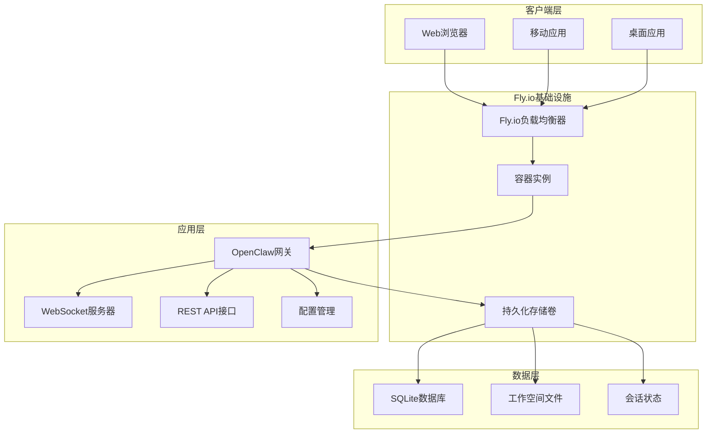
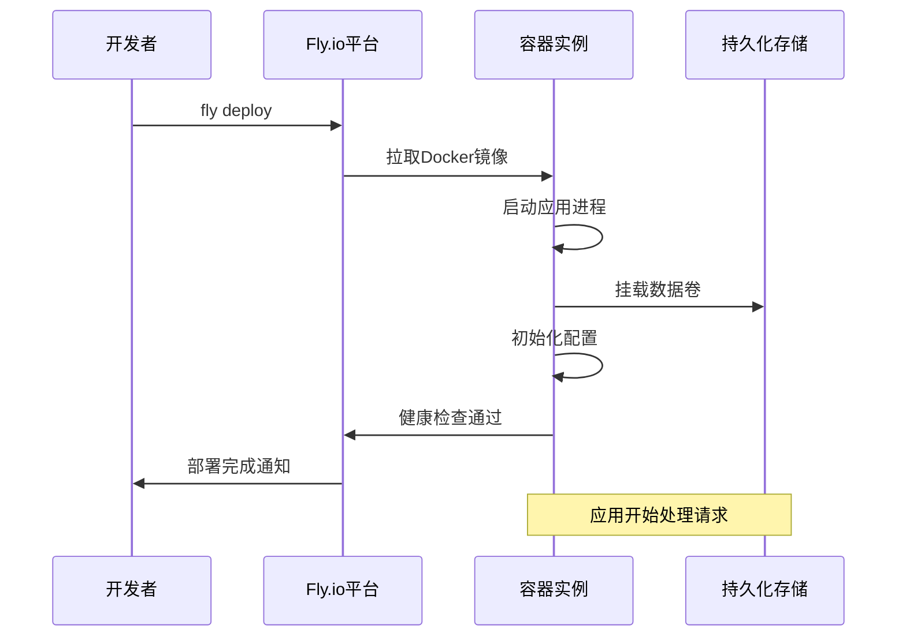
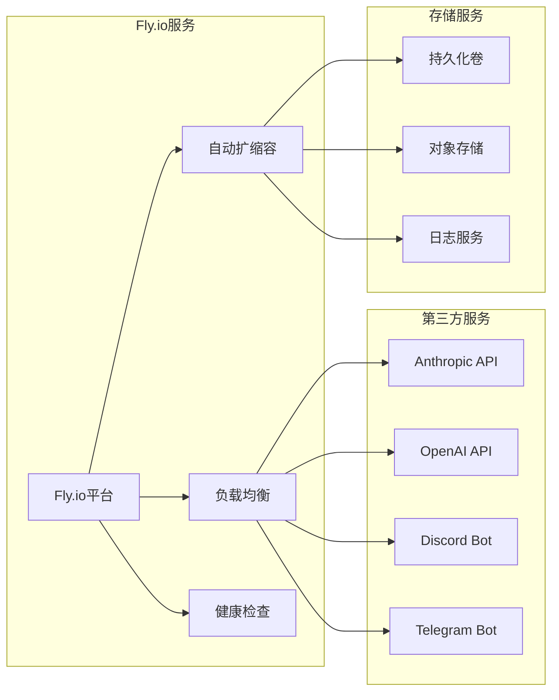

# Fly.io部署

<cite>
**本文档引用的文件**
- [fly.toml](file://fly.toml)
- [fly.private.toml](file://fly.private.toml)
- [Dockerfile](file://Dockerfile)
- [package.json](file://package.json)
- [docs/install/fly.md](file://docs/install/fly.md)
- [docker-compose.yml](file://docker-compose.yml)
- [docker-setup.sh](file://docker-setup.sh)
- [README.md](file://README.md)
</cite>

## 目录

1. [简介](#简介)
2. [项目结构](#项目结构)
3. [核心组件](#核心组件)
4. [架构概览](#架构概览)
5. [详细组件分析](#详细组件分析)
6. [依赖关系分析](#依赖关系分析)
7. [性能考虑](#性能考虑)
8. [故障排除指南](#故障排除指南)
9. [结论](#结论)
10. [附录](#附录)

## 简介

本指南详细介绍如何在Fly.io平台上部署OpenClaw个人AI助手。Fly.io作为云原生平台，提供了独特的价值主张：免费套餐、全球边缘网络和快速部署能力。

### Fly.io平台特色功能

**免费套餐支持**

- 提供免费层级，适合个人开发者和小型项目
- 包含一定的资源配额和带宽限制
- 支持按需扩展，超出部分按量计费

**全球边缘网络**

- 13个可用区覆盖全球主要地区
- 智能路由到最近的数据中心
- 低延迟连接和高可用性保证

**快速部署能力**

- 一键部署Docker容器化应用
- 自动化的CI/CD流水线
- 内置的健康检查和自动重启机制

### OpenClaw平台概述

OpenClaw是一个个人AI助手，支持多渠道集成（WhatsApp、Telegram、Discord等），具备本地优先的设计理念和强大的扩展能力。通过Fly.io部署，用户可以获得稳定可靠的云端运行环境。

## 项目结构

OpenClaw项目采用模块化架构设计，包含以下关键目录：

```mermaid
graph TB
subgraph "项目根目录"
A[src/] -- 核心源码
B[apps/] -- 移动端应用
C[extensions/] -- 扩展插件
D[packages/] -- 内部包
E[scripts/] -- 部署脚本
F[docs/] -- 文档
end
subgraph "部署配置"
G[fly.toml] -- 主配置文件
H[fly.private.toml] -- 私有部署配置
I[Dockerfile] -- 容器构建文件
J[docker-compose.yml] -- 本地开发配置
end
subgraph "持久化存储"
K[volumes/] -- 数据卷
L[/data] -- 应用数据目录
end
```

**图表来源**

- [fly.toml](file://fly.toml#L1-L35)
- [fly.private.toml](file://fly.private.toml#L1-L40)
- [Dockerfile](file://Dockerfile#L1-L73)

**章节来源**

- [fly.toml](file://fly.toml#L1-L35)
- [fly.private.toml](file://fly.private.toml#L1-L40)
- [Dockerfile](file://Dockerfile#L1-L73)

## 核心组件

### Fly.io应用配置

OpenClaw的Fly.io部署配置包含多个关键组件：

**应用基本信息**

- 应用名称：openclaw
- 主要区域：iad（华盛顿特区）
- 构建配置：使用Dockerfile进行容器化

**环境变量配置**

- NODE_ENV：生产环境模式
- OPENCLAW_PREFER_PNPM：优先使用pnpm包管理器
- OPENCLAW_STATE_DIR：持久化数据目录
- NODE_OPTIONS：Node.js内存配置

**进程配置**

- 应用进程：node dist/index.js gateway
- 端口绑定：3000端口
- 网络绑定：lan模式（允许外部访问）

**虚拟机规格**

- CPU类型：shared-cpu-2x
- 内存容量：2048MB
- 存储配置：1GB持久卷

**章节来源**

- [fly.toml](file://fly.toml#L4-L34)

### 私有部署配置

私有部署配置提供了更高的安全性：

**无公网暴露**

- 不配置http_service块
- 仅通过内部网络访问
- 支持fly proxy、WireGuard或SSH访问

**安全访问方式**

- fly proxy 3000:3000 -a <app-name>
- fly wireguard（内部IPv6访问）
- fly ssh console

**章节来源**

- [fly.private.toml](file://fly.private.toml#L27-L31)

### Docker容器化配置

Dockerfile定义了完整的构建流程：

**基础镜像**

- node:22-bookworm（基于Debian）
- 支持Bun包管理器安装
- Corepack启用支持

**构建优化**

- 分层缓存策略
- 条件安装浏览器依赖
- 非root用户运行

**安全特性**

- 使用非root用户（uid 1000）
- 减少攻击面
- 容器逃逸防护

**章节来源**

- [Dockerfile](file://Dockerfile#L1-L73)

## 架构概览

OpenClaw在Fly.io上的部署架构采用容器化微服务模式：



**图表来源**

- [fly.toml](file://fly.toml#L20-L34)
- [Dockerfile](file://Dockerfile#L61-L73)

### 部署流程序列图



**图表来源**

- [docs/install/fly.md](file://docs/install/fly.md#L116-L130)

## 详细组件分析

### 应用创建流程

应用创建是部署的第一步，涉及多个配置层面：

**1. 应用初始化**

```bash
# 创建新应用
fly apps create my-openclaw

# 创建持久化卷
fly volumes create openclaw_data --size 1 --region iad
```

**2. 配置文件定制**

- 修改fly.toml中的应用名称
- 设置合适的区域位置
- 配置内存和CPU规格

**3. 环境变量设置**

- OPENCLAW_GATEWAY_TOKEN：网关访问令牌
- API密钥：Anthropic、OpenAI等模型提供商
- 渠道令牌：Discord、Telegram等

**章节来源**

- [docs/install/fly.md](file://docs/install/fly.md#L28-L43)

### 持久卷配置详解

持久化存储是OpenClaw部署的核心要求：

**卷创建**

```bash
fly volumes create openclaw_data --size 1 --region iad
```

**挂载配置**

- 源：openclaw_data（卷名称）
- 目标：/data（容器内路径）
- 类型：持久化存储

**数据保护**

- 自动备份策略
- 数据加密传输
- 访问权限控制

**章节来源**

- [fly.toml](file://fly.toml#L32-L34)
- [fly.private.toml](file://fly.private.toml#L37-L39)

### 环境变量配置

环境变量是配置管理的关键：

**必需变量**

- OPENCLAW_GATEWAY_TOKEN：用于非回环绑定的安全令牌
- 模型API密钥：Anthropic、OpenAI等
- 渠道认证令牌：Discord、Telegram等

**可选变量**

- OPENCLAW_PREFER_PNPM：包管理器偏好
- OPENCLAW_STATE_DIR：状态目录
- NODE_OPTIONS：Node.js运行时参数

**安全最佳实践**

- 使用Fly.io Secrets管理敏感信息
- 避免在配置文件中硬编码密钥
- 定期轮换访问令牌

**章节来源**

- [docs/install/fly.md](file://docs/install/fly.md#L93-L115)

### Docker容器化部署

Dockerfile定义了完整的构建和运行流程：

**构建阶段**

1. 基础镜像选择：node:22-bookworm
2. 包管理器安装：Bun和Corepack
3. 依赖安装：pnpm install --frozen-lockfile
4. 可选组件：Chromium浏览器预装

**运行阶段**

1. 非root用户执行：减少安全风险
2. 端口暴露：3000端口
3. 健康检查：WebSocket连接验证
4. 数据持久化：/data目录映射

**优化策略**

- 层级缓存利用
- 条件依赖安装
- 最小化镜像大小

**章节来源**

- [Dockerfile](file://Dockerfile#L1-L73)

## 依赖关系分析

### 外部依赖

OpenClaw部署涉及多个外部服务和依赖：



**图表来源**

- [package.json](file://package.json#L151-L206)

### 内部组件依赖

应用内部组件之间的依赖关系：

**核心依赖**

- @agentclientprotocol/sdk：客户端协议支持
- @whiskeysockets/baileys：WhatsApp连接
- @grammyjs/transformer-throttler：Telegram限流
- @discordjs/voice：Discord语音支持

**工具类依赖**

- playwright-core：浏览器自动化
- sharp：图像处理
- sqlite-vec：向量数据库
- ws：WebSocket通信

**开发依赖**

- vitest：测试框架
- typescript：类型系统
- oxfmt：代码格式化

**章节来源**

- [package.json](file://package.json#L151-L266)

## 性能考虑

### 内存优化

**推荐配置**

- 基础部署：2GB内存（shared-cpu-2x）
- 高并发场景：4GB内存（shared-cpu-4x）
- 测试环境：1GB内存（shared-cpu-1x）

**内存监控**

```bash
# 查看内存使用情况
fly ssh console
df -h /data
free -h
```

**性能调优**

- NODE_OPTIONS="--max-old-space-size=1536"
- 适当的垃圾回收配置
- 连接池大小优化

### 网络性能

**CDN加速**

- Fly.io全球边缘节点
- 自动SSL证书管理
- 智能路由选择

**连接优化**

- WebSocket长连接
- HTTP/2支持
- 连接复用

### 成本优化

**资源规划**

- 根据实际使用量调整规格
- 利用免费层级资源
- 避免过度配置

**监控指标**

- CPU使用率
- 内存占用
- 网络带宽
- 存储空间

## 故障排除指南

### 常见问题及解决方案

**1. 内存不足问题**

**症状**：容器频繁重启，出现SIGABRT错误

**诊断命令**：

```bash
fly logs --lines 100
fly machine status
```

**解决方案**：

```toml
# 增加内存配置
[[vm]]
  memory = "2048mb"
```

**2. 网关锁冲突**

**症状**：启动时提示"already running"

**解决步骤**：

```bash
# 删除锁文件
fly ssh console --command "rm -f /data/gateway.*.lock"
# 重启机器
fly machine restart <machine-id>
```

**3. 配置不生效**

**诊断方法**：

```bash
# 检查配置文件
fly ssh console --command "cat /data/openclaw.json"
# 验证环境变量
fly secrets list
```

**4. 健康检查失败**

**检查端口绑定**：

```bash
# 确认端口监听
fly ssh console
netstat -tulpn | grep 3000
```

**章节来源**

- [docs/install/fly.md](file://docs/install/fly.md#L245-L327)

### 安全配置选项

**私有部署安全特性**

- 无公网IP暴露
- 内部网络访问控制
- WireGuard VPN支持
- SSH隧道访问

**访问控制**

```bash
# WireGuard配置
fly wireguard create

# 本地代理
fly proxy 3000:3000 -a my-openclaw
```

**安全最佳实践**

- 定期更新访问令牌
- 限制SSH访问来源
- 监控异常登录尝试
- 定期安全审计

**章节来源**

- [docs/install/fly.md](file://docs/install/fly.md#L359-L433)

## 结论

通过Fly.io部署OpenClaw提供了完整的云端解决方案，结合了以下优势：

**技术优势**

- 快速部署和弹性扩展
- 全球边缘网络带来的低延迟
- 完善的监控和告警机制
- 自动化的备份和恢复

**成本效益**

- 免费层级支持个人使用
- 按需付费模式
- 资源利用率优化
- 长期成本控制

**安全性保障**

- 企业级安全防护
- 数据加密传输
- 访问权限控制
- 安全审计日志

对于个人用户和小型团队，Fly.io提供了理想的托管平台，既保证了性能和可靠性，又控制了成本。通过合理的资源配置和安全设置，OpenClaw可以在云端稳定运行，为用户提供优质的AI助手体验。

## 附录

### 部署最佳实践

**1. 预生产环境**

- 使用较小规格进行测试
- 验证所有配置项
- 测试灾难恢复流程

**2. 生产环境部署**

- 预热容器启动
- 逐步流量切换
- 监控关键指标

**3. 维护操作**

- 定期更新依赖
- 监控资源使用
- 备份重要数据

### 相关文档

**官方文档链接**

- [Fly.io官方文档](https://fly.io/docs/)
- [OpenClaw用户手册](https://docs.openclaw.ai/)
- [Docker官方文档](https://docs.docker.com/)

**社区资源**

- GitHub Issues跟踪
- Discord社区支持
- 论坛讨论区
