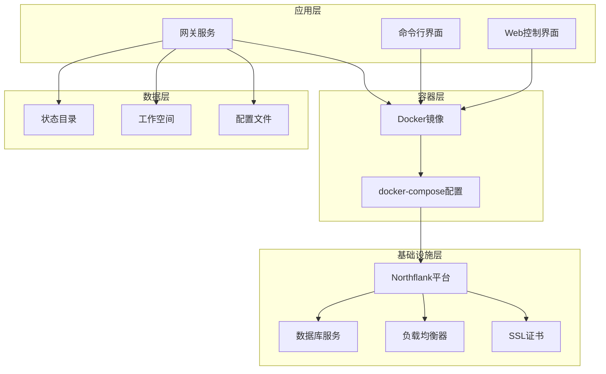
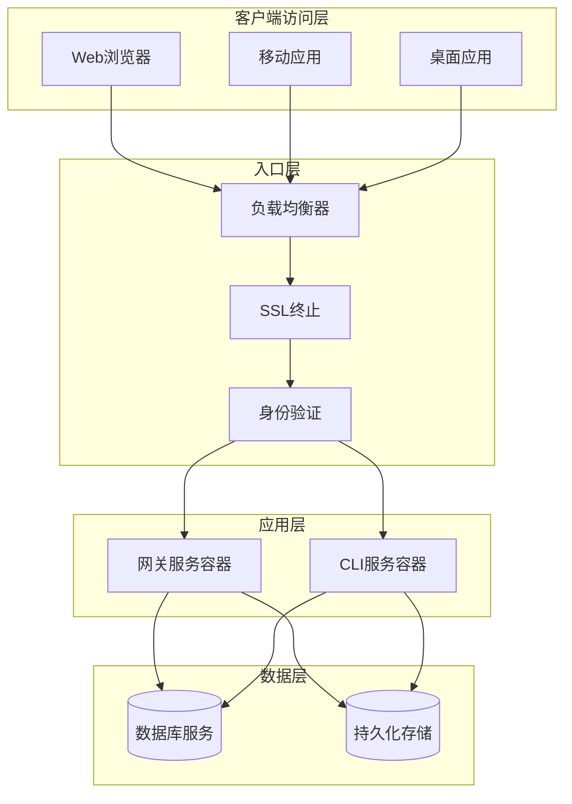
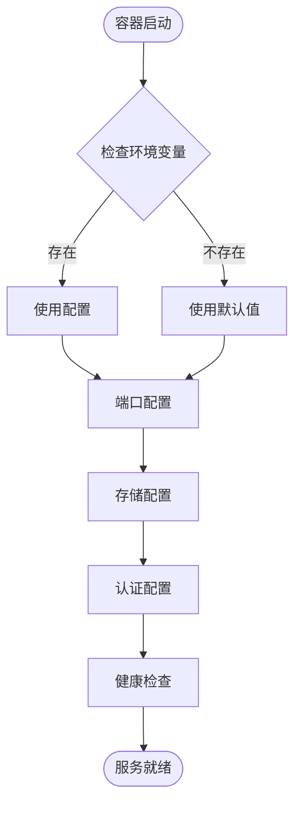
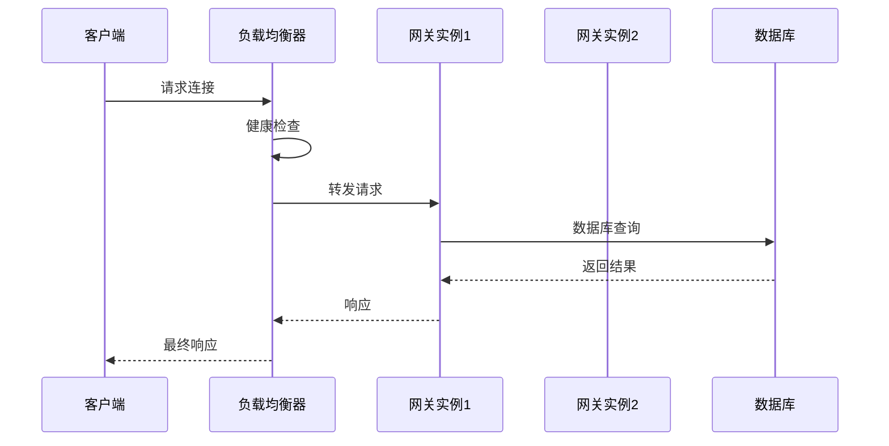
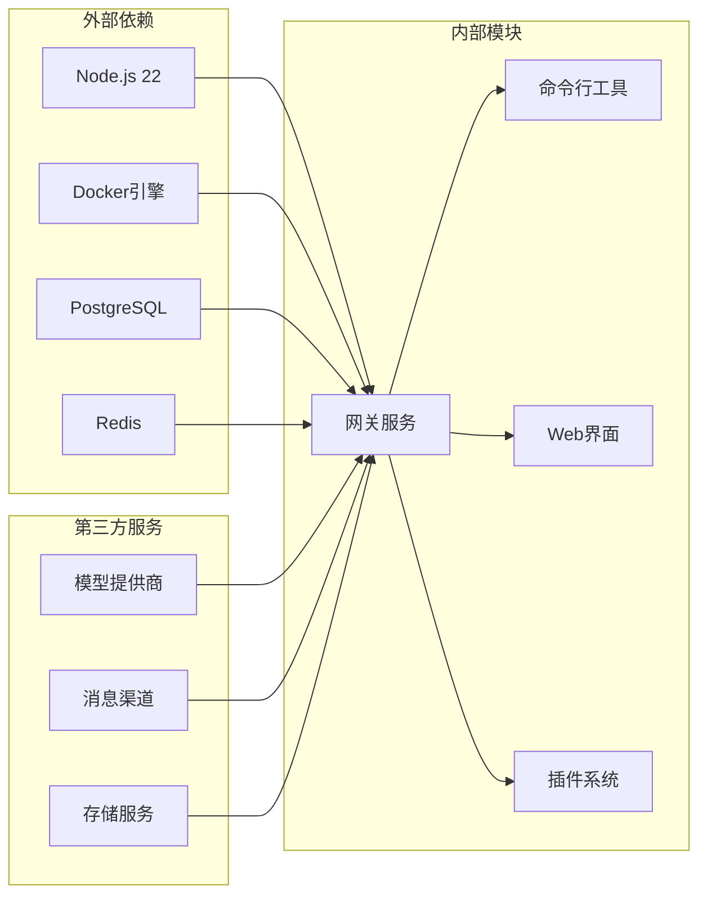

# Northflank部署

<cite>
**本文档引用的文件**
- [README.md](file://README.md)
- [Dockerfile](file://Dockerfile)
- [docker-compose.yml](file://docker-compose.yml)
- [fly.toml](file://fly.toml)
- [render.yaml](file://render.yaml)
- [package.json](file://package.json)
- [docs/vps.md](file://docs/vps.md)
- [docs/install/render.mdx](file://docs/install/render.mdx)
- [docs/zh-CN/install/render.mdx](file://docs/zh-CN/install/render.mdx)
</cite>

## 目录

1. [简介](#简介)
2. [项目结构](#项目结构)
3. [核心组件](#核心组件)
4. [架构概览](#架构概览)
5. [详细组件分析](#详细组件分析)
6. [依赖关系分析](#依赖关系分析)
7. [性能考虑](#性能考虑)
8. [故障排除指南](#故障排除指南)
9. [结论](#结论)
10. [附录](#附录)

## 简介

本指南面向在Northflank平台上部署OpenClaw的用户，提供从应用模板选择、容器配置到网络设置的完整部署流程。Northflank作为欧洲本土化的云平台，具备以下优势：

- 合规性保障：支持欧盟GDPR等法规要求，数据处理符合欧洲法律框架
- 本地化服务：欧洲数据中心，满足低延迟和数据主权需求
- 一体化工具链：提供容器编排、数据库集成、负载均衡和SSL证书管理的一站式解决方案
- 多区域部署：支持欧洲多区域部署，便于灾难恢复和高可用架构

OpenClaw是一个个人AI助手平台，通过单一网关控制平面连接多个消息渠道，支持跨平台设备和扩展功能。

## 项目结构

OpenClaw项目采用模块化设计，包含以下关键组件：

**图表来源**

- [Dockerfile](file://Dockerfile#L1-L73)
- [docker-compose.yml](file://docker-compose.yml#L1-L47)
- [package.json](file://package.json#L1-L268)

**章节来源**

- [README.md](file://README.md#L1-L556)
- [Dockerfile](file://Dockerfile#L1-L73)
- [docker-compose.yml](file://docker-compose.yml#L1-L47)

## 核心组件

OpenClaw的核心组件包括网关服务、命令行界面和Web控制界面，所有组件都通过Docker容器化部署：

### 网关服务

- **端口配置**：默认绑定18789端口，支持loopback和lan模式
- **认证机制**：支持令牌认证和密码认证
- **安全配置**：非root用户运行，减少攻击面
- **持久化存储**：使用/data目录进行状态和工作空间存储

### 容器配置

- **基础镜像**：基于Node.js 22官方镜像
- **包管理**：支持npm、pnpm和bun
- **浏览器支持**：可选安装Chromium和Xvfb
- **内存优化**：设置最大堆内存为2048MB

### 数据持久化

- **状态目录**：/data/.openclaw
- **工作空间**：/data/workspace
- **配置文件**：~/.openclaw目录
- **卷挂载**：支持主机目录映射

**章节来源**

- [Dockerfile](file://Dockerfile#L1-L73)
- [docker-compose.yml](file://docker-compose.yml#L1-L47)
- [README.md](file://README.md#L318-L432)

## 架构概览

OpenClaw在Northflank平台上的部署架构采用容器化微服务模式：

**图表来源**

- [fly.toml](file://fly.toml#L1-L35)
- [render.yaml](file://render.yaml#L1-L22)
- [docker-compose.yml](file://docker-compose.yml#L1-L47)

## 详细组件分析

### 应用模板选择

在Northflank平台上，OpenClaw提供了多种应用模板供选择：

#### Web应用模板

- **类型**：web
- **运行时**：Docker
- **计划**：starter（适合开发和测试）
- **健康检查**：/health路径
- **端口配置**：8080端口

#### 容器模板

- **基础镜像**：Node.js 22
- **工作目录**：/app
- **启动命令**：gateway服务
- **环境变量**：支持多种配置参数

#### 数据库模板

- **PostgreSQL**：支持关系型数据存储
- **Redis**：支持缓存和会话存储
- **MongoDB**：支持文档型数据存储

**章节来源**

- [render.yaml](file://render.yaml#L1-L22)
- [docs/install/render.mdx](file://docs/install/render.mdx#L26-L63)

### 容器配置详解

OpenClaw的容器配置具有以下特点：

#### 环境变量配置

**图表来源**

- [docker-compose.yml](file://docker-compose.yml#L4-L18)

#### 存储配置

- **状态目录**：/data/.openclaw
- **工作空间**：/data/workspace
- **持久化**：使用卷挂载确保数据持久性
- **备份策略**：支持定期备份和快照

#### 网络配置

- **端口映射**：18789:18789（网关）、18790:18790（桥接）
- **绑定模式**：支持loopback和lan模式
- **安全绑定**：默认绑定到127.0.0.1

**章节来源**

- [docker-compose.yml](file://docker-compose.yml#L1-L47)
- [Dockerfile](file://Dockerfile#L59-L73)

### 网络设置配置

OpenClaw在网络设置方面提供了灵活的配置选项：

#### 负载均衡配置

**图表来源**

- [fly.toml](file://fly.toml#L20-L26)

#### SSL证书配置

- **自动证书**：支持Let's Encrypt自动签发
- **手动上传**：支持自定义证书上传
- **证书验证**：自动证书续期和验证
- **安全传输**：强制HTTPS和HSTS头

#### 认证配置

- **令牌认证**：OPENCLAW_GATEWAY_TOKEN
- **密码认证**：OPENCLAW_GATEWAY_PASSWORD
- **API密钥**：支持多种模型提供商API密钥
- **会话管理**：基于JWT的会话令牌

**章节来源**

- [fly.toml](file://fly.toml#L10-L16)
- [docker-compose.yml](file://docker-compose.yml#L4-L11)

### 数据库服务集成

OpenClaw支持多种数据库服务集成：

#### 关系型数据库

- **PostgreSQL**：支持复杂查询和事务处理
- **MySQL**：兼容性强，生态完善
- **SQLite**：轻量级，适合开发环境

#### 缓存数据库

- **Redis**：高性能键值存储
- **Memcached**：分布式缓存系统
- **ElastiCache**：AWS托管缓存服务

#### 文档数据库

- **MongoDB**：灵活的文档存储
- **Cassandra**：高可用分布式数据库
- **DynamoDB**：AWS托管NoSQL数据库

**章节来源**

- [README.md](file://README.md#L318-L432)

### 备份策略

OpenClaw提供了多层次的备份策略：

#### 自动备份

- **定时任务**：每日自动备份
- **增量备份**：只备份变更数据
- **压缩存储**：节省存储空间
- **多点备份**：支持多地备份

#### 手动备份

- **即时备份**：支持手动触发备份
- **全量备份**：完整数据备份
- **差异备份**：基于上次备份的差异
- **恢复测试**：定期测试备份恢复

#### 备份存储

- **本地存储**：服务器本地存储
- **云存储**：对象存储服务
- **离线存储**：磁带或光盘存储
- **异地存储**：跨地域备份

**章节来源**

- [README.md](file://README.md#L442-L448)

## 依赖关系分析

**图表来源**

- [package.json](file://package.json#L151-L206)
- [Dockerfile](file://Dockerfile#L1-L73)

**章节来源**

- [package.json](file://package.json#L1-L268)
- [Dockerfile](file://Dockerfile#L1-L73)

## 性能考虑

在Northflank平台上部署OpenClaw时需要考虑以下性能因素：

### 资源规划

- **CPU资源**：根据并发连接数和消息处理量规划
- **内存资源**：Node.js进程内存使用和容器内存限制
- **存储IOPS**：数据库和文件系统的I/O性能
- **网络带宽**：消息通道的实时通信需求

### 扩展策略

- **水平扩展**：增加网关实例数量
- **垂直扩展**：提升单实例资源配置
- **数据库扩展**：读写分离和分片策略
- **缓存扩展**：分布式缓存集群

### 监控指标

- **响应时间**：API和WebSocket响应延迟
- **吞吐量**：每秒处理的消息数量
- **错误率**：系统错误和异常比例
- **资源利用率**：CPU、内存、存储使用率

## 故障排除指南

常见部署问题及解决方案：

### 启动失败

**问题**：容器无法启动
**原因**：端口冲突、权限不足、配置错误
**解决**：

1. 检查端口占用情况
2. 验证用户权限设置
3. 确认配置文件语法正确
4. 查看容器日志输出

### 连接超时

**问题**：客户端无法连接网关
**原因**：网络配置错误、防火墙阻拦、SSL证书问题
**解决**：

1. 检查网络ACL和安全组规则
2. 验证SSL证书有效性
3. 确认防火墙放行相关端口
4. 测试本地连接连通性

### 性能问题

**问题**：系统响应缓慢
**原因**：资源不足、数据库瓶颈、缓存失效
**解决**：

1. 升级资源配置
2. 优化数据库查询
3. 调整缓存策略
4. 实施负载均衡

**章节来源**

- [README.md](file://README.md#L442-L448)

## 结论

Northflank平台为OpenClaw提供了理想的部署环境，结合其欧洲本土化优势和合规性保障，能够满足企业级应用的需求。通过合理的应用模板选择、容器配置和网络设置，可以实现高可用、可扩展的AI助手服务。

关键成功因素包括：

- 选择合适的应用模板和资源配置
- 实施完善的备份和灾难恢复策略
- 配置负载均衡和SSL证书
- 建立有效的监控告警体系
- 制定成本优化和资源规划方案

## 附录

### 北美flank平台优势对比

- **合规性**：符合GDPR和CCPA等法规要求
- **性能**：欧洲数据中心提供低延迟服务
- **安全性**：端到端加密和安全审计
- **可用性**：SLA保证和自动故障转移
- **支持**：24/7技术支持和社区生态

### 成本优化建议

- **资源优化**：根据实际使用情况调整资源配置
- **存储优化**：实施数据生命周期管理和压缩
- **网络优化**：使用CDN和智能路由
- **监控优化**：精细化监控指标和告警阈值
- **维护优化**：自动化运维和批量更新

### 定价模型说明

- **按小时计费**：基于实际使用时间和资源规格
- **预留实例**：长期使用可享受折扣
- **存储费用**：按实际使用的存储空间收费
- **网络流量**：按出站和入站流量计费
- **额外服务**：备份、监控等增值服务单独计费

**章节来源**

- [docs/vps.md](file://docs/vps.md#L1-L35)
- [docs/install/render.mdx](file://docs/install/render.mdx#L1-L75)
- [docs/zh-CN/install/render.mdx](file://docs/zh-CN/install/render.mdx#L1-L75)
